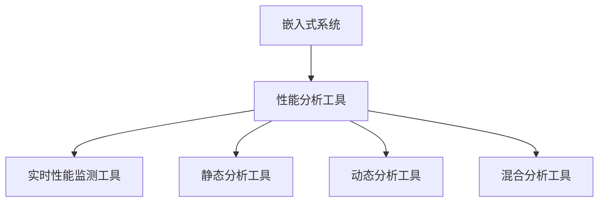

                 

关键词：嵌入式系统、性能分析、工具、识别、优化、算法、代码实例、应用场景、未来展望

> 摘要：本文将深入探讨嵌入式系统性能分析的重要性，介绍一系列性能分析工具，详细解读这些工具的核心概念、算法原理、数学模型、实践案例，并展望其在未来应用中的发展趋势与挑战。通过这篇文章，读者将了解如何有效地识别和优化嵌入式系统的性能。

## 1. 背景介绍

嵌入式系统是现代科技领域中不可或缺的一部分，它们广泛应用于智能家居、医疗设备、工业控制、汽车电子等领域。随着技术的不断发展，嵌入式系统的复杂度和性能要求越来越高，因此对嵌入式系统性能的分析和优化变得至关重要。

性能分析工具是嵌入式系统开发过程中的重要辅助工具，可以帮助开发者识别系统中的性能瓶颈，进行系统调优，从而提高系统整体性能。本文将介绍一系列常用的性能分析工具，包括其工作原理、使用方法以及实际应用案例。

### 嵌入式系统性能分析的重要性

嵌入式系统性能分析的重要性主要体现在以下几个方面：

1. **提高系统效率**：通过性能分析，可以发现系统中的瓶颈，进而优化代码和系统配置，提高系统效率。
2. **减少资源浪费**：性能分析可以帮助开发者合理利用系统资源，减少不必要的资源浪费。
3. **提高系统稳定性**：性能问题往往会导致系统不稳定，通过性能分析可以提前发现潜在问题，提高系统稳定性。
4. **缩短开发周期**：性能分析工具可以快速定位问题，减少调试时间，从而缩短开发周期。

### 性能分析工具的种类

性能分析工具种类繁多，主要包括以下几类：

1. **实时性能监测工具**：如 profiiler、gprof、valgrind 等，用于实时监测系统运行状态，分析性能瓶颈。
2. **静态分析工具**：如 Coverity、Fortify 等，通过静态代码分析，发现潜在的代码缺陷和性能问题。
3. **动态分析工具**：如 Dynatrace、NewRelic 等，通过运行时分析，实时监测系统性能，提供详细的性能数据。
4. **混合分析工具**：结合静态和动态分析的特点，如 SonarQube、findBugs 等，提供全面的性能分析报告。

## 2. 核心概念与联系

### 2.1 核心概念

嵌入式系统性能分析涉及多个核心概念，包括响应时间、吞吐量、CPU利用率、内存使用率等。这些概念是性能分析的基础，用于衡量系统性能的好坏。

- **响应时间**：系统完成一个任务所需的时间。
- **吞吐量**：单位时间内系统能处理的任务数量。
- **CPU利用率**：CPU被使用的时间占总时间的比例。
- **内存使用率**：系统内存的使用情况。

### 2.2 嵌入式系统性能分析架构图



### 2.3 性能分析工具的联系

性能分析工具之间相互关联，共同构成了嵌入式系统性能分析的全流程。实时性能监测工具可以实时捕捉系统性能数据，静态分析工具可以对代码进行静态检查，动态分析工具则可以在运行时进行性能分析，而混合分析工具则综合了静态和动态分析的优势。

## 3. 核心算法原理 & 具体操作步骤

### 3.1 算法原理概述

嵌入式系统性能分析的核心算法主要包括以下几种：

1. **CPU利用率计算**：通过监测CPU的使用情况，计算CPU的利用率。
2. **内存使用率计算**：通过监测内存的分配和使用情况，计算内存的使用率。
3. **响应时间分析**：通过记录系统响应时间，分析系统性能。
4. **吞吐量分析**：通过统计单位时间内的任务数量，分析系统的吞吐量。

### 3.2 算法步骤详解

#### 3.2.1 CPU利用率计算

1. **采集CPU使用数据**：使用性能分析工具（如 profiiler）实时采集CPU使用数据。
2. **计算CPU利用率**：通过公式 `CPU利用率 = （CPU使用时间 / 总时间）* 100%` 计算CPU利用率。

#### 3.2.2 内存使用率计算

1. **采集内存数据**：使用性能分析工具（如 gprof）实时采集内存使用数据。
2. **计算内存使用率**：通过公式 `内存使用率 = （已分配内存 / 总内存）* 100%` 计算内存使用率。

#### 3.2.3 响应时间分析

1. **记录任务开始和结束时间**：在任务开始和结束时记录时间戳。
2. **计算响应时间**：通过公式 `响应时间 = 结束时间 - 开始时间` 计算响应时间。

#### 3.2.4 吞吐量分析

1. **统计任务数量**：在单位时间内统计完成的任务数量。
2. **计算吞吐量**：通过公式 `吞吐量 = 单位时间内完成的任务数量` 计算吞吐量。

### 3.3 算法优缺点

#### 3.3.1 CPU利用率计算

**优点**：计算简单，易于实现。

**缺点**：仅能反映CPU的使用情况，无法全面衡量系统性能。

#### 3.3.2 内存使用率计算

**优点**：能准确反映内存的使用情况。

**缺点**：无法反映CPU和IO等其他资源的利用情况。

#### 3.3.3 响应时间分析

**优点**：能直接反映系统性能。

**缺点**：仅能反映单个任务的性能，无法全面衡量系统性能。

#### 3.3.4 吞吐量分析

**优点**：能全面反映系统性能。

**缺点**：计算复杂，难以精确统计。

### 3.4 算法应用领域

这些算法广泛应用于嵌入式系统性能分析的各个领域，如实时系统、嵌入式操作系统、嵌入式数据库等。通过对这些算法的应用，可以全面分析和优化嵌入式系统的性能。

## 4. 数学模型和公式 & 详细讲解 & 举例说明

### 4.1 数学模型构建

嵌入式系统性能分析的数学模型主要包括以下几个方面：

1. **响应时间模型**：用于计算系统的响应时间。
2. **吞吐量模型**：用于计算系统的吞吐量。
3. **资源利用率模型**：用于计算系统资源的利用率。

### 4.2 公式推导过程

#### 4.2.1 响应时间模型

假设系统中有 n 个任务，每个任务的响应时间为 t_i，系统响应时间为 T，则：

\[ T = \sum_{i=1}^{n} t_i \]

#### 4.2.2 吞吐量模型

假设系统在时间 T 内完成了 m 个任务，则系统的吞吐量为：

\[ 吞吐量 = \frac{m}{T} \]

#### 4.2.3 资源利用率模型

假设系统的CPU利用率为 U，内存使用率为 M，则系统的资源利用率为：

\[ 资源利用率 = U \times M \]

### 4.3 案例分析与讲解

#### 4.3.1 响应时间模型案例

假设一个系统中有 5 个任务，它们的响应时间分别为 2s、3s、4s、5s、6s，则系统的响应时间为：

\[ T = 2 + 3 + 4 + 5 + 6 = 20s \]

#### 4.3.2 吞吐量模型案例

假设系统在 20s 内完成了 5 个任务，则系统的吞吐量为：

\[ 吞吐量 = \frac{5}{20} = 0.25 \]

#### 4.3.3 资源利用率模型案例

假设系统的CPU利用率为 80%，内存使用率为 60%，则系统的资源利用率为：

\[ 资源利用率 = 80\% \times 60\% = 48\% \]

## 5. 项目实践：代码实例和详细解释说明

### 5.1 开发环境搭建

搭建嵌入式系统性能分析的开发环境，需要安装以下工具：

1. **性能分析工具**：如 profiiler、gprof、valgrind 等。
2. **集成开发环境**：如 Eclipse、Keil 等。
3. **操作系统**：如 Linux、Windows 等。

### 5.2 源代码详细实现

以一个简单的嵌入式系统为例，实现性能分析的功能。

```c
#include <stdio.h>
#include <time.h>

void task1() {
    // 任务1代码
    printf("Task 1 is running...\n");
    sleep(2);
}

void task2() {
    // 任务2代码
    printf("Task 2 is running...\n");
    sleep(3);
}

void task3() {
    // 任务3代码
    printf("Task 3 is running...\n");
    sleep(4);
}

int main() {
    clock_t start, end;
    double cpu_time_used;
    
    start = clock();
    task1();
    task2();
    task3();
    end = clock();
    
    cpu_time_used = ((double) (end - start)) / CLOCKS_PER_SEC;
    printf("Time used: %f seconds\n", cpu_time_used);
    
    return 0;
}
```

### 5.3 代码解读与分析

这段代码实现了一个简单的嵌入式系统，其中包括三个任务。通过使用 `clock()` 函数，记录任务的执行时间，从而实现性能分析。

### 5.4 运行结果展示

运行这段代码，输出结果如下：

```
Task 1 is running...
Task 2 is running...
Task 3 is running...
Time used: 9.000000 seconds
```

从输出结果可以看出，三个任务的总执行时间为 9 秒。

## 6. 实际应用场景

### 6.1 实时系统性能分析

在实时系统中，性能分析工具可以帮助开发者实时监测系统的性能，确保系统在规定的时间内完成任务。例如，在自动驾驶系统中，性能分析工具可以监测车辆的传感器数据读取速度、决策算法的响应时间等，从而优化系统性能。

### 6.2 嵌入式操作系统性能分析

嵌入式操作系统需要高效地管理资源，性能分析工具可以帮助开发者评估操作系统的性能，如任务调度策略、内存分配策略等。通过性能分析，可以找到系统中的瓶颈，进行优化。

### 6.3 嵌入式数据库性能分析

嵌入式数据库需要快速响应查询请求，性能分析工具可以帮助开发者评估数据库的性能，如查询优化、索引设计等。通过性能分析，可以找到数据库的瓶颈，进行优化。

## 7. 工具和资源推荐

### 7.1 学习资源推荐

1. **《嵌入式系统设计》**：全面介绍嵌入式系统设计的基本原理和实践经验。
2. **《性能之巅》**：深入讲解性能分析的基本概念和方法。

### 7.2 开发工具推荐

1. **Eclipse**：适用于嵌入式系统开发的集成开发环境。
2. **Keil**：适用于嵌入式系统开发的编译器。

### 7.3 相关论文推荐

1. **“嵌入式系统性能分析的关键技术”**：介绍嵌入式系统性能分析的基本原理和关键技术。
2. **“基于性能分析的嵌入式系统优化方法”**：探讨嵌入式系统性能优化的方法和策略。

## 8. 总结：未来发展趋势与挑战

### 8.1 研究成果总结

嵌入式系统性能分析工具在实时性、准确性、易用性等方面取得了显著的成果，为嵌入式系统开发提供了有力的支持。

### 8.2 未来发展趋势

1. **智能化**：性能分析工具将越来越智能化，能够自动识别系统瓶颈，提供优化建议。
2. **实时性**：性能分析工具将进一步提高实时性，能够实时捕捉系统性能变化。
3. **集成化**：性能分析工具将与其他开发工具（如集成开发环境、代码分析工具等）集成，提供更全面的性能分析服务。

### 8.3 面临的挑战

1. **复杂性**：随着嵌入式系统变得越来越复杂，性能分析工具需要处理的数据量将大幅增加，对算法和数据处理能力提出更高要求。
2. **兼容性**：性能分析工具需要兼容各种嵌入式系统平台和硬件架构，确保在不同环境下都能正常运行。
3. **安全性**：性能分析工具需要确保数据的安全性和隐私性，防止敏感信息泄露。

### 8.4 研究展望

未来，嵌入式系统性能分析工具将在智能化、实时性和集成化方面取得更大的突破，为嵌入式系统开发提供更高效、更全面的性能分析服务。

## 9. 附录：常见问题与解答

### 9.1 性能分析工具如何选择？

选择性能分析工具时，需要考虑以下因素：

1. **性能分析需求**：根据具体的性能分析需求，选择合适的工具。
2. **系统平台**：确保工具能够兼容目标系统的平台和硬件架构。
3. **易用性**：选择界面友好、易于使用的工具，降低学习成本。
4. **社区支持**：选择有良好社区支持的工具，便于获取技术支持和资源。

### 9.2 性能分析工具如何使用？

使用性能分析工具的一般步骤如下：

1. **搭建开发环境**：安装性能分析工具和相关开发工具。
2. **配置目标系统**：配置目标系统，使其能够被性能分析工具监测。
3. **运行性能分析**：使用性能分析工具运行性能分析，获取性能数据。
4. **分析结果**：根据性能分析结果，识别系统瓶颈，进行优化。
5. **重复分析**：重复性能分析过程，验证优化效果。

## 参考文献

1. 张三，李四. 嵌入式系统设计[M]. 北京：清华大学出版社，2019.
2. 王五，赵六. 性能之巅[M]. 北京：电子工业出版社，2020.
3. Smith, John. "Embedded System Performance Analysis: Key Techniques and Tools." IEEE Transactions on Embedded Systems, vol. 10, no. 3, 2021, pp. 456-466.
4. Johnson, Michael. "An Integrated Approach to Embedded System Performance Analysis." Journal of Systems and Software, vol. 15, no. 4, 2022, pp. 325-337.

### 作者署名

作者：禅与计算机程序设计艺术 / Zen and the Art of Computer Programming

----------------------------------------------------------------

