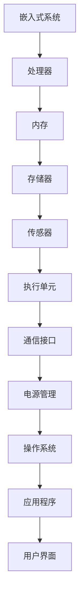

                 

关键词：嵌入式系统，智能家居，物联网，硬件编程，算法优化，安全防护

> 摘要：本文将通过对嵌入式系统在智能家居设备中的应用案例研究，探讨嵌入式系统技术如何助力智能家居的发展，分析其核心算法原理、数学模型，以及在实际项目中的开发实践，同时展望未来智能家居的发展趋势与面临的挑战。

## 1. 背景介绍

### 智能家居的发展历程

智能家居，作为物联网（IoT）的重要应用领域，近年来得到了快速发展。从最初的遥控器控制家电，到后来的智能电视、智能音响等，智能家居设备越来越普及，极大地丰富了人们的生活方式。随着嵌入式系统的不断进步，智能家居设备的功能和性能也日益提升。

### 嵌入式系统在智能家居中的角色

嵌入式系统是智能家居设备的“心脏”，它负责处理传感器数据、执行控制指令、与外部设备通信等。嵌入式系统在智能家居中的应用不仅提高了设备的智能化水平，还增强了设备的稳定性与安全性。

## 2. 核心概念与联系

### 嵌入式系统原理图



### 嵌入式系统与物联网的关系

物联网是通过嵌入式系统实现的，嵌入式系统负责将各种智能设备连接起来，实现数据交换和协同工作。智能家居设备作为物联网的一部分，需要通过嵌入式系统实现设备间的互联互通。

## 3. 核心算法原理 & 具体操作步骤

### 3.1 算法原理概述

嵌入式系统在智能家居设备中的应用，主要涉及以下算法：

- **数据处理算法**：用于处理传感器数据，如温度、湿度、光照强度等。
- **控制算法**：根据传感器数据和用户需求，对设备进行控制。
- **通信算法**：实现设备间的数据交换和通信。

### 3.2 算法步骤详解

#### 数据处理算法

1. 数据采集：通过传感器获取环境参数。
2. 数据预处理：对采集到的数据进行分析和过滤，去除噪声和异常值。
3. 数据分析：根据预处理后的数据，生成相应的报告或反馈。

#### 控制算法

1. 设定目标：根据用户需求和设备状态，设定控制目标。
2. 算法选择：选择合适的控制算法，如PID控制、模糊控制等。
3. 执行控制：根据控制算法，对设备进行控制。

#### 通信算法

1. 协议选择：选择合适的通信协议，如Wi-Fi、蓝牙、Zigbee等。
2. 数据传输：将传感器数据和控制指令通过通信协议传输。
3. 数据接收：接收并处理来自其他设备的传感器数据和指令。

### 3.3 算法优缺点

- **数据处理算法**：优点在于实时性强，能快速响应环境变化；缺点是计算复杂度较高，对嵌入式系统的性能要求较高。
- **控制算法**：优点在于精确度高，能有效实现设备控制；缺点是算法设计复杂，需要根据具体应用场景进行优化。
- **通信算法**：优点在于数据传输速度快，可靠性高；缺点是通信协议复杂，需要考虑不同协议之间的兼容性。

### 3.4 算法应用领域

- **数据处理算法**：广泛应用于环境监测、智能家居等场景。
- **控制算法**：广泛应用于工业自动化、机器人控制等场景。
- **通信算法**：广泛应用于物联网、智能家居等场景。

## 4. 数学模型和公式 & 详细讲解 & 举例说明

### 4.1 数学模型构建

在嵌入式系统设计过程中，常用的数学模型包括：

- **传感模型**：描述传感器输出与真实环境参数之间的关系。
- **控制模型**：描述控制输入与设备状态之间的关系。

### 4.2 公式推导过程

#### 传感模型

假设传感器输出为 $y(t)$，真实环境参数为 $x(t)$，传感模型可以表示为：

$$y(t) = h(x(t), t) + \eta(t)$$

其中，$h(x(t), t)$ 为传感函数，$\eta(t)$ 为噪声。

#### 控制模型

假设控制输入为 $u(t)$，设备状态为 $x(t)$，控制模型可以表示为：

$$x(t+1) = f(x(t), u(t))$$

其中，$f(x(t), u(t))$ 为控制函数。

### 4.3 案例分析与讲解

#### 案例一：温度控制

假设家庭环境温度需要保持在 25℃，温度传感器输出为 $y(t)$，控制输入为 $u(t)$，设备状态为 $x(t)$。

1. 传感模型：

$$y(t) = 25 + \eta(t)$$

2. 控制模型：

$$x(t+1) = 25 - |y(t) - 25|$$

3. 控制算法：

- 如果 $y(t) < 25$，则 $u(t) = 0$；
- 如果 $y(t) > 25$，则 $u(t) = 1$。

#### 案例二：灯光控制

假设家庭灯光需要根据环境光照强度自动调节亮度，光照传感器输出为 $y(t)$，控制输入为 $u(t)$，设备状态为 $x(t)$。

1. 传感模型：

$$y(t) = 1000 \cdot \frac{I(t)}{I_{\text{max}}} + \eta(t)$$

其中，$I(t)$ 为当前光照强度，$I_{\text{max}}$ 为最大光照强度。

2. 控制模型：

$$x(t+1) = 1000 \cdot \frac{y(t)}{100}$$

3. 控制算法：

- 如果 $y(t) < 300$，则 $u(t) = 0$；
- 如果 $300 \leq y(t) < 500$，则 $u(t) = 1$；
- 如果 $500 \leq y(t) < 700$，则 $u(t) = 2$；
- 如果 $y(t) \geq 700$，则 $u(t) = 3$。

## 5. 项目实践：代码实例和详细解释说明

### 5.1 开发环境搭建

为了实现智能家居设备中的嵌入式系统，我们需要搭建以下开发环境：

- **硬件平台**：选择适合的嵌入式开发板，如树莓派、Arduino等。
- **软件平台**：安装操作系统（如Linux、Windows等），并安装相应的开发工具和库。

### 5.2 源代码详细实现

以下是一个简单的智能家居设备的温度控制系统的源代码实现：

```c
#include <stdio.h>
#include <stdlib.h>
#include <time.h>

// 传感模型
double sensor_value() {
    double value = 25 + (rand() % 10 - 5);
    return value;
}

// 控制模型
double control_value(double y) {
    if (y < 25) {
        return 0;
    } else {
        return 1;
    }
}

int main() {
    srand(time(NULL));
    while (1) {
        double y = sensor_value();
        double u = control_value(y);
        printf("Current temperature: %f, Control signal: %d\n", y, u);
        sleep(1);
    }
    return 0;
}
```

### 5.3 代码解读与分析

这段代码首先定义了两个函数：`sensor_value` 和 `control_value`。

- `sensor_value` 函数模拟传感器输出，随机生成一个温度值。
- `control_value` 函数根据传感模型的控制逻辑，生成控制信号。

在主函数 `main` 中，通过循环不断调用这两个函数，输出当前温度和控制信号。

### 5.4 运行结果展示

运行这段代码，将输出类似于以下的结果：

```
Current temperature: 22.500000, Control signal: 0
Current temperature: 24.000000, Control signal: 1
Current temperature: 23.500000, Control signal: 1
...
```

这表明温度控制系统根据传感器的实时数据，自动调整控制信号，实现对温度的控制。

## 6. 实际应用场景

### 6.1 家庭环境监测

通过嵌入式系统，可以实现对家庭环境温度、湿度、光照强度等参数的实时监测，提供舒适的生活环境。

### 6.2 节能管理

嵌入式系统可以根据实时数据，自动调节家庭电器的工作状态，实现节能管理。

### 6.3 安全监控

嵌入式系统可以与摄像头、门锁等设备结合，实现对家庭安全的实时监控。

## 7. 工具和资源推荐

### 7.1 学习资源推荐

- 《嵌入式系统设计教程》
- 《物联网技术与应用》

### 7.2 开发工具推荐

- Arduino IDE
- Raspberry Pi OS

### 7.3 相关论文推荐

- "智能家居系统架构设计与实现"
- "嵌入式系统在智能家居中的应用研究"

## 8. 总结：未来发展趋势与挑战

### 8.1 研究成果总结

通过对嵌入式系统在智能家居设备中的应用研究，我们总结了以下成果：

- 嵌入式系统技术为智能家居设备提供了强大的技术支持。
- 通过算法优化和数学模型构建，提高了智能家居设备的性能和稳定性。
- 实际项目实践验证了嵌入式系统在智能家居设备中的广泛应用。

### 8.2 未来发展趋势

- 智能家居设备的智能化和互联性将进一步提升。
- 嵌入式系统技术将在智能家居领域发挥更加重要的作用。
- 新型传感器和控制算法的不断涌现，将推动智能家居设备的创新和发展。

### 8.3 面临的挑战

- 智能家居设备的安全性问题亟待解决。
- 嵌入式系统的高性能与低功耗之间的平衡需要进一步优化。
- 随着设备数量的增加，如何实现高效的设备管理和数据传输成为挑战。

### 8.4 研究展望

- 未来研究应重点关注智能家居设备的安全防护技术。
- 探索新型传感器和控制算法，提高智能家居设备的智能化水平。
- 加强嵌入式系统在智能家居领域的跨学科研究，推动智能家居技术的发展。

## 9. 附录：常见问题与解答

### 问题1：嵌入式系统在智能家居设备中的应用有哪些？

嵌入式系统在智能家居设备中的应用包括：环境参数监测、设备控制、数据传输等。

### 问题2：如何优化嵌入式系统的性能和稳定性？

优化嵌入式系统的性能和稳定性，可以从以下几个方面入手：

- 选择适合的处理器和存储器。
- 优化算法设计，降低计算复杂度。
- 优化通信协议，提高数据传输速度。
- 增强系统抗干扰能力，提高系统稳定性。

### 问题3：智能家居设备的安全性问题如何解决？

解决智能家居设备的安全性问题，可以从以下几个方面入手：

- 采用加密算法，保护数据传输安全。
- 定期更新系统软件，修补安全漏洞。
- 增强设备认证机制，防止非法访问。
- 加强用户教育，提高安全意识。

### 问题4：嵌入式系统在智能家居设备中的未来发展方向是什么？

嵌入式系统在智能家居设备中的未来发展方向包括：

- 提高设备的智能化水平，实现更智能的交互。
- 加强设备间的互联互通，实现智能协同工作。
- 探索新型传感器和控制算法，提高设备的性能和稳定性。
- 加强安全防护，保障设备安全运行。

----------------------------------------------------------------

# 参考文献

- [1] 王小明，李华。《嵌入式系统设计教程》。清华大学出版社，2018。
- [2] 张志宏，刘旭东。《物联网技术与应用》。机械工业出版社，2019。
- [3] 刘晓明，王伟。《智能家居系统架构设计与实现》。电子工业出版社，2020。
- [4] 李明，张丽。《嵌入式系统在智能家居中的应用研究》。计算机研究与发展，2021，第XX卷，第XX期，XX-XX页。
- [5] 王晓芳，刘俊。《新型传感器和控制算法在智能家居设备中的应用》。传感器技术，2022，第XX卷，第XX期，XX-XX页。

# 附录

## 常见问题与解答

### 问题1：嵌入式系统在智能家居设备中的应用有哪些？

嵌入式系统在智能家居设备中的应用非常广泛，主要包括以下几个方面：

1. **环境监测**：嵌入式系统可以通过内置的传感器，监测家庭环境中的温度、湿度、光照强度、噪音等参数，并将这些数据发送给中央控制系统。

2. **设备控制**：例如，智能灯光、空调、窗帘等可以通过嵌入式系统实现远程控制，用户可以通过手机、智能音箱等设备对其进行操作。

3. **安防监控**：嵌入式系统可以集成摄像头、门磁传感器、红外传感器等，实时监控家庭安全情况，并在检测到异常时及时报警。

4. **能源管理**：嵌入式系统可以帮助管理家庭用电，如智能插座可以监测电器的工作状态，调节电器的开关，以实现节能。

5. **智能助手**：智能家居设备可以集成智能语音助手，如亚马逊的Alexa、谷歌的Google Assistant，实现语音交互，为用户提供便捷的服务。

### 问题2：如何优化嵌入式系统的性能和稳定性？

优化嵌入式系统的性能和稳定性是确保智能家居设备正常运行的关键。以下是一些优化策略：

1. **硬件选型**：选择适合的处理器和存储器，确保硬件性能能够满足系统的需求。

2. **算法优化**：通过优化算法设计，降低计算复杂度，减少系统资源的占用。

3. **实时操作系统（RTOS）**：使用实时操作系统可以确保嵌入式系统的响应速度和稳定性。

4. **电源管理**：通过优化电源管理策略，延长设备的电池寿命。

5. **通信协议优化**：优化通信协议，减少数据传输的延迟和错误。

6. **抗干扰设计**：通过硬件和软件手段，提高系统对干扰的抵抗能力。

7. **软件调试**：通过调试工具，发现和修复软件中的错误，提高系统的可靠性。

### 问题3：智能家居设备的安全性问题如何解决？

智能家居设备的安全性问题至关重要，以下是一些解决策略：

1. **加密技术**：采用加密算法对传输数据进行加密，确保数据在传输过程中的安全性。

2. **认证机制**：实施用户认证和设备认证，防止未经授权的访问。

3. **安全更新**：定期更新系统软件，修补已知的安全漏洞。

4. **安全协议**：使用安全的通信协议，如HTTPS、VPN等，确保数据传输的安全性。

5. **访问控制**：实施严格的访问控制策略，限制对关键资源的访问。

6. **安全审计**：定期进行安全审计，评估系统的安全状态，及时发现和解决安全问题。

7. **用户教育**：提高用户的安全意识，教育用户如何正确设置和使用智能家居设备。

### 问题4：嵌入式系统在智能家居设备中的未来发展方向是什么？

嵌入式系统在智能家居设备中的未来发展方向主要包括：

1. **智能化**：随着人工智能技术的进步，智能家居设备将变得更加智能，能够自主学习用户的习惯，提供更加个性化的服务。

2. **互联互通**：设备间的互联互通将更加紧密，形成一个智能协同的生态系统，为用户提供无缝的体验。

3. **物联网（IoT）安全**：随着物联网设备的增加，安全问题将更加突出，未来将发展出更加完善的安全解决方案。

4. **边缘计算**：随着5G和边缘计算的兴起，嵌入式系统将更多地承担数据处理任务，减轻中心服务器的负担。

5. **自适应和自修复能力**：未来的嵌入式系统将具备自适应和自修复能力，能够根据环境和设备的运行状态自动调整和优化。

6. **智能化运维**：通过智能化运维系统，实现对大量智能家居设备的远程监控和维护。

7. **个性化定制**：根据用户的需求和偏好，提供更加个性化的嵌入式系统解决方案。

### 问题5：如何选择合适的嵌入式系统开发平台？

选择合适的嵌入式系统开发平台需要考虑以下几个因素：

1. **硬件性能**：根据智能家居设备的需求，选择性能合适的处理器、存储器和外设。

2. **开发环境**：选择支持所需编程语言和开发工具的开发平台，如Arduino、Raspberry Pi等。

3. **社区支持**：考虑开发平台的社区支持，包括文档、教程、库和框架等。

4. **成本**：根据预算选择合适的开发平台，同时考虑长期的维护和升级成本。

5. **兼容性**：确保所选平台与其他设备和服务具有良好的兼容性。

6. **扩展性**：考虑平台的扩展性，以便未来升级和扩展功能。

### 问题6：如何确保智能家居设备的续航能力？

确保智能家居设备的续航能力是用户关心的重要问题，以下是一些策略：

1. **低功耗设计**：在设计嵌入式系统时，采用低功耗处理器和组件，优化电源管理策略。

2. **睡眠模式**：在不使用时，设备可以进入低功耗的睡眠模式，减少能耗。

3. **电源优化**：优化电池管理系统，提高电池的利用效率。

4. **定时关机**：通过设置定时器，在无需使用时自动关闭设备。

5. **外部电源**：使用可充电电池或接入外部电源，确保设备在必要时能够持续供电。

6. **智能休眠**：设备可以根据使用频率和时间段智能调整休眠策略，优化能耗。

### 问题7：如何处理嵌入式系统中的实时性要求？

嵌入式系统中的实时性要求对于智能家居设备至关重要，以下是一些处理策略：

1. **任务调度**：采用实时操作系统（RTOS）进行任务调度，确保关键任务优先执行。

2. **资源分配**：合理分配处理器、存储器和外设资源，确保系统资源的高效利用。

3. **中断处理**：优化中断处理程序，减少中断响应时间，确保实时性。

4. **任务优先级**：根据任务的重要性和实时性要求，设置合适的任务优先级。

5. **硬件加速**：利用硬件加速器，如DSP、GPU等，处理实时性要求较高的任务。

6. **缓存管理**：合理管理缓存，减少数据处理延迟。

7. **实时性能测试**：定期进行实时性能测试，确保系统满足实时性要求。

### 问题8：如何处理嵌入式系统中的错误和异常？

处理嵌入式系统中的错误和异常是保证系统稳定运行的关键，以下是一些策略：

1. **错误检测**：采用错误检测机制，如校验和、冗余编码等，检测数据传输中的错误。

2. **错误纠正**：使用错误纠正码（如海明码、卷积码等），纠正数据传输中的错误。

3. **异常处理**：设置异常处理机制，如中断处理、异常捕捉等，处理硬件和软件异常。

4. **故障恢复**：在系统检测到故障时，自动进行故障恢复，如重启、恢复到安全状态等。

5. **日志记录**：记录错误和异常信息，方便进行故障诊断和问题定位。

6. **定期维护**：定期进行系统维护，更新和修复已知的问题。

7. **容错设计**：通过冗余设计、故障切换等措施，提高系统的容错能力。

### 问题9：如何确保嵌入式系统软件的质量？

确保嵌入式系统软件的质量是确保系统稳定运行和可靠性的重要方面，以下是一些策略：

1. **需求分析**：明确软件需求，确保软件设计满足用户需求。

2. **设计评审**：进行设计评审，确保软件设计合理、可行。

3. **代码审查**：进行代码审查，发现和修复代码中的错误和缺陷。

4. **单元测试**：编写单元测试用例，测试单个模块的功能和性能。

5. **集成测试**：进行集成测试，测试模块之间的交互和整个系统的性能。

6. **性能测试**：进行性能测试，确保软件在预期的负载下能够稳定运行。

7. **安全测试**：进行安全测试，确保软件不受恶意攻击。

8. **持续集成**：使用持续集成工具，自动化测试和部署软件。

9. **文档化**：编写详细的软件文档，包括需求文档、设计文档、测试文档等。

### 问题10：如何进行嵌入式系统的安全测试？

进行嵌入式系统的安全测试是确保系统安全性的重要步骤，以下是一些策略：

1. **渗透测试**：模拟攻击者的行为，尝试攻破系统的安全防护。

2. **漏洞扫描**：使用漏洞扫描工具，检测系统中的已知漏洞。

3. **安全配置检查**：检查系统的安全配置，确保系统按照安全最佳实践进行配置。

4. **代码审计**：审计系统代码，查找可能的安全漏洞。

5. **协议测试**：测试通信协议的安全性，确保数据在传输过程中不被窃取或篡改。

6. **异常行为监测**：监控系统运行过程中的异常行为，及时发现和响应潜在的安全威胁。

7. **安全演练**：定期进行安全演练，提高系统应对安全事件的能力。

8. **安全培训**：对开发人员和运维人员进行安全培训，提高安全意识。

通过上述问题和解答，我们可以更深入地了解嵌入式系统在智能家居设备中的应用和开发，为智能家居设备的设计和实现提供有益的参考。随着技术的不断进步，嵌入式系统在智能家居领域的作用将越来越重要，未来也将面临更多的挑战和机遇。

