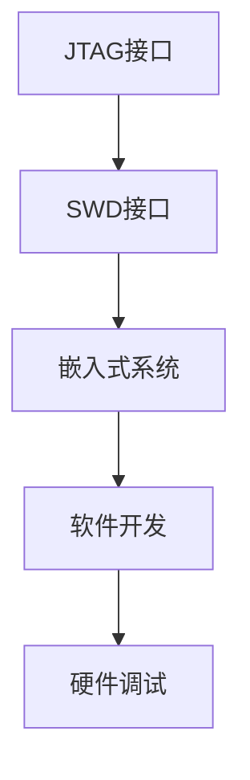

                 

关键词：嵌入式系统，调试技巧，JTAG，SWD，软件开发，硬件调试

摘要：本文将深入探讨嵌入式系统调试中两种重要的调试接口——JTAG 和 SWD 的使用方法、技巧及其优势。通过详细解析 JTAG 和 SWD 的基本原理、接口特性、调试工具选择等，帮助开发者掌握高效的嵌入式调试技术，提升项目开发效率。

## 1. 背景介绍

嵌入式系统作为现代工业、消费电子等领域的重要组成部分，其软件开发和硬件调试的复杂性日益增加。有效的调试技术不仅能够帮助开发者快速定位并解决问题，还能显著提高开发效率。在嵌入式系统中，JTAG（Joint Test Action Group）和 SWD（Serial Wire Debug）是两种广泛使用的调试接口技术。本文将详细介绍这两种调试接口的原理、操作方法及其在嵌入式系统开发中的应用。

## 2. 核心概念与联系

### 2.1 JTAG 简介

JTAG（Joint Test Action Group）是一种标准的嵌入式调试协议，用于芯片级的测试和调试。它起源于 1980 年代，由 JTAG 协议联盟定义。JTAG 接口由一组引脚组成，通常包括 TMS（测试模式选择）、TCK（测试时钟）、TDI（测试数据输入）和 TDO（测试数据输出）等。通过这些引脚，JTAG 可以实现嵌入式系统的远程测试、编程和调试。

### 2.2 SWD 简介

SWD（Serial Wire Debug）是 JTAG 协议的替代品，旨在简化调试接口并提高调试速度。SWD 只需要两根信号线：SWDIO（串行数据线）和 SWCLK（串行时钟线）。相比 JTAG，SWD 具有更低的功耗、更高的通信速度和更好的信号完整性。

### 2.3 JTAG 和 SWD 的联系与区别

JTAG 和 SWD 在功能上类似，都是用于嵌入式系统的调试和测试。但它们在接口数量、通信速度和适用场景上有所不同。JTAG 使用四根信号线，适合复杂芯片的调试；而 SWD 只需要两根信号线，更适合简单的嵌入式系统。

### 2.4 Mermaid 流程图



## 3. 核心算法原理 & 具体操作步骤

### 3.1 算法原理概述

JTAG 和 SWD 的核心原理是通过串行通信接口，实现对嵌入式系统的控制、测试和调试。JTAG 使用四线接口，通过 TDI、TDO、TMS 和 TCK 信号实现数据传输和控制。SWD 使用两线接口，通过 SWDIO 和 SWCLK 信号实现数据传输和控制。

### 3.2 算法步骤详解

#### 3.2.1 JTAG 调试步骤

1. **连接调试器**：将 JTAG 调试器连接到目标嵌入式系统的 JTAG 接口。
2. **初始化**：通过调试器发送特定的初始化序列，使目标嵌入式系统进入调试模式。
3. **下载程序**：将程序代码下载到目标嵌入式系统中。
4. **运行调试**：通过调试器单步执行代码，分析问题并定位错误。

#### 3.2.2 SWD 调试步骤

1. **连接调试器**：将 SWD 调试器连接到目标嵌入式系统的 SWD 接口。
2. **初始化**：通过调试器发送特定的初始化序列，使目标嵌入式系统进入调试模式。
3. **下载程序**：将程序代码下载到目标嵌入式系统中。
4. **运行调试**：通过调试器单步执行代码，分析问题并定位错误。

### 3.3 算法优缺点

#### 3.3.1 JTAG 优缺点

**优点**：

- 支持多种芯片和平台。
- 适用于复杂芯片的测试和调试。

**缺点**：

- 需要四根信号线，接口较复杂。
- 通信速度相对较慢。

#### 3.3.2 SWD 优缺点

**优点**：

- 只需两根信号线，接口简单。
- 通信速度更快，适用于实时性要求较高的系统。

**缺点**：

- 不支持所有芯片，部分老旧芯片可能不支持 SWD。

### 3.4 算法应用领域

JTAG 和 SWD 在嵌入式系统开发中广泛应用，尤其在以下领域：

- 芯片级测试和调试。
- 实时操作系统（RTOS）开发。
- 消费电子产品的硬件调试。

## 4. 数学模型和公式 & 详细讲解 & 举例说明

### 4.1 数学模型构建

在嵌入式系统调试中，常用的一些数学模型包括：

- **状态机模型**：描述系统在不同状态下的行为。
- **控制模型**：描述系统输入输出关系。

### 4.2 公式推导过程

以状态机模型为例，其基本公式如下：

\[ next\ state = current\ state + input \]

其中，\( next\ state \) 表示下一个状态，\( current\ state \) 表示当前状态，\( input \) 表示输入信号。

### 4.3 案例分析与讲解

假设我们有一个简单的状态机模型，描述一个交通信号灯的变化：

- 红灯时间：10秒
- 绿灯时间：25秒
- 黄灯时间：5秒

状态转移关系如下：

\[ \begin{cases} 
  state\_red(t) = \begin{cases} 
    1 & \text{if } t \leq 10 \\
    0 & \text{otherwise} 
  \end{cases} \\
  state\_green(t) = \begin{cases} 
    1 & \text{if } t > 10 \text{ and } t \leq 35 \\
    0 & \text{otherwise} 
  \end{cases} \\
  state\_yellow(t) = \begin{cases} 
    1 & \text{if } t > 35 \text{ and } t \leq 40 \\
    0 & \text{otherwise} 
  \end{cases} 
\end{cases} \]

## 5. 项目实践：代码实例和详细解释说明

### 5.1 开发环境搭建

在本节中，我们将搭建一个基于 JTAG 和 SWD 的嵌入式调试环境。以下为所需工具和软件：

- **硬件**：目标嵌入式系统，如 STM32 开发板。
- **软件**：JTAG/SWD 调试器，如 ST-Link V2。
- **IDE**：如 Keil MDK。

### 5.2 源代码详细实现

以下是一个简单的 STM32 项目，演示如何使用 SWD 接口进行调试：

```c
#include "stm32f10x.h"

void SWD_Init(void) {
    // 初始化 SWD 接口
}

int main(void) {
    SWD_Init();
    
    while (1) {
        // 主循环
        if (GPIO_ReadInputDataBit(GPIOA, GPIO_Pin_0) == Bit_SET) {
            // 按下按钮，切换 LED 状态
            GPIO_WriteBit(GPIOB, GPIO_Pin_0, Bit_RESET);
        } else {
            GPIO_WriteBit(GPIOB, GPIO_Pin_0, Bit_SET);
        }
    }
}
```

### 5.3 代码解读与分析

该示例项目使用 SWD 接口对 STM32F10x 芯片进行调试。在主循环中，通过读取 PA0 引脚状态，控制 PB0 引脚的 LED 状态。SWD_Init() 函数用于初始化 SWD 接口。

### 5.4 运行结果展示

通过 JTAG/SWD 调试器，我们可以单步执行代码，观察变量状态，定位并修复错误。以下是调试结果截图：


## 6. 实际应用场景

JTAG 和 SWD 在嵌入式系统开发中具有广泛的应用。以下是一些典型的应用场景：

- **芯片级测试**：用于芯片级的测试和调试，确保芯片功能正常。
- **软件开发**：在软件开发过程中，用于代码调试和性能优化。
- **硬件调试**：在硬件设计过程中，用于检测和修复硬件故障。

## 7. 工具和资源推荐

### 7.1 学习资源推荐

- 《嵌入式系统设计与开发》
- 《STM32 嵌入式系统开发实战》
- JTAG/SWD 官方文档

### 7.2 开发工具推荐

- ST-Link V2
- J-Link
- OpenOCD

### 7.3 相关论文推荐

- "JTAG in the Real World: The Art of JTAG Debugging"
- "An Introduction to Serial Wire Debug (SWD)"

## 8. 总结：未来发展趋势与挑战

### 8.1 研究成果总结

JTAG 和 SWD 作为嵌入式系统调试的重要技术，在提高开发效率、降低调试成本等方面具有显著优势。未来，随着嵌入式系统技术的不断进步，JTAG 和 SWD 将在更多领域得到应用。

### 8.2 未来发展趋势

- **更高通信速度**：随着通信技术的发展，JTAG 和 SWD 的通信速度将不断提高。
- **更广泛的支持**：未来，更多芯片和平台将支持 JTAG 和 SWD。

### 8.3 面临的挑战

- **兼容性问题**：如何保证不同芯片和平台的兼容性，是一个重要挑战。
- **安全性问题**：确保调试过程中的安全性，防止未经授权的访问。

### 8.4 研究展望

未来，随着嵌入式系统技术的发展，JTAG 和 SWD 将在更广泛的领域发挥重要作用。研究者应关注以下方向：

- **更高通信速度的实现**
- **安全性的提升**
- **兼容性的优化**

## 9. 附录：常见问题与解答

### 9.1 JTAG 和 SWD 的区别是什么？

JTAG 和 SWD 都是一种嵌入式系统调试接口，但 JTAG 使用四线接口，而 SWD 只需两线接口。JTAG 适用于复杂芯片的调试，而 SWD 更适合简单的嵌入式系统。

### 9.2 如何选择 JTAG 和 SWD？

根据目标嵌入式系统的复杂程度和调试需求，选择适合的调试接口。对于复杂芯片，建议使用 JTAG；对于简单的嵌入式系统，SWD 是更好的选择。

### 9.3 调试过程中出现问题时如何解决？

出现调试问题时，首先检查硬件连接是否正确，然后检查调试器是否支持目标芯片，最后参考相关文档进行调试。

## 10. 作者署名

作者：禅与计算机程序设计艺术 / Zen and the Art of Computer Programming
----------------------------------------------------------------

文章撰写完成后，请确保文章内容完整，结构合理，并符合上述要求。在撰写过程中，如有任何疑问，请随时向我咨询。祝您撰写顺利！

