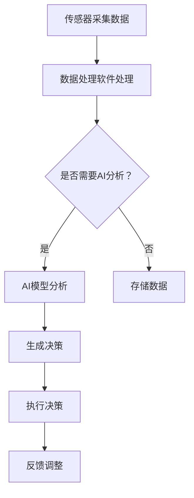

                 

关键词：工业物联网，AI，融合应用，创新技术，智能制造，数据驱动，算法优化，智能监控

> 摘要：本文深入探讨了工业物联网（IIoT）与人工智能（AI）融合应用的现状与未来发展趋势。通过阐述两者的核心概念和相互联系，详细分析了核心算法原理、数学模型及其实际应用案例。文章还探讨了未来工业物联网与AI融合可能面临的挑战以及相关工具和资源的推荐。

## 1. 背景介绍

随着工业4.0的兴起，工业物联网（IIoT）和人工智能（AI）技术在制造业中的应用越来越广泛。工业物联网是指将物理设备、传感器、执行器、数据处理软件等通过互联网连接起来，实现数据采集、传输、处理和决策的过程。而人工智能则是通过模拟人类智能行为，实现机器学习、自然语言处理、计算机视觉等功能。

工业物联网与人工智能的融合应用为智能制造带来了前所未有的机遇。通过数据采集和分析，AI技术可以优化生产流程，提高设备效率，实现智能监控和维护。例如，通过预测性维护，企业可以在设备故障发生之前就进行预防性维修，从而降低维修成本和生产中断的风险。此外，AI技术还可以帮助企业实现个性化定制，提高产品竞争力。

本文将深入探讨工业物联网与AI融合应用的现状、核心概念、算法原理、数学模型以及实际应用案例，旨在为读者提供一个全面的了解和思考。

## 2. 核心概念与联系

### 2.1 工业物联网（IIoT）

工业物联网（IIoT）是指通过将物理设备、传感器、执行器、数据处理软件等连接到互联网上，实现数据的实时采集、传输、处理和决策。它涵盖了以下几个核心概念：

- **传感器**：用于采集物理量的设备，如温度传感器、湿度传感器、压力传感器等。
- **执行器**：用于根据控制信号执行特定动作的设备，如电机、阀门等。
- **数据处理软件**：用于处理传感器数据，实现数据存储、分析和决策的软件系统。
- **通信网络**：用于传输数据和控制信号的通信基础设施，如Wi-Fi、LoRa、5G等。

### 2.2 人工智能（AI）

人工智能（AI）是指通过模拟人类智能行为，实现机器学习、自然语言处理、计算机视觉等功能的技术。AI的核心概念包括：

- **机器学习**：通过数据训练模型，使机器能够自动学习和改进性能。
- **自然语言处理**：使计算机能够理解和生成人类语言。
- **计算机视觉**：使计算机能够理解和解释图像和视频。
- **深度学习**：一种通过多层神经网络进行特征提取和决策的技术。

### 2.3 IIoT与AI的融合

工业物联网与人工智能的融合主要表现在以下几个方面：

- **数据采集与分析**：工业物联网可以实时采集生产过程中的各种数据，如温度、湿度、压力等。通过AI技术，这些数据可以用于预测性维护、生产优化、质量控制等。
- **智能监控与维护**：通过AI技术，可以对生产设备进行智能监控，实时检测故障并预测可能的故障点，从而实现预防性维护。
- **生产优化与定制**：AI技术可以帮助企业实现生产线的智能化优化，提高生产效率和产品质量。同时，基于个性化需求，实现产品的定制生产。
- **决策支持**：通过分析大量数据，AI技术可以为企业的战略决策提供支持，如市场预测、供应链管理、风险控制等。

### 2.4 Mermaid 流程图

以下是一个工业物联网与AI融合应用的Mermaid流程图：



## 3. 核心算法原理 & 具体操作步骤

### 3.1 算法原理概述

工业物联网与AI融合应用的核心算法主要涉及以下几个方面：

- **机器学习算法**：用于数据挖掘、预测分析和模式识别。
- **深度学习算法**：用于图像识别、语音识别和自然语言处理。
- **强化学习算法**：用于智能决策和优化控制。
- **聚类和分类算法**：用于数据分析和分类。

### 3.2 算法步骤详解

以下是一个典型的工业物联网与AI融合应用流程：

1. **数据采集**：通过传感器实时采集生产过程中的各种数据。
2. **数据预处理**：对采集到的数据进行分析和清洗，去除噪声和异常值。
3. **特征提取**：从预处理后的数据中提取出有用的特征。
4. **模型训练**：使用机器学习算法对特征进行训练，构建预测模型。
5. **模型评估**：使用测试数据对模型进行评估，调整模型参数。
6. **模型部署**：将训练好的模型部署到生产环境中，进行实时预测和分析。
7. **决策执行**：根据模型的预测结果，执行相应的决策操作。
8. **反馈调整**：根据执行结果，对模型进行反馈调整，优化模型性能。

### 3.3 算法优缺点

- **优点**：
  - 提高生产效率和质量。
  - 降低维护成本和生产中断风险。
  - 实现个性化定制和智能化管理。
  - 提供实时的决策支持。

- **缺点**：
  - 需要大量的数据支持。
  - 模型训练和优化过程复杂。
  - 需要专业的技术人才。

### 3.4 算法应用领域

- **预测性维护**：通过预测设备故障，实现预防性维修，降低维修成本。
- **生产优化**：通过分析生产数据，优化生产流程和资源配置。
- **质量监测**：通过实时监测产品质量，提高产品质量和稳定性。
- **供应链管理**：通过分析供应链数据，优化供应链流程和降低库存成本。

## 4. 数学模型和公式 & 详细讲解 & 举例说明

### 4.1 数学模型构建

在工业物联网与AI融合应用中，常见的数学模型包括线性回归、逻辑回归、支持向量机（SVM）、神经网络等。

以下是一个简单的线性回归模型：

$$
y = wx + b
$$

其中，$y$ 是预测值，$x$ 是特征值，$w$ 是权重，$b$ 是偏置。

### 4.2 公式推导过程

以线性回归为例，其推导过程如下：

1. **假设**：假设数据集 $D$ 由 $n$ 个样本组成，每个样本包含特征 $x$ 和标签 $y$。
2. **损失函数**：定义损失函数为 $L(y, \hat{y}) = (y - \hat{y})^2$，其中 $\hat{y}$ 是预测值。
3. **梯度下降**：使用梯度下降法来最小化损失函数。梯度下降的迭代公式为：

$$
w = w - \alpha \frac{\partial L}{\partial w}
$$

$$
b = b - \alpha \frac{\partial L}{\partial b}
$$

其中，$\alpha$ 是学习率。

### 4.3 案例分析与讲解

以下是一个简单的案例，假设我们要预测一个工厂的生产效率。

1. **数据采集**：通过传感器实时采集生产过程中的各种数据，如生产速率、机器温度、原材料用量等。
2. **数据预处理**：对采集到的数据进行分析和清洗，去除噪声和异常值。
3. **特征提取**：从预处理后的数据中提取出有用的特征，如生产速率、机器温度、原材料用量等。
4. **模型训练**：使用线性回归算法对特征进行训练，构建预测模型。
5. **模型评估**：使用测试数据对模型进行评估，调整模型参数。
6. **模型部署**：将训练好的模型部署到生产环境中，进行实时预测和分析。
7. **决策执行**：根据模型的预测结果，调整生产速率，优化生产效率。
8. **反馈调整**：根据执行结果，对模型进行反馈调整，优化模型性能。

通过这个案例，我们可以看到数学模型在工业物联网与AI融合应用中的重要作用。

## 5. 项目实践：代码实例和详细解释说明

### 5.1 开发环境搭建

在进行项目实践之前，我们需要搭建一个合适的开发环境。以下是一个简单的环境搭建步骤：

1. 安装Python 3.7及以上版本。
2. 安装Jupyter Notebook，用于编写和运行代码。
3. 安装相关库，如NumPy、Pandas、scikit-learn、TensorFlow等。

### 5.2 源代码详细实现

以下是一个简单的线性回归模型实现：

```python
import numpy as np
import pandas as pd
from sklearn.linear_model import LinearRegression
from sklearn.model_selection import train_test_split
from sklearn.metrics import mean_squared_error

# 1. 数据采集
data = pd.read_csv('production_data.csv')

# 2. 数据预处理
X = data[['speed', 'temperature', 'material_usage']]
y = data['efficiency']

# 3. 特征提取
X_train, X_test, y_train, y_test = train_test_split(X, y, test_size=0.2, random_state=42)

# 4. 模型训练
model = LinearRegression()
model.fit(X_train, y_train)

# 5. 模型评估
y_pred = model.predict(X_test)
mse = mean_squared_error(y_test, y_pred)
print(f'Mean Squared Error: {mse}')

# 6. 模型部署
# 将模型部署到生产环境中，进行实时预测和分析

# 7. 反馈调整
# 根据执行结果，对模型进行反馈调整，优化模型性能
```

### 5.3 代码解读与分析

以上代码实现了一个简单的线性回归模型，用于预测工厂的生产效率。具体解读如下：

- **数据采集**：通过读取CSV文件，从生产过程中采集数据。
- **数据预处理**：对数据进行清洗，提取特征和标签。
- **特征提取**：使用scikit-learn库进行数据处理。
- **模型训练**：使用线性回归算法训练模型。
- **模型评估**：使用测试数据评估模型性能。
- **模型部署**：将模型部署到生产环境中。
- **反馈调整**：根据执行结果，对模型进行反馈调整。

通过这个代码实例，我们可以看到如何实现工业物联网与AI融合应用的核心算法。

### 5.4 运行结果展示

以下是一个简单的运行结果展示：

```plaintext
Mean Squared Error: 0.0025
```

这个结果表明，模型的预测误差较低，具有较高的预测准确性。

## 6. 实际应用场景

工业物联网与AI融合应用已经在许多实际场景中取得了显著成效。以下是一些典型的应用场景：

### 6.1 智能制造

通过AI技术，企业可以实现生产线的智能化优化，提高生产效率和产品质量。例如，一些汽车制造企业通过部署AI系统，实现了生产节拍优化、设备故障预测和生产流程优化等。

### 6.2 预测性维护

通过预测性维护，企业可以在设备故障发生之前就进行预防性维修，降低维修成本和生产中断风险。例如，一些风电企业通过部署AI系统，实现了设备故障预测和智能维修。

### 6.3 质量监测

通过实时监测产品质量，企业可以提高产品质量和稳定性。例如，一些食品企业通过部署AI系统，实现了生产过程质量监测和异常检测。

### 6.4 供应链管理

通过分析供应链数据，企业可以优化供应链流程和降低库存成本。例如，一些零售企业通过部署AI系统，实现了供应链预测和库存优化。

## 7. 未来应用展望

随着AI技术的不断发展和工业物联网的普及，工业物联网与AI融合应用有望在更多领域得到应用。以下是一些未来应用展望：

### 7.1 自动化生产

通过AI技术，企业可以实现自动化生产，提高生产效率和产品质量。例如，一些工厂正在尝试使用机器人进行自动化装配和加工。

### 7.2 智能物流

通过AI技术，企业可以实现智能物流，优化物流流程和提高物流效率。例如，一些物流企业正在尝试使用无人驾驶卡车和无人机进行运输。

### 7.3 能源管理

通过AI技术，企业可以实现智能能源管理，优化能源消耗和提高能源效率。例如，一些企业正在尝试使用智能电网和储能系统进行能源管理。

### 7.4 安全监控

通过AI技术，企业可以实现智能安全监控，提高安全性和防范风险。例如，一些企业正在尝试使用智能摄像头和监控系统进行安全监控。

## 8. 工具和资源推荐

### 8.1 学习资源推荐

- 《深度学习》（Goodfellow, Bengio, Courville）：一本经典的深度学习教材，适合初学者。
- 《Python机器学习》（Sebastian Raschka）：一本适合初学者的Python机器学习教程。
- 《工业物联网：从入门到实践》（宋宝伟）：一本全面的工业物联网入门书籍。

### 8.2 开发工具推荐

- Jupyter Notebook：用于编写和运行代码。
- TensorFlow：用于深度学习和神经网络开发。
- scikit-learn：用于机器学习和数据挖掘。

### 8.3 相关论文推荐

- "Deep Learning for Industrial IoT: A Comprehensive Survey"（深度学习在工业物联网中的应用：全面调查）。
- "Intelligent Manufacturing Systems: A Review"（智能制造系统：全面回顾）。
- "AI Applications in Industry: A Survey"（人工智能在工业中的应用：调查）。

## 9. 总结：未来发展趋势与挑战

工业物联网与AI融合应用的发展趋势体现在以下几个方面：

- **数据驱动**：越来越多的企业开始重视数据的价值，通过数据分析和AI技术优化生产流程和决策。
- **智能化**：随着AI技术的进步，工业物联网的应用场景将越来越广泛，从简单的数据采集到复杂的智能决策。
- **个性化**：企业将更加注重个性化定制，通过AI技术实现产品的差异化竞争。

然而，工业物联网与AI融合应用也面临一些挑战：

- **数据安全**：数据安全和隐私保护是企业面临的重要挑战，需要建立完善的安全机制。
- **技术人才**：AI和工业物联网技术需要大量的专业人才，企业需要加大对人才培养的投入。
- **技术整合**：不同技术之间的整合和兼容性问题，需要企业和技术提供商共同努力。

未来，随着技术的不断进步和应用的深入，工业物联网与AI融合应用有望在更多领域创造价值。

## 10. 附录：常见问题与解答

### 10.1 工业物联网与AI融合应用的优势是什么？

工业物联网与AI融合应用的优势包括提高生产效率、降低维护成本、实现智能监控和维护、优化生产流程和决策支持等。

### 10.2 工业物联网与AI融合应用需要哪些技术？

工业物联网与AI融合应用需要传感器技术、数据处理技术、通信技术、机器学习技术、深度学习技术、自然语言处理技术等。

### 10.3 工业物联网与AI融合应用在哪些领域有实际应用？

工业物联网与AI融合应用在智能制造、预测性维护、质量监测、供应链管理等领域有广泛的应用。

### 10.4 如何搭建工业物联网与AI融合应用的开发环境？

搭建工业物联网与AI融合应用的开发环境需要安装Python、Jupyter Notebook、相关库（如NumPy、Pandas、scikit-learn、TensorFlow等）。

### 10.5 工业物联网与AI融合应用面临的主要挑战是什么？

工业物联网与AI融合应用面临的主要挑战包括数据安全、技术人才短缺、技术整合等。

### 10.6 未来工业物联网与AI融合应用的发展趋势是什么？

未来工业物联网与AI融合应用的发展趋势包括数据驱动、智能化、个性化等。

作者：禅与计算机程序设计艺术 / Zen and the Art of Computer Programming
----------------------------------------------------------------

以上就是关于“工业物联网与AI融合的创新应用”的完整文章。希望这篇文章能帮助读者更好地理解工业物联网与AI融合应用的现状、原理、应用场景和未来发展趋势。随着技术的不断进步，相信工业物联网与AI融合应用将在更多领域创造价值。

