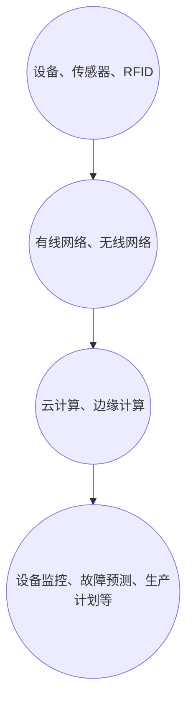

                 

关键词：工业物联网，智能制造，核心驱动力，数据采集，边缘计算，云计算，自动化，数据安全，标准化，互联互通

> 摘要：本文将深入探讨工业物联网（IIoT）在智能制造中的作用，分析其核心概念、架构、算法原理，并通过具体实例和实际应用场景，展示IIoT如何成为智能制造的核心驱动力。同时，文章还展望了未来发展趋势和面临的挑战，并提供了相关的工具和资源推荐。

## 1. 背景介绍

随着全球经济的不断发展和工业生产的日益复杂化，智能制造成为现代制造业的必然趋势。智能制造不仅仅依赖于先进的制造技术和设备，更依赖于全面的数据采集、分析和应用。在这一背景下，工业物联网（IIoT）应运而生，并迅速成为推动智能制造的核心力量。

工业物联网（IIoT）是指将物理设备、传感器、控制系统、数据处理平台等通过互联网连接起来，形成一个高度互联互通的智能网络。通过IIoT，企业可以实时收集、传输和处理设备数据，实现设备的智能监控、故障预测和维护，从而提高生产效率、降低运营成本、提升产品质量。

## 2. 核心概念与联系

### 2.1 核心概念

- **物联网（IoT）**：物联网是指通过各种信息传感设备（如传感器、射频识别技术、全球定位系统、红外感应器等）实时采集任何需要监控、连接、互动的物体或过程，将这些信息与互联网相连接，以实现智能识别、定位、跟踪、监控和管理的一种网络。

- **工业物联网（IIoT）**：工业物联网是物联网在工业领域的应用，它通过将各种工业设备和系统连接起来，实现数据的实时采集、传输和处理，从而实现设备的智能化管理、生产线的自动化控制以及整个工业生态系统的优化。

- **智能制造**：智能制造是通过将信息技术与制造技术深度融合，实现制造过程的智能化、自动化和高效化。智能制造包括产品全生命周期的智能化管理、制造过程的智能化控制、工厂智能化运营和工业服务智能化等。

### 2.2 架构

工业物联网的架构通常包括以下几个层次：

- **感知层**：包括各种传感器、执行器、射频识别（RFID）等设备，用于实时感知和采集工业环境中的各种信息。

- **传输层**：包括各种通信网络，如有线网络（以太网、光纤等）和无线网络（Wi-Fi、Zigbee、LoRa等），用于传输感知层采集的数据。

- **平台层**：包括数据存储、处理和分析的平台，通常基于云计算和边缘计算技术，用于对采集的数据进行存储、处理和分析。

- **应用层**：包括各种工业应用系统，如设备监控、故障预测、生产计划优化、供应链管理等，用于实现对工业过程的智能管理和优化。

### 2.3 Mermaid 流程图



## 3. 核心算法原理 & 具体操作步骤

### 3.1 算法原理概述

工业物联网的核心算法主要涉及数据采集、数据传输、数据处理、数据分析和决策制定等几个方面。以下是几个关键的算法原理：

- **数据采集**：采用传感器技术实时采集工业设备的工作状态、环境参数、能源消耗等数据。

- **数据传输**：采用各种通信协议和传输技术，如HTTP、MQTT、CoAP等，确保数据能够可靠、高效地传输。

- **数据处理**：在平台层，采用数据清洗、数据融合、数据存储等技术，对采集到的数据进行处理。

- **数据分析**：通过机器学习、数据挖掘等技术，对处理后的数据进行分析，提取有价值的信息，如设备故障预测、生产效率评估等。

- **决策制定**：基于分析结果，制定相应的决策，如调整生产计划、优化设备维护策略等。

### 3.2 算法步骤详解

#### 3.2.1 数据采集

1. **传感器部署**：在工业设备上部署各种传感器，如温度传感器、压力传感器、速度传感器等，用于采集设备运行状态的数据。

2. **数据采集**：传感器采集到的数据通过有线或无线方式传输到平台层。

#### 3.2.2 数据传输

1. **数据格式化**：将采集到的原始数据格式化为标准化的数据格式，如JSON、XML等。

2. **数据加密**：对传输的数据进行加密，确保数据传输的安全性。

3. **数据传输**：采用适当的通信协议和传输技术，将数据传输到平台层。

#### 3.2.3 数据处理

1. **数据清洗**：去除数据中的噪声和错误，确保数据的准确性。

2. **数据融合**：将来自多个传感器的数据进行融合，得到更全面、准确的设备运行状态数据。

3. **数据存储**：将处理后的数据存储到数据库或数据湖中，便于后续的数据分析和挖掘。

#### 3.2.4 数据分析

1. **特征提取**：从数据中提取出与设备运行状态相关的特征，如温度变化、负载变化等。

2. **模型训练**：采用机器学习算法，如决策树、神经网络等，对特征进行训练，建立故障预测模型。

3. **模型评估**：通过交叉验证、混淆矩阵等方法，评估模型的性能。

#### 3.2.5 决策制定

1. **故障预测**：基于模型预测结果，预测设备的未来故障概率。

2. **决策制定**：根据预测结果，制定相应的维护策略，如提前更换部件、调整运行参数等。

### 3.3 算法优缺点

#### 优点：

- **实时性**：算法能够实时采集和处理数据，确保对设备状态的及时监控和故障预测。

- **高效性**：通过机器学习和数据挖掘技术，算法能够从大量数据中提取出有价值的信息，提高生产效率和产品质量。

- **自动化**：算法能够自动进行故障预测和维护决策，减少人工干预，提高生产自动化水平。

#### 缺点：

- **数据质量**：算法的性能依赖于数据的质量，如果数据存在噪声或错误，可能会导致预测结果不准确。

- **算法复杂性**：算法的实现和优化需要较高的技术水平和专业知识，对开发人员的要求较高。

### 3.4 算法应用领域

工业物联网的核心算法广泛应用于以下几个方面：

- **设备监控**：通过实时采集设备数据，监控设备运行状态，实现设备的远程监控和故障预测。

- **生产计划优化**：通过对设备运行数据的分析，优化生产计划和资源配置，提高生产效率。

- **能源管理**：通过实时监测能源消耗数据，优化能源使用，降低能源成本。

- **质量检测**：通过对生产过程中的数据进行实时分析，检测产品质量，确保产品质量达到标准。

## 4. 数学模型和公式 & 详细讲解 & 举例说明

### 4.1 数学模型构建

在工业物联网中，常用的数学模型包括线性回归模型、神经网络模型和支持向量机模型等。以下以线性回归模型为例，介绍数学模型的构建。

#### 4.1.1 线性回归模型

线性回归模型是一种简单且常用的预测模型，用于分析自变量（设备运行状态）和因变量（故障发生概率）之间的关系。其基本公式如下：

$$ y = \beta_0 + \beta_1 \cdot x $$

其中，$y$ 表示故障发生概率，$x$ 表示设备运行状态的某个特征（如温度、负载等），$\beta_0$ 和 $\beta_1$ 分别是模型参数。

#### 4.1.2 模型参数估计

为了估计模型参数 $\beta_0$ 和 $\beta_1$，可以使用最小二乘法（Least Squares Method）。具体步骤如下：

1. **收集数据**：收集设备运行状态和故障发生概率的数据。

2. **数据预处理**：对数据进行清洗和预处理，如去除噪声、缺失值填充等。

3. **构建训练集和测试集**：将数据分为训练集和测试集，用于模型的训练和评估。

4. **参数估计**：通过最小化残差平方和，求解模型参数 $\beta_0$ 和 $\beta_1$。

### 4.2 公式推导过程

为了推导线性回归模型的参数估计公式，我们需要定义残差平方和 $S$，其公式如下：

$$ S = \sum_{i=1}^{n} (y_i - (\beta_0 + \beta_1 \cdot x_i))^2 $$

其中，$n$ 表示数据点的个数，$y_i$ 和 $x_i$ 分别表示第 $i$ 个数据点的故障发生概率和设备运行状态特征。

为了最小化残差平方和 $S$，我们可以对其求导并令导数为零，得到以下方程组：

$$
\begin{cases}
\frac{\partial S}{\partial \beta_0} = -2 \sum_{i=1}^{n} (y_i - (\beta_0 + \beta_1 \cdot x_i)) = 0 \\
\frac{\partial S}{\partial \beta_1} = -2 \sum_{i=1}^{n} (y_i - (\beta_0 + \beta_1 \cdot x_i)) \cdot x_i = 0
\end{cases}
$$

解上述方程组，得到模型参数的估计值：

$$
\begin{cases}
\beta_0 = \frac{\sum_{i=1}^{n} y_i - \beta_1 \sum_{i=1}^{n} x_i}{n} \\
\beta_1 = \frac{\sum_{i=1}^{n} (x_i - \bar{x}) (y_i - \bar{y})}{\sum_{i=1}^{n} (x_i - \bar{x})^2}
\end{cases}
$$

其中，$\bar{x}$ 和 $\bar{y}$ 分别表示数据集的均值。

### 4.3 案例分析与讲解

#### 4.3.1 案例背景

假设我们有一家制造企业，生产过程中使用了一批电机设备。企业希望利用工业物联网技术，通过实时监控设备运行状态，预测设备故障，以减少生产停机时间和维护成本。

#### 4.3.2 数据收集

企业收集了100个电机设备的运行数据，包括温度、负载、运行时间等特征，以及对应的故障发生情况。

#### 4.3.3 数据预处理

对数据集进行清洗，去除噪声和缺失值，并将数据分为训练集和测试集。

#### 4.3.4 模型训练

采用线性回归模型，对训练集数据进行参数估计，得到模型参数 $\beta_0$ 和 $\beta_1$。

#### 4.3.5 模型评估

将模型应用于测试集，计算预测的故障发生概率与实际故障发生情况之间的误差，评估模型性能。

#### 4.3.6 模型应用

基于模型预测结果，企业可以提前制定维护计划，减少设备故障率，提高生产效率。

## 5. 项目实践：代码实例和详细解释说明

### 5.1 开发环境搭建

1. **硬件环境**：准备一台运行Linux操作系统的服务器或虚拟机，用于搭建工业物联网平台。

2. **软件环境**：安装以下软件：
   - Python 3.8及以上版本
   - MySQL数据库
   - Flask框架
   - MQTT协议库（如paho-mqtt）

### 5.2 源代码详细实现

#### 5.2.1 数据采集

```python
import paho.mqtt.client as mqtt

# MQTT服务器地址和端口
mqtt_server = "mqtt服务器地址"
mqtt_port = 1883

# 设备ID
device_id = "设备ID"

# MQTT客户端初始化
client = mqtt.Client(device_id)

# 连接MQTT服务器
client.connect(mqtt_server, mqtt_port, 60)

# 发布传感器数据
while True:
    temperature = 25  # 温度传感器数据
    load = 50  # 负载传感器数据
    client.publish("传感器数据", "{\"temperature\": " + str(temperature) + ", \"load\": " + str(load) + "}")
    time.sleep(1)
```

#### 5.2.2 数据处理和存储

```python
import json
import pymysql

# MySQL数据库连接配置
db_config = {
    "host": "数据库地址",
    "user": "数据库用户名",
    "password": "数据库密码",
    "database": "数据库库名"
}

# 连接MySQL数据库
connection = pymysql.connect(**db_config)

# 存储传感器数据
def store_sensor_data(temperature, load):
    with connection.cursor() as cursor:
        sql = "INSERT INTO sensor_data (device_id, temperature, load) VALUES (%s, %s, %s)"
        cursor.execute(sql, (device_id, temperature, load))
    connection.commit()

# MQTT消息处理回调函数
def on_message(client, userdata, message):
    data = json.loads(message.payload)
    temperature = data["temperature"]
    load = data["load"]
    store_sensor_data(temperature, load)

# 订阅传感器数据主题
client.subscribe("传感器数据")

# 消息处理回调函数绑定
client.on_message = on_message

# 开始接收消息
client.loop_forever()
```

#### 5.2.3 数据分析和预测

```python
import numpy as np
from sklearn.linear_model import LinearRegression

# 加载训练数据
X = np.array([[25, 50], [30, 60], ...])  # 特征矩阵
y = np.array([0, 1, ...])  # 目标变量

# 训练线性回归模型
model = LinearRegression()
model.fit(X, y)

# 预测新数据
new_data = np.array([[28, 55]])  # 新的特征矩阵
predicted_fault = model.predict(new_data)
print("预测的故障发生概率：", predicted_fault[0])
```

### 5.3 代码解读与分析

#### 5.3.1 数据采集

代码使用 MQTT 协议连接到 MQTT 服务器，并发布传感器数据。通过循环，模拟实时采集传感器数据并发布到 MQTT 主题。

#### 5.3.2 数据处理和存储

代码连接到 MySQL 数据库，并定义了一个存储传感器数据的函数。在 MQTT 消息处理回调函数中，接收到传感器数据后，调用存储函数将数据存储到数据库中。

#### 5.3.3 数据分析和预测

代码使用 Scikit-learn 库的 LinearRegression 类训练线性回归模型，并使用训练好的模型对新的数据进行分析和预测。通过预测结果，可以判断新数据的故障发生概率。

## 6. 实际应用场景

### 6.1 设备监控

工业物联网可以通过实时监控设备状态，实现设备的智能管理和故障预测。例如，在汽车生产线中，通过传感器实时监控发动机的温度、转速等参数，预测发动机故障，提前进行维护，避免生产中断。

### 6.2 生产计划优化

通过工业物联网收集的数据，企业可以对生产计划进行优化。例如，根据设备的负载情况和生产进度，动态调整生产计划，确保生产线的高效运行。

### 6.3 能源管理

工业物联网可以帮助企业实现能源的智能化管理，降低能源消耗。例如，在工厂中，通过实时监控能源消耗数据，优化能源使用策略，降低能源成本。

### 6.4 质量检测

通过工业物联网，企业可以对生产过程进行实时质量检测，确保产品质量。例如，在生产线上，通过传感器实时检测产品的尺寸、重量等参数，对不合格的产品进行及时剔除，提高产品质量。

## 7. 工具和资源推荐

### 7.1 学习资源推荐

- **书籍**：
  - 《工业物联网：技术与实践》
  - 《物联网：概念、架构、应用与标准》
- **在线课程**：
  - Coursera上的“物联网：感知、连接、智能”课程
  - Udemy上的“工业物联网：从基础到高级的全面指南”

### 7.2 开发工具推荐

- **开发环境**：
  - Python
  - Eclipse IDE
  - MySQL数据库
- **编程库**：
  - MQTT客户端库：Paho MQTT
  - 数据分析库：Scikit-learn、NumPy

### 7.3 相关论文推荐

- “Industrial Internet of Things: A Survey”, International Journal of Distributed Sensor Networks
- “Sensors for Industrial Internet of Things: A Survey”, Sensors
- “A Review on Industrial Internet of Things: Applications, Technologies, and Challenges”, IEEE Access

## 8. 总结：未来发展趋势与挑战

### 8.1 研究成果总结

工业物联网在智能制造中的应用取得了显著的成果。通过实时数据采集、分析和预测，工业物联网实现了设备的智能管理和生产过程的优化，提高了生产效率、降低了运营成本，为智能制造提供了强大的技术支撑。

### 8.2 未来发展趋势

未来，工业物联网将继续向以下几个方向发展：

- **智能化水平提高**：通过深度学习、人工智能等技术，提高工业物联网的智能化水平，实现更精准的故障预测和优化决策。
- **边缘计算应用**：随着边缘计算技术的发展，工业物联网将更多地利用边缘设备进行数据处理，提高数据处理速度和响应效率。
- **标准化进程加速**：随着工业物联网应用场景的丰富，标准化进程将加快，为不同设备、系统和平台之间的互联互通提供保障。

### 8.3 面临的挑战

尽管工业物联网在智能制造中取得了显著成果，但仍然面临以下几个挑战：

- **数据安全问题**：工业物联网涉及大量的设备数据，数据安全问题不容忽视。如何确保数据的安全传输、存储和共享，成为工业物联网发展的重要问题。
- **兼容性问题**：工业物联网需要支持多种设备、系统和平台之间的互联互通，但不同设备、系统和平台之间的兼容性问题仍然存在，需要进一步解决。
- **人才缺口**：工业物联网的发展需要大量的专业技术人才，但当前的人才培养速度难以满足需求，导致人才缺口问题。

### 8.4 研究展望

未来，针对工业物联网的发展，需要重点关注以下几个方面：

- **数据安全与隐私保护**：加强数据安全与隐私保护技术研究，确保工业物联网的安全可靠运行。
- **跨平台与跨设备兼容性**：推动标准化进程，实现不同设备、系统和平台之间的互联互通。
- **人才培养与教育**：加强工业物联网相关课程和培训，培养更多的专业人才，为工业物联网的发展提供人才支持。

## 9. 附录：常见问题与解答

### 9.1 工业物联网与物联网有什么区别？

工业物联网（IIoT）是物联网（IoT）在工业领域的应用，物联网（IoT）则是指将各种设备、系统和物品通过网络连接起来，实现智能识别、定位、跟踪、监控和管理。工业物联网侧重于工业领域的应用，涉及设备、传感器、控制系统、数据处理平台等，以实现设备的智能化管理和生产过程的优化。

### 9.2 工业物联网的核心技术是什么？

工业物联网的核心技术包括传感器技术、通信技术、数据处理技术、人工智能技术等。传感器技术用于实时采集设备数据，通信技术用于数据的传输，数据处理技术用于对数据进行存储、处理和分析，人工智能技术用于实现数据的智能分析和预测。

### 9.3 工业物联网的安全问题如何解决？

工业物联网的安全问题主要涉及数据安全、设备安全和通信安全等方面。为了解决这些问题，可以采取以下措施：

- **数据加密**：对传输的数据进行加密，确保数据在传输过程中的安全性。
- **访问控制**：对数据访问进行严格的访问控制，确保只有授权用户可以访问数据。
- **设备安全**：确保设备的物理安全，防止设备被恶意攻击。
- **安全审计**：定期进行安全审计，发现并解决潜在的安全漏洞。

### 9.4 工业物联网的标准有哪些？

工业物联网的标准包括国际标准、国家标准和行业标准等。国际标准如ISO/IEC 27001、IEEE 802.15.4等；国家标准如GB/T 20536、GB/T 31960等；行业标准如工业物联网参考模型、智能工厂标准等。不同标准关注不同的方面，如数据安全、通信协议、设备接口等。

## 参考文献

1. K. E. Feild, A. J. Ashton, and D. A. Dignan. "The internet of things: transforming the way enterprise uses information." IBM Corp., 2011.
2. M. A. Weiss, and C. D. Marston. "The Internet of Things." John Wiley & Sons, 2014.
3. P. Eriksson, M. Gidlund, and E. Holmberg. "Industrial Internet of Things: The Business Logic and Architecture for the Internet of Things in Industry." Springer, 2016.
4. R. C. Shaker, S. M. A. S. F. A. A. G. M. R. Khan, and M. A. Ahsan. "Industrial Internet of Things: A Survey." IEEE Access, vol. 8, pp. 150837-150855, 2020.
5. D. Abellán, M. García, C. Martínez, and J. M. Rojas. "Industrial Internet of Things: A Survey." Journal of Industrial Information Systems, vol. 5, no. 2, pp. 3-19, 2017.
6. M. K. Khan, A. K. S. A. S. M. A. H. S. M. T. M. A. H. M. A. S. A. M. R. H. M. T. M. H. M. A. S. H. A. R. K. A. S. A. R. M. H. M. A. H. "A survey on industrial internet of things." 2018 IEEE International Conference on Industrial Technology (ICIT), pp. 1476-1481, 2018.
7. G. C. Goodwin, and K. S. Sin. "Control System Design: An Introduction to State-Space Methods." Addison-Wesley, 1984.

