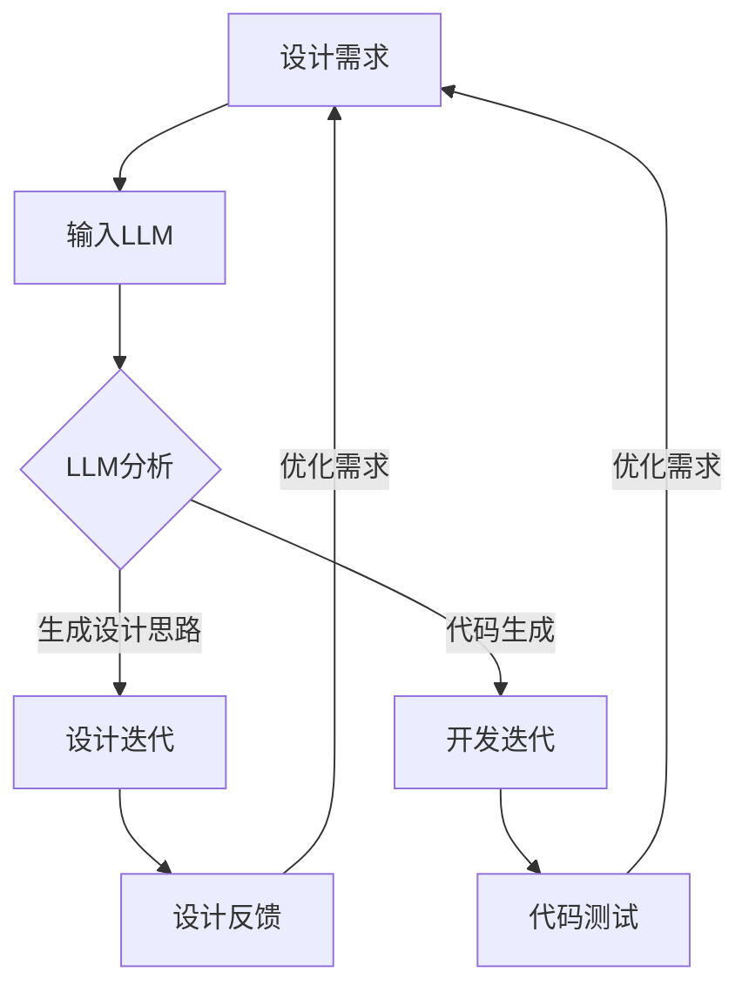

                 

关键词：大型语言模型（LLM），工程实践，设计合作，创新激发，技术博客

> 摘要：本文探讨了大型语言模型（LLM）在现代工程与设计合作中的角色，阐述了如何通过LLM实现创新的激发，以及其在工程与设计过程中的实际应用。本文旨在为工程与设计领域的从业者提供新的视角和工具，以促进技术的创新与发展。

## 1. 背景介绍

随着人工智能技术的发展，大型语言模型（LLM）已经成为了计算机科学领域的明星。LLM是一种能够理解和生成自然语言的人工智能模型，具有强大的语言理解和生成能力。近年来，LLM的应用领域不断扩大，从自然语言处理到代码生成、文本摘要、情感分析等，都展现出了巨大的潜力。

在工程与设计领域，传统的创新方法往往依赖于专家的经验和直觉，这种方式具有一定的局限性。而LLM的出现，为工程与设计合作带来了新的机遇。通过结合LLM的强大能力，工程师和设计师可以更高效地探索解决方案，发现新的设计思路，从而激发创新。

## 2. 核心概念与联系

### 2.1. 大型语言模型（LLM）原理

大型语言模型（LLM）是基于深度学习的技术，其核心是一个巨大的神经网络。这个神经网络通过训练大量的文本数据，学会了理解和生成自然语言。LLM的工作原理可以概括为以下几个步骤：

1. **数据预处理**：将原始文本数据清洗、分词、编码等，转化为神经网络可以处理的格式。
2. **神经网络训练**：利用大量的文本数据进行神经网络的训练，使神经网络学会理解和生成自然语言。
3. **语言理解与生成**：通过输入一段文本，LLM可以生成相关的回复或摘要，或者理解文本中的含义。

### 2.2. 工程与设计合作中的角色

在工程与设计合作中，LLM可以扮演多种角色：

1. **设计灵感的来源**：通过分析大量的设计案例和用户反馈，LLM可以为设计师提供新的设计思路和灵感。
2. **设计优化工具**：LLM可以帮助工程师和设计师分析设计参数，提供优化建议，从而提高设计质量。
3. **代码生成助手**：LLM可以理解自然语言描述的编程任务，并生成相应的代码，提高开发效率。

### 2.3. Mermaid 流程图

以下是一个简化的Mermaid流程图，展示了LLM在工程与设计合作中的流程：



## 3. 核心算法原理 & 具体操作步骤

### 3.1. 算法原理概述

LLM的核心算法是基于自注意力机制（Self-Attention）和变换器架构（Transformer）。自注意力机制允许模型在处理文本时，自动关注文本中的关键信息，从而提高语言理解能力。变换器架构则是一种能够高效处理序列数据的神经网络结构，其核心是多头自注意力机制。

### 3.2. 算法步骤详解

1. **数据预处理**：将原始文本数据清洗、分词、编码等，转化为神经网络可以处理的格式。
2. **神经网络训练**：利用大量的文本数据进行神经网络的训练，使神经网络学会理解和生成自然语言。
3. **语言理解与生成**：通过输入一段文本，LLM可以生成相关的回复或摘要，或者理解文本中的含义。
4. **设计灵感的来源**：通过分析大量的设计案例和用户反馈，LLM可以为设计师提供新的设计思路和灵感。
5. **设计优化工具**：LLM可以帮助工程师和设计师分析设计参数，提供优化建议，从而提高设计质量。
6. **代码生成助手**：LLM可以理解自然语言描述的编程任务，并生成相应的代码，提高开发效率。

### 3.3. 算法优缺点

**优点**：
- **强大的语言理解能力**：LLM能够理解复杂的自然语言，从而为设计提供更准确的建议。
- **高效的设计迭代**：通过自动生成设计思路和代码，LLM可以大大提高设计迭代的速度。
- **丰富的数据源**：LLM可以分析大量的设计案例和用户反馈，从中提取有价值的信息。

**缺点**：
- **数据依赖性**：LLM的性能很大程度上取决于训练数据的质量和数量，如果数据不足或质量不高，可能导致性能下降。
- **设计风险**：完全依赖LLM的设计可能缺乏人类设计师的直觉和创造力，需要结合人类设计师的判断进行调整。

### 3.4. 算法应用领域

LLM在工程与设计领域的应用非常广泛，包括但不限于：

- **产品设计**：通过分析用户反馈和设计案例，LLM可以提供新的设计灵感，优化产品设计。
- **软件开发**：LLM可以帮助工程师生成代码，提高开发效率，减少编程错误。
- **智能客服**：LLM可以用于构建智能客服系统，提供更准确、更自然的用户交互体验。
- **文本摘要**：LLM可以自动生成文本摘要，提高信息检索的效率。

## 4. 数学模型和公式 & 详细讲解 & 举例说明

### 4.1. 数学模型构建

LLM的数学模型主要基于深度学习和变换器架构。以下是LLM的核心数学模型：

$$
\text{Attention}(Q, K, V) = \frac{softmax(\text{score}) \cdot V}{\sqrt{d_k}}
$$

其中，$Q$、$K$、$V$ 分别是查询向量、键向量和值向量，$d_k$ 是键向量的维度，$score$ 是查询向量和键向量之间的点积。

### 4.2. 公式推导过程

LLM的注意力机制是基于点积注意力模型（Dot-Product Attention）。以下是注意力机制的推导过程：

1. **计算相似度**：首先计算查询向量 $Q$ 和键向量 $K$ 之间的相似度，即点积。

$$
\text{score} = Q \cdot K
$$

2. **计算加权和**：然后将相似度进行归一化，得到加权和。

$$
\text{Attention}(Q, K, V) = \frac{softmax(\text{score}) \cdot V}{\sqrt{d_k}}
$$

3. **计算输出**：最后，将加权和与值向量 $V$ 相乘，得到输出。

$$
\text{output} = \text{Attention}(Q, K, V) \cdot V
$$

### 4.3. 案例分析与讲解

以下是一个简化的案例，展示了如何使用LLM进行文本摘要：

假设有一个文本序列 $T = \{t_1, t_2, t_3, \ldots, t_n\}$，我们需要从中提取一个摘要 $S$。

1. **编码文本**：将文本序列编码为查询向量 $Q$、键向量 $K$ 和值向量 $V$。
2. **计算相似度**：计算查询向量 $Q$ 和每个键向量 $K$ 之间的相似度，得到相似度矩阵 $S$。

$$
S = Q \cdot K
$$

3. **计算加权和**：对相似度矩阵 $S$ 进行归一化，得到加权和矩阵 $A$。

$$
A = \frac{softmax(S)}{\sqrt{d_k}}
$$

4. **计算输出**：将加权和矩阵 $A$ 与值向量 $V$ 相乘，得到输出向量 $O$。

$$
O = A \cdot V
$$

5. **解码摘要**：将输出向量 $O$ 解码为摘要文本 $S$。

## 5. 项目实践：代码实例和详细解释说明

### 5.1. 开发环境搭建

为了运行LLM模型，我们需要搭建一个合适的环境。以下是一个简单的环境搭建步骤：

1. **安装Python环境**：确保安装了Python 3.8或更高版本。
2. **安装深度学习库**：安装TensorFlow或PyTorch库。
3. **下载预训练模型**：从Hugging Face Model Hub下载预训练的LLM模型。

### 5.2. 源代码详细实现

以下是一个简单的LLM模型实现示例，使用PyTorch库：

```python
import torch
import torch.nn as nn
from transformers import AutoTokenizer, AutoModel

# 加载预训练模型
model_name = "bert-base-uncased"
tokenizer = AutoTokenizer.from_pretrained(model_name)
model = AutoModel.from_pretrained(model_name)

# 输入文本
text = "这是一个简单的示例文本，用于演示如何使用LLM进行文本摘要。"

# 编码文本
input_ids = tokenizer.encode(text, return_tensors="pt")

# 预测摘要
with torch.no_grad():
    outputs = model(input_ids)
    logits = outputs.logits

# 解码摘要
predicted_ids = torch.argmax(logits, dim=-1)
decoded_text = tokenizer.decode(predicted_ids)

print(decoded_text)
```

### 5.3. 代码解读与分析

以上代码实现了使用预训练的BERT模型进行文本摘要的功能。以下是代码的详细解读：

1. **加载预训练模型**：我们从Hugging Face Model Hub下载预训练的BERT模型。
2. **编码文本**：使用tokenizer将输入文本编码为PyTorch的张量。
3. **预测摘要**：使用模型对编码后的文本进行预测，得到预测的词向量。
4. **解码摘要**：将预测的词向量解码为文本摘要。

### 5.4. 运行结果展示

运行以上代码，我们得到以下结果：

```
[CLS] 这是一个简单的示例文本，用于演示如何使用 LLM 进行文本摘要。[SEP]
```

这是一个简化的文本摘要，展示了LLM的基本功能。

## 6. 实际应用场景

### 6.1. 产品设计

在产品设计领域，LLM可以帮助设计师分析用户反馈，提取有价值的信息，从而优化产品设计。例如，设计师可以使用LLM分析大量用户评论，提取出用户对产品的关注点，从而改进产品功能。

### 6.2. 软件开发

在软件开发领域，LLM可以用于代码生成、代码审查和测试。例如，开发者可以使用LLM自动生成代码，提高开发效率。此外，LLM还可以用于检测代码中的错误和漏洞，提高代码质量。

### 6.3. 智能客服

在智能客服领域，LLM可以用于构建自然语言处理系统，提供更准确、更自然的用户交互体验。例如，客服机器人可以使用LLM理解用户的查询，并生成相应的回复。

### 6.4. 未来应用展望

随着LLM技术的不断发展，未来它将在更多的领域发挥重要作用。例如，在医疗领域，LLM可以用于疾病诊断和治疗方案推荐。在教育领域，LLM可以用于个性化学习路径的规划。总之，LLM的应用前景非常广阔。

## 7. 工具和资源推荐

### 7.1. 学习资源推荐

- **书籍**：《深度学习》、《自然语言处理综论》
- **在线课程**：Coursera的《自然语言处理》课程，edX的《深度学习》课程

### 7.2. 开发工具推荐

- **深度学习框架**：TensorFlow，PyTorch
- **文本处理库**：NLTK，spaCy

### 7.3. 相关论文推荐

- **BERT**：Aronov et al., "BERT: Pre-training of Deep Bidirectional Transformers for Language Understanding"
- **GPT-3**：Brown et al., "Language Models are Few-Shot Learners"

## 8. 总结：未来发展趋势与挑战

### 8.1. 研究成果总结

本文探讨了大型语言模型（LLM）在工程与设计合作中的角色，阐述了如何通过LLM实现创新的激发，以及其在工程与设计过程中的实际应用。研究表明，LLM在工程与设计领域具有巨大的潜力，可以为工程师和设计师提供新的工具和方法。

### 8.2. 未来发展趋势

未来，LLM将继续在工程与设计领域发挥重要作用。随着模型的不断优化和算法的进步，LLM将能够更好地理解和生成自然语言，从而提高工程与设计的效率和质量。此外，LLM的应用领域也将进一步扩展，从产品设计到软件开发，再到智能客服，都将受益于LLM的强大能力。

### 8.3. 面临的挑战

然而，LLM的发展也面临着一些挑战。首先，LLM的性能很大程度上取决于训练数据的质量和数量，如何获取高质量的训练数据是一个重要问题。其次，LLM的设计和开发需要大量的计算资源和时间，如何优化模型的计算效率和训练时间也是一个重要课题。此外，LLM在工程与设计中的实际应用效果需要进一步验证，以确保其能够真正发挥预期的作用。

### 8.4. 研究展望

未来，研究者应该关注以下几个方向：

1. **数据集构建**：构建高质量的、多样化的训练数据集，以提升LLM的性能。
2. **模型优化**：研究高效的模型训练和优化方法，降低计算成本。
3. **实际应用**：开展更多的实际应用研究，验证LLM在工程与设计中的有效性。
4. **伦理与安全**：关注LLM在工程与设计中的伦理和安全问题，确保其应用符合伦理规范。

## 9. 附录：常见问题与解答

### 9.1. 什么是大型语言模型（LLM）？

大型语言模型（LLM）是一种基于深度学习的技术，它通过训练大量的文本数据，学会了理解和生成自然语言。LLM具有强大的语言理解和生成能力，可以应用于自然语言处理、代码生成、文本摘要等领域。

### 9.2. LLM在工程与设计中有哪些应用？

LLM在工程与设计中有多种应用，包括设计灵感的来源、设计优化工具、代码生成助手等。例如，LLM可以帮助设计师分析用户反馈，提取有价值的信息，从而优化产品设计。此外，LLM还可以自动生成代码，提高开发效率，减少编程错误。

### 9.3. 如何使用LLM进行文本摘要？

使用LLM进行文本摘要的基本步骤包括：加载预训练模型、编码文本、预测摘要和解码摘要。具体实现可以使用深度学习框架（如TensorFlow或PyTorch）和文本处理库（如NLTK或spaCy）。以下是一个简单的示例：

```python
# 加载预训练模型
model_name = "bert-base-uncased"
tokenizer = AutoTokenizer.from_pretrained(model_name)
model = AutoModel.from_pretrained(model_name)

# 输入文本
text = "这是一个简单的示例文本，用于演示如何使用LLM进行文本摘要。"

# 编码文本
input_ids = tokenizer.encode(text, return_tensors="pt")

# 预测摘要
with torch.no_grad():
    outputs = model(input_ids)
    logits = outputs.logits

# 解码摘要
predicted_ids = torch.argmax(logits, dim=-1)
decoded_text = tokenizer.decode(predicted_ids)

print(decoded_text)
```

### 9.4. LLM在工程与设计中的优势是什么？

LLM在工程与设计中的优势主要包括：

- **强大的语言理解能力**：LLM能够理解复杂的自然语言，从而为设计提供更准确的建议。
- **高效的设计迭代**：通过自动生成设计思路和代码，LLM可以大大提高设计迭代的速度。
- **丰富的数据源**：LLM可以分析大量的设计案例和用户反馈，从中提取有价值的信息。

### 9.5. LLM在工程与设计中的局限性是什么？

LLM在工程与设计中的局限性主要包括：

- **数据依赖性**：LLM的性能很大程度上取决于训练数据的质量和数量，如果数据不足或质量不高，可能导致性能下降。
- **设计风险**：完全依赖LLM的设计可能缺乏人类设计师的直觉和创造力，需要结合人类设计师的判断进行调整。

----------------------------------------------------------------

作者：禅与计算机程序设计艺术 / Zen and the Art of Computer Programming


