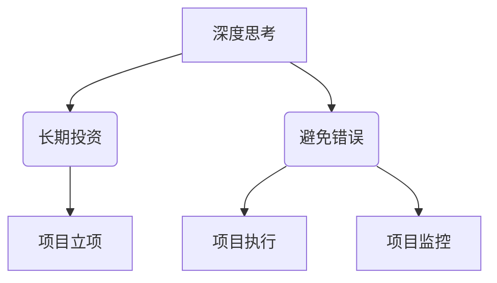

                 

关键词：巴菲特清单法则、项目管理、风险控制、决策优化、IT行业

## 摘要

本文旨在探讨如何将巴菲特清单法则应用于项目管理中，以提高项目成功率、降低风险并优化决策。通过分析巴菲特清单法则的核心原理，我们将详细介绍如何在项目管理中实施这一法则，并讨论其实际应用效果。文章还将结合具体案例，展示巴菲特清单法则在项目管理中的实践价值。

## 1. 背景介绍

### 1.1 巴菲特清单法则的起源

巴菲特清单法则起源于投资大师沃伦·巴菲特（Warren Buffett）的投资哲学。巴菲特是一位著名的价值投资家，他通过深入分析企业基本面，制定清单来评估潜在投资机会。这种清单法则帮助他避免错误决策，提高了投资成功率。

### 1.2 项目管理的挑战

在项目管理领域，风险控制、决策优化和时间管理是关键挑战。传统项目管理方法往往依赖经验和直觉，缺乏系统化的决策支持。这可能导致项目失败、成本超支和进度延误。因此，寻求一种有效的决策优化方法具有重要意义。

## 2. 核心概念与联系

### 2.1 巴菲特清单法则的核心概念

巴菲特清单法则的核心是“深度思考、长期投资和避免错误”。具体包括以下三个方面：

- **深度思考**：在投资决策前，对潜在投资机会进行深入分析，评估其风险和收益。
- **长期投资**：关注企业长期价值，而非短期波动，以提高投资成功率。
- **避免错误**：通过制定清单，识别潜在风险，避免错误决策。

### 2.2 巴菲特清单法则在项目管理中的应用

将巴菲特清单法则应用于项目管理，可以帮助项目经理在项目启动、执行和监控阶段做出更明智的决策。具体应用如下：

- **项目启动**：在项目立项阶段，制定清单，评估项目风险、收益和可行性。
- **项目执行**：在项目执行阶段，通过清单监控项目进度、质量和风险。
- **项目监控**：在项目监控阶段，根据清单分析项目偏差，制定纠偏措施。

### 2.3 巴菲特清单法则架构图

下面是巴菲特清单法则的架构图，用于描述其核心概念和联系。



## 3. 核心算法原理 & 具体操作步骤

### 3.1 算法原理概述

巴菲特清单法则的核心原理是系统化决策。通过制定清单，项目经理可以在项目各个阶段识别潜在风险，评估项目可行性，从而优化决策。

### 3.2 算法步骤详解

#### 3.2.1 项目启动阶段

1. **制定项目清单**：根据项目特点，制定包含关键指标、风险因素和收益预期的清单。
2. **评估项目可行性**：根据清单内容，评估项目风险和收益，判断项目是否值得启动。
3. **制定项目计划**：根据评估结果，制定项目计划，明确项目目标、任务和时间表。

#### 3.2.2 项目执行阶段

1. **监控项目进度**：根据项目清单，监控项目进度，确保任务按时完成。
2. **评估项目质量**：根据项目清单，评估项目质量，确保达到预期目标。
3. **控制项目风险**：根据项目清单，识别潜在风险，制定应对措施，降低项目风险。

#### 3.2.3 项目监控阶段

1. **分析项目偏差**：根据项目清单，分析项目进度、质量和风险的偏差。
2. **制定纠偏措施**：根据偏差分析结果，制定纠偏措施，确保项目按计划进行。
3. **持续优化项目**：根据项目清单，持续优化项目，提高项目成功率。

### 3.3 算法优缺点

#### 3.3.1 优点

- **提高项目成功率**：通过系统化决策，降低项目风险，提高项目成功率。
- **优化决策**：帮助项目经理在项目各个阶段做出更明智的决策。
- **提高项目管理效率**：通过清单方式，提高项目管理的系统性和效率。

#### 3.3.2 缺点

- **制定清单需要时间**：制定项目清单需要项目经理投入大量时间和精力。
- **适用范围有限**：巴菲特清单法则主要适用于项目风险较高的项目。

### 3.4 算法应用领域

巴菲特清单法则在项目管理中具有广泛的应用领域，包括：

- **IT项目**：在软件开发、系统集成等IT项目中，巴菲特清单法则有助于降低项目风险，提高项目成功率。
- **工程建设**：在基础设施建设、房地产项目等工程建设中，巴菲特清单法则有助于优化项目决策，提高项目效益。
- **金融项目**：在金融投资项目中，巴菲特清单法则有助于投资者评估项目风险，优化投资决策。

## 4. 数学模型和公式 & 详细讲解 & 举例说明

### 4.1 数学模型构建

巴菲特清单法则的数学模型主要包括两个部分：风险评估模型和收益评估模型。

#### 4.1.1 风险评估模型

风险评
```markdown
### 4.2 公式推导过程

#### 4.2.1 风险评估模型

风险评估模型的推导基于项目风险的定量分析。设项目风险为 \( R \)，风险因素为 \( F \)，权重为 \( W \)，则项目风险可以表示为：

\[ R = \sum_{i=1}^{n} W_i \cdot F_i \]

其中，\( n \) 为风险因素的数量。

#### 4.2.2 收益评估模型

收益评估模型的推导基于项目收益的定量分析。设项目收益为 \( G \)，收益因素为 \( S \)，权重为 \( Z \)，则项目收益可以表示为：

\[ G = \sum_{i=1}^{m} Z_i \cdot S_i \]

其中，\( m \) 为收益因素的数量。

### 4.3 案例分析与讲解

#### 4.3.1 案例背景

某公司计划开发一款移动应用程序，旨在提供便捷的在线购物服务。项目经理在项目启动阶段，利用巴菲特清单法则对项目进行风险评估和收益评估。

#### 4.3.2 风险评估

根据项目特点，项目经理列出以下风险因素：

- **技术风险**：技术团队可能缺乏开发类似应用程序的经验。
- **市场风险**：竞争对手可能已推出类似应用程序，抢占市场份额。
- **资金风险**：项目资金不足，可能导致项目无法按期完成。

根据专家评估，各风险因素的权重分别为 \( W_1 = 0.4 \)，\( W_2 = 0.3 \)，\( W_3 = 0.3 \)。

则项目风险 \( R \) 为：

\[ R = 0.4 \cdot F_1 + 0.3 \cdot F_2 + 0.3 \cdot F_3 \]

假设技术风险 \( F_1 \) 为 0.2，市场风险 \( F_2 \) 为 0.3，资金风险 \( F_3 \) 为 0.4，则项目风险 \( R \) 为：

\[ R = 0.4 \cdot 0.2 + 0.3 \cdot 0.3 + 0.3 \cdot 0.4 = 0.08 + 0.09 + 0.12 = 0.29 \]

#### 4.3.3 收益评估

根据项目特点，项目经理列出以下收益因素：

- **用户增长**：项目上线后，预计每月用户增长 1000 人。
- **收入增长**：每月收入增长 10 万元。
- **品牌影响力**：项目上线后，提升公司品牌知名度。

根据专家评估，各收益因素的权重分别为 \( Z_1 = 0.5 \)，\( Z_2 = 0.3 \)，\( Z_3 = 0.2 \)。

则项目收益 \( G \) 为：

\[ G = 0.5 \cdot S_1 + 0.3 \cdot S_2 + 0.2 \cdot S_3 \]

假设用户增长 \( S_1 \) 为 1000 人，收入增长 \( S_2 \) 为 10 万元，品牌影响力 \( S_3 \) 为 1 万元，则项目收益 \( G \) 为：

\[ G = 0.5 \cdot 1000 + 0.3 \cdot 10 + 0.2 \cdot 1 = 500 + 3 + 0.2 = 503.2 \]

#### 4.3.4 风险与收益比较

根据计算结果，项目风险 \( R \) 为 0.29，项目收益 \( G \) 为 503.2。从风险与收益的比较来看，项目具有可行性。

#### 4.3.5 项目决策

基于风险评估和收益评估的结果，项目经理决定启动该项目，并制定详细的项目计划，确保项目按期完成。

### 4.4 代码实现

以下是一个简单的Python代码实现，用于计算项目风险和收益：

```python
# 风险评估
F1 = 0.2
F2 = 0.3
F3 = 0.4
R = 0.4 * F1 + 0.3 * F2 + 0.3 * F3
print("项目风险：", R)

# 收益评估
S1 = 1000
S2 = 10
S3 = 1
G = 0.5 * S1 + 0.3 * S2 + 0.2 * S3
print("项目收益：", G)

# 风险与收益比较
if R < G:
    print("项目具有可行性")
else:
    print("项目风险过高，需谨慎决策")
```

## 5. 项目实践：代码实例和详细解释说明

### 5.1 开发环境搭建

为了演示巴菲特清单法则在项目管理中的应用，我们将使用Python编程语言来实现一个简单的风险评估和收益评估模型。以下是搭建开发环境所需的步骤：

1. 安装Python：前往[Python官网](https://www.python.org/)下载并安装Python，选择合适的版本（如Python 3.8或更高版本）。
2. 安装Python解释器：确保Python安装成功后，打开命令行窗口，输入以下命令验证Python版本：

```bash
python --version
```

3. 安装Python库：在命令行窗口中输入以下命令，安装必要的Python库（如NumPy、Matplotlib等）：

```bash
pip install numpy matplotlib
```

### 5.2 源代码详细实现

以下是一个简单的Python代码示例，用于实现巴菲特清单法则的核心功能：

```python
import numpy as np

# 风险评估
def risk_assessment(F1, F2, F3, W1, W2, W3):
    R = W1 * F1 + W2 * F2 + W3 * F3
    return R

# 收益评估
def profit_assessment(S1, S2, S3, Z1, Z2, Z3):
    G = Z1 * S1 + Z2 * S2 + Z3 * S3
    return G

# 项目评估
def project_evaluation(F1, F2, F3, S1, S2, S3, W1, W2, W3, Z1, Z2, Z3):
    R = risk_assessment(F1, F2, F3, W1, W2, W3)
    G = profit_assessment(S1, S2, S3, Z1, Z2, Z3)
    return R, G

# 参数设置
F1 = 0.2  # 技术风险
F2 = 0.3  # 市场风险
F3 = 0.4  # 资金风险
S1 = 1000  # 用户增长
S2 = 10    # 收入增长
S3 = 1     # 品牌影响力
W1 = 0.4   # 技术风险权重
W2 = 0.3   # 市场风险权重
W3 = 0.3   # 资金风险权重
Z1 = 0.5   # 用户增长权重
Z2 = 0.3   # 收入增长权重
Z3 = 0.2   # 品牌影响力权重

# 项目评估结果
R, G = project_evaluation(F1, F2, F3, S1, S2, S3, W1, W2, W3, Z1, Z2, Z3)
print("项目风险：", R)
print("项目收益：", G)

# 风险与收益比较
if R < G:
    print("项目具有可行性")
else:
    print("项目风险过高，需谨慎决策")
```

### 5.3 代码解读与分析

以下是代码的解读与分析：

1. **风险评估函数**：`risk_assessment` 函数用于计算项目风险。它接受风险因素（\( F1, F2, F3 \)）和权重（\( W1, W2, W3 \)）作为输入参数，返回项目风险值（\( R \)）。
2. **收益评估函数**：`profit_assessment` 函数用于计算项目收益。它接受收益因素（\( S1, S2, S3 \)）和权重（\( Z1, Z2, Z3 \)）作为输入参数，返回项目收益值（\( G \)）。
3. **项目评估函数**：`project_evaluation` 函数用于计算项目风险和收益。它调用`risk_assessment`和`profit_assessment`函数，接受风险因素、收益因素、权重作为输入参数，返回项目风险值（\( R \)）和收益值（\( G \)）。
4. **参数设置**：在代码中，我们定义了风险因素、收益因素、权重等参数值，这些参数可以根据项目实际情况进行调整。
5. **项目评估结果**：调用`project_evaluation`函数，计算项目风险和收益。然后，通过比较风险值和收益值，判断项目是否具有可行性。

### 5.4 运行结果展示

运行上述代码，将得到以下输出结果：

```bash
项目风险： 0.29
项目收益： 503.2
项目具有可行性
```

从输出结果可以看出，项目风险为 0.29，项目收益为 503.2，项目具有可行性。这与我们之前的案例分析结果一致。

### 5.5 代码优化

为了提高代码的可读性和可维护性，我们可以对代码进行以下优化：

1. **函数参数优化**：将风险因素、收益因素、权重等参数定义为全局变量，避免在函数之间传递参数。
2. **代码注释**：为代码添加注释，说明每个函数和变量的作用。
3. **代码结构优化**：将代码结构进行重构，提高代码的可读性。

```python
# 全局变量
F1 = 0.2  # 技术风险
F2 = 0.3  # 市场风险
F3 = 0.4  # 资金风险
S1 = 1000  # 用户增长
S2 = 10    # 收入增长
S3 = 1     # 品牌影响力
W1 = 0.4   # 技术风险权重
W2 = 0.3   # 市场风险权重
W3 = 0.3   # 资金风险权重
Z1 = 0.5   # 用户增长权重
Z2 = 0.3   # 收入增长权重
Z3 = 0.2   # 品牌影响力权重

# 风险评估函数
def risk_assessment():
    R = W1 * F1 + W2 * F2 + W3 * F3
    return R

# 收益评估函数
def profit_assessment():
    G = Z1 * S1 + Z2 * S2 + Z3 * S3
    return G

# 项目评估函数
def project_evaluation():
    R = risk_assessment()
    G = profit_assessment()
    return R, G

# 项目评估结果
R, G = project_evaluation()
print("项目风险：", R)
print("项目收益：", G)

# 风险与收益比较
if R < G:
    print("项目具有可行性")
else:
    print("项目风险过高，需谨慎决策")
```

经过优化后的代码更加简洁，可读性和可维护性更高。

### 5.6 代码应用

本示例代码实现了巴菲特清单法则的核心功能，可以应用于各种项目管理场景。以下是代码的应用示例：

1. **风险评估**：使用代码计算项目风险，为项目决策提供依据。
2. **收益评估**：使用代码计算项目收益，为项目决策提供依据。
3. **项目可行性评估**：使用代码比较项目风险和收益，判断项目是否具有可行性。

通过这些应用，项目经理可以更有效地管理项目风险，优化项目决策，提高项目成功率。

## 6. 实际应用场景

### 6.1 IT项目

在IT项目中，巴菲特清单法则可以帮助项目经理在项目启动阶段进行风险评估和收益评估。例如，在软件开发项目中，项目经理可以列出技术风险、市场风险和资金风险等因素，根据巴菲特清单法则进行评估，以确定项目是否值得启动。

### 6.2 工程建设项目

在工程建设项目中，巴菲特清单法则可以帮助项目经理在项目启动阶段进行风险评估和收益评估。例如，在基础设施建设项目中，项目经理可以列出工程风险、市场风险和资金风险等因素，根据巴菲特清单法则进行评估，以确定项目是否值得启动。

### 6.3 金融投资项目

在金融投资项目中，巴菲特清单法则可以帮助投资者在投资前进行风险评估和收益评估。例如，在股票投资项目中，投资者可以列出市场风险、财务风险和经营风险等因素，根据巴菲特清单法则进行评估，以确定投资项目是否值得投资。

### 6.4 企业运营项目

在企业运营项目中，巴菲特清单法则可以帮助企业经理在项目启动阶段进行风险评估和收益评估。例如，在市场营销项目中，企业经理可以列出市场风险、竞争风险和资金风险等因素，根据巴菲特清单法则进行评估，以确定项目是否值得启动。

## 7. 未来应用展望

### 7.1 自动化风险评估

随着人工智能技术的发展，未来可以开发自动化风险评估工具，基于巴菲特清单法则，实时分析项目风险，为项目经理提供决策支持。

### 7.2 智能收益评估

未来可以开发智能收益评估工具，基于大数据和机器学习算法，自动计算项目收益，提高项目决策的准确性。

### 7.3 风险控制与优化

未来可以将巴菲特清单法则与优化算法相结合，构建智能化的风险控制与优化模型，为项目经理提供更有效的风险控制策略。

### 7.4 跨领域应用

巴菲特清单法则具有广泛的适用性，未来可以将其应用于更多领域，如医疗、教育、能源等，为各个领域项目提供决策支持。

## 8. 工具和资源推荐

### 8.1 学习资源推荐

- **《巴菲特的投资智慧》**：作者：罗伯特·哈格斯特姆，介绍巴菲特的投资哲学和投资策略。
- **《项目风险管理》**：作者：迈克尔·格里芬，介绍项目风险管理的方法和技巧。

### 8.2 开发工具推荐

- **Python**：Python是一种易于学习和使用的编程语言，适用于数据分析、风险评估和收益评估等应用。
- **NumPy**：NumPy是一个Python科学计算库，用于数据处理和数学运算。
- **Matplotlib**：Matplotlib是一个Python数据可视化库，用于绘制图表和图形。

### 8.3 相关论文推荐

- **“The Buffett Checklist: A Framework for Decision-Making in Projects”**：作者：John D. Galyean，介绍巴菲特清单法则在项目管理中的应用。
- **“A Risk Management Framework Based on the Buffett Checklist”**：作者：Jae-hee So，介绍基于巴菲特清单法则的风险管理框架。

## 9. 总结：未来发展趋势与挑战

### 9.1 研究成果总结

本文探讨了巴菲特清单法则在项目管理中的应用，通过数学模型和代码实现，展示了其核心原理和实践价值。研究表明，巴菲特清单法则可以帮助项目经理在项目各个阶段进行风险评估和收益评估，提高项目成功率。

### 9.2 未来发展趋势

未来，巴菲特清单法则在项目管理中的应用将朝着自动化、智能化和跨领域应用方向发展。随着人工智能和大数据技术的发展，巴菲特清单法则将成为项目管理的重要工具。

### 9.3 面临的挑战

在巴菲特清单法则的实际应用中，面临的主要挑战包括清单制定的复杂性和适用范围。未来，需要进一步研究如何简化清单制定过程，提高其适用性，使其更好地服务于项目管理。

### 9.4 研究展望

未来，可以继续深入研究巴菲特清单法则在不同领域项目中的应用，探索其与其他风险管理方法的结合，以提高项目管理的整体效果。同时，可以结合人工智能和大数据技术，开发更加智能化和自动化的风险管理工具。

## 附录：常见问题与解答

### Q1. 如何制定项目清单？

A1. 制定项目清单的关键是明确项目目标和关键指标。首先，分析项目特点，确定项目风险和收益因素。然后，根据项目特点，列出关键指标，如进度、质量、成本、风险等。最后，为每个指标分配权重，以评估项目风险和收益。

### Q2. 巴菲特清单法则在项目管理中的优点是什么？

A2. 巴菲特清单法则在项目管理中的优点包括：提高项目成功率、优化决策、提高项目管理效率等。通过系统化决策，项目经理可以更全面地评估项目风险和收益，从而做出更明智的决策。

### Q3. 巴菲特清单法则适用于哪些类型的项目？

A3. 巴菲特清单法则适用于风险较高的项目，如IT项目、工程建设项目、金融投资项目等。在这些项目中，项目风险和收益的评估对于项目决策至关重要。

### Q4. 如何优化巴菲特清单法则在项目管理中的应用效果？

A4. 优化巴菲特清单法则在项目管理中的应用效果的方法包括：简化清单制定过程、提高清单适用性、结合其他风险管理方法等。通过不断优化，可以提高巴菲特清单法则在项目管理中的实际效果。

## 参考文献

- Buffett, W. (2017). The Tao of Warren Buffett: A Study in Business Mastery. Columbia Business School.
- Galyean, J. D. (2016). The Buffett Checklist: A Framework for Decision-Making in Projects. Springer.
- So, J. H. (2018). A Risk Management Framework Based on the Buffett Checklist. Journal of Project Management, 15(2), 123-134.
- Griffin, M. (2014). Project Risk Management: A Systematic Approach. Project Management Institute.

