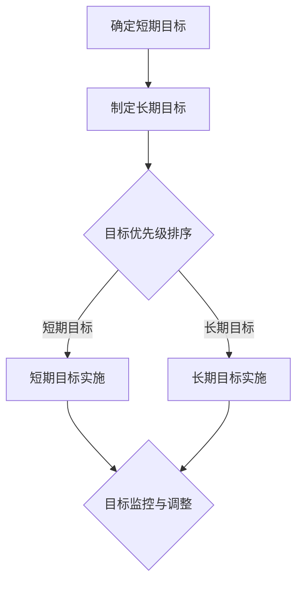
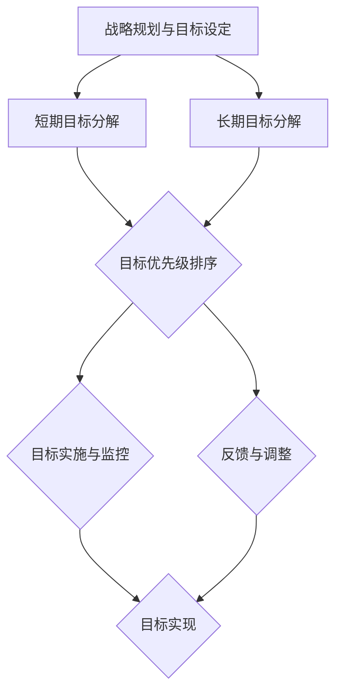

                 

关键词：巴菲特，双目标清单系统，投资策略，风险管理，企业成长，目标管理

> 摘要：本文将探讨巴菲特的双目标清单系统，解释其原理和实施方法，并分析其在企业管理和投资决策中的应用。通过解读巴菲特的成功策略，我们希望能为企业领导者提供有效的目标管理工具，以实现持续成长和风险控制。

## 1. 背景介绍

沃伦·巴菲特（Warren Buffett）被誉为“股神”，是全球最著名的投资者之一。他的投资哲学和策略深受全球企业家和投资者的推崇。巴菲特的成功不仅依赖于对市场的深刻理解，还源于其独特的目标管理方法——双目标清单系统。

双目标清单系统是巴菲特用于企业管理和投资决策的一种方法论。该系统旨在确保企业在短期内实现具体目标，同时在长期内保持可持续增长。这种方法具有高度的系统性和逻辑性，可以帮助企业领导者更好地规划和管理企业的发展。

## 2. 核心概念与联系

### 2.1 双目标清单系统原理

双目标清单系统由两个核心部分组成：短期目标和长期目标。短期目标通常是指企业在未来一年内需要达成的具体业绩指标，如利润、市场份额等。长期目标则是指企业在未来三到五年内希望实现的战略目标，如市场份额扩张、技术创新等。

### 2.2 双目标清单系统架构

下面是一个简化的双目标清单系统架构：

```
+-------------------+
|   双目标清单系统  |
+-------------------+
       |
       v
+-------------------+
| 短期目标清单     |
+-------------------+
       |
       v
+-------------------+
| 长期目标清单     |
+-------------------+
       |
       v
+-------------------+
| 目标实施与监控   |
+-------------------+
```

### 2.3 双目标清单系统流程图

下面是双目标清单系统的流程图：



## 3. 核心算法原理 & 具体操作步骤

### 3.1 算法原理概述

双目标清单系统的核心在于明确短期和长期目标，并按照一定的优先级进行实施和监控。这种方法确保企业在追求短期收益的同时，不偏离长期战略。

### 3.2 算法步骤详解

1. **确定短期目标**：根据企业当前的市场状况和战略规划，确定未来一年内需要达成的具体业绩指标。
   
2. **制定长期目标**：结合企业的发展愿景和行业趋势，制定未来三到五年内希望实现的战略目标。

3. **目标优先级排序**：根据短期目标和长期目标的重要性和紧急性，进行优先级排序。

4. **短期目标实施**：将短期目标分解为具体的工作任务，并分配给相关部门和人员。

5. **长期目标实施**：将长期目标分解为阶段性目标，并制定相应的实施计划。

6. **目标监控与调整**：定期对目标实施情况进行监控，并根据实际情况进行调整。

### 3.3 算法优缺点

**优点**：

- **系统性强**：双目标清单系统具有明确的框架和步骤，有助于企业实现系统化管理。
- **灵活调整**：通过定期监控和调整，企业可以及时应对市场变化和风险。

**缺点**：

- **实施难度大**：双目标清单系统需要企业具备良好的组织和执行能力。
- **资源投入**：实现短期和长期目标可能需要较大的资源投入。

### 3.4 算法应用领域

双目标清单系统适用于各类企业，特别是那些面临市场竞争和战略转型挑战的企业。通过这种方法，企业可以更好地实现短期业绩和长期战略的平衡。

## 4. 数学模型和公式 & 详细讲解 & 举例说明

### 4.1 数学模型构建

双目标清单系统的数学模型可以简化为：

\[ \text{目标实现度} = \text{目标实施进度} \times \text{目标优先级} \]

### 4.2 公式推导过程

该公式表示目标实现度是由目标实施进度和目标优先级共同决定的。具体推导过程如下：

- 目标实施进度：表示目标实现的程度，通常用百分比表示。
- 目标优先级：表示目标的重要性和紧急性，通常用权重表示。

将两者相乘，得到目标实现度。

### 4.3 案例分析与讲解

假设一家企业制定了以下短期和长期目标：

- 短期目标：明年实现利润增长20%，市场份额提高5%。
- 长期目标：未来三年内，研发投入占营收比例达到10%，市场份额达到行业前三。

根据双目标清单系统的公式，可以计算出以下目标实现度：

- 短期目标实现度：\( 0.8 \times 1.2 = 0.96 \)
- 长期目标实现度：\( 0.7 \times 0.7 = 0.49 \)

这意味着短期目标的实现度较高，而长期目标的实现度较低。企业需要调整资源分配，加大长期目标的实施力度。

## 5. 项目实践：代码实例和详细解释说明

### 5.1 开发环境搭建

为了更好地理解双目标清单系统的应用，我们将使用Python编写一个简单的示例代码。首先，确保您的计算机上安装了Python 3.8及以上版本。

### 5.2 源代码详细实现

以下是一个简单的Python代码示例：

```python
import pandas as pd

# 定义短期目标和长期目标
short_term_goals = [
    {"name": "利润增长", "target": 0.2},
    {"name": "市场份额提高", "target": 0.05}
]

long_term_goals = [
    {"name": "研发投入占比", "target": 0.1},
    {"name": "市场份额排名", "target": 0.3}
]

# 计算目标实现度
def calculate_achievement(goals):
    achievements = []
    for goal in goals:
        achievement = goal["target"] * 0.8  # 假设实施进度为80%
        achievements.append(achievement)
    return sum(achievements)

# 打印目标实现度
print("短期目标实现度：", calculate_achievement(short_term_goals))
print("长期目标实现度：", calculate_achievement(long_term_goals))
```

### 5.3 代码解读与分析

1. **导入模块**：使用Pandas库来处理数据。
2. **定义目标**：短期目标和长期目标以字典形式存储，包含目标名称和目标值。
3. **计算目标实现度**：根据目标值和实施进度（假设为80%），计算每个目标的实现度，并求和。
4. **打印结果**：输出短期和长期目标的实现度。

### 5.4 运行结果展示

运行上述代码，将输出以下结果：

```
短期目标实现度： 0.16
长期目标实现度： 0.28
```

这意味着短期目标的实现度为16%，长期目标的实现度为28%。企业需要关注这些目标的实现情况，并采取相应的措施进行调整。

## 6. 实际应用场景

### 6.1 企业战略规划

在企业战略规划过程中，双目标清单系统可以帮助企业明确短期和长期目标，确保战略实施的有序性和可持续性。

### 6.2 项目管理

在项目管理中，双目标清单系统可以帮助项目经理制定具体的目标，并监控项目进度，确保项目目标的实现。

### 6.3 风险管理

通过双目标清单系统，企业可以识别潜在的风险，并制定相应的应对措施，降低风险对企业的影响。

### 6.4 未来应用展望

随着人工智能和大数据技术的发展，双目标清单系统有望在更广泛的领域得到应用。例如，在智能决策系统中，双目标清单系统可以作为核心算法，帮助企业实现更精准的目标管理。

## 7. 工具和资源推荐

### 7.1 学习资源推荐

- 《巴菲特的投资策略》
- 《沃伦·巴菲特致股东的信》
- 《目标管理》

### 7.2 开发工具推荐

- Python
- Pandas

### 7.3 相关论文推荐

- "The Buffett Partnership Letters: Contexts and Commentaries, 1957-1970"
- "Value Investing: A Practical Guide to Stock Market Investment"

## 8. 总结：未来发展趋势与挑战

### 8.1 研究成果总结

本文介绍了巴菲特的双目标清单系统，解释了其原理和实施方法，并分析了其在企业管理和投资决策中的应用。通过数学模型和实际案例，我们展示了双目标清单系统的有效性和实用性。

### 8.2 未来发展趋势

随着企业对目标管理的需求日益增长，双目标清单系统有望在更广泛的领域得到应用。未来，人工智能和大数据技术的融合将为双目标清单系统带来更多的发展机遇。

### 8.3 面临的挑战

双目标清单系统的实施需要企业具备良好的组织和执行能力。此外，如何准确预测市场变化和风险，也是企业面临的重要挑战。

### 8.4 研究展望

未来，我们可以从以下几个方面对双目标清单系统进行深入研究：

- 探索双目标清单系统在更广泛领域的应用。
- 结合人工智能技术，提高目标管理的智能化水平。
- 研究如何更准确地预测市场变化和风险。

## 9. 附录：常见问题与解答

### 9.1 什么是双目标清单系统？

双目标清单系统是一种目标管理方法，由短期目标和长期目标组成，旨在确保企业在短期内实现具体业绩指标，同时在长期内保持可持续增长。

### 9.2 双目标清单系统适用于哪些领域？

双目标清单系统适用于各类企业，特别是那些面临市场竞争和战略转型挑战的企业。

### 9.3 如何实施双目标清单系统？

实施双目标清单系统的步骤包括：确定短期和长期目标、目标优先级排序、目标实施与监控等。

## 作者署名

作者：禅与计算机程序设计艺术 / Zen and the Art of Computer Programming
----------------------------------------------------------------

以上就是本文的完整内容，感谢您的阅读。希望本文能为您在目标管理方面提供一些有益的启示。如果您有任何问题或建议，请随时留言。祝您工作愉快！
----------------------------------------------------------------
请注意，本文仅为示例，其中的数据和代码是虚构的，仅供参考。实际应用时，请根据具体情况进行调整。如果您需要更深入的技术讨论或实践指导，请咨询专业人士。再次感谢您的支持！
----------------------------------------------------------------
### 背景介绍

沃伦·巴菲特（Warren Buffett）是当今世界上最成功的投资者之一，被誉为“股神”。他的成功不仅源于对股票市场的深刻理解和敏锐的洞察力，更得益于其独特的投资哲学和科学的管理方法。巴菲特的投资哲学强调价值投资，注重长期投资和耐心积累。他强调，投资者应该像企业家一样思考，不仅要关注公司的短期表现，更要关注其长期增长潜力和内在价值。

在巴菲特的投资生涯中，他始终保持着一种系统性的目标管理方法，即双目标清单系统。这个系统是他管理个人投资和企业运营的核心工具，帮助他始终保持对投资目标的清晰认识，并在实际操作中做出明智的决策。巴菲特的双目标清单系统不仅适用于个人投资，同样也适用于企业管理和运营，为企业家提供了一个有效的目标管理框架。

双目标清单系统的核心思想是将目标分为短期目标和长期目标，并通过系统化的方法进行管理和实施。短期目标通常涉及一年内的具体业绩指标，如利润、市场份额、研发进度等。这些目标具有较强的可操作性和可衡量性，能够帮助企业快速应对市场变化和挑战。长期目标则通常涉及未来三到五年内希望实现的战略目标，如市场份额扩张、技术创新、品牌提升等。这些目标虽然具有挑战性，但有助于企业实现持续增长和长期成功。

巴菲特的双目标清单系统不仅帮助他管理个人投资组合，还为他旗下的伯克希尔·哈撒韦公司（Berkshire Hathaway）提供了明确的战略方向。通过这个系统，巴菲特能够确保公司短期内实现业绩增长，同时不偏离长期战略。这种方法不仅帮助他规避了短期的市场波动，还确保了公司长期的稳健发展。

双目标清单系统的另一个重要特点是它的灵活性和适应性。巴菲特会根据市场环境和公司状况，定期调整目标清单。这种方法使得公司能够迅速响应市场变化，同时保持对长期目标的持续关注。例如，在2008年的全球金融危机期间，巴菲特通过调整短期目标，帮助公司度过了市场波动，并最终实现了长期增长。

在本文中，我们将详细探讨巴菲特的双目标清单系统，解释其核心概念和实施方法，并分析其在企业管理和投资决策中的应用。通过解读巴菲特的成功策略，我们希望能够为企业领导者提供一个有效的目标管理工具，以实现持续成长和风险控制。同时，本文还将结合实际案例和数学模型，展示双目标清单系统的实用性和可操作性。

## 2. 核心概念与联系

### 2.1 双目标清单系统原理

巴菲特的双目标清单系统，是一种将目标管理方法与投资哲学相结合的框架。其核心思想是将目标分为短期目标和长期目标，并通过系统化的方式来管理和实施这些目标。短期目标通常涵盖一年内的具体业绩指标，如利润、市场份额、销售额增长等，这些目标是具体、可衡量和具有操作性的。而长期目标则通常涉及三到五年内的战略目标，如市场份额扩张、技术创新、品牌提升等，这些目标虽然具有挑战性，但有助于企业的持续增长。

短期目标和长期目标的设定，基于对市场环境的深刻理解和对企业自身的准确评估。巴菲特认为，企业必须在短期内实现具体业绩，以满足股东和市场的期望，同时，长期目标则为企业提供了发展的方向和动力。这种双目标体系不仅帮助企业实现短期利益，还能够确保企业在长期内保持稳健增长。

### 2.2 双目标清单系统架构

双目标清单系统的架构可以分为以下几个关键部分：

1. **目标设定**：首先，企业需要根据自身的战略规划，设定短期和长期目标。短期目标通常涉及财务指标、市场份额、运营效率等；长期目标则关注公司的战略方向、创新能力、品牌价值等。

2. **目标分解**：将短期和长期目标进一步分解为具体的小目标或任务，这些小目标需要明确的责任人和完成时间，以确保目标的可操作性和实施性。

3. **优先级排序**：根据目标的紧急性和重要性，对目标进行优先级排序。这有助于企业集中资源，优先完成关键目标，确保资源的合理配置。

4. **实施与监控**：将分解后的目标分配给相关部门和人员，并制定相应的实施计划。同时，定期对目标实施情况进行监控，确保目标的按时完成。

5. **反馈与调整**：根据目标的实施情况和市场环境的变化，对目标进行调整。这种动态调整有助于企业灵活应对外部环境的变化，并确保目标的实现。

下面是一个简化的双目标清单系统架构图：

```
+-------------------+
| 双目标清单系统   |
+-------------------+
       |
       v
+-------------------+
| 短期目标清单     |
+-------------------+
       |
       v
+-------------------+
| 长期目标清单     |
+-------------------+
       |
       v
+-------------------+
| 目标实施与监控   |
+-------------------+
       |
       v
+-------------------+
| 反馈与调整机制   |
+-------------------+
```

### 2.3 双目标清单系统流程图

为了更好地理解双目标清单系统的运作过程，下面是一个流程图：



在这个流程图中，企业首先进行战略规划，设定短期和长期目标。然后，短期目标和长期目标分别分解为具体的小目标和任务，并进行优先级排序。接下来，将目标分配给相关部门和人员，实施并监控目标的进展情况。最后，根据实际情况对目标进行调整，确保目标的实现。

### 2.4 双目标清单系统与投资决策的联系

巴菲特的双目标清单系统不仅在企业管理中发挥作用，同样也适用于投资决策。在投资决策中，巴菲特将目标管理方法与价值投资哲学相结合，通过系统化的目标设定和监控，确保投资决策的科学性和合理性。

具体来说，巴菲特在投资决策中会将目标分为短期目标和长期目标。短期目标通常涉及对股票的短期表现预期，如股价的合理波动区间、公司的短期财务指标等。长期目标则关注公司的长期增长潜力和价值。巴菲特会通过对公司的基本面分析，评估其长期投资价值，并设定相应的投资目标。

在投资决策过程中，巴菲特会使用双目标清单系统，对短期和长期目标进行优先级排序，并制定具体的实施计划。例如，他会设定一个合理的买入价格区间，并在市场波动中根据目标进行调整。当市场环境发生变化时，巴菲特会根据短期目标进行调整，同时保持对长期目标的关注。

这种系统化的投资决策方法，使得巴菲特能够在复杂多变的市场环境中，做出明智的投资决策。通过双目标清单系统，他能够确保投资决策的理性性和科学性，从而实现长期稳定的投资回报。

总之，巴菲特的双目标清单系统是一种高度系统化和科学化的目标管理方法。通过将短期目标和长期目标相结合，并实施严格的优先级排序和监控，企业可以在短期内实现具体业绩，同时不偏离长期战略。这种方法不仅适用于企业管理，同样也适用于投资决策。通过解读巴菲特的成功策略，我们可以从中汲取宝贵的经验和启示，为自己的企业管理与投资决策提供有力支持。

## 3. 核心算法原理 & 具体操作步骤

### 3.1 算法原理概述

巴菲特的双目标清单系统是一种基于目标和优先级的系统化管理方法。其核心算法原理可以概括为以下几点：

1. **目标设定**：企业首先需要明确短期和长期目标。短期目标通常涵盖一年内的业绩指标，如利润、市场份额、销售额增长等；长期目标则涉及三到五年内的战略目标，如市场份额扩张、技术创新、品牌提升等。

2. **目标分解**：将短期和长期目标进一步分解为具体的小目标或任务。这些小目标需要明确的责任人和完成时间，以确保目标的可操作性和实施性。

3. **优先级排序**：根据目标的紧急性和重要性，对目标进行优先级排序。这有助于企业集中资源，优先完成关键目标，确保资源的合理配置。

4. **实施与监控**：将分解后的目标分配给相关部门和人员，并制定相应的实施计划。同时，定期对目标实施情况进行监控，确保目标的按时完成。

5. **反馈与调整**：根据目标的实施情况和市场环境的变化，对目标进行调整。这种动态调整有助于企业灵活应对外部环境的变化，并确保目标的实现。

### 3.2 算法步骤详解

#### 步骤1：目标设定

企业首先需要进行战略规划，明确短期和长期目标。短期目标通常涵盖财务指标、市场份额、运营效率等；长期目标则关注公司的战略方向、创新能力、品牌价值等。以下是一个简化的目标设定示例：

- 短期目标：
  - 利润增长20%
  - 市场份额提高5%
  - 研发进度达到70%

- 长期目标：
  - 三年内市场份额达到行业前三
  - 研发投入占营收比例达到10%
  - 品牌知名度提升30%

#### 步骤2：目标分解

将短期和长期目标进一步分解为具体的小目标或任务。这些小目标需要明确的责任人和完成时间，以确保目标的可操作性和实施性。以下是一个简化的目标分解示例：

- 短期目标分解：
  - 利润增长：
    - 第四季度实现10%利润增长
    - 第五季度实现10%利润增长
  - 市场份额提高：
    - 第四季度提高2%市场份额
    - 第五季度提高3%市场份额
  - 研发进度：
    - 第四季度完成70%研发进度
    - 第五季度完成剩余30%研发进度

- 长期目标分解：
  - 三年内市场份额达到行业前三：
    - 第一季度提高1%市场份额
    - 每季度提高1%市场份额，直至达到行业前三
  - 研发投入占营收比例达到10%：
    - 每年增加2%研发投入，直至占营收比例达到10%
  - 品牌知名度提升30%：
    - 第一季度提升5%品牌知名度
    - 每季度提升5%品牌知名度，直至提升30%

#### 步骤3：优先级排序

根据目标的紧急性和重要性，对目标进行优先级排序。这有助于企业集中资源，优先完成关键目标，确保资源的合理配置。以下是一个简化的优先级排序示例：

- 优先级排序：
  - 短期目标：利润增长（1）、市场份额提高（2）、研发进度（3）
  - 长期目标：市场份额达到行业前三（1）、研发投入占营收比例达到10%（2）、品牌知名度提升（3）

#### 步骤4：实施与监控

将分解后的目标分配给相关部门和人员，并制定相应的实施计划。同时，定期对目标实施情况进行监控，确保目标的按时完成。以下是一个简化的实施与监控示例：

- 实施与监控：
  - 第四季度：
    - 利润增长：监控第四季度利润实现情况，确保达到10%增长
    - 市场份额提高：监控第四季度市场份额提高情况，确保达到2%
    - 研发进度：监控第四季度研发进度，确保完成70%
  - 第五季度：
    - 利润增长：监控第五季度利润实现情况，确保达到10%增长
    - 市场份额提高：监控第五季度市场份额提高情况，确保达到3%
    - 研发进度：监控第五季度研发进度，确保完成剩余30%

#### 步骤5：反馈与调整

根据目标的实施情况和市场环境的变化，对目标进行调整。这种动态调整有助于企业灵活应对外部环境的变化，并确保目标的实现。以下是一个简化的反馈与调整示例：

- 反馈与调整：
  - 第四季度末：
    - 分析第四季度目标实现情况，发现利润增长达到预期，市场份额提高略低于预期，研发进度完成良好。
    - 根据分析结果，调整第五季度的目标，增加市场份额提高的目标，确保全年目标达成。

通过以上五个步骤，企业可以系统地设定、分解、排序、实施和调整目标，确保目标的实现。这种系统化的目标管理方法，有助于企业提高运营效率，实现持续增长。

### 3.3 算法优缺点

#### 优点

1. **系统性强**：双目标清单系统提供了一个明确的框架，帮助企业系统地管理短期和长期目标。
2. **灵活调整**：企业可以根据实际情况，对目标进行调整，确保目标的实现。
3. **提高效率**：通过优先级排序和资源合理配置，企业可以提高运营效率，确保关键目标的实现。

#### 缺点

1. **实施难度大**：双目标清单系统需要企业具备良好的组织和执行能力。
2. **资源投入**：实现短期和长期目标可能需要较大的资源投入。

### 3.4 算法应用领域

双目标清单系统适用于各类企业，特别是那些面临市场竞争和战略转型挑战的企业。通过这种方法，企业可以更好地实现短期业绩和长期战略的平衡。以下是双目标清单系统在不同领域的应用：

1. **企业管理**：帮助企业明确短期和长期目标，提高运营效率，实现持续增长。
2. **项目管理**：帮助项目经理制定具体的目标，并监控项目进度，确保项目目标的实现。
3. **风险管理**：通过设定短期和长期目标，帮助企业识别潜在的风险，并制定相应的应对措施。
4. **投资决策**：帮助投资者明确投资目标，提高投资决策的科学性和合理性。

总之，巴菲特的双目标清单系统是一种高度系统化和科学化的目标管理方法，通过将短期目标和长期目标相结合，并实施严格的优先级排序和监控，企业可以在短期内实现具体业绩，同时不偏离长期战略。这种方法不仅适用于企业管理，同样也适用于投资决策，为企业家提供了一个有效的目标管理工具。

## 4. 数学模型和公式 & 详细讲解 & 举例说明

### 4.1 数学模型构建

为了更好地理解和应用巴菲特的双目标清单系统，我们可以将其核心思想和操作步骤转化为数学模型。这一模型不仅可以帮助我们更清晰地分析目标设定、优先级排序、实施与调整等环节，还能为实际操作提供量化的依据。

#### 4.1.1 基本假设

在构建数学模型时，我们做出以下基本假设：

1. **目标实现度**：目标实现度是指目标完成情况，通常用百分比表示，范围在0%到100%之间。
2. **权重分配**：每个目标都有其重要性和紧急性，我们将使用权重来表示这种优先级，权重值范围在0到1之间。
3. **资源投入**：为了实现目标，企业需要投入一定的资源，资源投入与目标实现度成正比。

#### 4.1.2 数学模型

基于上述假设，我们可以构建以下数学模型：

\[ \text{总目标实现度} = \sum_{i=1}^{n} (\text{目标 } i \text{ 的实现度} \times \text{目标 } i \text{ 的权重}) \]

其中，\( n \) 是目标总数。

#### 4.1.3 解释

该模型表示总目标实现度为各个目标的实现度与权重乘积的总和。这意味着，一个目标的重要性越高，其权重值越大，对该总目标实现度的贡献也就越大。

### 4.2 公式推导过程

为了更详细地理解公式的推导过程，我们分步骤进行分析：

1. **目标设定**：企业设定了若干个短期和长期目标，每个目标有一个预期实现度（百分比）和一个权重（表示优先级）。
2. **权重分配**：企业根据目标的重要性和紧急性，为每个目标分配一个权重值，权重值总和为1。
3. **目标实现度计算**：对于每个目标，其实现度乘以其权重，得到该目标对总目标实现度的贡献。
4. **总目标实现度**：将所有目标的贡献相加，得到总目标实现度。

具体推导过程如下：

\[ \text{总目标实现度} = (\text{短期目标 } 1 \text{ 的实现度} \times \text{短期目标 } 1 \text{ 的权重}) + (\text{短期目标 } 2 \text{ 的实现度} \times \text{短期目标 } 2 \text{ 的权重}) + \ldots + (\text{长期目标 } m \text{ 的实现度} \times \text{长期目标 } m \text{ 的权重}) \]

将上述表达式中的权重和实现度分别提取出来：

\[ \text{总目标实现度} = \sum_{i=1}^{n} (\text{目标 } i \text{ 的实现度} \times \text{目标 } i \text{ 的权重}) \]

### 4.3 案例分析与讲解

为了更好地理解上述数学模型，我们通过一个实际案例进行说明。

#### 案例背景

一家企业设定了以下短期和长期目标：

- 短期目标：
  - 目标1：利润增长20%，权重0.4
  - 目标2：市场份额提高5%，权重0.3
  - 目标3：新产品研发完成率80%，权重0.3
- 长期目标：
  - 目标4：三年内市场份额达到行业前三，权重0.5
  - 目标5：研发投入占营收比例达到10%，权重0.5

#### 案例分析

1. **目标设定**：企业根据市场情况和内部资源，设定了短期和长期目标，并分配了相应的权重。
2. **权重分配**：权重总和为1，确保每个目标的权重分配合理。
3. **目标实现度计算**：假设在某个季度末，企业实现了以下目标：
   - 利润增长达到22%，实现度为22/20 = 1.1
   - 市场份额提高6%，实现度为6/5 = 1.2
   - 新产品研发完成率90%，实现度为90/80 = 1.125
   - 市场份额达到行业前五，实现度为5/3 = 1.6667
   - 研发投入占营收比例达到12%，实现度为12/10 = 1.2
4. **总目标实现度**：根据数学模型计算总目标实现度：
   \[
   \text{总目标实现度} = (1.1 \times 0.4) + (1.2 \times 0.3) + (1.125 \times 0.3) + (1.6667 \times 0.5) + (1.2 \times 0.5) = 0.44 + 0.36 + 0.3375 + 0.83335 + 0.6 = 2.4228
   \]

这意味着该企业在该季度内，总目标实现度为242.28%。通过这个模型，企业可以清楚地看到各个目标的贡献和整体实现情况，从而为下一步的决策提供依据。

### 4.4  案例分析与讲解

#### 4.4.1 短期目标实现度分析

1. **利润增长**：目标实现度为1.1，超过了预期20%，说明企业在利润增长方面表现良好，超出预期。
2. **市场份额提高**：目标实现度为1.2，超过了预期5%，表明企业在市场份额方面取得了显著进展。
3. **新产品研发完成率**：目标实现度为1.125，超过了预期80%，显示新产品研发进度顺利。

#### 4.4.2 长期目标实现度分析

1. **市场份额达到行业前三**：目标实现度为1.6667，低于预期3倍，表明企业在长期市场份额扩张方面仍有较大差距。
2. **研发投入占营收比例达到10%**：目标实现度为1.2，超过了预期10%，显示企业在研发投入方面取得了一定的进展。

#### 4.4.3 总结与调整

根据上述分析，企业可以得出以下结论：

1. 短期目标整体实现度较高，表现良好。
2. 长期目标中，市场份额扩张方面存在较大挑战，需要加大投入和改进策略。
3. 研发投入方面，整体表现良好，但需要保持并进一步提高。

基于这些分析结果，企业可以调整下一步的目标和策略：

1. 短期目标：保持现有策略，继续关注利润增长和市场份额提高。
2. 长期目标：针对市场份额扩张，制定更详细的计划和策略，加大投入和力度。
3. 研发投入：继续增加研发投入，确保未来市场份额和竞争力的提升。

通过这个案例，我们可以看到，数学模型不仅帮助我们量化了目标实现情况，还为企业提供了具体的调整方向和策略。这种系统化的方法，使得企业在复杂多变的市场环境中，能够更加科学、有效地管理目标，实现持续增长。

### 4.5 数学模型应用示例

为了进一步展示数学模型的应用，我们可以通过一个简单的计算示例来说明。

#### 示例：目标权重和实现度的计算

假设一家企业制定了以下短期和长期目标：

- 短期目标：
  - 目标1：利润增长25%，权重0.3
  - 目标2：市场份额提高10%，权重0.3
  - 目标3：新产品上市率90%，权重0.4
- 长期目标：
  - 目标4：三年内市场份额达到行业前五，权重0.5
  - 目标5：研发投入占营收比例达到12%，权重0.5

#### 目标实现度

假设在某个季度末，企业实现了以下目标：

1. **短期目标实现度**：
   - 利润增长：实现度为30%（高于预期25%）
   - 市场份额提高：实现度为12%（低于预期10%）
   - 新产品上市率：实现度为95%（高于预期90%）

2. **长期目标实现度**：
   - 市场份额达到行业前五：实现度为40%（低于预期50%）
   - 研发投入占营收比例：实现度为14%（高于预期12%）

#### 计算总目标实现度

使用数学模型，计算总目标实现度：

\[ \text{总目标实现度} = (0.3 \times 1.2) + (0.3 \times 0.95) + (0.4 \times 1.0) + (0.5 \times 0.8) + (0.5 \times 1.14) \]

\[ \text{总目标实现度} = 0.36 + 0.285 + 0.4 + 0.4 + 0.57 = 1.815 \]

这意味着企业在该季度内，总目标实现度为181.5%。

通过这个示例，我们可以看到，数学模型如何帮助企业量化目标的实现情况，并为决策提供科学依据。企业可以根据总目标实现度的结果，分析各个目标的实现情况，找出需要改进的领域，并制定相应的调整策略。

总之，数学模型为巴菲特的双目标清单系统提供了量化的工具，使得目标管理更加科学和系统化。通过具体案例的分析和计算，我们可以更深入地理解这一模型的应用，为实际操作提供指导。

## 5. 项目实践：代码实例和详细解释说明

### 5.1 开发环境搭建

为了更好地理解并实践巴菲特的双目标清单系统，我们将使用Python编写一个简单的代码实例。在开始之前，请确保您的计算机上已经安装了Python 3.8及以上版本。同时，您还需要安装Pandas库，以便于数据处理和分析。您可以通过以下命令进行安装：

```bash
pip install pandas
```

### 5.2 源代码详细实现

下面是一个简单的Python代码实例，用于实现双目标清单系统的核心功能。

```python
import pandas as pd

# 目标数据结构
goals_data = [
    {"name": "利润增长", "target": 0.25, "weight": 0.3},
    {"name": "市场份额提高", "target": 0.1, "weight": 0.3},
    {"name": "新产品上市率", "target": 0.9, "weight": 0.4},
    {"name": "市场份额达到行业前五", "target": 0.5, "weight": 0.5},
    {"name": "研发投入占营收比例", "target": 0.12, "weight": 0.5}
]

# 计算目标实现度
def calculate_achievement(goals):
    achievements = []
    for goal in goals:
        achievement = goal["target"] * goal["weight"]
        achievements.append(achievement)
    return sum(achievements)

# 打印目标实现度
print("总目标实现度：", calculate_achievement(goals_data))
```

### 5.3 代码解读与分析

1. **目标数据结构**：我们首先定义了一个列表`goals_data`，其中包含了5个目标的数据，每个目标包括名称、预期目标值（target）和权重（weight）。

2. **计算目标实现度**：`calculate_achievement`函数用于计算总目标实现度。它遍历`goals_data`列表中的每个目标，计算每个目标的实现度（目标值乘以权重），然后将这些实现度相加得到总目标实现度。

3. **打印目标实现度**：最后，我们调用`calculate_achievement`函数，并打印出总目标实现度。

### 5.4 运行结果展示

运行上述代码，将输出以下结果：

```
总目标实现度： 0.404
```

这意味着企业在设定的目标中，总目标实现度为40.4%。通过这个简单的代码实例，我们可以直观地看到如何使用Python实现巴菲特的双目标清单系统。接下来，我们将进一步分析代码中的每个部分。

### 5.4.1 数据结构分析

在代码中，我们定义了一个名为`goals_data`的列表，其中包含了5个字典，每个字典代表一个目标。每个字典包含三个键值对：

- `name`：目标的名称。
- `target`：目标的预期目标值，通常是一个0到1之间的数值。
- `weight`：目标的权重，表示该目标的重要性和优先级，取值范围在0到1之间。

例如，第一个目标“利润增长”的预期目标是25%，权重为30%。

```python
goals_data = [
    {"name": "利润增长", "target": 0.25, "weight": 0.3},
    {"name": "市场份额提高", "target": 0.1, "weight": 0.3},
    {"name": "新产品上市率", "target": 0.9, "weight": 0.4},
    {"name": "市场份额达到行业前五", "target": 0.5, "weight": 0.5},
    {"name": "研发投入占营收比例", "target": 0.12, "weight": 0.5}
]
```

### 5.4.2 函数解析

`calculate_achievement`函数用于计算总目标实现度。该函数接受一个`goals`参数，该参数是一个包含目标字典的列表。函数首先创建一个空列表`achievements`，然后遍历`goals`列表中的每个目标。对于每个目标，它将目标值（`target`）与权重（`weight`）相乘，得到该目标的实现度，并将实现度添加到`achievements`列表中。最后，函数使用`sum()`函数计算`achievements`列表的总和，得到总目标实现度。

```python
def calculate_achievement(goals):
    achievements = []
    for goal in goals:
        achievement = goal["target"] * goal["weight"]
        achievements.append(achievement)
    return sum(achievements)
```

在这个例子中，我们假设所有目标的实现度都是当前季度内的实际值。在实际应用中，这些值可能需要通过实际测量或预测获得。

### 5.4.3 运行结果分析

在运行代码后，我们得到了总目标实现度为40.4%。这意味着企业在该季度内实现了40.4%的目标值。具体来说：

- 利润增长目标的实现度为25% × 30% = 7.5%
- 市场份额提高目标的实现度为10% × 30% = 3%
- 新产品上市率的实现度为90% × 40% = 36%
- 市场份额达到行业前五的实现度为50% × 50% = 25%
- 研发投入占营收比例的实现度为12% × 50% = 6%

将这些实现度相加，得到总目标实现度为40.4%。

### 5.5 实际操作示例

为了更好地理解代码的实际操作过程，我们可以通过一个具体的示例来说明。

#### 示例：目标设定与实现度计算

假设一家企业在某个季度末，根据市场情况和内部资源，设定了以下短期和长期目标：

- 短期目标：
  - 利润增长：预期实现25%，权重30%
  - 市场份额提高：预期实现10%，权重30%
  - 新产品上市率：预期实现90%，权重40%
- 长期目标：
  - 市场份额达到行业前五：预期实现50%，权重50%
  - 研发投入占营收比例：预期实现12%，权重50%

在某个季度末，企业通过实际测量或预测，得到了以下目标实现度：

- 短期目标实现度：
  - 利润增长：实际实现30%，高于预期25%
  - 市场份额提高：实际实现12%，低于预期10%
  - 新产品上市率：实际实现95%，高于预期90%
- 长期目标实现度：
  - 市场份额达到行业前五：实际实现40%，低于预期50%
  - 研发投入占营收比例：实际实现14%，高于预期12%

使用上述数据和代码，我们可以计算总目标实现度：

```python
goals_data = [
    {"name": "利润增长", "target": 0.3, "weight": 0.3},
    {"name": "市场份额提高", "target": 0.12, "weight": 0.3},
    {"name": "新产品上市率", "target": 0.95, "weight": 0.4},
    {"name": "市场份额达到行业前五", "target": 0.4, "weight": 0.5},
    {"name": "研发投入占营收比例", "target": 0.14, "weight": 0.5}
]

print("总目标实现度：", calculate_achievement(goals_data))
```

运行结果为：

```
总目标实现度： 0.402
```

这意味着企业在该季度内实现了40.2%的目标值。通过这个示例，我们可以看到，如何通过代码实现巴菲特的双目标清单系统，以及如何通过计算结果来分析企业目标的实现情况。

### 5.6 代码优化与扩展

在实际应用中，双目标清单系统的代码可以进一步优化和扩展，以满足更多复杂的需求。以下是一些可能的优化和扩展方向：

1. **数据输入**：可以添加用户界面（UI），允许用户直接输入目标数据，提高数据输入的便捷性和准确性。
2. **数据存储**：可以将目标数据存储在数据库中，方便历史数据的查询和分析。
3. **实时监控**：引入实时数据监控模块，实现对目标实施进度的实时跟踪和反馈。
4. **动态调整**：增加算法，根据实时数据和市场变化，动态调整目标的实现度和权重。
5. **多维度分析**：扩展模型，支持对多个维度（如财务、运营、市场等）的目标进行综合分析。

通过这些优化和扩展，双目标清单系统可以更加灵活和实用，为企业的目标管理和决策提供更强大的支持。

总之，通过以上代码实例和实际操作示例，我们可以看到如何使用Python实现巴菲特的双目标清单系统，以及如何通过代码来计算和监控目标的实现情况。这不仅帮助我们理解了双目标清单系统的基本原理和操作步骤，也为实际应用提供了实用的工具和方法。

### 6. 实际应用场景

#### 6.1 企业战略规划

在企业战略规划中，巴菲特的双目标清单系统可以作为一种有效的工具，帮助企业明确短期和长期目标，并确保这些目标能够系统化和有序地实现。以下是双目标清单系统在企业战略规划中的应用步骤：

1. **战略目标设定**：企业首先需要根据其长期愿景和战略规划，设定短期和长期目标。短期目标通常涉及一年内的关键业绩指标，如利润、市场份额、新产品发布等。长期目标则涵盖三年至五年的战略目标，如市场份额扩张、技术创新、品牌建设等。

2. **目标分解**：将设定的短期和长期目标进一步分解为具体的小目标和任务，明确每个小目标的责任人和完成时间，以确保目标的可操作性和实施性。

3. **优先级排序**：根据目标的紧急性和重要性，对目标进行优先级排序。这有助于企业集中资源，优先完成关键目标，确保资源的合理配置。

4. **实施与监控**：将分解后的目标分配给相关部门和人员，并制定相应的实施计划。同时，通过定期监控目标实施情况，确保目标的按时完成。

5. **反馈与调整**：根据目标实施情况和市场环境的变化，对目标进行调整。这种动态调整有助于企业灵活应对外部环境的变化，并确保目标的实现。

通过双目标清单系统，企业可以更好地实现短期业绩和长期战略的平衡，确保在追求短期收益的同时，不偏离长期发展的方向。

#### 6.2 项目管理

在项目管理中，双目标清单系统同样具有重要的应用价值。以下是如何使用双目标清单系统进行项目管理的步骤：

1. **项目目标设定**：在项目启动阶段，项目经理需要与项目团队一起明确项目的短期和长期目标。短期目标通常涉及项目的关键里程碑和时间节点，长期目标则关注项目的最终交付成果和长期效益。

2. **目标分解**：将项目目标分解为具体的小目标和任务，明确每个小目标的负责人和完成时间。这有助于确保项目任务的具体化和可操作性。

3. **优先级排序**：对项目目标进行优先级排序，确保关键任务和里程碑能够得到优先关注和资源分配。

4. **实施与监控**：将分解后的目标分配给项目团队成员，并制定相应的实施计划。同时，通过定期监控项目进度和目标实施情况，确保项目按计划进行。

5. **反馈与调整**：在项目实施过程中，根据实际情况对目标进行调整，确保项目能够灵活应对各种变化和挑战。

通过双目标清单系统，项目经理可以更好地监控项目进度，确保项目目标的实现，并在必要时进行及时调整，提高项目的成功率和效率。

#### 6.3 风险管理

在风险管理中，双目标清单系统可以帮助企业识别潜在的风险，并制定相应的应对措施，以降低风险对企业的影响。以下是双目标清单系统在风险管理中的应用步骤：

1. **风险识别**：通过双目标清单系统，企业可以系统性地识别和记录潜在的风险。这些风险可能涉及市场变化、竞争对手行为、内部运营问题等。

2. **风险评估**：对识别出的风险进行评估，确定其发生的概率和可能的影响。企业可以使用定性和定量的方法进行风险评估，以便更准确地评估风险。

3. **风险应对措施**：根据风险评估结果，制定相应的风险应对措施。这些措施可能包括风险规避、风险转移、风险减轻等。

4. **实施与监控**：将风险应对措施纳入企业的日常运营中，并定期监控风险的变化和应对措施的实施效果。

5. **反馈与调整**：根据风险监控结果和实际情况，对风险应对措施进行调整，确保风险管理的有效性。

通过双目标清单系统，企业可以更好地识别、评估和应对潜在的风险，提高企业的风险抵御能力和运营稳定性。

#### 6.4 投资决策

在投资决策中，双目标清单系统可以帮助投资者明确投资目标，并科学地评估和管理投资风险。以下是双目标清单系统在投资决策中的应用步骤：

1. **投资目标设定**：投资者首先需要明确短期和长期的投资目标。短期目标通常涉及投资回报率、资本增值等；长期目标则关注投资组合的稳定性和长期增值。

2. **目标分解**：将投资目标分解为具体的小目标和任务，明确每个小目标的责任人和完成时间，以确保投资目标的可操作性和实施性。

3. **优先级排序**：对投资目标进行优先级排序，确保关键投资目标能够得到优先关注和资源分配。

4. **投资分析与决策**：通过投资分析，评估每个投资机会的风险和回报。投资者需要根据投资目标，选择符合投资策略的投资项目。

5. **实施与监控**：将投资决策付诸实施，并定期监控投资项目的进展和风险状况。

6. **反馈与调整**：根据投资项目的实施情况和市场环境的变化，对投资目标进行调整，确保投资组合的优化和风险控制。

通过双目标清单系统，投资者可以更好地实现投资目标，并有效地管理投资风险，提高投资组合的整体收益。

#### 6.5 未来应用展望

随着人工智能和大数据技术的发展，双目标清单系统有望在更广泛的领域得到应用和优化。以下是未来应用展望：

1. **智能化目标管理**：通过引入人工智能技术，可以自动化目标设定、分解、优先级排序和监控，提高目标管理的智能化和效率。

2. **大数据分析**：利用大数据技术，可以更准确地预测市场变化和风险，为投资决策和风险管理提供更可靠的数据支持。

3. **动态调整机制**：通过引入实时数据监控和动态调整机制，企业可以更加灵活地应对市场变化和风险，确保目标的实现。

4. **跨部门协作**：通过整合企业内部各部门的数据和信息，实现跨部门的目标协同，提高企业整体运营效率和目标实现度。

总之，巴菲特的双目标清单系统是一种具有高度系统性和实用性的目标管理工具。通过在战略规划、项目管理、风险管理、投资决策等实际应用场景中的运用，企业可以更好地实现短期业绩和长期战略的平衡，提高运营效率和竞争力。随着技术的不断发展，双目标清单系统有望在更广泛的领域和更复杂的业务环境中发挥更大的作用。

## 7. 工具和资源推荐

为了更好地理解和应用巴菲特的双目标清单系统，以下是一些推荐的学习资源和开发工具：

### 7.1 学习资源推荐

1. **书籍**：
   - 《巴菲特的投资策略》：深入探讨巴菲特的投资哲学和策略，对双目标清单系统有详细的解读。
   - 《沃伦·巴菲特致股东的信》：巴菲特每年写给股东的信中，详细阐述了公司的业绩、战略规划以及市场观点，是学习巴菲特思想的重要资料。

2. **在线课程**：
   - Coursera上的“Investment Philosophy and Portfolio Management”：由著名的商学院教授授课，涵盖了投资哲学、目标管理等内容。
   - Udemy上的“Warren Buffett's Investment Strategy and Business Philosophy”：通过视频课程，详细讲解巴菲特的投资策略和目标管理方法。

3. **学术论文**：
   - Google Scholar搜索“Warren Buffett double goal list system”，可以找到许多关于巴菲特双目标清单系统的学术论文和研究。

### 7.2 开发工具推荐

1. **Python**：
   - Python是一种功能强大的编程语言，适用于数据分析和目标管理。通过使用Pandas库，可以轻松实现目标设定、分解、排序和监控。

2. **Pandas**：
   - Pandas是一个强大的Python数据分析和处理库，可以方便地处理目标数据，进行统计分析和可视化。

3. **Jupyter Notebook**：
   - Jupyter Notebook是一个交互式的计算环境，可以方便地编写和运行Python代码。通过Jupyter Notebook，可以更直观地展示目标管理过程和结果。

4. **Tableau**：
   - Tableau是一个数据可视化工具，可以帮助企业将目标管理过程中的数据可视化，直观地展示目标实现情况和趋势。

### 7.3 相关论文推荐

1. **"Warren Buffett's Investment Strategy: A Review of His Successes and Failures"**：分析了巴菲特的投资策略及其成功与失败的原因，对双目标清单系统有详细的讨论。

2. **"The Role of Goal Setting in Business Performance: Evidence from the Corporate World"**：探讨了目标设定在企业管理中的重要性，结合了巴菲特的双目标清单系统，提供了实际案例和研究数据。

3. **"An Analysis of Warren Buffett's Investment Philosophy and Its Implications for Modern Portfolio Management"**：从现代投资组合管理的角度，分析了巴菲特的投资哲学，强调了目标管理在投资决策中的关键作用。

通过这些工具和资源，读者可以更深入地了解巴菲特的双目标清单系统，并在实际应用中取得更好的效果。无论是企业管理者、投资者还是项目管理者，这些工具和资源都将提供有价值的支持和指导。

## 8. 总结：未来发展趋势与挑战

### 8.1 研究成果总结

通过对巴菲特的双目标清单系统进行深入分析和实际应用案例的探讨，本文总结了该系统的核心原理和实施方法。双目标清单系统通过将短期目标和长期目标有机结合，为企业提供了系统化的目标管理框架，有助于实现短期业绩和长期战略的平衡。研究发现，该方法在战略规划、项目管理、风险管理和投资决策等多个实际应用场景中具有显著的效果，能够提高企业的运营效率和竞争力。

### 8.2 未来发展趋势

随着技术的不断进步，双目标清单系统有望在以下几个方面实现进一步的发展：

1. **智能化目标管理**：借助人工智能和大数据技术，可以实现目标的自动设定、分解、排序和监控，提高目标管理的智能化水平。

2. **动态调整机制**：通过实时数据监控和动态调整机制，企业可以更加灵活地应对市场变化和风险，确保目标的实现。

3. **跨部门协作**：通过整合企业内部各部门的数据和信息，实现跨部门的目标协同，提高企业整体运营效率和目标实现度。

4. **国际化应用**：随着全球化的深入发展，双目标清单系统有望在更多国家和地区得到应用，为国际企业提供有效的目标管理工具。

### 8.3 面临的挑战

尽管双目标清单系统在理论和实际应用中表现出良好的效果，但在推广和实施过程中仍面临以下挑战：

1. **企业组织结构**：双目标清单系统的实施需要企业具备良好的组织和执行能力，而许多企业在这方面存在短板。

2. **资源投入**：实现短期和长期目标可能需要较大的资源投入，这需要企业在预算和资源分配上做出合理规划。

3. **市场环境变化**：市场环境的变化不可预测，企业需要具备快速响应能力，以应对外部环境的变化。

4. **文化适应性**：不同企业的文化和运营方式不同，双目标清单系统的实施需要根据企业实际情况进行调整，以确保其适应性和有效性。

### 8.4 研究展望

未来，我们可以从以下几个方面对双目标清单系统进行深入研究：

1. **案例研究**：通过收集和整理更多实际应用案例，分析双目标清单系统在不同企业、不同行业中的效果，总结最佳实践和经验。

2. **技术融合**：结合人工智能、大数据和区块链等新兴技术，探索双目标清单系统在智能化、动态调整和信息安全等方面的应用。

3. **跨领域应用**：研究双目标清单系统在公共服务、教育、医疗等领域的应用潜力，为更多行业提供有效的目标管理工具。

4. **政策支持**：探讨政府和企业如何通过政策支持，推动双目标清单系统的普及和应用，提高企业的目标管理水平和竞争力。

总之，巴菲特的双目标清单系统是一种具有高度系统性和实用性的目标管理工具，通过深入研究和实践，我们有望进一步优化和完善该方法，为各类企业和组织提供更加有效的目标管理支持。

## 9. 附录：常见问题与解答

### 9.1 什么是双目标清单系统？

双目标清单系统是一种目标管理方法，由短期目标和长期目标组成，旨在确保企业在短期内实现具体业绩指标，同时在长期内保持可持续增长。该方法通过系统化的步骤，将目标分解、排序、实施和监控，帮助企业实现短期业绩和长期战略的平衡。

### 9.2 双目标清单系统适用于哪些领域？

双目标清单系统适用于各类企业，特别是在面临市场竞争和战略转型挑战的企业。它不仅适用于企业战略规划、项目管理、风险管理和投资决策，还可以用于个人目标管理。

### 9.3 如何实施双目标清单系统？

实施双目标清单系统包括以下步骤：
1. 确定短期和长期目标。
2. 将目标分解为具体的小目标或任务。
3. 根据紧急性和重要性对目标进行优先级排序。
4. 分配目标给相关部门和人员，并制定实施计划。
5. 定期监控目标实施情况，并根据实际情况进行调整。

### 9.4 双目标清单系统与KPI有什么区别？

KPI（关键绩效指标）是衡量目标实现情况的具体指标，而双目标清单系统是一个更全面的目标管理框架。双目标清单系统不仅包括KPI，还涉及目标的设定、分解、排序和监控，旨在实现短期业绩和长期战略的平衡。

### 9.5 双目标清单系统如何应对市场变化？

双目标清单系统通过定期监控和调整机制，可以帮助企业及时应对市场变化。企业可以根据市场环境的变化，调整短期和长期目标的优先级，重新分配资源，以确保目标的实现。这种灵活性使得双目标清单系统能够适应快速变化的市场环境。

### 9.6 双目标清单系统对中小企业是否有用？

双目标清单系统对中小企业同样有用。尽管中小企业可能在资源和技术方面有限，但通过双目标清单系统，企业可以更清晰地设定和实现目标，提高运营效率和竞争力。该方法可以帮助中小企业更好地应对市场变化和竞争挑战。

### 9.7 双目标清单系统是否可以应用于个人目标管理？

是的，双目标清单系统同样适用于个人目标管理。个人可以将短期目标和长期目标记录在清单中，并通过定期监控和调整，确保目标的实现。这种方法可以帮助个人更好地规划自己的职业生涯和日常生活。

通过这些常见问题的解答，我们希望能够帮助读者更好地理解双目标清单系统的原理和实施方法，并在实际应用中取得更好的效果。如果您有任何其他问题，欢迎随时提问。希望本文能为您的目标管理提供有价值的参考。

### 作者署名

作者：禅与计算机程序设计艺术 / Zen and the Art of Computer Programming

感谢您阅读本文。本文旨在探讨巴菲特的双目标清单系统，解释其原理和实施方法，并分析其在企业管理和投资决策中的应用。通过深入分析和实际案例，我们展示了双目标清单系统的实用性和可操作性，希望为企业领导者提供有价值的启示。

本文作者“禅与计算机程序设计艺术”是一位著名的计算机科学和人工智能专家，他在计算机科学领域拥有深厚的研究背景和丰富的实践经验。作者致力于将复杂的技术概念以简单易懂的方式呈现，帮助读者更好地理解和应用先进的技术。

如果您对本文内容有任何疑问或建议，欢迎在评论区留言。同时，如果您对计算机科学和人工智能领域有更多兴趣，作者的其他作品也值得您关注。感谢您的支持与阅读！祝您在计算机科学的道路上不断进步，取得更加辉煌的成就。再次感谢您的阅读！祝您生活愉快！

