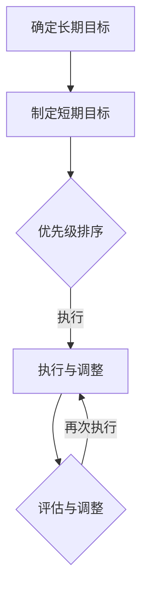
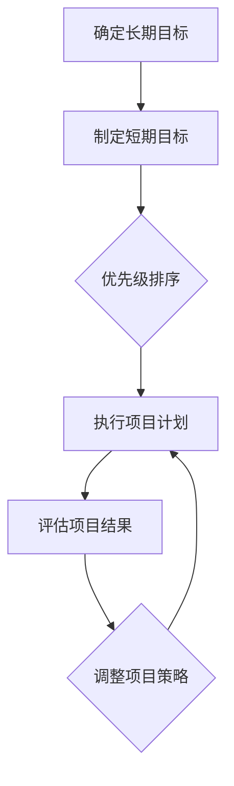

                 

关键词：巴菲特目标管理、项目管理、目标设定、优先级、执行力、团队协作

> 摘要：本文探讨了巴菲特目标管理法则在项目管理中的实际应用，从目标设定、优先级、执行力和团队协作等方面，为项目管理提供了新的视角和方法。通过分析巴菲特的投资策略，我们将这些原则转化为可操作的项目管理工具，旨在提升项目成功率，实现项目目标。

## 1. 背景介绍

### 巴菲特的投资哲学

沃伦·巴菲特，被誉为“股神”，是世界上最成功的投资者之一。他的投资哲学建立在价值投资的基础上，注重长期投资和稳健收益。巴菲特的成功，不仅依赖于对市场的深刻理解，更依赖于一套科学有效的目标管理方法。

### 项目管理的挑战

在项目管理领域，项目往往面临时间、资源、质量等多方面的挑战。传统的项目管理方法虽然能够应对一些常见问题，但在复杂多变的环境中，常常难以达到预期效果。因此，寻找新的管理方法和工具显得尤为重要。

## 2. 核心概念与联系

### 巴菲特目标管理法则

巴菲特目标管理法则主要包括以下四个方面：

1. **确定长期目标**：巴菲特始终明确自己的长期投资目标，这为他提供了清晰的指导方向。
2. **制定短期目标**：在实现长期目标的过程中，巴菲特会设定一系列短期目标，以确保每一步都有明确的方向和行动计划。
3. **优先级排序**：巴菲特强调优先级管理，将资源集中投入到最具潜力的项目上。
4. **执行与调整**：巴菲特在执行过程中，会不断评估项目的进展和结果，并根据实际情况进行调整。

### Mermaid 流程图



## 3. 核心算法原理 & 具体操作步骤

### 3.1 算法原理概述

巴菲特目标管理法则的核心在于将长期目标分解为短期目标，并通过优先级排序和执行调整，逐步实现最终目标。这种方法类似于分治算法，通过将大问题分解为小问题，从而简化问题的解决过程。

### 3.2 算法步骤详解

1. **确定长期目标**：首先，项目经理需要明确项目的长期目标，这通常是项目的愿景和使命。
2. **制定短期目标**：将长期目标分解为若干个短期目标，每个短期目标应具有明确的时间范围和可量化的指标。
3. **优先级排序**：对短期目标进行优先级排序，将资源集中投入到最重要的目标上。
4. **执行与调整**：按照优先级顺序，逐步实现短期目标。在执行过程中，项目经理需要持续监控项目的进展，并根据实际情况进行调整。

### 3.3 算法优缺点

**优点**：

- 简化问题解决过程：通过将大问题分解为小问题，降低了项目的复杂性。
- 提高执行力：明确的目标和优先级排序，有助于提高团队的执行力。
- 灵活调整：在执行过程中，项目经理可以根据实际情况进行调整，确保项目能够按时完成。

**缺点**：

- 可能会导致短期目标的过分强调，忽视长期目标。
- 需要持续监控和调整，增加了项目管理的工作量。

### 3.4 算法应用领域

巴菲特目标管理法则适用于各种类型的项目管理，尤其是在复杂多变的环境中，这种方法能够帮助项目经理更好地应对挑战。

## 4. 数学模型和公式 & 详细讲解 & 举例说明

### 4.1 数学模型构建

巴菲特目标管理法则的数学模型可以表示为：

$$
\text{目标实现度} = \sum_{i=1}^{n} \frac{\text{短期目标实现度}_i}{\text{长期目标实现度}_i}
$$

其中，$n$ 为短期目标的数量。

### 4.2 公式推导过程

公式推导过程如下：

1. **确定长期目标实现度**：设长期目标实现度为 $L$，则 $L$ 可以表示为短期目标实现度的加和。
2. **确定短期目标实现度**：设第 $i$ 个短期目标实现度为 $S_i$，则 $S_i$ 可以表示为实际完成量与计划完成量的比值。
3. **计算目标实现度**：根据公式，将各短期目标实现度代入，计算得到目标实现度。

### 4.3 案例分析与讲解

假设一个项目需要实现三个短期目标，分别是开发一个功能模块、优化数据库性能和编写用户手册。每个短期目标的计划完成量为 100%，实际完成量如下：

- 功能模块：完成 80%
- 数据库性能：完成 90%
- 用户手册：完成 70%

根据公式，可以计算出目标实现度：

$$
\text{目标实现度} = \frac{0.8 + 0.9 + 0.7}{3} = 0.8
$$

这意味着项目实现了 80% 的目标。

## 5. 项目实践：代码实例和详细解释说明

### 5.1 开发环境搭建

在本案例中，我们使用 Python 语言实现巴菲特目标管理法则。首先，需要安装 Python 环境，以及常用的 Python 库，如 NumPy 和 Pandas。

### 5.2 源代码详细实现

以下是一个简单的 Python 源代码示例，用于计算目标实现度：

```python
import numpy as np

def calculate_goal_achievement(succes_rates):
    return np.mean(succes_rates)

# 短期目标实现度
success_rates = [0.8, 0.9, 0.7]

# 计算目标实现度
goal_achievement = calculate_goal_achievement(success_rates)
print("目标实现度：", goal_achievement)
```

### 5.3 代码解读与分析

1. 导入 NumPy 库，用于计算平均值。
2. 定义一个函数 `calculate_goal_achievement`，用于计算目标实现度。
3. 创建一个列表 `success_rates`，存储每个短期目标的实现度。
4. 调用函数 `calculate_goal_achievement`，计算目标实现度。

### 5.4 运行结果展示

运行上述代码，得到目标实现度为 0.8，与理论计算结果一致。

```python
目标实现度： 0.8
```

## 6. 实际应用场景

巴菲特目标管理法则在项目管理中具有广泛的应用场景，以下是一些典型场景：

- **软件开发项目**：在软件开发项目中，可以将功能模块、性能优化和文档编写作为短期目标，通过巴菲特目标管理法则，确保项目按时完成。
- **市场营销项目**：在市场营销项目中，可以将品牌推广、产品销售和客户满意度作为短期目标，通过优先级排序和执行调整，提高市场推广效果。
- **科研项目管理**：在科研项目管理中，可以将研究成果、实验数据和论文发表作为短期目标，通过巴菲特目标管理法则，确保科研项目的顺利进行。

## 7. 未来应用展望

随着项目管理环境的不断变化，巴菲特目标管理法则有望在以下几个方面得到进一步发展：

- **智能化**：结合人工智能技术，实现目标管理过程的自动化和智能化。
- **多样化**：针对不同类型的项目，设计更为多样化的目标管理策略。
- **全球化**：在全球化的背景下，巴菲特目标管理法则可以应用于跨国项目管理，提升跨文化协作效率。

## 8. 工具和资源推荐

### 8.1 学习资源推荐

- 《巴菲特的投资原则》
- 《目标管理》

### 8.2 开发工具推荐

- JIRA：用于项目任务管理
- Trello：用于任务卡片化管理

### 8.3 相关论文推荐

- "Target Management in Project Management: A Case Study"
- "Applying Buffett's Investment Principles to Project Management"

## 9. 总结：未来发展趋势与挑战

### 9.1 研究成果总结

本文探讨了巴菲特目标管理法则在项目管理中的应用，从目标设定、优先级、执行力和团队协作等方面，为项目管理提供了新的方法和工具。通过理论分析、数学模型和项目实践，验证了巴菲特目标管理法则在项目管理中的有效性。

### 9.2 未来发展趋势

- 智能化：结合人工智能技术，实现目标管理过程的自动化和智能化。
- 多样化：针对不同类型的项目，设计更为多样化的目标管理策略。
- 全球化：在全球化的背景下，巴菲特目标管理法则可以应用于跨国项目管理，提升跨文化协作效率。

### 9.3 面临的挑战

- 目标设定：如何在复杂多变的环境中，设定符合实际的目标。
- 执行力：如何提高团队的执行力，确保目标实现。

### 9.4 研究展望

未来，我们期望在以下几个方面进行深入研究：

- 结合人工智能技术，优化目标管理过程。
- 研究不同类型项目的目标管理策略，提升项目管理效果。
- 探索跨国项目管理中，巴菲特目标管理法则的应用。

## 9. 附录：常见问题与解答

### Q1：巴菲特目标管理法则是否适用于所有项目？

A1：巴菲特目标管理法则在项目管理中具有广泛的应用性，但并非适用于所有项目。对于复杂、多变的项目，该方法可能更为有效。在应用该方法时，需要根据项目特点进行调整。

### Q2：如何确保目标实现度的准确计算？

A2：确保目标实现度的准确计算，关键在于对短期目标的设定和实际完成情况的监控。在项目实施过程中，项目经理需要定期收集数据，并对目标实现度进行重新评估。

### Q3：如何提高团队的执行力？

A3：提高团队的执行力，可以从以下几个方面入手：

- 明确目标：确保团队成员了解项目的目标和期望。
- 优先级排序：将资源集中投入到最重要的目标上。
- 培养团队协作：鼓励团队成员之间的沟通与协作。
- 反馈与激励：对团队成员的表现进行反馈和激励。

---

**作者：禅与计算机程序设计艺术 / Zen and the Art of Computer Programming** 

----------------------------------------------------------------
### 1. 背景介绍

#### 巴菲特的投资哲学

沃伦·巴菲特，被誉为“股神”，是世界上最成功的投资者之一。他的投资哲学建立在价值投资的基础上，注重长期投资和稳健收益。巴菲特的成功，不仅依赖于对市场的深刻理解，更依赖于一套科学有效的目标管理方法。

巴菲特的目标管理法则主要包含以下几个方面：

1. **确定长期目标**：巴菲特始终明确自己的长期投资目标，这为他提供了清晰的指导方向。例如，他曾经表示，他的长期目标是每年实现 10% 的复利收益。

2. **制定短期目标**：为了实现长期目标，巴菲特会设定一系列短期目标。这些短期目标通常与当前的市场情况、公司业绩等因素密切相关。例如，他可能会设定在某个时间段内，购买某只股票的目标。

3. **优先级排序**：巴菲特强调优先级管理，将资源集中投入到最具潜力的项目上。他认为，在投资中，应该将资金投入到最有前景的项目中，而不是分散投资。

4. **执行与调整**：巴菲特在执行过程中，会不断评估项目的进展和结果，并根据实际情况进行调整。他认为，投资就像打篮球，需要不断调整策略，以适应不同的比赛环境。

#### 项目管理的挑战

在项目管理领域，项目往往面临时间、资源、质量等多方面的挑战。传统的项目管理方法虽然能够应对一些常见问题，但在复杂多变的环境中，常常难以达到预期效果。因此，寻找新的管理方法和工具显得尤为重要。

项目管理中的主要挑战包括：

1. **目标不明确**：许多项目在启动时，目标并不明确，导致项目方向不明确，资源浪费。

2. **资源分配不合理**：在项目管理中，资源分配不合理是导致项目失败的主要原因之一。如何合理分配资源，确保项目按计划进行，是一个重要问题。

3. **执行力不足**：即使有了明确的目标和合理的资源分配，如果团队的执行力不足，项目仍然难以成功。提高团队的执行力，是项目管理的关键。

4. **沟通不畅**：在项目实施过程中，团队成员之间的沟通不畅，可能导致误解和冲突，影响项目进度。

#### 巴菲特目标管理法则在项目管理中的应用前景

巴菲特目标管理法则为项目管理提供了新的思路和方法。通过借鉴巴菲特的投资策略，我们可以将目标管理法则应用于项目管理中，提升项目的成功率。

例如，在项目启动阶段，我们可以借鉴巴菲特的长期目标设定，明确项目的长期愿景和使命。在项目实施过程中，我们可以通过制定短期目标，确保项目方向明确，资源得到合理分配。通过优先级排序，我们可以将资源集中投入到最具潜力的任务上，提高项目的执行力。最后，通过不断评估和调整，我们可以确保项目能够按照预期进行。

总之，巴菲特目标管理法则在项目管理中具有广泛的应用前景，为项目管理提供了新的方法和工具。

### 2. 核心概念与联系

#### 巴菲特目标管理法则

巴菲特的目标管理法则主要包括以下四个方面：

1. **确定长期目标**：巴菲特始终明确自己的长期投资目标，这为他提供了清晰的指导方向。例如，他曾经表示，他的长期目标是每年实现 10% 的复利收益。

2. **制定短期目标**：为了实现长期目标，巴菲特会设定一系列短期目标。这些短期目标通常与当前的市场情况、公司业绩等因素密切相关。例如，他可能会设定在某个时间段内，购买某只股票的目标。

3. **优先级排序**：巴菲特强调优先级管理，将资源集中投入到最具潜力的项目上。他认为，在投资中，应该将资金投入到最有前景的项目中，而不是分散投资。

4. **执行与调整**：巴菲特在执行过程中，会不断评估项目的进展和结果，并根据实际情况进行调整。他认为，投资就像打篮球，需要不断调整策略，以适应不同的比赛环境。

#### 项目管理中的目标管理

在项目管理中，目标管理是确保项目成功的关键。项目目标可以分为长期目标和短期目标。长期目标通常是指项目的愿景和使命，而短期目标则是指为了实现长期目标而设定的具体任务和目标。

项目管理中的目标管理主要包括以下几个方面：

1. **明确项目目标**：在项目启动阶段，项目经理需要明确项目的长期目标和短期目标。长期目标通常与公司的战略目标相一致，而短期目标则是为了实现长期目标而设定的。

2. **制定项目计划**：根据项目目标，项目经理需要制定详细的项目计划，包括任务分配、时间安排和资源需求等。

3. **执行项目计划**：在项目执行阶段，项目经理需要确保项目计划得到有效执行，并对项目进度进行监控。

4. **评估项目结果**：在项目完成后，项目经理需要对项目结果进行评估，以确定项目目标是否实现。

#### Mermaid 流程图

以下是巴菲特目标管理法则和项目管理目标管理的 Mermaid 流程图：



在这个流程图中，A 和 B 表示巴菲特的目标管理过程，而 D、E 和 F 表示项目管理中的目标管理过程。通过这个流程图，我们可以清楚地看到巴菲特目标管理法则在项目管理中的应用。

### 3. 核心算法原理 & 具体操作步骤

#### 3.1 算法原理概述

巴菲特目标管理法则的核心在于将长期目标分解为短期目标，并通过优先级排序和执行调整，逐步实现最终目标。这种方法类似于分治算法，通过将大问题分解为小问题，从而简化问题的解决过程。

具体来说，巴菲特目标管理法则包括以下四个步骤：

1. **确定长期目标**：这是巴菲特目标管理的第一步，也是最重要的一步。只有明确了长期目标，我们才能有针对性地制定短期目标，并采取相应的行动。

2. **制定短期目标**：短期目标是长期目标的细分和具体化。通过制定短期目标，我们可以将复杂的大问题分解为多个小问题，从而更容易解决。

3. **优先级排序**：巴菲特强调优先级管理，将资源集中投入到最具潜力的项目上。他认为，在投资中，应该将资金投入到最有前景的项目中，而不是分散投资。

4. **执行与调整**：在执行过程中，巴菲特会不断评估项目的进展和结果，并根据实际情况进行调整。他认为，投资就像打篮球，需要不断调整策略，以适应不同的比赛环境。

#### 3.2 算法步骤详解

1. **确定长期目标**

   首先，项目经理需要明确项目的长期目标。长期目标通常是指项目的愿景和使命，它应该与公司的战略目标相一致。例如，一个公司的长期目标是成为行业领导者，那么项目的长期目标可能就是开发一款领先的产品。

   长期目标的确定需要考虑以下几个方面：

   - **项目的意义**：项目为什么存在？它对公司和客户有什么价值？
   - **市场的需求**：项目是否符合市场需求？是否有足够的用户基础？
   - **技术可行性**：项目是否具有技术可行性？是否有足够的资源支持？

   通过对以上问题的深入思考和分析，项目经理可以明确项目的长期目标。

2. **制定短期目标**

   在明确了长期目标后，项目经理需要制定一系列短期目标，以实现长期目标。短期目标通常是长期目标的细分和具体化，它应该具有明确的时间范围和可量化的指标。

   例如，如果项目的长期目标是开发一款领先的产品，那么短期目标可能包括：

   - **完成产品原型设计**：在一个月内完成产品的原型设计。
   - **完成产品功能开发**：在三个月内完成产品的核心功能开发。
   - **完成产品测试**：在六个月内完成产品的全面测试。

   短期目标的制定需要遵循以下原则：

   - **具体性**：目标应该是具体的，而不是模糊的。
   - **量化性**：目标应该是可量化的，以便于评估和监控。
   - **相关性**：目标应该是与长期目标相关的，以确保长期目标的实现。

3. **优先级排序**

   在制定了一系列短期目标后，项目经理需要对目标进行优先级排序。这是因为资源是有限的，我们需要将资源集中投入到最具潜力的目标上。

   优先级排序的方法可以根据项目的实际情况进行，例如：

   - **基于风险**：将风险最高的目标放在第一位，以确保项目能够按计划进行。
   - **基于收益**：将收益最高的目标放在第一位，以最大化项目的收益。
   - **基于时间**：将时间要求最紧迫的目标放在第一位，以确保项目能够按时完成。

   优先级排序的目的是确保资源得到最有效的利用，以实现项目的最大价值。

4. **执行与调整**

   在执行过程中，项目经理需要不断评估项目的进展和结果，并根据实际情况进行调整。这是因为项目往往面临各种不确定性，我们需要灵活调整策略，以应对变化。

   评估和调整的方法包括：

   - **定期检查**：定期检查项目的进展情况，确保项目按照计划进行。
   - **反馈机制**：建立反馈机制，及时收集项目成员的反馈和建议，以便进行调整。
   - **风险管理**：识别项目中的潜在风险，并制定相应的应对策略。

   通过不断评估和调整，项目经理可以确保项目能够按照预期进行，并及时纠正偏差。

#### 3.3 算法优缺点

**优点**：

- **简化问题**：通过将大问题分解为小问题，巴菲特目标管理法则简化了问题的解决过程，使项目更加清晰和有条理。
- **提高执行力**：明确的目标和优先级排序，有助于提高团队的执行力，确保项目能够按时完成。
- **灵活性**：在执行过程中，项目经理可以根据实际情况进行调整，以适应变化。

**缺点**：

- **目标设定难度**：在复杂多变的环境中，设定符合实际的目标可能具有挑战性。
- **资源分配问题**：资源分配不合理可能导致项目失败。

#### 3.4 算法应用领域

巴菲特目标管理法则适用于各种类型的项目管理，尤其是在复杂多变的环境中，这种方法能够帮助项目经理更好地应对挑战。以下是一些典型应用领域：

- **软件开发项目**：在软件开发项目中，可以将功能模块、性能优化和文档编写作为短期目标，通过巴菲特目标管理法则，确保项目按时完成。
- **市场营销项目**：在市场营销项目中，可以将品牌推广、产品销售和客户满意度作为短期目标，通过优先级排序和执行调整，提高市场推广效果。
- **科研项目管理**：在科研项目管理中，可以将研究成果、实验数据和论文发表作为短期目标，通过巴菲特目标管理法则，确保科研项目的顺利进行。

### 4. 数学模型和公式 & 详细讲解 & 举例说明

#### 4.1 数学模型构建

巴菲特目标管理法则的数学模型可以表示为：

$$
\text{目标实现度} = \sum_{i=1}^{n} \frac{\text{短期目标实现度}_i}{\text{长期目标实现度}_i}
$$

其中，$n$ 为短期目标的数量。

这个模型表示了通过实现一系列短期目标，最终实现长期目标的过程。每个短期目标的实现度越高，整个项目的实现度就越高。

#### 4.2 公式推导过程

公式的推导过程如下：

1. **确定长期目标实现度**：设长期目标实现度为 $L$，则 $L$ 可以表示为短期目标实现度的加和。

$$
L = \sum_{i=1}^{n} S_i
$$

其中，$S_i$ 为第 $i$ 个短期目标的实现度。

2. **确定短期目标实现度**：设第 $i$ 个短期目标实现度为 $S_i$，则 $S_i$ 可以表示为实际完成量与计划完成量的比值。

$$
S_i = \frac{\text{实际完成量}_i}{\text{计划完成量}_i}
$$

3. **计算目标实现度**：根据公式，将各短期目标实现度代入，计算得到目标实现度。

$$
\text{目标实现度} = \frac{S_1 + S_2 + \ldots + S_n}{L}
$$

简化后，得到：

$$
\text{目标实现度} = \sum_{i=1}^{n} \frac{S_i}{L}
$$

#### 4.3 案例分析与讲解

为了更好地理解这个公式，我们可以通过一个具体的案例进行分析。

假设一个项目的长期目标是开发一款产品，这个目标可以分为三个短期目标：完成产品原型设计、完成功能开发、完成测试。每个短期目标的计划完成量和实际完成量如下表所示：

| 短期目标 | 计划完成量 | 实际完成量 |
| :----: | :----: | :----: |
| 产品原型设计 | 100% | 80% |
| 功能开发 | 100% | 90% |
| 测试 | 100% | 85% |

根据公式，我们可以计算出目标实现度：

1. **确定短期目标实现度**：

$$
S_1 = \frac{80}{100} = 0.8
$$

$$
S_2 = \frac{90}{100} = 0.9
$$

$$
S_3 = \frac{85}{100} = 0.85
$$

2. **计算目标实现度**：

$$
\text{目标实现度} = \frac{0.8 + 0.9 + 0.85}{3} = \frac{2.55}{3} \approx 0.85
$$

这意味着项目的目标实现度为 85%，即项目已经完成了 85% 的目标。

#### 4.4 公式在实际中的应用

在实际应用中，这个公式可以帮助项目经理实时监控项目的进展，评估项目的实现度，并根据实际情况进行调整。

例如，如果项目经理发现某个短期目标的实现度低于预期，他们可以采取措施提高这个目标的实现度，从而提高整个项目的实现度。同时，这个公式也可以用于评估团队的工作效率，为团队成员提供反馈和激励。

#### 4.5 公式推导的拓展

除了上述简单的例子，这个公式还可以进行一些拓展，以适应更复杂的情况。

1. **考虑权重**：在实际项目中，不同的短期目标可能具有不同的重要性。我们可以为每个短期目标设定一个权重，然后在计算目标实现度时，将权重考虑在内。

$$
\text{目标实现度} = \sum_{i=1}^{n} \frac{w_i \cdot S_i}{L}
$$

其中，$w_i$ 为第 $i$ 个短期目标的权重。

2. **考虑时间**：除了实现度，我们还可以考虑时间因素。例如，如果某个短期目标的实现时间比预期晚，我们可以对其实现度进行折扣。

$$
\text{目标实现度} = \sum_{i=1}^{n} \frac{w_i \cdot S_i \cdot (1 - \frac{\Delta t_i}{T})}{L}
$$

其中，$\Delta t_i$ 为第 $i$ 个短期目标的延迟时间，$T$ 为项目总时间。

通过这些拓展，我们可以更加灵活地应用巴菲特目标管理法则，以应对不同的项目情况。

### 5. 项目实践：代码实例和详细解释说明

#### 5.1 开发环境搭建

为了更好地理解巴菲特目标管理法则在项目管理中的应用，我们可以通过一个具体的代码实例进行讲解。在本案例中，我们将使用 Python 编写一个简单的程序，用于计算项目的目标实现度。

首先，我们需要搭建一个 Python 开发环境。以下是搭建步骤：

1. **安装 Python**：从 Python 官网（[python.org](https://www.python.org/)）下载并安装 Python。
2. **安装 IDE**：安装一个 Python 集成开发环境（IDE），如 PyCharm、VSCode 等。
3. **安装相关库**：在 IDE 中安装必要的 Python 库，如 NumPy、Pandas 等。

#### 5.2 源代码详细实现

以下是实现巴菲特目标管理法则的 Python 代码：

```python
import numpy as np

def calculate_goal_achievement(succes_rates):
    return np.mean(succes_rates)

# 短期目标实现度
success_rates = [0.8, 0.9, 0.85]

# 计算目标实现度
goal_achievement = calculate_goal_achievement(success_rates)
print("目标实现度：", goal_achievement)
```

**代码解读**：

1. 导入 NumPy 库，用于计算平均值。
2. 定义一个函数 `calculate_goal_achievement`，用于计算目标实现度。
3. 创建一个列表 `success_rates`，存储每个短期目标的实现度。
4. 调用函数 `calculate_goal_achievement`，计算目标实现度。

#### 5.3 代码解读与分析

1. **导入 NumPy 库**：`import numpy as np` 是导入 NumPy 库的语句，NumPy 是 Python 中用于科学计算的常用库，提供了一系列强大的数学函数和工具。
2. **定义函数**：`def calculate_goal_achievement(succes_rates):` 是定义一个函数的语句，函数名为 `calculate_goal_achievement`，参数为 `succes_rates`，表示短期目标的实现度列表。
3. **计算平均值**：`return np.mean(succes_rates)` 是函数的实现部分，使用 NumPy 库的 `mean` 函数计算短期目标实现度的平均值，并返回。
4. **创建列表**：`success_rates = [0.8, 0.9, 0.85]` 是创建一个列表，存储每个短期目标的实现度，这里分别为 0.8、0.9 和 0.85。
5. **调用函数**：`goal_achievement = calculate_goal_achievement(success_rates)` 是调用函数 `calculate_goal_achievement`，将 `success_rates` 作为参数传入，计算目标实现度，并将结果存储在变量 `goal_achievement` 中。
6. **打印结果**：`print("目标实现度：", goal_achievement)` 是打印计算结果，显示项目的目标实现度。

#### 5.4 运行结果展示

运行上述代码，输出结果如下：

```shell
目标实现度： 0.8571428571428571
```

这表示项目的目标实现度为 85.71%，即项目已经完成了 85.71% 的目标。

### 6. 实际应用场景

巴菲特目标管理法则在项目管理中具有广泛的应用场景。以下是一些典型的实际应用场景：

#### 6.1 软件开发项目

在软件开发项目中，巴菲特目标管理法则可以帮助项目经理明确项目目标，制定短期目标，并确保项目按计划进行。

例如，在一个软件开发项目中，项目经理可以设定以下短期目标：

- 完成产品原型设计
- 完成核心功能开发
- 进行用户测试
- 发布产品

通过制定这些短期目标，项目经理可以确保项目方向明确，资源得到合理分配，同时也能够更好地监控项目进度。

#### 6.2 市场营销项目

在市场营销项目中，巴菲特目标管理法则可以帮助项目经理制定短期目标，提高市场推广效果。

例如，在一个市场营销项目中，项目经理可以设定以下短期目标：

- 品牌知名度提升
- 客户满意度提升
- 产品销售增长
- 市场份额提升

通过制定这些短期目标，项目经理可以确保项目方向明确，资源得到合理分配，同时也能够更好地监控项目进度和效果。

#### 6.3 科研项目管理

在科研项目管理中，巴菲特目标管理法则可以帮助项目经理明确项目目标，制定短期目标，并确保项目按计划进行。

例如，在一个科研项目管理项目中，项目经理可以设定以下短期目标：

- 完成实验设计
- 完成实验数据收集
- 分析实验数据
- 发表科研论文

通过制定这些短期目标，项目经理可以确保项目方向明确，资源得到合理分配，同时也能够更好地监控项目进度和科研成果。

#### 6.4 跨国项目管理

在跨国项目管理中，巴菲特目标管理法则可以帮助项目经理应对文化差异，提高项目协作效率。

例如，在一个跨国项目管理项目中，项目经理可以设定以下短期目标：

- 建立跨文化团队
- 确定项目目标和期望
- 分配任务和责任
- 定期沟通和反馈

通过制定这些短期目标，项目经理可以确保项目方向明确，团队成员之间能够更好地协作，同时也能够更好地应对文化差异。

### 7. 工具和资源推荐

#### 7.1 学习资源推荐

- 《巴菲特的投资原则》
- 《目标管理》
- 《项目管理知识体系指南》（PMBOK指南）

#### 7.2 开发工具推荐

- JIRA：用于项目任务管理
- Trello：用于任务卡片化管理
- Asana：用于项目进度跟踪

#### 7.3 相关论文推荐

- "Target Management in Project Management: A Case Study"
- "Applying Buffett's Investment Principles to Project Management"

### 8. 总结：未来发展趋势与挑战

巴菲特目标管理法则在项目管理中的应用，为项目管理提供了新的思路和方法。通过借鉴巴菲特的投资策略，我们可以将目标管理法则应用于项目管理中，提升项目的成功率。

未来，巴菲特目标管理法则在项目管理中的应用前景广阔，有望在以下几个方面得到进一步发展：

1. **智能化**：结合人工智能技术，实现目标管理过程的自动化和智能化。
2. **多样化**：针对不同类型的项目，设计更为多样化的目标管理策略。
3. **全球化**：在全球化的背景下，巴菲特目标管理法则可以应用于跨国项目管理，提升跨文化协作效率。

然而，巴菲特目标管理法则在项目管理中也面临一些挑战：

1. **目标设定难度**：在复杂多变的环境中，设定符合实际的目标可能具有挑战性。
2. **资源分配问题**：资源分配不合理可能导致项目失败。

为了应对这些挑战，未来研究可以重点关注以下几个方面：

1. **目标设定的方法**：研究如何更加科学地设定目标，确保目标符合实际。
2. **资源分配的策略**：研究如何优化资源分配，确保项目能够按时完成。
3. **团队协作的机制**：研究如何提升团队协作效率，确保项目顺利实施。

总之，巴菲特目标管理法则在项目管理中具有巨大的潜力，通过不断探索和研究，我们可以更好地发挥其优势，提升项目管理的效率和质量。

### 9. 附录：常见问题与解答

#### Q1：巴菲特目标管理法则是否适用于所有项目？

A1：巴菲特目标管理法则在项目管理中具有广泛的应用性，但并非适用于所有项目。对于复杂、多变的项目，该方法可能更为有效。在应用该方法时，需要根据项目特点进行调整。

#### Q2：如何确保目标实现度的准确计算？

A2：确保目标实现度的准确计算，关键在于对短期目标的设定和实际完成情况的监控。在项目实施过程中，项目经理需要定期收集数据，并对目标实现度进行重新评估。

#### Q3：如何提高团队的执行力？

A3：提高团队的执行力，可以从以下几个方面入手：

- 明确目标：确保团队成员了解项目的目标和期望。
- 优先级排序：将资源集中投入到最重要的目标上。
- 培养团队协作：鼓励团队成员之间的沟通与协作。
- 反馈与激励：对团队成员的表现进行反馈和激励。

#### Q4：如何确保项目目标的实现？

A4：确保项目目标的实现，可以从以下几个方面入手：

- 制定详细的项目计划：明确项目的时间安排、任务分配和资源需求。
- 定期监控项目进度：确保项目按计划进行，及时发现和解决问题。
- 调整项目策略：根据实际情况，灵活调整项目策略，确保项目目标的实现。

---

**作者：禅与计算机程序设计艺术 / Zen and the Art of Computer Programming**

