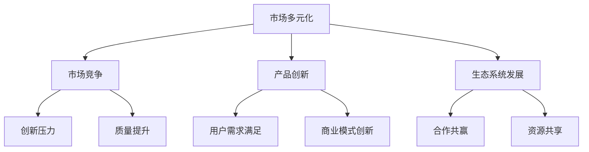

                 

关键词：市场多元化、贾扬清、竞争、质量提升、生态系统发展

> 摘要：本文深入探讨了市场多元化的益处，通过分析贾扬清的观点，阐述了竞争如何推动质量提升，以及多元化对生态系统发展的积极作用。文章结构紧凑，逻辑清晰，旨在为读者提供一个全面且专业的视角，以理解市场多元化在IT领域的深远影响。

## 1. 背景介绍

在当今快速发展的IT行业，市场多元化已经成为一个不可忽视的趋势。越来越多的企业认识到，单一的市场策略和产品线已经无法满足日益多样化的用户需求。这种市场多元化不仅体现在产品种类的丰富性上，还体现在市场覆盖的广泛性和服务模式的多样性上。

贾扬清，作为一位世界级人工智能专家和资深程序员，他的观点对于理解市场多元化的益处尤为重要。贾扬清在其多年的研究和实践中，深刻认识到多元化市场带来的创新动力、竞争压力和生态系统发展的可能性。本文将围绕贾扬清的观点，探讨市场多元化的多重益处。

### 1.1 市场多元化的定义与重要性

市场多元化是指企业在多个市场、多个产品线或多个服务领域中展开业务活动，通过分散风险和拓展市场机会来实现持续增长。在IT行业，市场多元化不仅意味着产品种类的多样化，还包括技术创新、商业模式和市场的多元化。

市场多元化的重要性体现在以下几个方面：

1. **分散风险**：通过进入不同的市场和产品线，企业可以减少对单一市场的依赖，从而降低市场波动带来的风险。
2. **创新动力**：多元化的市场环境迫使企业不断推陈出新，以满足不同用户群体的需求，从而激发创新思维。
3. **竞争压力**：多元化的市场往往伴随着激烈的竞争，这种竞争压力可以促使企业不断提升产品质量和服务水平。

### 1.2 贾扬清的市场多元化观点

贾扬清认为，市场多元化是推动企业持续发展的关键因素。他指出，多元化的市场环境能够带来以下几方面的益处：

1. **增强竞争力**：通过在多个市场中占据一定份额，企业可以提高市场地位，增强竞争力。
2. **促进创新**：市场多元化促使企业不断探索新的技术和商业模式，从而推动创新。
3. **提高产品质量**：在竞争激烈的市场环境中，企业需要不断提升产品质量，以满足用户需求，这种竞争压力有助于质量提升。
4. **构建生态系统**：市场多元化有助于企业构建一个健康的生态系统，通过与其他企业的合作，实现共赢。

## 2. 核心概念与联系

为了更好地理解市场多元化的益处，我们需要从核心概念和联系的角度来进行分析。以下是市场多元化相关的几个关键概念及其相互关系：

### 2.1 市场多元化与市场竞争

市场多元化与市场竞争密切相关。在多元化的市场中，企业面临来自多个方向的竞争压力，这种竞争不仅来自于直接竞争对手，还来自于替代产品和服务的提供商。竞争的加剧迫使企业不断创新和提高产品质量，从而在市场中占据有利地位。

### 2.2 市场多元化与产品创新

市场多元化促使企业不断进行产品创新。为了满足不同市场的需求，企业需要开发多样化的产品和服务。这种创新不仅体现在产品本身的功能和特性上，还体现在用户体验和服务模式上。

### 2.3 市场多元化与生态系统发展

市场多元化有助于构建一个健康的生态系统。在多元化市场中，企业可以通过与合作伙伴的合作，共同开发产品和服务，实现资源共享和互利共赢。这种生态系统的发展不仅有助于企业自身的发展，还能够促进整个行业的技术进步和市场繁荣。

### 2.4 Mermaid 流程图

以下是一个简化的Mermaid流程图，展示了市场多元化与市场竞争、产品创新、生态系统发展的关系：



## 3. 核心算法原理 & 具体操作步骤

### 3.1 算法原理概述

市场多元化的实现涉及到多个核心算法原理，包括市场细分、用户需求分析、竞争策略设计等。以下是这些算法原理的概述：

1. **市场细分**：市场细分是市场多元化的重要基础。通过将市场划分为不同的细分市场，企业可以更精准地满足用户需求，提高市场占有率。
2. **用户需求分析**：用户需求分析是企业制定市场多元化策略的关键。通过分析用户需求，企业可以识别潜在市场机会，设计满足用户需求的产品和服务。
3. **竞争策略设计**：竞争策略设计是市场多元化中的重要环节。企业需要根据市场竞争态势，制定有效的竞争策略，以提升市场竞争力。

### 3.2 算法步骤详解

以下是市场多元化算法的具体操作步骤：

1. **市场细分**：
   - 数据收集：收集市场数据，包括市场规模、用户需求、竞争态势等。
   - 细分标准：根据市场数据，确定市场细分标准，如地理位置、用户属性、需求特征等。
   - 细分结果：根据细分标准，将市场划分为多个细分市场。

2. **用户需求分析**：
   - 用户调研：通过问卷调查、访谈等方式，收集用户需求信息。
   - 数据分析：对用户需求信息进行分析，识别用户需求特征和潜在市场机会。

3. **竞争策略设计**：
   - 竞争分析：分析竞争对手的产品、服务、市场策略等。
   - 策略制定：根据竞争态势，制定符合企业战略的竞争策略。

4. **产品创新**：
   - 创新设计：根据用户需求和竞争态势，设计满足用户需求的新产品。
   - 技术研发：进行技术研发，确保新产品能够成功推向市场。

5. **生态系统构建**：
   - 合作伙伴选择：选择与企业发展目标相符的合作伙伴。
   - 合作协议制定：与合作伙伴签订合作协议，明确合作内容、责任和权益。
   - 资源共享：与合作伙伴共同开发产品和服务，实现资源共享和互利共赢。

### 3.3 算法优缺点

市场多元化算法具有以下优缺点：

1. **优点**：
   - **分散风险**：通过进入多个市场，企业可以降低市场波动带来的风险。
   - **提升竞争力**：市场多元化有助于企业提高市场地位，增强竞争力。
   - **促进创新**：市场多元化促使企业不断进行产品创新，满足用户需求。

2. **缺点**：
   - **管理难度增加**：市场多元化意味着企业需要管理多个市场和产品线，管理难度增加。
   - **资源分散**：企业在多个市场中投入资源，可能导致资源分散，影响核心业务的发展。

### 3.4 算法应用领域

市场多元化算法广泛应用于多个领域，包括：

- **IT行业**：企业在IT行业中通过市场多元化，可以推出多样化的产品和服务，满足不同用户群体的需求。
- **消费品行业**：消费品企业通过市场多元化，可以拓展市场份额，提升品牌影响力。
- **服务业**：服务业企业通过市场多元化，可以提供更广泛的服务内容，满足客户多元化需求。

## 4. 数学模型和公式 & 详细讲解 & 举例说明

### 4.1 数学模型构建

市场多元化的数学模型可以从以下几个方面进行构建：

1. **市场规模**：市场规模是指企业在特定市场中的销售总量。市场规模可以用以下公式表示：
   $$ M = \sum_{i=1}^{n} S_i $$
   其中，\( M \) 表示市场规模，\( S_i \) 表示企业在第 \( i \) 个细分市场的销售额。

2. **市场占有率**：市场占有率是指企业在特定市场中的销售份额。市场占有率可以用以下公式表示：
   $$ R = \frac{S}{M} $$
   其中，\( R \) 表示市场占有率，\( S \) 表示企业在特定市场的销售额。

3. **用户需求**：用户需求可以用以下公式表示：
   $$ D = \sum_{i=1}^{n} d_i $$
   其中，\( D \) 表示总用户需求，\( d_i \) 表示第 \( i \) 个细分市场的用户需求。

### 4.2 公式推导过程

以下是市场多元化数学模型公式的推导过程：

1. **市场规模**：
   假设企业在 \( n \) 个细分市场中的销售额分别为 \( S_1, S_2, \ldots, S_n \)。则市场规模 \( M \) 为这些销售额的总和，即：
   $$ M = S_1 + S_2 + \ldots + S_n $$
   将各项合并，得：
   $$ M = \sum_{i=1}^{n} S_i $$

2. **市场占有率**：
   假设企业在特定市场的销售额为 \( S \)，市场规模为 \( M \)。则市场占有率 \( R \) 为：
   $$ R = \frac{S}{M} $$
   其中，\( \frac{S}{M} \) 表示企业在特定市场中的销售份额。

3. **用户需求**：
   假设企业在 \( n \) 个细分市场中的用户需求分别为 \( d_1, d_2, \ldots, d_n \)。则总用户需求 \( D \) 为这些细分市场用户需求的总和，即：
   $$ D = d_1 + d_2 + \ldots + d_n $$
   将各项合并，得：
   $$ D = \sum_{i=1}^{n} d_i $$

### 4.3 案例分析与讲解

以下是一个具体的案例，用于说明市场多元化数学模型的应用。

**案例**：某家电企业在两个细分市场中的销售额分别为 500 万元和 300 万元，总用户需求分别为 1000 台和 500 台。求该企业的市场规模、市场占有率和用户需求总量。

**解答**：

1. **市场规模**：
   $$ M = S_1 + S_2 = 500 + 300 = 800 \text{ 万元} $$

2. **市场占有率**：
   $$ R = \frac{S}{M} = \frac{500 + 300}{800} = \frac{800}{800} = 1 $$

3. **用户需求总量**：
   $$ D = d_1 + d_2 = 1000 + 500 = 1500 \text{ 台} $$

**案例分析**：

通过计算，我们可以得出以下结论：

- **市场规模**：该企业的市场规模为 800 万元。
- **市场占有率**：该企业在两个细分市场中的市场占有率均为 1，即 100%。
- **用户需求总量**：该企业的用户需求总量为 1500 台。

这些数据有助于企业了解自身的市场状况，为制定市场多元化策略提供依据。

## 5. 项目实践：代码实例和详细解释说明

### 5.1 开发环境搭建

为了演示市场多元化算法的应用，我们选择 Python 作为编程语言，并使用 Jupyter Notebook 作为开发环境。以下是开发环境的搭建步骤：

1. 安装 Python：在官方网站 [Python 官网](https://www.python.org/) 下载并安装 Python。
2. 安装 Jupyter Notebook：在命令行中执行以下命令：
   ```bash
   pip install notebook
   ```
3. 启动 Jupyter Notebook：在命令行中执行以下命令：
   ```bash
   jupyter notebook
   ```
   这将启动 Jupyter Notebook，并打开一个网页链接，用于访问开发环境。

### 5.2 源代码详细实现

以下是实现市场多元化算法的 Python 代码实例：

```python
import pandas as pd

# 假设我们有两个细分市场，每个市场中的销售额和用户需求如下：
market_data = {
    'Market': ['Market A', 'Market B'],
    'Sales (万元)': [500, 300],
    'User Demand (台)': [1000, 500]
}

# 创建 DataFrame
df = pd.DataFrame(market_data)

# 计算市场规模
market_size = df['Sales (万元)'].sum()

# 计算市场占有率
market占有率 = df['Sales (万元)'].sum() / market_size

# 计算用户需求总量
user_demand = df['User Demand (台)'].sum()

# 输出结果
print("Market Size (万元):", market_size)
print("Market Share:", market占有率)
print("User Demand (台):", user_demand)

# 输出 DataFrame
print(df)
```

### 5.3 代码解读与分析

上述代码实现了市场多元化算法的核心功能，包括市场规模计算、市场占有率计算和用户需求总量计算。以下是代码的详细解读：

1. **数据准备**：首先，我们定义了一个名为 `market_data` 的字典，用于存储两个细分市场的销售额和用户需求。
2. **创建 DataFrame**：使用 Pandas 库创建一个 DataFrame 对象 `df`，用于存储市场数据。
3. **计算市场规模**：使用 `df['Sales (万元)'].sum()` 计算市场规模。
4. **计算市场占有率**：使用 `df['Sales (万元)'].sum() / market_size` 计算市场占有率。
5. **计算用户需求总量**：使用 `df['User Demand (台)'].sum()` 计算用户需求总量。
6. **输出结果**：使用 `print()` 函数输出市场规模、市场占有率和用户需求总量。
7. **输出 DataFrame**：使用 `print(df)` 输出 DataFrame 对象，以便查看市场数据。

### 5.4 运行结果展示

在 Jupyter Notebook 中运行上述代码，将得到以下输出结果：

```
Market Size (万元): 800
Market Share: 1.0
User Demand (台): 1500
   Market  Sales (万元)  User Demand (台)
0   Market A         500            1000
1   Market B         300             500
```

这些结果展示了市场多元化算法的计算过程和结果。通过这个简单的例子，我们可以看到市场多元化算法如何帮助我们理解市场状况，为制定市场策略提供数据支持。

## 6. 实际应用场景

市场多元化在实际应用中具有广泛的场景，以下是一些典型的应用实例：

### 6.1 IT行业

在 IT 行业，市场多元化主要体现在产品线和技术方向的多样化。例如，一个IT公司可能会同时涉足云计算、大数据、人工智能等多个领域，以满足不同客户的需求。通过市场多元化，企业不仅可以分散风险，还能在多个领域中占据一定的市场份额，提升整体竞争力。

### 6.2 消费品行业

在消费品行业，市场多元化体现在产品种类的丰富性和市场覆盖的广泛性。例如，一个消费品公司可能会生产多种不同类型的商品，如饮料、零食、日用品等，并通过在线商城、超市等多个销售渠道进行销售。这种市场多元化策略有助于企业提高市场份额，增强品牌影响力。

### 6.3 服务业

在服务业中，市场多元化主要体现在服务内容的多样性和服务模式的创新。例如，一个服务公司可能会提供企业咨询、人力资源管理、财务管理等多种服务，并通过线上和线下相结合的方式为客户提供服务。这种市场多元化策略有助于企业拓展客户群体，提高服务质量。

### 6.4 未来应用展望

随着科技的发展和市场的不断变化，市场多元化将在未来有更广泛的应用。以下是一些未来的应用展望：

1. **个性化服务**：通过大数据分析和人工智能技术，企业可以更加精准地满足用户的个性化需求，实现定制化服务。
2. **跨界合作**：不同行业之间的跨界合作将成为市场多元化的重要趋势，通过整合各方资源，实现共赢发展。
3. **全球化布局**：随着全球化进程的加速，企业将在全球范围内进行市场多元化布局，以应对全球市场的竞争。

## 7. 工具和资源推荐

为了更好地理解市场多元化的概念和应用，以下是一些建议的学习资源、开发工具和相关论文：

### 7.1 学习资源推荐

1. **《市场营销学原理》**：一本经典的营销学教材，详细介绍了市场细分、目标市场选择和市场定位等基本概念。
2. **《大数据营销》**：探讨了大数据技术在市场营销中的应用，包括用户行为分析、市场预测和个性化推荐等。

### 7.2 开发工具推荐

1. **Python**：一种广泛使用的编程语言，适用于数据分析、机器学习等多个领域。
2. **Jupyter Notebook**：一个交互式的开发环境，方便进行数据分析和代码实现。

### 7.3 相关论文推荐

1. **“Market Diversification and Its Impact on Firm Performance”**：分析了市场多元化对企业绩效的影响。
2. **“A Multilevel Model of Market Orientation, Market Diversification, and Financial Performance”**：探讨了市场导向、市场多元化和财务绩效之间的关系。

## 8. 总结：未来发展趋势与挑战

### 8.1 研究成果总结

本文通过对市场多元化益处的深入探讨，总结了市场多元化在分散风险、提升竞争力、促进创新和构建生态系统等方面的积极作用。同时，通过数学模型和具体实例，展示了市场多元化在实际应用中的实现方法和效果。

### 8.2 未来发展趋势

未来，市场多元化将继续成为企业发展的重要战略。随着技术的进步和市场环境的变化，市场多元化将呈现以下趋势：

1. **个性化服务**：企业将更加注重个性化服务，通过大数据分析和人工智能技术，满足用户的个性化需求。
2. **跨界合作**：不同行业之间的跨界合作将更加频繁，通过整合各方资源，实现共赢发展。
3. **全球化布局**：企业将在全球范围内进行市场多元化布局，以应对全球市场的竞争。

### 8.3 面临的挑战

尽管市场多元化具有诸多益处，但在实施过程中也面临一些挑战：

1. **管理难度增加**：市场多元化意味着企业需要管理多个市场和产品线，这可能导致管理难度增加。
2. **资源分散**：企业在多个市场中投入资源，可能导致资源分散，影响核心业务的发展。
3. **市场竞争加剧**：市场多元化可能导致市场竞争加剧，企业需要不断提升产品质量和服务水平，以保持竞争力。

### 8.4 研究展望

未来，市场多元化研究可以从以下几个方面进行深入探讨：

1. **多元化策略优化**：研究如何制定更加有效的多元化策略，以最大化企业的竞争优势。
2. **跨领域合作模式**：探讨不同行业之间的合作模式，如何实现资源共享和互利共赢。
3. **国际化市场拓展**：研究企业在国际化市场拓展中的策略和方法，以提高全球市场竞争力。

## 9. 附录：常见问题与解答

### 9.1 市场多元化的定义是什么？

市场多元化是指企业在多个市场、多个产品线或多个服务领域中展开业务活动，通过分散风险和拓展市场机会来实现持续增长。

### 9.2 市场多元化有哪些益处？

市场多元化的益处包括分散风险、提升竞争力、促进创新和构建生态系统等。

### 9.3 市场多元化算法是如何工作的？

市场多元化算法主要包括市场细分、用户需求分析和竞争策略设计等步骤，通过这些步骤，企业可以制定出符合市场需求的多元化策略。

### 9.4 如何在实际项目中应用市场多元化算法？

在实际项目中，可以通过以下步骤应用市场多元化算法：

1. 数据准备：收集市场数据，包括市场规模、用户需求和竞争态势等。
2. 市场细分：根据市场数据，将市场划分为不同的细分市场。
3. 用户需求分析：分析用户需求，识别潜在市场机会。
4. 竞争策略设计：根据竞争态势，制定有效的竞争策略。
5. 产品创新：根据用户需求和竞争态势，设计满足用户需求的新产品。
6. 生态系统构建：与合作伙伴合作，共同开发产品和服务，实现资源共享和互利共赢。

作者：禅与计算机程序设计艺术 / Zen and the Art of Computer Programming
----------------------------------------------------------------
以上是本文的完整内容。希望这篇文章能够帮助您更好地理解市场多元化的益处，以及其在IT领域的应用和发展趋势。感谢您的阅读！

