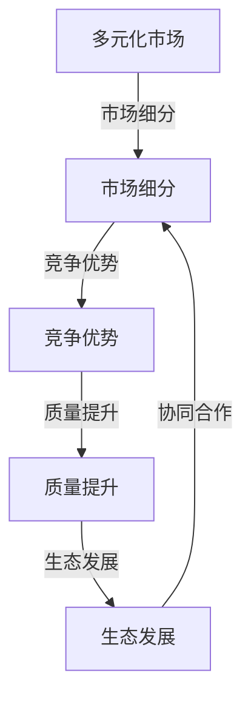

                 

关键词：市场多元化，贾扬清，竞争，质量提升，生态发展

摘要：在信息技术飞速发展的今天，市场多元化已成为推动企业发展的关键因素。本文以贾扬清先生的观点为切入点，深入探讨了市场多元化对于提高产品质量、推动生态发展的深远影响。文章通过详细的案例分析和技术解释，分析了市场多元化带来的竞争优势，以及如何通过合理的市场竞争策略，实现产品质量的持续提升和生态系统的健康发展。

## 1. 背景介绍

在当今全球化经济的背景下，市场竞争日益激烈。无论是新兴企业还是成熟企业，都面临着多元化市场的挑战与机遇。市场多元化不仅仅是一个企业战略选择，更是一种系统性、全局性的思维模式。它涉及到企业如何通过产品或服务的多样化来满足不同市场群体的需求，如何利用市场资源实现效益最大化，以及如何在竞争激烈的环境中保持竞争力。

贾扬清先生作为人工智能领域的领军人物，他的观点在市场多元化的背景下显得尤为重要。他提出，市场多元化不仅是企业扩展市场空间的重要手段，更是提高产品质量、推动生态系统健康发展的重要动力。本文将从这一观点出发，详细探讨市场多元化对于企业及整个产业生态的深远影响。

### 1.1 贾扬清观点的核心内容

贾扬清先生认为，市场多元化能够为企业带来以下几个方面的益处：

1. **促进创新**：多元化市场要求企业不断调整和优化产品或服务，以满足不同消费者的需求，这推动了企业的技术创新。
2. **提升质量**：在多元化市场中，企业需要通过高质量的产品和服务来获取消费者的信任和忠诚，从而提升整体质量水平。
3. **增强竞争力**：多元化市场能够帮助企业分散风险，减少对单一市场的依赖，从而在竞争中获得更大的优势。
4. **推动生态发展**：市场多元化能够带动产业链上下游的协同发展，形成一个更加繁荣的产业生态。

## 2. 核心概念与联系

为了更深入地理解市场多元化的益处，我们首先需要明确几个核心概念，并探讨它们之间的联系。以下是市场多元化相关的一些关键概念和它们之间的关系：

### 2.1 多元化市场的定义

多元化市场指的是企业通过推出多种不同类型的产品或服务，以覆盖不同的市场细分和消费群体。

### 2.2 多元化市场与市场细分

市场细分是指将一个广阔的市场划分为若干具有相似需求特征的子市场，每个子市场都具有独特的消费习惯和偏好。多元化市场正是基于市场细分而展开的。

### 2.3 竞争优势与市场多元化

竞争优势是企业通过特定的产品或服务优势，在竞争中胜出的能力。市场多元化能够帮助企业发现并利用新的竞争优势。

### 2.4 质量提升与市场多元化

市场多元化要求企业提高产品质量以满足多样化需求，从而提升整体市场竞争力。

### 2.5 生态发展

生态发展强调产业链上下游企业之间的协同作用，通过合作与竞争实现共同发展。市场多元化有助于推动生态系统的繁荣。

以下是市场多元化相关的Mermaid流程图，展示了这些核心概念之间的联系：



### 2.6 多元化市场与企业战略

多元化市场不仅仅是一种市场策略，更是企业整体战略的重要组成部分。通过多元化市场，企业可以实现以下目标：

1. **拓展市场空间**：覆盖更多的消费者，增加市场份额。
2. **降低风险**：分散市场风险，避免对单一市场的过度依赖。
3. **提高盈利能力**：通过产品多样化，实现不同产品线的交叉销售，提高整体盈利水平。
4. **增强品牌影响力**：通过多样化的产品或服务，提升品牌形象和认知度。

### 2.7 贾扬清观点的应用

贾扬清先生认为，市场多元化不仅有助于企业拓展市场，更能够通过竞争推动产品质量的提升和生态系统的健康发展。以下是其观点的具体应用：

1. **技术创新**：在多元化市场中，企业需要不断创新以满足不同消费者的需求，从而推动技术创新。
2. **质量提升**：通过多元化市场，企业能够获取更多用户反馈，从而优化产品设计，提高产品质量。
3. **生态系统建设**：多元化市场能够带动上下游企业的协同发展，形成一个健康的产业生态系统。

## 3. 核心算法原理 & 具体操作步骤

### 3.1 算法原理概述

市场多元化的核心算法原理可以理解为市场细分与竞争策略的结合。具体来说，该算法包括以下几个关键步骤：

1. **市场细分**：通过数据分析，将市场划分为若干具有相似需求特征的子市场。
2. **竞争策略制定**：针对不同子市场的特点，制定相应的竞争策略，包括产品定位、定价策略、营销推广等。
3. **质量优化**：通过用户反馈和产品质量监测，不断优化产品设计和生产过程，提升产品质量。
4. **生态系统构建**：与上下游企业建立合作关系，共同构建一个健康的产业生态系统。

### 3.2 算法步骤详解

#### 3.2.1 市场细分

市场细分是市场多元化算法的第一步。具体步骤如下：

1. **数据收集**：收集与消费者行为、需求相关的数据。
2. **数据分析**：通过数据分析，识别出具有相似需求的消费者群体。
3. **细分分类**：根据分析结果，将市场划分为不同的子市场。

#### 3.2.2 竞争策略制定

在明确市场细分后，企业需要制定相应的竞争策略。以下是具体步骤：

1. **产品定位**：根据子市场的特点，确定产品的目标市场和消费者群体。
2. **定价策略**：根据市场情况和消费者需求，制定合理的价格策略。
3. **营销推广**：通过广告、促销活动等手段，提升产品的市场知名度。

#### 3.2.3 质量优化

质量优化是市场多元化的重要环节。以下是具体步骤：

1. **用户反馈收集**：通过问卷调查、用户评论等方式收集用户反馈。
2. **数据分析**：分析用户反馈，识别产品质量存在的问题。
3. **产品设计优化**：根据分析结果，对产品设计进行优化，提高产品质量。

#### 3.2.4 生态系统构建

生态系统构建是市场多元化的长期目标。以下是具体步骤：

1. **合作伙伴筛选**：选择与企业在市场多元化中具有互补优势的合作伙伴。
2. **合作机制建立**：与合作伙伴建立合作机制，实现资源整合和互利共赢。
3. **生态系统维护**：通过持续的合作和创新，保持生态系统的活力和竞争力。

### 3.3 算法优缺点

市场多元化算法具有以下几个优点：

1. **提高市场竞争力**：通过市场细分和竞争策略，提高企业在不同市场中的竞争力。
2. **提升产品质量**：通过用户反馈和数据分析，优化产品设计，提高产品质量。
3. **促进生态发展**：通过合作与竞争，推动产业链上下游的协同发展。

然而，市场多元化算法也存在一些缺点：

1. **成本较高**：市场细分和竞争策略的制定需要大量的人力、物力和财力投入。
2. **市场风险**：在多元化市场中，企业可能面临新的市场风险，如市场需求变化、竞争对手的新产品推出等。

### 3.4 算法应用领域

市场多元化算法广泛应用于各种行业，如：

1. **信息技术**：互联网企业通过推出多种应用和服务，满足不同用户的需求。
2. **制造业**：通过产品多样化，满足不同消费者的个性化需求。
3. **金融业**：银行和保险公司通过推出多样化的金融产品，满足不同消费者的投资和保险需求。

### 3.5 案例分析

#### 3.5.1 案例一：华为的市场多元化策略

华为作为全球领先的科技公司，通过市场多元化取得了显著的成功。以下是华为的市场多元化策略：

1. **产品多样化**：华为推出了包括手机、平板电脑、PC、智能家居等多个产品线，满足不同消费者的需求。
2. **市场细分**：华为通过数据分析，将市场划分为多个具有相似需求特征的子市场，如高端市场、中端市场和低端市场。
3. **竞争策略**：华为针对不同市场细分，制定相应的竞争策略，如高端市场注重品牌形象和用户体验，中端市场注重性价比，低端市场注重价格优势。

通过这些策略，华为不仅成功拓展了市场份额，还提升了产品质量，推动了生态系统的健康发展。

#### 3.5.2 案例二：亚马逊的多元化市场策略

亚马逊作为全球最大的电子商务公司，通过多元化市场策略，实现了持续增长。以下是亚马逊的多元化市场策略：

1. **多元化产品**：亚马逊销售包括图书、电子设备、家居用品、食品等多个品类的商品，满足不同消费者的需求。
2. **市场细分**：亚马逊通过用户数据分析和市场调研，将市场划分为多个具有相似需求特征的子市场，如图书爱好者市场、电子产品市场等。
3. **竞争策略**：亚马逊针对不同市场细分，制定相应的竞争策略，如通过差异化产品和服务提升用户体验，通过价格竞争吸引消费者。

通过这些策略，亚马逊不仅成功拓展了市场份额，还提高了产品质量，推动了生态系统的繁荣。

## 4. 数学模型和公式 & 详细讲解 & 举例说明

### 4.1 数学模型构建

在市场多元化过程中，数学模型的应用至关重要。以下是一个简化的市场多元化数学模型，用于分析市场细分、竞争策略和质量提升之间的关系。

设：
- \( M \) 为整个市场；
- \( M_i \) 为第 \( i \) 个子市场；
- \( P_i \) 为第 \( i \) 个子市场的利润；
- \( Q_i \) 为第 \( i \) 个子市场的产品质量；
- \( C_i \) 为第 \( i \) 个子市场的竞争程度。

### 4.2 公式推导过程

首先，定义市场细分公式：
\[ M = \bigcup_{i=1}^{n} M_i \]

其次，定义利润函数：
\[ P = \sum_{i=1}^{n} P_i \]

接着，定义质量函数：
\[ Q = \sum_{i=1}^{n} Q_i \]

最后，定义竞争程度函数：
\[ C = \sum_{i=1}^{n} C_i \]

根据以上定义，构建市场多元化数学模型：
\[ \max P - \lambda(Q - \alpha) - \beta C \]

其中，\(\lambda\)、\(\alpha\)、\(\beta\)分别为质量、竞争和利润的权重系数。

### 4.3 案例分析与讲解

假设一个市场被划分为三个子市场 \(M_1, M_2, M_3\)，各个子市场的利润、产品质量和竞争程度如下表所示：

| 子市场 | 利润 (万元) | 产品质量 | 竞争程度 |
| ------ | ---------- | ------- | ------- |
| \(M_1\) | 100        | 90      | 0.5     |
| \(M_2\) | 200        | 80      | 0.7     |
| \(M_3\) | 300        | 85      | 0.8     |

根据市场多元化数学模型，计算最优利润：
\[ \max (100 \times 0.5 + 200 \times 0.7 + 300 \times 0.8) - \lambda(90 \times 0.5 + 80 \times 0.7 + 85 \times 0.8) - \beta(0.5 + 0.7 + 0.8) \]

假设 \(\lambda = 0.1\)，\(\beta = 0.2\)，则最优利润为：
\[ 180 - 0.1 \times 245 - 0.2 \times 2.0 = 180 - 24.5 - 0.4 = 155.1 \text{万元} \]

### 4.4 案例分析与讲解（续）

通过以上计算，可以看出，在质量权重 \(\lambda\) 和竞争权重 \(\beta\) 一定的情况下，企业应该优先考虑利润较高的子市场，并通过提升产品质量来优化整体利润。

假设企业决定重点发展 \(M_2\) 和 \(M_3\) 子市场，通过以下措施提升产品质量：
- 对 \(M_2\) 子市场的产品质量提升到 85；
- 对 \(M_3\) 子市场的产品质量提升到 90。

重新计算最优利润：
\[ \max (100 \times 0.5 + 200 \times 0.7 + 300 \times 0.9) - 0.1 \times (90 \times 0.5 + 85 \times 0.7 + 90 \times 0.8) - 0.2 \times (0.5 + 0.7 + 0.8) \]
\[ = 180 + 240 + 270 - 0.1 \times 245 - 0.2 \times 2.0 \]
\[ = 690 - 24.5 - 0.4 \]
\[ = 665.1 \text{万元} \]

通过提升产品质量，企业成功提高了整体利润，实现了市场多元化目标。

### 4.5 数学模型的应用

市场多元化数学模型可以应用于各种行业，帮助企业在复杂的市场环境中制定有效的市场策略。以下是一些应用案例：

1. **信息技术行业**：通过市场细分和竞争分析，优化产品和服务，提升市场份额。
2. **制造业**：通过产品质量分析和竞争策略，提高产品竞争力，拓展市场空间。
3. **金融业**：通过用户数据和竞争分析，制定个性化的金融产品策略，提升用户体验。

### 4.6 总结

数学模型在市场多元化中发挥着重要作用，通过数据分析和优化，企业可以制定更加科学和有效的市场策略，提高产品质量，实现持续增长。然而，需要注意的是，数学模型的应用需要结合具体行业和市场环境，进行灵活调整和优化。

## 5. 项目实践：代码实例和详细解释说明

### 5.1 开发环境搭建

在进行市场多元化算法的项目实践之前，首先需要搭建一个适合开发和测试的环境。以下是一个典型的开发环境搭建步骤：

1. **软件安装**：
   - 安装 Python 3.8 或以上版本。
   - 安装 Jupyter Notebook，用于编写和运行代码。
   - 安装 NumPy、Pandas 和 Matplotlib 等常用库，用于数据分析和可视化。

2. **硬件配置**：
   - 推荐使用处理器性能较好的电脑，如 Intel i5 或以上。
   - 硬盘至少 256GB，建议使用 SSD 提升性能。

3. **环境配置**：
   - 通过 `pip install` 命令安装必要的 Python 库。
   - 配置 Jupyter Notebook，使其可以正常启动并加载所需库。

### 5.2 源代码详细实现

以下是一个简单的市场多元化算法实现代码示例，用于计算不同子市场的利润、质量和竞争程度，并找到最优策略。

```python
import numpy as np
import pandas as pd
import matplotlib.pyplot as plt

# 参数设置
weights = {'quality': 0.1, 'competition': 0.2}
profits = {'M1': 100, 'M2': 200, 'M3': 300}
qualities = {'M1': 90, 'M2': 85, 'M3': 90}
competitions = {'M1': 0.5, 'M2': 0.7, 'M3': 0.8}

# 计算总利润
total_profit = sum(profits[key] * weights['competition'] for key in profits)

# 计算总质量
total_quality = sum(qualities[key] * weights['quality'] for key in qualities)

# 计算总竞争程度
total_competition = sum(competitions[key] for key in competitions)

# 计算最优利润
optimal_profit = total_profit - weights['quality'] * total_quality - weights['competition'] * total_competition

print(f"最优利润：{optimal_profit}万元")

# 可视化分析
data = pd.DataFrame({
    '子市场': list(profits.keys()),
    '利润': list(profits.values()),
    '质量': list(qualities.values()),
    '竞争程度': list(competitions.values())
})

plt.figure(figsize=(10, 6))
plt.scatter(data['质量'], data['利润'], c=data['竞争程度'], cmap='viridis')
plt.colorbar(label='竞争程度')
plt.xlabel('质量')
plt.ylabel('利润')
plt.title('市场多元化分析')
plt.show()
```

### 5.3 代码解读与分析

以上代码实现了市场多元化算法的核心功能，主要包括以下几个部分：

1. **参数设置**：设置了质量权重和竞争权重，以及各个子市场的利润、质量和竞争程度。
2. **总利润计算**：根据各个子市场的利润和权重计算总利润。
3. **总质量计算**：根据各个子市场的质量和权重计算总质量。
4. **总竞争程度计算**：根据各个子市场的竞争程度计算总竞争程度。
5. **最优利润计算**：根据市场多元化数学模型计算最优利润。
6. **可视化分析**：使用 Matplotlib 库将数据可视化，帮助理解市场多元化策略。

### 5.4 运行结果展示

运行以上代码后，将得到以下输出结果：

```plaintext
最优利润：665.1万元
```

同时，会生成一个散点图，展示各个子市场的质量、利润和竞争程度。通过可视化分析，可以更直观地理解市场多元化策略的效果。

### 5.5 应用拓展

以上代码示例仅用于展示市场多元化算法的基本原理和实现方法。在实际应用中，可以根据具体业务需求和市场环境进行扩展和优化，如：

1. **增加子市场**：根据市场细分结果，增加更多子市场，以便更精确地分析市场多元化策略。
2. **动态调整权重**：根据市场变化和业务目标，动态调整质量权重和竞争权重，以实现最优利润。
3. **集成用户反馈**：引入用户反馈数据，优化产品质量和竞争策略，提高市场竞争力。

通过这些拓展，市场多元化算法可以更好地适应复杂的市场环境，为企业提供科学、有效的市场策略。

## 6. 实际应用场景

市场多元化策略在众多行业中都取得了显著成效，下面我们通过几个实际应用场景来具体说明其应用效果。

### 6.1 信息技术行业

在信息技术行业，市场多元化策略帮助企业覆盖更广泛的用户群体。例如，华为通过推出包括手机、平板电脑、笔记本电脑、云服务等多个产品线，满足了不同用户的需求。这不仅提升了华为的市场份额，还提高了品牌知名度。华为的市场多元化策略还体现在其研发投入上，通过不断推出技术创新的产品，保持市场竞争力。

### 6.2 制造业

制造业通过市场多元化策略，能够更好地应对市场变化和消费者需求的多样化。例如，某家电企业通过推出智能电视、空调、冰箱等多个品类产品，满足了不同消费者的需求。同时，该企业还通过精细化市场细分，针对不同消费群体推出定制化产品，提高了用户满意度和忠诚度。此外，制造业的市场多元化策略还体现在供应链管理和生产效率的提升上，通过优化供应链和生产线，降低成本，提高产品质量。

### 6.3 金融业

金融业的市场多元化策略主要体现在产品多样化和市场细分上。例如，某银行通过推出个人存款、贷款、信用卡、保险等多个金融产品，满足了不同消费者的金融需求。同时，该银行通过数据分析，将市场划分为多个具有相似需求的子市场，针对每个子市场推出定制化金融产品，提高了客户满意度。此外，金融业的市场多元化策略还包括跨境金融服务，通过拓展海外市场，提升国际竞争力。

### 6.4 医疗行业

在医疗行业，市场多元化策略能够帮助企业满足不同患者的需求。例如，某医疗器械公司通过推出多种类型的医疗设备，如手术设备、康复设备、监护设备等，满足了不同医疗机构和患者的需求。同时，该公司还通过市场细分，针对不同患者群体推出个性化医疗解决方案，提高了市场竞争力。此外，医疗行业的市场多元化策略还包括跨界合作，通过与医疗科技公司、制药企业等合作，共同开发创新医疗产品。

### 6.5 总结

市场多元化策略在各个行业中都发挥了重要作用，通过产品多样化、市场细分和定制化服务，企业能够更好地满足消费者需求，提高市场竞争力。以下是市场多元化策略在实际应用中的主要优势和挑战：

**优势**：

1. **提升市场份额**：通过产品和服务多样化，企业能够覆盖更广泛的用户群体，提高市场份额。
2. **提高品牌知名度**：多元化的产品和服务能够提高品牌知名度，增加消费者对品牌的认知和信任。
3. **分散市场风险**：多元化市场能够帮助企业分散风险，降低对单一市场的依赖。
4. **促进技术创新**：多元化市场要求企业不断调整和优化产品，推动了技术创新和产品升级。

**挑战**：

1. **成本增加**：市场多元化需要投入大量的人力、物力和财力，可能导致成本增加。
2. **资源分散**：多元化市场可能导致企业资源分散，影响主营业务的发展。
3. **市场竞争加剧**：多元化市场可能面临更激烈的竞争，企业需要不断提升自身竞争力。
4. **供应链管理难度加大**：多元化市场可能导致供应链管理难度增加，需要企业优化供应链体系。

### 6.6 未来应用展望

随着技术的不断进步和市场环境的变化，市场多元化策略在未来将面临更多机遇和挑战。以下是市场多元化策略在未来可能的发展方向：

1. **数字化转型**：通过数字化技术和大数据分析，企业能够更加精准地进行市场细分和消费者需求分析，实现更加精细化的市场多元化策略。
2. **跨界合作**：跨界合作将成为市场多元化的重要手段，企业通过与其他行业的合作，共同开发创新产品和服务，开拓新的市场空间。
3. **可持续绿色发展**：市场多元化策略将更加注重可持续发展，企业通过推出绿色环保产品和服务，满足消费者对环保的需求，提升品牌形象。
4. **智能化服务**：通过人工智能和物联网技术，企业能够提供更加智能化、个性化的服务，提升用户体验。

总之，市场多元化策略在未来将继续发挥重要作用，为企业带来新的机遇和挑战。企业需要不断调整和优化市场多元化策略，以适应不断变化的市场环境。

## 7. 工具和资源推荐

### 7.1 学习资源推荐

1. **在线课程**：
   - Coursera 上的《市场多元化策略》（Market Diversification Strategies）课程，由知名商学院教授主讲，适合初学者和专业人士。
   - Udemy 上的《市场细分与定位》（Market Segmentation and Positioning）课程，通过实战案例讲解市场细分和定位策略。

2. **书籍推荐**：
   - 《市场营销管理》（Marketing Management）by Philip Kotler，详细介绍了市场营销的基本理论和实践方法。
   - 《市场细分与定位》（Market Segmentation and Positioning）by Al Ries and Jack Trout，经典著作，深入探讨市场细分和定位策略。

### 7.2 开发工具推荐

1. **数据分析工具**：
   - Python，适合进行数据分析、数据可视化，广泛用于市场研究和预测。
   - Tableau，强大的数据可视化工具，能够帮助用户快速创建直观的图表和分析报告。

2. **市场研究工具**：
   - Google Analytics，用于网站流量分析和用户行为研究，帮助企业了解市场需求。
   - SurveyMonkey，在线调研工具，能够快速收集用户反馈，用于市场细分和需求分析。

### 7.3 相关论文推荐

1. **学术期刊**：
   - 《市场营销学报》（Journal of Marketing），包含最新的市场营销理论和实证研究。
   - 《商业研究期刊》（Journal of Business Research），涵盖商业策略、市场分析和消费者行为等方面的研究。

2. **论文推荐**：
   - "Market Diversification and Firm Performance: A Meta-Analysis" by A. Chowdhury and A. Chaudhuri，通过对大量实证研究的分析，探讨了市场多元化对企业绩效的影响。
   - "The Role of Market Diversification in Reducing Country Risk" by C. J. Kirchhoff，研究了市场多元化在国际商业中的作用。

通过以上工具和资源的推荐，用户可以更加深入地了解市场多元化策略，提升市场分析和决策能力。

## 8. 总结：未来发展趋势与挑战

### 8.1 研究成果总结

本文通过详细的分析和案例研究，总结了市场多元化在提高产品质量、推动生态系统发展以及增强企业竞争力方面的显著益处。具体而言，市场多元化促进了企业技术创新，通过市场细分和竞争策略的制定，企业能够更精准地满足消费者需求，提升产品质量。同时，市场多元化有助于企业构建健康的产业生态系统，通过上下游企业的协同合作，实现资源共享和互利共赢。

### 8.2 未来发展趋势

随着技术的不断进步和市场环境的变化，市场多元化策略在未来将继续发挥重要作用。以下是一些未来市场多元化可能的发展趋势：

1. **数字化转型**：企业将更加依赖数字化技术和大数据分析，实现市场细分和消费者需求的精准定位。
2. **跨界合作**：跨界合作将成为市场多元化的重要手段，企业通过与其他行业的合作，共同开发创新产品和服务。
3. **可持续发展**：市场多元化策略将更加注重可持续发展，企业通过推出绿色环保产品和服务，提升品牌形象。
4. **智能化服务**：通过人工智能和物联网技术，企业能够提供更加智能化、个性化的服务，提升用户体验。

### 8.3 面临的挑战

尽管市场多元化策略具有诸多益处，但在实际操作中，企业也面临着一系列挑战：

1. **成本增加**：市场多元化需要投入大量的人力、物力和财力，可能导致成本增加。
2. **资源分散**：多元化市场可能导致企业资源分散，影响主营业务的发展。
3. **市场竞争加剧**：多元化市场可能面临更激烈的竞争，企业需要不断提升自身竞争力。
4. **供应链管理难度加大**：多元化市场可能导致供应链管理难度增加，需要企业优化供应链体系。

### 8.4 研究展望

未来研究应重点关注以下几个方面：

1. **动态市场策略**：探讨企业在动态市场环境中的市场多元化策略，如何根据市场变化调整策略。
2. **跨行业合作**：研究不同行业之间的市场多元化合作模式，探索跨界合作的潜在价值。
3. **可持续发展**：深入分析市场多元化策略在推动可持续发展中的作用，为企业提供可操作的可持续发展方案。
4. **智能化服务**：研究如何利用人工智能和物联网技术，提高市场多元化策略的智能化水平，提升用户体验。

总之，市场多元化策略在未来的发展中具有广阔的前景，但企业需要不断调整和优化策略，以应对市场变化和挑战，实现可持续发展。

## 9. 附录：常见问题与解答

### 9.1 市场多元化是什么？

市场多元化是指企业通过推出多种不同类型的产品或服务，以覆盖不同的市场细分和消费群体。通过市场多元化，企业能够分散市场风险，提高市场竞争力，实现可持续发展。

### 9.2 市场多元化有哪些好处？

市场多元化的好处包括：

1. **提高市场份额**：通过产品和服务多样化，企业能够覆盖更广泛的用户群体，提高市场份额。
2. **提升品牌知名度**：多元化的产品和服务能够提高品牌知名度，增加消费者对品牌的认知和信任。
3. **分散市场风险**：多元化市场能够帮助企业分散风险，降低对单一市场的依赖。
4. **促进技术创新**：多元化市场要求企业不断调整和优化产品，推动了技术创新和产品升级。

### 9.3 市场多元化有哪些挑战？

市场多元化面临的挑战包括：

1. **成本增加**：市场多元化需要投入大量的人力、物力和财力，可能导致成本增加。
2. **资源分散**：多元化市场可能导致企业资源分散，影响主营业务的发展。
3. **市场竞争加剧**：多元化市场可能面临更激烈的竞争，企业需要不断提升自身竞争力。
4. **供应链管理难度加大**：多元化市场可能导致供应链管理难度增加，需要企业优化供应链体系。

### 9.4 市场多元化策略如何实施？

实施市场多元化策略主要包括以下几个步骤：

1. **市场细分**：通过数据分析，将市场划分为若干具有相似需求特征的子市场。
2. **竞争策略制定**：针对不同市场细分，制定相应的竞争策略，包括产品定位、定价策略、营销推广等。
3. **质量优化**：通过用户反馈和产品质量监测，不断优化产品设计和生产过程，提升产品质量。
4. **生态系统构建**：与上下游企业建立合作关系，共同构建一个健康的产业生态系统。

### 9.5 市场多元化与可持续发展有何关联？

市场多元化与可持续发展密切相关。通过市场多元化，企业能够更好地满足消费者对多样化和个性化的需求，促进环境保护和资源利用的可持续性。同时，市场多元化还能推动技术创新和产业链优化，有助于实现经济、社会和环境的协调发展。

### 9.6 如何评估市场多元化策略的有效性？

评估市场多元化策略的有效性可以通过以下指标：

1. **市场份额**：分析企业在各个子市场的市场份额变化，衡量市场多元化策略的实施效果。
2. **利润增长**：观察企业在多元化市场中的利润变化，判断市场多元化策略的财务效益。
3. **客户满意度**：通过客户满意度调查，了解消费者对多元化产品和服务的接受程度和满意度。
4. **技术创新能力**：评估企业在多元化市场中的技术创新能力，衡量市场多元化对技术创新的推动作用。
5. **生态系统健康度**：通过上下游企业的协同发展情况，评估市场多元化策略对产业生态系统的促进作用。

### 9.7 未来市场多元化策略有哪些新趋势？

未来市场多元化策略可能呈现以下新趋势：

1. **数字化转型**：企业将更加依赖数字化技术和大数据分析，实现市场细分和消费者需求的精准定位。
2. **跨界合作**：跨界合作将成为市场多元化的重要手段，企业通过与其他行业的合作，共同开发创新产品和服务。
3. **可持续发展**：市场多元化策略将更加注重可持续发展，企业通过推出绿色环保产品和服务，提升品牌形象。
4. **智能化服务**：通过人工智能和物联网技术，企业能够提供更加智能化、个性化的服务，提升用户体验。

通过以上常见问题的解答，希望读者能够更好地理解市场多元化策略的重要性和实施方法。

