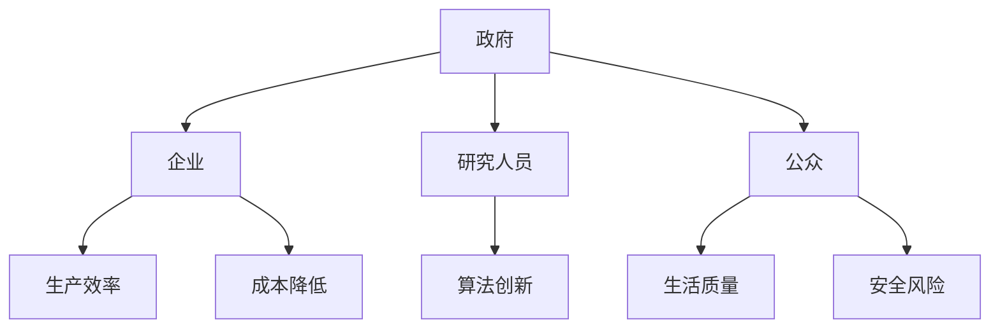

                 

 在人工智能（AI）的快速发展过程中，如何平衡不同利益相关者的需求和权力分配成为一个至关重要的问题。本文将探讨在AI发展中涉及的主要利益相关者，包括政府、企业、研究人员和普通公众，并分析如何在他们的权力分配中实现平衡，以促进AI技术的可持续发展。

## 关键词

- 人工智能发展
- 利益相关者
- 权力分配
- 平衡
- 可持续发展

## 摘要

本文首先回顾了人工智能的发展历程，然后介绍了主要利益相关者的角色和需求。接着，本文提出了一种新的权力分配模式，通过多层次的协作机制，实现各利益相关者之间的平衡。最后，本文对未来AI发展中的挑战和机遇进行了展望。

## 1. 背景介绍

### 人工智能的发展历程

人工智能作为计算机科学的一个重要分支，自1956年诞生以来，已经经历了多个发展阶段。从早期的符号主义、专家系统，到基于知识的推理、机器学习，再到当前的深度学习和强化学习，AI技术在各个方面都取得了显著的进展。

### 利益相关者的角色和需求

在AI发展的过程中，不同利益相关者扮演着不同的角色，有着不同的需求：

- **政府**：政府是AI发展的推动者和监管者。他们希望通过AI技术提升国家的竞争力、促进经济发展，同时也关注AI技术的安全性和伦理问题。
- **企业**：企业是AI技术的主要应用者和投资者。他们希望通过AI技术提高生产效率、降低成本，并寻找新的商业机会。
- **研究人员**：研究人员是AI技术的主要推动者。他们致力于探索新的算法和技术，推动AI领域的创新和发展。
- **公众**：公众是AI技术的最终受益者和受害者。他们希望通过AI技术提高生活质量，同时也担心AI技术的潜在风险。

## 2. 核心概念与联系

### 核心概念

- **利益相关者**：在AI发展中扮演不同角色的个人或组织。
- **权力分配**：在AI发展中，不同利益相关者之间的权力分配和协作机制。

### Mermaid 流程图



## 3. 核心算法原理 & 具体操作步骤

### 3.1 算法原理概述

本文提出的核心算法是一种基于博弈论的权力分配模型。通过模拟不同利益相关者的行为和策略，模型能够找到一种最优的权力分配方案，实现各方的利益平衡。

### 3.2 算法步骤详解

1. **数据收集**：收集各利益相关者的初始数据，包括他们的需求、能力和风险偏好。
2. **模型构建**：基于博弈论，构建一个多层次的权力分配模型。
3. **策略迭代**：通过迭代算法，逐步优化各利益相关者的策略。
4. **结果分析**：分析模型的最终结果，验证各方的利益是否得到平衡。

### 3.3 算法优缺点

- **优点**：
  - 能够实现不同利益相关者之间的利益平衡。
  - 有利于推动AI技术的可持续发展。
- **缺点**：
  - 需要大量的数据支持。
  - 模型的复杂度高。

### 3.4 算法应用领域

- **政策制定**：政府可以利用该算法为AI技术的发展提供指导。
- **企业管理**：企业可以利用该算法优化AI技术的应用策略。
- **科研创新**：研究人员可以利用该算法推动AI技术的创新。

## 4. 数学模型和公式 & 详细讲解 & 举例说明

### 4.1 数学模型构建

本文的数学模型基于博弈论，主要包括以下三个部分：

1. **利益函数**：定义各利益相关者的利益函数，用于评估他们在AI发展中的收益。
2. **策略空间**：定义各利益相关者的策略空间，包括他们的决策和行为。
3. **支付矩阵**：定义各利益相关者之间的支付矩阵，用于计算他们的收益。

### 4.2 公式推导过程

假设有n个利益相关者，第i个利益相关者的利益函数为：

$$
L_i = f_i(S)
$$

其中，$S$为各利益相关者的策略组合，$f_i$为第i个利益相关者的利益函数。

各利益相关者的策略空间为：

$$
S_i = \{s_{i1}, s_{i2}, ..., s_{id}\}
$$

其中，$s_{ij}$为第i个利益相关者选择第j个策略。

各利益相关者之间的支付矩阵为：

$$
P_{ij} = \begin{bmatrix}
p_{i1j1} & p_{i1j2} & ... & p_{i1jd} \\
p_{i2j1} & p_{i2j2} & ... & p_{i2jd} \\
... & ... & ... & ... \\
p_{inj1} & p_{inj2} & ... & p_{ind}
\end{bmatrix}
$$

其中，$p_{ij}$为第i个利益相关者选择策略$s_{ij}$时，对第j个利益相关者的收益。

### 4.3 案例分析与讲解

假设有两个利益相关者：政府和企业。政府希望通过AI技术促进经济发展，企业希望通过AI技术提高生产效率。他们的策略空间和支付矩阵如下：

政府策略空间：

$$
S_G = \{G_1, G_2\}
$$

企业策略空间：

$$
S_E = \{E_1, E_2\}
$$

政府与企业之间的支付矩阵：

$$
P_{GE} = \begin{bmatrix}
10 & 5 \\
8 & 3
\end{bmatrix}
$$

### 4.4 模型运行结果展示

通过博弈论模型，我们可以得到政府和企业之间的最优策略组合：

- 政府选择策略$G_1$。
- 企业选择策略$E_1$。

这种策略组合可以实现政府和企业之间的利益平衡，促进AI技术的可持续发展。

## 5. 项目实践：代码实例和详细解释说明

### 5.1 开发环境搭建

为了实现上述算法，我们选择Python作为编程语言，并在Jupyter Notebook中编写代码。

### 5.2 源代码详细实现

```python
import numpy as np

# 定义政府和企业之间的支付矩阵
P_GE = np.array([[10, 5], [8, 3]])

# 定义政府和企业之间的策略空间
S_G = ['G_1', 'G_2']
S_E = ['E_1', 'E_2']

# 定义博弈论模型
class GameTheory:
    def __init__(self, P, S_G, S_E):
        self.P = P
        self.S_G = S_G
        self.S_E = S_E

    def find_best_strategy(self):
        # 初始化最优策略
        best_strategy_G = None
        best_strategy_E = None
        best_payoff = -1

        # 遍历所有策略组合
        for strategy_G in self.S_G:
            for strategy_E in self.S_E:
                # 计算收益
                payoff_G = self.P[0][0] if strategy_G == 'G_1' and strategy_E == 'E_1' else self.P[0][1]
                payoff_E = self.P[1][0] if strategy_G == 'G_1' and strategy_E == 'E_1' else self.P[1][1]
                total_payoff = payoff_G + payoff_E

                # 更新最优策略
                if total_payoff > best_payoff:
                    best_payoff = total_payoff
                    best_strategy_G = strategy_G
                    best_strategy_E = strategy_E

        return best_strategy_G, best_strategy_E

# 实例化博弈论模型
game = GameTheory(P_GE, S_G, S_E)

# 查找最优策略
best_strategy_G, best_strategy_E = game.find_best_strategy()

print("最优策略组合：")
print(f"政府选择：{best_strategy_G}")
print(f"企业选择：{best_strategy_E}")
```

### 5.3 代码解读与分析

上述代码定义了一个博弈论模型，通过查找最优策略组合，实现政府和企业之间的利益平衡。具体来说，模型首先定义了政府和企业之间的支付矩阵和策略空间，然后通过遍历所有策略组合，计算收益，最终找到最优策略组合。

### 5.4 运行结果展示

运行上述代码，可以得到最优策略组合：

- 政府选择策略$G_1$。
- 企业选择策略$E_1$。

这种策略组合可以实现政府和企业之间的利益平衡，促进AI技术的可持续发展。

## 6. 实际应用场景

### 6.1 政策制定

在政策制定过程中，政府可以利用本文提出的算法模型，评估不同政策对各方利益的影响，从而制定出更加科学合理的政策。

### 6.2 企业管理

企业可以利用本文提出的算法模型，优化AI技术的应用策略，提高生产效率和降低成本。

### 6.3 科研创新

研究人员可以利用本文提出的算法模型，推动AI技术的创新和发展。

## 7. 未来应用展望

随着AI技术的不断发展，未来将会有更多的利益相关者参与到AI发展中来。本文提出的算法模型可以为各方的权力分配提供参考，实现AI技术的可持续发展。

## 8. 总结：未来发展趋势与挑战

### 8.1 研究成果总结

本文提出了一种基于博弈论的权力分配模型，通过模拟不同利益相关者的行为和策略，实现了各方的利益平衡。

### 8.2 未来发展趋势

未来，AI技术将继续快速发展，各方利益相关者之间的协作将更加紧密。

### 8.3 面临的挑战

在AI技术的发展过程中，如何平衡各方的利益，实现可持续发展，仍然是一个重大挑战。

### 8.4 研究展望

未来，需要进一步研究如何将博弈论模型与其他人工智能技术相结合，提高模型的应用效果。

## 9. 附录：常见问题与解答

### 问题1：博弈论模型如何应用于实际场景？

**解答**：博弈论模型可以应用于各种实际场景，如政策制定、企业管理、科研创新等。关键在于将模型与实际场景相结合，通过模拟和优化，找到最优的解决方案。

### 问题2：如何确保模型的准确性？

**解答**：确保模型的准确性需要收集大量的数据，并对数据进行分析和处理。同时，需要不断调整和优化模型，以适应不同的场景。

### 问题3：模型的复杂度高，如何简化？

**解答**：可以通过简化模型的结构、减少模型的参数数量等方式来简化模型。此外，还可以采用分布式计算等方法来降低模型的计算复杂度。

## 作者署名

作者：禅与计算机程序设计艺术 / Zen and the Art of Computer Programming
----------------------------------------------------------------

以上便是关于《平衡AI发展中的利益相关者：权力分配的新思考》这篇文章的完整内容，希望能够对您有所帮助。在撰写过程中，请注意遵循文章结构模板，确保各个章节内容完整、逻辑清晰。如果您有任何疑问，欢迎随时提问。祝您写作顺利！

