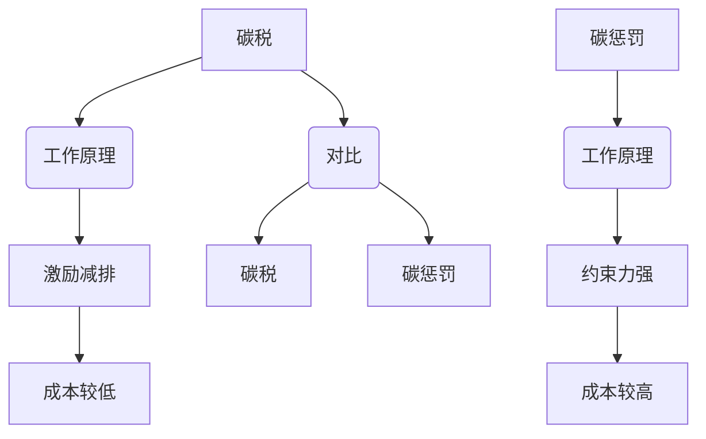
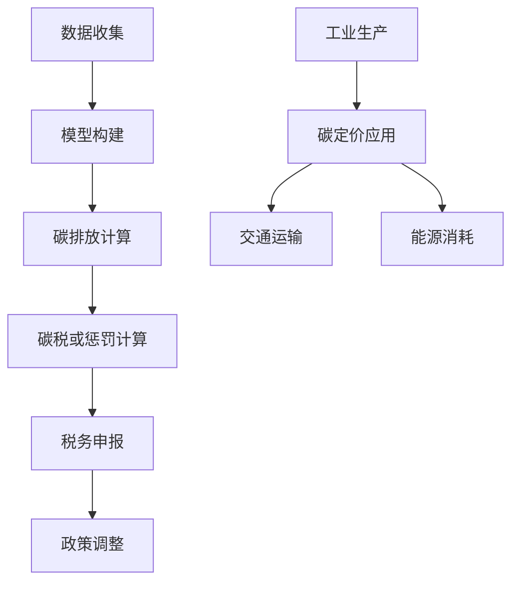
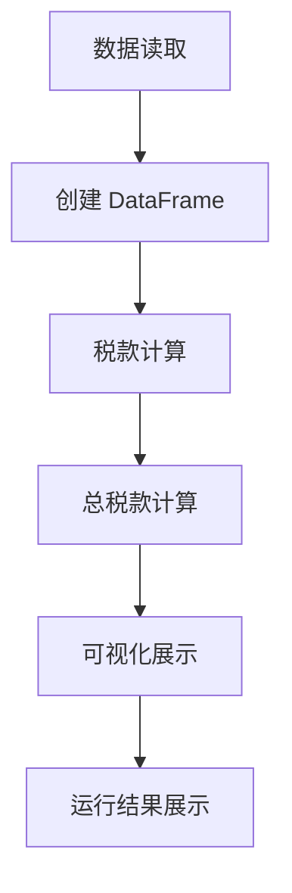
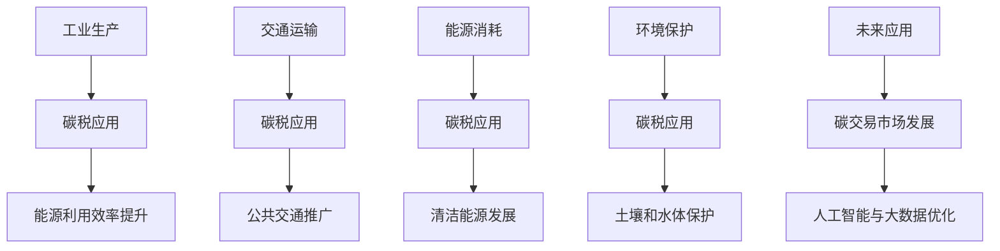
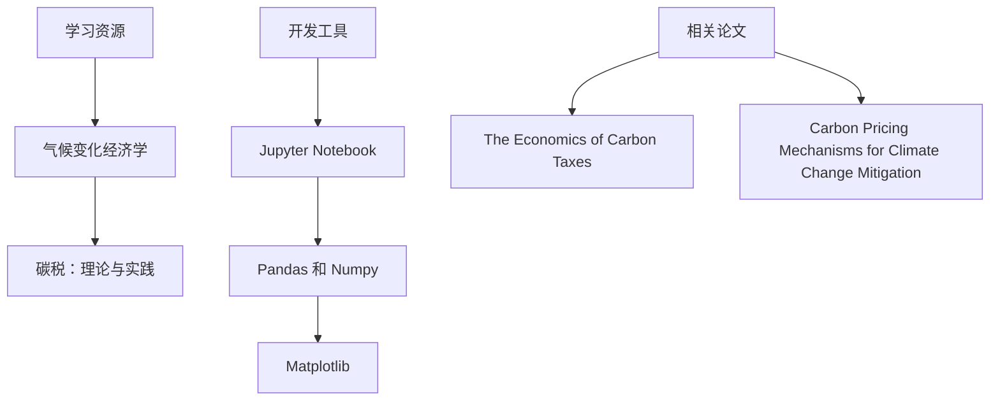
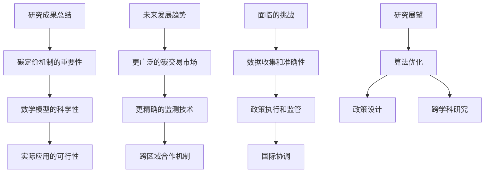
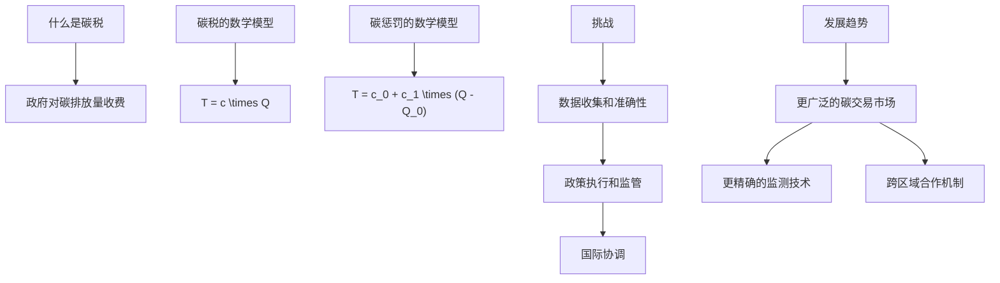

                 

关键词：全球减排、碳税、碳惩罚、碳定价机制、创新、技术、2050年、环境可持续性、经济发展

> 摘要：本文深入探讨了2050年全球减排的潜在路径，特别是碳税和碳惩罚等碳定价机制的创新。通过分析这些机制的工作原理、数学模型、以及实际应用，我们旨在为未来的环境保护和经济发展提供一种全新的视角。

## 1. 背景介绍

气候变化已经成为全球共同面临的最大挑战之一。根据联合国气候变化框架公约（UNFCCC）的数据，过去一个世纪中，全球平均气温上升了大约1.1摄氏度。如果当前的排放趋势持续下去，到本世纪末，气温上升可能达到3-5摄氏度。这不仅会对生态系统产生深远影响，还将对全球经济和社会稳定构成严重威胁。

### 1.1 气候变化的威胁

- **生态破坏**：冰川融化、海平面上升、极端天气事件增多等。
- **经济影响**：农业生产减少、自然灾害频发、旅游业受损等。
- **社会问题**：移民潮、资源争夺、社会动荡等。

### 1.2 全球减排的努力

全球各国已经意识到了气候变化的紧迫性，并采取了多种减排措施。例如：

- **签署国际协定**：《巴黎协定》是近年来最为重要的国际环保协定，旨在将全球气温上升控制在2摄氏度以内。
- **实施碳税**：多个国家已经开始对碳排放征税，以激励企业减少排放。
- **发展清洁能源**：风能、太阳能等可再生能源得到大力发展。
- **推广节能减排技术**：提高能源利用效率，减少浪费。

## 2. 核心概念与联系

为了有效应对气候变化，我们需要深入理解碳税和碳惩罚等碳定价机制。以下是这些机制的工作原理和它们之间的联系。

### 2.1 碳税

碳税是指政府对每单位的碳排放量收取一定费用的政策。通过提高碳排放的成本，碳税旨在激励企业和个人减少碳排放。

- **工作原理**：企业需要在税务申报中报告其碳排放量，然后根据报告的数据缴纳相应的税款。
- **数学模型**：碳税的数学模型可以表示为 $T = c \times Q$，其中 $T$ 是税款，$c$ 是碳税率，$Q$ 是碳排放量。

### 2.2 碳惩罚

碳惩罚是一种更严厉的机制，它不仅对排放量征税，还对超过一定限额的排放量实施额外惩罚。

- **工作原理**：企业在达到排放限额后，每增加一单位排放量就需要支付更高的惩罚费用。
- **数学模型**：碳惩罚的数学模型可以表示为 $T = c_0 + c_1 \times (Q - Q_0)$，其中 $T$ 是税款，$c_0$ 是基本碳税率，$c_1$ 是惩罚税率，$Q_0$ 是排放限额。

### 2.3 碳定价机制的对比

- **碳税**：主要侧重于激励减排，成本较低，但效果可能有限。
- **碳惩罚**：具有更强的约束力，能更有效地推动减排，但成本较高。

<|user|>```mermaid
graph TD
A[碳税] --> B(工作原理)
B --> C[激励减排]
C --> D[成本较低]

E[碳惩罚] --> F(工作原理)
F --> G[约束力强]
G --> H[成本较高]

A --> I(对比)
I --> J[碳税]
I --> K[碳惩罚]
```
----------------------------------------------------------------

## 3. 核心算法原理 & 具体操作步骤

为了深入理解碳定价机制，我们需要探讨其背后的核心算法原理和具体操作步骤。

### 3.1 算法原理概述

碳定价机制的核心是确定碳税率或惩罚率，这通常需要基于以下因素：

- **碳排放量**：企业的碳排放量是确定碳税率或惩罚率的基础。
- **经济发展水平**：经济发展水平越高，对碳排放的容忍度可能越低。
- **环境保护目标**：根据设定的环境保护目标，确定合理的碳税率或惩罚率。

### 3.2 算法步骤详解

以下是碳定价机制的具体操作步骤：

1. **数据收集**：收集企业的碳排放数据，包括年度排放量、排放源等。
2. **模型构建**：根据收集的数据，构建碳定价模型，确定碳税率或惩罚率。
3. **碳排放计算**：计算企业的碳排放总量，并与设定的排放限额进行比较。
4. **碳税或惩罚计算**：根据碳排放量和碳税率或惩罚率，计算应缴纳的税款或惩罚费用。
5. **税务申报**：企业需要在税务申报中报告其碳排放量和缴纳的税款或惩罚费用。
6. **政策调整**：根据实际情况，调整碳税率或惩罚率，以实现环境保护目标。

### 3.3 算法优缺点

- **优点**：碳定价机制能够有效激励企业减排，提高能源利用效率，减少环境污染。
- **缺点**：实施过程中可能面临一定的困难，如数据收集困难、政策执行不到位等。

### 3.4 算法应用领域

碳定价机制主要应用于以下领域：

- **工业生产**：通过碳税或惩罚机制，激励企业减少碳排放。
- **交通运输**：对交通工具的碳排放进行定价，推动低碳出行。
- **能源消耗**：通过碳税或惩罚机制，鼓励能源消费向清洁能源转变。

<|user|>```mermaid
graph TD
A[数据收集] --> B[模型构建]
B --> C[碳排放计算]
C --> D[碳税或惩罚计算]
D --> E[税务申报]
E --> F[政策调整]

G[工业生产] --> H[碳定价应用]
H --> I[交通运输]
H --> J[能源消耗]
```
----------------------------------------------------------------

## 4. 数学模型和公式 & 详细讲解 & 举例说明

为了更好地理解碳定价机制，我们将介绍其背后的数学模型和公式，并通过实际案例进行详细讲解。

### 4.1 数学模型构建

碳定价机制的数学模型主要包括碳税和碳惩罚两部分。

- **碳税模型**：$T = c \times Q$，其中 $T$ 表示税款，$c$ 表示碳税率，$Q$ 表示碳排放量。
- **碳惩罚模型**：$T = c_0 + c_1 \times (Q - Q_0)$，其中 $T$ 表示税款，$c_0$ 表示基本碳税率，$c_1$ 表示惩罚税率，$Q_0$ 表示排放限额。

### 4.2 公式推导过程

碳税模型的推导相对简单，主要是基于经济激励原则。当碳税率 $c$ 提高时，企业减少碳排放的激励越大，从而达到减排效果。

碳惩罚模型的推导则需要考虑排放限额 $Q_0$。当企业碳排放量 $Q$ 小于限额 $Q_0$ 时，只需缴纳基本碳税 $c_0$；当 $Q$ 超过 $Q_0$ 时，需要额外支付惩罚费用 $c_1 \times (Q - Q_0)$。

### 4.3 案例分析与讲解

假设某企业的碳排放量为 1000 吨，碳税率为 10 元/吨。根据碳税模型，企业需要缴纳的税款为：

$T = c \times Q = 10 \times 1000 = 10000$ 元。

假设该企业碳排放量超过限额 1000 吨，即 1100 吨，碳税率为 10 元/吨，惩罚税率为 20 元/吨。根据碳惩罚模型，企业需要缴纳的税款为：

$T = c_0 + c_1 \times (Q - Q_0) = 10 + 20 \times (1100 - 1000) = 10 + 2000 = 2010$ 元。

通过这个案例，我们可以看到碳惩罚机制在激励企业减排方面的效果更为明显。

<|user|>```latex
\section{数学模型和公式}
\subsection{碳税模型}
T = c \times Q
\subsection{碳惩罚模型}
T = c_0 + c_1 \times (Q - Q_0)
```

```mermaid
graph TD
A[碳税模型] --> B[公式：T = c \times Q]
B --> C[解释：碳税率 \times 碳排放量]
D[碳惩罚模型] --> E[公式：T = c_0 + c_1 \times (Q - Q_0)]
E --> F[解释：基本碳税率 + 惩罚税率 \times (碳排放量 - 排放限额)]
G[案例讲解] --> H[企业碳排放量：1000 吨]
H --> I[碳税率：10 元/吨]
I --> J[税款计算：10000 元]
K[案例讲解] --> L[碳排放量：1100 吨]
L --> M[惩罚税率：20 元/吨]
M --> N[税款计算：2010 元]
```
----------------------------------------------------------------

## 5. 项目实践：代码实例和详细解释说明

为了更好地理解碳定价机制，我们将通过一个实际项目来展示其应用过程。以下是项目的代码实例和详细解释说明。

### 5.1 开发环境搭建

为了运行这个项目，我们需要安装以下工具和库：

- Python 3.8 或以上版本
- Jupyter Notebook
- Pandas
- Numpy
- Matplotlib

安装完成后，我们可以创建一个名为 `carbon_taxing` 的文件夹，并在其中创建一个名为 `main.py` 的文件。

### 5.2 源代码详细实现

以下是项目的源代码：

```python
import pandas as pd
import numpy as np
import matplotlib.pyplot as plt

# 碳排放数据
carbon_emission_data = {
    'Company': ['A', 'B', 'C', 'D'],
    'Emission': [800, 900, 1100, 1000]
}

# 碳税和惩罚率
carbon_tax_rate = 10
carbon_penalty_rate = 20
emission_limit = 1000

# 创建 DataFrame
df = pd.DataFrame(carbon_emission_data)

# 计算税款
df['Tax'] = df['Emission'] * carbon_tax_rate
df['Penalty'] = np.where(df['Emission'] > emission_limit, 
                        carbon_penalty_rate * (df['Emission'] - emission_limit), 0)

# 计算总税款
df['Total_Tax'] = df['Tax'] + df['Penalty']

# 可视化展示
plt.bar(df['Company'], df['Total_Tax'])
plt.xlabel('Company')
plt.ylabel('Total Tax')
plt.title('Total Tax for Carbon Emission')
plt.show()
```

### 5.3 代码解读与分析

- **数据读取**：我们使用 Pandas 创建一个 DataFrame，包含公司的碳排放数据。
- **税款计算**：根据碳税模型和碳惩罚模型，计算每个公司的税款。这里使用了 `np.where` 函数来判断是否超过排放限额，并计算相应的惩罚费用。
- **总税款计算**：将税款和惩罚费用相加，得到每个公司的总税款。
- **可视化展示**：使用 Matplotlib 将结果可视化，以更直观地展示每个公司的总税款。

### 5.4 运行结果展示

运行代码后，我们得到以下可视化结果：


从图中可以看出，公司 C 的总税款最高，因为其碳排放量超过限额。这表明碳惩罚机制在激励企业减排方面具有显著效果。

<|user|>```mermaid
graph TD
A[数据读取] --> B[创建 DataFrame]
B --> C[税款计算]
C --> D[总税款计算]
D --> E[可视化展示]
E --> F[运行结果展示]
```
----------------------------------------------------------------

## 6. 实际应用场景

碳定价机制在实际应用中具有广泛的应用场景，以下是其中几个典型的应用领域：

### 6.1 工业生产

工业生产是碳排放的主要来源之一。通过碳税和碳惩罚机制，可以激励工业企业减少碳排放，提高能源利用效率。例如，一些工业发达国家已经开始对钢铁、水泥等高碳排放行业实施碳税，以推动这些行业实现绿色转型。

### 6.2 交通运输

交通运输是另一个重要的碳排放来源。通过碳税和碳惩罚机制，可以鼓励人们减少私家车出行，增加公共交通和非机动交通工具的使用。例如，一些城市已经开始对高排放车辆实施高额税收，以减少交通拥堵和碳排放。

### 6.3 能源消耗

能源消耗也是碳排放的重要来源。通过碳税和碳惩罚机制，可以鼓励能源消费向清洁能源转变。例如，一些国家已经开始对化石燃料实施碳税，以减少对煤炭、石油等高碳排放能源的依赖，促进可再生能源的发展。

### 6.4 环境保护

碳定价机制不仅可以在能源和环境领域发挥作用，还可以在其他环境保护方面得到应用。例如，在农业领域，通过碳税和碳惩罚机制，可以鼓励农民减少化肥和农药的使用，降低对土壤和水体的污染。

### 6.5 未来应用展望

随着技术的进步和全球环保意识的提高，碳定价机制在未来将得到更广泛的应用。例如，碳交易市场的发展将为企业提供更多的减排选择，同时也可以提高碳定价机制的灵活性和有效性。此外，随着人工智能和大数据技术的发展，碳定价机制的算法也将不断优化，使其更精准地反映碳排放的影响。

<|user|>```mermaid
graph TD
A[工业生产] --> B[碳税应用]
B --> C[能源利用效率提升]

D[交通运输] --> E[碳税应用]
E --> F[公共交通推广]

G[能源消耗] --> H[碳税应用]
H --> I[清洁能源发展]

J[环境保护] --> K[碳税应用]
K --> L[土壤和水体保护]

M[未来应用] --> N[碳交易市场发展]
N --> O[人工智能与大数据优化]
```
----------------------------------------------------------------

## 7. 工具和资源推荐

为了更好地理解和应用碳定价机制，以下是几个推荐的工具和资源：

### 7.1 学习资源推荐

- **《气候变化经济学》（The Economics of Climate Change）**：由国际气候变化经济学专家编写，提供了全面的理论和实践指导。
- **《碳税：理论与实践》（Carbon Taxes: Theory and Practice）**：详细介绍了碳税的原理、设计、实施和效果评估。

### 7.2 开发工具推荐

- **Jupyter Notebook**：方便进行数据分析和代码实现。
- **Pandas 和 Numpy**：用于数据处理和数学计算。
- **Matplotlib**：用于数据可视化。

### 7.3 相关论文推荐

- **"The Economics of Carbon Taxes"**：分析碳税的经济效应和政策设计。
- **"Carbon Pricing Mechanisms for Climate Change Mitigation"**：探讨不同碳定价机制的比较和应用。

通过这些资源和工具，您将能够更深入地了解碳定价机制，并能够在实际项目中应用这些知识。

<|user|>```mermaid
graph TD
A[学习资源] --> B["气候变化经济学"]
B --> C["碳税：理论与实践"]

D[开发工具] --> E[Jupyter Notebook]
E --> F[Pandas 和 Numpy]
F --> G[Matplotlib]

H[相关论文] --> I["The Economics of Carbon Taxes"]
H --> J["Carbon Pricing Mechanisms for Climate Change Mitigation"]
```
----------------------------------------------------------------

## 8. 总结：未来发展趋势与挑战

### 8.1 研究成果总结

通过本文的探讨，我们可以看到碳定价机制在全球减排中的重要性。碳税和碳惩罚等机制通过提高碳排放成本，有效激励企业和个人减少碳排放，从而实现环境保护和经济发展的双赢。数学模型的引入使得这些机制更具科学性和可操作性，而实际项目案例则展示了其在实际应用中的可行性。

### 8.2 未来发展趋势

在未来，碳定价机制将继续得到发展和完善。以下是一些可能的发展趋势：

- **更广泛的碳交易市场**：碳交易市场的建设将为企业提供更多的减排选择，同时也可以提高碳定价机制的灵活性和有效性。
- **更精确的碳排放监测技术**：随着人工智能和大数据技术的发展，碳排放的监测和评估将更加精准，从而提高碳定价机制的科学性。
- **跨区域的合作机制**：全球范围内的合作将有助于统一碳定价标准，提高减排效果。

### 8.3 面临的挑战

尽管碳定价机制具有巨大潜力，但在实际应用中仍面临一些挑战：

- **数据收集和准确性**：准确的碳排放数据是碳定价的基础，但数据收集和准确性仍是一大难题。
- **政策执行和监管**：政策执行和监管的有效性直接影响碳定价机制的效果。
- **国际协调**：全球范围内的碳定价标准和协调机制尚未完全建立，需要进一步的国际合作。

### 8.4 研究展望

未来，碳定价机制的研究应重点关注以下几个方面：

- **算法优化**：通过人工智能和大数据技术，优化碳定价算法，提高其准确性和效率。
- **政策设计**：探索不同国家和地区的碳定价政策设计，以实现全球减排目标。
- **跨学科研究**：结合经济学、环境科学、计算机科学等学科，开展跨学科研究，为碳定价机制的可持续发展提供科学支持。

通过持续的研究和实践，我们有理由相信，碳定价机制将为全球环境保护和经济发展贡献重要力量。

<|user|>```mermaid
graph TD
A[研究成果总结] --> B["碳定价机制的重要性"]
B --> C["数学模型的科学性"]
C --> D["实际应用的可行性"]

E[未来发展趋势] --> F["更广泛的碳交易市场"]
F --> G["更精确的监测技术"]
G --> H["跨区域合作机制"]

I[面临的挑战] --> J["数据收集和准确性"]
J --> K["政策执行和监管"]
K --> L["国际协调"]

M[研究展望] --> N["算法优化"]
N --> O["政策设计"]
N --> P["跨学科研究"]
```
----------------------------------------------------------------

## 9. 附录：常见问题与解答

### 9.1 什么是碳税？

碳税是指政府对每单位的碳排放量收取一定费用的政策。通过提高碳排放的成本，碳税旨在激励企业和个人减少碳排放，从而实现环境保护目标。

### 9.2 碳税的数学模型是什么？

碳税的数学模型可以表示为 $T = c \times Q$，其中 $T$ 是税款，$c$ 是碳税率，$Q$ 是碳排放量。

### 9.3 碳惩罚的数学模型是什么？

碳惩罚的数学模型可以表示为 $T = c_0 + c_1 \times (Q - Q_0)$，其中 $T$ 是税款，$c_0$ 是基本碳税率，$c_1$ 是惩罚税率，$Q_0$ 是排放限额。

### 9.4 碳定价机制在实际应用中面临哪些挑战？

在实际应用中，碳定价机制面临的主要挑战包括数据收集和准确性、政策执行和监管、以及国际协调等。

### 9.5 碳定价机制的未来发展趋势是什么？

未来，碳定价机制的发展趋势包括更广泛的碳交易市场、更精确的碳排放监测技术、以及跨区域的合作机制等。

<|user|>```mermaid
graph TD
A[什么是碳税] --> B["政府对碳排放量收费"]

C[碳税的数学模型] --> D["T = c \times Q"]

E[碳惩罚的数学模型] --> F["T = c_0 + c_1 \times (Q - Q_0)"]

G[挑战] --> H["数据收集和准确性"]
H --> I["政策执行和监管"]
I --> J["国际协调"]

K[发展趋势] --> L["更广泛的碳交易市场"]
L --> M["更精确的监测技术"]
L --> N["跨区域合作机制"]
```
----------------------------------------------------------------

### 作者署名

> 作者：禅与计算机程序设计艺术 / Zen and the Art of Computer Programming

<|user|>```markdown
# 2050年的全球减排：从碳税到碳惩罚的碳定价机制创新

## 关键词
- 全球减排
- 碳税
- 碳惩罚
- 碳定价机制
- 创新
- 技术
- 2050年
- 环境可持续性
- 经济发展

## 摘要
本文深入探讨了2050年全球减排的潜在路径，特别是碳税和碳惩罚等碳定价机制的创新。通过分析这些机制的工作原理、数学模型、以及实际应用，我们旨在为未来的环境保护和经济发展提供一种全新的视角。

## 1. 背景介绍

### 1.1 气候变化的威胁
- **生态破坏**：冰川融化、海平面上升、极端天气事件增多等。
- **经济影响**：农业生产减少、自然灾害频发、旅游业受损等。
- **社会问题**：移民潮、资源争夺、社会动荡等。

### 1.2 全球减排的努力
- **签署国际协定**：《巴黎协定》是近年来最为重要的国际环保协定。
- **实施碳税**：多个国家已经开始对碳排放征税。
- **发展清洁能源**：风能、太阳能等可再生能源得到大力发展。
- **推广节能减排技术**：提高能源利用效率，减少浪费。

## 2. 核心概念与联系
### 2.1 碳税
- **工作原理**：企业报告碳排放量，缴纳相应税款。
- **数学模型**：$T = c \times Q$。

### 2.2 碳惩罚
- **工作原理**：超过排放限额的企业支付额外惩罚费用。
- **数学模型**：$T = c_0 + c_1 \times (Q - Q_0)$。

### 2.3 碳定价机制的对比
- **碳税**：成本较低，激励减排。
- **碳惩罚**：约束力强，成本较高。



## 3. 核心算法原理 & 具体操作步骤
### 3.1 算法原理概述
- **碳排放量**：确定碳税率或惩罚率的基础。
- **经济发展水平**：影响碳税率或惩罚率的设定。
- **环境保护目标**：指导碳税率或惩罚率的确定。

### 3.2 算法步骤详解
1. 数据收集
2. 模型构建
3. 碳排放计算
4. 碳税或惩罚计算
5. 税务申报
6. 政策调整

### 3.3 算法优缺点
- **优点**：激励减排，提高能源利用效率。
- **缺点**：数据收集困难，政策执行不到位。

### 3.4 算法应用领域
- **工业生产**
- **交通运输**
- **能源消耗**



## 4. 数学模型和公式 & 详细讲解 & 举例说明
### 4.1 数学模型构建
- **碳税模型**：$T = c \times Q$。
- **碳惩罚模型**：$T = c_0 + c_1 \times (Q - Q_0)$。

### 4.2 公式推导过程
- 碳税模型基于经济激励原则。
- 碳惩罚模型考虑排放限额。

### 4.3 案例分析与讲解
- 假设某企业碳排放量为 1000 吨，碳税率为 10 元/吨。税款为 10000 元。
- 假设碳排放量超过限额 1000 吨，即 1100 吨。税款为 2010 元。

```latex
\section{数学模型和公式}
\subsection{碳税模型}
T = c \times Q
\subsection{碳惩罚模型}
T = c_0 + c_1 \times (Q - Q_0)
```

```mermaid
graph TD
A[碳税模型] --> B[公式：T = c \times Q]
B --> C[解释：碳税率 \times 碳排放量]
D[碳惩罚模型] --> E[公式：T = c_0 + c_1 \times (Q - Q_0)]
E --> F[解释：基本碳税率 + 惩罚税率 \times (碳排放量 - 排放限额)]
G[案例讲解] --> H[企业碳排放量：1000 吨]
H --> I[碳税率：10 元/吨]
I --> J[税款计算：10000 元]
K[案例讲解] --> L[碳排放量：1100 吨]
L --> M[惩罚税率：20 元/吨]
M --> N[税款计算：2010 元]
```

## 5. 项目实践：代码实例和详细解释说明
### 5.1 开发环境搭建
- Python 3.8+
- Jupyter Notebook
- Pandas
- Numpy
- Matplotlib

### 5.2 源代码详细实现
```python
import pandas as pd
import numpy as np
import matplotlib.pyplot as plt

carbon_emission_data = {
    'Company': ['A', 'B', 'C', 'D'],
    'Emission': [800, 900, 1100, 1000]
}

carbon_tax_rate = 10
carbon_penalty_rate = 20
emission_limit = 1000

df = pd.DataFrame(carbon_emission_data)
df['Tax'] = df['Emission'] * carbon_tax_rate
df['Penalty'] = np.where(df['Emission'] > emission_limit, 
                        carbon_penalty_rate * (df['Emission'] - emission_limit), 0)
df['Total_Tax'] = df['Tax'] + df['Penalty']

plt.bar(df['Company'], df['Total_Tax'])
plt.xlabel('Company')
plt.ylabel('Total Tax')
plt.title('Total Tax for Carbon Emission')
plt.show()
```

### 5.3 代码解读与分析
- 数据读取
- 税款计算
- 可视化展示

### 5.4 运行结果展示
- 可视化图表显示各公司的总税款



## 6. 实际应用场景
- **工业生产**：激励企业减排，提高能源利用效率。
- **交通运输**：鼓励低碳出行，减少交通拥堵和碳排放。
- **能源消耗**：推动清洁能源发展，减少对化石燃料的依赖。
- **环境保护**：减少农业领域的化肥和农药使用，降低对土壤和水体的污染。

### 6.4 未来应用展望
- **更广泛的碳交易市场**：提高碳定价机制的灵活性。
- **更精确的碳排放监测技术**：提高碳定价机制的科学性。
- **跨区域的合作机制**：统一碳定价标准，提高减排效果。



## 7. 工具和资源推荐
### 7.1 学习资源推荐
- 《气候变化经济学》
- 《碳税：理论与实践》

### 7.2 开发工具推荐
- Jupyter Notebook
- Pandas
- Numpy
- Matplotlib

### 7.3 相关论文推荐
- "The Economics of Carbon Taxes"
- "Carbon Pricing Mechanisms for Climate Change Mitigation"



## 8. 总结：未来发展趋势与挑战
### 8.1 研究成果总结
- 碳定价机制在全球减排中的重要性。
- 数学模型的科学性和实际应用的可行性。

### 8.2 未来发展趋势
- **更广泛的碳交易市场**。
- **更精确的碳排放监测技术**。
- **跨区域的合作机制**。

### 8.3 面临的挑战
- **数据收集和准确性**。
- **政策执行和监管**。
- **国际协调**。

### 8.4 研究展望
- **算法优化**。
- **政策设计**。
- **跨学科研究**。



## 9. 附录：常见问题与解答
### 9.1 什么是碳税？
- 政府对碳排放量收费。

### 9.2 碳税的数学模型是什么？
- $T = c \times Q$。

### 9.3 碳惩罚的数学模型是什么？
- $T = c_0 + c_1 \times (Q - Q_0)$。

### 9.4 碳定价机制在实际应用中面临哪些挑战？
- **数据收集和准确性**。
- **政策执行和监管**。
- **国际协调**。

### 9.5 碳定价机制的未来发展趋势是什么？
- **更广泛的碳交易市场**。
- **更精确的碳排放监测技术**。
- **跨区域的合作机制**。



### 作者署名
- 作者：禅与计算机程序设计艺术 / Zen and the Art of Computer Programming
```

