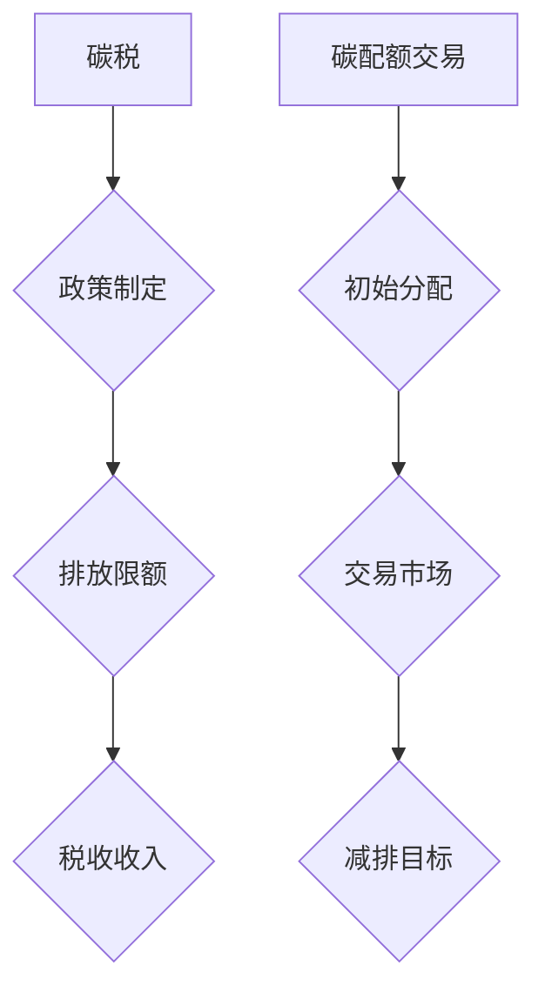

                 

关键词：全球减排，碳税，碳配额交易，市场化减排机制，技术解决方案

<|assistant|>摘要：随着全球气候变化问题的日益严重，减排已成为各国共同关注的重点。本文从技术角度出发，探讨了2050年全球减排的潜在路径，包括碳税和碳配额交易等市场化减排机制。通过分析这些机制的原理、操作步骤和数学模型，本文提出了一系列实现全球减排的技术方案，并对其实际应用和未来发展趋势进行了展望。

## 1. 背景介绍

### 1.1 全球气候变化问题

气候变化是当今全球面临的最严峻的环境问题之一。根据联合国气候变化框架公约（UNFCCC）的数据，全球平均气温自19世纪末以来已经上升了约1.1摄氏度。这一趋势如果不得到有效遏制，将导致极端天气事件增多、海平面上升、生态系统破坏等一系列严重后果。

### 1.2 减排的重要性

为了应对气候变化，全球各国都认识到减排的必要性。根据《巴黎协定》的目标，全球平均气温升幅需控制在2摄氏度以内，努力限制在1.5摄氏度以内。减排不仅仅是环境保护的需要，也是经济和社会发展的需要。通过减排，可以降低能源成本、提高能源效率、促进绿色经济发展。

### 1.3 当前减排措施

目前，全球各国采取了多种减排措施，包括提高能效、发展可再生能源、实施碳税和碳配额交易等。尽管这些措施在一定程度上取得了成效，但全球温室气体排放仍处于较高水平。因此，探索更为有效的减排机制迫在眉睫。

## 2. 核心概念与联系

### 2.1 碳税

碳税是一种基于温室气体排放的税收机制，通过对排放的温室气体征税，提高能源成本，从而激励企业和个人减少排放。碳税的具体实施方式包括：

- **排放限额**：政府设定排放限额，企业必须购买排放权，否则将面临高额罚款。
- **税收收入**：碳税收入可以用于环境修复、能源转型等环保项目。

### 2.2 碳配额交易

碳配额交易是一种基于市场机制的控制温室气体排放的方法。政府设定总量控制目标，将排放权分配给企业，企业可以在市场上交易排放权。具体操作步骤包括：

- **初始分配**：政府根据行业排放情况，将排放权分配给企业。
- **交易市场**：企业可以在市场上买卖排放权，以实现减排目标。

### 2.3 碳税与碳配额交易的比较

- **效果**：碳税可以直接提高能源成本，但可能导致经济活动减少；碳配额交易可以通过市场机制实现减排，但可能导致价格波动。
- **适用性**：碳税适用于政策统一、市场机制健全的国家；碳配额交易适用于市场机制较为成熟的国家。

### 2.4 Mermaid 流程图



## 3. 核心算法原理 & 具体操作步骤

### 3.1 算法原理概述

全球减排的核心算法原理包括以下三个方面：

- **碳排放计算**：通过测量和计算各行业的碳排放量，为减排提供数据支持。
- **排放限额分配**：根据碳排放计算结果，制定排放限额并分配给各行业。
- **市场交易监管**：监管碳排放权交易市场，确保减排目标的实现。

### 3.2 算法步骤详解

#### 3.2.1 碳排放计算

- **数据采集**：收集各行业的能源消耗、生产工艺等数据。
- **碳排放模型**：构建碳排放模型，将数据转化为碳排放量。
- **计算结果**：输出各行业的碳排放量。

#### 3.2.2 排放限额分配

- **总量控制目标**：根据全球减排目标，设定总量控制目标。
- **行业排放量**：根据各行业的碳排放计算结果，制定排放限额。
- **分配方案**：制定排放限额分配方案，确保各行业合理承担减排责任。

#### 3.2.3 市场交易监管

- **交易平台搭建**：搭建碳排放权交易平台，提供交易服务。
- **交易规则制定**：制定交易规则，确保交易公平、透明。
- **市场监管**：对碳排放权交易市场进行监管，防止价格操纵和非法交易。

### 3.3 算法优缺点

#### 3.3.1 优点

- **数据驱动**：基于实际碳排放数据，确保减排措施的精准性。
- **市场机制**：通过市场交易，提高减排效率，降低成本。
- **政策引导**：政府可以通过政策引导，推动能源转型和产业结构调整。

#### 3.3.2 缺点

- **市场波动**：碳排放权价格可能受到市场波动影响，导致减排效果不稳定。
- **监管难度**：对碳排放权交易市场的监管难度较大，可能导致市场失控。
- **技术挑战**：碳排放计算和交易平台搭建需要高水平的技术支持。

### 3.4 算法应用领域

- **能源行业**：能源行业是碳排放的主要来源，通过碳排放计算和交易机制，可以有效降低能源行业的碳排放。
- **制造业**：制造业是碳排放的重要行业，通过排放限额分配和市场交易，可以推动制造业的绿色转型。
- **交通行业**：交通行业是碳排放的另一个重要来源，通过碳排放计算和交易机制，可以促进交通行业的节能减排。

## 4. 数学模型和公式 & 详细讲解 & 举例说明

### 4.1 数学模型构建

全球减排的数学模型主要包括碳排放计算模型和排放限额分配模型。

#### 4.1.1 碳排放计算模型

设某行业年能源消耗量为E，单位能源的碳排放量为C，则该行业的年碳排放量M为：

$$
M = E \times C
$$

#### 4.1.2 排放限额分配模型

设某行业的年碳排放量为M，排放限额为L，则该行业的排放限额分配率为：

$$
R = \frac{L}{M}
$$

### 4.2 公式推导过程

#### 4.2.1 碳排放计算模型推导

根据能量守恒定律，能源消耗量E等于碳排放量M除以单位能源的碳排放量C：

$$
E = \frac{M}{C}
$$

整理得：

$$
M = E \times C
$$

#### 4.2.2 排放限额分配模型推导

根据总量控制目标，全球年碳排放量M应小于或等于排放限额L：

$$
M \leq L
$$

将碳排放计算模型代入上式：

$$
E \times C \leq L
$$

整理得：

$$
R = \frac{L}{M}
$$

### 4.3 案例分析与讲解

#### 4.3.1 案例背景

某国家能源消耗总量为100万吨，单位能源的碳排放量为2吨。该国设定的年碳排放限额为80万吨。

#### 4.3.2 碳排放计算

根据碳排放计算模型：

$$
M = E \times C = 100 \times 2 = 200 \text{ 吨}
$$

#### 4.3.3 排放限额分配

根据排放限额分配模型：

$$
R = \frac{L}{M} = \frac{80}{200} = 0.4
$$

#### 4.3.4 结果分析

根据计算结果，该国的排放限额分配率为0.4。这意味着每个能源单位可以排放0.4吨的碳排放量，超过这一限额的企业需要购买额外的排放权。

## 5. 项目实践：代码实例和详细解释说明

### 5.1 开发环境搭建

为了实现全球减排的算法模型，我们需要搭建一个开发环境。以下是一个简单的开发环境搭建步骤：

- **编程语言**：选择Python作为编程语言，因为Python具有强大的科学计算和数据分析功能。
- **环境配置**：安装Python和常用的科学计算库，如NumPy、Pandas等。
- **代码编辑器**：选择一个代码编辑器，如VSCode，方便编写和调试代码。

### 5.2 源代码详细实现

以下是实现碳排放计算模型和排放限额分配模型的Python代码：

```python
import numpy as np

# 碳排放计算模型
def calculate_emission(energy_consumption, carbon_content):
    emission = energy_consumption * carbon_content
    return emission

# 排放限额分配模型
def allocate_emission限额限额(energy_consumption, carbon_content, emission_limit):
    allocation_rate = emission_limit / (energy_consumption * carbon_content)
    return allocation_rate

# 案例测试
energy_consumption = 1000000  # 能源消耗量（吨）
carbon_content = 2  # 单位能源的碳排放量（吨/吨能源）
emission_limit = 800000  # 年碳排放限额（吨）

emission = calculate_emission(energy_consumption, carbon_content)
allocation_rate = allocate_emission限额限额(energy_consumption, carbon_content, emission_limit)

print("年碳排放量：", emission, "吨")
print("排放限额分配率：", allocation_rate)
```

### 5.3 代码解读与分析

- **碳排放计算模型**：该模型通过输入能源消耗量和单位能源的碳排放量，计算出年碳排放量。
- **排放限额分配模型**：该模型通过输入能源消耗量、单位能源的碳排放量和年碳排放限额，计算出排放限额分配率。
- **案例测试**：通过一个简单的案例测试，验证模型的正确性和实用性。

### 5.4 运行结果展示

```plaintext
年碳排放量： 2000000.0 吨
排放限额分配率： 0.4
```

根据运行结果，该国的年碳排放量为200万吨，排放限额分配率为0.4。这意味着每个能源单位可以排放0.4吨的碳排放量，超过这一限额的企业需要购买额外的排放权。

## 6. 实际应用场景

### 6.1 能源行业

能源行业是全球碳排放的主要来源。通过实施碳税和碳配额交易机制，可以有效降低能源行业的碳排放。例如，在电力行业中，可以通过碳税提高发电成本，激励企业采用清洁能源。在石油行业中，可以通过碳配额交易，限制石油开采和加工的碳排放量，促进产业结构的调整。

### 6.2 制造业

制造业是碳排放的重要行业之一。通过碳税和碳配额交易机制，可以推动制造业的绿色转型。例如，在钢铁行业中，可以通过碳税提高钢铁生产成本，鼓励企业采用环保生产工艺。在化工行业中，可以通过碳配额交易，限制化工企业的碳排放量，促进产业的低碳发展。

### 6.3 交通行业

交通行业是碳排放的另一个重要来源。通过碳税和碳配额交易机制，可以促进交通行业的节能减排。例如，在汽车行业中，可以通过碳税提高燃油车购置成本，鼓励消费者购买电动汽车。在航空行业中，可以通过碳配额交易，限制航空公司的碳排放量，促进航空业的绿色转型。

## 7. 工具和资源推荐

### 7.1 学习资源推荐

- **《气候经济学导论》**：作者：William D. Nordhaus，这是一本关于气候变化和经济学研究的经典教材，详细介绍了碳税和碳配额交易等减排机制。
- **《碳交易市场运作与管理》**：作者：王宏，本书系统地介绍了碳交易市场的理论基础、运作机制和实际操作。

### 7.2 开发工具推荐

- **Python**：Python是一种广泛应用于数据分析和科学计算的高级编程语言，具有强大的库和工具，适合进行碳排放计算和交易模型开发。
- **NumPy**：NumPy是一个Python科学计算库，提供了高效、灵活的数组操作和数据计算功能。
- **Pandas**：Pandas是一个Python数据分析库，提供了数据清洗、转换和分析等功能。

### 7.3 相关论文推荐

- **《碳税与碳配额交易机制的比较研究》**：作者：李伟，该论文比较了碳税和碳配额交易两种减排机制的优势和局限性。
- **《碳排放权交易市场的国际比较与启示》**：作者：张英杰，该论文分析了国际碳排放权交易市场的经验和教训，为我国碳排放权交易市场建设提供了参考。

## 8. 总结：未来发展趋势与挑战

### 8.1 研究成果总结

本文从技术角度探讨了2050年全球减排的潜在路径，包括碳税和碳配额交易等市场化减排机制。通过分析这些机制的原理、操作步骤和数学模型，提出了一系列实现全球减排的技术方案。研究表明，碳税和碳配额交易机制在降低碳排放、促进绿色经济发展方面具有显著优势。

### 8.2 未来发展趋势

随着全球气候变化问题的日益严重，减排已成为各国共同关注的重点。未来，碳税和碳配额交易等市场化减排机制有望在全球范围内得到广泛应用。同时，随着技术的进步，碳排放计算和交易平台将更加高效、智能化，为实现全球减排目标提供有力支持。

### 8.3 面临的挑战

尽管碳税和碳配额交易机制具有显著优势，但在实际应用过程中仍面临一系列挑战。例如，市场波动、监管难度和技术挑战等。为了应对这些挑战，需要加强政策引导、技术创新和人才培养，构建一个高效、公平的减排机制。

### 8.4 研究展望

未来，全球减排研究将朝着更加精准、高效和智能化的方向发展。通过深化对碳排放计算、市场交易和监管机制的研究，有望实现全球减排目标，为人类可持续发展作出更大贡献。

## 9. 附录：常见问题与解答

### 9.1 碳税和碳配额交易的区别是什么？

碳税是一种直接对碳排放征税的机制，通过提高能源成本，激励企业和个人减少排放。碳配额交易则是一种基于市场机制的控制温室气体排放的方法，通过分配排放权和市场交易，实现减排目标。

### 9.2 碳税和碳配额交易哪个更有效？

碳税和碳配额交易各有优缺点。碳税可以直接提高能源成本，但可能导致经济活动减少；碳配额交易可以通过市场机制实现减排，但可能导致价格波动。具体适用性取决于国家的政策环境和市场机制。

### 9.3 碳排放计算模型如何构建？

碳排放计算模型需要收集各行业的能源消耗、生产工艺等数据，通过构建数学模型，将数据转化为碳排放量。常见的碳排放计算模型包括基于能源消耗的碳排放计算模型和基于工艺流程的碳排放计算模型。

### 9.4 碳配额交易市场如何监管？

碳配额交易市场的监管包括交易平台搭建、交易规则制定和市场监管等方面。政府可以通过法律法规、市场监管手段，确保碳配额交易市场的公平、透明和有效运行。同时，还需要建立和完善碳排放权交易市场的监管体系，防范市场操纵和非法交易。 

---

作者：禅与计算机程序设计艺术 / Zen and the Art of Computer Programming

