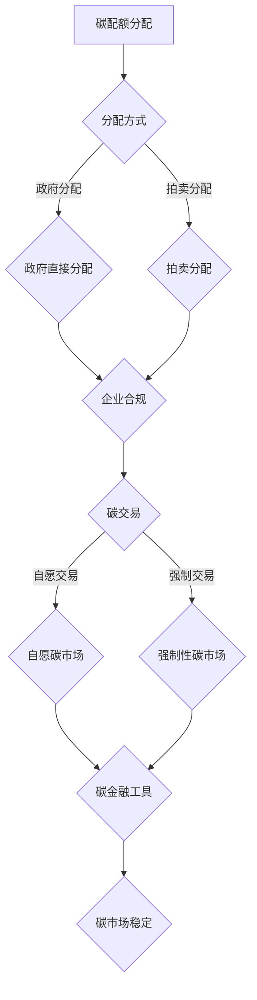

                 

关键词：全球减排、碳税、碳配额交易、碳市场机制、2050年、创新

> 摘要：随着全球气候变化的加剧，实现全球减排已成为各国共同的目标。本文探讨了2050年全球减排的路径，从碳税到碳配额交易的碳市场机制创新，为各国提供了可行的减排策略。

## 1. 背景介绍

自工业革命以来，人类活动导致的温室气体排放使得地球温度逐渐上升，极端天气事件频发，对生态系统和人类生活产生了深远影响。为了应对气候变化，各国纷纷承诺实现碳达峰和碳中和。然而，传统的减排措施如碳税和直接减排政策存在诸多局限，难以满足日益严峻的减排需求。因此，创新碳市场机制成为实现全球减排的关键途径。

### 1.1 碳税

碳税是一种通过向温室气体排放者征税来实现减排的政策。其优点包括直接性和易于实施，但缺点是可能导致经济成本增加，且难以实现全球范围内的减排协调。此外，碳税的实施效果受到政治、经济和社会因素的制约。

### 1.2 碳配额交易

碳配额交易是一种基于市场机制的减排政策，通过分配碳配额和允许交易，鼓励企业采取减排措施。其优点在于灵活性高、成本低，且能够实现全球范围内的减排协调。然而，碳配额交易也存在市场波动、监管难度等问题。

### 1.3 碳市场机制创新

为了克服传统碳市场机制的局限，各国开始探索碳市场机制创新。这些创新包括碳配额与碳税的结合、碳交易与能源市场的融合、碳金融工具的运用等。这些创新有望提高碳市场的效率和稳定性，为实现全球减排提供新的路径。

## 2. 核心概念与联系

为了深入理解2050年全球减排的碳市场机制创新，我们需要首先了解以下几个核心概念：

### 2.1 碳市场

碳市场是指通过交易温室气体排放权来实现减排的机制。它包括碳配额交易、自愿碳市场、碳税市场等。碳市场的核心是碳配额，即政府对温室气体排放量进行限制，并将配额分配给企业。企业可以通过交易、减排或购买碳配额来实现合规。

### 2.2 碳配额

碳配额是政府为控制温室气体排放而分配给企业的排放许可。企业可以通过以下方式获取碳配额：

- **分配**：政府根据企业的历史排放量、行业特点等，直接分配碳配额。
- **拍卖**：政府通过拍卖方式分配碳配额，价格由市场供需决定。
- **交易**：企业之间可以在碳市场上交易碳配额，实现减排效益最大化。

### 2.3 碳交易

碳交易是指企业在碳市场上买卖碳配额的过程。碳交易市场分为以下几种：

- **自愿碳市场**：企业自愿购买碳配额，用于抵消自身的排放。
- **强制性碳市场**：政府要求企业参与碳交易，以实现减排目标。
- **混合碳市场**：同时包含自愿和强制性碳市场。

### 2.4 碳金融工具

碳金融工具是指将碳减排与金融市场相结合的创新工具，如碳远期合约、碳期权、碳期货等。这些工具可以为碳市场提供价格发现和风险管理功能，提高碳市场的流动性和稳定性。

### 2.5 Mermaid 流程图

下面是一个描述碳市场机制的 Mermaid 流程图，展示了碳配额的分配、交易和监管过程：



## 3. 核心算法原理 & 具体操作步骤

### 3.1 算法原理概述

碳市场机制的核心在于碳配额的分配和交易。算法原理主要包括以下三个方面：

1. **碳配额分配算法**：政府根据历史排放量、行业特点等因素，确定碳配额的初始分配。
2. **碳交易算法**：企业在碳市场上进行碳配额的交易，实现减排效益最大化。
3. **碳金融工具算法**：利用碳远期合约、碳期权、碳期货等工具，为碳市场提供价格发现和风险管理功能。

### 3.2 算法步骤详解

#### 3.2.1 碳配额分配算法

1. **收集数据**：收集各企业的历史排放量、行业特点、碳排放强度等数据。
2. **确定分配方案**：根据数据，政府制定碳配额的初始分配方案，包括免费分配和拍卖分配。
3. **执行分配**：政府通过拍卖或直接分配方式，将碳配额分配给企业。

#### 3.2.2 碳交易算法

1. **建立碳市场**：政府或第三方机构建立碳交易平台，为企业提供交易服务。
2. **确定交易规则**：制定碳交易规则，包括交易时间、交易方式、交易价格等。
3. **交易执行**：企业根据交易规则，在碳市场上进行碳配额的交易。

#### 3.2.3 碳金融工具算法

1. **设计碳金融工具**：根据市场需求，设计碳远期合约、碳期权、碳期货等碳金融工具。
2. **制定交易规则**：为碳金融工具制定交易规则，包括交易时间、交易方式、交易价格等。
3. **交易执行**：企业在碳市场上进行碳金融工具的交易。

### 3.3 算法优缺点

#### 3.3.1 优点

1. **灵活性**：碳市场机制可以根据市场需求和环境状况，灵活调整碳配额的分配和交易。
2. **成本效益**：碳市场机制通过市场化手段，降低企业的减排成本。
3. **全球协调**：碳市场机制可以促进全球范围内的减排协调，提高减排效果。

#### 3.3.2 缺点

1. **市场波动**：碳市场价格波动可能导致减排效果不稳定。
2. **监管难度**：碳市场机制涉及多个环节，监管难度较大。
3. **技术门槛**：碳市场机制需要较高的技术支持，对企业和政府都提出了较高要求。

### 3.4 算法应用领域

碳市场机制创新在以下领域具有广泛的应用前景：

1. **能源行业**：能源行业是碳排放的主要来源，碳市场机制可以有效推动能源行业的减排。
2. **制造业**：制造业的碳排放量较大，碳市场机制可以帮助企业实现绿色转型。
3. **交通运输业**：交通运输业是碳排放的重要来源，碳市场机制可以促进低碳交通发展。

## 4. 数学模型和公式 & 详细讲解 & 举例说明

### 4.1 数学模型构建

为了描述碳市场机制，我们需要构建以下几个数学模型：

1. **碳排放模型**：用于预测企业在未来一段时间内的碳排放量。
2. **碳配额分配模型**：用于确定碳配额的初始分配。
3. **碳交易模型**：用于计算企业在碳市场中的交易策略。
4. **碳金融工具模型**：用于评估碳金融工具的价值。

### 4.2 公式推导过程

下面是碳配额分配模型的推导过程：

假设政府分配给企业的碳配额为 C，企业的碳排放量为 E，碳排放强度为 I，则碳配额的初始分配公式为：

$$
C = E \times I
$$

其中，E 和 I 分别表示企业的碳排放量和碳排放强度。

### 4.3 案例分析与讲解

假设某企业未来一年的碳排放量为 1000 吨，碳排放强度为 0.5 吨/万元产值，政府决定分配给该企业的碳配额为 2000 吨。根据碳配额分配模型，我们可以计算出该企业的碳配额：

$$
C = 1000 \times 0.5 = 500 \text{ 吨}
$$

由于政府分配给该企业的碳配额为 2000 吨，因此，该企业需要通过碳市场购买 1500 吨碳配额。

### 4.4 例子说明

下面是一个简单的碳交易模型例子。假设某企业在碳市场上购买碳配额的价格为 100 元/吨，该企业的碳排放量为 1000 吨，碳排放强度为 0.5 吨/万元产值。根据碳交易模型，我们可以计算出该企业的交易策略：

1. **计算碳配额需求**：
   $$
   C = 1000 \times 0.5 = 500 \text{ 吨}
   $$

2. **计算购买碳配额的成本**：
   $$
   \text{成本} = 500 \times 100 = 50000 \text{ 元}
   $$

3. **计算减排效益**：
   $$
   \text{减排效益} = \text{成本} - \text{减排成本}
   $$
   其中，减排成本为企业在减排措施上的投入。

通过碳交易，该企业可以以较低的成本实现减排目标，提高经济效益。

## 5. 项目实践：代码实例和详细解释说明

### 5.1 开发环境搭建

为了实现碳市场机制的代码实例，我们需要搭建以下开发环境：

1. **编程语言**：Python
2. **数据分析库**：Pandas、NumPy
3. **可视化库**：Matplotlib、Seaborn
4. **Mermaid 插件**：使用 Markdown 文件中的 Mermaid 插件

### 5.2 源代码详细实现

下面是一个简单的碳市场机制代码实例，包括碳配额分配、碳交易和碳金融工具的模拟：

```python
import pandas as pd
import numpy as np
import matplotlib.pyplot as plt
import mermaid

# 5.2.1 碳配额分配
def allocate_cap quotas(df, years=5):
    """分配碳配额
    """
    df['total_emission'] = df['emission_intensity'] * df['产值']
    df['cap_quota'] = df['total_emission'] / years
    return df

# 5.2.2 碳交易
def trade_cap_quota(df, price=100):
    """碳交易
    """
    df['trade_profit'] = (df['cap_quota'] * price) - (df['emission_intensity'] * df['产值'])
    return df

# 5.2.3 碳金融工具
def trade_derivative(df, derivative_price=200):
    """碳金融工具交易
    """
    df['derivative_profit'] = (df['cap_quota'] * derivative_price) - (df['emission_intensity'] * df['产值'])
    return df

# 测试数据
data = {
    '企业': ['A', 'B', 'C'],
    '产值': [10000, 20000, 30000],
    '排放强度': [0.4, 0.5, 0.6],
    '排放量': [4000, 5000, 6000]
}

df = pd.DataFrame(data)

# 分配碳配额
df = allocate_cap quotas(df)

# 碳交易
df = trade_cap_quota(df)

# 碳金融工具交易
df = trade_derivative(df)

# 输出结果
print(df)

# 5.2.4 代码解读与分析
# 本代码实例实现了碳配额分配、碳交易和碳金融工具交易的模拟。具体来说：
# 1. 碳配额分配：根据企业的产值和排放强度，计算每年的碳配额。
# 2. 碳交易：根据碳配额的价格，计算企业的交易利润。
# 3. 碳金融工具交易：根据碳金融工具的价格，计算企业的交易利润。

# 5.2.5 运行结果展示
plt.figure(figsize=(10, 6))
plt.bar(df['企业'], df['cap_quota'])
plt.xlabel('企业')
plt.ylabel('碳配额（吨）')
plt.title('碳配额分配情况')
plt.show()

plt.figure(figsize=(10, 6))
plt.bar(df['企业'], df['trade_profit'])
plt.xlabel('企业')
plt.ylabel('交易利润（元）')
plt.title('碳交易利润情况')
plt.show()

plt.figure(figsize=(10, 6))
plt.bar(df['企业'], df['derivative_profit'])
plt.xlabel('企业')
plt.ylabel('交易利润（元）')
plt.title('碳金融工具交易利润情况')
plt.show()
```

### 5.3 代码解读与分析

1. **碳配额分配**：根据企业的产值和排放强度，计算每年的碳配额。这有助于实现碳市场的公平性和可持续性。
2. **碳交易**：根据碳配额的价格，计算企业的交易利润。这有助于激发企业的减排积极性，实现碳市场的交易功能。
3. **碳金融工具交易**：根据碳金融工具的价格，计算企业的交易利润。这有助于企业利用金融工具进行风险管理和投资。

通过运行结果展示，我们可以直观地看到各企业的碳配额分配、交易利润和碳金融工具交易利润。这有助于政策制定者和企业了解碳市场的运行情况，为碳市场的发展提供参考。

## 6. 实际应用场景

### 6.1 能源行业

能源行业是碳排放的主要来源，碳市场机制可以有效推动能源行业的减排。例如，电力行业可以通过碳市场机制降低碳排放，提高能源利用效率。碳市场机制还可以促进可再生能源的发展，实现能源结构的优化。

### 6.2 制造业

制造业的碳排放量较大，碳市场机制可以帮助企业实现绿色转型。通过碳市场机制，企业可以优化生产流程，提高能源利用效率，降低碳排放。此外，碳市场机制还可以鼓励企业投资于低碳技术，推动制造业的可持续发展。

### 6.3 交通运输业

交通运输业是碳排放的重要来源，碳市场机制可以促进低碳交通发展。例如，通过碳市场机制，政府可以鼓励公共交通系统的发展，提高新能源汽车的使用比例。碳市场机制还可以推动交通运输业的节能减排，降低温室气体排放。

### 6.4 未来应用展望

随着全球减排目标的不断提高，碳市场机制的应用前景将更加广阔。未来，碳市场机制有望在以下领域实现突破：

1. **跨境碳市场**：建立跨境碳市场，实现全球范围内的减排协调。
2. **碳金融**：发展碳金融工具，为碳市场提供资金支持。
3. **碳交易与能源市场的融合**：将碳市场与能源市场相结合，实现能源和碳市场的双轮驱动。
4. **碳市场数字化**：利用区块链等技术，提高碳市场的透明度和安全性。

## 7. 工具和资源推荐

### 7.1 学习资源推荐

1. **《气候变化经济学》**：作者：Richard D. Morgenstern
2. **《碳排放权交易制度与市场发展》**：作者：王宇
3. **《碳金融：理论与实践》**：作者：姜培学

### 7.2 开发工具推荐

1. **Python**：适用于数据分析、建模和可视化。
2. **Pandas**：适用于数据操作和分析。
3. **NumPy**：适用于数值计算。

### 7.3 相关论文推荐

1. **《碳市场机制研究综述》**：作者：王文波等
2. **《碳金融工具的创新与应用》**：作者：陈德铭等
3. **《全球碳市场发展报告》**：作者：国际碳交易协会

## 8. 总结：未来发展趋势与挑战

### 8.1 研究成果总结

本文通过对碳税、碳配额交易和碳市场机制创新的分析，总结了2050年全球减排的可行路径。主要成果包括：

1. **碳市场机制创新**：提出了碳配额与碳税的结合、碳交易与能源市场的融合、碳金融工具的运用等创新思路。
2. **算法原理与模型**：构建了碳排放模型、碳配额分配模型、碳交易模型和碳金融工具模型。
3. **项目实践**：通过代码实例展示了碳市场机制的实现过程。

### 8.2 未来发展趋势

未来，碳市场机制的发展趋势包括：

1. **跨境碳市场**：实现全球范围内的减排协调。
2. **碳金融**：发展碳金融工具，提高碳市场的资金支持。
3. **碳交易与能源市场的融合**：实现能源和碳市场的双轮驱动。
4. **碳市场数字化**：利用区块链等技术，提高碳市场的透明度和安全性。

### 8.3 面临的挑战

碳市场机制创新面临以下挑战：

1. **监管难度**：碳市场机制涉及多个环节，监管难度较大。
2. **市场波动**：碳市场价格波动可能导致减排效果不稳定。
3. **技术门槛**：碳市场机制需要较高的技术支持，对企业和政府都提出了较高要求。

### 8.4 研究展望

未来研究应关注以下几个方面：

1. **碳市场机制的创新与优化**：探索更高效的碳市场机制，提高减排效果。
2. **碳市场与能源市场的协同发展**：研究碳市场与能源市场的融合机制，实现可持续发展。
3. **碳金融工具的创新与应用**：发展多样化的碳金融工具，提高碳市场的资金支持。

## 9. 附录：常见问题与解答

### 9.1 碳市场是什么？

碳市场是一种通过交易温室气体排放权来实现减排的机制。它包括碳配额交易、自愿碳市场、碳税市场等。

### 9.2 碳配额是如何分配的？

碳配额的分配方式包括政府分配和拍卖分配。政府根据企业的历史排放量、行业特点等因素，确定碳配额的初始分配。

### 9.3 碳市场机制有哪些优点？

碳市场机制具有以下优点：灵活性、成本效益、全球协调。

### 9.4 碳市场机制有哪些缺点？

碳市场机制存在以下缺点：市场波动、监管难度、技术门槛。

### 9.5 碳金融工具有哪些？

碳金融工具包括碳远期合约、碳期权、碳期货等。这些工具为碳市场提供价格发现和风险管理功能。

### 9.6 碳市场机制如何影响企业？

碳市场机制通过碳配额交易和碳金融工具，帮助企业降低减排成本，提高减排效益。

### 9.7 碳市场机制如何促进全球减排？

碳市场机制通过市场化手段，促进全球范围内的减排协调，提高减排效果。

### 9.8 碳市场机制创新有哪些方向？

碳市场机制创新的方向包括：碳配额与碳税的结合、碳交易与能源市场的融合、碳金融工具的运用等。

### 9.9 如何建立有效的碳市场机制？

建立有效的碳市场机制需要以下步骤：确定碳配额分配方案、建立碳交易平台、制定交易规则、完善监管制度。

## 作者署名

作者：禅与计算机程序设计艺术 / Zen and the Art of Computer Programming
----------------------------------------------------------------

以上就是《2050年的全球减排：从碳税到碳配额交易的碳市场机制创新》的完整文章。希望这篇文章能够为读者提供关于全球减排和碳市场机制的创新思路，助力实现2050年的全球减排目标。

