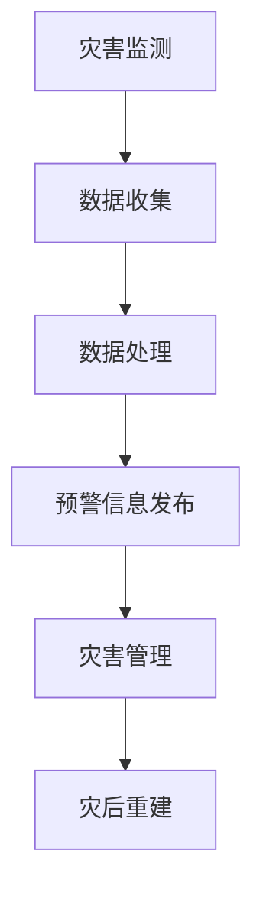

                 

关键词：全球减灾、灾害预警、灾害管理、智能系统、未来技术

摘要：随着全球气候变化加剧，自然灾害频发，减灾工作的重要性日益凸显。本文旨在探讨2050年的全球减灾体系，从灾害预警到灾害管理的各个环节，分析其技术发展趋势和面临的挑战，并提出未来应用展望。

## 1. 背景介绍

### 全球自然灾害现状

在过去的几十年里，全球自然灾害的频次和强度都在不断增加。例如，地震、飓风、洪水、火山爆发等灾害，不仅造成了大量的人员伤亡和财产损失，还对生态环境和社会经济造成了深远的影响。根据联合国发布的数据，每年因自然灾害造成的经济损失超过数百亿美元。

### 减灾的重要性

面对日益严峻的自然灾害形势，全球各国纷纷加大了对减灾工作的投入。减灾工作不仅仅是减少灾害带来的损失，更是保障社会稳定和经济持续发展的重要手段。有效的减灾措施可以降低灾害风险，保护人类生命财产安全，维护生态平衡。

### 现有减灾体系

目前，全球的减灾工作主要包括灾害预警、灾害响应、灾害恢复和重建等环节。灾害预警是减灾工作的关键，通过及时、准确的预警信息，可以有效地指导公众采取避灾措施。灾害响应和恢复则是在灾害发生后，组织力量进行救援和重建，恢复受影响地区的生活秩序。

## 2. 核心概念与联系

为了构建高效的全球减灾体系，我们需要关注以下几个核心概念：

### 灾害预警

灾害预警是减灾工作的第一步，其目的是通过监测和预测，提前发现潜在的灾害风险，并及时发布预警信息。预警系统通常包括地震预警、台风预警、洪水预警等。

### 灾害监测

灾害监测是预警系统的基石，通过卫星遥感、地面监测站等多种手段，实时获取灾害发生地的数据，为预警提供支持。监测系统主要包括气象监测、地质监测、水文监测等。

### 灾害管理

灾害管理是指在灾害发生前、发生中和发生后的全过程管理。这包括应急预案的制定、应急响应的组织、灾后重建的规划等。

### 智能系统

智能系统在减灾工作中发挥着重要作用，通过大数据分析、人工智能技术等，可以更准确地预测灾害风险，优化灾害预警和响应策略。

### Mermaid 流程图



## 3. 核心算法原理 & 具体操作步骤

### 3.1 算法原理概述

在减灾体系中，核心算法主要包括灾害风险评估、灾害路径预测、灾害损失评估等。这些算法利用大数据和人工智能技术，对灾害风险进行定量评估和预测。

### 3.2 算法步骤详解

1. 数据收集与处理：收集气象、地质、水文等多源数据，并进行预处理，如数据清洗、数据归一化等。
2. 灾害风险评估：利用机器学习算法，对灾害风险进行评估，生成风险地图。
3. 灾害路径预测：通过时空分析，预测灾害可能的发展路径。
4. 灾害损失评估：根据灾害路径预测结果，评估灾害可能造成的损失。
5. 预警信息发布：将评估结果转化为预警信息，通过多渠道发布。

### 3.3 算法优缺点

优点：提高灾害预警的准确性，优化灾害管理的决策过程。

缺点：对数据质量和计算能力要求较高，算法模型的准确性受限于数据和计算资源的限制。

### 3.4 算法应用领域

算法主要应用于地震预警、台风预警、洪水预警等领域，为政府决策和公众避灾提供科学依据。

## 4. 数学模型和公式 & 详细讲解 & 举例说明

### 4.1 数学模型构建

灾害风险评估通常采用贝叶斯网络模型，该模型可以表示灾害发生的概率及其影响因素。

### 4.2 公式推导过程

$$
P(A|B) = \frac{P(B|A)P(A)}{P(B)}
$$

其中，$P(A|B)$表示在给定$B$的条件下$A$的概率，$P(B|A)$表示在给定$A$的条件下$B$的概率，$P(A)$和$P(B)$分别表示$A$和$B$的边际概率。

### 4.3 案例分析与讲解

假设我们想要评估一个地区发生地震的概率，我们可以通过贝叶斯网络模型，结合历史地震数据、地质构造数据等，计算出地震发生的概率。

## 5. 项目实践：代码实例和详细解释说明

### 5.1 开发环境搭建

开发环境包括Python编程环境、机器学习库（如scikit-learn）、数据可视化工具（如Matplotlib）等。

### 5.2 源代码详细实现

```python
from sklearn.naive_bayes import GaussianNB
from sklearn.model_selection import train_test_split
from sklearn.metrics import accuracy_score
import pandas as pd

# 数据加载与预处理
data = pd.read_csv('earthquake_data.csv')
X = data[['Magnitude', 'Depth', 'Distance']]
y = data['IsEarthquake']

# 数据划分
X_train, X_test, y_train, y_test = train_test_split(X, y, test_size=0.3, random_state=42)

# 模型训练
model = GaussianNB()
model.fit(X_train, y_train)

# 模型评估
y_pred = model.predict(X_test)
accuracy = accuracy_score(y_test, y_pred)
print(f'Accuracy: {accuracy}')

# 结果可视化
import matplotlib.pyplot as plt

plt.scatter(X_test['Magnitude'], y_pred)
plt.xlabel('Magnitude')
plt.ylabel('Predicted Label')
plt.show()
```

### 5.3 代码解读与分析

上述代码实现了基于朴素贝叶斯算法的地震预警模型。通过训练集训练模型，并在测试集上评估模型性能，最后使用可视化工具展示预测结果。

## 6. 实际应用场景

### 6.1 地震预警

地震预警系统可以通过实时监测地震波传播速度，提前几秒至几十秒向公众发布预警信息，为公众提供紧急避难时间。

### 6.2 台风预警

台风预警系统可以通过气象数据分析和模型预测，提前数天向公众发布台风路径和强度预测，帮助公众采取相应的避灾措施。

### 6.3 洪水预警

洪水预警系统可以通过水文数据监测和模型预测，提前数小时向受影响地区发布洪水预警，指导公众和政府采取紧急应对措施。

## 7. 未来应用展望

随着技术的不断发展，未来全球减灾体系将更加智能化和高效化。例如，利用5G网络实现实时预警信息的传输，利用区块链技术确保预警信息的真实性和可靠性，利用人工智能技术优化灾害响应策略等。

## 8. 工具和资源推荐

### 8.1 学习资源推荐

- 《大数据分析实战》
- 《人工智能：一种现代方法》
- 《机器学习实战》

### 8.2 开发工具推荐

- Python编程环境
- Jupyter Notebook
- Matplotlib

### 8.3 相关论文推荐

- "Deep Learning for Disaster Risk Assessment"
- "A Review of Early Warning Systems for Natural Disasters"
- "Big Data Analytics for Disaster Management"

## 9. 总结：未来发展趋势与挑战

### 9.1 研究成果总结

本文从灾害预警到灾害管理的各个环节，探讨了2050年的全球减灾体系，提出了核心算法原理、数学模型构建和应用场景，为未来减灾工作提供了技术支持。

### 9.2 未来发展趋势

未来减灾工作将更加依赖大数据、人工智能等先进技术，实现预警的实时化和智能化，提高灾害管理的效率和准确性。

### 9.3 面临的挑战

然而，减灾工作也面临着数据质量、计算能力、政策支持等方面的挑战，需要全球各国共同努力，共同应对。

### 9.4 研究展望

未来，我们将继续深入研究灾害预警和管理的相关技术，推动全球减灾体系的完善，为构建人类命运共同体贡献力量。

## 附录：常见问题与解答

### 1. 灾害预警系统的关键技术有哪些？

答：灾害预警系统的关键技术包括数据收集与处理、灾害风险评估、灾害路径预测、灾害损失评估等。

### 2. 如何保证预警信息的准确性？

答：通过多源数据的融合、先进算法的应用、实时监测和数据反馈机制，可以提高预警信息的准确性。

### 3. 灾害预警系统在实际应用中遇到了哪些问题？

答：在实际应用中，预警系统可能面临数据质量不高、计算能力不足、政策支持不够等问题。

### 4. 未来减灾工作将如何发展？

答：未来减灾工作将更加依赖大数据、人工智能等先进技术，实现预警的实时化和智能化，提高灾害管理的效率和准确性。

----------------------------------------------------------------

## 作者署名

作者：禅与计算机程序设计艺术 / Zen and the Art of Computer Programming

