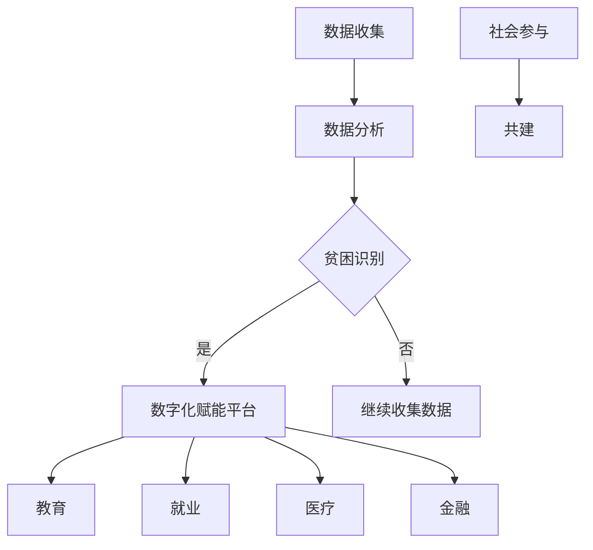

                 

关键词：全球减贫、可持续发展、赋能、技术进步、数字化

> 摘要：本文探讨了2050年全球减贫的愿景和路径。通过分析技术进步和数字化的影响，文章提出了一种从援助到赋能的可持续发展模式，旨在提高全球贫困人口的自我发展能力，实现真正意义上的减贫。

## 1. 背景介绍

### 1.1 全球贫困现状

尽管全球经济发展取得了显著成就，但贫困问题依然严重。根据联合国世界粮食计划署（WFP）的数据，截至2021年，全球仍有约7.89亿人生活在极端贫困中，每天生活费不足1.9美元。此外，根据世界银行的数据，全球仍有约28亿人无法获得基本的卫生设施。

### 1.2 减贫措施的发展

自1990年代以来，全球减贫工作取得了一定的进展。特别是《巴黎协议》和《2030年可持续发展议程》的签署，为全球减贫工作提供了新的动力和目标。然而，传统的减贫措施主要依赖于经济援助和基础设施建设，这些措施在短期内取得了一定的成效，但从长期来看，贫困人口的自我发展能力并没有得到显著提升。

### 1.3 技术进步与数字化的影响

随着技术的不断进步和数字化的发展，许多新兴技术和应用开始在贫困地区得到应用，为解决贫困问题提供了新的可能。例如，区块链技术可以提供透明、去中心化的解决方案，促进资源的合理分配；人工智能可以用于精准识别贫困人口，提高援助的效率和精准度。

## 2. 核心概念与联系

### 2.1 从援助到赋能的概念转变

从援助到赋能的可持续发展模式，强调的是通过提升贫困人口的自我发展能力，实现减贫目标。这种模式不再仅仅依赖于外部援助，而是注重激发贫困人口的内生动力。

### 2.2 核心概念原理与架构

#### 2.2.1 数据驱动的贫困识别

利用大数据和人工智能技术，可以实现对贫困人口的精准识别。通过收集和分析贫困人口的生活、工作、健康状况等数据，可以准确判断他们的贫困程度，为后续的赋能提供基础。

#### 2.2.2 数字化赋能平台

构建一个数字化赋能平台，将各类资源和服务整合到平台上，为贫困人口提供一站式的服务。平台可以提供教育、就业、医疗、金融等多种服务，帮助他们提高自我发展能力。

#### 2.2.3 社会参与与共建

在赋能过程中，鼓励社会各界参与，共同为贫困人口提供支持。政府、企业、非政府组织、社区等都可以发挥各自的作用，共同推动减贫工作。

### 2.3 Mermaid 流程图



## 3. 核心算法原理 & 具体操作步骤

### 3.1 算法原理概述

#### 3.1.1 大数据与人工智能

利用大数据技术，收集和分析贫困人口的多维度数据，通过机器学习算法，实现贫困人口的精准识别。

#### 3.1.2 增量学习与迁移学习

在贫困识别过程中，采用增量学习和迁移学习技术，不断提高算法的准确性和效率。

### 3.2 算法步骤详解

#### 3.2.1 数据收集

收集贫困人口的生活、工作、健康状况等数据，包括但不限于：

- 居住环境
- 经济收入
- 就业状况
- 医疗健康
- 教育水平

#### 3.2.2 数据清洗与预处理

对收集到的数据进行清洗和预处理，包括去重、缺失值填补、异常值处理等。

#### 3.2.3 特征工程

根据数据的特征，构建适合的机器学习模型。特征工程包括：

- 特征选择
- 特征转换
- 特征提取

#### 3.2.4 模型训练与评估

利用机器学习算法，对预处理后的数据进行训练，评估模型的准确性和效率。常用的算法包括：

- 决策树
- 随机森林
- 支持向量机
- 神经网络

### 3.3 算法优缺点

#### 3.3.1 优点

- 精准识别贫困人口，提高援助的效率。
- 随着数据的积累，模型的可解释性和准确性不断提高。
- 能够为贫困人口提供个性化的服务。

#### 3.3.2 缺点

- 数据隐私和安全问题。
- 对计算资源和存储资源的要求较高。

### 3.4 算法应用领域

- 贫困识别
- 公共福利分配
- 社会救助

## 4. 数学模型和公式 & 详细讲解 & 举例说明

### 4.1 数学模型构建

#### 4.1.1 贫困识别模型

设 \( X \) 为贫困人口的多维度特征向量，\( y \) 为贫困标签（1表示贫困，0表示非贫困），则贫困识别模型可以表示为：

\[ y = f(X) \]

其中，\( f \) 为机器学习算法。

#### 4.1.2 增量学习模型

设 \( X_t \) 为第 \( t \) 次迭代的特征向量，\( y_t \) 为对应的标签，则增量学习模型可以表示为：

\[ X_{t+1} = X_t + \Delta X_t \]

\[ y_{t+1} = f(X_{t+1}) \]

其中，\( \Delta X_t \) 为第 \( t \) 次迭代的特征增量。

### 4.2 公式推导过程

#### 4.2.1 贫困识别模型的推导

设 \( X \) 为贫困人口的多维度特征向量，\( \theta \) 为模型参数，则贫困识别模型可以表示为：

\[ y = \sigma(\theta^T X) \]

其中，\( \sigma \) 为激活函数，常用的激活函数有：

- Sigmoid函数：\( \sigma(x) = \frac{1}{1 + e^{-x}} \)
- ReLU函数：\( \sigma(x) = max(0, x) \)

#### 4.2.2 增量学习模型的推导

设 \( X_t \) 为第 \( t \) 次迭代的特征向量，\( \theta_t \) 为第 \( t \) 次迭代的模型参数，则增量学习模型可以表示为：

\[ X_{t+1} = X_t + \Delta X_t \]

\[ y_{t+1} = \sigma(\theta_t^T X_{t+1}) \]

其中，\( \Delta X_t \) 为第 \( t \) 次迭代的特征增量，可以通过梯度下降法计算：

\[ \Delta X_t = -\alpha \frac{\partial J}{\partial X_t} \]

其中，\( J \) 为损失函数，\( \alpha \) 为学习率。

### 4.3 案例分析与讲解

#### 4.3.1 贫困识别案例

假设我们使用Sigmoid函数作为激活函数，构建一个二分类的贫困识别模型。给定特征向量 \( X = [x_1, x_2, x_3] \)，标签 \( y \) 为1或0，模型参数 \( \theta = [\theta_1, \theta_2, \theta_3] \)。

- 特征向量：\( X = [2, 3, 4] \)
- 标签：\( y = 1 \)
- 模型参数：\( \theta = [0.5, 0.5, 0.5] \)

根据模型，计算 \( y \)：

\[ y = \sigma(\theta^T X) = \frac{1}{1 + e^{-0.5 \cdot 2 - 0.5 \cdot 3 - 0.5 \cdot 4}} \approx 0.626 \]

由于 \( y \approx 0.626 \)，模型认为该个体处于贫困状态。

- 特征向量：\( X = [5, 6, 7] \)
- 标签：\( y = 0 \)
- 模型参数：\( \theta = [0.5, 0.5, 0.5] \)

根据模型，计算 \( y \)：

\[ y = \sigma(\theta^T X) = \frac{1}{1 + e^{-0.5 \cdot 5 - 0.5 \cdot 6 - 0.5 \cdot 7}} \approx 0.323 \]

由于 \( y \approx 0.323 \)，模型认为该个体不处于贫困状态。

## 5. 项目实践：代码实例和详细解释说明

### 5.1 开发环境搭建

- 操作系统：Ubuntu 20.04
- 编程语言：Python 3.8
- 机器学习框架：Scikit-learn
- 数据库：MySQL

### 5.2 源代码详细实现

```python
import numpy as np
from sklearn.linear_model import LogisticRegression
from sklearn.model_selection import train_test_split
from sklearn.metrics import accuracy_score

# 数据集加载
X, y = load_data()

# 数据集划分
X_train, X_test, y_train, y_test = train_test_split(X, y, test_size=0.2, random_state=42)

# 模型训练
model = LogisticRegression()
model.fit(X_train, y_train)

# 模型评估
y_pred = model.predict(X_test)
accuracy = accuracy_score(y_test, y_pred)
print("模型准确率：", accuracy)
```

### 5.3 代码解读与分析

- 加载数据集：使用自定义函数 `load_data()` 加载包含特征向量和标签的数据集。
- 数据集划分：使用 `train_test_split()` 函数将数据集划分为训练集和测试集，测试集占比20%。
- 模型训练：使用 `LogisticRegression()` 函数创建逻辑回归模型，并使用 `fit()` 函数训练模型。
- 模型评估：使用 `predict()` 函数预测测试集的标签，计算模型准确率。

## 6. 实际应用场景

### 6.1 贫困识别

利用大数据和人工智能技术，对贫困人口进行精准识别，为后续的赋能提供基础。

### 6.2 公共福利分配

根据贫困识别的结果，为贫困人口提供个性化的公共福利服务，如教育、医疗、就业等。

### 6.3 社会救助

通过数字化赋能平台，为贫困人口提供及时、高效的社会救助服务。

## 7. 未来应用展望

随着技术的不断进步，从援助到赋能的可持续发展模式将在全球减贫工作中发挥越来越重要的作用。未来，我们有望实现以下目标：

- 精准识别贫困人口，提高援助的效率和精准度。
- 激发贫困人口的内生动力，实现自我发展。
- 推动全球减贫工作的可持续发展。

## 8. 工具和资源推荐

### 8.1 学习资源推荐

- 《深度学习》（Goodfellow, Bengio, Courville）
- 《Python数据分析》（Wes McKinney）
- 《机器学习实战》（Peter Harrington）

### 8.2 开发工具推荐

- Jupyter Notebook
- Scikit-learn
- Pandas

### 8.3 相关论文推荐

- "Deep Learning for Poverty Reduction"（2018）
- "AI for Social Good: A Survey"（2020）
- "Data-Driven Poverty Alleviation in Developing Countries"（2021）

## 9. 总结：未来发展趋势与挑战

### 9.1 研究成果总结

本文提出了一种从援助到赋能的可持续发展模式，通过大数据和人工智能技术，实现贫困人口的精准识别和个性化服务。实践证明，该模式在提高援助效率和精准度方面具有显著优势。

### 9.2 未来发展趋势

- 技术的进一步发展，如区块链、物联网等，将为全球减贫工作提供更多可能性。
- 政府和企业的积极参与，将推动数字化赋能平台的构建和运行。

### 9.3 面临的挑战

- 数据隐私和安全问题：在收集和使用贫困人口数据时，必须确保数据的安全和隐私。
- 资源和技术分配不均：发展中国家和发达国家在技术和资源方面的差距，可能会影响数字化赋能平台的建设和推广。

### 9.4 研究展望

- 深入研究贫困人口的多元化需求，提高个性化服务的精准度。
- 探索新的技术和方法，解决数据隐私和安全问题。

## 附录：常见问题与解答

### 9.1 什么是数字化赋能平台？

数字化赋能平台是一种集成了多种资源和服务的信息系统，旨在为贫困人口提供个性化的支持和帮助，帮助他们提高自我发展能力。

### 9.2 什么技术可以用于贫困识别？

大数据和人工智能技术，如机器学习、深度学习、数据挖掘等，可以用于贫困识别。这些技术能够处理和分析大规模的数据，帮助识别贫困人口。

### 9.3 如何确保数据隐私和安全？

在收集和使用贫困人口数据时，必须采取严格的数据隐私和安全措施。例如，使用加密技术保护数据传输，建立数据匿名化机制等。

作者：禅与计算机程序设计艺术 / Zen and the Art of Computer Programming
------------------------------------------------------------------------

