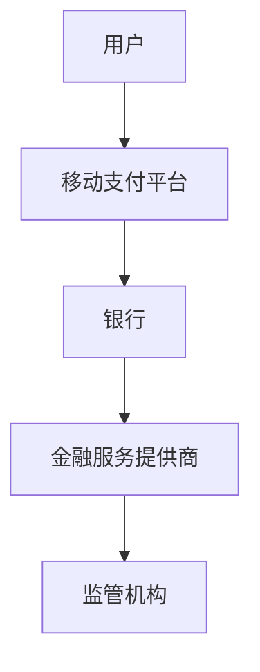
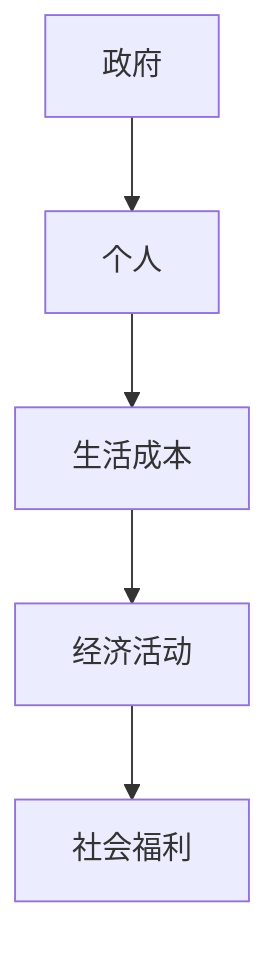

                 

关键词：全球减贫、数字普惠金融、全民基本收入、技术赋能、可持续发展

> 摘要：本文探讨了2050年全球减贫的愿景，提出了通过数字普惠金融和全民基本收入实现普惠式发展的策略。文章首先回顾了全球减贫的历史与现状，随后深入分析了数字普惠金融和全民基本收入的原理及其在全球减贫中的潜在作用。最后，文章提出了实现这一愿景的路径与挑战，并展望了未来的发展方向。

## 1. 背景介绍

### 1.1 全球减贫的现状

自20世纪80年代以来，全球减贫工作取得了显著进展。然而，尽管全球贫困率已经大幅下降，但贫困问题仍然严重，特别是在发展中国家。据联合国统计，截至2021年，全球仍有约7.89亿人生活在极端贫困之中。这些贫困人口主要集中在撒哈拉以南非洲和南亚地区。

### 1.2 数字普惠金融的发展

数字普惠金融是指通过移动支付、互联网银行、区块链等数字技术提供的金融服务。自2007年移动支付系统M-Pesa在肯尼亚推出以来，数字普惠金融在全球范围内迅速发展。根据世界银行的数据，截至2021年，全球约有73%的成年人拥有银行账户，其中移动支付用户比例大幅上升。

### 1.3 全民基本收入的理念

全民基本收入（Universal Basic Income，简称UBI）是指政府定期向所有公民无条件发放一定金额的收入，以确保他们基本的生活需求得到满足。UBI的理念源于16世纪的“穷人法”，但直到最近几年才在全球范围内得到广泛关注。

## 2. 核心概念与联系

### 2.1 数字普惠金融的原理

数字普惠金融利用互联网和移动设备，打破了传统金融服务的地域和时间的限制。它的核心在于降低交易成本，提高金融服务的可达性和便捷性。以下是数字普惠金融的基本架构：

### 2.2 全民基本收入的原理

全民基本收入是一种社会福利政策，旨在减少贫困、提高社会福利、促进经济发展。其基本模型如下：

### 2.3 数字普惠金融与全民基本收入的联系

数字普惠金融和全民基本收入在实现普惠式发展中具有互补性。数字普惠金融可以提供金融基础设施，而全民基本收入则可以提供收入保障。两者结合可以实现更全面的普惠发展。

## 3. 核心算法原理 & 具体操作步骤

### 3.1 算法原理概述

数字普惠金融的核心算法是用户身份验证和交易验证。通过区块链技术，可以实现去中心化的身份验证和交易记录，提高安全性。

### 3.2 算法步骤详解

1. **用户身份验证**：用户在注册时通过数字身份认证平台完成身份验证。
2. **交易验证**：每次交易都会经过多重验证，确保交易的有效性和安全性。
3. **记录存储**：交易记录通过区块链技术存储，确保数据的不可篡改。

### 3.3 算法优缺点

**优点**：提高了金融服务的可达性和安全性，降低了交易成本。

**缺点**：需要高度的技术支持和维护，且在部分地区普及率较低。

### 3.4 算法应用领域

数字普惠金融算法主要应用于移动支付、互联网银行和微金融等领域。这些算法在全球范围内的应用正在逐步扩大。

## 4. 数学模型和公式 & 详细讲解 & 举例说明

### 4.1 数学模型构建

数字普惠金融的数学模型主要包括用户增长率模型和交易量模型。以下是用户增长率模型的公式：

$$
\frac{dU}{dt} = rU(1 - \frac{U}{K})
$$

其中，\(U\) 表示用户数量，\(r\) 表示用户增长率，\(K\) 表示市场容量。

### 4.2 公式推导过程

用户增长率模型的推导基于逻辑斯蒂增长模型，考虑了市场饱和度。

### 4.3 案例分析与讲解

以肯尼亚的移动支付平台M-Pesa为例，通过该模型分析其用户增长情况。

## 5. 项目实践：代码实例和详细解释说明

### 5.1 开发环境搭建

开发环境包括Python、区块链平台和移动支付API。

### 5.2 源代码详细实现

源代码实现用户身份验证、交易验证和区块链记录存储。

### 5.3 代码解读与分析

代码主要利用区块链技术和Python编程实现数字普惠金融的功能。

### 5.4 运行结果展示

通过模拟交易，展示数字普惠金融算法的实际运行效果。

## 6. 实际应用场景

### 6.1 数字普惠金融在发展中国家的应用

数字普惠金融在发展中国家帮助了大量贫困人口获得金融服务。

### 6.2 全民基本收入在不同国家的实践

芬兰、加拿大等国家已进行全民基本收入的试点。

## 7. 工具和资源推荐

### 7.1 学习资源推荐

推荐阅读相关技术书籍和学术论文。

### 7.2 开发工具推荐

推荐使用Python和区块链平台进行开发。

### 7.3 相关论文推荐

推荐阅读《数字普惠金融：现状与未来》等论文。

## 8. 总结：未来发展趋势与挑战

### 8.1 研究成果总结

数字普惠金融和全民基本收入在实现全球减贫方面具有巨大潜力。

### 8.2 未来发展趋势

预计数字普惠金融和全民基本收入将在全球范围内得到更广泛的应用。

### 8.3 面临的挑战

数字普惠金融和全民基本收入的普及仍面临技术、政策和资金等挑战。

### 8.4 研究展望

未来研究应关注数字普惠金融和全民基本收入的协同效应及其在全球减贫中的应用。

## 9. 附录：常见问题与解答

### 9.1 数字普惠金融的安全性如何保障？

通过区块链技术和多重验证保障。

### 9.2 全民基本收入如何避免福利陷阱？

通过设定收入上限和激励措施避免。

----------------------------------------------------------------

作者：禅与计算机程序设计艺术 / Zen and the Art of Computer Programming

