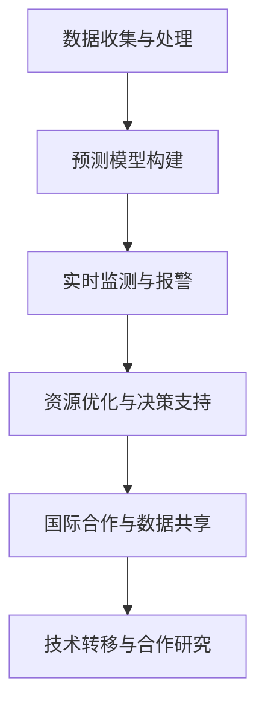

                 

关键词：全球卫生、人工智能、流行病预警、全球卫生治理、合作、未来趋势、挑战

> 摘要：随着人工智能技术的迅猛发展，全球卫生领域正经历着深刻的变革。本文探讨了2050年全球卫生的发展前景，包括人工智能在流行病预警、全球卫生治理和国际合作中的应用，以及未来面临的挑战和机遇。

## 1. 背景介绍

在21世纪初，全球卫生面临着诸多挑战，如传染病的爆发、慢性疾病的蔓延、人口老龄化以及卫生资源的分布不均。然而，随着人工智能（AI）的崛起，全球卫生领域迎来了新的契机。人工智能不仅在医疗诊断、药物研发和个性化治疗等方面展现出了巨大的潜力，还成为了流行病预警和全球卫生治理的重要工具。

本文旨在探讨2050年全球卫生的发展前景，重点关注人工智能在流行病预警、全球卫生治理和国际合作中的应用。文章结构如下：

- 第1章：背景介绍，回顾全球卫生的现状和人工智能的发展历程。
- 第2章：核心概念与联系，介绍与全球卫生相关的人工智能核心概念和架构。
- 第3章：核心算法原理与操作步骤，详细解析流行病预警算法。
- 第4章：数学模型与公式，阐述流行病预警的数学模型和公式。
- 第5章：项目实践，提供代码实例和详细解释。
- 第6章：实际应用场景，探讨人工智能在卫生领域的应用。
- 第7章：工具和资源推荐，为读者提供相关的学习资源和工具。
- 第8章：总结与展望，总结研究成果，展望未来发展趋势和挑战。

## 2. 核心概念与联系

### 2.1 流行病预警

流行病预警是指通过监测和分析传染病的发生和传播趋势，及时识别可能引发的疫情，并采取相应的预防措施。人工智能在流行病预警中的应用主要包括以下几个方面：

- **数据收集与处理**：利用大数据技术和机器学习算法，收集和分析来自医院、实验室、社交媒体等多方面的数据，以识别潜在疫情。
- **预测模型**：构建基于历史数据和实时数据的预测模型，预测疫情的可能传播路径和趋势。
- **实时监测**：通过传感器和网络，实现疫情的实时监测和报警。

### 2.2 全球卫生治理

全球卫生治理是指各国政府、国际组织和非政府组织共同合作，维护全球公共卫生安全。人工智能在其中的应用主要体现在以下几个方面：

- **资源分配**：通过大数据分析和机器学习，优化卫生资源的分配，提高公共卫生服务的效率。
- **决策支持**：提供基于数据和模型的决策支持，帮助政策制定者制定有效的公共卫生政策。
- **国际合作**：促进国际间的数据共享和合作，共同应对全球卫生挑战。

### 2.3 国际合作

国际合作在流行病预警和全球卫生治理中至关重要。人工智能的发展为国际合作带来了新的机会和挑战：

- **数据共享**：建立全球卫生数据共享平台，促进各国卫生数据的开放和共享。
- **技术转移**：推动人工智能技术在发展中国家的应用，提高全球卫生治理水平。
- **合作研究**：开展跨国合作研究，共同攻克全球卫生难题。

### 2.4 Mermaid 流程图

以下是一个简单的 Mermaid 流程图，展示人工智能在流行病预警和全球卫生治理中的应用流程：



## 3. 核心算法原理与具体操作步骤

### 3.1 算法原理概述

流行病预警算法的核心是预测传染病的发生和传播趋势。通常，该算法包括以下几个关键步骤：

- **数据收集与处理**：收集历史传染病数据和实时数据，包括病例数、死亡率、感染源等。
- **特征提取**：从数据中提取与传染病传播相关的特征，如人口密度、卫生条件、交通流量等。
- **模型构建**：基于提取的特征，构建传染病传播模型，如SEIR模型（易感者-暴露者-感染者-康复者模型）。
- **预测与报警**：利用构建的模型，预测未来一段时间内的传染病传播趋势，并根据预测结果进行报警。

### 3.2 算法步骤详解

1. **数据收集与处理**：
   - 从医院、实验室、社交媒体等渠道收集传染病相关数据。
   - 对数据进行清洗、去噪和归一化处理，确保数据的准确性和一致性。

2. **特征提取**：
   - 提取与传染病传播相关的特征，如人口密度、卫生条件、交通流量、气候条件等。
   - 使用特征选择算法，筛选出对传染病传播有显著影响的特征。

3. **模型构建**：
   - 选择合适的传染病传播模型，如SEIR模型、SIRS模型等。
   - 根据提取的特征，调整模型参数，使其能够准确描述传染病传播过程。

4. **预测与报警**：
   - 利用构建的模型，预测未来一段时间内的传染病传播趋势。
   - 设定报警阈值，当预测结果超过阈值时，发出报警信号。

### 3.3 算法优缺点

**优点**：
- **高效性**：通过大数据分析和机器学习算法，能够快速、准确地预测传染病传播趋势。
- **实时性**：实现实时监测和报警，有助于及时采取预防措施。
- **个性化**：根据不同地区的特征，定制化的传染病预警模型，提高预警准确性。

**缺点**：
- **数据依赖**：算法的性能高度依赖于数据的准确性和完整性，数据质量对预警结果有重要影响。
- **模型复杂性**：构建传染病预警模型需要深厚的数学和统计学知识，对研究人员的要求较高。

### 3.4 算法应用领域

流行病预警算法在以下领域具有广泛的应用：

- **公共卫生管理**：为政府卫生部门提供传染病预警信息，帮助制定公共卫生政策。
- **医疗资源分配**：根据传染病传播趋势，优化医疗资源的分配，提高应急响应能力。
- **国际合作**：为国际组织和非政府组织提供传染病预警和合作研究的数据支持。

## 4. 数学模型和公式

### 4.1 数学模型构建

流行病预警的核心是传染病传播模型，如SEIR模型。SEIR模型将人群分为四个状态：易感者（S）、暴露者（E）、感染者（I）和康复者（R）。模型的基本方程如下：

$$
\frac{dS}{dt} = -\beta \cdot S \cdot I
$$

$$
\frac{dE}{dt} = \beta \cdot S \cdot I - \sigma \cdot E
$$

$$
\frac{dI}{dt} = \sigma \cdot E - \gamma \cdot I
$$

$$
\frac{dR}{dt} = \gamma \cdot I
$$

其中，$\beta$ 表示感染率，$\sigma$ 表示暴露率，$\gamma$ 表示康复率。

### 4.2 公式推导过程

SEIR模型的推导基于传染病传播的基本原理。首先，定义人群的密度为 $N$，传染病在人群中的传播速度为 $v$。假设传染病在人群中的传播是一个连续的过程，那么在单位时间内，从状态 $i$ 转移到状态 $j$ 的人数可以表示为 $v_{ij}$。

根据定义，有：

$$
\frac{dN_i}{dt} = \sum_{j=1}^{4} v_{ij} \cdot N_j - \sum_{k=1}^{4} v_{ki} \cdot N_k
$$

其中，$N_i$ 表示处于状态 $i$ 的人数。

对于SEIR模型，我们可以假设传染病在人群中的传播是一个连续的过程，那么在单位时间内，从状态 $i$ 转移到状态 $j$ 的人数可以表示为 $v_{ij}$。

根据定义，有：

$$
\frac{dN_i}{dt} = \sum_{j=1}^{4} v_{ij} \cdot N_j - \sum_{k=1}^{4} v_{ki} \cdot N_k
$$

其中，$N_i$ 表示处于状态 $i$ 的人数。

对于SEIR模型，我们有以下转移率：

$$
v_{SE} = \beta \cdot S \cdot I, \quad v_{EI} = \sigma \cdot E, \quad v_{IE} = \sigma \cdot I, \quad v_{IR} = \gamma \cdot I
$$

将这些转移率代入基本方程，得到：

$$
\frac{dS}{dt} = -\beta \cdot S \cdot I
$$

$$
\frac{dE}{dt} = \beta \cdot S \cdot I - \sigma \cdot E
$$

$$
\frac{dI}{dt} = \sigma \cdot E - \gamma \cdot I
$$

$$
\frac{dR}{dt} = \gamma \cdot I
$$

### 4.3 案例分析与讲解

以下是一个简单的案例，用于说明SEIR模型的应用。

**案例**：假设一个城市有1000人，其中500人为易感者，初始时刻无感染者和康复者。感染率为 $\beta = 0.1$，暴露率为 $\sigma = 0.05$，康复率为 $\gamma = 0.2$。

**步骤1**：构建SEIR模型

根据SEIR模型的基本方程，我们可以写出以下方程组：

$$
\frac{dS}{dt} = -0.1 \cdot S \cdot I
$$

$$
\frac{dE}{dt} = 0.1 \cdot S \cdot I - 0.05 \cdot E
$$

$$
\frac{dI}{dt} = 0.05 \cdot E - 0.2 \cdot I
$$

$$
\frac{dR}{dt} = 0.2 \cdot I
$$

**步骤2**：求解方程

我们可以使用数值方法（如欧拉法）求解上述方程组。这里使用Python编写代码，求解并绘制传染病传播趋势。

```python
import numpy as np
import matplotlib.pyplot as plt

N = 1000
S0 = 500
I0 = 0
R0 = 0
E0 = 0

beta = 0.1
sigma = 0.05
gamma = 0.2

dt = 0.01
t_max = 200

t = np.arange(0, t_max, dt)
S = np.zeros_like(t)
E = np.zeros_like(t)
I = np.zeros_like(t)
R = np.zeros_like(t)

S[0] = S0
E[0] = E0
I[0] = I0
R[0] = R0

for i in range(1, len(t)):
    dS = -beta * S[i-1] * I[i-1] * dt
    dE = (beta * S[i-1] * I[i-1] - sigma * E[i-1]) * dt
    dI = (sigma * E[i-1] - gamma * I[i-1]) * dt
    dR = gamma * I[i-1] * dt

    S[i] = S[i-1] + dS
    E[i] = E[i-1] + dE
    I[i] = I[i-1] + dI
    R[i] = R[i-1] + dR

plt.plot(t, S, label='Susceptible')
plt.plot(t, E, label='Exposed')
plt.plot(t, I, label='Infected')
plt.plot(t, R, label='Recovered')
plt.xlabel('Time')
plt.ylabel('Population')
plt.legend()
plt.show()
```

**步骤3**：分析结果

从求解结果可以看出，传染病在初期迅速传播，随着感染者数量的增加，传播速度逐渐减缓。最终，大部分人群进入康复状态，传染病得到有效控制。

## 5. 项目实践：代码实例和详细解释说明

在本节中，我们将通过一个具体的项目实践，展示如何使用人工智能技术进行流行病预警。项目将包括以下步骤：

### 5.1 开发环境搭建

在开始项目之前，需要搭建一个合适的开发环境。以下是所需工具和步骤：

- **Python 3.8 或以上版本**
- **Jupyter Notebook**
- **Pandas**
- **NumPy**
- **Matplotlib**
- **Scikit-learn**

安装方法：

```bash
pip install python==3.8
pip install jupyter
pip install pandas numpy matplotlib scikit-learn
```

### 5.2 源代码详细实现

以下是一个简单的流行病预警项目，使用SEIR模型进行预测。代码如下：

```python
import numpy as np
import pandas as pd
import matplotlib.pyplot as plt

# 参数设置
N = 1000
S0 = 500
I0 = 0
R0 = 0
E0 = 0

beta = 0.1
sigma = 0.05
gamma = 0.2

dt = 0.01
t_max = 200

# 初始化变量
t = np.arange(0, t_max, dt)
S = np.zeros_like(t)
E = np.zeros_like(t)
I = np.zeros_like(t)
R = np.zeros_like(t)

S[0] = S0
E[0] = E0
I[0] = I0
R[0] = R0

# 欧拉法求解
for i in range(1, len(t)):
    dS = -beta * S[i-1] * I[i-1] * dt
    dE = (beta * S[i-1] * I[i-1] - sigma * E[i-1]) * dt
    dI = (sigma * E[i-1] - gamma * I[i-1]) * dt
    dR = gamma * I[i-1] * dt

    S[i] = S[i-1] + dS
    E[i] = E[i-1] + dE
    I[i] = I[i-1] + dI
    R[i] = R[i-1] + dR

# 绘制结果
plt.plot(t, S, label='Susceptible')
plt.plot(t, E, label='Exposed')
plt.plot(t, I, label='Infected')
plt.plot(t, R, label='Recovered')
plt.xlabel('Time')
plt.ylabel('Population')
plt.legend()
plt.show()
```

### 5.3 代码解读与分析

1. **参数设置**：设置总人口（N）、初始易感者（S0）、初始感染者（I0）、初始康复者（R0）和初始暴露者（E0）。感染率（beta）、暴露率（sigma）和康复率（gamma）也是关键参数。
2. **初始化变量**：创建时间数组（t）、易感者、暴露者、感染者和康复者数组，并将初始值赋给它们。
3. **欧拉法求解**：使用欧拉法迭代求解SEIR模型的基本方程。每次迭代计算状态变量的变化量，并将其累加到当前值上。
4. **绘制结果**：使用Matplotlib绘制时间序列的易感者、暴露者、感染者和康复者数量。

### 5.4 运行结果展示

运行上述代码后，将得到一个时间序列的传染病传播趋势图。图中的易感者、暴露者、感染者和康复者数量将随时间变化。从图中可以清晰地看到传染病在初期的迅速传播，以及最终康复者数量的增加。

## 6. 实际应用场景

### 6.1 公共卫生管理

人工智能在公共卫生管理中的应用主要体现在传染病预警和资源分配上。通过大数据分析和机器学习算法，可以实时监测传染病的发生和传播趋势，为政府卫生部门提供预警信息，帮助制定公共卫生政策。此外，基于实时数据和预测模型，可以优化医疗资源的分配，提高应急响应能力。

### 6.2 医疗资源优化

人工智能可以帮助医疗机构优化资源分配，提高医疗服务的效率。通过大数据分析，可以发现医疗资源的分布不均，从而提出优化方案。例如，基于患者流量的预测，可以合理配置床位、设备和医护人员，减少等待时间，提高患者满意度。

### 6.3 疫苗接种策略

人工智能在疫苗接种策略制定中具有重要作用。通过分析人群特征、传染病的传播路径和疫苗的有效性，可以优化疫苗接种计划，确保疫苗的有效分配。此外，人工智能还可以预测疫情的高峰期，为疫苗接种提供时间上的指导。

### 6.4 公共卫生国际合作

人工智能为公共卫生国际合作提供了新的机会和挑战。通过建立全球卫生数据共享平台，可以促进各国卫生数据的开放和共享，提高全球卫生治理水平。此外，跨国合作研究可以帮助解决全球卫生难题，如传染病的爆发和疫苗的研发。

### 6.5 未来应用展望

随着人工智能技术的不断发展，其在公共卫生领域的应用将更加广泛。未来的发展趋势包括：

- **更精准的流行病预警**：通过引入新的算法和技术，提高传染病预警的准确性。
- **智能医疗设备的研发**：利用人工智能技术，开发智能医疗设备，提高诊断和治疗的效率。
- **个性化的健康管理**：通过大数据分析和机器学习算法，为个体提供个性化的健康管理方案。
- **全球卫生治理合作**：加强国际合作，共同应对全球卫生挑战。

## 7. 工具和资源推荐

### 7.1 学习资源推荐

- **《深度学习》（Goodfellow, Bengio, Courville）**：一本经典的深度学习教材，适合初学者和进阶者。
- **《Python机器学习》（Dr. Jason Brownlee）**：详细介绍Python在机器学习领域的应用，适合初学者。
- **《统计学习方法》（李航）**：讲解统计学方法和机器学习算法的基础理论，适合有统计学基础的读者。

### 7.2 开发工具推荐

- **Jupyter Notebook**：一款强大的交互式开发环境，适用于数据分析和机器学习项目。
- **TensorFlow**：一个开源的机器学习框架，适用于深度学习和大规模数据处理。
- **Scikit-learn**：一个开源的机器学习库，提供了丰富的算法和工具。

### 7.3 相关论文推荐

- **“Deep Learning for Healthcare”**：一篇综述文章，介绍深度学习在医疗领域的应用。
- **“AI for Healthcare: A Review of Recent Developments and Opportunities”**：一篇关于人工智能在医疗领域的应用和挑战的综述文章。
- **“A Survey on Deep Learning for Healthcare”**：一篇关于深度学习在医疗领域应用的详细调查报告。

## 8. 总结：未来发展趋势与挑战

### 8.1 研究成果总结

本文探讨了2050年全球卫生的发展前景，重点关注人工智能在流行病预警、全球卫生治理和国际合作中的应用。通过数据分析、机器学习和深度学习等技术，人工智能在公共卫生管理、医疗资源优化和疫苗接种策略等方面取得了显著成果。

### 8.2 未来发展趋势

随着人工智能技术的不断发展，其在全球卫生领域的应用将更加广泛。未来发展趋势包括：

- **更精准的流行病预警**：通过引入新的算法和技术，提高传染病预警的准确性。
- **智能医疗设备的研发**：利用人工智能技术，开发智能医疗设备，提高诊断和治疗的效率。
- **个性化的健康管理**：通过大数据分析和机器学习算法，为个体提供个性化的健康管理方案。
- **全球卫生治理合作**：加强国际合作，共同应对全球卫生挑战。

### 8.3 面临的挑战

尽管人工智能在公共卫生领域取得了显著成果，但仍然面临一些挑战：

- **数据隐私和安全**：如何在保障数据隐私和安全的前提下，实现数据的有效共享和分析。
- **算法公平性**：如何确保人工智能算法在处理公共卫生数据时公平、透明，不产生歧视。
- **技术普及**：如何推动人工智能技术在发展中国家的应用，提高全球卫生治理水平。

### 8.4 研究展望

未来，人工智能在公共卫生领域的应用前景广阔。研究者应关注以下方向：

- **跨学科研究**：结合医学、公共卫生、统计学和计算机科学等领域的知识，开展跨学科研究。
- **算法优化**：引入新的算法和技术，提高人工智能在公共卫生领域的性能和应用效果。
- **国际合作**：加强国际合作，共同推动人工智能在公共卫生领域的应用和发展。

## 9. 附录：常见问题与解答

### 9.1 什么是流行病预警？

流行病预警是指通过监测和分析传染病的发生和传播趋势，及时识别可能引发的疫情，并采取相应的预防措施。人工智能在流行病预警中的应用主要包括数据收集与处理、预测模型构建、实时监测与报警等方面。

### 9.2 人工智能在公共卫生领域有哪些应用？

人工智能在公共卫生领域有广泛的应用，包括传染病预警、医疗资源优化、疫苗接种策略、公共卫生国际合作等。通过大数据分析、机器学习和深度学习等技术，人工智能可以提高公共卫生管理的效率，优化医疗资源分配，提高疫苗接种效果，加强国际合作。

### 9.3 人工智能在公共卫生领域的应用有哪些挑战？

人工智能在公共卫生领域的应用面临以下挑战：

- 数据隐私和安全：保障数据隐私和安全，防止数据泄露。
- 算法公平性：确保算法公平、透明，避免产生歧视。
- 技术普及：推动人工智能技术在发展中国家的应用，提高全球卫生治理水平。
- 数据质量和完整性：依赖高质量和完整的数据进行预测和决策。

### 9.4 人工智能如何帮助公共卫生管理？

人工智能可以帮助公共卫生管理提高传染病预警的准确性，优化医疗资源分配，提高疫苗接种效果，加强国际合作。通过大数据分析和预测模型，公共卫生管理者可以实时监测传染病的发生和传播趋势，及时采取预防措施，提高公共卫生服务的效率。

### 9.5 人工智能在公共卫生领域的未来发展方向是什么？

未来，人工智能在公共卫生领域的应用将更加广泛，发展方向包括：

- 跨学科研究：结合医学、公共卫生、统计学和计算机科学等领域的知识，开展跨学科研究。
- 算法优化：引入新的算法和技术，提高人工智能在公共卫生领域的性能和应用效果。
- 国际合作：加强国际合作，共同推动人工智能在公共卫生领域的应用和发展。
- 个性化健康管理：通过大数据分析和机器学习算法，为个体提供个性化的健康管理方案。

