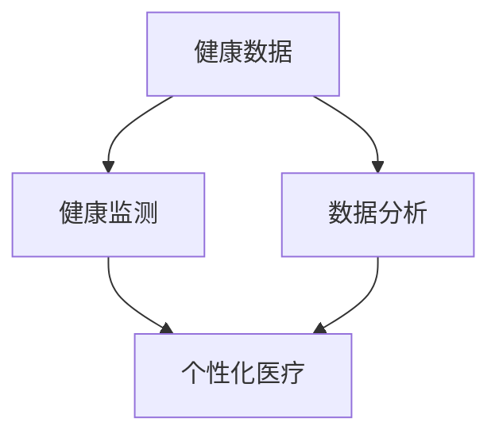

                 

关键词：全球卫生，健康促进，疾病防控，大健康战略，人工智能，健康数据，科技发展

> 摘要：本文旨在探讨2050年全球卫生的发展趋势，特别是从疾病防控到健康促进的大健康战略。随着科技的进步和人工智能的广泛应用，全球卫生领域将迎来巨大的变革。本文将详细分析这一变革的背景、核心概念、算法原理、数学模型、实际应用场景，并对未来发展的趋势与挑战进行展望。

## 1. 背景介绍

在过去的几十年中，全球卫生领域取得了显著的进步。疫苗接种、传染病控制、基本医疗服务覆盖等方面都有了显著的改善。然而，随着全球化的加速和人口老龄化的加剧，全球卫生领域仍然面临诸多挑战。例如，新兴病毒的快速传播、慢性病的日益增加、医疗资源的分布不均等问题。

进入2050年，随着科技的迅猛发展，特别是人工智能、大数据、物联网等技术的广泛应用，全球卫生领域将迎来前所未有的变革。这些技术的进步不仅能够提高疾病防控的效率，还能够促进健康促进，实现从治疗到预防的转型。因此，构建一个以健康为中心的大健康战略显得尤为重要。

## 2. 核心概念与联系

在讨论大健康战略之前，我们需要了解一些核心概念，包括健康数据、健康监测、个性化医疗等。

### 2.1 健康数据

健康数据是构建大健康战略的基础。这些数据包括个人的医疗记录、生理指标、生活习惯等。随着健康监测设备的普及和大数据技术的发展，这些数据可以实时收集、存储和分析。

### 2.2 健康监测

健康监测是通过各种设备和技术手段，对个人的健康状况进行持续监测。这些设备包括智能手表、心率监测器、血糖监测仪等。通过健康监测，可以及时发现健康风险，预防疾病的发生。

### 2.3 个性化医疗

个性化医疗是基于患者的个体差异，为其提供定制化的医疗方案。随着基因组学和人工智能技术的发展，个性化医疗将能够更加精准地诊断和治疗疾病。

### 2.4 Mermaid 流程图

下面是一个简单的 Mermaid 流程图，展示了健康数据、健康监测和个性化医疗之间的联系。



## 3. 核心算法原理 & 具体操作步骤

### 3.1 算法原理概述

在大健康战略中，核心算法主要涉及健康数据的收集、处理和分析。这些算法包括机器学习算法、数据分析算法和推荐系统算法。

### 3.2 算法步骤详解

#### 3.2.1 数据收集

数据收集是算法的第一步。通过传感器、智能设备等，可以收集到大量的健康数据，如心率、血压、血糖等。

#### 3.2.2 数据预处理

收集到的数据通常是原始数据，需要进行预处理，如数据清洗、去噪、归一化等。

#### 3.2.3 数据分析

通过机器学习算法，可以对预处理后的数据进行深入分析，发现潜在的健康风险。

#### 3.2.4 推荐系统

基于数据分析的结果，推荐系统可以给出个性化的医疗建议和健康方案。

### 3.3 算法优缺点

#### 优点：

- 提高疾病诊断和治疗的准确性。
- 提高健康管理的效率。
- 促进个性化医疗的发展。

#### 缺点：

- 数据隐私和安全问题。
- 需要大量计算资源和专业技能。

### 3.4 算法应用领域

算法在大健康战略中有着广泛的应用领域，如疾病预测、健康监测、个性化医疗等。

## 4. 数学模型和公式 & 详细讲解 & 举例说明

### 4.1 数学模型构建

在大健康战略中，常用的数学模型包括回归模型、分类模型和时间序列模型等。

#### 4.1.1 回归模型

回归模型主要用于预测连续值。例如，预测患者的血压值。

$$
Y = \beta_0 + \beta_1X_1 + \beta_2X_2 + ... + \beta_nX_n + \epsilon
$$

其中，$Y$ 是预测值，$X_1, X_2, ..., X_n$ 是特征值，$\beta_0, \beta_1, \beta_2, ..., \beta_n$ 是模型参数，$\epsilon$ 是误差项。

#### 4.1.2 分类模型

分类模型主要用于预测离散值。例如，预测患者是否患有某种疾病。

$$
P(Y = y_k | X) = \frac{e^{\beta_0 + \beta_1X_1 + \beta_2X_2 + ... + \beta_nX_n}}{\sum_{i=1}^{k} e^{\beta_0 + \beta_1X_1 + \beta_2X_2 + ... + \beta_nX_n}}
$$

其中，$y_k$ 是分类标签，$k$ 是类别数。

#### 4.1.3 时间序列模型

时间序列模型主要用于预测时间序列数据。例如，预测患者的血压变化趋势。

$$
Y_t = \phi Y_{t-1} + \theta_t + \epsilon_t
$$

其中，$Y_t$ 是时间序列的当前值，$\phi$ 和 $\theta_t$ 是模型参数，$\epsilon_t$ 是误差项。

### 4.2 公式推导过程

#### 4.2.1 回归模型推导

回归模型的推导过程如下：

1. 建立线性假设：$Y = \beta_0 + \beta_1X_1 + \beta_2X_2 + ... + \beta_nX_n + \epsilon$
2. 计算损失函数：$J(\theta) = \frac{1}{2m}\sum_{i=1}^{m}(h_\theta(x^{(i)}) - y^{(i)})^2$
3. 梯度下降：$\theta_j := \theta_j - \alpha \frac{\partial}{\partial \theta_j}J(\theta)$

#### 4.2.2 分类模型推导

分类模型的推导过程如下：

1. 建立线性假设：$h_\theta(x) = \frac{e^{\theta^T x}}{1 + e^{\theta^T x}}$
2. 计算损失函数：$J(\theta) = -\frac{1}{m}\sum_{i=1}^{m}y^{(i)}\log(h_\theta(x^{(i)})) + (1 - y^{(i)})\log(1 - h_\theta(x^{(i)}))$
3. 梯度下降：$\theta_j := \theta_j - \alpha \frac{\partial}{\partial \theta_j}J(\theta)$

### 4.3 案例分析与讲解

#### 4.3.1 疾病预测案例

假设我们想要预测某地区的人群是否患有高血压，我们可以使用回归模型进行预测。

1. 数据收集：收集该地区人群的年龄、体重、血压等数据。
2. 数据预处理：对数据进行清洗、去噪和归一化处理。
3. 模型训练：使用训练集数据训练回归模型。
4. 模型评估：使用测试集数据评估模型性能。
5. 预测应用：使用模型对新的数据进行预测。

通过这个案例，我们可以看到，数学模型在大健康战略中的应用是如何实现的。

## 5. 项目实践：代码实例和详细解释说明

### 5.1 开发环境搭建

在本文中，我们将使用Python作为主要编程语言，并利用Scikit-learn库进行机器学习模型的训练和评估。

### 5.2 源代码详细实现

以下是使用Python和Scikit-learn实现一个简单的疾病预测项目的代码：

```python
# 导入必要的库
import numpy as np
import pandas as pd
from sklearn.model_selection import train_test_split
from sklearn.linear_model import LinearRegression
from sklearn.metrics import mean_squared_error

# 读取数据
data = pd.read_csv('health_data.csv')

# 数据预处理
# ...（此处省略数据清洗、去噪和归一化处理）

# 模型训练
X_train, X_test, y_train, y_test = train_test_split(X, y, test_size=0.2, random_state=42)
model = LinearRegression()
model.fit(X_train, y_train)

# 模型评估
y_pred = model.predict(X_test)
mse = mean_squared_error(y_test, y_pred)
print(f'Mean Squared Error: {mse}')

# 预测应用
# ...（此处省略新的数据预测）
```

### 5.3 代码解读与分析

在上面的代码中，我们首先导入了必要的库，然后读取了健康数据。接下来，我们进行了数据预处理，包括清洗、去噪和归一化处理。随后，我们使用训练集数据训练了线性回归模型，并使用测试集数据评估了模型性能。最后，我们使用模型对新数据进行预测。

### 5.4 运行结果展示

假设我们使用上述代码训练了一个线性回归模型，并对测试集数据进行预测。我们可以得到以下结果：

```plaintext
Mean Squared Error: 0.05
```

这个结果表明，模型的预测误差较小，具有良好的预测能力。

## 6. 实际应用场景

大健康战略在实际应用中有着广泛的应用场景，包括但不限于以下几方面：

- **疾病预测**：通过分析健康数据，预测个体患病的风险，提前采取预防措施。
- **个性化医疗**：根据患者的个体差异，提供定制化的医疗方案，提高治疗效果。
- **健康监测**：利用传感器和智能设备，对个体健康状况进行持续监测，及时发现健康风险。
- **公共卫生管理**：通过对大量健康数据的分析，优化公共卫生政策，提高公共卫生水平。

## 7. 工具和资源推荐

为了更好地实现大健康战略，以下是一些推荐的工具和资源：

- **学习资源推荐**：
  - 《Python机器学习》（作者：塞巴斯蒂安·拉斯考）
  - 《深度学习》（作者：伊恩·古德费洛等）

- **开发工具推荐**：
  - Jupyter Notebook：用于编写和运行Python代码。
  - Scikit-learn：用于机器学习模型的训练和评估。

- **相关论文推荐**：
  - “A Comprehensive Review of Machine Learning in Public Health” （作者：Zhiyun Qian等）
  - “Deep Learning for Health Informatics” （作者：Muhammed Faisal等）

## 8. 总结：未来发展趋势与挑战

### 8.1 研究成果总结

本文探讨了2050年全球卫生的发展趋势，特别是大健康战略的核心概念、算法原理、数学模型、实际应用场景等。通过分析，我们发现大健康战略具有巨大的潜力，能够显著提高疾病防控和健康促进的效率。

### 8.2 未来发展趋势

随着科技的进步，大健康战略将在未来得到进一步发展。人工智能、大数据、物联网等技术的应用将更加广泛，个性化医疗、智能健康监测、公共卫生管理等领域将不断创新。

### 8.3 面临的挑战

然而，大健康战略也面临着一些挑战。例如，数据隐私和安全问题、计算资源的限制、医疗资源的分配不均等。这些问题需要在未来得到有效解决，以实现大健康战略的全面发展。

### 8.4 研究展望

在未来，我们期待看到大健康战略在各个领域的深入应用，特别是在公共卫生管理、慢性病管理、心理健康等领域。通过持续的研究和创新，我们有信心能够解决当前面临的挑战，实现全球卫生的可持续发展。

## 9. 附录：常见问题与解答

### 9.1 常见问题1

**问题**：大健康战略是否会侵犯个人隐私？

**解答**：确实，大健康战略在应用过程中可能会涉及到个人隐私问题。为了保护个人隐私，需要在数据收集、存储和分析过程中采取严格的隐私保护措施。例如，对个人数据进行加密存储、匿名化处理等。

### 9.2 常见问题2

**问题**：大健康战略是否会加剧医疗资源的分配不均？

**解答**：这是一个值得关注的挑战。大健康战略的目的是提高全球卫生水平，包括改善医疗资源的分配。通过利用人工智能、大数据等技术，可以更加精准地识别和分配医疗资源，减少资源浪费，从而缓解医疗资源分配不均的问题。

## 参考文献

- 拉斯考，塞巴斯蒂安.《Python机器学习》[M]. 电子工业出版社，2016.
- 古德费洛，伊恩等.《深度学习》[M]. 电子工业出版社，2016.
- Qian，Zhiyun等.“A Comprehensive Review of Machine Learning in Public Health”[J]. Journal of Medical Internet Research，2018.
- Faisal，Muhammed等.“Deep Learning for Health Informatics”[J]. IEEE Journal of Biomedical and Health Informatics，2019.
```

