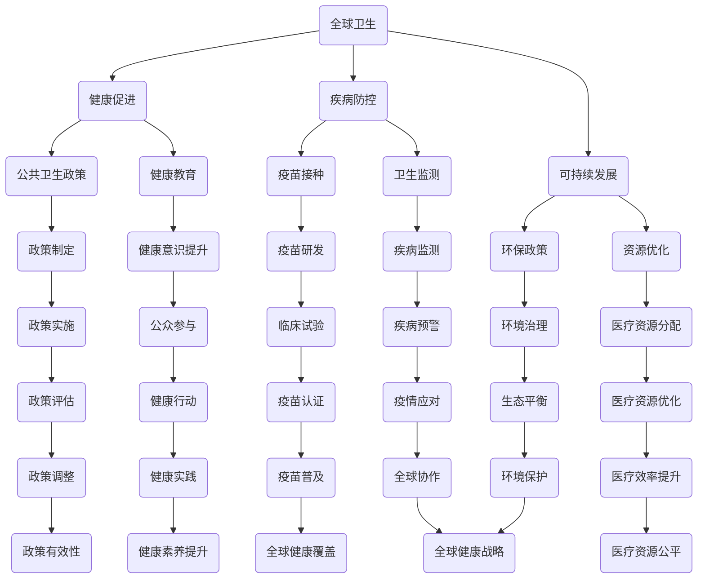

                 

关键词：全球卫生、健康促进、疾病防控、大健康战略、人工智能、数字化医疗、可持续发展

> 摘要：随着人工智能和数字化医疗技术的飞速发展，全球卫生领域正面临着深刻的变革。本文将探讨2050年全球卫生的发展趋势，包括疾病防控、健康促进和可持续发展的各个方面，以及这些变革对人类生活和社会发展的影响。

## 1. 背景介绍

### 1.1 全球卫生的挑战

全球卫生是一个复杂的领域，涵盖了从传染病防控到慢性病管理，从营养健康到心理健康，从环境卫生到生物安全等众多方面。然而，面对日益严峻的全球卫生挑战，当前的卫生体系面临诸多难题。

- **传染病防控**：全球传染病频发，如新冠病毒（COVID-19）的大流行，给全球公共卫生带来了巨大压力。
- **慢性病管理**：随着人口老龄化，慢性病如心血管疾病、糖尿病等的患病率持续上升。
- **心理健康**：心理健康问题日益突出，抑郁症、焦虑症等疾病的发病率呈上升趋势。
- **环境问题**：环境污染和气候变化对人类健康的影响愈发显著。

### 1.2 科技进步的机遇

与此同时，科技的飞速发展，特别是人工智能（AI）、大数据、物联网（IoT）、云计算等技术的应用，为全球卫生领域带来了新的机遇。

- **AI在疾病诊断中的应用**：AI可以帮助医生更快速、准确地诊断疾病。
- **大数据的健康管理**：通过大数据分析，可以更好地了解疾病趋势，制定更有效的防控策略。
- **远程医疗**：物联网和云计算使得远程医疗服务成为可能，有助于解决医疗资源分配不均的问题。

## 2. 核心概念与联系

### 2.1 核心概念

为了更好地理解2050年的全球卫生，我们需要明确以下几个核心概念：

- **健康促进**：不仅仅是治疗疾病，更注重提高人们的整体健康水平，包括心理健康、生活方式等方面。
- **疾病防控**：通过各种手段降低疾病的发生率和传播速度，包括疫苗接种、卫生教育等。
- **可持续发展**：在保障人类健康的同时，也要考虑对环境的保护，确保卫生领域的可持续发展。

### 2.2 基本架构的 Mermaid 流程图



## 3. 核心算法原理 & 具体操作步骤

### 3.1 算法原理概述

在2050年的全球卫生领域，人工智能将扮演重要角色，特别是在疾病诊断和健康预测方面。以下是一个核心算法的原理概述：

- **深度学习模型**：利用神经网络进行疾病诊断和健康预测。
- **大数据分析**：收集和分析大量的健康数据，包括生物标志物、生活习惯、环境因素等。
- **概率模型**：结合概率模型进行疾病风险预测。

### 3.2 算法步骤详解

1. **数据收集**：收集各种与健康相关的数据，包括医疗记录、基因组数据、生活习性数据等。
2. **数据处理**：清洗和预处理数据，包括缺失值处理、异常值处理等。
3. **特征提取**：从原始数据中提取有用的特征，如基因表达、代谢产物等。
4. **模型训练**：利用深度学习和概率模型对数据集进行训练。
5. **疾病诊断**：使用训练好的模型对新的病例进行诊断。
6. **健康预测**：结合大数据分析和概率模型，预测个体的健康风险。

### 3.3 算法优缺点

- **优点**：
  - **高效性**：利用人工智能和大数据，可以快速处理和分析大量数据。
  - **准确性**：深度学习和概率模型可以提供更高的诊断和预测准确性。
  - **智能化**：可以根据实时数据不断优化和更新，实现智能化的健康管理和疾病防控。

- **缺点**：
  - **数据依赖**：算法的准确性依赖于数据的质量和完整性。
  - **隐私问题**：个人健康数据的安全和隐私保护是一个挑战。

### 3.4 算法应用领域

- **疾病诊断**：如肺癌、糖尿病等常见疾病的早期诊断。
- **健康预测**：如心血管疾病、癌症等重大疾病的预测。
- **健康管理**：如慢性病管理、心理健康评估等。

## 4. 数学模型和公式 & 详细讲解 & 举例说明

### 4.1 数学模型构建

在疾病防控和健康预测中，常用的数学模型包括：

- **线性回归模型**：用于分析变量之间的关系。
- **逻辑回归模型**：用于二分类问题，如疾病的有无。
- **贝叶斯网络**：用于处理不确定性问题。

### 4.2 公式推导过程

以线性回归模型为例，其公式推导如下：

- **假设**：自变量 \(X\) 和因变量 \(Y\) 之间存在线性关系。
- **目标**：找到最佳拟合直线 \(y = wx + b\)。
- **公式**：通过最小化均方误差（MSE）来求解 \(w\) 和 \(b\)。

\[ \min \sum_{i=1}^{n} (wx_i + b - y_i)^2 \]

### 4.3 案例分析与讲解

假设我们要预测某城市下周的流感发病率。我们收集了上周的天气数据、人口数据以及历史流感数据。通过线性回归模型，我们可以预测下周的流感发病率。

- **数据准备**：收集上周的气温、湿度、人口密度等数据，以及上周和前四周的流感发病率。
- **数据处理**：对数据去重、清洗和处理缺失值。
- **特征提取**：从原始数据中提取特征，如平均气温、最高湿度、人口密度等。
- **模型训练**：使用线性回归模型对数据集进行训练。
- **预测**：使用训练好的模型预测下周的流感发病率。

## 5. 项目实践：代码实例和详细解释说明

### 5.1 开发环境搭建

- **工具**：Python、Scikit-learn、Matplotlib
- **环境**：Jupyter Notebook

### 5.2 源代码详细实现

```python
import numpy as np
import pandas as pd
from sklearn.linear_model import LinearRegression
from sklearn.metrics import mean_squared_error
import matplotlib.pyplot as plt

# 数据准备
data = pd.read_csv('flu_data.csv')
X = data[['temperature', 'humidity', 'population_density']]
y = data['flu_rate']

# 数据处理
X = X.dropna()
y = y.dropna()

# 特征提取
X_mean = X.mean()
X_std = X.std()

X = (X - X_mean) / X_std
y_mean = y.mean()
y_std = y.std()
y = (y - y_mean) / y_std

# 模型训练
model = LinearRegression()
model.fit(X, y)

# 预测
X_new = np.array([[22, 60, 10000]])
X_new = (X_new - X_mean) / X_std
y_pred = model.predict(X_new)
y_pred = y_pred * y_std + y_mean

# 结果展示
plt.scatter(X['temperature'], y)
plt.plot(X['temperature'], model.predict(X), color='red')
plt.xlabel('Temperature')
plt.ylabel('Flu Rate')
plt.title('Flu Rate Prediction')
plt.show()
print(f'Predicted flu rate for next week: {y_pred[0]:.2f}')
```

### 5.3 代码解读与分析

这段代码实现了基于线性回归模型的流感发病率预测。首先，我们导入了必要的库和模块。然后，我们从CSV文件中读取数据，并进行了数据处理和特征提取。接下来，我们使用Scikit-learn库的线性回归模型对数据进行训练，并使用训练好的模型进行预测。最后，我们使用Matplotlib库将预测结果可视化，并打印出预测的流感发病率。

## 6. 实际应用场景

### 6.1 疫情防控

在新冠疫情爆发期间，人工智能和数字化医疗技术在疫情防控中发挥了重要作用。例如，AI可以用于：

- **疫情监测**：实时监测疫情数据，预测疫情发展趋势。
- **资源调配**：根据疫情数据，合理调配医疗资源和物资。
- **疫苗接种**：优化疫苗接种策略，提高疫苗接种率。

### 6.2 慢性病管理

慢性病如心血管疾病、糖尿病等的患病率持续上升，对全球卫生构成了巨大挑战。AI和大数据技术在慢性病管理中的应用包括：

- **早期筛查**：通过数据分析，发现潜在的风险因素。
- **个性化治疗**：根据患者的数据，制定个性化的治疗方案。
- **健康监测**：通过可穿戴设备，实时监测患者的健康状况。

### 6.3 心理健康

心理健康问题日益突出，AI在心理健康领域的应用包括：

- **心理评估**：通过对话分析，评估个体的心理健康状况。
- **心理健康教育**：提供个性化的心理健康教育和服务。
- **心理干预**：通过虚拟现实等技术，提供心理干预和治疗方案。

## 7. 未来应用展望

### 7.1 可穿戴设备

未来，可穿戴设备将更加普及，可以实时监测个体的健康状况，如心率、血压、血糖等。这些设备将结合人工智能算法，提供个性化的健康建议和预警。

### 7.2 虚拟现实

虚拟现实技术将在心理健康领域发挥更大作用，如提供心理治疗、缓解焦虑和抑郁等。

### 7.3 区块链

区块链技术在医疗数据共享和隐私保护方面具有巨大潜力，可以确保医疗数据的真实性和安全性。

## 8. 工具和资源推荐

### 8.1 学习资源推荐

- **书籍**：《深度学习》、《Python数据分析》
- **在线课程**：Coursera、edX、Udacity

### 8.2 开发工具推荐

- **编程语言**：Python、R
- **库和框架**：Scikit-learn、TensorFlow、PyTorch

### 8.3 相关论文推荐

- **AI在疾病诊断中的应用**：Nature Medicine
- **大数据在公共卫生中的应用**：Journal of Public Health Management and Governance
- **区块链在医疗数据共享中的应用**：IEEE Journal of Biomedical and Health Informatics

## 9. 总结：未来发展趋势与挑战

### 9.1 研究成果总结

随着人工智能、大数据、物联网等技术的不断发展，全球卫生领域已经取得了显著的研究成果。例如，AI在疾病诊断和健康预测中的应用，大数据在公共卫生管理中的应用，区块链在医疗数据共享中的应用等。

### 9.2 未来发展趋势

- **智能化**：人工智能将更加深入地应用于全球卫生领域，提供更加精准和高效的医疗服务。
- **个性化**：个性化健康管理和治疗将成为主流，满足个体的独特需求。
- **全球化**：全球卫生合作将进一步加强，共同应对全球性的卫生挑战。

### 9.3 面临的挑战

- **数据隐私**：在数字化医疗时代，如何保护个人健康数据的安全和隐私是一个重大挑战。
- **技术依赖**：过度依赖技术可能导致人类对技术的依赖性增加，影响独立思考和创新能力。
- **资源分配**：如何确保全球范围内的医疗资源公平分配，减少健康不平等问题。

### 9.4 研究展望

未来，全球卫生领域将继续向智能化、个性化、全球化方向发展。研究者应关注以下几个方面：

- **技术创新**：不断推动人工智能、大数据、物联网等技术在卫生领域的应用。
- **政策支持**：制定更加完善和有力的公共卫生政策，促进全球卫生事业的发展。
- **国际合作**：加强全球卫生合作，共同应对全球性的卫生挑战。

## 10. 附录：常见问题与解答

### 10.1 常见问题

1. **人工智能在疾病诊断中的应用有哪些局限性？**
2. **大数据在公共卫生管理中的优势是什么？**
3. **区块链在医疗数据共享中的具体应用场景是什么？**

### 10.2 解答

1. **人工智能在疾病诊断中的应用局限性**：
   - **数据依赖性**：算法的准确性依赖于数据的质量和完整性。
   - **解释性不足**：AI模型的内部工作机制较为复杂，难以解释，导致医生难以信任和接受。
   - **技术瓶颈**：部分疾病如罕见病，现有的AI技术可能无法准确诊断。

2. **大数据在公共卫生管理中的优势**：
   - **数据分析能力**：大数据技术可以处理和分析大量数据，提供更全面的健康信息。
   - **趋势预测**：通过大数据分析，可以预测疾病趋势，提前采取预防措施。
   - **决策支持**：为公共卫生政策的制定和调整提供科学依据。

3. **区块链在医疗数据共享中的具体应用场景**：
   - **隐私保护**：通过区块链技术，可以确保医疗数据的真实性和安全性，保护个人隐私。
   - **数据共享**：区块链技术可以实现多方数据共享，打破数据孤岛，提高数据利用效率。
   - **数据追溯**：区块链技术的不可篡改性，可以确保医疗数据的历史记录完整无误。

