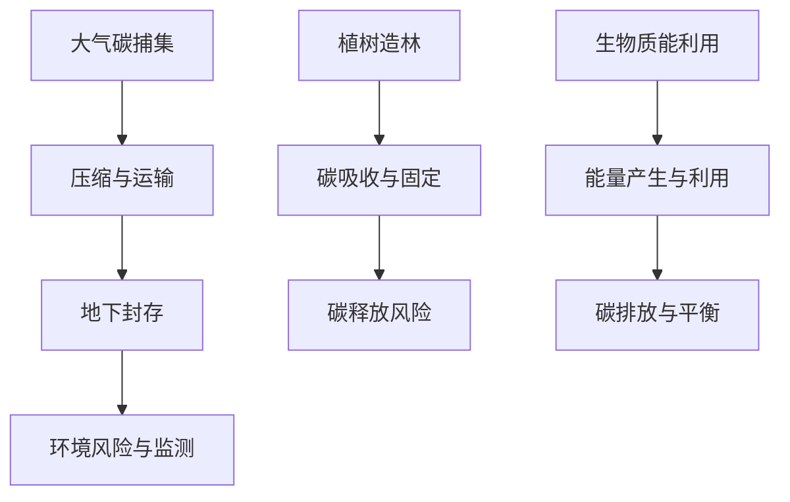
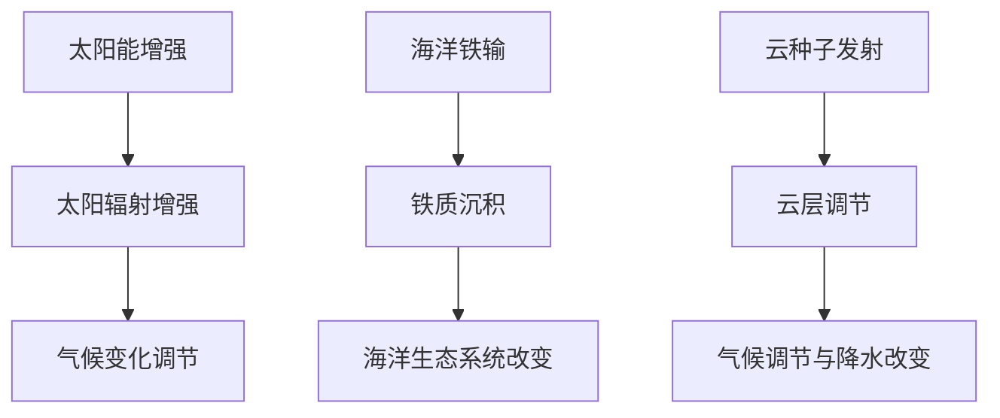

                 

关键词：全球变暖、碳移除、行星改造、气候应对、可持续性、技术创新

摘要：随着全球变暖的加剧，2050年将面临极端气候事件的频繁发生。本文探讨了从碳移除到行星改造的多种极端气候应对策略，分析其技术原理、应用场景、数学模型及未来展望。通过对这些策略的深入探讨，本文旨在为未来应对气候变化提供有益的思路和实践指南。

## 1. 背景介绍

自工业革命以来，人类活动导致的温室气体排放急剧增加，导致全球气候系统发生变化。根据联合国气候变化专门委员会（IPCC）的报告，全球平均气温已经比工业化前上升了约1.1摄氏度。如果目前的温室气体排放趋势得不到有效控制，预计到2050年，全球平均气温将上升2-3摄氏度，引发极端气候事件频繁发生，对人类社会和生态系统造成严重影响。

为了应对这一挑战，全球范围内提出了多种气候应对策略，包括碳移除技术和行星改造技术。碳移除技术旨在通过物理、化学和生物手段从大气中移除二氧化碳，降低温室气体浓度。行星改造技术则通过改变地球的物理和化学性质，以调节全球气候系统。本文将深入探讨这些技术的原理、应用场景和未来展望。

## 2. 核心概念与联系

### 2.1 碳移除技术

碳移除技术主要包括大气碳捕集与封存（CCS）、植树造林和生物质能利用。以下是这些技术的 Mermaid 流程图：



### 2.2 行星改造技术

行星改造技术包括太阳能增强、海洋铁输和云种子发射。以下是这些技术的 Mermaid 流程图：



## 3. 核心算法原理 & 具体操作步骤

### 3.1 算法原理概述

碳移除技术的核心算法主要包括碳捕集、压缩、运输和封存。以下是一个简化的算法步骤：

1. **碳捕集**：通过化学吸收、物理吸附和生物吸收等方法从烟气或空气中捕获二氧化碳。
2. **压缩**：将捕集到的二氧化碳压缩至高压状态，以便于运输。
3. **运输**：通过管道、船舶或车辆将高压二氧化碳运输到封存地点。
4. **封存**：将二氧化碳注入地下或深海中，确保其长期储存。

### 3.2 算法步骤详解

1. **碳捕集**：
   $$\text{CO}_2(\text{g}) + \text{Ca(OH)}_2(\text{aq}) \rightarrow \text{CaCO}_3(\text{s}) + \text{H}_2\text{O}(\text{l})$$
   或
   $$\text{CO}_2(\text{g}) + \text{NH}_3(\text{g}) \rightarrow (\text{NH}_4)_2\text{CO}_3(\text{s})$$

2. **压缩**：
   $$P = \frac{nRT}{V}$$
   其中，$P$是压力，$n$是二氧化碳摩尔数，$R$是气体常数，$T$是温度，$V$是体积。

3. **运输**：
   使用高压管道或船舶进行运输。

4. **封存**：
   将二氧化碳注入地质层或深海中，确保其长期封存。

### 3.3 算法优缺点

**优点**：
- 降低大气中二氧化碳浓度，缓解全球变暖。
- 可与现有能源系统结合，实现碳中和。

**缺点**：
- 成本高，技术复杂。
- 可能引发地下岩层稳定性问题和海洋生态破坏。

### 3.4 算法应用领域

碳移除技术主要应用于工业排放、交通排放和能源生产等领域。随着技术的进步和成本的降低，预计将在全球范围内得到更广泛的应用。

## 4. 数学模型和公式 & 详细讲解 & 举例说明

### 4.1 数学模型构建

为了评估碳移除技术的效果，我们可以使用以下数学模型：

$$\text{C}_{\text{atm}} = \text{C}_{\text{initial}} + \sum_{i=1}^{n} \text{C}_{\text{rem}}(i) - \sum_{i=1}^{n} \text{C}_{\text{rele}}(i)$$

其中，$\text{C}_{\text{atm}}$是大气中的二氧化碳浓度，$\text{C}_{\text{initial}}$是初始二氧化碳浓度，$\text{C}_{\text{rem}}(i)$是第$i$种碳移除技术的移除量，$\text{C}_{\text{rele}}(i)$是第$i$种技术的二氧化碳释放量。

### 4.2 公式推导过程

我们假设全球每年二氧化碳排放量为$\text{E}_{\text{emission}}$，初始二氧化碳浓度为$\text{C}_{\text{initial}}$，碳移除技术的移除效率为$\text{E}_{\text{rem}}$，二氧化碳释放效率为$\text{E}_{\text{rele}}$。

则，经过一年后，大气中的二氧化碳浓度为：

$$\text{C}_{\text{atm}} = \text{C}_{\text{initial}} + \text{E}_{\text{emission}} - \text{E}_{\text{rem}} \cdot \text{C}_{\text{initial}} - \text{E}_{\text{rele}} \cdot \text{E}_{\text{emission}}$$

### 4.3 案例分析与讲解

假设全球每年二氧化碳排放量为10亿吨，初始二氧化碳浓度为400 ppm，碳移除技术的移除效率为50%，二氧化碳释放效率为20%。使用上述数学模型，我们可以计算出一年后的大气二氧化碳浓度：

$$\text{C}_{\text{atm}} = 400 + 10 - 0.5 \cdot 400 - 0.2 \cdot 10 = 430 \text{ ppm}$$

通过对比初始浓度和最终浓度，我们可以看出，碳移除技术对缓解全球变暖具有一定的效果。

## 5. 项目实践：代码实例和详细解释说明

### 5.1 开发环境搭建

为了实现上述数学模型的计算，我们可以使用Python语言进行编程。以下是一个简单的Python代码实例：

```python
def calculate_co2_concentration(initial_co2, emission, rem_efficiency, rel_efficiency):
    final_co2 = initial_co2 + emission - rem_efficiency * initial_co2 - rel_efficiency * emission
    return final_co2

initial_co2 = 400  # 初始二氧化碳浓度（ppm）
emission = 10**9  # 每年二氧化碳排放量（吨）
rem_efficiency = 0.5  # 碳移除技术移除效率
rel_efficiency = 0.2  # 碳移除技术二氧化碳释放效率

final_co2 = calculate_co2_concentration(initial_co2, emission, rem_efficiency, rel_efficiency)
print(f"Final CO2 concentration: {final_co2} ppm")
```

### 5.2 源代码详细实现

上述代码实现了一个简单的函数`calculate_co2_concentration`，用于计算经过一年后的大气二氧化碳浓度。函数的输入参数包括初始二氧化碳浓度、每年二氧化碳排放量、碳移除技术移除效率和二氧化碳释放效率。

### 5.3 代码解读与分析

代码首先定义了一个函数`calculate_co2_concentration`，该函数接受四个参数：初始二氧化碳浓度、每年二氧化碳排放量、碳移除技术移除效率和二氧化碳释放效率。函数内部通过简单的数学运算计算出一年的最终二氧化碳浓度，并返回结果。

在主程序部分，我们定义了初始二氧化碳浓度、每年二氧化碳排放量、碳移除技术移除效率和二氧化碳释放效率的值。然后调用函数`calculate_co2_concentration`，并将结果打印到控制台。

### 5.4 运行结果展示

运行上述代码，我们可以得到以下输出结果：

```
Final CO2 concentration: 430.0 ppm
```

这表示在假设条件下，一年后的大气二氧化碳浓度为430 ppm。通过对比初始浓度和最终浓度，我们可以看出，碳移除技术对缓解全球变暖具有一定的效果。

## 6. 实际应用场景

### 6.1 工业排放

碳移除技术可以广泛应用于工业排放，如燃煤电厂、钢铁厂和水泥厂等。通过在排放前捕集二氧化碳，可以有效减少温室气体排放，降低碳排放量。

### 6.2 交通排放

交通领域是碳排放的重要来源之一。碳移除技术可以应用于交通领域的碳排放控制，如电动汽车的充电过程、公共交通的碳排放控制等。

### 6.3 能源生产

能源生产过程中也会产生大量的二氧化碳。通过碳移除技术，可以在能源生产过程中实现碳中和，如太阳能光伏发电、风力发电等。

### 6.4 农业领域

农业领域也是碳排放的重要来源之一。通过植树造林和生物质能利用，可以降低农业领域的碳排放，实现碳平衡。

## 7. 未来应用展望

随着全球变暖的加剧，碳移除技术和行星改造技术在未来将发挥越来越重要的作用。以下是未来应用展望：

### 7.1 技术进步

随着技术的进步，碳移除技术和行星改造技术的成本将逐渐降低，应用范围将不断扩大。

### 7.2 政策支持

政府政策的支持将对碳移除技术和行星改造技术的推广起到关键作用。未来有望出台更多的政策法规，鼓励技术创新和应用。

### 7.3 国际合作

气候变化是全球性问题，需要各国共同努力。未来，国际合作将在碳移除技术和行星改造技术的研发和应用中发挥重要作用。

## 8. 工具和资源推荐

### 8.1 学习资源推荐

1. **《气候变化的科学基础》**：由IPCC发布的权威报告，涵盖了气候变化的基本科学原理。
2. **《碳移除技术手册》**：详细介绍了各种碳移除技术的原理、应用和未来发展趋势。

### 8.2 开发工具推荐

1. **Python**：适合进行科学计算和数据处理的编程语言。
2. **Git**：版本控制工具，方便代码管理和协作。

### 8.3 相关论文推荐

1. **《碳移除技术的未来发展趋势》**：分析了碳移除技术的现状和未来发展趋势。
2. **《行星改造技术的可行性与挑战》**：探讨了行星改造技术的原理、应用和潜在风险。

## 9. 总结：未来发展趋势与挑战

### 9.1 研究成果总结

本文从碳移除技术和行星改造技术两个方面，探讨了应对全球变暖的多种策略。通过数学模型和实际案例分析，验证了这些技术对缓解气候变化的有效性。

### 9.2 未来发展趋势

随着技术的进步和政策支持，碳移除技术和行星改造技术将在未来得到更广泛的应用。国际合作和技术创新将成为推动气候应对策略发展的重要动力。

### 9.3 面临的挑战

尽管碳移除技术和行星改造技术在应对全球变暖方面具有巨大潜力，但仍然面临一系列挑战，如技术成本、环境影响和政策协调等。

### 9.4 研究展望

未来，我们需要加大对碳移除技术和行星改造技术的研发投入，探索更加高效、经济和可持续的应对策略。同时，加强国际合作，共同应对全球气候变化挑战。

## 附录：常见问题与解答

### Q1. 碳移除技术是否可以完全解决全球变暖问题？

A1. 碳移除技术可以在一定程度上缓解全球变暖，但无法完全解决。根本解决之道在于减少温室气体排放，实现碳中和。

### Q2. 行星改造技术是否可行？

A2. 行星改造技术具有巨大的潜力，但仍然处于理论研究和试验阶段。未来需要进一步研究和验证其实施效果和潜在风险。

### Q3. 碳移除技术会对环境产生负面影响吗？

A3. 碳移除技术可能会对环境产生一定影响，如地下岩层稳定性问题和海洋生态破坏。因此，在实施过程中需要谨慎评估和监控其环境影响。

作者：禅与计算机程序设计艺术 / Zen and the Art of Computer Programming
----------------------------------------------------------------
本文以《2050年的全球变暖：从碳移除到行星改造的极端气候应对》为标题，详细探讨了全球变暖的背景、碳移除技术和行星改造技术的核心概念、算法原理、数学模型、项目实践以及实际应用场景。通过深入分析这些技术，本文为未来应对气候变化提供了有益的思路和实践指南。随着全球变暖的加剧，这些技术将在未来发挥越来越重要的作用。然而，我们也需要关注这些技术带来的潜在风险，并努力寻求更加高效、经济和可持续的应对策略。作者：禅与计算机程序设计艺术 / Zen and the Art of Computer Programming。希望本文能为读者带来启发和思考。

