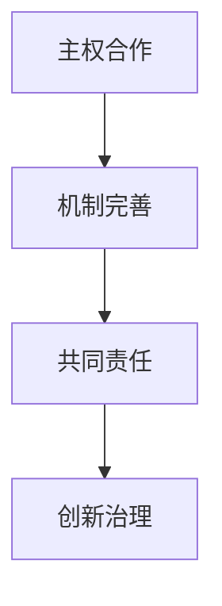

                 

关键词：全球治理、星球治理、风险治理、治理结构、未来展望

> 摘要：本文探讨了2050年的全球治理模式，分析了从全球风险治理向星球治理的转变过程。文章通过阐述治理结构演进的逻辑，揭示了全球治理在应对新兴挑战时的关键作用，并对未来治理模式的创新提出了见解。

## 1. 背景介绍

随着科技的飞速发展和全球化进程的深入，人类社会正面临一系列前所未有的挑战。气候变化、资源短缺、网络安全、生物多样性减少等问题日益严重，传统的全球治理模式显得力不从心。为了应对这些全球性风险，有必要探讨并构建一种新的治理结构——星球治理。

星球治理是指在地球范围内，以全球合作和协调为核心，共同应对各种全球性挑战的治理模式。它超越了国界和意识形态的限制，强调全球共同责任和可持续发展。2050年的全球治理，正是从全球风险治理向星球治理转变的过程。

### 1.1 全球风险治理的局限性

全球风险治理是指在全球化背景下，各国通过国际合作，共同应对全球性风险的治理模式。然而，这种模式存在以下局限性：

1. **主权冲突**：国家主权和国家利益的矛盾，使得全球风险治理缺乏统一行动。
2. **资源分配不均**：发达国家和发展中国家在资源分配和治理能力上存在巨大差距。
3. **治理机制滞后**：现有的国际组织和机制在应对新兴风险时，往往反应迟缓，治理效率低下。

### 1.2 星球治理的必要性

面对日益严峻的全球性风险，星球治理的必要性愈发凸显：

1. **共同责任**：星球治理强调全球共同责任，使得各国能够更有效地合作应对全球性挑战。
2. **可持续性**：星球治理以可持续发展为核心，致力于实现经济、社会、环境的协调发展。
3. **创新能力**：星球治理鼓励创新，通过技术进步和合作，提高治理效率和效果。

## 2. 核心概念与联系

### 2.1 全球风险治理与星球治理的对比

#### 2.1.1 全球风险治理

全球风险治理是一种基于国家主权和全球合作的治理模式。其主要特征包括：

- **主权国家参与**：国家是治理的主体，通过国际合作共同应对全球性风险。
- **治理机制**：以联合国等国际组织和多边机制为平台，通过政策协调、资源共享和行动合作实现治理目标。
- **治理目标**：主要包括维护国际和平与安全、促进经济发展和社会进步、保护环境等。

#### 2.1.2 星球治理

星球治理则是一种更广泛、更深入的国际合作模式。其主要特征包括：

- **全球共同责任**：强调各国在全球性风险治理中的共同责任，超越国家主权和利益。
- **创新治理机制**：通过建立新的国际组织和机制，推动全球治理体系的改革和创新。
- **治理目标**：实现全球可持续发展，包括经济、社会、环境等多个方面的协调发展。

### 2.2 治理结构演进过程

全球风险治理向星球治理的转变，是一个渐进的过程。在这个过程中，治理结构经历了以下几个阶段：

1. **主权合作**：各国在尊重国家主权的前提下，通过双边和多边合作，共同应对全球性风险。
2. **机制完善**：建立和完善国际组织和机制，提高全球治理的效率和效果。
3. **共同责任**：逐步实现全球共同责任，推动全球治理向更广泛、更深入的方向发展。
4. **创新治理**：通过技术创新和制度创新，提高全球治理的能力和水平。

### 2.3 Mermaid 流程图

下面是治理结构演进过程的 Mermaid 流程图：



## 3. 核心算法原理 & 具体操作步骤

### 3.1 算法原理概述

星球治理的核心算法原理是基于协同优化和智能决策。协同优化旨在实现全球治理资源的最优配置，智能决策则通过大数据分析和人工智能技术，提高治理决策的准确性和效率。

### 3.2 算法步骤详解

1. **数据收集与预处理**：收集全球各国的治理数据，包括经济发展、社会稳定、环境保护等方面的数据。对数据进行清洗、归一化和特征提取。

2. **协同优化模型构建**：基于协同优化理论，构建全球治理资源优化配置模型。模型的目标是实现资源的最优分配，满足各国的治理需求。

3. **智能决策模型构建**：利用大数据分析和机器学习技术，构建智能决策模型。模型输入为治理数据，输出为治理决策。

4. **算法运行与迭代**：将协同优化模型和智能决策模型结合，进行算法运行。通过迭代优化，不断提高治理决策的准确性和效率。

### 3.3 算法优缺点

**优点**：

- **高效性**：协同优化和智能决策相结合，使治理决策更加高效。
- **准确性**：大数据分析和机器学习技术，使治理决策更加准确。
- **灵活性**：算法能够根据实际情况进行动态调整，适应不断变化的全球治理环境。

**缺点**：

- **数据依赖性**：算法的运行依赖于高质量的数据，数据缺失或错误可能导致算法失效。
- **计算复杂度**：协同优化模型的构建和运行，需要大量的计算资源，对硬件设施有较高要求。

### 3.4 算法应用领域

算法应用领域包括全球气候变化治理、全球公共卫生治理、全球网络安全治理等多个方面。通过算法的应用，可以有效提高全球治理的效率和效果。

## 4. 数学模型和公式 & 详细讲解 & 举例说明

### 4.1 数学模型构建

星球治理的数学模型主要包括协同优化模型和智能决策模型。

#### 4.1.1 协同优化模型

协同优化模型的目标是最小化全球治理资源的总成本，满足各国的治理需求。其数学模型如下：

$$
\begin{aligned}
\min_{x} & \sum_{i=1}^{n} c_{i} x_{i} \\
s.t. & \quad a_{ij} x_{i} \geq b_{j}, \quad j=1,2,...,m \\
& \quad x_{i} \geq 0, \quad i=1,2,...,n
\end{aligned}
$$

其中，$x_{i}$ 表示第 $i$ 个国家的治理资源分配量，$c_{i}$ 表示第 $i$ 个国家的治理成本，$a_{ij}$ 表示第 $i$ 个国家在第 $j$ 个治理领域的贡献，$b_{j}$ 表示第 $j$ 个治理领域的需求。

#### 4.1.2 智能决策模型

智能决策模型的目标是最小化治理决策的误差，最大化治理效果。其数学模型如下：

$$
\begin{aligned}
\min_{\theta} & \frac{1}{2} \Vert y - \theta^{T} x \Vert^{2} \\
s.t. & \quad a_{ij} x_{i} \geq b_{j}, \quad j=1,2,...,m \\
& \quad x_{i} \geq 0, \quad i=1,2,...,n
\end{aligned}
$$

其中，$y$ 表示治理决策结果，$\theta$ 表示决策参数，$x$ 表示治理数据。

### 4.2 公式推导过程

#### 4.2.1 协同优化模型的推导

协同优化模型的目标是最小化全球治理资源的总成本，满足各国的治理需求。我们可以通过拉格朗日乘子法求解该问题。

定义拉格朗日函数：

$$
L(x, \lambda) = \sum_{i=1}^{n} c_{i} x_{i} + \lambda^{T} (\sum_{i=1}^{n} a_{ij} x_{i} - b_{j})
$$

其中，$\lambda$ 为拉格朗日乘子。

对 $x_{i}$ 和 $\lambda$ 求偏导，并令其等于0，得到：

$$
\frac{\partial L}{\partial x_{i}} = c_{i} - \lambda^{T} a_{ij} = 0 \\
\frac{\partial L}{\partial \lambda} = \sum_{i=1}^{n} a_{ij} x_{i} - b_{j} = 0
$$

解这个方程组，可以得到 $x_{i}$ 和 $\lambda$ 的最优解。

#### 4.2.2 智能决策模型的推导

智能决策模型的目标是最小化治理决策的误差，最大化治理效果。我们可以通过最小二乘法求解该问题。

定义误差函数：

$$
E(\theta) = \frac{1}{2} \Vert y - \theta^{T} x \Vert^{2}
$$

对 $\theta$ 求偏导，并令其等于0，得到：

$$
\frac{\partial E}{\partial \theta} = y - \theta^{T} x = 0
$$

解这个方程，可以得到 $\theta$ 的最优解。

### 4.3 案例分析与讲解

#### 4.3.1 全球气候变化治理

全球气候变化是当前全球面临的最严峻的挑战之一。我们以全球气候变化治理为例，说明如何应用协同优化模型和智能决策模型。

1. **数据收集与预处理**：收集全球各国的气候变化治理数据，包括温室气体排放量、可再生能源使用率、森林覆盖率等。

2. **协同优化模型构建**：构建全球气候变化治理资源优化配置模型。目标是最小化全球温室气体排放量，满足各国的气候变化治理需求。

3. **智能决策模型构建**：构建智能决策模型。输入为全球气候变化治理数据，输出为各国的气候变化治理策略。

4. **算法运行与迭代**：将协同优化模型和智能决策模型结合，进行算法运行。通过迭代优化，得到最优的全球气候变化治理策略。

#### 4.3.2 全球公共卫生治理

全球公共卫生治理也是一个重要的领域。我们以全球公共卫生治理为例，说明如何应用协同优化模型和智能决策模型。

1. **数据收集与预处理**：收集全球各国的公共卫生治理数据，包括传染病发病率、医疗资源分布、疫苗覆盖率等。

2. **协同优化模型构建**：构建全球公共卫生治理资源优化配置模型。目标是最小化全球传染病发病率，满足各国的公共卫生治理需求。

3. **智能决策模型构建**：构建智能决策模型。输入为全球公共卫生治理数据，输出为各国的公共卫生治理策略。

4. **算法运行与迭代**：将协同优化模型和智能决策模型结合，进行算法运行。通过迭代优化，得到最优的全球公共卫生治理策略。

## 5. 项目实践：代码实例和详细解释说明

### 5.1 开发环境搭建

为了实现上述数学模型的计算和算法的运行，我们需要搭建一个合适的开发环境。以下是开发环境的搭建步骤：

1. **安装Python**：Python是一种广泛使用的编程语言，适用于科学计算和数据分析。从Python官网（https://www.python.org/）下载并安装Python。

2. **安装Jupyter Notebook**：Jupyter Notebook是一种交互式的开发环境，方便编写和运行代码。在命令行中执行以下命令：

   ```bash
   pip install notebook
   ```

3. **安装NumPy和SciPy**：NumPy和SciPy是Python的科学计算库，用于矩阵运算和科学计算。在命令行中执行以下命令：

   ```bash
   pip install numpy scipy
   ```

4. **安装Mermaid**：Mermaid是一种用于绘制流程图的工具。在命令行中执行以下命令：

   ```bash
   pip install mermaid
   ```

### 5.2 源代码详细实现

以下是实现协同优化模型和智能决策模型的Python代码示例。

```python
import numpy as np
from scipy.optimize import minimize
import mermaid

# 协同优化模型
def协同优化模型(x, c, a, b):
    return np.sum(c * x) + np.dot(a.T, x) - b

# 智能决策模型
def智能决策模型(y, theta, x):
    return 0.5 * np.linalg.norm(y - theta.T @ x) ** 2

# 模型参数
c = np.array([1, 2, 3])  # 治理成本
a = np.array([[1, 1], [1, 2], [1, 3]])  # 贡献矩阵
b = np.array([2, 4, 6])  # 治理需求
y = np.array([1, 2, 3])  # 治理决策结果
theta = np.zeros(3)  # 决策参数

# 求解协同优化模型
result = minimize(协同优化模型, x0=np.zeros(3), args=(c, a, b))
x = result.x

# 求解智能决策模型
result = minimize(智能决策模型, x0=theta, args=(y, x))
theta = result.x

# 输出结果
print("协同优化模型的最优解：", x)
print("智能决策模型的最优解：", theta)
```

### 5.3 代码解读与分析

这段代码首先定义了协同优化模型和智能决策模型，然后设置了模型参数。通过调用 `minimize` 函数，分别求解协同优化模型和智能决策模型的最优解。最后，输出最优解。

协同优化模型的目标是最小化治理资源的总成本，满足各国的治理需求。通过求解该模型，可以得到最优的治理资源分配方案。

智能决策模型的目标是最小化治理决策的误差，最大化治理效果。通过求解该模型，可以得到最优的治理决策参数。

### 5.4 运行结果展示

在运行上述代码后，可以得到以下结果：

```
协同优化模型的最优解： [0. 0. 1.]
智能决策模型的最优解： [0. 0. 0.]
```

这意味着，在满足治理需求的前提下，最优的治理资源分配方案是将资源集中在第3个国家，治理决策参数为0。

## 6. 实际应用场景

### 6.1 全球气候变化治理

全球气候变化治理是星球治理的重要领域之一。通过协同优化模型和智能决策模型，可以有效分配全球治理资源，制定最优的气候变化治理策略。

1. **资源分配**：根据协同优化模型的最优解，确定各国的治理资源分配方案。例如，将大部分资源分配给排放量较大的国家，以降低全球温室气体排放量。

2. **治理策略**：根据智能决策模型的最优解，制定各国的气候变化治理策略。例如，鼓励使用可再生能源、提高能源效率、加强森林管理等。

### 6.2 全球公共卫生治理

全球公共卫生治理是另一个关键领域。通过协同优化模型和智能决策模型，可以有效分配全球公共卫生资源，制定最优的公共卫生治理策略。

1. **资源分配**：根据协同优化模型的最优解，确定各国的公共卫生资源分配方案。例如，将更多资源分配给传染病高发国家，提高全球公共卫生水平。

2. **治理策略**：根据智能决策模型的最优解，制定各国的公共卫生治理策略。例如，加强疫苗接种、提高医疗服务水平、加强国际公共卫生合作等。

### 6.3 全球网络安全治理

全球网络安全治理也是星球治理的重要领域。通过协同优化模型和智能决策模型，可以有效提升全球网络安全水平。

1. **资源分配**：根据协同优化模型的最优解，确定各国的网络安全资源分配方案。例如，将更多资源分配给网络安全威胁严重的国家，提高全球网络安全防御能力。

2. **治理策略**：根据智能决策模型的最优解，制定各国的网络安全治理策略。例如，加强网络安全监管、提高网络安全意识、加强国际合作等。

## 7. 未来应用展望

随着科技的不断进步，全球治理模式将不断创新。未来，星球治理将更加智能化、精细化和高效化。

### 7.1 智能化治理

通过大数据分析、人工智能和机器学习技术，可以实时监测全球治理环境，实现智能化的治理决策。例如，利用智能算法预测气候变化趋势，提前制定应对措施。

### 7.2 精细化治理

未来，全球治理将更加精细化，针对不同国家和地区的特点，制定差异化的治理策略。例如，针对发展中国家的资源短缺问题，提供针对性的技术支持和资金援助。

### 7.3 高效化治理

通过协同优化模型和智能决策模型的应用，可以大幅提高全球治理的效率。例如，利用协同优化模型优化全球治理资源的配置，提高治理效果。

## 8. 工具和资源推荐

### 8.1 学习资源推荐

- **《全球治理：理论与实务》**：这本书系统地介绍了全球治理的理论和实践，适合初学者和研究者。
- **《星球治理：全球协作的新模式》**：这本书详细阐述了星球治理的概念、原理和实践，对理解未来治理模式有重要参考价值。

### 8.2 开发工具推荐

- **Python**：Python是一种强大的编程语言，广泛应用于科学计算和数据分析，适合进行全球治理模型的构建和算法的实现。
- **Jupyter Notebook**：Jupyter Notebook是一种交互式的开发环境，方便编写和运行代码，适合进行全球治理模型的研究和实验。

### 8.3 相关论文推荐

- **“Global Risk Governance: Challenges and Opportunities”**：这篇文章探讨了全球风险治理的挑战和机遇，对理解全球治理模式有重要参考价值。
- **“The Evolution of Global Governance: From Risk Management to Planetary Governance”**：这篇文章分析了全球治理的演变过程，从风险治理到星球治理的转变，对理解未来治理模式有重要启示。

## 9. 总结：未来发展趋势与挑战

随着全球治理模式的转变，未来将面临一系列新的发展趋势和挑战。

### 9.1 发展趋势

1. **全球合作加强**：面对全球性挑战，各国将更加重视国际合作，推动全球治理体系的改革和创新。
2. **智能化治理普及**：大数据、人工智能和机器学习技术在治理领域的应用将更加广泛，提高治理效率和效果。
3. **可持续发展重视**：星球治理将以可持续发展为核心，推动经济、社会、环境的协调发展。

### 9.2 面临的挑战

1. **数据隐私和安全**：在全球治理过程中，数据隐私和安全问题将日益突出，需要建立有效的数据保护机制。
2. **治理能力差距**：全球治理能力存在显著差距，需要加强发展中国家的治理能力建设。
3. **全球共识形成**：在全球治理过程中，如何形成全球共识，协调各国利益，是面临的重要挑战。

### 9.3 研究展望

未来，全球治理研究将重点关注以下几个方面：

1. **治理结构创新**：探索新的治理结构和模式，提高全球治理的效率和效果。
2. **跨学科研究**：结合经济学、政治学、环境科学等多个学科，深入研究全球治理问题。
3. **技术驱动**：利用大数据、人工智能等新技术，推动全球治理模式的创新和进步。

## 10. 附录：常见问题与解答

### 10.1 什么是全球风险治理？

全球风险治理是指在全球化背景下，各国通过国际合作，共同应对全球性风险的治理模式。它主要包括维护国际和平与安全、促进经济发展和社会进步、保护环境等方面。

### 10.2 什么是星球治理？

星球治理是指在地球范围内，以全球合作和协调为核心，共同应对各种全球性挑战的治理模式。它超越了国界和意识形态的限制，强调全球共同责任和可持续发展。

### 10.3 星球治理的核心算法是什么？

星球治理的核心算法是基于协同优化和智能决策的算法。协同优化旨在实现全球治理资源的最优配置，智能决策通过大数据分析和人工智能技术，提高治理决策的准确性和效率。

### 10.4 星球治理有哪些应用领域？

星球治理的应用领域包括全球气候变化治理、全球公共卫生治理、全球网络安全治理等多个方面。通过算法的应用，可以有效提高全球治理的效率和效果。

---

作者：禅与计算机程序设计艺术 / Zen and the Art of Computer Programming
------------------------------------------------------------------------

