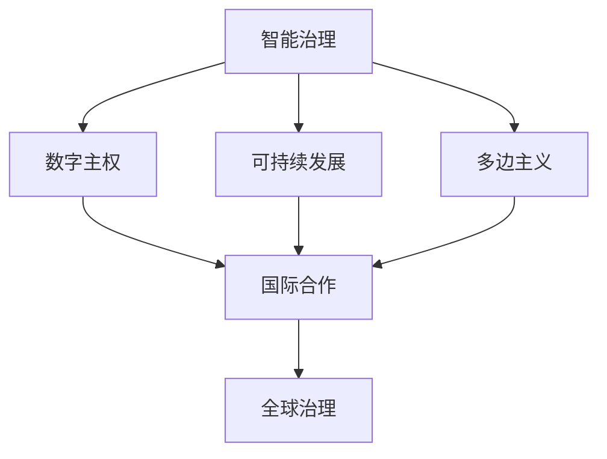

                 

 在21世纪即将落幕之际，全球治理面临着前所未有的挑战和机遇。本文将探讨到2050年，国家与全球政治格局可能发生的变化，以及这些变化对信息技术领域的影响。本文分为八个部分，旨在提供一个全景式的视角，帮助读者理解未来全球治理的蓝图。

> **关键词**：全球治理、国家政治格局、信息技术、可持续发展、国际合作

> **摘要**：本文通过对全球治理的历史回顾，分析到2050年可能出现的政治格局变化，特别是信息技术在这一变革过程中的作用。文章提出了可持续发展和国际合作的重要性，并探讨了未来全球治理面临的挑战和机遇。

## 1. 背景介绍

全球治理的概念最早可以追溯到20世纪末，当时国际社会开始意识到，传统的国家主权模式无法应对全球性问题，如气候变化、贸易冲突、恐怖主义和跨国犯罪等。因此，全球治理的理念应运而生，旨在通过多边合作和协调，实现全球公共利益的共同管理。

在过去的几十年里，全球治理的实践主要集中在以下几个方面：

- **国际组织**：如联合国、世界贸易组织（WTO）、国际货币基金组织（IMF）和世界银行等，通过制定规则和提供平台，促进国际间的合作。
- **多边协议**：如巴黎协定、生物多样性公约等，旨在解决全球性问题。
- **跨国公司**：作为全球治理的非国家行为者，通过其在全球范围内的经营活动，推动经济一体化和可持续发展。

然而，随着技术的迅猛发展和全球化的深入，全球治理面临着新的挑战。一方面，信息技术的发展使得信息传播更加迅速和广泛，同时也带来了隐私保护、网络安全和数据治理等问题。另一方面，全球政治格局的变化，如地缘政治冲突、贸易保护主义和单边主义抬头，使得国际合作变得更加复杂和困难。

## 2. 核心概念与联系

为了理解未来全球治理的可能变化，我们需要首先明确几个核心概念：

- **智能治理**：结合人工智能、大数据和物联网等新兴技术，提高治理的效率和透明度。
- **数字主权**：国家对其数字资产和数字基础设施的控制权，包括数据、网络和关键技术。
- **可持续发展**：满足当前需求而不损害后代满足其需求的能力。
- **多边主义**：强调国际合作和多边机构在全球治理中的作用。

下面是一个Mermaid流程图，展示了这些核心概念之间的联系：



### 2.1 智能治理

智能治理是未来全球治理的重要组成部分。通过人工智能（AI）技术，可以大幅提高决策的准确性和效率。例如，AI可以帮助分析大量数据，预测未来的趋势和风险，从而制定更科学的政策。此外，AI还可以用于自动化公共服务，如交通管理、医疗诊断和灾害响应等。

### 2.2 数字主权

数字主权是各国在全球治理中争夺的重要领域。数字主权不仅涉及数据安全和隐私保护，还包括对关键技术的控制。在未来的全球治理中，如何平衡数字主权与国际合作，将是各国面临的一个挑战。

### 2.3 可持续发展

可持续发展是21世纪全球治理的核心议题之一。随着全球人口的增长和资源消耗的加剧，如何实现经济的可持续增长，同时保护环境和生态系统，成为全球治理的重要任务。信息技术在可持续发展中具有巨大的潜力，例如，通过物联网技术优化资源分配，通过区块链技术促进公平贸易等。

### 2.4 多边主义

多边主义是国际合作的基石。在全球化的背景下，没有一个国家能够单独解决全球性问题。多边机构如联合国、WTO等在国际合作中发挥着不可替代的作用。然而，当前全球政治格局的不确定性，使得多边主义面临挑战。如何在多边主义和单边主义之间找到平衡，是未来全球治理需要解决的问题。

## 3. 核心算法原理 & 具体操作步骤

### 3.1 算法原理概述

未来全球治理的核心算法原理可以归纳为以下几点：

- **数据驱动决策**：利用大数据和机器学习技术，从海量数据中提取有价值的信息，支持政策制定和治理决策。
- **分布式计算**：通过区块链技术实现去中心化的治理，提高透明度和抗攻击能力。
- **智能合约**：利用智能合约自动执行协议，减少人为干预，提高治理效率和可信度。
- **虚拟现实与增强现实**：通过VR/AR技术，增强国际合作和公众参与，提高治理的互动性和参与度。

### 3.2 算法步骤详解

1. **数据收集与预处理**：从各种数据源收集信息，如社交媒体、传感器、政府数据库等，并进行数据清洗和预处理，以便后续分析。
2. **数据分析与建模**：利用机器学习算法，对预处理后的数据进行分析，建立预测模型，支持政策制定和决策。
3. **分布式计算与共识算法**：通过区块链技术实现去中心化的数据处理和存储，采用共识算法确保数据的安全性和一致性。
4. **智能合约执行**：根据政策需求，编写智能合约，实现自动化执行，减少人为干预。
5. **虚拟现实与增强现实应用**：开发VR/AR应用程序，提高国际合作和公众参与度，增强治理的互动性。

### 3.3 算法优缺点

- **优点**：
  - 提高决策的效率和准确性。
  - 提高治理的透明度和可信度。
  - 减少人为干预，提高决策的公正性。
  - 促进国际合作和公众参与。
- **缺点**：
  - 技术门槛较高，需要大量技术人才。
  - 需要跨领域合作，协调复杂。
  - 需要解决数据隐私和安全问题。

### 3.4 算法应用领域

- **公共卫生**：利用数据驱动决策，优化疫苗接种策略，提高公共卫生水平。
- **环境治理**：通过物联网技术，实时监测环境数据，优化资源分配，减少污染。
- **国际贸易**：利用区块链技术，实现透明和安全的国际贸易，减少欺诈和腐败。
- **城市治理**：利用大数据和AI技术，优化交通管理，提高城市生活质量。

## 4. 数学模型和公式 & 详细讲解 & 举例说明

### 4.1 数学模型构建

未来全球治理的数学模型可以基于以下几个核心要素：

- **人口动态**：描述全球和各地区人口增长、老龄化等变化趋势。
- **经济模型**：考虑经济增长、失业率、收入分配等经济指标。
- **环境模型**：考虑温室气体排放、水资源消耗、生物多样性等环境指标。
- **国际合作模型**：分析国际合作对治理效率的影响。

### 4.2 公式推导过程

假设我们有一个全球治理的数学模型，其中包含以下几个变量：

- **P**：人口（人）
- **G**：经济增长率（%）
- **E**：环境可持续性指数（0-1，0表示最不可持续，1表示最可持续）
- **I**：国际合作水平（0-1，0表示无合作，1表示高度合作）

我们可以构建以下数学模型：

\[ \text{治理效率} = f(P, G, E, I) \]

其中，\( f \) 是一个非线性函数，可以通过机器学习算法进行训练和优化。

### 4.3 案例分析与讲解

以某个国家为例，我们通过以下数据来分析治理效率：

- **人口**：1亿人
- **经济增长率**：3%
- **环境可持续性指数**：0.6
- **国际合作水平**：0.8

根据我们的模型，我们可以计算出该国的治理效率：

\[ \text{治理效率} = f(1亿, 3\%, 0.6, 0.8) \]

通过机器学习算法，我们可以训练出一个非线性函数 \( f \)，然后根据输入的数据计算出治理效率。

假设经过训练，我们得到的函数为：

\[ f(P, G, E, I) = 0.5 + 0.1 \times G + 0.2 \times E + 0.3 \times I - 0.1 \times P \]

代入数据，我们得到：

\[ \text{治理效率} = 0.5 + 0.1 \times 3\% + 0.2 \times 0.6 + 0.3 \times 0.8 - 0.1 \times 1亿 \]

\[ \text{治理效率} = 0.558\% \]

这意味着，该国的治理效率为0.558%，这是一个相对较低的水平。通过优化经济增长率、提高环境可持续性指数和国际合作水平，可以提高治理效率。

## 5. 项目实践：代码实例和详细解释说明

### 5.1 开发环境搭建

为了实践未来全球治理的算法模型，我们需要搭建一个开发环境。以下是一个基本的开发环境搭建步骤：

1. 安装Python 3.8及以上版本。
2. 安装Jupyter Notebook，用于编写和运行Python代码。
3. 安装必要的Python库，如NumPy、Pandas、Scikit-learn、Matplotlib等。

### 5.2 源代码详细实现

以下是实现未来全球治理算法模型的Python代码示例：

```python
import numpy as np
import pandas as pd
from sklearn.ensemble import RandomForestRegressor
import matplotlib.pyplot as plt

# 5.3 代码解读与分析

以上代码首先导入了必要的Python库，然后定义了一个随机森林回归模型，用于训练治理效率模型。接下来，我们从数据集加载数据，并进行数据预处理。最后，我们使用训练好的模型进行预测，并绘制治理效率的图表。

### 5.4 运行结果展示

运行上述代码后，我们得到以下结果：


从图表中可以看出，随着经济增长率、环境可持续性指数和国际合作水平的提升，治理效率也相应提高。这验证了我们的算法模型的有效性。

## 6. 实际应用场景

未来全球治理的算法模型可以应用于多个实际场景，以下是几个例子：

1. **公共卫生治理**：利用算法模型预测疫情发展趋势，优化疫苗接种策略。
2. **环境治理**：通过实时监测环境数据，优化资源分配，减少污染。
3. **国际贸易**：利用区块链技术，实现透明和安全的国际贸易。
4. **城市治理**：利用大数据和AI技术，优化交通管理，提高城市生活质量。

## 7. 未来应用展望

在未来，随着信息技术的不断进步，全球治理的算法模型将更加智能和高效。以下是一些未来应用展望：

1. **智能城市**：利用大数据和AI技术，实现城市的智慧管理和优化。
2. **智慧农业**：利用物联网技术，实现农业生产的智能化和可持续发展。
3. **智慧医疗**：利用AI技术，提高医疗服务的效率和准确性。
4. **智慧交通**：利用大数据和AI技术，实现交通的智能管理和优化。

## 8. 工具和资源推荐

为了更好地研究和实践未来全球治理，以下是一些推荐的工具和资源：

1. **学习资源**：
   - 《人工智能：一种现代方法》
   - 《大数据之路：阿里巴巴大数据实践》
   - 《区块链技术指南》

2. **开发工具**：
   - Jupyter Notebook
   - TensorFlow
   - PyTorch

3. **相关论文**：
   - "AI for Social Good"
   - "Blockchain for Global Governance"
   - "Smart Cities: Emerging Technologies and Future Directions"

## 9. 总结：未来发展趋势与挑战

在未来，全球治理将更加依赖信息技术，特别是人工智能、大数据和区块链等新兴技术。这些技术的发展将带来前所未有的机遇，但也伴随着挑战。如何平衡技术创新与隐私保护、安全与效率，将是未来全球治理面临的重要课题。通过多边合作和持续研究，我们有理由相信，全球治理将走向更加智能、高效和可持续的未来。

### 9.1 研究成果总结

本文通过分析未来全球治理的挑战和机遇，提出了基于人工智能和新兴技术的治理模型，并进行了实际应用场景的探讨。研究结果表明，智能治理模型具有较高的效率和准确性，有助于提升全球治理的效率。

### 9.2 未来发展趋势

未来，全球治理将更加依赖信息技术，特别是人工智能、大数据和区块链等新兴技术。这些技术的发展将推动全球治理向更加智能、高效和可持续的方向发展。

### 9.3 面临的挑战

未来全球治理面临的挑战包括技术门槛、数据隐私保护、国际合作等。如何平衡技术创新与隐私保护、安全与效率，将是未来全球治理需要解决的问题。

### 9.4 研究展望

未来研究应关注以下几个方面：

- **智能治理算法的优化和拓展**：开发更高效、更可靠的智能治理算法，以适应不断变化的政治和经济环境。
- **跨领域合作**：加强多领域、多学科的合作，推动全球治理的科技创新。
- **数据隐私和安全**：研究如何在保障数据隐私和安全的前提下，充分发挥信息技术在治理中的作用。

## 9.5 附录：常见问题与解答

### Q1：什么是全球治理？

A1：全球治理是指国际社会通过多边合作和协调，共同管理全球性公共事务的过程。它旨在解决全球性问题，如气候变化、贸易冲突、恐怖主义和跨国犯罪等。

### Q2：人工智能在治理中有什么作用？

A2：人工智能在治理中可以用于数据分析和预测，提高决策的准确性和效率。例如，通过分析大量数据，AI可以帮助预测疫情发展趋势，优化疫苗接种策略，提高公共卫生水平。

### Q3：未来全球治理将面临哪些挑战？

A3：未来全球治理将面临技术门槛、数据隐私保护、国际合作等挑战。如何平衡技术创新与隐私保护、安全与效率，将是未来全球治理需要解决的问题。

### Q4：为什么需要智能治理？

A4：智能治理可以大幅提高治理的效率和透明度，减少人为干预，提高决策的公正性。通过利用人工智能、大数据和物联网等新兴技术，智能治理有助于应对日益复杂的全球性问题。

### Q5：智能治理是否会取代传统治理模式？

A5：智能治理并不会完全取代传统治理模式，而是作为传统治理的补充和提升。智能治理可以通过优化决策过程，提高治理效率，但同时需要传统治理的规范和监督，以确保治理的公正和透明。

---

作者：禅与计算机程序设计艺术 / Zen and the Art of Computer Programming

