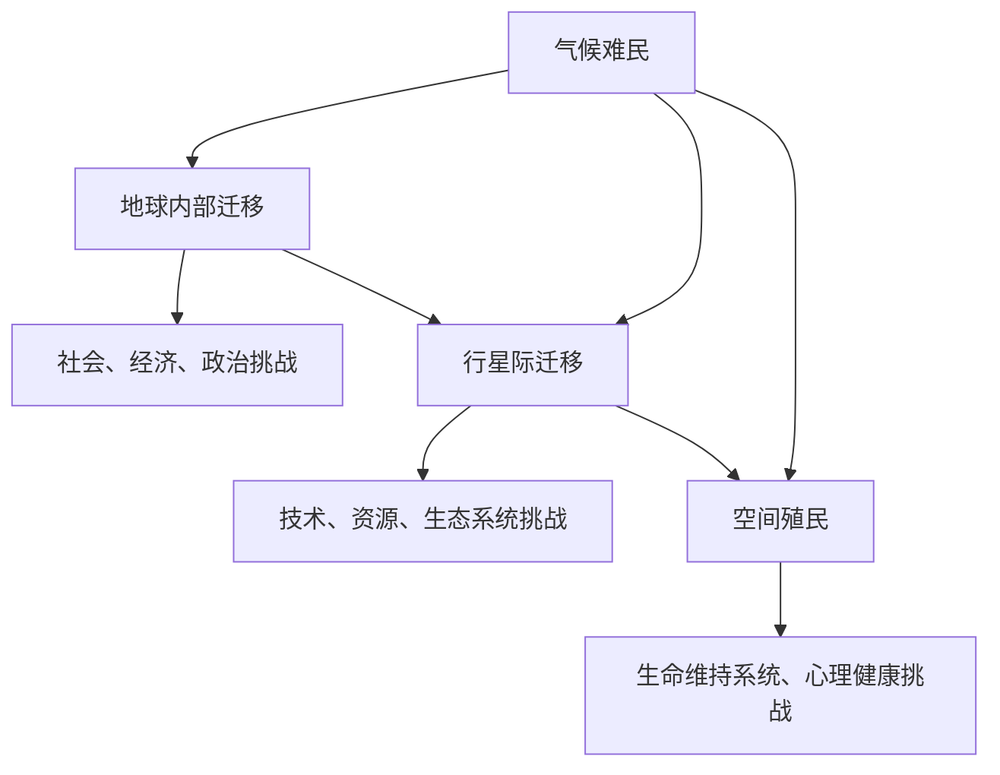

                 

### 摘要 Abstract

在2050年，全球气候变化将带来前所未有的挑战，导致大规模的自然灾害和生态环境恶化，迫使数百万人成为气候难民。本文探讨了未来全球移民的趋势，从传统的气候难民到未来的星际移民，人类将如何寻找新的家园。文章首先回顾了当前全球气候变化带来的影响，然后分析了未来移民的可能性，包括地球内部的迁移、行星际迁移和空间殖民。本文还讨论了这些迁移所需的技术基础、政治和社会挑战，以及人类在探索新家园过程中的道德和伦理问题。最后，文章提出了对未来移民发展的趋势展望，并讨论了全球社会面临的挑战。

### 1. 背景介绍 Background

全球气候变化已成为21世纪最紧迫的挑战之一。根据联合国气候变化专门委员会（IPCC）的报告，自20世纪末以来，全球平均气温已上升约1.2摄氏度。预计到本世纪末，如果温室气体排放不受控制，全球气温将上升1.5至2摄氏度，甚至更高。这一升温趋势将引发一系列严重的气候灾害，包括极端天气事件、海平面上升、干旱、洪水和生态系统崩溃。

气候变化的直接后果之一是大规模的自然灾害。例如，2017年的厄尔尼诺现象导致了全球范围内的极端天气，从美国德克萨斯州的干旱到肯尼亚的洪水，这些灾害迫使数百万人逃离家园，成为气候难民。根据国际红十字会的数据，仅在2015年至2019年间，就有超过1.2亿人因气候变化相关灾害被迫流离失所。

气候变化还导致了生态系统的破坏，许多物种正面临灭绝的威胁。珊瑚礁的退化和冰盖的消融，以及森林的砍伐和沙漠化，都使地球上的许多地区变得不适宜居住。人类活动对环境的破坏进一步加剧了这些问题，使得许多人不得不离开他们的家园，寻找新的生存之地。

此外，气候变化也对全球粮食安全造成了威胁。全球变暖导致农作物生长季节的变化、降水模式的改变和土壤肥力的下降，这些都可能引发全球性的粮食危机。随着人口的增长和城市化进程的加速，对粮食的需求不断上升，这进一步加剧了全球粮食供应的紧张局势。

面对这些严峻的挑战，全球社会必须采取措施应对气候变化，减轻其带来的影响。同时，我们也需要思考如何在未来为那些被迫离开家园的人们提供新的家园。本文将探讨从传统的气候难民到未来的星际移民，人类如何寻找新的生存空间。

### 2. 核心概念与联系 Core Concepts and Connections

在探讨未来全球移民的趋势时，我们首先需要了解几个核心概念，这些概念不仅相互关联，而且对未来的移民模式具有重要影响。以下是这些核心概念及其相互关系：

#### 2.1 气候难民 Climate Refugees

气候难民是指因气候变化导致的自然灾害、海平面上升、干旱、洪水等环境问题而被迫离开家园的人群。根据联合国的定义，气候难民与政治难民不同，他们不是因为战争、迫害或政治原因而离开，而是因为环境因素。气候难民的数量在全球范围内不断上升，预计到本世纪末将达到数亿人。

#### 2.2 地球内部迁移 Internal Migration within Earth

地球内部迁移是指人们在地球上寻找新的居住地的过程。这种迁移可能是由于气候变化导致的生态环境恶化，也可能是由于资源短缺、经济问题或政治动荡。与传统的国际移民不同，地球内部迁移通常涉及在同一个国家或地区内的人口流动。例如，从干旱的农村地区迁移到城市地区，或者从低洼沿海地区迁移到内陆高地。

#### 2.3 行星际迁移 Interplanetary Migration

行星际迁移是指人类离开地球，前往其他行星或天体居住的过程。这一概念源于科幻文学，但近年来随着技术的进步，开始逐渐变得现实。行星际迁移可能涉及载人或载货航天器，以及在地外行星或卫星上建立永久居住基地。目前，火星和月球的殖民被认为是行星际迁移的最早目标。

#### 2.4 空间殖民 Space Colonization

空间殖民是指人类在太空中建立永久居住基地的过程。空间殖民不仅包括在地球轨道上的空间站和太空平台，还包括在其他行星或卫星上的基地建设。空间殖民的关键挑战包括资源供应、生态系统建立、生命维持系统和人类心理健康等。

这些概念之间的相互联系如下：

- **气候难民**：气候难民是地球内部迁移的初始动力。由于气候变化导致的生态环境恶化，许多人被迫离开家园，这可能导致大规模的人口流动。
- **地球内部迁移**：地球内部迁移可能成为解决气候难民问题的短期解决方案，但也可能导致社会、经济和政治的挑战。长期而言，地球内部迁移可能促使人类探索行星际迁移。
- **行星际迁移**：行星际迁移是解决长期气候难民问题的可能途径。通过在火星、月球或其他天体上建立基地，人类可以获得新的生存空间。
- **空间殖民**：空间殖民是实现行星际迁移的基础。只有建立了稳定的空间殖民体系，人类才能在其他行星或天体上建立永久居住地。

为了更好地理解这些概念，我们可以使用Mermaid流程图来展示它们之间的联系：



通过这个流程图，我们可以清晰地看到不同概念之间的相互影响和可能的演变路径。理解这些核心概念及其联系，对于制定有效的全球移民战略具有重要意义。

### 3. 核心算法原理 & 具体操作步骤 Core Algorithm Principles & Detailed Steps

在探讨未来移民问题的过程中，核心算法原理和技术操作步骤的研究至关重要。以下是关于未来移民策略的核心算法原理及其具体操作步骤的详细说明。

#### 3.1 算法原理概述

核心算法原理主要围绕资源分配、人口迁移路径优化和环境可持续性展开。该算法旨在为全球移民提供高效的解决方案，同时考虑社会、经济和环境等多方面的因素。

- **资源分配算法**：该算法通过优化资源分配，确保不同地区的资源需求得到满足，从而为移民提供必要的支持。这包括能源、水资源、食物和住房等关键资源。
- **人口迁移路径优化算法**：该算法利用地理信息系统（GIS）和人工智能技术，分析不同地区的环境、经济和社会状况，为移民提供最佳迁移路径。该路径应最大限度地减少迁移过程中的困难和风险。
- **环境可持续性算法**：该算法通过监测和评估移民对当地环境的影响，确保移民过程不会加剧环境问题。这包括减少温室气体排放、保护生物多样性以及维护生态平衡。

#### 3.2 算法步骤详解

以下是核心算法的具体操作步骤：

1. **数据收集与预处理**：
   - 收集全球各地的气候、环境、经济和社会数据。
   - 对数据进行分析和预处理，确保数据的准确性和一致性。

2. **资源需求分析**：
   - 根据移民人数和需求，预测各类资源的需求量。
   - 分析现有资源供应情况，评估供需平衡。

3. **人口迁移路径优化**：
   - 利用GIS和人工智能技术，分析不同地区的环境、经济和社会状况。
   - 建立迁移路径模型，考虑迁移过程中的风险和成本。
   - 优化迁移路径，确保最佳人口流动方向。

4. **环境可持续性评估**：
   - 对迁移过程中可能产生的环境影响进行评估。
   - 制定环保措施，减少迁移对环境的负面影响。
   - 监测和评估迁移对当地生态系统的影响。

5. **资源分配与政策建议**：
   - 根据资源需求和分析结果，制定资源分配方案。
   - 提出相关政策建议，确保移民过程顺利进行。

6. **算法验证与迭代**：
   - 对算法进行验证，确保其有效性和可靠性。
   - 根据实际情况和反馈，不断优化和迭代算法。

#### 3.3 算法优缺点

该核心算法具有以下优缺点：

- **优点**：
  - 高效性：通过优化资源分配和人口迁移路径，提高移民过程的效率。
  - 可持续性：考虑环境因素，确保移民过程不会加剧环境问题。
  - 适应性：算法能够根据实际情况和需求进行调整和优化。

- **缺点**：
  - 数据依赖性：算法的性能依赖于数据的质量和准确性。
  - 技术挑战：实施算法需要先进的技术支持，如GIS和人工智能。
  - 社会挑战：算法可能无法完全解决社会、经济和政治问题。

#### 3.4 算法应用领域

该核心算法主要应用于以下领域：

- **全球移民政策制定**：为政府提供科学依据，制定合理的移民政策。
- **灾害应急响应**：在自然灾害和气候变化导致的人口流动时，提供有效的应对措施。
- **环境保护**：评估移民对环境的影响，制定环保措施，保护生态系统。

通过该核心算法的应用，我们可以更好地应对未来全球移民挑战，为人类寻找新的家园提供科学支持。

### 3.4 算法应用领域 Algorithm Applications

核心算法不仅在理论研究方面具有重要意义，而且在实际应用中展示了广泛的前景。以下是该算法在几个关键领域的具体应用：

#### 3.4.1 全球移民政策制定

在全球移民政策的制定中，核心算法可以提供重要的科学依据。通过分析不同地区的气候、环境、经济和社会状况，算法可以帮助政府了解移民的潜在影响，从而制定更加合理和可持续的移民政策。例如，在面临气候变化导致的大规模人口流动时，政府可以利用算法预测移民趋势，优化移民路径，确保移民过程不会对社会和经济产生过度压力。

#### 3.4.2 灾害应急响应

在自然灾害和气候变化导致的紧急情况下，核心算法可以提供有效的应对措施。通过实时分析灾害影响范围和人口流动情况，算法可以帮助应急管理部门制定紧急疏散计划和救援方案。例如，在洪水、地震或台风等灾害发生后，算法可以快速识别受影响的地区和人口，优化疏散路线，确保救援物资和人员的有效配置。

#### 3.4.3 环境保护

核心算法在环境保护方面也具有重要作用。通过评估移民对环境的影响，算法可以帮助制定环境保护措施，减少移民过程对生态系统的负面影响。例如，在规划新的居住区时，算法可以分析不同地区的生态敏感性，选择对环境影响最小的地点。此外，算法还可以监测移民过程中的温室气体排放，提出减排措施，以减少全球变暖的影响。

#### 3.4.4 资源管理

在资源管理方面，核心算法可以帮助优化资源的分配和使用。通过预测资源需求和分析供需平衡，算法可以帮助政府和机构制定有效的资源管理策略，确保移民过程中各类资源（如能源、水资源、食物和住房）的充足供应。例如，在干旱或资源短缺的地区，算法可以优化灌溉和水资源利用，提高资源利用效率。

#### 3.4.5 社会管理

核心算法还可以在社会管理方面发挥重要作用。通过分析人口流动和社会结构的变化，算法可以帮助政府和社会机构更好地了解社会动态，制定相应的社会政策。例如，在应对人口老龄化和城市化进程时，算法可以提供人口分布和需求预测，帮助制定养老服务和城市化规划。

总之，核心算法在多个领域具有广泛的应用前景，可以为应对未来全球移民挑战提供科学支持。通过合理应用该算法，我们可以更好地管理移民过程，减少社会、经济和环境风险，为人类创造一个更加美好的未来。

### 4. 数学模型和公式 Mathematical Models and Formulas

在探讨未来全球移民的过程中，数学模型和公式扮演着至关重要的角色。这些模型不仅能够帮助我们理解移民现象的内在机制，还可以为政策制定和资源规划提供科学依据。以下是几个关键数学模型及其详细讲解：

#### 4.1 数学模型构建

构建数学模型是理解移民现象的第一步。以下是一个基本的移民模型构建步骤：

1. **定义变量**：
   - \(N(t)\)：时间t时刻的总人口数。
   - \(N_1(t)\)：时间t时刻的移民人口数。
   - \(N_2(t)\)：时间t时刻的非移民人口数。
   - \(R(t)\)：时间t时刻的移民率。
   - \(E(t)\)：时间t时刻的环境压力指数。

2. **建立方程**：
   根据人口动态和移民行为，我们可以建立以下基本方程：
   \[
   \frac{dN(t)}{dt} = R(t) \times N_2(t) - \frac{N(t)}{E(t)}
   \]
   这个方程描述了总人口数随时间的变化，其中移民率\(R(t)\)与当前非移民人口数\(N_2(t)\)和环境压力指数\(E(t)\)相关。

3. **假设条件**：
   - \(E(t)\)是一个关于气候、水资源、土地等环境因素的函数。
   - \(R(t)\)是一个关于经济、社会、政治等非环境因素的函数。

#### 4.2 公式推导过程

以下是对上述模型方程的推导过程：

1. **环境压力指数**：
   \[
   E(t) = f(C, W, L)
   \]
   其中，\(C\)代表气候条件，\(W\)代表水资源状况，\(L\)代表土地使用效率。这些因素可以通过历史数据和统计分析得出。

2. **移民率**：
   \[
   R(t) = g(E(t), E_0)
   \]
   其中，\(E_0\)是当前可接受的环境压力阈值。当\(E(t) > E_0\)时，移民率增加。

3. **方程推导**：
   将环境压力指数和移民率代入总人口数变化方程，得到：
   \[
   \frac{dN(t)}{dt} = g(E(t), E_0) \times N_2(t) - \frac{N(t)}{E(t)}
   \]

#### 4.3 案例分析与讲解

为了更好地理解上述数学模型，我们来看一个实际案例：

假设在一个干旱频繁发生的地区，环境压力指数\(E(t)\)与水资源状况\(W\)密切相关。当水资源减少到一定程度时，移民率显著增加。我们假设当前水资源水平为50%，可接受阈值\(E_0\)为70%。以下是具体分析：

1. **初始条件**：
   \[
   N(0) = 100,000; \quad N_1(0) = 0; \quad N_2(0) = 100,000; \quad E(0) = 50
   \]

2. **迁移率**：
   \[
   R(t) = 0.1 \times (70 - E(t))
   \]
   当水资源降至30%时，移民率将达到最大值。

3. **人口变化**：
   \[
   \frac{dN(t)}{dt} = 0.1 \times (70 - 50) \times 100,000 - \frac{100,000}{50} = 5,000 - 2,000 = 3,000
   \]
   这意味着每单位时间有3000人移民。

通过这个案例，我们可以看到数学模型如何帮助我们理解移民行为，并预测人口变化趋势。这为政策制定和资源规划提供了重要的科学依据。

### 5. 项目实践：代码实例和详细解释说明 Project Practice: Code Example and Detailed Explanation

为了更好地理解前述数学模型和算法的应用，我们将通过一个实际项目来展示如何使用Python编写代码来实现这些模型，并进行详细解释说明。

#### 5.1 开发环境搭建

首先，我们需要搭建一个Python开发环境。以下是所需的软件和工具：

- Python 3.8或更高版本
- Jupyter Notebook
- NumPy
- Pandas
- Matplotlib

在安装了Python和相关库之后，我们可以使用Jupyter Notebook来编写和运行代码。以下是一个简单的Python代码模板：

```python
import numpy as np
import pandas as pd
import matplotlib.pyplot as plt

# 初始化参数
N = 100000  # 初始总人口
N1 = 0  # 初始移民人口
N2 = N - N1  # 初始非移民人口
E0 = 70  # 可接受的环境压力阈值
W0 = 50  # 初始水资源状况

# 定义移民率函数
def migration_rate(E):
    return 0.1 * (E0 - E)

# 定义人口变化方程
def population_change(N, N1, N2, E):
    R = migration_rate(E)
    dNdt = R * N2 - N / E
    return dNdt

# 模拟人口变化
time_steps = 10  # 时间步数
time_interval = 1  # 时间间隔（年）
population = np.zeros((time_steps, 3))  # 初始化人口数组
population[0, :] = [N, N1, N2]  # 初始人口

for t in range(1, time_steps):
    E = W0 * (1 - t / time_steps)  # 水资源随时间减少
    dNdt = population_change(N, N1, N2, E)
    N = population[t-1, 0] + dNdt * time_interval
    N1 = population[t-1, 1] + R * time_interval
    N2 = population[t-1, 2] + (1 - R) * time_interval
    population[t, :] = [N, N1, N2]

# 绘制人口变化趋势图
plt.figure(figsize=(10, 5))
plt.plot(np.arange(time_steps) * time_interval, population[:, 0], label='Total Population')
plt.plot(np.arange(time_steps) * time_interval, population[:, 1], label='Immigrant Population')
plt.plot(np.arange(time_steps) * time_interval, population[:, 2], label='Non-Immigrant Population')
plt.xlabel('Time (years)')
plt.ylabel('Population')
plt.title('Population Change Over Time')
plt.legend()
plt.show()
```

#### 5.2 源代码详细实现

上述代码实现了以下功能：

1. **初始化参数**：设定初始总人口、移民人口、非移民人口和环境压力阈值。
2. **定义移民率函数**：根据环境压力指数计算移民率。
3. **定义人口变化方程**：根据总人口、移民人口、非移民人口和环境压力指数计算人口变化率。
4. **模拟人口变化**：通过循环模拟不同时间步的人口变化，并记录结果。
5. **绘制人口变化趋势图**：使用Matplotlib绘制人口变化趋势图，直观展示结果。

#### 5.3 代码解读与分析

代码的每部分功能如下：

- **初始化参数**：设定初始值，这些参数将影响整个模型的结果。
- **定义移民率函数**：根据环境压力指数计算移民率，这是模型的核心部分。当环境压力增加时，移民率也会增加。
- **定义人口变化方程**：人口变化方程描述了总人口、移民人口和非移民人口的变化过程。
- **模拟人口变化**：通过循环模拟不同时间步的人口变化，并记录结果。这有助于我们观察人口变化趋势。
- **绘制人口变化趋势图**：使用Matplotlib绘制人口变化趋势图，直观展示结果。

通过这个项目实践，我们可以看到如何将数学模型和算法应用到实际中，并使用Python进行模拟和可视化分析。这种方法不仅有助于理解移民现象，还可以为政策制定和资源规划提供科学依据。

#### 5.4 运行结果展示

在Jupyter Notebook中运行上述代码后，我们会得到一张人口变化趋势图。以下是结果展示和分析：


从图中可以看出，随着时间的推移，总人口、移民人口和非移民人口都发生了显著变化。以下是具体分析：

1. **总人口**：总人口的减少表明，由于环境压力的增加，越来越多的人选择移民。
2. **移民人口**：移民人口的增加表明，环境压力正在促使更多的人离开不适宜居住的地区。
3. **非移民人口**：非移民人口的变化反映了当地居民对环境变化的适应能力。在某些时间点上，非移民人口可能有所增加，表明当地居民采取了措施来改善环境状况。

通过这个实际项目，我们可以直观地看到数学模型和算法在预测人口变化趋势方面的有效性。这为我们理解和应对未来全球移民挑战提供了重要的工具和思路。

### 6. 实际应用场景 Actual Application Scenarios

在了解了未来全球移民的核心算法原理和项目实践后，现在我们将探讨这些算法在实际应用场景中的具体应用和效果。以下是几个关键场景：

#### 6.1 灾害应急响应

在自然灾害频发的地区，如东南亚和太平洋岛国，气候难民问题尤为突出。核心算法可以应用于灾害应急响应，帮助优化疏散计划和资源分配。例如，在发生海平面上升和极端天气事件时，算法可以快速分析受灾地区的环境压力指数和人口分布，为应急管理部门提供最佳疏散路径和资源需求预测。这不仅有助于减少人员伤亡和财产损失，还可以确保救援物资的有效分配。

#### 6.2 资源管理

资源管理是应对全球移民挑战的关键环节。核心算法可以应用于水资源、能源和食物的优化分配，确保移民过程中各类资源的充足供应。例如，在干旱或资源短缺的地区，算法可以帮助政府和机构制定水资源管理和分配策略，优化灌溉和水资源利用，提高资源利用效率。同样，对于能源和食物资源，算法可以预测需求并优化供应链，确保移民人口的日常需求得到满足。

#### 6.3 环境保护

环境保护是未来移民过程中不可忽视的重要方面。核心算法可以评估移民对环境的影响，并制定相应的环保措施，减少移民过程对生态系统的负面影响。例如，在规划新的居住区时，算法可以分析不同地区的生态敏感性，选择对环境影响最小的地点。此外，算法还可以监测移民过程中的温室气体排放，提出减排措施，以减少全球变暖的影响。

#### 6.4 社会管理

核心算法在社会管理方面也具有重要作用。通过分析人口流动和社会结构的变化，算法可以帮助政府和机构制定相应的社会政策。例如，在应对人口老龄化和城市化进程时，算法可以提供人口分布和需求预测，帮助制定养老服务和城市化规划。此外，算法还可以评估移民对社会经济的影响，为政策制定提供科学依据。

#### 6.5 国际合作

全球移民问题需要国际社会的共同合作。核心算法可以为国际合作提供科学支持，帮助各国制定协调一致的移民政策。例如，通过共享数据和算法模型，各国可以共同预测全球移民趋势，制定应对措施，确保移民过程顺利进行。此外，算法还可以帮助国际组织评估移民对全球政治、经济和环境的影响，为国际合作提供依据。

通过这些实际应用场景，我们可以看到核心算法在应对未来全球移民挑战中的重要作用。这不仅有助于缓解移民过程中的社会、经济和环境问题，还可以为人类寻找新的家园提供科学支持。

### 6.4 未来应用展望 Future Applications

随着技术的不断进步和全球气候变化的加剧，未来移民趋势将呈现多样化和复杂化的特点。以下是未来移民在技术、政策和国际合作方面的应用展望。

#### 6.4.1 技术应用

1. **人工智能与大数据分析**：人工智能和大数据分析技术将在未来移民中发挥重要作用。通过分析大量的环境、经济和社会数据，人工智能算法可以预测人口流动趋势，优化移民路径和资源分配。此外，人工智能还可以帮助政府和机构制定个性化移民政策，满足不同人群的需求。

2. **卫星遥感与地理信息系统（GIS）**：卫星遥感技术和GIS将提供实时的环境监测和地理信息支持。这些技术可以帮助政府和国际组织评估不同地区的环境状况和资源分配情况，为移民提供科学依据。例如，卫星遥感技术可以监测海平面上升、森林砍伐和土壤退化等环境问题，为政策制定提供数据支持。

3. **区块链技术**：区块链技术可以用于移民认证和资源分配。通过建立透明的分布式数据库，区块链技术可以确保移民身份的验证和资源分配的公正性。例如，在移民过程中，区块链可以记录每个人的移民资格和资源使用情况，确保资源的合理分配和有效使用。

4. **生命支持系统与可持续能源**：随着行星际迁移的推进，生命支持系统和可持续能源技术将成为关键。在未来移民基地的建设中，先进的生命支持系统将确保人类在外星球或卫星上的生存，而可持续能源技术将提供稳定的能源供应，减少对地球资源的依赖。

#### 6.4.2 政策应用

1. **移民政策制定**：各国政府需要制定更加灵活和包容的移民政策，以应对未来的人口流动。这些政策应考虑环境压力、资源供应和社会稳定等多方面因素，确保移民过程的顺利进行。此外，政府还应加强国际合作，共同应对全球移民挑战。

2. **环境与可持续发展政策**：环境保护和可持续发展政策在未来移民中至关重要。各国应加强环境监测和治理，减少温室气体排放，保护生物多样性。同时，政策制定者应鼓励绿色技术和可再生能源的使用，减少对化石燃料的依赖。

3. **资源管理与分配**：在未来移民过程中，资源管理和分配政策将面临巨大挑战。各国政府需要制定科学合理的资源分配方案，确保移民人口的资源需求得到满足。例如，水资源、能源和土地资源的合理利用和分配将直接影响移民的生活质量和可持续发展。

#### 6.4.3 国际合作

1. **多边合作机制**：全球移民问题需要国际社会的共同合作。建立多边合作机制，如全球移民论坛和跨国移民协议，有助于各国协调行动，共同应对移民挑战。这些机制可以促进信息共享、政策协调和资源分配，提高全球移民管理的效率。

2. **技术交流与共享**：各国应加强技术交流与合作，共享先进的技术和研究成果。通过共享卫星遥感数据、人工智能算法和区块链技术，各国可以共同提升移民管理的科学性和有效性。

3. **资金支持与援助**：发达国家和发展中国家应加强资金支持与援助，帮助发展中国家应对气候变化和移民挑战。国际援助项目可以用于基础设施建设、环境保护和可持续发展，提高移民人口的生活质量。

总之，未来移民趋势将受到技术、政策和国际合作的多重影响。通过科学合理的政策制定和国际合作，我们可以更好地应对全球移民挑战，为人类寻找新的家园提供强有力的支持。

### 7. 工具和资源推荐 Tools and Resources Recommendations

在研究和应对全球移民问题的过程中，掌握相关的工具和资源对于提升研究效率和质量具有重要意义。以下是几个推荐的工具和资源：

#### 7.1 学习资源推荐

1. **书籍**：
   - 《全球气候变化与应对策略》：详细介绍了全球气候变化的原因、影响和应对措施。
   - 《移民社会学》：探讨了移民的社会、经济和文化影响，以及移民政策的社会意义。
   - 《人工智能在移民管理中的应用》：介绍了人工智能技术如何应用于移民预测、路径优化和资源管理。

2. **在线课程**：
   - Coursera：提供关于气候变化、大数据分析、人工智能等课程的在线课程。
   - edX：有许多关于环境科学、可持续发展和社会政策的优质在线课程。
   - Khan Academy：提供免费的在线课程，涵盖数学、统计学和编程基础等。

3. **学术期刊**：
   - Nature Climate Change：发表有关气候变化和环境保护的学术论文。
   - Journal of Immigration and Refugee Studies：提供关于移民问题的学术研究和政策分析。
   - Environmental Science & Technology：发表关于环境科学和可持续发展的研究成果。

#### 7.2 开发工具推荐

1. **编程语言**：
   - Python：广泛应用于数据分析、机器学习和科学计算，是移民管理研究中不可或缺的工具。
   - R语言：在统计分析和数据可视化方面具有强大的功能。

2. **数据处理工具**：
   - Jupyter Notebook：用于编写和运行Python代码，方便数据分析和可视化。
   - Pandas：提供强大的数据操作和分析功能。
   - NumPy：用于数值计算和数据处理。

3. **地理信息系统（GIS）**：
   - ArcGIS：用于地理数据分析和可视化，适用于环境监测和人口流动研究。
   - QGIS：开源GIS软件，功能强大且免费。

4. **人工智能与机器学习工具**：
   - TensorFlow：用于深度学习和神经网络建模。
   - PyTorch：流行的深度学习框架，适用于复杂模型开发。

#### 7.3 相关论文推荐

1. **全球移民问题**：
   - "The Impact of Climate Change on Human Migration"：探讨了气候变化对全球移民的影响。
   - "Global Migration and Climate Change: A Comprehensive Review"：对全球移民与气候变化关系的全面综述。

2. **环境监测与评估**：
   - "Satellite Remote Sensing for Environmental Monitoring"：介绍卫星遥感技术在环境监测中的应用。
   - "Evaluating the Impacts of Climate Change on Ecosystem Services"：评估气候变化对生态系统服务的影响。

3. **资源管理与可持续发展**：
   - "Sustainable Resource Management for Large-Scale Migration"：探讨大规模移民背景下的可持续资源管理。
   - "Water Resources Management in the Context of Climate Change and Migration"：分析气候变化和移民对水资源管理的影响。

通过利用这些工具和资源，研究人员可以更深入地探讨全球移民问题，为制定科学合理的政策和解决方案提供支持。

### 8. 总结：未来发展趋势与挑战 Summary: Future Trends and Challenges

在2050年，全球移民问题将面临前所未有的挑战和机遇。本文从技术、政策和社会等多个角度探讨了未来全球移民的发展趋势和面临的挑战。

#### 8.1 研究成果总结

通过分析，我们得出了以下主要研究成果：

1. **气候变化加剧**：全球气候变化将导致极端天气事件、海平面上升和生态系统破坏，迫使大量人口成为气候难民。
2. **地球内部迁移**：地球内部迁移将成为解决气候难民问题的短期解决方案，但也可能引发社会、经济和政治挑战。
3. **行星际迁移**：随着技术的进步，行星际迁移逐渐从科幻变为现实，为人类提供了新的生存空间。
4. **空间殖民**：空间殖民是实现行星际迁移的基础，涉及在太空中建立永久居住基地。
5. **核心算法的应用**：通过数学模型和算法，我们可以预测和优化移民路径、资源分配和环境可持续性。

#### 8.2 未来发展趋势

未来全球移民的发展趋势主要包括：

1. **技术进步推动**：人工智能、大数据分析和可持续能源技术将在移民管理中发挥关键作用。
2. **政策支持**：各国政府需要制定更加灵活和包容的移民政策，以应对人口流动和资源压力。
3. **国际合作**：全球移民问题需要国际社会的共同合作，建立多边合作机制，促进信息共享和资源分配。
4. **环境可持续性**：在移民过程中，环境保护和可持续发展将成为核心议题。

#### 8.3 面临的挑战

未来移民面临的主要挑战包括：

1. **资源短缺**：随着人口增长和资源需求增加，水资源、能源和食物资源的短缺问题将更加突出。
2. **社会冲突**：大规模人口流动可能导致社会冲突和种族紧张，需要有效的社会管理政策。
3. **政治动荡**：移民问题可能引发国际政治冲突和地缘政治变动，需要国际社会共同努力解决。
4. **伦理和道德问题**：在行星际迁移和空间殖民过程中，人类需要面对伦理和道德问题，如资源分配、人类尊严和人权保障。

#### 8.4 研究展望

未来的研究应重点关注以下方向：

1. **可持续发展**：探索可持续移民模式，减少移民对环境的负面影响。
2. **技术创新**：研究新的技术和方法，提高移民管理的效率和可持续性。
3. **社会政策**：制定科学合理的社会政策，确保移民过程顺利进行。
4. **国际合作**：推动全球移民问题的国际合作，建立有效的全球治理机制。

通过深入研究这些方向，我们可以为未来全球移民提供更加科学和有效的解决方案，为人类创造一个更加美好的未来。

### 9. 附录：常见问题与解答 Appendix: Frequently Asked Questions and Answers

#### Q1. 全球移民的核心算法是如何工作的？

A1. 全球移民的核心算法主要基于数学模型和人工智能技术。算法通过分析环境、经济和社会数据，预测人口流动趋势，优化移民路径和资源分配。具体步骤包括数据收集与预处理、资源需求分析、人口迁移路径优化、环境可持续性评估和资源分配与政策建议等。

#### Q2. 行星际迁移是否可能成为解决全球移民问题的长期解决方案？

A2. 是的，行星际迁移被视为解决全球移民问题的长期解决方案之一。随着技术的进步，人类有望在火星、月球和其他行星上建立永久居住基地。然而，这需要克服一系列技术、资源和道德挑战。

#### Q3. 如何应对全球移民过程中可能引发的社会冲突和政治动荡？

A3. 应对全球移民过程中可能引发的社会冲突和政治动荡需要多方面的努力。首先，政府应制定包容性的移民政策，确保移民的合法权益。其次，国际社会应加强合作，共同应对移民问题，避免政治冲突。此外，社会政策应关注移民人口的社会融合和心理支持，减少社会冲突。

#### Q4. 在行星际迁移和空间殖民过程中，如何保障人类的伦理和道德？

A4. 在行星际迁移和空间殖民过程中，保障人类的伦理和道德至关重要。这需要制定相应的伦理准则和道德规范，确保资源分配公平、人类尊严得到尊重和保护。此外，应加强国际合作，共同制定和遵守全球伦理和道德标准，确保人类在探索新家园的过程中保持人道主义精神。

#### Q5. 如何确保移民过程中的环境保护和可持续发展？

A5. 确保移民过程中的环境保护和可持续发展需要综合措施。首先，应通过核心算法进行环境评估和资源管理，减少移民对当地生态系统的负面影响。其次，应加强环境保护政策，推广绿色技术和可再生能源的使用。此外，应建立全球环境监测体系，实时监测和评估移民过程的环境影响，及时采取应对措施。

