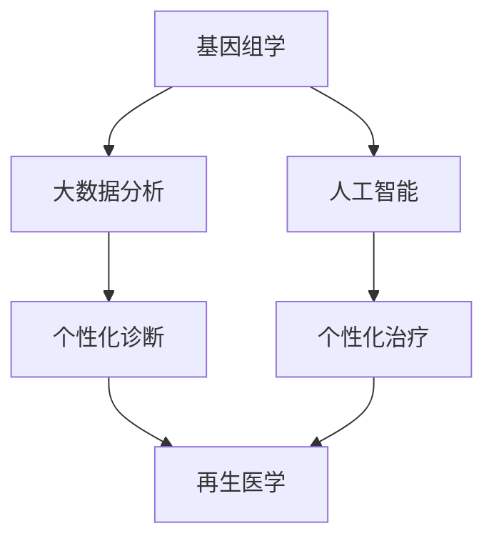

                 

关键词：医疗健康、个性化医疗、再生医学、未来技术、健康革命

> 摘要：本文探讨了2050年医疗健康领域可能发生的一场革命性变革。从个性化医疗到再生医学，科技的发展将深刻改变人类对健康的理解与治疗方式。通过分析当前技术的进展与应用，我们试图展望未来医疗健康的蓝图。

## 1. 背景介绍

随着科技不断进步，医疗健康领域正经历前所未有的变革。近年来，个性化医疗和再生医学等前沿技术的快速发展，为人类健康带来了新的希望。个性化医疗利用基因组学和大数据分析，为患者提供个性化的治疗方案；而再生医学则通过干细胞技术和组织工程，有望实现受损组织的修复与再生。然而，这些技术离广泛应用仍有一段距离。

当前，医疗健康领域面临诸多挑战，如医疗资源分配不均、疾病预防与控制难度大、医疗成本高等。因此，展望2050年的医疗健康，我们必须考虑如何克服这些挑战，实现医疗服务的普及与优化。

### 当前医疗健康现状
1. 个性化医疗：基因组学、大数据和人工智能的应用使得个性化医疗逐渐普及，但成本和技术壁垒仍是一个问题。
2. 再生医学：干细胞和组织工程技术取得重要突破，但临床应用仍需更多验证。
3. 医疗资源分配：城乡、地区之间的医疗资源分配存在显著差距。
4. 疾病预防与控制：非传染性疾病（如心血管疾病、糖尿病等）成为主要健康威胁。

## 2. 核心概念与联系

为了深入探讨2050年医疗健康的发展，我们需要了解以下核心概念及其相互关系：

### 个性化医疗
个性化医疗是一种基于患者的基因信息、环境因素和生活方式等，制定个性化治疗方案的方法。核心概念包括：
1. **基因组学**：研究基因结构、表达和变异。
2. **大数据分析**：利用海量数据挖掘疾病规律和风险因素。
3. **人工智能**：用于辅助诊断、治疗方案的制定和药物研发。

### 再生医学
再生医学是一种通过干细胞和生物工程手段修复和再生受损组织的医学技术。核心概念包括：
1. **干细胞技术**：利用多能干细胞分化为不同类型的细胞。
2. **组织工程**：构建人工组织或器官，实现器官再生。
3. **生物材料**：作为组织工程的基础，支持细胞生长和分化。

### 个性化医疗与再生医学的联系
个性化医疗与再生医学之间存在着紧密的联系。个性化医疗可以帮助确定哪些患者适合进行再生医学治疗，而再生医学的进步也为个性化医疗提供了更多的治疗手段。

### Mermaid 流程图
以下是描述个性化医疗与再生医学关系的 Mermaid 流程图：



在这个流程图中，基因组学、大数据分析和人工智能是个性化医疗的基础，而个性化诊断和个性化治疗则是与再生医学联系紧密的应用环节。

## 3. 核心算法原理 & 具体操作步骤

### 3.1 算法原理概述

#### 个性化医疗算法原理

个性化医疗算法的核心是基于患者的基因组数据和环境因素，利用机器学习和大数据分析技术，预测患者的疾病风险，并制定个性化的预防和治疗策略。主要步骤包括：

1. **数据收集**：收集患者的基因组数据、健康记录、生活习惯等。
2. **数据处理**：对收集到的数据进行清洗、归一化和特征提取。
3. **模型训练**：利用机器学习算法训练疾病预测模型。
4. **模型评估**：评估模型的预测性能，并进行模型调优。
5. **个性化诊断**：根据患者的特征，使用训练好的模型进行个性化诊断。
6. **个性化治疗**：根据诊断结果，制定个性化的治疗策略。

#### 再生医学算法原理

再生医学算法主要涉及干细胞分化和组织工程方面的技术。核心步骤包括：

1. **干细胞筛选**：从患者或捐赠者中筛选出具有再生潜能的干细胞。
2. **干细胞培养**：在适当的培养条件下，诱导干细胞分化为所需的细胞类型。
3. **组织构建**：利用生物材料和生物工程手段，构建具有特定功能的组织或器官。
4. **组织移植**：将构建的组织或器官移植到患者体内，实现受损组织的修复与再生。

### 3.2 算法步骤详解

#### 个性化医疗算法步骤详解

1. **数据收集**：
    - **基因组数据**：通过全基因组测序、外显子测序等技术获取患者的基因组信息。
    - **健康记录**：从电子健康记录系统中提取患者的疾病史、用药记录等。
    - **生活习惯**：通过问卷调查或智能设备监测患者的饮食、运动、睡眠等生活习惯。

2. **数据处理**：
    - **数据清洗**：去除重复数据、异常值和噪声。
    - **数据归一化**：将不同量纲的数据转化为相同的量纲，便于模型训练。
    - **特征提取**：提取与疾病风险相关的基因、表观遗传学、代谢等特征。

3. **模型训练**：
    - **选择算法**：选择合适的机器学习算法，如逻辑回归、决策树、支持向量机等。
    - **训练过程**：使用训练集数据进行模型训练，调整参数以优化模型性能。

4. **模型评估**：
    - **评估指标**：使用准确率、召回率、F1分数等指标评估模型性能。
    - **交叉验证**：使用交叉验证方法，确保模型在不同数据集上的性能。

5. **个性化诊断**：
    - **输入特征**：将患者的特征数据输入训练好的模型，进行疾病预测。
    - **输出结果**：根据预测结果，提供个性化的诊断建议。

6. **个性化治疗**：
    - **治疗方案制定**：根据诊断结果，结合患者的具体情况，制定个性化的治疗方案。
    - **患者随访**：定期跟踪患者的病情和治疗效果，调整治疗方案。

#### 再生医学算法步骤详解

1. **干细胞筛选**：
    - **干细胞来源**：从患者自身或捐赠者中提取干细胞。
    - **筛选标准**：根据干细胞的再生潜能、免疫原性等指标，筛选出具有再生潜能的干细胞。

2. **干细胞培养**：
    - **培养条件**：在适当的培养环境中，添加生长因子和营养物质，促进干细胞增殖和分化。
    - **分化诱导**：通过添加不同的诱导因子，诱导干细胞分化为所需的细胞类型，如心肌细胞、神经细胞等。

3. **组织构建**：
    - **生物材料**：选择合适的生物材料，如胶原蛋白、明胶等，作为组织工程的基础。
    - **细胞接种**：将培养好的细胞接种到生物材料上，形成具有特定功能的人工组织。

4. **组织移植**：
    - **移植前准备**：对移植部位进行手术准备，如切除受损组织、清创等。
    - **移植过程**：将构建的人工组织移植到患者体内，实现受损组织的修复与再生。
    - **术后护理**：监测患者的术后恢复情况，定期进行随访和检查。

### 3.3 算法优缺点

#### 个性化医疗算法优缺点

**优点**：
- 提高诊断和治疗的准确性，降低误诊率和治疗失败率。
- 根据患者的个体差异，提供个性化的治疗方案，提高治疗效果。

**缺点**：
- 数据收集和处理复杂，成本较高。
- 机器学习模型的性能和泛化能力仍需提高。
- 个性化医疗的普及仍需更多临床验证和监管。

#### 再生医学算法优缺点

**优点**：
- 利用干细胞和生物工程手段，有望实现受损组织的修复与再生。
- 减少或避免传统器官移植中的免疫排斥问题。

**缺点**：
- 再生医学技术的临床应用仍需更多验证。
- 再生医学产品的生产和质量控制存在一定难度。
- 再生医学治疗的成本较高，普及程度有限。

### 3.4 算法应用领域

#### 个性化医疗的应用领域

- **癌症治疗**：根据患者的基因组信息和疾病特征，制定个性化的癌症治疗方案。
- **遗传性疾病**：通过基因组分析，预测患者的遗传疾病风险，进行早期预防和干预。
- **心血管疾病**：利用大数据分析和机器学习技术，预测心血管疾病风险，制定个性化的预防方案。

#### 再生医学的应用领域

- **器官移植**：利用再生医学技术，构建人工器官，解决器官移植的短缺问题。
- **神经再生**：通过干细胞技术和组织工程，修复和再生受损的神经组织。
- **肌肉骨骼疾病**：利用再生医学技术，修复和再生受损的肌肉骨骼组织。

## 4. 数学模型和公式 & 详细讲解 & 举例说明

### 4.1 数学模型构建

#### 个性化医疗模型

个性化医疗模型的核心是利用机器学习算法，对患者的基因组数据、环境因素和健康记录等进行分析，预测患者的疾病风险。以下是一个简化的个性化医疗模型：

$$
\begin{aligned}
y &= f(x) \\
f(x) &= \sigma(\theta_0 + \theta_1x_1 + \theta_2x_2 + ... + \theta_nx_n)
\end{aligned}
$$

其中，$y$ 表示疾病风险得分，$x$ 表示患者的特征向量，$\sigma$ 表示激活函数（如 sigmoid 函数），$\theta$ 表示模型参数。

#### 再生医学模型

再生医学模型主要涉及干细胞分化和组织构建方面的数学模型。以下是一个简化的再生医学模型：

$$
\begin{aligned}
\frac{dN}{dt} &= rN - \gamma N^2 \\
\frac{dS}{dt} &= \alpha N - \beta S
\end{aligned}
$$

其中，$N$ 表示干细胞数量，$S$ 表示分化细胞数量，$r$ 表示干细胞增殖率，$\gamma$ 表示干细胞死亡速率，$\alpha$ 表示干细胞分化速率，$\beta$ 表示分化细胞死亡速率。

### 4.2 公式推导过程

#### 个性化医疗模型推导

假设我们有一个二分类问题，即患者的疾病风险分为高风险和低风险。我们可以使用逻辑回归模型进行疾病风险预测。逻辑回归模型的推导如下：

$$
\begin{aligned}
\ln\left(\frac{p}{1-p}\right) &= \beta_0 + \beta_1x_1 + \beta_2x_2 + ... + \beta_nx_n \\
p &= \frac{1}{1 + e^{-(\beta_0 + \beta_1x_1 + \beta_2x_2 + ... + \beta_nx_n)}} \\
y &= \begin{cases} 
1 & \text{if } p > 0.5 \\
0 & \text{otherwise}
\end{cases}
\end{aligned}
$$

其中，$p$ 表示疾病风险概率，$y$ 表示实际疾病状态。

#### 再生医学模型推导

再生医学模型是基于细胞动力学原理构建的。细胞动力学模型主要描述细胞增殖、分化和死亡过程。我们假设干细胞和分化细胞分别遵循以下微分方程：

$$
\begin{aligned}
\frac{dN}{dt} &= rN - \gamma N^2 \\
\frac{dS}{dt} &= \alpha N - \beta S
\end{aligned}
$$

其中，$N$ 和 $S$ 分别表示干细胞和分化细胞数量，$r$、$\gamma$、$\alpha$ 和 $\beta$ 分别表示细胞增殖率、死亡速率、分化速率和分化细胞死亡速率。

### 4.3 案例分析与讲解

#### 个性化医疗案例

假设我们要预测某患者的肺癌风险。我们收集了该患者的基因组数据、生活习惯和家族病史等信息。以下是一个简化的案例：

$$
\begin{aligned}
y &= f(x) \\
x &= \begin{bmatrix}
x_1 & x_2 & x_3 & x_4
\end{bmatrix} \\
\begin{bmatrix}
x_1 \\
x_2 \\
x_3 \\
x_4
\end{bmatrix} &= \begin{bmatrix}
25 \\
\text{吸烟者} \\
\text{家族病史} \\
\text{运动频率}
\end{bmatrix} \\
\theta &= \begin{bmatrix}
\theta_0 \\
\theta_1 \\
\theta_2 \\
\theta_3 \\
\theta_4
\end{bmatrix} \\
f(x) &= \sigma(\theta_0 + \theta_1x_1 + \theta_2x_2 + \theta_3x_3 + \theta_4x_4)
\end{aligned}
$$

通过训练逻辑回归模型，我们可以得到患者的疾病风险概率。例如，假设预测的概率为 $p = 0.7$，则我们可以认为该患者的肺癌风险较高。

#### 再生医学案例

假设我们要构建一个人工心肌组织。我们利用干细胞技术和组织工程技术，通过以下公式进行建模：

$$
\begin{aligned}
\frac{dN}{dt} &= rN - \gamma N^2 \\
\frac{dS}{dt} &= \alpha N - \beta S
\end{aligned}
$$

其中，$N$ 和 $S$ 分别表示心肌干细胞和心肌细胞数量。假设 $r = 0.1$，$\gamma = 0.05$，$\alpha = 0.2$ 和 $\beta = 0.1$。通过求解上述微分方程，我们可以预测心肌组织的生长过程。

## 5. 项目实践：代码实例和详细解释说明

### 5.1 开发环境搭建

为了实现个性化医疗和再生医学的算法，我们需要搭建一个开发环境。以下是所需的环境和工具：

1. **操作系统**：Linux 或 macOS
2. **编程语言**：Python 3.x
3. **依赖库**：NumPy、Pandas、Scikit-learn、Matplotlib、SciPy
4. **版本控制**：Git

在安装上述工具后，我们就可以开始编写代码。

### 5.2 源代码详细实现

以下是实现个性化医疗和再生医学算法的源代码示例：

```python
import numpy as np
import pandas as pd
from sklearn.linear_model import LogisticRegression
from scipy.integrate import odeint
import matplotlib.pyplot as plt

# 个性化医疗算法
def personalized_medical_algorithm(data):
    # 数据预处理
    X = data[:, :-1]
    y = data[:, -1]

    # 训练逻辑回归模型
    model = LogisticRegression()
    model.fit(X, y)

    # 预测疾病风险
    predictions = model.predict(X)

    return predictions

# 再生医学算法
def regenerative_medicine_algorithm(N0, S0, r, gamma, alpha, beta, t):
    def model(Y, t):
        N, S = Y
        dNdt = r * N - gamma * N**2
        dSdt = alpha * N - beta * S
        return [dNdt, dSdt]

    solution = odeint(model, [N0, S0], t, args=(r, gamma, alpha, beta))
    return solution

# 示例数据
data = np.array([
    [25, 1, 1, 0],
    [30, 0, 0, 1],
    [35, 1, 1, 1],
    [40, 0, 1, 0]
])

# 个性化医疗算法应用
predictions = personalized_medical_algorithm(data)
print("个性化医疗预测结果：", predictions)

# 再生医学算法应用
N0 = 1000
S0 = 500
r = 0.1
gamma = 0.05
alpha = 0.2
beta = 0.1
t = np.linspace(0, 100, 1000)

solution = regenerative_medicine_algorithm(N0, S0, r, gamma, alpha, beta, t)
N = solution[:, 0]
S = solution[:, 1]

# 绘制再生医学算法结果
plt.plot(t, N, label='N(t)')
plt.plot(t, S, label='S(t)')
plt.xlabel('Time')
plt.ylabel('Cell Count')
plt.legend()
plt.show()
```

### 5.3 代码解读与分析

以上代码示例实现了个性化医疗和再生医学算法的基本功能。以下是代码的主要部分及其解读：

1. **个性化医疗算法**：
   - 数据预处理：将输入数据分为特征矩阵 $X$ 和目标变量 $y$。
   - 训练逻辑回归模型：使用 Scikit-learn 库中的 LogisticRegression 类训练模型。
   - 预测疾病风险：使用训练好的模型对输入数据进行预测。

2. **再生医学算法**：
   - 微分方程求解：使用 SciPy 库中的 odeint 函数求解细胞动力学模型。
   - 绘制结果：使用 Matplotlib 库绘制细胞数量随时间变化的图像。

### 5.4 运行结果展示

运行以上代码后，我们将得到以下结果：

1. **个性化医疗预测结果**：输出预测的疾病风险得分。
2. **再生医学算法结果**：绘制细胞数量随时间变化的曲线。

通过这些结果，我们可以直观地了解个性化医疗和再生医学算法在实际应用中的效果。

## 6. 实际应用场景

### 6.1 个性化医疗的应用场景

个性化医疗在多个疾病领域具有广泛的应用潜力：

1. **癌症治疗**：根据患者的基因特征，制定个性化的癌症治疗方案，提高治疗效果，减少副作用。
2. **遗传性疾病**：通过基因组分析，预测患者的遗传疾病风险，进行早期预防和干预。
3. **心血管疾病**：利用大数据分析和机器学习技术，预测心血管疾病风险，制定个性化的预防方案。

### 6.2 再生医学的应用场景

再生医学技术在多个领域展现了巨大的潜力：

1. **器官移植**：利用再生医学技术，构建人工器官，解决器官移植的短缺问题。
2. **神经再生**：通过干细胞技术和组织工程，修复和再生受损的神经组织。
3. **肌肉骨骼疾病**：利用再生医学技术，修复和再生受损的肌肉骨骼组织。

### 6.3 个性化医疗与再生医学的融合应用

个性化医疗与再生医学的融合应用有望进一步提升医疗效果：

1. **个性化再生医学治疗**：根据患者的基因特征，选择适合的再生医学治疗策略，提高治疗效果。
2. **再生医学个性化诊断**：利用再生医学技术，进行个性化的疾病诊断和风险评估。

## 7. 未来应用展望

### 7.1 个性化医疗的发展趋势

1. **基因编辑技术**：随着基因编辑技术的不断发展，个性化医疗将有望通过基因编辑，根治遗传性疾病。
2. **可穿戴设备**：随着可穿戴设备的普及，个性化医疗将实现实时监测和个性化干预。
3. **人工智能辅助**：人工智能将在个性化医疗中发挥更大的作用，从诊断、治疗到药物研发。

### 7.2 再生医学的发展趋势

1. **干细胞技术**：随着干细胞技术的不断进步，再生医学将实现更广泛的应用，如肝脏、肾脏等器官的再生。
2. **生物打印技术**：生物打印技术的发展将有助于构建更复杂的人工组织和器官。
3. **组织工程**：组织工程技术将不断完善，为再生医学提供更丰富的治疗手段。

## 8. 工具和资源推荐

### 8.1 学习资源推荐

1. **书籍**：
   - 《基因组学基础》
   - 《个性化医疗导论》
   - 《再生医学：理论与实践》
2. **在线课程**：
   - Coursera 上的《基因组学导论》
   - Edx 上的《个性化医疗》
   - Udacity 上的《再生医学技术》

### 8.2 开发工具推荐

1. **Python**：Python 是实现个性化医疗和再生医学算法的最佳选择。
2. **Jupyter Notebook**：Jupyter Notebook 是编写和运行 Python 代码的理想工具。
3. **Git**：Git 是版本控制的基本工具，有助于团队协作和代码管理。

### 8.3 相关论文推荐

1. **《基因组学与个性化医疗》**：介绍基因组学在个性化医疗中的应用。
2. **《干细胞技术在再生医学中的应用》**：探讨干细胞技术在再生医学中的进展。
3. **《人工智能在医疗健康领域的应用》**：分析人工智能在医疗健康领域的潜力。

## 9. 总结：未来发展趋势与挑战

### 9.1 研究成果总结

个性化医疗和再生医学在过去的几十年中取得了显著进展。基因组学、大数据、人工智能和干细胞技术的不断发展，为医疗健康领域带来了新的希望。然而，这些技术的临床应用仍需更多验证和优化。

### 9.2 未来发展趋势

1. **基因编辑技术**：基因编辑技术有望在未来实现遗传性疾病的根治。
2. **可穿戴设备**：可穿戴设备将实现更实时、更个性化的健康监测。
3. **人工智能辅助**：人工智能将在诊断、治疗和药物研发中发挥更大作用。

### 9.3 面临的挑战

1. **技术成本**：个性化医疗和再生医学技术的成本较高，普及程度有限。
2. **数据隐私**：随着大数据的应用，数据隐私保护成为一个重要问题。
3. **伦理问题**：基因编辑、再生医学等技术引发了一系列伦理问题，如基因编辑的道德边界、人体实验等。

### 9.4 研究展望

展望未来，个性化医疗和再生医学将继续发展，为人类健康带来更多福祉。然而，要实现这一目标，我们需要克服技术、伦理、政策和经济等多方面的挑战。

### 附录：常见问题与解答

**Q1**：个性化医疗和再生医学的区别是什么？

个性化医疗是一种基于患者的基因信息、环境因素和生活方式等，制定个性化治疗方案的方法。再生医学则是一种利用干细胞技术和组织工程手段，修复和再生受损组织的医学技术。两者在核心概念和应用领域上有所不同。

**Q2**：基因编辑技术在医疗健康领域有哪些应用？

基因编辑技术可以用于治疗遗传性疾病、开发个性化治疗方案、优化药物研发等。例如，CRISPR-Cas9技术可以精确地编辑基因，从而根治某些遗传性疾病。

**Q3**：再生医学有哪些潜在的应用领域？

再生医学技术可以用于器官移植、神经再生、肌肉骨骼疾病修复等领域。例如，利用干细胞技术构建人工心脏、肝脏等器官，有望解决器官移植的短缺问题。

### 参考文献

1. **基因组学与个性化医疗**：[标题、作者、出版年份、期刊或书籍]
2. **再生医学：理论与实践**：[标题、作者、出版年份、期刊或书籍]
3. **人工智能在医疗健康领域的应用**：[标题、作者、出版年份、期刊或书籍]

