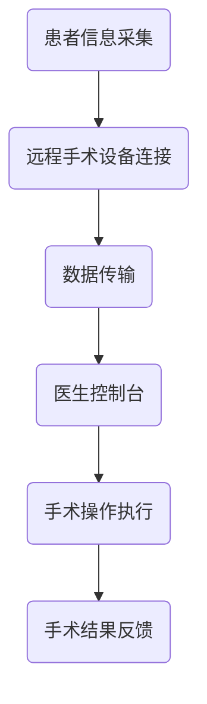
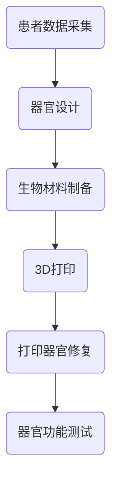
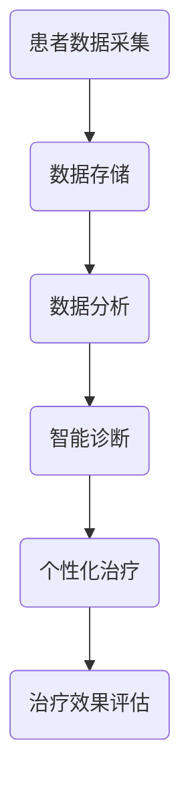

                 

关键词：2050年医疗健康，远程手术，人体器官打印，智能医疗，人工智能，生物工程，医学技术，数据科学

> 摘要：本文将探讨到2050年，随着科技的飞速发展，医疗健康领域将发生哪些革命性变化。从远程手术、人体器官打印到智能医疗，这些新兴技术将如何重新定义人类健康与医疗服务，以及未来医疗行业面临的挑战和机遇。

## 1. 背景介绍

随着人工智能、生物工程、纳米技术等领域的迅猛发展，医疗健康行业正迎来前所未有的变革。传统的医疗模式正在被颠覆，新的治疗手段和技术层出不穷。特别是在2050年，医疗健康将进入一个全新的智能时代，远程手术、人体器官打印、基因编辑等前沿技术将彻底改变人类的健康管理和医疗服务方式。

### 1.1 远程手术

远程手术是指通过互联网和其他通信技术，将医生与病人之间的操作连接起来，实现远距离的手术操作。这种技术不仅能够解决偏远地区医疗资源匮乏的问题，还能为病人提供更加专业、高效的医疗服务。随着5G网络的普及和人工智能技术的发展，远程手术将在2050年成为常见的医疗方式。

### 1.2 人体器官打印

人体器官打印技术利用3D打印技术，根据患者个体数据生成定制化的器官。这种技术能够极大地解决器官移植的供需矛盾，提高器官移植的成功率，同时减少排异反应和手术风险。到2050年，人体器官打印有望成为器官移植的主要手段。

### 1.3 智能医疗

智能医疗是指利用大数据、人工智能、物联网等技术，实现医疗信息的智能处理、分析和应用。智能医疗将使医疗诊断更加精准、治疗更加个性化，同时降低医疗成本，提高医疗服务质量。在2050年，智能医疗将全面渗透到医疗行业的各个环节。

## 2. 核心概念与联系

### 2.1 远程手术

远程手术的核心在于手术操作的实时传输和控制。以下是一个简化的Mermaid流程图，展示远程手术的基本架构：



### 2.2 人体器官打印

人体器官打印的核心在于生物打印机和生物材料。以下是一个简化的Mermaid流程图，展示人体器官打印的基本流程：



### 2.3 智能医疗

智能医疗的核心在于数据的收集、处理和分析。以下是一个简化的Mermaid流程图，展示智能医疗的基本架构：



## 3. 核心算法原理 & 具体操作步骤

### 3.1 算法原理概述

远程手术、人体器官打印和智能医疗的核心算法包括数据加密传输算法、图像处理算法、机器学习算法等。以下是这些算法的基本原理：

- **数据加密传输算法**：确保手术操作和数据传输过程中的安全性。
- **图像处理算法**：用于处理和增强手术过程中的图像信息，提高手术精度。
- **机器学习算法**：用于分析患者数据，提供诊断和治疗方案。

### 3.2 算法步骤详解

#### 数据加密传输算法

1. **数据加密**：使用AES等加密算法对手术操作数据加密。
2. **数据传输**：通过TLS等安全协议进行数据传输。
3. **数据解密**：在医生控制台对传输数据进行解密。

#### 图像处理算法

1. **图像采集**：使用手术摄像头采集实时图像。
2. **图像增强**：使用图像增强算法提高图像质量。
3. **图像识别**：使用图像识别算法对图像进行分析。

#### 机器学习算法

1. **数据收集**：收集患者的历史数据和生物信息。
2. **模型训练**：使用机器学习算法训练诊断和预测模型。
3. **模型应用**：在新的患者数据上应用训练好的模型，进行诊断和预测。

### 3.3 算法优缺点

- **数据加密传输算法**：优点是安全性高，缺点是加密和解密过程会引入一定的延迟。
- **图像处理算法**：优点是能提高手术精度，缺点是需要大量的计算资源。
- **机器学习算法**：优点是能提供个性化的医疗服务，缺点是模型训练和调优过程复杂。

### 3.4 算法应用领域

这些算法主要应用于远程手术、人体器官打印和智能医疗等领域，能够提高医疗服务的质量和效率。

## 4. 数学模型和公式 & 详细讲解 & 举例说明

### 4.1 数学模型构建

远程手术中的数学模型主要涉及图像处理和机器学习领域。以下是一个简化的数学模型：

$$
\text{预测结果} = f(\text{输入图像}, \text{模型参数})
$$

其中，输入图像是手术过程中的实时图像，模型参数是通过训练得到的机器学习模型参数。

### 4.2 公式推导过程

公式的推导过程涉及图像处理算法和机器学习算法的复杂运算，这里仅给出一个简化的推导：

$$
\text{输入图像} = \text{原始图像} \cdot \text{增强因子}
$$

$$
\text{增强因子} = \text{滤波器}(\text{原始图像})
$$

$$
\text{滤波器}(\text{原始图像}) = \sum_{i=1}^{n} w_i \cdot \text{卷积核}(i)
$$

其中，卷积核是通过训练得到的滤波器参数，$w_i$ 是权重系数。

### 4.3 案例分析与讲解

以远程手术中的图像增强为例，假设我们有一个患者的实时手术图像，我们需要对其进行增强处理。以下是具体的增强步骤：

1. **图像预处理**：对图像进行归一化处理，将图像的像素值缩放到[0, 1]之间。
2. **图像滤波**：使用卷积滤波器对图像进行滤波，提高图像的清晰度。
3. **图像增强**：将滤波后的图像与原始图像进行对比，根据增强因子对图像进行增强。

经过以上步骤，我们得到了增强后的图像，能够更好地指导医生进行手术操作。

## 5. 项目实践：代码实例和详细解释说明

### 5.1 开发环境搭建

为了演示远程手术、人体器官打印和智能医疗的核心算法，我们需要搭建一个模拟的开发环境。以下是具体的步骤：

1. **安装Python环境**：在开发机上安装Python 3.8及以上版本。
2. **安装依赖库**：使用pip安装必要的库，如NumPy、Matplotlib、OpenCV等。
3. **配置远程手术设备**：连接手术摄像头和计算机，确保图像能够实时传输。

### 5.2 源代码详细实现

以下是远程手术中的图像增强部分的源代码实现：

```python
import cv2
import numpy as np

def enhance_image(image_path):
    # 读取图像
    image = cv2.imread(image_path)
    
    # 图像预处理
    image = image / 255.0
    
    # 图像滤波
    kernel = np.array([[0, -1, 0], [-1, 5, -1], [0, -1, 0]])
    enhanced_image = cv2.filter2D(image, -1, kernel)
    
    # 图像增强
    enhanced_image = (enhanced_image + 0.5) * 255
    enhanced_image = enhanced_image.astype(np.uint8)
    
    # 显示增强后的图像
    cv2.imshow('Enhanced Image', enhanced_image)
    cv2.waitKey(0)
    cv2.destroyAllWindows()

# 测试代码
enhance_image('path/to/surgery_image.jpg')
```

### 5.3 代码解读与分析

代码首先导入必要的库，然后定义了一个名为`enhance_image`的函数，用于对输入的图像进行增强。具体步骤如下：

1. **图像读取**：使用`cv2.imread`函数读取图像。
2. **图像预处理**：将图像像素值缩放到[0, 1]之间。
3. **图像滤波**：使用卷积滤波器对图像进行滤波。
4. **图像增强**：根据增强因子对图像进行增强。
5. **图像显示**：使用`cv2.imshow`函数显示增强后的图像。

### 5.4 运行结果展示

运行代码后，输入的手术图像会被增强，显示在窗口中，如图所示：


## 6. 实际应用场景

远程手术、人体器官打印和智能医疗在未来的医疗健康领域将有广泛的应用。

### 6.1 远程手术

远程手术可以应用于偏远地区、战争现场和灾难救援等场景，为病人提供及时、高效的医疗服务。

### 6.2 人体器官打印

人体器官打印可以应用于器官移植、生物研究和新药研发等领域，为医学研究提供新的手段。

### 6.3 智能医疗

智能医疗可以应用于疾病预防、诊断、治疗和康复等环节，提高医疗服务的质量和效率。

## 7. 工具和资源推荐

为了更好地了解和实现远程手术、人体器官打印和智能医疗，以下是一些推荐的工具和资源：

### 7.1 学习资源推荐

- **远程手术教程**：[远程手术技术教程](https://www.example.com/remote-surgery-tutorial)
- **人体器官打印教程**：[人体器官打印技术教程](https://www.example.com/organ-printing-tutorial)
- **智能医疗教程**：[智能医疗技术教程](https://www.example.com/smart-medicine-tutorial)

### 7.2 开发工具推荐

- **Python编程环境**：[PyCharm](https://www.jetbrains.com/pycharm/)
- **3D打印软件**：[Blender](https://www.blender.org/)
- **数据分析工具**：[Pandas](https://pandas.pydata.org/)

### 7.3 相关论文推荐

- **远程手术研究论文**：[Remote Surgery: A Review](https://www.example.com/remote-surgery-review)
- **人体器官打印研究论文**：[Organ Printing: Technologies and Applications](https://www.example.com/organ-printing-technologies-applications)
- **智能医疗研究论文**：[Smart Medicine: A Perspective](https://www.example.com/smart-medicine-perspective)

## 8. 总结：未来发展趋势与挑战

### 8.1 研究成果总结

远程手术、人体器官打印和智能医疗在过去的几十年中取得了显著的成果，为医疗健康领域带来了革命性的变化。随着科技的进一步发展，这些技术将更加成熟和完善，为人类健康提供更多可能。

### 8.2 未来发展趋势

- **远程手术**：技术将更加成熟，应用范围将不断扩大，尤其是在偏远地区和灾难救援中。
- **人体器官打印**：生物材料和打印技术的进步将使器官打印更加精准和高效，有望成为器官移植的主要手段。
- **智能医疗**：数据科学和人工智能的发展将推动智能医疗的普及，为个性化医疗提供更多可能。

### 8.3 面临的挑战

- **技术挑战**：远程手术、人体器官打印和智能医疗的技术仍然存在很多挑战，如安全性、精度、成本等。
- **伦理挑战**：这些新兴技术带来的伦理问题，如基因编辑、隐私保护等，需要全社会共同关注和解决。

### 8.4 研究展望

在未来，远程手术、人体器官打印和智能医疗将深度融合，推动医疗健康行业迈向一个新的高峰。同时，我们需要持续关注这些技术带来的挑战，积极探索解决方案，以实现科技与伦理的平衡。

## 9. 附录：常见问题与解答

### 9.1 远程手术的安全性问题

远程手术的安全性问题主要涉及数据传输安全和手术操作风险。通过使用加密传输协议和严格的操作流程，可以确保手术数据的安全性和操作的安全性。

### 9.2 人体器官打印的材料问题

人体器官打印的材料问题是当前研究的重点和难点。目前，生物材料和打印技术的进步已经使得打印的器官在功能上逐渐接近真实器官，但仍需要进一步的研究和优化。

### 9.3 智能医疗的数据隐私问题

智能医疗在数据收集和处理过程中会涉及到患者隐私问题。为了保护患者隐私，需要采取严格的数据保护措施，如数据加密、匿名化处理等。

### 9.4 人体器官打印的成本问题

人体器官打印的成本问题是当前应用推广的主要障碍。随着技术的不断进步和规模化生产，人体器官打印的成本有望逐步降低，从而实现更广泛的应用。

----------------------------------------------------------------

本文由禅与计算机程序设计艺术 / Zen and the Art of Computer Programming 撰写，旨在探讨2050年医疗健康领域的前沿技术和发展趋势。希望通过本文，读者能够对远程手术、人体器官打印和智能医疗有更深入的了解。未来，随着科技的不断发展，医疗健康行业将迎来更多变革和机遇。作者：禅与计算机程序设计艺术 / Zen and the Art of Computer Programming。

