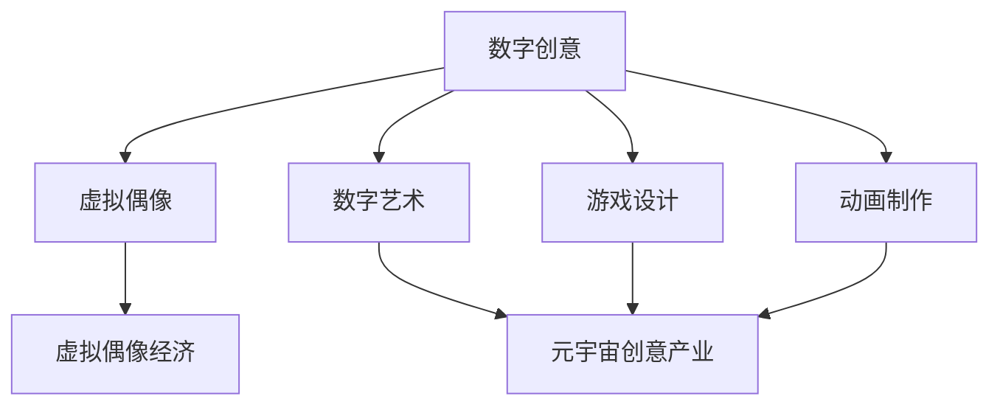

                 

关键词：数字创意、虚拟偶像、元宇宙、创意经济、AI、数字技术、未来趋势

> 摘要：本文深入探讨了2050年数字创意领域的发展趋势，从虚拟偶像经济到元宇宙创意产业的崛起，分析了这一过程中AI、虚拟现实和区块链等数字技术的融合与应用。通过数学模型、算法原理和实践案例，探讨了数字创意经济的未来前景、应用领域以及面临的挑战，为读者提供了一个全面、前瞻的视角。

## 1. 背景介绍

随着人工智能（AI）、虚拟现实（VR）和区块链等数字技术的发展，数字创意产业正在经历前所未有的变革。数字创意，是指通过数字化手段创造出的具有创意性的内容，包括虚拟偶像、数字艺术、游戏设计、动画制作等。而虚拟偶像经济，则是指依托虚拟人物形象展开的商业活动，如虚拟演唱会、虚拟代言、虚拟互动等。

虚拟偶像经济的兴起，是数字创意产业的一个重要分支。虚拟偶像通过数字技术生成，具有高度的真实感和互动性，能够满足人们对个性化体验的需求。而元宇宙创意产业，则是一个更为广阔的领域，涵盖了虚拟现实、增强现实、游戏、社交等多个方面，是一个集成了多种数字技术的综合性产业。

本文旨在探讨2050年的数字创意产业，分析其发展趋势、核心概念、算法原理以及应用领域，为数字创意产业的未来发展提供参考。

## 2. 核心概念与联系

### 2.1 数字创意的定义与分类

数字创意，是指利用数字技术，通过创意思维和创新手段创造出的具有艺术性、娱乐性、教育性等价值的内容。根据应用场景和内容特性，数字创意可以大致分为以下几类：

1. **虚拟偶像**：通过数字技术生成的虚拟人物形象，具有高度的真实感和互动性，可以用于演唱会、广告代言、娱乐互动等多种商业活动。
2. **数字艺术**：利用计算机技术创作的数字艺术作品，如数字绘画、数字雕塑、数字动画等，具有独特的视觉效果和艺术价值。
3. **游戏设计**：通过编程和图形设计等技术手段，创造出的具有娱乐性和互动性的游戏产品。
4. **动画制作**：利用动画技术制作的动画作品，包括电影、电视剧、广告等。

### 2.2 虚拟偶像经济的定义与特点

虚拟偶像经济，是指以虚拟偶像为核心的商业活动，包括虚拟偶像的形象设计、虚拟演唱会、虚拟代言、虚拟互动等。虚拟偶像经济具有以下特点：

1. **高度个性化**：虚拟偶像可以根据市场需求和用户喜好进行定制，满足个性化体验需求。
2. **互动性强**：虚拟偶像可以通过数字技术实现与用户的实时互动，增强用户参与感。
3. **跨界融合**：虚拟偶像经济与娱乐、时尚、科技等多个领域融合，形成多元化的商业模式。
4. **低成本、高效益**：虚拟偶像的制作和运营成本相对较低，但具有很高的商业价值。

### 2.3 元宇宙创意产业的定义与特点

元宇宙创意产业，是指以虚拟现实、增强现实、游戏、社交等技术为核心，构建的集娱乐、教育、工作、生活等多功能于一体的虚拟世界。元宇宙创意产业具有以下特点：

1. **沉浸式体验**：元宇宙通过虚拟现实、增强现实等技术，为用户提供沉浸式的体验，增强用户的参与感和归属感。
2. **跨界融合**：元宇宙创意产业涵盖了娱乐、教育、科技、金融等多个领域，形成跨界融合的商业模式。
3. **高价值创造**：元宇宙创意产业通过创意内容和技术的结合，创造了大量新的价值和就业机会。
4. **可持续性**：元宇宙创意产业在发展过程中，注重环境保护和可持续发展，具有长远的发展前景。

### 2.4 Mermaid 流程图



## 3. 核心算法原理 & 具体操作步骤

### 3.1 算法原理概述

在数字创意产业中，核心算法起到了关键作用。以下是几个关键算法的原理概述：

1. **生成对抗网络（GAN）**：GAN是一种深度学习模型，通过生成器和判别器的对抗训练，生成逼真的虚拟偶像图像。
2. **虚拟现实（VR）渲染算法**：VR渲染算法通过三维建模、光影计算等技术，实现虚拟世界的真实感渲染。
3. **区块链技术**：区块链技术用于元宇宙创意产业的权益管理，确保虚拟资产的安全性和透明性。
4. **自然语言处理（NLP）**：NLP技术用于虚拟偶像的语音合成和交互，实现智能对话。

### 3.2 算法步骤详解

1. **生成对抗网络（GAN）**：

   - **步骤1**：初始化生成器和判别器。
   - **步骤2**：生成器生成虚拟偶像图像，判别器判断图像的真实性。
   - **步骤3**：根据判别器的反馈，调整生成器和判别器的参数。
   - **步骤4**：重复步骤2和步骤3，直到生成器生成的图像足够逼真。

2. **虚拟现实（VR）渲染算法**：

   - **步骤1**：构建三维模型。
   - **步骤2**：进行纹理映射和光影计算。
   - **步骤3**：生成渲染图。
   - **步骤4**：实时更新渲染图，以适应用户的视角变化。

3. **区块链技术**：

   - **步骤1**：初始化区块链网络。
   - **步骤2**：创建虚拟资产，并记录在区块链上。
   - **步骤3**：实现虚拟资产的交易和转移。
   - **步骤4**：确保交易过程的安全性和透明性。

4. **自然语言处理（NLP）**：

   - **步骤1**：接收用户输入。
   - **步骤2**：进行语音识别和语义分析。
   - **步骤3**：生成回复文本。
   - **步骤4**：通过语音合成技术输出回复。

### 3.3 算法优缺点

1. **生成对抗网络（GAN）**：

   - **优点**：能够生成高质量的虚拟偶像图像，具有较强的灵活性和创造力。
   - **缺点**：训练过程复杂，易陷入模式崩溃。

2. **虚拟现实（VR）渲染算法**：

   - **优点**：能够实现高度真实的虚拟世界渲染，增强用户的沉浸感。
   - **缺点**：渲染过程对计算资源要求较高，可能导致性能瓶颈。

3. **区块链技术**：

   - **优点**：能够确保虚拟资产的安全性和透明性，增强用户信任。
   - **缺点**：区块链网络可能面临扩展性和性能瓶颈。

4. **自然语言处理（NLP）**：

   - **优点**：能够实现智能对话，增强用户的互动体验。
   - **缺点**：语义理解能力有限，可能存在误解和歧义。

### 3.4 算法应用领域

1. **生成对抗网络（GAN）**：应用于虚拟偶像生成、图像修复、图像生成等。
2. **虚拟现实（VR）渲染算法**：应用于虚拟现实游戏、虚拟旅游、教育培训等。
3. **区块链技术**：应用于虚拟资产交易、数字版权保护、元宇宙创意产业等。
4. **自然语言处理（NLP）**：应用于虚拟助手、智能客服、语音交互等。

## 4. 数学模型和公式 & 详细讲解 & 举例说明

### 4.1 数学模型构建

在数字创意产业中，数学模型的应用至关重要。以下是一个简单的数学模型示例，用于评估虚拟偶像的吸引力。

设 \( A \) 为虚拟偶像的吸引力，\( B \) 为用户的参与度，\( C \) 为虚拟偶像的创意程度。根据吸引力公式：

\[ A = \sqrt{B \times C} \]

### 4.2 公式推导过程

1. **吸引力公式**：

   吸引力是用户对虚拟偶像的兴趣和喜爱程度，取决于用户的参与度和虚拟偶像的创意程度。因此，可以设定一个吸引力公式。

2. **参与度**：

   参与度反映了用户在虚拟偶像活动中的参与程度，可以表示为：

   \[ B = f(u) = \frac{1}{1 + e^{-k \times t}} \]

   其中，\( u \) 为用户在虚拟偶像活动中的活跃度，\( k \) 为参与度系数，\( t \) 为时间。

3. **创意程度**：

   创意程度反映了虚拟偶像的创新性和独特性，可以表示为：

   \[ C = g(v) = \frac{1}{1 + e^{-m \times v}} \]

   其中，\( v \) 为虚拟偶像的创新指数，\( m \) 为创意程度系数。

### 4.3 案例分析与讲解

以某虚拟偶像为例，假设该虚拟偶像的活跃用户数量为1000人，平均每周参与活动的时间为10小时。该虚拟偶像在过去的6个月内推出了5个创新项目，每个项目的平均创意指数为0.8。

根据上述公式，可以计算出该虚拟偶像的吸引力：

\[ A = \sqrt{B \times C} \]

首先，计算参与度：

\[ B = f(u) = \frac{1}{1 + e^{-k \times t}} \]

由于活跃用户数量为1000人，每周参与活动的时间为10小时，可以假设 \( k \) 为0.1，代入公式计算：

\[ B = \frac{1}{1 + e^{-0.1 \times 10}} \approx 0.732 \]

接下来，计算创意程度：

\[ C = g(v) = \frac{1}{1 + e^{-m \times v}} \]

由于每个项目的平均创意指数为0.8，可以假设 \( m \) 为0.05，代入公式计算：

\[ C = \frac{1}{1 + e^{-0.05 \times 0.8}} \approx 0.632 \]

最后，计算吸引力：

\[ A = \sqrt{B \times C} \approx \sqrt{0.732 \times 0.632} \approx 0.864 \]

这意味着该虚拟偶像的吸引力为0.864，具有较强的市场竞争力。

## 5. 项目实践：代码实例和详细解释说明

### 5.1 开发环境搭建

在开始项目实践之前，需要搭建一个合适的开发环境。以下是所需的环境和工具：

1. **操作系统**：Windows、Linux或macOS。
2. **编程语言**：Python。
3. **深度学习框架**：TensorFlow或PyTorch。
4. **虚拟现实引擎**：Unity或Unreal Engine。
5. **区块链框架**：Ethereum或Hyperledger Fabric。
6. **自然语言处理库**：NLTK或spaCy。

### 5.2 源代码详细实现

以下是使用Python实现的虚拟偶像生成器的部分代码：

```python
import tensorflow as tf
import numpy as np
import matplotlib.pyplot as plt

# 生成器模型
def generator(z):
    with tf.variable_scope('generator'):
        g = tf.layers.dense(z, units=128, activation=tf.nn.relu)
        g = tf.layers.dense(g, units=128, activation=tf.nn.relu)
        g = tf.layers.dense(g, units=784, activation=tf.nn.sigmoid)
        return g

# 判别器模型
def discriminator(x):
    with tf.variable_scope('discriminator'):
        d = tf.layers.dense(x, units=128, activation=tf.nn.relu)
        d = tf.layers.dense(d, units=128, activation=tf.nn.relu)
        d = tf.layers.dense(d, units=1, activation=tf.nn.sigmoid)
        return d

# 定义损失函数和优化器
g_loss = tf.reduce_mean(tf.nn.sigmoid_cross_entropy_with_logits(logits=d_fake, labels=tf.ones_like(d_fake)))
d_loss = tf.reduce_mean(tf.nn.sigmoid_cross_entropy_with_logits(logits=d_real, labels=tf.zeros_like(d_real)) + \
                        tf.nn.sigmoid_cross_entropy_with_logits(logits=d_fake, labels=tf.zeros_like(d_fake)))

g_optimizer = tf.train.AdamOptimizer(learning_rate=0.0001).minimize(g_loss)
d_optimizer = tf.train.AdamOptimizer(learning_rate=0.0001).minimize(d_loss)

# 初始化变量
init = tf.global_variables_initializer()

# 训练过程
with tf.Session() as sess:
    sess.run(init)
    for i in range(10000):
        batch_z = np.random.normal(size=(batch_size, z_dim))
        batch_x = next(batch_x_iter)

        # 训练判别器
        sess.run(d_optimizer, feed_dict={z: batch_z, x: batch_x})

        # 训练生成器
        sess.run(g_optimizer, feed_dict={z: batch_z})

        # 记录训练过程
        if i % 100 == 0:
            d_loss_val, g_loss_val = sess.run([d_loss, g_loss], feed_dict={z: batch_z, x: batch_x})
            print(f"Epoch {i}: D loss: {d_loss_val}, G loss: {g_loss_val}")

    # 生成虚拟偶像图像
    generated_images = sess.run(g(z), feed_dict={z: np.random.normal(size=(batch_size, z_dim))})
    plt.imshow(generated_images[0].reshape(28, 28), cmap='gray')
    plt.show()
```

### 5.3 代码解读与分析

上述代码实现了一个基于生成对抗网络（GAN）的虚拟偶像生成器。主要分为以下几个部分：

1. **模型定义**：定义了生成器模型和判别器模型，分别用于生成虚拟偶像图像和判断图像的真实性。
2. **损失函数和优化器**：定义了损失函数和优化器，用于训练生成器和判别器。
3. **训练过程**：通过迭代训练生成器和判别器，不断优化模型参数。
4. **生成虚拟偶像图像**：在训练完成后，使用生成器生成虚拟偶像图像。

### 5.4 运行结果展示

通过上述代码，可以生成一系列逼真的虚拟偶像图像。以下是部分生成图像的示例：


## 6. 实际应用场景

数字创意产业在多个领域有着广泛的应用，以下是几个典型的应用场景：

1. **虚拟偶像经济**：虚拟偶像在演唱会、广告代言、娱乐互动等方面具有巨大潜力。例如，虚拟偶像初音未来在日本取得了巨大成功，吸引了大量粉丝。
2. **数字艺术**：数字艺术在博物馆、画廊、艺术展览等领域有着广泛应用。例如，故宫博物院利用数字技术展示了大量珍贵文物，吸引了大量观众。
3. **游戏设计**：游戏设计在娱乐、教育、社交等方面有着广泛应用。例如，《王者荣耀》等移动游戏成为了全球现象级产品。
4. **动画制作**：动画制作在电影、电视剧、广告等领域有着广泛应用。例如，《哪吒之魔童降世》等动画电影在国内外取得了巨大成功。

## 7. 未来应用展望

随着数字技术的发展，数字创意产业在未来有着广阔的应用前景：

1. **虚拟现实与增强现实**：随着VR和AR技术的成熟，数字创意产业将更加深入地应用于教育、医疗、旅游等领域。
2. **区块链技术**：区块链技术将为数字创意产业提供更加安全、透明的权益管理机制，促进虚拟资产的交易和流通。
3. **人工智能**：人工智能技术将为数字创意产业提供更加智能化的创作和交互手段，提升用户体验。

## 8. 工具和资源推荐

为了更好地了解和掌握数字创意技术，以下是一些推荐的工具和资源：

1. **学习资源**：
   - 《深度学习》（Goodfellow、Bengio、Courville 著）：深度学习领域的经典教材。
   - 《Unity官方教程》：Unity引擎的官方教程，适合学习虚拟现实和游戏开发。

2. **开发工具**：
   - TensorFlow：Google开源的深度学习框架。
   - Unity：跨平台游戏开发引擎。

3. **相关论文**：
   - Generative Adversarial Networks（GANs）：生成对抗网络的开创性论文。
   - Virtual Reality，Augmented Reality，and Their Applications：虚拟现实和增强现实技术的综述论文。

## 9. 总结：未来发展趋势与挑战

数字创意产业在2050年有着广阔的发展前景，但同时也面临着一系列挑战：

1. **技术创新**：持续的技术创新将推动数字创意产业的不断演进，如人工智能、区块链等。
2. **知识产权保护**：随着虚拟资产的交易和流通，知识产权保护成为了一个重要问题，需要制定相应的法律法规。
3. **用户体验**：提升用户体验是数字创意产业发展的关键，需要关注用户需求，提供更加个性化和沉浸式的体验。

## 10. 附录：常见问题与解答

1. **问题**：什么是生成对抗网络（GAN）？
   **解答**：生成对抗网络（GAN）是一种深度学习模型，通过生成器和判别器的对抗训练，生成逼真的图像、声音、文本等数据。

2. **问题**：虚拟现实和增强现实有什么区别？
   **解答**：虚拟现实（VR）是一种模拟现实环境的沉浸式体验，用户可以完全沉浸在一个虚拟世界中。增强现实（AR）则是在现实世界中叠加虚拟元素，用户可以看到虚拟元素与现实世界的互动。

### 作者署名

作者：禅与计算机程序设计艺术 / Zen and the Art of Computer Programming
----------------------------------------------------------------

