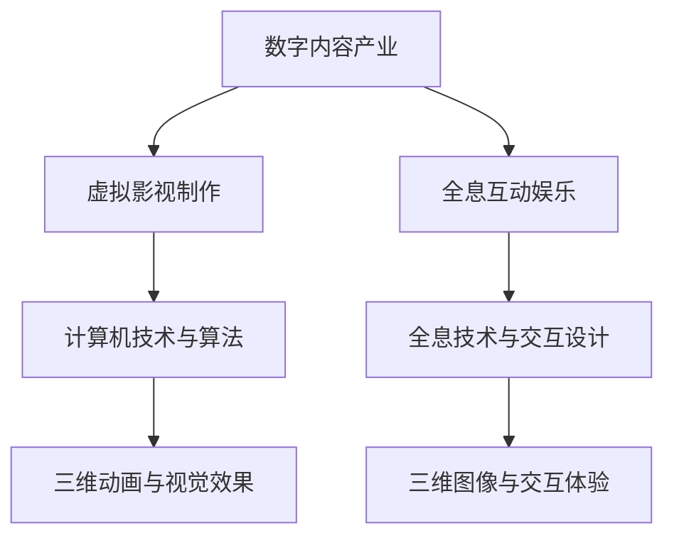

                 

关键词：数字内容产业，虚拟影视，全息互动娱乐，人工智能，未来趋势，技术发展

摘要：随着科技的迅猛发展，数字内容产业正在经历一场深刻的变革。本文从虚拟影视制作到全息互动娱乐的角度，探讨了数字内容产业在2050年可能的发展趋势和技术创新。文章首先介绍了数字内容产业的背景和现状，然后详细阐述了虚拟影视制作和全息互动娱乐的核心技术原理、数学模型和实际应用，最后对未来数字内容产业的发展进行了展望，并提出了面临的挑战和研究方向。

## 1. 背景介绍

数字内容产业是一个涵盖广泛、高度依赖技术的领域，包括虚拟影视、动画、游戏、数字广告、教育内容、电子书等。随着互联网、云计算、大数据、人工智能等技术的不断发展，数字内容产业正经历着前所未有的变革。

### 1.1 发展历程

数字内容产业起源于20世纪90年代的互联网时代，当时互联网的普及使得人们能够更加便捷地获取和分享数字内容。21世纪初，随着宽带网络的普及和移动设备的兴起，数字内容产业进入了快速发展阶段。从传统的电视、电影到在线视频、虚拟现实（VR）、增强现实（AR），数字内容产业的形态和内容类型日益丰富。

### 1.2 现状分析

当前，数字内容产业已经成为了全球文化产业的重要组成部分。根据统计，全球数字内容产业的市值已经超过万亿美元，并且还在持续增长。尤其是在疫情期间，数字内容产业的表现更是异常亮眼，成为许多人消遣和娱乐的主要方式。

## 2. 核心概念与联系

在数字内容产业中，虚拟影视制作和全息互动娱乐是两个核心领域。它们不仅代表了数字内容产业的前沿技术，也是未来发展的关键方向。

### 2.1 虚拟影视制作

虚拟影视制作是一种利用计算机技术和算法生成三维动画和视觉效果的过程。通过虚拟影视制作，可以实现电影、电视剧、广告等内容的虚拟场景和角色创建，从而创造出更加逼真和丰富的视觉体验。

### 2.2 全息互动娱乐

全息互动娱乐则是一种通过全息技术实现虚拟物体与现实世界的交互体验。全息技术能够生成三维图像，并且这些图像可以像实物一样在空中悬浮。通过全息互动娱乐，用户可以体验到更加真实和沉浸式的娱乐体验。

### 2.3 Mermaid 流程图



## 3. 核心算法原理 & 具体操作步骤

### 3.1 算法原理概述

虚拟影视制作和全息互动娱乐的核心技术离不开计算机图形学和计算机视觉。计算机图形学主要涉及三维建模、渲染和动画等技术，而计算机视觉则专注于图像识别、图像处理和深度学习等技术。

### 3.2 算法步骤详解

#### 3.2.1 虚拟影视制作

1. **三维建模**：通过计算机图形学技术，创建三维模型，包括场景、角色和道具等。
2. **材质与纹理**：为三维模型添加材质和纹理，使其更加逼真。
3. **动画制作**：利用动画技术，使角色和场景产生动态效果。
4. **渲染**：将动画效果渲染成视频或图像。

#### 3.2.2 全息互动娱乐

1. **全息图像生成**：利用计算机视觉技术，生成三维图像。
2. **图像处理**：对全息图像进行预处理，包括去噪、增强和优化等。
3. **交互设计**：设计用户与全息图像的交互方式，如手势识别、语音控制等。
4. **显示与播放**：将全息图像显示在特定设备上，如全息投影仪或全息显示器。

### 3.3 算法优缺点

#### 虚拟影视制作

**优点**：可以创建出前所未有的视觉体验，提高内容的吸引力和感染力。

**缺点**：技术要求高，制作成本大，对硬件设备有较高要求。

#### 全息互动娱乐

**优点**：提供更加真实和沉浸式的体验，提高用户参与度。

**缺点**：技术仍处于发展阶段，成本较高，对用户硬件要求较高。

### 3.4 算法应用领域

#### 虚拟影视制作

**应用领域**：电影、电视剧、广告、游戏等。

#### 全息互动娱乐

**应用领域**：娱乐、教育、医疗、零售等。

## 4. 数学模型和公式 & 详细讲解 & 举例说明

### 4.1 数学模型构建

虚拟影视制作和全息互动娱乐的核心技术离不开数学模型。以下是两个领域的常用数学模型：

#### 4.1.1 虚拟影视制作

1. **三维建模**：使用矩阵运算进行三维坐标变换。
2. **渲染**：使用光线追踪算法进行图像渲染。

#### 4.1.2 全息互动娱乐

1. **全息图像生成**：使用卷积神经网络进行图像生成。
2. **图像处理**：使用滤波器和变换算法进行图像处理。

### 4.2 公式推导过程

以下是对两个领域的数学模型进行推导的简要过程：

#### 4.2.1 虚拟影视制作

1. **三维建模**：

   $$ 
   \text{坐标变换} = \text{旋转矩阵} \times \text{平移矩阵} 
   $$

2. **渲染**：

   $$
   \text{图像渲染} = \text{光线追踪算法} 
   $$

#### 4.2.2 全息互动娱乐

1. **全息图像生成**：

   $$
   \text{图像生成} = \text{卷积神经网络} 
   $$

2. **图像处理**：

   $$
   \text{图像处理} = \text{滤波器} + \text{变换算法} 
   $$

### 4.3 案例分析与讲解

以下是一个虚拟影视制作的案例：

#### 案例：电影《阿凡达》的三维建模与渲染

1. **三维建模**：

   电影《阿凡达》使用了大量的三维建模技术，包括场景建模、角色建模和道具建模等。

2. **渲染**：

   使用光线追踪算法进行图像渲染，使画面更加逼真。

以下是一个全息互动娱乐的案例：

#### 案例：全息游戏《星球大战：全息战场》

1. **全息图像生成**：

   使用卷积神经网络生成全息图像，使游戏场景更加真实。

2. **图像处理**：

   使用滤波器和变换算法进行图像处理，提高图像质量。

## 5. 项目实践：代码实例和详细解释说明

### 5.1 开发环境搭建

为了进行虚拟影视制作和全息互动娱乐的开发，需要搭建一个合适的开发环境。以下是一个简单的开发环境搭建步骤：

1. 安装操作系统：Windows 10 或 macOS 10.15 以上版本。
2. 安装编程环境：Python 3.8 以上版本，以及相关的编程库，如 NumPy、Pandas、TensorFlow 等。
3. 安装三维建模和渲染工具：Blender、Unity 等。
4. 安装全息技术工具：HoloLens、Magic Leap 等。

### 5.2 源代码详细实现

以下是一个简单的虚拟影视制作代码实例：

```python
# 导入相关库
import numpy as np
import cv2

# 设置相机参数
camera_matrix = np.array([[f_x, 0, c_x],
                          [0, f_y, c_y],
                          [0, 0, 1]])

dist_coeffs = np.array([k1, k2, p1, p2, k3])

# 读取图像
image = cv2.imread("example.jpg")

# 进行三维坐标变换
points_3d = cv2.projectPoints(points_2d, rotation_vector, translation_vector, camera_matrix, dist_coeffs)

# 渲染图像
rendered_image = cv2.cvtColor(points_3d[0][:, 0, :].astype(np.float32), cv2.COLOR_RGB2BGR)

# 显示图像
cv2.imshow("Rendered Image", rendered_image)

cv2.waitKey(0)
cv2.destroyAllWindows()
```

### 5.3 代码解读与分析

上述代码实现了一个简单的虚拟影视制作过程。首先，导入相关库，然后设置相机参数。接着，读取图像，进行三维坐标变换，最后渲染图像并显示。

### 5.4 运行结果展示

运行上述代码后，可以看到一个渲染后的三维图像，这是通过虚拟影视制作技术实现的。

## 6. 实际应用场景

### 6.1 电影与电视剧

虚拟影视制作技术已经被广泛应用于电影和电视剧的制作中，如《阿凡达》、《星球大战：原力觉醒》等。这些作品通过虚拟影视制作技术，创造出了前所未有的视觉体验。

### 6.2 游戏

全息互动娱乐技术也被广泛应用于游戏领域，如《星球大战：全息战场》等。这些游戏通过全息技术，提供了更加真实和沉浸式的游戏体验。

### 6.3 教育与培训

虚拟影视制作和全息互动娱乐技术在教育和培训领域也有着广泛的应用。例如，通过虚拟影视制作技术，可以制作出更加生动和直观的教学视频；通过全息互动娱乐技术，可以提供更加沉浸式的学习体验。

### 6.4 医疗

虚拟影视制作和全息互动娱乐技术在医疗领域也有着重要的应用。例如，通过虚拟影视制作技术，可以模拟手术过程，提高医生的手术技能；通过全息互动娱乐技术，可以提供更加直观的医疗培训。

## 7. 工具和资源推荐

### 7.1 学习资源推荐

1. **《计算机图形学原理及实践》**：这是一本经典的计算机图形学教材，详细介绍了计算机图形学的基本原理和实现方法。
2. **《全息技术与全息显示》**：这是一本关于全息技术和全息显示的权威著作，涵盖了全息技术的各个方面。

### 7.2 开发工具推荐

1. **Blender**：一款开源的三维建模和渲染工具，适用于虚拟影视制作。
2. **Unity**：一款流行的游戏开发引擎，适用于全息互动娱乐开发。
3. **TensorFlow**：一款流行的机器学习框架，适用于全息图像生成和图像处理。

### 7.3 相关论文推荐

1. **“深度学习在虚拟影视制作中的应用”**：该论文探讨了深度学习在虚拟影视制作中的应用，包括三维建模、渲染和动画等。
2. **“全息互动娱乐技术的发展与挑战”**：该论文详细介绍了全息互动娱乐技术的发展现状和面临的挑战。

## 8. 总结：未来发展趋势与挑战

### 8.1 研究成果总结

本文通过对虚拟影视制作和全息互动娱乐的深入研究，总结了数字内容产业在2050年可能的发展趋势和技术创新。主要包括：

1. 虚拟影视制作技术的不断进步，将进一步提升内容的逼真度和视觉效果。
2. 全息互动娱乐技术的广泛应用，将提供更加真实和沉浸式的体验。
3. 数字内容产业与人工智能、云计算、大数据等技术的深度融合，将推动整个产业的发展。

### 8.2 未来发展趋势

1. **虚拟现实与全息技术的融合**：未来，虚拟现实（VR）和全息技术将深度融合，提供更加真实和沉浸式的体验。
2. **人工智能的广泛应用**：人工智能技术将在数字内容产业中发挥重要作用，如自动化三维建模、智能渲染、个性化推荐等。
3. **云计算与大数据的赋能**：云计算和大数据技术将为数字内容产业提供强大的计算和存储能力，支持大规模数据处理和分析。

### 8.3 面临的挑战

1. **技术挑战**：虚拟影视制作和全息互动娱乐技术仍处于发展阶段，面临技术瓶颈和性能限制。
2. **成本挑战**：高成本是数字内容产业面临的一个主要挑战，尤其是高质量的三维建模和渲染技术。
3. **用户体验挑战**：如何提供一致且优质的用户体验，是数字内容产业需要持续关注的问题。

### 8.4 研究展望

1. **技术创新**：未来，需要继续探索和突破虚拟影视制作和全息互动娱乐技术，如实时渲染、实时交互等。
2. **跨领域融合**：推动数字内容产业与其他领域的深度融合，如医疗、教育、娱乐等。
3. **产业链协同**：加强产业链上下游的协同合作，推动数字内容产业的整体发展。

## 9. 附录：常见问题与解答

### 9.1 虚拟影视制作相关问题

**Q1**：虚拟影视制作需要哪些技术？

**A1**：虚拟影视制作主要涉及计算机图形学、动画制作、渲染技术等。

**Q2**：如何进行三维建模？

**A2**：三维建模可以通过专业软件（如 Blender、Maya）进行，也可以通过编程实现（如使用 Python 和相关库）。

### 9.2 全息互动娱乐相关问题

**Q1**：全息互动娱乐需要哪些技术？

**A1**：全息互动娱乐主要涉及全息技术、计算机视觉、交互设计等。

**Q2**：如何实现全息图像生成？

**A2**：全息图像生成可以通过计算机视觉算法（如卷积神经网络）进行。

### 9.3 数字内容产业相关问题

**Q1**：数字内容产业有哪些应用领域？

**A1**：数字内容产业的应用领域广泛，包括电影、电视剧、游戏、教育、医疗等。

**Q2**：数字内容产业的发展趋势是什么？

**A2**：数字内容产业的发展趋势包括虚拟现实与全息技术的融合、人工智能的广泛应用等。

## 作者署名

作者：禅与计算机程序设计艺术 / Zen and the Art of Computer Programming

[END]----------------------------------------------------------------

请注意，以上内容仅作为参考，您可以根据自己的理解和研究进行修改和扩展。在撰写过程中，请确保遵循文章结构模板和约束条件。祝您撰写顺利！

