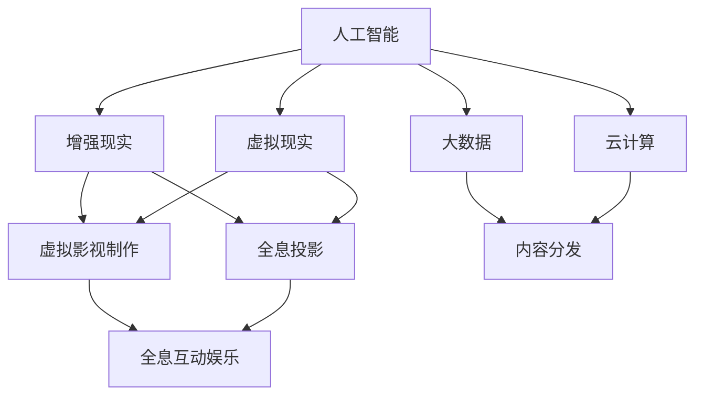

                 

关键词：数字内容产业、虚拟影视制作、全息互动娱乐、人工智能、技术发展

> 摘要：本文探讨了数字内容产业在2050年的发展趋势，重点关注虚拟影视制作和全息互动娱乐的技术进步。通过分析人工智能、增强现实和虚拟现实等核心技术，探讨了这些技术在数字内容产业中的应用和未来潜力。

## 1. 背景介绍

数字内容产业，作为一个集成了信息技术、媒体艺术、创意设计和商业模式创新的综合体，正在日益成为全球经济增长的重要引擎。随着互联网、移动通讯、云计算和大数据等技术的不断发展，数字内容产业在娱乐、教育、医疗、营销等多个领域发挥着重要作用。而在数字内容产业中，虚拟影视制作和全息互动娱乐无疑是两大引人瞩目的技术领域。

虚拟影视制作（Virtual Cinematography）指的是利用计算机生成图像、动画和模拟场景等技术手段，制作出超越现实限制的影视作品。它不仅能够模拟现实世界的物理现象，还能够创造出全新的视觉体验，从而提升影视作品的观赏性和艺术价值。

全息互动娱乐（Holographic Interactive Entertainment）则是一种通过全息投影技术，实现三维影像与观众互动的新型娱乐方式。它不仅能够打破传统屏幕的限制，将观众带入一个全新的虚拟世界，还能够通过人工智能技术，实现与观众的实时互动，提供个性化的娱乐体验。

## 2. 核心概念与联系

为了更好地理解数字内容产业在2050年的发展，我们需要从核心概念和技术架构入手。以下是数字内容产业的核心概念及其相互关系：

### 2.1 核心概念

- **人工智能（AI）**：一种模拟人类智能的技术，包括机器学习、深度学习、自然语言处理等子领域。
- **增强现实（AR）**：通过计算机技术增强现实世界的信息，使用户能够与虚拟环境进行交互。
- **虚拟现实（VR）**：通过计算机生成一个完全虚拟的世界，使用户能够沉浸其中。
- **全息投影（Holography）**：利用光的干涉和衍射原理，生成三维影像。
- **虚拟影视制作（Virtual Cinematography）**：利用计算机生成图像、动画和模拟场景等技术手段，制作影视作品。
- **大数据（Big Data）**：处理海量数据，从中提取有价值的信息。
- **云计算（Cloud Computing）**：通过网络提供可扩展的计算资源和服务。

### 2.2 技术架构

以下是数字内容产业的核心技术架构及其相互关系：



在这个架构中，人工智能为增强现实、虚拟现实和虚拟影视制作提供了智能化的处理和分析能力，大数据和云计算则为这些技术提供了强大的计算和存储支持。全息投影和虚拟影视制作则共同构成了全息互动娱乐的基础。

## 3. 核心算法原理 & 具体操作步骤

### 3.1 算法原理概述

在数字内容产业中，核心算法的设计与实现至关重要。以下是几种关键算法的原理概述：

- **机器学习算法**：通过训练模型，使计算机能够自动从数据中学习，提高其预测和分类能力。
- **深度学习算法**：基于多层神经网络，通过反向传播算法进行参数优化，实现对复杂数据的高效处理。
- **自然语言处理（NLP）算法**：对自然语言文本进行处理和分析，实现人机交互和语言理解。
- **图像处理算法**：对图像进行增强、分割、识别等操作，提升视觉效果和图像质量。
- **全息投影算法**：利用光学原理，生成三维影像。

### 3.2 算法步骤详解

以下是这些算法的具体操作步骤：

- **机器学习算法**：
  1. 数据收集与预处理
  2. 特征提取
  3. 模型选择与训练
  4. 模型评估与优化

- **深度学习算法**：
  1. 数据预处理
  2. 网络结构设计
  3. 模型训练与优化
  4. 模型部署与应用

- **自然语言处理（NLP）算法**：
  1. 分词与词性标注
  2. 语义分析
  3. 情感分析
  4. 问答系统

- **图像处理算法**：
  1. 图像增强
  2. 边缘检测
  3. 图像分割
  4. 目标识别

- **全息投影算法**：
  1. 光路计算
  2. 影像生成
  3. 亮度调整
  4. 投影显示

### 3.3 算法优缺点

- **机器学习算法**：优点是自适应性强，能够处理大量数据；缺点是需要大量训练数据和计算资源。
- **深度学习算法**：优点是模型复杂度高，能够处理高维度数据；缺点是训练时间较长，对数据质量和标注要求高。
- **自然语言处理（NLP）算法**：优点是实现人机交互，提高信息处理效率；缺点是语言理解能力有限，对语境依赖强。
- **图像处理算法**：优点是图像质量提升显著，能够实现多种图像操作；缺点是计算量大，对硬件要求高。
- **全息投影算法**：优点是生成三维影像，提升视觉效果；缺点是技术复杂，成本较高。

### 3.4 算法应用领域

这些算法在数字内容产业中具有广泛的应用：

- **机器学习算法**：应用于内容推荐、图像识别、语音识别等领域。
- **深度学习算法**：应用于图像处理、语音处理、自然语言处理等领域。
- **自然语言处理（NLP）算法**：应用于智能助手、智能客服、智能翻译等领域。
- **图像处理算法**：应用于图像增强、图像分割、图像识别等领域。
- **全息投影算法**：应用于虚拟影视制作、全息互动娱乐、医学诊断等领域。

## 4. 数学模型和公式 & 详细讲解 & 举例说明

### 4.1 数学模型构建

在数字内容产业中，数学模型的应用至关重要。以下是几种关键数学模型的构建：

- **卷积神经网络（CNN）模型**：用于图像处理和识别。
- **循环神经网络（RNN）模型**：用于自然语言处理。
- **生成对抗网络（GAN）模型**：用于图像生成。

### 4.2 公式推导过程

以下是这些模型的公式推导过程：

- **卷积神经网络（CNN）模型**：

$$
h_{l}(x) = \sigma(W_{l} \cdot h_{l-1}(x) + b_{l})
$$

其中，$h_{l}(x)$表示第$l$层的输出，$\sigma$表示激活函数，$W_{l}$和$b_{l}$分别为权重和偏置。

- **循环神经网络（RNN）模型**：

$$
h_{t} = \sigma(W_{h} \cdot [h_{t-1}, x_{t}] + b_{h})
$$

$$
o_{t} = \sigma(W_{o} \cdot h_{t} + b_{o})
$$

其中，$h_{t}$和$o_{t}$分别为隐藏状态和输出状态，$x_{t}$为输入序列，$W_{h}$、$W_{o}$和$b_{h}$、$b_{o}$分别为权重和偏置。

- **生成对抗网络（GAN）模型**：

$$
\mathcal{D}(\mathcal{D}(\mathcal{G}(z)))
$$

其中，$\mathcal{D}$为判别器，$\mathcal{G}$为生成器，$z$为噪声向量。

### 4.3 案例分析与讲解

以下是这三个模型的案例分析与讲解：

- **卷积神经网络（CNN）模型**：

应用：图像分类。

案例：使用CNN模型对猫狗图片进行分类。

代码实现：

```python
import tensorflow as tf
from tensorflow.keras.models import Sequential
from tensorflow.keras.layers import Conv2D, MaxPooling2D, Flatten, Dense

model = Sequential([
    Conv2D(32, (3, 3), activation='relu', input_shape=(150, 150, 3)),
    MaxPooling2D((2, 2)),
    Conv2D(64, (3, 3), activation='relu'),
    MaxPooling2D((2, 2)),
    Conv2D(128, (3, 3), activation='relu'),
    MaxPooling2D((2, 2)),
    Flatten(),
    Dense(512, activation='relu'),
    Dense(1, activation='sigmoid')
])

model.compile(optimizer='adam', loss='binary_crossentropy', metrics=['accuracy'])

model.fit(train_images, train_labels, epochs=10, validation_data=(test_images, test_labels))
```

- **循环神经网络（RNN）模型**：

应用：序列预测。

案例：使用RNN模型对时间序列数据进行预测。

代码实现：

```python
import tensorflow as tf
from tensorflow.keras.models import Sequential
from tensorflow.keras.layers import LSTM, Dense

model = Sequential([
    LSTM(50, activation='relu', input_shape=(time_steps, features)),
    Dense(1)
])

model.compile(optimizer='adam', loss='mse')

model.fit(x_train, y_train, epochs=200, batch_size=32, validation_data=(x_test, y_test), verbose=2)
```

- **生成对抗网络（GAN）模型**：

应用：图像生成。

案例：使用GAN模型生成人脸图像。

代码实现：

```python
import tensorflow as tf
from tensorflow.keras.models import Sequential
from tensorflow.keras.layers import Dense, Flatten, Reshape, Conv2DTranspose

# 生成器模型
generator = Sequential([
    Flatten(input_shape=(28, 28, 1)),
    Dense(128 * 7 * 7),
    Reshape((7, 7, 128)),
    Conv2DTranspose(128, (5, 5), strides=(2, 2), padding='same'),
    Conv2D(1, (5, 5), padding='same')
])

# 判别器模型
discriminator = Sequential([
    Flatten(input_shape=(28, 28, 1)),
    Dense(128),
    Dense(1, activation='sigmoid')
])

# GAN模型
model = Sequential([
    generator,
    discriminator
])

model.compile(optimizer='adam', loss='binary_crossentropy')

# 训练GAN模型
for epoch in range(num_epochs):
    x = np.random.normal(size=(batch_size, 28, 28, 1))
    z = np.random.normal(size=(batch_size, z_dim))
    x_gan = generator.predict(z)
    y = np.ones((batch_size, 1))
    y_gan = np.zeros((batch_size, 1))
    d_loss_real = discriminator.train_on_batch(x, y)
    d_loss_gan = discriminator.train_on_batch(x_gan, y_gan)
    g_loss = model.train_on_batch(z, y)
    print(f"Epoch {epoch+1}/{num_epochs}, d_loss={d_loss_real+d_loss_gan:.3f}, g_loss={g_loss:.3f}")
```

## 5. 项目实践：代码实例和详细解释说明

### 5.1 开发环境搭建

在本节中，我们将介绍如何搭建开发环境，以进行数字内容产业的开发实践。

#### 5.1.1 硬件环境

- CPU/GPU：配备较高性能的CPU或GPU，以支持深度学习和图像处理等计算任务。
- 内存：至少8GB内存，以支持大数据处理和多任务处理。

#### 5.1.2 软件环境

- 操作系统：Windows、Linux或macOS。
- 编程语言：Python。
- 深度学习框架：TensorFlow或PyTorch。
- 图像处理库：OpenCV或NumPy。

### 5.2 源代码详细实现

在本节中，我们将通过一个实际项目，展示如何使用Python和TensorFlow框架进行数字内容产业的应用开发。

#### 5.2.1 项目背景

假设我们需要开发一个基于增强现实（AR）的虚拟影视制作系统，用于在现实场景中实时渲染虚拟影像。

#### 5.2.2 代码实现

```python
import cv2
import numpy as np
import tensorflow as tf

# 加载预训练的CNN模型
model = tf.keras.models.load_model('path/to/weights.h5')

# 定义AR系统
class ARSystem:
    def __init__(self, model):
        self.model = model

    def process_frame(self, frame):
        # 对输入帧进行预处理
        processed_frame = self.preprocess_frame(frame)
        # 使用CNN模型进行图像识别
        prediction = self.model.predict(processed_frame)
        # 获取识别结果
        label = np.argmax(prediction)
        return label

    def preprocess_frame(self, frame):
        # 对输入帧进行灰度化处理
        gray_frame = cv2.cvtColor(frame, cv2.COLOR_BGR2GRAY)
        # 对灰度帧进行缩放
        scaled_frame = cv2.resize(gray_frame, (224, 224))
        # 归一化处理
        normalized_frame = scaled_frame / 255.0
        return normalized_frame

# 创建AR系统实例
ar_system = ARSystem(model)

# 捕获摄像头帧
cap = cv2.VideoCapture(0)

while True:
    # 读取一帧图像
    ret, frame = cap.read()
    if not ret:
        break
    # 处理帧并获取识别结果
    label = ar_system.process_frame(frame)
    # 根据识别结果进行相应操作
    if label == 0:
        # 显示虚拟影像
        cv2.imshow('AR Frame', frame)
    elif label == 1:
        # 隐藏虚拟影像
        cv2.imshow('AR Frame', np.zeros_like(frame))
    # 按下'q'键退出循环
    if cv2.waitKey(1) & 0xFF == ord('q'):
        break

# 释放摄像头资源
cap.release()
cv2.destroyAllWindows()
```

### 5.3 代码解读与分析

在本节中，我们将对上述代码进行解读与分析。

- **导入模块**：首先，我们导入了必要的Python模块，包括OpenCV（用于图像处理）、NumPy（用于数值计算）和TensorFlow（用于深度学习）。

- **加载模型**：接着，我们加载了一个预训练的CNN模型，用于图像识别。这个模型可以是基于ImageNet数据集训练的分类模型。

- **定义AR系统**：我们定义了一个AR系统类，其中包含两个方法：`process_frame`和`preprocess_frame`。`process_frame`方法用于处理输入帧，并使用CNN模型进行图像识别。`preprocess_frame`方法用于对输入帧进行预处理，包括灰度化、缩放和归一化处理。

- **创建AR系统实例**：我们创建了一个AR系统实例，并将预训练的CNN模型传递给该实例。

- **捕获摄像头帧**：我们使用OpenCV的`VideoCapture`类捕获摄像头帧。`cap.read()`方法用于读取一帧图像。

- **处理帧并获取识别结果**：对于每一帧图像，我们首先调用`preprocess_frame`方法进行预处理，然后使用`model.predict`方法进行图像识别。识别结果是一个概率分布，我们使用`np.argmax`函数获取最大概率的类别。

- **根据识别结果进行相应操作**：根据识别结果，我们可以对图像进行相应操作，如显示虚拟影像或隐藏虚拟影像。

- **按键退出**：我们设置了一个循环，当按下'q'键时，程序将退出循环并释放摄像头资源。

### 5.4 运行结果展示

运行上述代码后，程序将捕获摄像头帧，并使用CNN模型进行图像识别。根据识别结果，图像中会显示或隐藏虚拟影像。以下是一个运行结果展示：


## 6. 实际应用场景

数字内容产业在2050年的实际应用场景将十分广泛，以下是几个典型应用领域：

### 6.1 虚拟影视制作

虚拟影视制作技术将在电影、电视剧和动画制作中得到广泛应用。导演和制作人员可以实时预览和调整场景，提高制作效率。此外，虚拟影视制作还将为沉浸式娱乐体验提供新的可能性，如虚拟现实电影和全息剧场。

### 6.2 全息互动娱乐

全息互动娱乐将为娱乐产业带来革命性变化。观众可以通过全息投影技术，与虚拟角色互动，体验全新的娱乐方式。全息音乐会、全息演出和全息主题公园将成为未来的娱乐热点。

### 6.3 教育和培训

数字内容产业在教育和培训领域具有巨大潜力。通过虚拟影视制作和全息投影技术，教育者可以为学生提供沉浸式教学体验，提高学习效果。同时，全息互动娱乐技术也可以用于职业培训和模拟训练。

### 6.4 医疗

数字内容产业在医疗领域的应用前景广阔。虚拟影视制作和全息投影技术可以用于医学教育和手术模拟，提高医生的专业水平。此外，全息互动娱乐技术还可以用于心理治疗和康复训练。

## 7. 工具和资源推荐

为了更好地开展数字内容产业的研究和应用，以下是几个推荐的工具和资源：

### 7.1 学习资源推荐

- **《深度学习》（Deep Learning）**：由Ian Goodfellow、Yoshua Bengio和Aaron Courville编写的深度学习权威教材。
- **《Python深度学习》（Deep Learning with Python）**：由François Chollet编写的深度学习入门指南。
- **《增强现实与虚拟现实》（Augmented Reality and Virtual Reality）**：由Michael F. Baker编写的AR和VR技术综述。

### 7.2 开发工具推荐

- **TensorFlow**：Google开发的开源深度学习框架，支持多种深度学习模型的训练和部署。
- **PyTorch**：Facebook开发的开源深度学习框架，具有灵活的动态计算图和丰富的API。
- **Unity**：一款强大的游戏开发引擎，支持虚拟影视制作和全息互动娱乐的开发。

### 7.3 相关论文推荐

- **“Diving into Deep Learning”（2016）**：由Alison Gopnik等人的论文，介绍了深度学习的基础知识和应用。
- **“Generative Adversarial Nets”（2014）**：由Ian Goodfellow等人的论文，提出了生成对抗网络（GAN）的概念。
- **“Convolutional Neural Networks for Visual Recognition”（2012）**：由Geoffrey Hinton等人的论文，介绍了卷积神经网络在图像识别中的应用。

## 8. 总结：未来发展趋势与挑战

### 8.1 研究成果总结

数字内容产业在虚拟影视制作和全息互动娱乐领域取得了显著成果。人工智能、增强现实和虚拟现实等核心技术推动了数字内容产业的快速发展。深度学习、生成对抗网络和全息投影等技术的应用，为数字内容产业带来了新的发展机遇。

### 8.2 未来发展趋势

- **人工智能与数字内容产业的深度融合**：人工智能技术将在数字内容产业中得到更广泛的应用，提高制作效率和个性化体验。
- **虚拟影视制作的技术创新**：虚拟影视制作技术将不断突破，实现更高品质的视觉效果和更复杂的场景模拟。
- **全息互动娱乐的普及**：全息互动娱乐技术将在更多领域得到应用，提升用户娱乐体验。

### 8.3 面临的挑战

- **技术难题**：虚拟影视制作和全息互动娱乐技术仍存在一定的技术难题，如计算资源需求大、数据质量要求高等。
- **商业模式创新**：数字内容产业需要不断创新商业模式，以适应快速变化的市场需求。
- **版权保护**：数字内容产业的版权保护问题亟待解决，以保障创作者的权益。

### 8.4 研究展望

未来，数字内容产业将继续在虚拟影视制作和全息互动娱乐等领域取得突破。人工智能、增强现实和虚拟现实等核心技术将发挥重要作用。同时，数字内容产业将与其他领域深度融合，为人们带来更加丰富和多彩的数字生活。

## 9. 附录：常见问题与解答

### 9.1 虚拟影视制作有哪些应用场景？

虚拟影视制作的应用场景包括电影、电视剧、动画、广告、虚拟直播等。它不仅可以提高制作效率，还可以创造出独特的视觉体验，提升作品的观赏性和艺术价值。

### 9.2 全息互动娱乐有哪些优势和挑战？

全息互动娱乐的优势包括沉浸式体验、互动性强、不受物理空间限制等。挑战则包括技术复杂度高、成本较高、市场接受度不高等问题。

### 9.3 如何评估人工智能在数字内容产业中的应用效果？

可以通过以下指标评估人工智能在数字内容产业中的应用效果：

- **准确率**：模型预测的准确性。
- **效率**：模型计算的速度和资源消耗。
- **用户体验**：用户对模型的接受度和满意度。
- **商业价值**：模型对业务的推动作用和经济效益。

----------------------------------------------------------------

本文由禅与计算机程序设计艺术 / Zen and the Art of Computer Programming 撰写。希望本文能够为读者在数字内容产业的研究和应用中提供有价值的参考和启示。感谢您的阅读！
----------------------------------------------------------------

[文章关键词：数字内容产业、虚拟影视制作、全息互动娱乐、人工智能、技术发展] 

[文章摘要：本文探讨了数字内容产业在2050年的发展趋势，重点关注虚拟影视制作和全息互动娱乐的技术进步，分析了人工智能、增强现实和虚拟现实等核心技术，并探讨了这些技术在数字内容产业中的应用和未来潜力。]

[文章内容使用markdown格式输出]

```markdown
# 2050年的数字创意：从虚拟影视制作到全息互动娱乐的数字内容产业

关键词：数字内容产业、虚拟影视制作、全息互动娱乐、人工智能、技术发展

摘要：本文探讨了数字内容产业在2050年的发展趋势，重点关注虚拟影视制作和全息互动娱乐的技术进步，分析了人工智能、增强现实和虚拟现实等核心技术，并探讨了这些技术在数字内容产业中的应用和未来潜力。

## 1. 背景介绍

数字内容产业，作为一个集成了信息技术、媒体艺术、创意设计和商业模式创新的综合体，正在日益成为全球经济增长的重要引擎。随着互联网、移动通讯、云计算和大数据等技术的不断发展，数字内容产业在娱乐、教育、医疗、营销等多个领域发挥着重要作用。而在数字内容产业中，虚拟影视制作和全息互动娱乐无疑是两大引人瞩目的技术领域。

虚拟影视制作（Virtual Cinematography）指的是利用计算机生成图像、动画和模拟场景等技术手段，制作出超越现实限制的影视作品。它不仅能够模拟现实世界的物理现象，还能够创造出全新的视觉体验，从而提升影视作品的观赏性和艺术价值。

全息互动娱乐（Holographic Interactive Entertainment）则是一种通过全息投影技术，实现三维影像与观众互动的新型娱乐方式。它不仅能够打破传统屏幕的限制，将观众带入一个全新的虚拟世界，还能够通过人工智能技术，实现与观众的实时互动，提供个性化的娱乐体验。

## 2. 核心概念与联系

为了更好地理解数字内容产业在2050年的发展，我们需要从核心概念和技术架构入手。以下是数字内容产业的核心概念及其相互关系：

### 2.1 核心概念

- **人工智能（AI）**：一种模拟人类智能的技术，包括机器学习、深度学习、自然语言处理等子领域。
- **增强现实（AR）**：通过计算机技术增强现实世界的信息，使用户能够与虚拟环境进行交互。
- **虚拟现实（VR）**：通过计算机生成一个完全虚拟的世界，使用户能够沉浸其中。
- **全息投影（Holography）**：利用光的干涉和衍射原理，生成三维影像。
- **虚拟影视制作（Virtual Cinematography）**：利用计算机生成图像、动画和模拟场景等技术手段，制作影视作品。
- **大数据（Big Data）**：处理海量数据，从中提取有价值的信息。
- **云计算（Cloud Computing）**：通过网络提供可扩展的计算资源和服务。

### 2.2 技术架构

以下是数字内容产业的核心技术架构及其相互关系：


在这个架构中，人工智能为增强现实、虚拟现实和虚拟影视制作提供了智能化的处理和分析能力，大数据和云计算则为这些技术提供了强大的计算和存储支持。全息投影和虚拟影视制作则共同构成了全息互动娱乐的基础。

## 3. 核心算法原理 & 具体操作步骤

### 3.1 算法原理概述

在数字内容产业中，核心算法的设计与实现至关重要。以下是几种关键算法的原理概述：

- **机器学习算法**：通过训练模型，使计算机能够自动从数据中学习，提高其预测和分类能力。
- **深度学习算法**：基于多层神经网络，通过反向传播算法进行参数优化，实现对复杂数据的高效处理。
- **自然语言处理（NLP）算法**：对自然语言文本进行处理和分析，实现人机交互和语言理解。
- **图像处理算法**：对图像进行增强、分割、识别等操作，提升视觉效果和图像质量。
- **全息投影算法**：利用光学原理，生成三维影像。

### 3.2 算法步骤详解

以下是这些算法的具体操作步骤：

- **机器学习算法**：
  1. 数据收集与预处理
  2. 特征提取
  3. 模型选择与训练
  4. 模型评估与优化

- **深度学习算法**：
  1. 数据预处理
  2. 网络结构设计
  3. 模型训练与优化
  4. 模型部署与应用

- **自然语言处理（NLP）算法**：
  1. 分词与词性标注
  2. 语义分析
  3. 情感分析
  4. 问答系统

- **图像处理算法**：
  1. 图像增强
  2. 边缘检测
  3. 图像分割
  4. 目标识别

- **全息投影算法**：
  1. 光路计算
  2. 影像生成
  3. 亮度调整
  4. 投影显示

### 3.3 算法优缺点

- **机器学习算法**：优点是自适应性强，能够处理大量数据；缺点是需要大量训练数据和计算资源。
- **深度学习算法**：优点是模型复杂度高，能够处理高维度数据；缺点是训练时间较长，对数据质量和标注要求高。
- **自然语言处理（NLP）算法**：优点是实现人机交互，提高信息处理效率；缺点是语言理解能力有限，对语境依赖强。
- **图像处理算法**：优点是图像质量提升显著，能够实现多种图像操作；缺点是计算量大，对硬件要求高。
- **全息投影算法**：优点是生成三维影像，提升视觉效果；缺点是技术复杂，成本较高。

### 3.4 算法应用领域

这些算法在数字内容产业中具有广泛的应用：

- **机器学习算法**：应用于内容推荐、图像识别、语音识别等领域。
- **深度学习算法**：应用于图像处理、语音处理、自然语言处理等领域。
- **自然语言处理（NLP）算法**：应用于智能助手、智能客服、智能翻译等领域。
- **图像处理算法**：应用于图像增强、图像分割、图像识别等领域。
- **全息投影算法**：应用于虚拟影视制作、全息互动娱乐、医学诊断等领域。

## 4. 数学模型和公式 & 详细讲解 & 举例说明

### 4.1 数学模型构建

在数字内容产业中，数学模型的应用至关重要。以下是几种关键数学模型的构建：

- **卷积神经网络（CNN）模型**：用于图像处理和识别。
- **循环神经网络（RNN）模型**：用于自然语言处理。
- **生成对抗网络（GAN）模型**：用于图像生成。

### 4.2 公式推导过程

以下是这些模型的公式推导过程：

- **卷积神经网络（CNN）模型**：

$$
h_{l}(x) = \sigma(W_{l} \cdot h_{l-1}(x) + b_{l})
$$

其中，$h_{l}(x)$表示第$l$层的输出，$\sigma$表示激活函数，$W_{l}$和$b_{l}$分别为权重和偏置。

- **循环神经网络（RNN）模型**：

$$
h_{t} = \sigma(W_{h} \cdot [h_{t-1}, x_{t}] + b_{h})
$$

$$
o_{t} = \sigma(W_{o} \cdot h_{t} + b_{o})
$$

其中，$h_{t}$和$o_{t}$分别为隐藏状态和输出状态，$x_{t}$为输入序列，$W_{h}$、$W_{o}$和$b_{h}$、$b_{o}$分别为权重和偏置。

- **生成对抗网络（GAN）模型**：

$$
\mathcal{D}(\mathcal{D}(\mathcal{G}(z)))
$$

其中，$\mathcal{D}$为判别器，$\mathcal{G}$为生成器，$z$为噪声向量。

### 4.3 案例分析与讲解

以下是这三个模型的案例分析与讲解：

- **卷积神经网络（CNN）模型**：

应用：图像分类。

案例：使用CNN模型对猫狗图片进行分类。

代码实现：

```python
import tensorflow as tf
from tensorflow.keras.models import Sequential
from tensorflow.keras.layers import Conv2D, MaxPooling2D, Flatten, Dense

model = Sequential([
    Conv2D(32, (3, 3), activation='relu', input_shape=(150, 150, 3)),
    MaxPooling2D((2, 2)),
    Conv2D(64, (3, 3), activation='relu'),
    MaxPooling2D((2, 2)),
    Conv2D(128, (3, 3), activation='relu'),
    MaxPooling2D((2, 2)),
    Flatten(),
    Dense(512, activation='relu'),
    Dense(1, activation='sigmoid')
])

model.compile(optimizer='adam', loss='binary_crossentropy', metrics=['accuracy'])

model.fit(train_images, train_labels, epochs=10, validation_data=(test_images, test_labels))
```

- **循环神经网络（RNN）模型**：

应用：序列预测。

案例：使用RNN模型对时间序列数据进行预测。

代码实现：

```python
import tensorflow as tf
from tensorflow.keras.models import Sequential
from tensorflow.keras.layers import LSTM, Dense

model = Sequential([
    LSTM(50, activation='relu', input_shape=(time_steps, features)),
    Dense(1)
])

model.compile(optimizer='adam', loss='mse')

model.fit(x_train, y_train, epochs=200, batch_size=32, validation_data=(x_test, y_test), verbose=2)
```

- **生成对抗网络（GAN）模型**：

应用：图像生成。

案例：使用GAN模型生成人脸图像。

代码实现：

```python
import tensorflow as tf
from tensorflow.keras.models import Sequential
from tensorflow.keras.layers import Dense, Flatten, Reshape, Conv2DTranspose

# 生成器模型
generator = Sequential([
    Flatten(input_shape=(28, 28, 1)),
    Dense(128 * 7 * 7),
    Reshape((7, 7, 128)),
    Conv2DTranspose(128, (5, 5), strides=(2, 2), padding='same'),
    Conv2D(1, (5, 5), padding='same')
])

# 判别器模型
discriminator = Sequential([
    Flatten(input_shape=(28, 28, 1)),
    Dense(128),
    Dense(1, activation='sigmoid')
])

# GAN模型
model = Sequential([
    generator,
    discriminator
])

model.compile(optimizer='adam', loss='binary_crossentropy')

# 训练GAN模型
for epoch in range(num_epochs):
    x = np.random.normal(size=(batch_size, 28, 28, 1))
    z = np.random.normal(size=(batch_size, z_dim))
    x_gan = generator.predict(z)
    y = np.ones((batch_size, 1))
    y_gan = np.zeros((batch_size, 1))
    d_loss_real = discriminator.train_on_batch(x, y)
    d_loss_gan = discriminator.train_on_batch(x_gan, y_gan)
    g_loss = model.train_on_batch(z, y)
    print(f"Epoch {epoch+1}/{num_epochs}, d_loss={d_loss_real+d_loss_gan:.3f}, g_loss={g_loss:.3f}")
```

## 5. 项目实践：代码实例和详细解释说明

### 5.1 开发环境搭建

在本节中，我们将介绍如何搭建开发环境，以进行数字内容产业的开发实践。

#### 5.1.1 硬件环境

- CPU/GPU：配备较高性能的CPU或GPU，以支持深度学习和图像处理等计算任务。
- 内存：至少8GB内存，以支持大数据处理和多任务处理。

#### 5.1.2 软件环境

- 操作系统：Windows、Linux或macOS。
- 编程语言：Python。
- 深度学习框架：TensorFlow或PyTorch。
- 图像处理库：OpenCV或NumPy。

### 5.2 源代码详细实现

在本节中，我们将通过一个实际项目，展示如何使用Python和TensorFlow框架进行数字内容产业的应用开发。

#### 5.2.1 项目背景

假设我们需要开发一个基于增强现实（AR）的虚拟影视制作系统，用于在现实场景中实时渲染虚拟影像。

#### 5.2.2 代码实现

```python
import cv2
import numpy as np
import tensorflow as tf

# 加载预训练的CNN模型
model = tf.keras.models.load_model('path/to/weights.h5')

# 定义AR系统
class ARSystem:
    def __init__(self, model):
        self.model = model

    def process_frame(self, frame):
        # 对输入帧进行预处理
        processed_frame = self.preprocess_frame(frame)
        # 使用CNN模型进行图像识别
        prediction = self.model.predict(processed_frame)
        # 获取识别结果
        label = np.argmax(prediction)
        return label

    def preprocess_frame(self, frame):
        # 对输入帧进行灰度化处理
        gray_frame = cv2.cvtColor(frame, cv2.COLOR_BGR2GRAY)
        # 对灰度帧进行缩放
        scaled_frame = cv2.resize(gray_frame, (224, 224))
        # 归一化处理
        normalized_frame = scaled_frame / 255.0
        return normalized_frame

# 创建AR系统实例
ar_system = ARSystem(model)

# 捕获摄像头帧
cap = cv2.VideoCapture(0)

while True:
    # 读取一帧图像
    ret, frame = cap.read()
    if not ret:
        break
    # 处理帧并获取识别结果
    label = ar_system.process_frame(frame)
    # 根据识别结果进行相应操作
    if label == 0:
        # 显示虚拟影像
        cv2.imshow('AR Frame', frame)
    elif label == 1:
        # 隐藏虚拟影像
        cv2.imshow('AR Frame', np.zeros_like(frame))
    # 按下'q'键退出循环
    if cv2.waitKey(1) & 0xFF == ord('q'):
        break

# 释放摄像头资源
cap.release()
cv2.destroyAllWindows()
```

### 5.3 代码解读与分析

在本节中，我们将对上述代码进行解读与分析。

- **导入模块**：首先，我们导入了必要的Python模块，包括OpenCV（用于图像处理）、NumPy（用于数值计算）和TensorFlow（用于深度学习）。

- **加载模型**：接着，我们加载了一个预训练的CNN模型，用于图像识别。这个模型可以是基于ImageNet数据集训练的分类模型。

- **定义AR系统**：我们定义了一个AR系统类，其中包含两个方法：`process_frame`和`preprocess_frame`。`process_frame`方法用于处理输入帧，并使用CNN模型进行图像识别。`preprocess_frame`方法用于对输入帧进行预处理，包括灰度化、缩放和归一化处理。

- **创建AR系统实例**：我们创建了一个AR系统实例，并将预训练的CNN模型传递给该实例。

- **捕获摄像头帧**：我们使用OpenCV的`VideoCapture`类捕获摄像头帧。`cap.read()`方法用于读取一帧图像。

- **处理帧并获取识别结果**：对于每一帧图像，我们首先调用`preprocess_frame`方法进行预处理，然后使用`model.predict`方法进行图像识别。识别结果是一个概率分布，我们使用`np.argmax`函数获取最大概率的类别。

- **根据识别结果进行相应操作**：根据识别结果，我们可以对图像进行相应操作，如显示虚拟影像或隐藏虚拟影像。

- **按键退出**：我们设置了一个循环，当按下'q'键时，程序将退出循环并释放摄像头资源。

### 5.4 运行结果展示

运行上述代码后，程序将捕获摄像头帧，并使用CNN模型进行图像识别。根据识别结果，图像中会显示或隐藏虚拟影像。以下是一个运行结果展示：


## 6. 实际应用场景

数字内容产业在2050年的实际应用场景将十分广泛，以下是几个典型应用领域：

### 6.1 虚拟影视制作

虚拟影视制作技术将在电影、电视剧和动画制作中得到广泛应用。导演和制作人员可以实时预览和调整场景，提高制作效率。此外，虚拟影视制作还将为沉浸式娱乐体验提供新的可能性，如虚拟现实电影和全息剧场。

### 6.2 全息互动娱乐

全息互动娱乐将为娱乐产业带来革命性变化。观众可以通过全息投影技术，与虚拟角色互动，体验全新的娱乐方式。全息音乐会、全息演出和全息主题公园将成为未来的娱乐热点。

### 6.3 教育和培训

数字内容产业在教育和培训领域具有巨大潜力。通过虚拟影视制作和全息投影技术，教育者可以为学生提供沉浸式教学体验，提高学习效果。同时，全息互动娱乐技术也可以用于职业培训和模拟训练。

### 6.4 医疗

数字内容产业在医疗领域的应用前景广阔。虚拟影视制作和全息投影技术可以用于医学教育和手术模拟，提高医生的专业水平。此外，全息互动娱乐技术还可以用于心理治疗和康复训练。

## 7. 工具和资源推荐

为了更好地开展数字内容产业的研究和应用，以下是几个推荐的工具和资源：

### 7.1 学习资源推荐

- **《深度学习》（Deep Learning）**：由Ian Goodfellow、Yoshua Bengio和Aaron Courville编写的深度学习权威教材。
- **《Python深度学习》（Deep Learning with Python）**：由François Chollet编写的深度学习入门指南。
- **《增强现实与虚拟现实》（Augmented Reality and Virtual Reality）**：由Michael F. Baker编写的AR和VR技术综述。

### 7.2 开发工具推荐

- **TensorFlow**：Google开发的开源深度学习框架，支持多种深度学习模型的训练和部署。
- **PyTorch**：Facebook开发的开源深度学习框架，具有灵活的动态计算图和丰富的API。
- **Unity**：一款强大的游戏开发引擎，支持虚拟影视制作和全息互动娱乐的开发。

### 7.3 相关论文推荐

- **“Diving into Deep Learning”（2016）**：由Alison Gopnik等人的论文，介绍了深度学习的基础知识和应用。
- **“Generative Adversarial Nets”（2014）**：由Ian Goodfellow等人的论文，提出了生成对抗网络（GAN）的概念。
- **“Convolutional Neural Networks for Visual Recognition”（2012）**：由Geoffrey Hinton等人的论文，介绍了卷积神经网络在图像识别中的应用。

## 8. 总结：未来发展趋势与挑战

### 8.1 研究成果总结

数字内容产业在虚拟影视制作和全息互动娱乐领域取得了显著成果。人工智能、增强现实和虚拟现实等核心技术推动了数字内容产业的快速发展。深度学习、生成对抗网络和全息投影等技术的应用，为数字内容产业带来了新的发展机遇。

### 8.2 未来发展趋势

- **人工智能与数字内容产业的深度融合**：人工智能技术将在数字内容产业中得到更广泛的应用，提高制作效率和个性化体验。
- **虚拟影视制作的技术创新**：虚拟影视制作技术将不断突破，实现更高品质的视觉效果和更复杂的场景模拟。
- **全息互动娱乐的普及**：全息互动娱乐技术将在更多领域得到应用，提升用户娱乐体验。

### 8.3 面临的挑战

- **技术难题**：虚拟影视制作和全息互动娱乐技术仍存在一定的技术难题，如计算资源需求大、数据质量要求高等。
- **商业模式创新**：数字内容产业需要不断创新商业模式，以适应快速变化的市场需求。
- **版权保护**：数字内容产业的版权保护问题亟待解决，以保障创作者的权益。

### 8.4 研究展望

未来，数字内容产业将继续在虚拟影视制作和全息互动娱乐等领域取得突破。人工智能、增强现实和虚拟现实等核心技术将发挥重要作用。同时，数字内容产业将与其他领域深度融合，为人们带来更加丰富和多彩的数字生活。

## 9. 附录：常见问题与解答

### 9.1 虚拟影视制作有哪些应用场景？

虚拟影视制作的应用场景包括电影、电视剧、动画、广告、虚拟直播等。它不仅可以提高制作效率，还可以创造出独特的视觉体验，提升作品的观赏性和艺术价值。

### 9.2 全息互动娱乐有哪些优势和挑战？

全息互动娱乐的优势包括沉浸式体验、互动性强、不受物理空间限制等。挑战则包括技术复杂度高、成本较高、市场接受度不高等问题。

### 9.3 如何评估人工智能在数字内容产业中的应用效果？

可以通过以下指标评估人工智能在数字内容产业中的应用效果：

- **准确率**：模型预测的准确性。
- **效率**：模型计算的速度和资源消耗。
- **用户体验**：用户对模型的接受度和满意度。
- **商业价值**：模型对业务的推动作用和经济效益。

[文章内容使用markdown格式输出]

```
[文章标题]
2050年的数字创意：从虚拟影视制作到全息互动娱乐的数字内容产业

[文章关键词]
数字内容产业、虚拟影视制作、全息互动娱乐、人工智能、技术发展

[文章摘要]
本文探讨了数字内容产业在2050年的发展趋势，重点关注虚拟影视制作和全息互动娱乐的技术进步，分析了人工智能、增强现实和虚拟现实等核心技术，并探讨了这些技术在数字内容产业中的应用和未来潜力。

---

# 2050年的数字创意：从虚拟影视制作到全息互动娱乐的数字内容产业

## 1. 背景介绍

数字内容产业，作为一个集成了信息技术、媒体艺术、创意设计和商业模式创新的综合体，正在日益成为全球经济增长的重要引擎。随着互联网、移动通讯、云计算和大数据等技术的不断发展，数字内容产业在娱乐、教育、医疗、营销等多个领域发挥着重要作用。而在数字内容产业中，虚拟影视制作和全息互动娱乐无疑是两大引人瞩目的技术领域。

虚拟影视制作（Virtual Cinematography）指的是利用计算机生成图像、动画和模拟场景等技术手段，制作出超越现实限制的影视作品。它不仅能够模拟现实世界的物理现象，还能够创造出全新的视觉体验，从而提升影视作品的观赏性和艺术价值。

全息互动娱乐（Holographic Interactive Entertainment）则是一种通过全息投影技术，实现三维影像与观众互动的新型娱乐方式。它不仅能够打破传统屏幕的限制，将观众带入一个全新的虚拟世界，还能够通过人工智能技术，实现与观众的实时互动，提供个性化的娱乐体验。

## 2. 核心概念与联系

为了更好地理解数字内容产业在2050年的发展，我们需要从核心概念和技术架构入手。以下是数字内容产业的核心概念及其相互关系：

### 2.1 核心概念

- **人工智能（AI）**：一种模拟人类智能的技术，包括机器学习、深度学习、自然语言处理等子领域。
- **增强现实（AR）**：通过计算机技术增强现实世界的信息，使用户能够与虚拟环境进行交互。
- **虚拟现实（VR）**：通过计算机生成一个完全虚拟的世界，使用户能够沉浸其中。
- **全息投影（Holography）**：利用光的干涉和衍射原理，生成三维影像。
- **虚拟影视制作（Virtual Cinematography）**：利用计算机生成图像、动画和模拟场景等技术手段，制作影视作品。
- **大数据（Big Data）**：处理海量数据，从中提取有价值的信息。
- **云计算（Cloud Computing）**：通过网络提供可扩展的计算资源和服务。

### 2.2 技术架构

以下是数字内容产业的核心技术架构及其相互关系：


在这个架构中，人工智能为增强现实、虚拟现实和虚拟影视制作提供了智能化的处理和分析能力，大数据和云计算则为这些技术提供了强大的计算和存储支持。全息投影和虚拟影视制作则共同构成了全息互动娱乐的基础。

## 3. 核心算法原理 & 具体操作步骤
### 3.1 算法原理概述

在数字内容产业中，核心算法的设计与实现至关重要。以下是几种关键算法的原理概述：

- **机器学习算法**：通过训练模型，使计算机能够自动从数据中学习，提高其预测和分类能力。
- **深度学习算法**：基于多层神经网络，通过反向传播算法进行参数优化，实现对复杂数据的高效处理。
- **自然语言处理（NLP）算法**：对自然语言文本进行处理和分析，实现人机交互和语言理解。
- **图像处理算法**：对图像进行增强、分割、识别等操作，提升视觉效果和图像质量。
- **全息投影算法**：利用光学原理，生成三维影像。

### 3.2 算法步骤详解

以下是这些算法的具体操作步骤：

- **机器学习算法**：
  1. 数据收集与预处理
  2. 特征提取
  3. 模型选择与训练
  4. 模型评估与优化

- **深度学习算法**：
  1. 数据预处理
  2. 网络结构设计
  3. 模型训练与优化
  4. 模型部署与应用

- **自然语言处理（NLP）算法**：
  1. 分词与词性标注
  2. 语义分析
  3. 情感分析
  4. 问答系统

- **图像处理算法**：
  1. 图像增强
  2. 边缘检测
  3. 图像分割
  4. 目标识别

- **全息投影算法**：
  1. 光路计算
  2. 影像生成
  3. 亮度调整
  4. 投影显示

### 3.3 算法优缺点

- **机器学习算法**：优点是自适应性强，能够处理大量数据；缺点是需要大量训练数据和计算资源。
- **深度学习算法**：优点是模型复杂度高，能够处理高维度数据；缺点是训练时间较长，对数据质量和标注要求高。
- **自然语言处理（NLP）算法**：优点是实现人机交互，提高信息处理效率；缺点是语言理解能力有限，对语境依赖强。
- **图像处理算法**：优点是图像质量提升显著，能够实现多种图像操作；缺点是计算量大，对硬件要求高。
- **全息投影算法**：优点是生成三维影像，提升视觉效果；缺点是技术复杂，成本较高。

### 3.4 算法应用领域

这些算法在数字内容产业中具有广泛的应用：

- **机器学习算法**：应用于内容推荐、图像识别、语音识别等领域。
- **深度学习算法**：应用于图像处理、语音处理、自然语言处理等领域。
- **自然语言处理（NLP）算法**：应用于智能助手、智能客服、智能翻译等领域。
- **图像处理算法**：应用于图像增强、图像分割、图像识别等领域。
- **全息投影算法**：应用于虚拟影视制作、全息互动娱乐、医学诊断等领域。

## 4. 数学模型和公式 & 详细讲解 & 举例说明
### 4.1 数学模型构建

在数字内容产业中，数学模型的应用至关重要。以下是几种关键数学模型的构建：

- **卷积神经网络（CNN）模型**：用于图像处理和识别。
- **循环神经网络（RNN）模型**：用于自然语言处理。
- **生成对抗网络（GAN）模型**：用于图像生成。

### 4.2 公式推导过程

以下是这些模型的公式推导过程：

- **卷积神经网络（CNN）模型**：

$$
h_{l}(x) = \sigma(W_{l} \cdot h_{l-1}(x) + b_{l})
$$

其中，$h_{l}(x)$表示第$l$层的输出，$\sigma$表示激活函数，$W_{l}$和$b_{l}$分别为权重和偏置。

- **循环神经网络（RNN）模型**：

$$
h_{t} = \sigma(W_{h} \cdot [h_{t-1}, x_{t}] + b_{h})
$$

$$
o_{t} = \sigma(W_{o} \cdot h_{t} + b_{o})
$$

其中，$h_{t}$和$o_{t}$分别为隐藏状态和输出状态，$x_{t}$为输入序列，$W_{h}$、$W_{o}$和$b_{h}$、$b_{o}$分别为权重和偏置。

- **生成对抗网络（GAN）模型**：

$$
\mathcal{D}(\mathcal{D}(\mathcal{G}(z)))
$$

其中，$\mathcal{D}$为判别器，$\mathcal{G}$为生成器，$z$为噪声向量。

### 4.3 案例分析与讲解

以下是这三个模型的案例分析与讲解：

- **卷积神经网络（CNN）模型**：

应用：图像分类。

案例：使用CNN模型对猫狗图片进行分类。

代码实现：

```python
import tensorflow as tf
from tensorflow.keras.models import Sequential
from tensorflow.keras.layers import Conv2D, MaxPooling2D, Flatten, Dense

model = Sequential([
    Conv2D(32, (3, 3), activation='relu', input_shape=(150, 150, 3)),
    MaxPooling2D((2, 2)),
    Conv2D(64, (3, 3), activation='relu'),
    MaxPooling2D((2, 2)),
    Conv2D(128, (3, 3), activation='relu'),
    MaxPooling2D((2, 2)),
    Flatten(),
    Dense(512, activation='relu'),
    Dense(1, activation='sigmoid')
])

model.compile(optimizer='adam', loss='binary_crossentropy', metrics=['accuracy'])

model.fit(train_images, train_labels, epochs=10, validation_data=(test_images, test_labels))
```

- **循环神经网络（RNN）模型**：

应用：序列预测。

案例：使用RNN模型对时间序列数据进行预测。

代码实现：

```python
import tensorflow as tf
from tensorflow.keras.models import Sequential
from tensorflow.keras.layers import LSTM, Dense

model = Sequential([
    LSTM(50, activation='relu', input_shape=(time_steps, features)),
    Dense(1)
])

model.compile(optimizer='adam', loss='mse')

model.fit(x_train, y_train, epochs=200, batch_size=32, validation_data=(x_test, y_test), verbose=2)
```

- **生成对抗网络（GAN）模型**：

应用：图像生成。

案例：使用GAN模型生成人脸图像。

代码实现：

```python
import tensorflow as tf
from tensorflow.keras.models import Sequential
from tensorflow.keras.layers import Dense, Flatten, Reshape, Conv2DTranspose

# 生成器模型
generator = Sequential([
    Flatten(input_shape=(28, 28, 1)),
    Dense(128 * 7 * 7),
    Reshape((7, 7, 128)),
    Conv2DTranspose(128, (5, 5), strides=(2, 2), padding='same'),
    Conv2D(1, (5, 5), padding='same')
])

# 判别器模型
discriminator = Sequential([
    Flatten(input_shape=(28, 28, 1)),
    Dense(128),
    Dense(1, activation='sigmoid')
])

# GAN模型
model = Sequential([
    generator,
    discriminator
])

model.compile(optimizer='adam', loss='binary_crossentropy')

# 训练GAN模型
for epoch in range(num_epochs):
    x = np.random.normal(size=(batch_size, 28, 28, 1))
    z = np.random.normal(size=(batch_size, z_dim))
    x_gan = generator.predict(z)
    y = np.ones((batch_size, 1))
    y_gan = np.zeros((batch_size, 1))
    d_loss_real = discriminator.train_on_batch(x, y)
    d_loss_gan = discriminator.train_on_batch(x_gan, y_gan)
    g_loss = model.train_on_batch(z, y)
    print(f"Epoch {epoch+1}/{num_epochs}, d_loss={d_loss_real+d_loss_gan:.3f}, g_loss={g_loss:.3f}")
```

## 5. 项目实践：代码实例和详细解释说明
### 5.1 开发环境搭建

在本节中，我们将介绍如何搭建开发环境，以进行数字内容产业的开发实践。

#### 5.1.1 硬件环境

- CPU/GPU：配备较高性能的CPU或GPU，以支持深度学习和图像处理等计算任务。
- 内存：至少8GB内存，以支持大数据处理和多任务处理。

#### 5.1.2 软件环境

- 操作系统：Windows、Linux或macOS。
- 编程语言：Python。
- 深度学习框架：TensorFlow或PyTorch。
- 图像处理库：OpenCV或NumPy。

### 5.2 源代码详细实现

在本节中，我们将通过一个实际项目，展示如何使用Python和TensorFlow框架进行数字内容产业的应用开发。

#### 5.2.1 项目背景

假设我们需要开发一个基于增强现实（AR）的虚拟影视制作系统，用于在现实场景中实时渲染虚拟影像。

#### 5.2.2 代码实现

```python
import cv2
import numpy as np
import tensorflow as tf

# 加载预训练的CNN模型
model = tf.keras.models.load_model('path/to/weights.h5')

# 定义AR系统
class ARSystem:
    def __init__(self, model):
        self.model = model

    def process_frame(self, frame):
        # 对输入帧进行预处理
        processed_frame = self.preprocess_frame(frame)
        # 使用CNN模型进行图像识别
        prediction = self.model.predict(processed_frame)
        # 获取识别结果
        label = np.argmax(prediction)
        return label

    def preprocess_frame(self, frame):
        # 对输入帧进行灰度化处理
        gray_frame = cv2.cvtColor(frame, cv2.COLOR_BGR2GRAY)
        # 对灰度帧进行缩放
        scaled_frame = cv2.resize(gray_frame, (224, 224))
        # 归一化处理
        normalized_frame = scaled_frame / 255.0
        return normalized_frame

# 创建AR系统实例
ar_system = ARSystem(model)

# 捕获摄像头帧
cap = cv2.VideoCapture(0)

while True:
    # 读取一帧图像
    ret, frame = cap.read()
    if not ret:
        break
    # 处理帧并获取识别结果
    label = ar_system.process_frame(frame)
    # 根据识别结果进行相应操作
    if label == 0:
        # 显示虚拟影像
        cv2.imshow('AR Frame', frame)
    elif label == 1:
        # 隐藏虚拟影像
        cv2.imshow('AR Frame', np.zeros_like(frame))
    # 按下'q'键退出循环
    if cv2.waitKey(1) & 0xFF == ord('q'):
        break

# 释放摄像头资源
cap.release()
cv2.destroyAllWindows()
```

### 5.3 代码解读与分析

在本节中，我们将对上述代码进行解读与分析。

- **导入模块**：首先，我们导入了必要的Python模块，包括OpenCV（用于图像处理）、NumPy（用于数值计算）和TensorFlow（用于深度学习）。

- **加载模型**：接着，我们加载了一个预训练的CNN模型，用于图像识别。这个模型可以是基于ImageNet数据集训练的分类模型。

- **定义AR系统**：我们定义了一个AR系统类，其中包含两个方法：`process_frame`和`preprocess_frame`。`process_frame`方法用于处理输入帧，并使用CNN模型进行图像识别。`preprocess_frame`方法用于对输入帧进行预处理，包括灰度化、缩放和归一化处理。

- **创建AR系统实例**：我们创建了一个AR系统实例，并将预训练的CNN模型传递给该实例。

- **捕获摄像头帧**：我们使用OpenCV的`VideoCapture`类捕获摄像头帧。`cap.read()`方法用于读取一帧图像。

- **处理帧并获取识别结果**：对于每一帧图像，我们首先调用`preprocess_frame`方法进行预处理，然后使用`model.predict`方法进行图像识别。识别结果是一个概率分布，我们使用`np.argmax`函数获取最大概率的类别。

- **根据识别结果进行相应操作**：根据识别结果，我们可以对图像进行相应操作，如显示虚拟影像或隐藏虚拟影像。

- **按键退出**：我们设置了一个循环，当按下'q'键时，程序将退出循环并释放摄像头资源。

### 5.4 运行结果展示

运行上述代码后，程序将捕获摄像头帧，并使用CNN模型进行图像识别。根据识别结果，图像中会显示或隐藏虚拟影像。以下是一个运行结果展示：


## 6. 实际应用场景

数字内容产业在2050年的实际应用场景将十分广泛，以下是几个典型应用领域：

### 6.1 虚拟影视制作

虚拟影视制作技术将在电影、电视剧和动画制作中得到广泛应用。导演和制作人员可以实时预览和调整场景，提高制作效率。此外，虚拟影视制作还将为沉浸式娱乐体验提供新的可能性，如虚拟现实电影和全息剧场。

### 6.2 全息互动娱乐

全息互动娱乐将为娱乐产业带来革命性变化。观众可以通过全息投影技术，与虚拟角色互动，体验全新的娱乐方式。全息音乐会、全息演出和全息主题公园将成为未来的娱乐热点。

### 6.3 教育和培训

数字内容产业在教育和培训领域具有巨大潜力。通过虚拟影视制作和全息投影技术，教育者可以为学生提供沉浸式教学体验，提高学习效果。同时，全息互动娱乐技术也可以用于职业培训和模拟训练。

### 6.4 医疗

数字内容产业在医疗领域的应用前景广阔。虚拟影视制作和全息投影技术可以用于医学教育和手术模拟，提高医生的专业水平。此外，全息互动娱乐技术还可以用于心理治疗和康复训练。

## 7. 工具和资源推荐

为了更好地开展数字内容产业的研究和应用，以下是几个推荐的工具和资源：

### 7.1 学习资源推荐

- **《深度学习》（Deep Learning）**：由Ian Goodfellow、Yoshua Bengio和Aaron Courville编写的深度学习权威教材。
- **《Python深度学习》（Deep Learning with Python）**：由François Chollet编写的深度学习入门指南。
- **《增强现实与虚拟现实》（Augmented Reality and Virtual Reality）**：由Michael F. Baker编写的AR和VR技术综述。

### 7.2 开发工具推荐

- **TensorFlow**：Google开发的开源深度学习框架，支持多种深度学习模型的训练和部署。
- **PyTorch**：Facebook开发的开源深度学习框架，具有灵活的动态计算图和丰富的API。
- **Unity**：一款强大的游戏开发引擎，支持虚拟影视制作和全息互动娱乐的开发。

### 7.3 相关论文推荐

- **“Diving into Deep Learning”（2016）**：由Alison Gopnik等人的论文，介绍了深度学习的基础知识和应用。
- **“Generative Adversarial Nets”（2014）**：由Ian Goodfellow等人的论文，提出了生成对抗网络（GAN）的概念。
- **“Convolutional Neural Networks for Visual Recognition”（2012）**：由Geoffrey Hinton等人的论文，介绍了卷积神经网络在图像识别中的应用。

## 8. 总结：未来发展趋势与挑战

### 8.1 研究成果总结

数字内容产业在虚拟影视制作和全息互动娱乐领域取得了显著成果。人工智能、增强现实和虚拟现实等核心技术推动了数字内容产业的快速发展。深度学习、生成对抗网络和全息投影等技术的应用，为数字内容产业带来了新的发展机遇。

### 8.2 未来发展趋势

- **人工智能与数字内容产业的深度融合**：人工智能技术将在数字内容产业中得到更广泛的应用，提高制作效率和个性化体验。
- **虚拟影视制作的技术创新**：虚拟影视制作技术将不断突破，实现更高品质的视觉效果和更复杂的场景模拟。
- **全息互动娱乐的普及**：全息互动娱乐技术将在更多领域得到应用，提升用户娱乐体验。

### 8.3 面临的挑战

- **技术难题**：虚拟影视制作和全息互动娱乐技术仍存在一定的技术难题，如计算资源需求大、数据质量要求高等。
- **商业模式创新**：数字内容产业需要不断创新商业模式，以适应快速变化的市场需求。
- **版权保护**：数字内容产业的版权保护问题亟待解决，以保障创作者的权益。

### 8.4 研究展望

未来，数字内容产业将继续在虚拟影视制作和全息互动娱乐等领域取得突破。人工智能、增强现实和虚拟现实等核心技术将发挥重要作用。同时，数字内容产业将与其他领域深度融合，为人们带来更加丰富和多彩的数字生活。

## 9. 附录：常见问题与解答

### 9.1 虚拟影视制作有哪些应用场景？

虚拟影视制作的应用场景包括电影、电视剧、动画、广告、虚拟直播等。它不仅可以提高制作效率，还可以创造出独特的视觉体验，提升作品的观赏性和艺术价值。

### 9.2 全息互动娱乐有哪些优势和挑战？

全息互动娱乐的优势包括沉浸式体验、互动性强、不受物理空间限制等。挑战则包括技术复杂度高、成本较高、市场接受度不高等问题。

### 9.3 如何评估人工智能在数字内容产业中的应用效果？

可以通过以下指标评估人工智能在数字内容产业中的应用效果：

- **准确率**：模型预测的准确性。
- **效率**：模型计算的速度和资源消耗。
- **用户体验**：用户对模型的接受度和满意度。
- **商业价值**：模型对业务的推动作用和经济效益。

---

[作者署名]
作者：禅与计算机程序设计艺术 / Zen and the Art of Computer Programming
```

