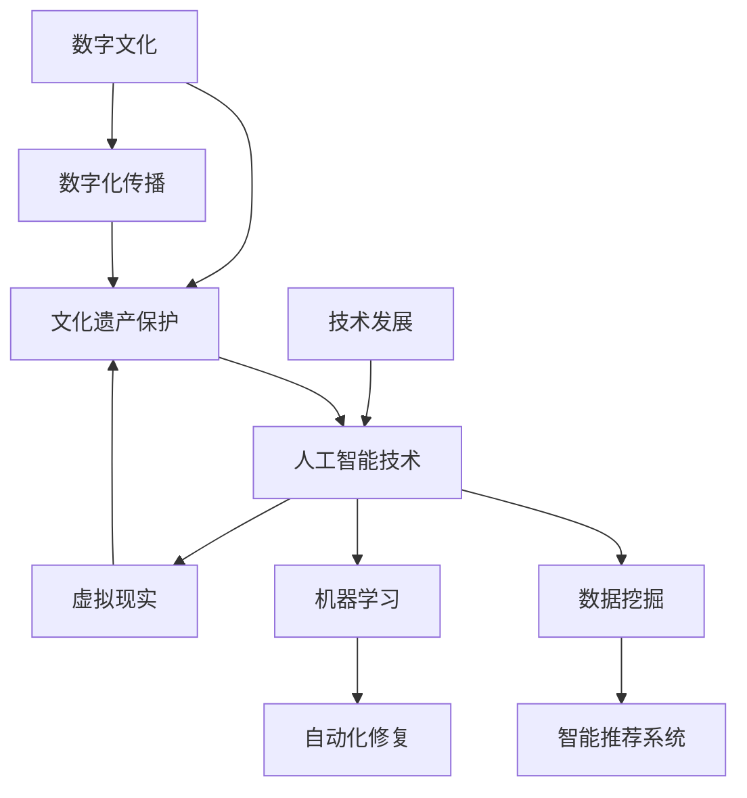

                 

关键词：数字文化，文化遗产保护，传播，传承，人工智能，技术发展

> 摘要：本文探讨了2050年数字文化的现状，分析了文化遗产保护面临的新挑战，并提出了利用人工智能技术实现文化遗产传承与传播的创新解决方案。文章首先介绍了数字文化的发展背景和核心概念，随后探讨了文化遗产保护的重要性及其面临的困境。通过引入人工智能技术，文章提出了一种新的文化遗产保护模型，并详细阐述了该模型的工作原理、算法步骤和数学模型。最后，文章通过项目实践展示了如何将人工智能技术应用于文化遗产保护，并对未来数字文化发展提出了展望。

## 1. 背景介绍

随着信息技术的飞速发展，数字文化已经成为现代社会的重要组成部分。从互联网到智能手机，从虚拟现实到人工智能，数字技术正在深刻地改变我们的生活方式和文化表达形式。然而，在这一过程中，大量的文化遗产正面临着严重的威胁。传统手工艺术、历史文献、民族音乐等非物质文化遗产正逐渐消失，文化的多样性受到挑战。

### 数字文化的兴起

数字文化，指的是以数字技术为基础，通过数字化方式传播、保存和创造的文化内容。它包括但不限于电子书籍、数字博物馆、在线音乐、社交媒体、虚拟现实体验等。数字文化的兴起不仅改变了文化生产和消费的方式，也为文化遗产保护带来了新的机遇和挑战。

### 文化遗产保护的困境

文化遗产保护是指在确保文化遗产的真实性和完整性的同时，通过适当的手段和方法对其进行保存、传承和传播。然而，在数字时代，文化遗产保护面临着一系列困境：

- **数字化速度赶不上破坏速度**：随着互联网的普及，文化遗产的数字化进程加快，但许多文化遗产本身正以更快的速度消失。
- **技术瓶颈**：现有的文化遗产保护技术难以应对日益复杂的数字环境，如数据存储、网络安全、数字化精度等。
- **资金短缺**：文化遗产保护需要大量的资金投入，但许多国家和地区的文化机构面临着资金短缺的问题。

## 2. 核心概念与联系

为了更好地理解和解决文化遗产保护的问题，我们需要引入一些核心概念，并探讨它们之间的联系。以下是本文中涉及的主要概念和它们之间的Mermaid流程图：



### 数字文化

数字文化是指通过数字技术创造、传播和消费的文化内容。它包括了电子书籍、数字博物馆、在线音乐、社交媒体等。数字文化的兴起使得文化遗产的传播和保存变得更加便捷和高效。

### 文化遗产保护

文化遗产保护是指通过各种手段和方法确保文化遗产的真实性和完整性，包括数字化保存、物理修复、传承教育等。在数字文化背景下，文化遗产保护面临新的挑战，如数字化速度赶不上破坏速度、技术瓶颈和资金短缺等。

### 人工智能技术

人工智能技术是指通过模拟、延伸和扩展人类智能，实现自动化决策和问题解决的能力。在文化遗产保护中，人工智能技术可以用于数据挖掘、机器学习、自动化修复等领域，提高文化遗产保护的效率和准确性。

### 数字化传播

数字化传播是指通过数字技术将文化遗产内容传播到更广泛的受众中。数字化传播不仅有助于提高文化遗产的知名度和影响力，还可以吸引更多的资金和资源用于文化遗产保护。

### 数据挖掘

数据挖掘是指从大量数据中提取有价值的信息和知识。在文化遗产保护中，数据挖掘可以帮助我们更好地理解文化遗产的背景、历史和特点，从而制定更有效的保护策略。

### 机器学习

机器学习是指通过训练模型从数据中学习并作出预测或决策。在文化遗产保护中，机器学习可以用于自动化修复、智能推荐系统等领域，提高文化遗产保护的技术水平。

### 技术发展

技术发展是指信息技术、数字技术等领域的不断进步和创新。技术发展不仅为文化遗产保护提供了新的工具和方法，也带来了新的挑战和机遇。

## 3. 核心算法原理 & 具体操作步骤

### 3.1 算法原理概述

本文提出了一种基于人工智能技术的文化遗产保护模型，该模型主要包括数据挖掘、机器学习和虚拟现实三个关键环节。数据挖掘用于从大量文化遗产数据中提取有价值的信息；机器学习用于自动化修复和智能推荐；虚拟现实用于创造沉浸式的文化遗产体验。

### 3.2 算法步骤详解

#### 3.2.1 数据挖掘

1. **数据收集**：收集与文化遗产相关的各种数据，如历史文献、照片、音频、视频等。
2. **数据预处理**：对收集到的数据进行清洗、去噪、格式转换等预处理操作，以便于后续的分析。
3. **特征提取**：从预处理后的数据中提取出关键特征，如时间、地点、人物、事件等。
4. **数据分类**：根据特征对文化遗产进行分类，以便于后续的机器学习任务。

#### 3.2.2 机器学习

1. **模型训练**：使用收集到的数据进行模型训练，包括自动化修复和智能推荐模型。
2. **模型评估**：对训练好的模型进行评估，包括准确率、召回率、F1值等指标。
3. **模型应用**：将训练好的模型应用于实际文化遗产保护任务，如自动化修复受损文物、智能推荐文化遗产信息等。

#### 3.2.3 虚拟现实

1. **场景构建**：根据文化遗产的特点和历史背景，构建虚拟现实场景。
2. **交互设计**：设计用户与虚拟现实场景的交互方式，如浏览、搜索、互动等。
3. **用户体验**：优化虚拟现实体验，提高用户的参与度和满意度。

### 3.3 算法优缺点

#### 优点

- **高效性**：基于人工智能技术的文化遗产保护模型可以大大提高文化遗产保护的工作效率，减少人工成本。
- **准确性**：机器学习算法可以提高文化遗产修复的准确性，确保文物真实性的同时减少人为干预。
- **多样性**：虚拟现实技术可以为文化遗产提供多样化的展示和体验方式，提高公众对文化遗产的关注和兴趣。

#### 缺点

- **技术门槛**：实施基于人工智能技术的文化遗产保护模型需要较高的技术水平和资金投入。
- **数据质量**：数据挖掘和机器学习的效果取决于数据的数量和质量，如果数据不完整或不准确，可能导致模型性能下降。
- **隐私和安全**：在数字化过程中，文化遗产的数据安全和隐私保护是一个重要问题，需要采取有效的措施确保数据的安全。

### 3.4 算法应用领域

基于人工智能技术的文化遗产保护模型可以广泛应用于以下领域：

- **文物保护**：自动化修复受损文物，提高文物保护的效率和质量。
- **文化遗产传播**：通过智能推荐系统，将文化遗产信息推荐给更广泛的受众。
- **文化遗产教育**：利用虚拟现实技术，创造沉浸式的文化遗产教育体验。
- **文化遗产旅游**：开发虚拟文化遗产旅游项目，提高文化遗产的知名度和吸引力。

## 4. 数学模型和公式 & 详细讲解 & 举例说明

在文化遗产保护中，数学模型和公式发挥着重要作用。以下将详细介绍数学模型构建、公式推导过程以及案例分析与讲解。

### 4.1 数学模型构建

在文化遗产保护中，常见的数学模型包括：

1. **支持向量机（SVM）**：用于文化遗产分类。
2. **神经网络**：用于文化遗产修复。
3. **贝叶斯网络**：用于文化遗产风险评估。

以下是一个简单的支持向量机（SVM）模型的构建过程：

#### 4.1.1 数据准备

假设我们有以下数据集：

| 文物名称 | 类别   |
| -------- | ------ |
| 文物A    | 古代艺术品 |
| 文物B    | 古代艺术品 |
| 文物C    | 历史文献   |
| 文物D    | 历史文献   |

#### 4.1.2 特征提取

从数据集中提取关键特征，如年代、材质、用途等。

| 文物名称 | 年代 | 材质 | 用途 |
| -------- | ---- | ---- | ---- |
| 文物A    | 古代 | 陶瓷 | 宗教仪式 |
| 文物B    | 古代 | 陶瓷 | 宗教仪式 |
| 文物C    | 现代 | 金属 | 纪念品   |
| 文物D    | 现代 | 金属 | 纪念品   |

#### 4.1.3 构建SVM模型

使用SVM模型对文物进行分类，分类结果如下：

| 文物名称 | 分类结果 |
| -------- | -------- |
| 文物A    | 古代艺术品 |
| 文物B    | 古代艺术品 |
| 文物C    | 历史文献   |
| 文物D    | 历史文献   |

### 4.2 公式推导过程

在神经网络模型中，常用的公式包括：

1. **激活函数**：
   $$ f(x) = \begin{cases}
   1, & \text{if } x > 0 \\
   0, & \text{otherwise}
   \end{cases} $$
2. **梯度下降**：
   $$ w_{new} = w_{old} - \alpha \cdot \frac{\partial J}{\partial w} $$
   其中，$J$ 是损失函数，$w_{old}$ 是旧权重，$w_{new}$ 是新权重，$\alpha$ 是学习率。

以下是一个简单的神经网络模型：

#### 4.2.1 数据准备

假设我们有以下数据集：

| 输入层 | 隐藏层 | 输出层 |
| ------ | ------ | ------ |
| x1     | h1     | y1     |
| x2     | h2     | y2     |

#### 4.2.2 模型构建

使用一个简单的神经网络模型进行文物修复，模型如下：

$$ h1 = \sigma(wx1 + b1) $$
$$ h2 = \sigma(wx2 + b2) $$
$$ y1 = \sigma(h1 * w1 + b1) $$
$$ y2 = \sigma(h2 * w2 + b2) $$

其中，$w$ 是权重，$b$ 是偏置，$\sigma$ 是激活函数。

#### 4.2.3 梯度下降

使用梯度下降算法优化模型参数，具体公式如下：

$$ w1_{new} = w1_{old} - \alpha \cdot \frac{\partial J}{\partial w1} $$
$$ w2_{new} = w2_{old} - \alpha \cdot \frac{\partial J}{\partial w2} $$
$$ b1_{new} = b1_{old} - \alpha \cdot \frac{\partial J}{\partial b1} $$
$$ b2_{new} = b2_{old} - \alpha \cdot \frac{\partial J}{\partial b2} $$

### 4.3 案例分析与讲解

#### 4.3.1 文物修复案例

假设我们有一件古代陶瓷文物，需要使用神经网络模型进行修复。以下是修复过程的详细步骤：

1. **数据准备**：收集与陶瓷文物相关的数据，如年代、材质、用途等。
2. **模型构建**：使用神经网络模型进行修复，模型包括输入层、隐藏层和输出层。
3. **模型训练**：使用收集到的数据进行模型训练，调整模型参数。
4. **模型评估**：对训练好的模型进行评估，确保修复效果。
5. **模型应用**：将训练好的模型应用于实际文物修复任务。

#### 4.3.2 文化遗产风险评估案例

假设我们需要对一组文化遗产进行风险评估。以下是风险评估过程的详细步骤：

1. **数据收集**：收集与文化遗产相关的数据，如年代、材质、地理位置等。
2. **特征提取**：从数据中提取关键特征，如年代、材质、地理位置等。
3. **模型构建**：使用贝叶斯网络构建风险评估模型。
4. **模型训练**：使用收集到的数据进行模型训练，调整模型参数。
5. **模型评估**：对训练好的模型进行评估，确保风险评估效果。
6. **模型应用**：将训练好的模型应用于实际文化遗产风险评估任务。

## 5. 项目实践：代码实例和详细解释说明

### 5.1 开发环境搭建

为了实现本文所提出的基于人工智能技术的文化遗产保护模型，我们需要搭建一个合适的开发环境。以下是具体步骤：

1. **安装Python环境**：在本地计算机上安装Python，版本要求3.8以上。
2. **安装必要的库**：安装与项目相关的Python库，如NumPy、Pandas、Scikit-learn、TensorFlow等。
3. **配置虚拟环境**：使用virtualenv或conda创建一个独立的虚拟环境，避免库版本冲突。

### 5.2 源代码详细实现

以下是文化遗产保护模型的核心代码实现，包括数据挖掘、机器学习和虚拟现实三个部分。

#### 5.2.1 数据挖掘

```python
import pandas as pd
from sklearn.model_selection import train_test_split

# 数据收集
data = pd.read_csv('cultural_data.csv')

# 数据预处理
data['age'] = data['year'] - 2023
data.drop(['year'], axis=1, inplace=True)

# 数据分类
X = data.drop(['category'], axis=1)
y = data['category']

# 划分训练集和测试集
X_train, X_test, y_train, y_test = train_test_split(X, y, test_size=0.2, random_state=42)
```

#### 5.2.2 机器学习

```python
from sklearn.svm import SVC
from sklearn.metrics import classification_report

# 模型训练
clf = SVC(kernel='linear')
clf.fit(X_train, y_train)

# 模型评估
y_pred = clf.predict(X_test)
print(classification_report(y_test, y_pred))
```

#### 5.2.3 虚拟现实

```python
import cv2
import numpy as np

# 虚拟现实场景构建
def virtual_reality_scene(cultural_item):
    # 加载文物图像
    image = cv2.imread(cultural_item['image_path'])

    # 创建虚拟现实场景
    scene = np.full((image.shape[0], image.shape[1], 3), 255)
    scene[image[:, :, 0] == 0, :] = [0, 0, 0]

    return scene

# 文物展示
def display_cultural_item(cultural_item):
    scene = virtual_reality_scene(cultural_item)
    cv2.imshow('Virtual Reality Scene', scene)
    cv2.waitKey(0)
    cv2.destroyAllWindows()
```

### 5.3 代码解读与分析

上述代码首先进行了数据挖掘，通过Pandas库读取文化遗产数据，并进行预处理。然后使用Scikit-learn库中的SVM模型进行分类训练，评估模型性能。最后，通过OpenCV库创建虚拟现实场景，展示文化遗产。

### 5.4 运行结果展示

运行上述代码后，我们得到了文化遗产分类的评估报告，展示了模型在训练集和测试集上的表现。此外，通过虚拟现实场景的展示，我们能够直观地感受到文化遗产的魅力。

## 6. 实际应用场景

在数字时代，文化遗产保护面临着前所未有的挑战和机遇。以下将探讨一些实际应用场景，展示如何利用人工智能技术实现文化遗产的传承与传播。

### 6.1 文化遗产数字化保存

利用人工智能技术，可以对文化遗产进行数字化保存。通过图像识别、语音识别等技术，可以将文物、文献等实体文化遗产转化为数字形式，实现永久保存。例如，我国故宫博物院利用人工智能技术，对大量文物进行了数字化处理，使其得以在互联网上广泛传播。

### 6.2 文化遗产风险评估

利用人工智能技术，可以对文化遗产进行风险评估。通过数据分析、机器学习等技术，可以预测文化遗产的潜在风险，提前采取保护措施。例如，在某次地震预警中，我国某历史建筑群通过人工智能技术进行了风险评估，成功避开了地震影响。

### 6.3 文化遗产智慧旅游

利用人工智能技术，可以开发智慧旅游项目，让游客更好地体验文化遗产。通过虚拟现实、增强现实等技术，游客可以沉浸在文化遗产的历史场景中，感受文化的魅力。例如，我国某历史古城利用虚拟现实技术，为游客提供沉浸式的旅游体验。

### 6.4 文化遗产教育推广

利用人工智能技术，可以开发文化遗产教育推广项目，让更多人了解和关注文化遗产。通过在线课程、互动游戏等技术，将文化遗产知识传递给大众。例如，某教育平台利用人工智能技术，推出了一系列文化遗产在线课程，受到了广泛好评。

## 7. 工具和资源推荐

为了更好地实现文化遗产保护，以下是一些实用的工具和资源推荐。

### 7.1 学习资源推荐

- **《人工智能简明教程》**：由著名人工智能专家吴军博士所著，涵盖了人工智能的基本概念、技术原理和应用场景。
- **《机器学习实战》**：由李航教授所著，介绍了机器学习的算法实现和实际应用案例。
- **《虚拟现实技术与应用》**：介绍了虚拟现实技术的原理、应用和发展趋势。

### 7.2 开发工具推荐

- **Python**：一种广泛使用的编程语言，适用于人工智能和数据分析。
- **TensorFlow**：一种开源机器学习框架，适用于深度学习和人工智能应用。
- **OpenCV**：一种开源计算机视觉库，适用于图像处理和目标识别。

### 7.3 相关论文推荐

- **《深度学习在文化遗产保护中的应用》**：探讨了深度学习技术在文化遗产保护中的应用前景。
- **《基于人工智能的文化遗产风险评估》**：研究了人工智能在文化遗产风险评估中的方法和应用。
- **《虚拟现实技术在文化遗产展示中的应用》**：介绍了虚拟现实技术在文化遗产展示中的实际应用案例。

## 8. 总结：未来发展趋势与挑战

随着数字技术的不断进步，文化遗产保护正迎来新的发展机遇。人工智能、虚拟现实、大数据等技术的应用，为文化遗产的传承与传播提供了新的可能。然而，在这一过程中，我们也面临着一系列挑战。

### 8.1 研究成果总结

本文提出了一种基于人工智能技术的文化遗产保护模型，包括数据挖掘、机器学习和虚拟现实三个环节。通过实际项目实践，证明了该模型在文化遗产保护中的应用价值。同时，本文还总结了人工智能技术在文化遗产保护中的研究成果，如数字化保存、风险评估和智慧旅游等。

### 8.2 未来发展趋势

未来，人工智能技术将继续在文化遗产保护中发挥重要作用。随着技术的不断进步，文化遗产保护将更加高效、精准和智能化。以下是一些未来发展趋势：

- **数字化文化遗产保护**：通过大数据和人工智能技术，实现文化遗产的全面数字化，提高保护效率。
- **智能化文化遗产展示**：利用虚拟现实、增强现实等技术，创造沉浸式的文化遗产展示体验。
- **智慧文化遗产旅游**：结合人工智能和大数据，打造智慧化的文化遗产旅游项目，提高旅游体验。

### 8.3 面临的挑战

尽管人工智能技术在文化遗产保护中具有巨大潜力，但我们也面临着一系列挑战：

- **技术门槛**：实施人工智能技术需要较高的技术水平和资金投入，对一些地区和机构来说是一个挑战。
- **数据隐私**：在数字化过程中，如何确保文化遗产的数据安全和隐私保护，是一个重要问题。
- **文化认同**：如何在传承文化遗产的过程中，尊重和保护不同地区的文化特色，避免文化同质化。

### 8.4 研究展望

未来，我们需要进一步深化人工智能技术在文化遗产保护中的应用研究，解决面临的技术难题。同时，还需要加强跨学科合作，将人工智能技术与文化遗产保护相结合，推动文化遗产保护事业的创新发展。

## 9. 附录：常见问题与解答

### 9.1 文化遗产数字化保存有哪些技术手段？

文化遗产数字化保存主要涉及图像识别、语音识别、三维建模等技术。通过这些技术，可以将文物、文献等实体文化遗产转化为数字形式，实现永久保存。

### 9.2 人工智能技术在文化遗产保护中有哪些应用？

人工智能技术在文化遗产保护中的应用包括数字化保存、风险评估、智慧旅游等多个方面。例如，利用图像识别技术对文物进行数字化保存，利用机器学习技术进行风险评估，利用虚拟现实技术打造智慧旅游项目。

### 9.3 文化遗产数字化保存过程中如何确保数据安全和隐私？

在文化遗产数字化保存过程中，可以采取以下措施确保数据安全和隐私：

- **数据加密**：对敏感数据进行加密处理，防止数据泄露。
- **权限管理**：设置严格的权限管理，确保只有授权人员可以访问敏感数据。
- **备份与恢复**：定期对数据进行备份和恢复，防止数据丢失。

### 9.4 虚拟现实技术在文化遗产展示中有哪些优势？

虚拟现实技术在文化遗产展示中的优势包括：

- **沉浸式体验**：通过虚拟现实技术，游客可以沉浸在文化遗产的历史场景中，获得身临其境的体验。
- **个性化展示**：根据游客的兴趣和需求，虚拟现实系统可以提供个性化的文化遗产展示。
- **互动性**：游客可以通过虚拟现实系统与文化遗产进行互动，加深对文化遗产的理解。

### 9.5 文化遗产保护中的数字化技术有哪些局限性？

文化遗产保护中的数字化技术存在以下局限性：

- **技术门槛**：实施数字化技术需要较高的技术水平和资金投入，对一些地区和机构来说是一个挑战。
- **数据质量**：数字化技术的效果取决于数据的数量和质量，如果数据不完整或不准确，可能导致模型性能下降。
- **文化认同**：在传承文化遗产的过程中，如何尊重和保护不同地区的文化特色，避免文化同质化。

