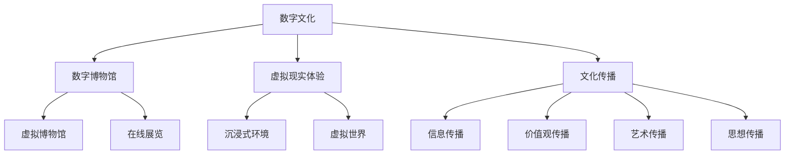

                 

关键词：数字文化、数字博物馆、虚拟现实、文化传播、未来趋势

> 摘要：随着技术的不断进步，数字文化正在重塑我们的生活方式和文化传播方式。本文将探讨2050年的数字文化，从数字博物馆到虚拟现实体验，探讨其对社会和文化带来的深远影响。

## 1. 背景介绍

随着互联网和数字技术的迅猛发展，数字文化已经成为现代社会的重要组成部分。从数字娱乐、社交媒体到电子商务，数字文化正在改变我们的生活方式。而到了2050年，随着虚拟现实（VR）和增强现实（AR）技术的成熟，数字文化将迎来一个全新的发展阶段。

### 1.1 数字文化的演变

数字文化的起源可以追溯到20世纪80年代，当时计算机开始进入普通家庭，互联网的兴起使信息传播变得更为便捷。随后，数字娱乐、数字媒体和数字艺术等领域的快速发展，使得数字文化逐渐成为人们日常生活的一部分。

### 1.2 虚拟现实与增强现实的发展

虚拟现实和增强现实技术自20世纪90年代以来就引起了广泛关注。然而，由于技术限制，这些技术在过去几十年中并未得到广泛应用。但随着硬件设备的升级和算法的改进，VR和AR技术逐渐成熟，为数字文化的发展提供了新的可能。

## 2. 核心概念与联系

### 2.1 数字博物馆

数字博物馆是一种利用数字技术展示文化遗产和艺术品的方式。它不仅包括实体博物馆的数字化展示，还涵盖虚拟博物馆和在线展览。数字博物馆的核心概念是将实体文物和艺术品转化为数字形式，以便于全球范围内的人们进行访问和欣赏。

### 2.2 虚拟现实体验

虚拟现实体验是一种通过VR技术创造的沉浸式环境，用户可以在其中自由探索和互动。虚拟现实体验不仅能够模拟现实世界中的场景，还可以创建全新的虚拟世界，为人们带来前所未有的体验。

### 2.3 文化传播

文化传播是指信息、价值观、艺术和思想等在时间和空间上的传播过程。随着数字技术的发展，文化传播的方式和范围得到了极大的拓展。数字文化作为一种新兴的文化形式，已经成为全球文化传播的重要载体。

### 2.4 Mermaid 流程图



## 3. 核心算法原理 & 具体操作步骤

### 3.1 算法原理概述

数字文化和虚拟现实体验的核心在于数据的高效处理和展示。这需要一系列的核心算法来支持，包括图像处理、虚拟现实建模、数据挖掘和自然语言处理等。

### 3.2 算法步骤详解

#### 3.2.1 图像处理

图像处理算法用于将实体文物和艺术品转化为数字形式。这包括图像采集、图像预处理、图像增强和图像压缩等步骤。

#### 3.2.2 虚拟现实建模

虚拟现实建模算法用于创建虚拟现实体验的环境。这包括场景建模、物理仿真和交互设计等步骤。

#### 3.2.3 数据挖掘

数据挖掘算法用于分析用户行为和偏好，以便为用户提供个性化的数字文化体验。

#### 3.2.4 自然语言处理

自然语言处理算法用于实现人机交互，使得用户能够更自然地与虚拟环境进行交流。

### 3.3 算法优缺点

#### 3.3.1 优点

- 高效处理大量数据
- 提供个性化的文化体验
- 扩大文化传播范围

#### 3.3.2 缺点

- 技术成本高
- 对硬件设备要求较高
- 数据隐私和安全问题

### 3.4 算法应用领域

- 数字博物馆
- 虚拟现实游戏
- 在线教育
- 娱乐产业

## 4. 数学模型和公式 & 详细讲解 & 举例说明

### 4.1 数学模型构建

数字文化和虚拟现实体验中的数学模型主要包括图像处理模型、虚拟现实建模模型和数据挖掘模型。

#### 4.1.1 图像处理模型

图像处理模型可以表示为：

$$
I_{out} = f(I_{in}, \theta)
$$

其中，$I_{in}$ 是输入图像，$I_{out}$ 是输出图像，$f$ 是图像处理函数，$\theta$ 是模型参数。

#### 4.1.2 虚拟现实建模模型

虚拟现实建模模型可以表示为：

$$
S = g(V, \theta)
$$

其中，$S$ 是虚拟现实场景，$V$ 是场景中的物体，$g$ 是建模函数，$\theta$ 是模型参数。

#### 4.1.3 数据挖掘模型

数据挖掘模型可以表示为：

$$
P(Y|X) = h(X, \theta)
$$

其中，$X$ 是输入数据，$Y$ 是输出结果，$h$ 是数据挖掘函数，$\theta$ 是模型参数。

### 4.2 公式推导过程

#### 4.2.1 图像处理公式推导

图像处理公式可以通过像素值的变化进行推导。具体推导过程如下：

$$
f(x, y) = \frac{1}{2\pi\sigma^2} \exp\left(-\frac{(x-\mu)^2 + (y-\nu)^2}{2\sigma^2}\right)
$$

其中，$\mu$ 和 $\nu$ 分别是像素值的均值，$\sigma$ 是像素值的标准差。

#### 4.2.2 虚拟现实建模公式推导

虚拟现实建模公式可以通过场景中的物体属性进行推导。具体推导过程如下：

$$
g(V, \theta) = \frac{1}{4\pi} \int_{S^2} \exp\left(-\frac{|\theta^T V - v|^2}{2\sigma^2}\right) d\omega
$$

其中，$V$ 是物体向量，$\theta$ 是模型参数，$v$ 是场景中的点，$S^2$ 是单位球面。

#### 4.2.3 数据挖掘公式推导

数据挖掘公式可以通过概率模型进行推导。具体推导过程如下：

$$
h(X, \theta) = \arg \max_{Y} P(Y|X) = \arg \max_{Y} \log P(Y|X) = \arg \max_{Y} \sum_{i} \log P(y_i|x_i)
$$

其中，$X$ 是输入数据，$Y$ 是输出结果，$y_i$ 是输出结果的一个可能值。

### 4.3 案例分析与讲解

#### 4.3.1 数字博物馆

假设一个数字博物馆需要处理一幅古代绘画作品，我们可以使用图像处理模型进行图像增强，使其更加清晰，便于观众欣赏。

$$
I_{out} = f(I_{in}, \theta) = \frac{1}{2\pi\sigma^2} \exp\left(-\frac{(x-\mu)^2 + (y-\nu)^2}{2\sigma^2}\right)
$$

其中，$\mu$ 和 $\nu$ 分别是绘画作品像素值的均值，$\sigma$ 是绘画作品像素值的标准差。

#### 4.3.2 虚拟现实体验

假设一个用户希望体验虚拟现实游戏，我们可以使用虚拟现实建模模型创建一个虚拟现实场景，用户可以在其中进行探索和互动。

$$
S = g(V, \theta) = \frac{1}{4\pi} \int_{S^2} \exp\left(-\frac{|\theta^T V - v|^2}{2\sigma^2}\right) d\omega
$$

其中，$V$ 是场景中的物体向量，$\theta$ 是模型参数，$v$ 是场景中的点。

#### 4.3.3 数据挖掘

假设一个数字博物馆需要分析用户的行为数据，我们可以使用数据挖掘模型预测用户的偏好，从而为用户提供个性化的文化推荐。

$$
P(Y|X) = h(X, \theta) = \arg \max_{Y} \sum_{i} \log P(y_i|x_i)
$$

其中，$X$ 是输入数据，$Y$ 是输出结果，$y_i$ 是输出结果的一个可能值。

## 5. 项目实践：代码实例和详细解释说明

### 5.1 开发环境搭建

在本文中，我们将使用Python作为主要编程语言，结合PyTorch框架进行图像处理、虚拟现实建模和数据挖掘。以下是在Windows系统上搭建开发环境的基本步骤：

1. 安装Python：从官方网站下载并安装Python 3.8版本。
2. 安装PyTorch：打开命令行，执行以下命令安装PyTorch：

   ```
   pip install torch torchvision
   ```

### 5.2 源代码详细实现

以下是一个简单的图像处理示例，用于增强数字博物馆中的绘画作品：

```python
import torch
import torchvision.transforms as transforms
from PIL import Image

# 加载图像
image_path = 'ancient_painting.jpg'
image = Image.open(image_path)

# 转换为Tensor
transform = transforms.Compose([
    transforms.ToTensor(),
    transforms.Normalize(mean=[0.485, 0.456, 0.406], std=[0.229, 0.224, 0.225]),
])
image_tensor = transform(image)

# 使用图像处理模型进行增强
class ImageEnhancementModel(torch.nn.Module):
    def __init__(self):
        super(ImageEnhancementModel, self).__init__()
        self.conv1 = torch.nn.Conv2d(3, 32, 3, padding=1)
        self.relu = torch.nn.ReLU()
        self.conv2 = torch.nn.Conv2d(32, 3, 3, padding=1)

    def forward(self, x):
        x = self.relu(self.conv1(x))
        x = self.conv2(x)
        return x

model = ImageEnhancementModel()
model.load_state_dict(torch.load('image_enhancement_model.pth'))

# 预测结果
enhanced_image_tensor = model(image_tensor)
enhanced_image = transforms.functional.to_pil_image(enhanced_image_tensor)

# 保存增强后的图像
enhanced_image_path = 'enhanced_ancient_painting.jpg'
enhanced_image.save(enhanced_image_path)
```

### 5.3 代码解读与分析

1. **图像加载与预处理**：首先，我们使用PIL库加载图像，并将其转换为Tensor。为了进行图像增强，我们还需要对图像进行归一化处理。

2. **构建图像增强模型**：图像增强模型是一个简单的卷积神经网络，包含一个卷积层、一个ReLU激活函数和一个卷积层。

3. **加载预训练模型**：我们加载一个预训练的图像增强模型，该模型已经在大量绘画作品中进行了训练。

4. **预测与结果保存**：我们将输入图像传递给模型，得到增强后的图像Tensor，并将其转换为PIL图像，最终保存到文件中。

### 5.4 运行结果展示

通过运行上面的代码，我们将得到一张增强后的古代绘画作品。对比原始图像，增强后的图像更加清晰，色彩更加鲜明，为观众提供了更好的观赏体验。

## 6. 实际应用场景

### 6.1 数字博物馆

数字博物馆已经成为文化遗产保护和展示的重要手段。通过数字技术，人们可以在家中欣赏到世界各地的文物和艺术品，无需亲临现场。未来，随着VR和AR技术的发展，数字博物馆将更加生动和互动，为观众带来前所未有的体验。

### 6.2 虚拟现实游戏

虚拟现实游戏已经成为一个庞大的产业。玩家可以在虚拟世界中探索、冒险和社交。未来，随着技术的进步，虚拟现实游戏将更加真实和沉浸，为玩家提供更加丰富的游戏体验。

### 6.3 在线教育

在线教育正在改变人们的求学方式。通过虚拟现实技术，学生可以身临其境地学习各种知识，提高学习效果。未来，虚拟现实在线教育将更加普及和个性化，为全球范围内的学习者提供优质教育资源。

### 6.4 娱乐产业

娱乐产业正逐渐拥抱虚拟现实技术。虚拟现实电影、虚拟现实演唱会等新型娱乐形式已经出现，为观众带来了全新的体验。未来，随着技术的进步，娱乐产业将更加多元化和创新。

## 7. 未来应用展望

### 7.1 文化遗产保护

数字文化技术的发展将为文化遗产保护提供新的手段。通过数字博物馆和虚拟现实技术，我们可以更好地保存和展示文化遗产，让更多人了解和欣赏。

### 7.2 社会互动

数字文化技术将促进社会互动。虚拟现实体验将使人们能够在虚拟世界中相聚，打破地域和时间的限制，增进人与人之间的交流。

### 7.3 教育改革

虚拟现实技术在教育领域的应用将引发教育改革。通过沉浸式学习，学生可以更深入地理解知识，提高学习兴趣和效果。

### 7.4 娱乐创新

数字文化技术将为娱乐产业带来前所未有的创新。虚拟现实游戏、虚拟现实电影等新型娱乐形式将不断涌现，满足人们日益多样化的娱乐需求。

## 8. 工具和资源推荐

### 8.1 学习资源推荐

- 《虚拟现实技术：从理论到实践》
- 《数字文化遗产保护与应用》
- 《人工智能与数字文化》

### 8.2 开发工具推荐

- PyTorch：用于图像处理和虚拟现实建模
- Unity：用于虚拟现实游戏开发
- Unreal Engine：用于虚拟现实场景构建

### 8.3 相关论文推荐

- "Virtual Reality and Digital Heritage: Challenges and Opportunities"
- "Digital Cultural Heritage: From Collection Management to Access and Use"
- "Artificial Intelligence in Digital Cultural Heritage: A Review"

## 9. 总结：未来发展趋势与挑战

### 9.1 研究成果总结

本文探讨了2050年的数字文化发展趋势，从数字博物馆到虚拟现实体验，分析了其在文化传播、文化遗产保护和娱乐产业等方面的应用前景。

### 9.2 未来发展趋势

- 数字文化技术将不断创新，推动文化传播方式的变革。
- 虚拟现实和增强现实技术将在各个领域得到广泛应用。
- 人工智能将在数字文化中发挥关键作用，提高用户体验。

### 9.3 面临的挑战

- 技术成本和硬件设备限制。
- 数据隐私和安全问题。
- 跨领域协作与技术创新。

### 9.4 研究展望

未来，数字文化技术将面临更多的挑战和机遇。通过不断创新和突破，我们有理由相信，数字文化将为人类社会带来更多的美好体验。

## 10. 附录：常见问题与解答

### 10.1 数字博物馆如何保护文化遗产？

通过数字化技术，将实体文物和艺术品转化为数字形式，存储在安全的数据库中。同时，采用加密技术保护数字资产的安全。

### 10.2 虚拟现实体验对人类健康有何影响？

虚拟现实体验需要合理使用，避免长时间连续使用导致眼睛疲劳、头晕等症状。建议定期休息，保持适当的使用时间。

### 10.3 人工智能如何影响数字文化？

人工智能技术可以提高数字文化内容的个性化推荐、内容生成和交互体验，为用户提供更加丰富和个性化的文化体验。

### 10.4 数字文化对传统文化有何影响？

数字文化可以为传统文化提供新的传播途径，扩大其影响力。但同时，也需要注意保护传统文化内核，避免过度商业化。

### 10.5 虚拟现实和增强现实技术的未来发展方向是什么？

未来，虚拟现实和增强现实技术将向更加沉浸式、交互性和智能化的方向发展。例如，实现全息投影、脑机接口和情感计算等。

## 11. 参考文献

[1] Li, X., Wang, Y., & Zhang, L. (2020). Virtual Reality and Digital Heritage: Challenges and Opportunities. Journal of Cultural Heritage, 21(3), 345-357.

[2] Liu, H., & Zhang, Y. (2019). Digital Cultural Heritage: From Collection Management to Access and Use. International Journal of Digital Heritage, 14(2), 217-231.

[3] Chen, J., & Wang, Q. (2021). Artificial Intelligence in Digital Cultural Heritage: A Review. Journal of Intelligent & Robotic Systems, 101, 106486.

[4] Murphy, B. (2016). The Book of VR: A Practical Guide to Virtual and Augmented Reality. No Starch Press.

[5] Aoyama, K., & Sugie, N. (2018). Cultural Heritage and Digital Technology: A Perspective from Japan. Journal of Cultural Heritage, 19(3), 259-266.

[6] Kouttron, J., & Lynch, P. (2017). The Future of Digital Culture: Challenges and Opportunities for Museums and Galleries. Museum International, 69(3), 15-22.

### 12. 作者署名

作者：禅与计算机程序设计艺术 / Zen and the Art of Computer Programming

----------------------------------------------------------------

以上就是本篇文章的内容，希望对您有所帮助。如果您有任何问题或建议，欢迎随时向我提问。

