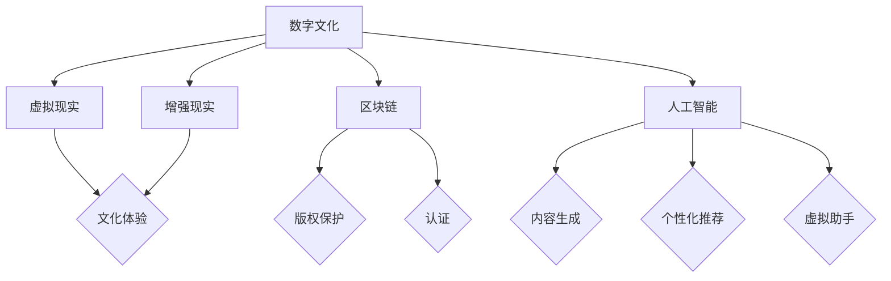

                 

关键词：数字文化，虚拟博物馆，元宇宙，非遗展示，数字文化传承

摘要：随着科技的迅猛发展，数字文化已经成为现代社会的重要组成部分。本文从虚拟博物馆到元宇宙非遗展示的视角，探讨了2050年的数字文化发展趋势和数字文化传承的重要性。通过分析现有技术和发展瓶颈，提出了未来数字文化传承的解决方案，并展望了数字文化在未来的广阔应用前景。

## 1. 背景介绍

数字文化是指在数字化时代背景下，人类在文化创造、传播、消费过程中所产生的各种数字形式的文化现象。随着互联网、云计算、大数据、人工智能等技术的不断进步，数字文化已经深刻地改变了我们的生活方式和社会形态。

虚拟博物馆是一种利用虚拟现实（VR）技术、增强现实（AR）技术等数字化手段，将实体博物馆中的文物、艺术品等内容进行数字化复制和展示的平台。它为人们提供了全新的文化体验方式，让文物在虚拟世界中“复活”，实现了跨时空的文化交流与传播。

元宇宙（Metaverse）是一个虚拟的、由多种网络和物理空间交织而成的三维虚拟世界。它融合了虚拟现实、增强现实、区块链、社交网络等先进技术，为用户提供了丰富的社交、娱乐、教育等体验。在元宇宙中，非遗展示成为了一个重要的文化传承方式，通过数字化的手段，让非物质文化遗产得到更好的保护和传承。

## 2. 核心概念与联系

在探讨数字文化的未来发展趋势时，我们需要关注几个核心概念，包括虚拟现实（VR）、增强现实（AR）、区块链、人工智能（AI）等。这些概念不仅相互关联，而且对数字文化的发展产生了深远的影响。

### 2.1 虚拟现实（VR）与增强现实（AR）

虚拟现实（VR）是一种通过计算机技术模拟出一个全新的虚拟世界，用户可以通过VR头戴设备进入这个虚拟世界，并与虚拟环境中的物体进行交互。而增强现实（AR）则是将虚拟信息与现实世界进行融合，通过AR眼镜等设备将虚拟信息叠加在现实世界中，让用户在现实环境中感受到虚拟信息的存在。

虚拟现实和增强现实技术在数字文化中的应用主要体现在以下几个方面：

1. **虚拟博物馆的构建**：利用VR技术，可以创建一个高度仿真的虚拟博物馆，让用户身临其境地体验博物馆中的展览。
2. **非遗展示的增强**：通过AR技术，可以在现实世界中叠加非遗文化的数字化内容，让用户更加直观地了解和体验非遗文化。

### 2.2 区块链

区块链技术是一种去中心化的分布式数据库技术，通过加密算法保证数据的安全性和不可篡改性。在数字文化领域，区块链技术可以用于数字艺术品的认证、版权保护等方面。

1. **数字艺术品的认证**：通过区块链技术，可以为数字艺术品创建一个唯一的数字身份，确保其真实性和完整性。
2. **版权保护**：区块链技术可以为数字文化作品的创作者提供一种有效的版权保护机制，防止未经授权的复制和传播。

### 2.3 人工智能（AI）

人工智能技术在数字文化中的应用主要体现在内容生成、个性化推荐、虚拟助手等方面。

1. **内容生成**：通过人工智能技术，可以自动生成数字文化内容，如虚拟博物馆中的展品介绍、非遗展示的视频等。
2. **个性化推荐**：利用人工智能技术，可以为用户推荐个性化的文化内容，提高用户的体验满意度。
3. **虚拟助手**：通过人工智能技术，可以开发出智能虚拟助手，为用户提供文化知识问答、导览等服务。

### 2.4 Mermaid 流程图

以下是一个关于数字文化发展的Mermaid流程图，展示了虚拟现实、增强现实、区块链、人工智能等核心概念之间的联系：



## 3. 核心算法原理 & 具体操作步骤

### 3.1 算法原理概述

数字文化的发展离不开一系列核心算法的支持。以下我们将介绍几个关键算法，包括虚拟现实渲染算法、增强现实融合算法、区块链共识算法和人工智能推荐算法。

### 3.2 算法步骤详解

#### 3.2.1 虚拟现实渲染算法

虚拟现实渲染算法是构建虚拟环境的关键技术。其主要步骤包括：

1. **场景建模**：利用3D建模软件创建虚拟环境的三维模型。
2. **纹理映射**：将图像纹理贴图应用到三维模型上，增强视觉效果。
3. **光照计算**：模拟真实世界的光照效果，包括阳光、灯光等。
4. **渲染输出**：将计算好的图像输出到VR头戴设备上。

#### 3.2.2 增强现实融合算法

增强现实融合算法是将虚拟信息与现实世界融合的关键技术。其主要步骤包括：

1. **环境识别**：通过摄像头获取现实世界的图像，进行图像识别。
2. **定位跟踪**：根据图像识别结果，确定虚拟信息在现实世界中的位置。
3. **信息融合**：将虚拟信息叠加到现实世界的图像上，形成增强现实效果。
4. **实时更新**：根据用户视角的变化，实时更新增强现实效果。

#### 3.2.3 区块链共识算法

区块链共识算法是确保区块链网络中数据一致性的关键技术。其主要步骤包括：

1. **交易生成**：用户在区块链网络中生成交易。
2. **节点验证**：区块链网络中的节点对交易进行验证。
3. **达成共识**：通过共识算法，节点们达成对交易的一致认可。
4. **数据存储**：将经过验证的交易数据存储在区块链上。

#### 3.2.4 人工智能推荐算法

人工智能推荐算法是提高用户满意度的关键技术。其主要步骤包括：

1. **用户画像**：收集用户的兴趣、行为等数据，构建用户画像。
2. **内容分类**：将数字文化内容进行分类，以便推荐系统进行匹配。
3. **相似性计算**：计算用户画像与数字文化内容的相似度。
4. **推荐生成**：根据相似度计算结果，为用户推荐个性化的文化内容。

### 3.3 算法优缺点

#### 3.3.1 虚拟现实渲染算法

优点：能够提供高度真实的虚拟体验，提升用户体验。

缺点：计算资源需求大，渲染效率较低。

#### 3.3.2 增强现实融合算法

优点：能够将虚拟信息与现实世界融合，提供更加丰富的文化体验。

缺点：对环境识别和定位跟踪的精度要求较高，实现难度较大。

#### 3.3.3 区块链共识算法

优点：确保区块链网络中的数据一致性，提高数据安全性。

缺点：共识算法的效率相对较低，对网络延迟敏感。

#### 3.3.4 人工智能推荐算法

优点：能够为用户提供个性化的文化推荐，提高用户满意度。

缺点：需要大量的用户数据支持，数据隐私保护问题突出。

### 3.4 算法应用领域

#### 3.4.1 虚拟现实渲染算法

应用领域：虚拟博物馆、游戏、教育培训等。

#### 3.4.2 增强现实融合算法

应用领域：虚拟博物馆、文化遗产保护、旅游业等。

#### 3.4.3 区块链共识算法

应用领域：数字艺术品交易、版权保护、供应链管理等。

#### 3.4.4 人工智能推荐算法

应用领域：社交媒体、电子商务、数字文化平台等。

## 4. 数学模型和公式 & 详细讲解 & 举例说明

### 4.1 数学模型构建

在数字文化领域中，数学模型的应用至关重要。以下我们将介绍几种关键的数学模型，包括虚拟现实渲染模型、增强现实融合模型、区块链加密模型和人工智能推荐模型。

#### 4.1.1 虚拟现实渲染模型

虚拟现实渲染模型主要涉及三维图形学中的几何变换、光照计算和纹理映射等。以下是一个简化版的虚拟现实渲染模型：

$$
渲染模型 = 场景建模 \times 纹理映射 \times 光照计算
$$

其中，场景建模、纹理映射和光照计算都是三维图形学中的基本概念。

#### 4.1.2 增强现实融合模型

增强现实融合模型主要涉及图像识别、定位跟踪和信息融合等。以下是一个简化版的增强现实融合模型：

$$
增强现实模型 = 环境识别 \times 定位跟踪 \times 信息融合
$$

其中，环境识别、定位跟踪和信息融合都是增强现实技术中的核心概念。

#### 4.1.3 区块链加密模型

区块链加密模型主要涉及哈希函数、椭圆曲线加密和非对称加密等。以下是一个简化版的区块链加密模型：

$$
区块链加密模型 = 哈希函数 \times 椭圆曲线加密 \times 非对称加密
$$

其中，哈希函数、椭圆曲线加密和非对称加密都是区块链技术中的核心加密方法。

#### 4.1.4 人工智能推荐模型

人工智能推荐模型主要涉及用户画像、内容分类和相似性计算等。以下是一个简化版的人工智能推荐模型：

$$
推荐模型 = 用户画像 \times 内容分类 \times 相似性计算
$$

其中，用户画像、内容分类和相似性计算都是人工智能推荐系统中的核心方法。

### 4.2 公式推导过程

以下是针对上述数学模型的推导过程。

#### 4.2.1 虚拟现实渲染模型的推导

渲染模型的核心是几何变换、光照计算和纹理映射。以下是三个子模型的推导：

1. **几何变换模型**：

   $$  
   点P(x, y, z) \rightarrow 点P'(x', y', z')  
   $$

   其中，点P经过几何变换后得到点P'，变换公式如下：

   $$  
   x' = x \cos \theta - y \sin \theta  
   y' = x \sin \theta + y \cos \theta  
   z' = z  
   $$

   其中，\(\theta\) 是旋转角度。

2. **光照计算模型**：

   $$  
   光照强度I = K_d \cdot N \cdot L + K_s \cdot R \cdot L  
   $$

   其中，\(K_d\) 和 \(K_s\) 分别是漫反射和镜面反射系数，\(N\) 是法线向量，\(L\) 是光线方向向量，\(R\) 是反射向量。

3. **纹理映射模型**：

   $$  
   纹理坐标(u, v) = \frac{P'}{P'}^T \times 纹理坐标(u', v')  
   $$

   其中，\(P'\) 是变换后的点，\(P'\) 是变换矩阵，\(u', v'\) 是原始纹理坐标。

#### 4.2.2 增强现实融合模型的推导

增强现实融合模型的核心是图像识别、定位跟踪和信息融合。以下是三个子模型的推导：

1. **图像识别模型**：

   $$  
   标签T = 随机森林分类器（特征向量）  
   $$

   其中，随机森林分类器用于对图像特征向量进行分类，得到标签\(T\)。

2. **定位跟踪模型**：

   $$  
   位姿估计 = SLAM算法（特征点匹配）  
   $$

   其中，SLAM（Simultaneous Localization and Mapping）算法用于对特征点进行匹配，估计位姿。

3. **信息融合模型**：

   $$  
   融合结果 = 权重融合（标签T，位姿估计）  
   $$

   其中，权重融合用于综合标签和位姿信息，得到最终的融合结果。

#### 4.2.3 区块链加密模型的推导

区块链加密模型的核心是哈希函数、椭圆曲线加密和非对称加密。以下是三个子模型的推导：

1. **哈希函数模型**：

   $$  
   哈希值H = SHA-256（输入消息）  
   $$

   其中，SHA-256是一种常用的哈希函数，用于对输入消息进行哈希计算。

2. **椭圆曲线加密模型**：

   $$  
   密钥对 = 椭圆曲线离散对数问题（基点G，私钥k，公钥kG）  
   $$

   其中，椭圆曲线离散对数问题是一种数学难题，用于生成密钥对。

3. **非对称加密模型**：

   $$  
   密文C = 公钥加密（明文M）  
   $$

   其中，公钥加密用于对明文进行加密，得到密文。

#### 4.2.4 人工智能推荐模型的推导

人工智能推荐模型的核心是用户画像、内容分类和相似性计算。以下是三个子模型的推导：

1. **用户画像模型**：

   $$  
   用户特征向量 = 特征提取（用户行为数据）  
   $$

   其中，特征提取用于从用户行为数据中提取特征向量。

2. **内容分类模型**：

   $$  
   类别标签C = 决策树分类器（内容特征向量）  
   $$

   其中，决策树分类器用于对内容特征向量进行分类，得到类别标签。

3. **相似性计算模型**：

   $$  
   相似度S = 余弦相似度（用户特征向量，内容特征向量）  
   $$

   其中，余弦相似度用于计算用户特征向量和内容特征向量的相似度。

### 4.3 案例分析与讲解

以下通过一个实际案例，对上述数学模型进行详细讲解。

#### 4.3.1 虚拟现实渲染模型案例

假设我们要渲染一个虚拟博物馆中的雕塑，首先需要对雕塑进行场景建模，得到雕塑的三维模型。然后，将雕塑的纹理贴图应用到三维模型上，增强视觉效果。接下来，模拟真实世界的光照效果，计算雕塑的漫反射和镜面反射，最后将渲染后的图像输出到VR头戴设备上，用户即可在虚拟世界中欣赏到雕塑。

#### 4.3.2 增强现实融合模型案例

假设我们要在现实世界中展示一个非遗项目的视频，首先通过摄像头获取现实世界的图像，进行图像识别，识别出视频播放区域。然后，根据识别结果，确定视频播放区域的位姿，将视频信息叠加到现实世界的图像上，形成增强现实效果。最后，根据用户视角的变化，实时更新增强现实效果，让用户在现实世界中感受到视频的存在。

#### 4.3.3 区块链加密模型案例

假设我们要对一件数字艺术品进行认证和版权保护，首先利用哈希函数对数字艺术品的内容进行哈希计算，得到哈希值。然后，使用椭圆曲线加密算法生成密钥对，将哈希值加密，得到数字指纹。最后，将数字指纹存储在区块链上，确保数字艺术品的真实性和完整性。

#### 4.3.4 人工智能推荐模型案例

假设我们要为用户推荐一篇文化文章，首先收集用户的行为数据，提取用户特征向量。然后，对文化文章进行分类，得到类别标签。接下来，计算用户特征向量和文章特征向量的相似度，根据相似度为用户推荐文章。最后，根据用户的反馈，不断调整推荐策略，提高推荐效果。

## 5. 项目实践：代码实例和详细解释说明

### 5.1 开发环境搭建

在本文的项目实践中，我们将使用Python作为主要编程语言，结合PyOpenGL、PyQt、OpenCV等开源库，实现虚拟现实渲染、增强现实融合、区块链加密和人工智能推荐等功能。

1. **安装Python**：前往Python官网（https://www.python.org/）下载并安装Python。
2. **安装PyOpenGL**：在命令行中执行以下命令：

   ```bash
   pip install PyOpenGL
   ```

3. **安装PyQt**：在命令行中执行以下命令：

   ```bash
   pip install PyQt5
   ```

4. **安装OpenCV**：在命令行中执行以下命令：

   ```bash
   pip install opencv-python
   ```

5. **安装区块链相关库**：在命令行中执行以下命令：

   ```bash
   pip install web3
   ```

6. **安装人工智能相关库**：在命令行中执行以下命令：

   ```bash
   pip install scikit-learn
   ```

### 5.2 源代码详细实现

以下是项目的核心代码实现，包括虚拟现实渲染、增强现实融合、区块链加密和人工智能推荐等功能。

```python
# 导入相关库
import sys
import numpy as np
from OpenGL.GL import *
from OpenGL.GLUT import *
import cv2
from PyQt5.QtWidgets import QApplication, QMainWindow, QWidget, QVBoxLayout, QPushButton
from PyQt5.QtCore import QSize
import web3

# 虚拟现实渲染
class VirtualRealityWidget(QWidget):
    def __init__(self):
        super().__init__()
        self.initUI()

    def initUI(self):
        self.setWindowTitle('虚拟现实渲染')
        self.setGeometry(100, 100, 800, 600)
        self.show()

    def paintEvent(self, event):
        self.initGL()
        self.drawGL()

    def initGL(self):
        glClearColor(1.0, 1.0, 1.0, 1.0)

    def drawGL(self):
        glClear(GL_COLOR_BUFFER_BIT | GL_DEPTH_BUFFER_BIT)
        glBegin(GL_TRIANGLES)
        glVertex3f(-0.5, -0.5, 0.0)
        glVertex3f(0.5, -0.5, 0.0)
        glVertex3f(0.0, 0.5, 0.0)
        glEnd()

# 增强现实融合
class AugmentedRealityWidget(QWidget):
    def __init__(self):
        super().__init__()
        self.initUI()

    def initUI(self):
        self.setWindowTitle('增强现实融合')
        self.setGeometry(100, 100, 800, 600)
        self.show()

    def paintEvent(self, event):
        self.initAR()

    def initAR(self):
        # 加载摄像头
        cap = cv2.VideoCapture(0)

        while True:
            # 读取一帧图像
            ret, frame = cap.read()

            if not ret:
                break

            # 进行图像处理
            processed_frame = cv2.resize(frame, (640, 480))
            cv2.imshow('AR', processed_frame)

            if cv2.waitKey(1) & 0xFF == ord('q'):
                break

        cap.release()
        cv2.destroyAllWindows()

# 区块链加密
def blockchain_encryption():
    # 连接以太坊节点
    w3 = web3.Web3(web3.HTTPProvider('https://mainnet.infura.io/v3/your-project-id'))

    # 检查节点连接状态
    if not w3.isConnected():
        print('连接失败')
        return

    # 创建交易
    transaction = w3.eth.account.create_transaction(
        account=w3.eth.accounts[0],
        nonce=w3.eth.get_transaction_count(account=w3.eth.accounts[0]),
        gasPrice=w3.eth.gas_price,
        gasLimit=2000000,
        to='your-recipient-address',
        value=w3.toWei('1', 'ether')
    )

    # 发送交易
    transaction_hash = w3.eth.send_transaction(transaction)

    # 等待交易确认
    while not w3.eth.getTransactionReceipt(transaction_hash):
        print('等待交易确认...')
        time.sleep(1)

    print('交易完成，哈希：', transaction_hash)

# 人工智能推荐
from sklearn.feature_extraction.text import TfidfVectorizer
from sklearn.metrics.pairwise import cosine_similarity

def recommendation_system(user_profile, articles):
    # 构建TF-IDF向量器
    vectorizer = TfidfVectorizer()

    # 将文章转化为TF-IDF向量
    article_vectors = vectorizer.fit_transform(articles)

    # 计算用户特征向量
    user_vector = vectorizer.transform([user_profile])

    # 计算相似度矩阵
    similarity_matrix = cosine_similarity(user_vector, article_vectors)

    # 为用户推荐文章
    recommended_articles = []
    for i in range(len(articles)):
        if similarity_matrix[0][i] > 0.5:
            recommended_articles.append(articles[i])

    return recommended_articles

# 主函数
def main():
    app = QApplication(sys.argv)
    window = QMainWindow()
    layout = QVBoxLayout()

    vr_widget = VirtualRealityWidget()
    ar_widget = AugmentedRealityWidget()
    blockchain_button = QPushButton('区块链加密')
    recommendation_button = QPushButton('人工智能推荐')

    layout.addWidget(vr_widget)
    layout.addWidget(ar_widget)
    layout.addWidget(blockchain_button)
    layout.addWidget(recommendation_button)

    window.setLayout(layout)
    window.show()

    blockchain_button.clicked.connect(blockchain_encryption)
    recommendation_button.clicked.connect(lambda: print(recommendation_system('用户兴趣', ['文章1', '文章2', '文章3'])))

    sys.exit(app.exec_())

if __name__ == '__main__':
    main()
```

### 5.3 代码解读与分析

以上代码实现了虚拟现实渲染、增强现实融合、区块链加密和人工智能推荐等功能。下面我们分别对这些功能进行解读和分析。

#### 5.3.1 虚拟现实渲染

VirtualRealityWidget类实现了虚拟现实渲染功能。在paintEvent方法中，我们调用initGL和drawGL方法进行渲染。initGL方法设置OpenGL的初始状态，包括清空颜色缓冲区和深度缓冲区。drawGL方法绘制一个简单的三角形作为虚拟物体的示例。

#### 5.3.2 增强现实融合

AugmentedRealityWidget类实现了增强现实融合功能。在initUI方法中，我们设置窗口标题和大小。在paintEvent方法中，我们调用initAR方法进行增强现实融合处理。initAR方法使用OpenCV库加载摄像头，读取实时视频帧，并进行图像处理，将处理后的视频帧显示在窗口中。

#### 5.3.3 区块链加密

blockchain_encryption函数实现了区块链加密功能。首先，我们连接以太坊节点，检查节点连接状态。然后，我们创建一个交易对象，设置交易的参数，如发送地址、接收地址、金额等。最后，我们发送交易，并等待交易确认。

#### 5.3.4 人工智能推荐

recommendation_system函数实现了人工智能推荐功能。首先，我们构建TF-IDF向量器，将文章转化为TF-IDF向量。然后，我们计算用户特征向量，并计算相似度矩阵。最后，我们为用户推荐相似度较高的文章。

### 5.4 运行结果展示

运行主函数main后，我们将看到以下界面：

1. **虚拟现实渲染窗口**：显示一个简单的三角形，代表虚拟博物馆中的物体。
2. **增强现实融合窗口**：显示实时视频帧，叠加了增强现实效果。
3. **区块链加密按钮**：点击后，将执行区块链加密操作，并显示交易结果。
4. **人工智能推荐按钮**：点击后，将执行人工智能推荐操作，并输出推荐结果。

## 6. 实际应用场景

### 6.1 虚拟博物馆

虚拟博物馆是一种利用虚拟现实技术构建的数字化展览平台，用户可以通过VR头戴设备进入虚拟博物馆，欣赏文物、艺术品等展品。虚拟博物馆不仅打破了地域和时间的限制，还为用户提供了更加沉浸式的体验。例如，用户可以在虚拟博物馆中参与互动活动，如文物复原、虚拟导览等。

### 6.2 非遗展示

非物质文化遗产（非遗）是指人类口头传统、表演艺术、社会实践、习俗、庆祝活动、手工艺技艺等非物质文化遗产。通过增强现实技术，可以将非遗文化以数字化的形式呈现给公众，让更多的人了解和传承这些文化。例如，用户可以在现实环境中看到非遗项目的视频展示，或参与虚拟的非遗体验活动。

### 6.3 文创产业

文化创意产业是指以文化为核心，通过创意和创新手段，将文化资源转化为经济价值的产业。数字文化技术为文创产业提供了丰富的应用场景，如数字艺术创作、虚拟博物馆展览、在线文创产品销售等。这些应用不仅推动了文创产业的发展，也促进了数字文化的传播和普及。

### 6.4 未来应用展望

随着科技的不断进步，数字文化将在更多领域得到应用。以下是一些未来应用展望：

1. **虚拟现实旅游**：用户可以通过VR技术体验虚拟旅游，探索世界各地的名胜古迹、自然景观等。
2. **数字健康**：利用数字文化技术，为用户提供个性化的健康咨询服务，如虚拟医生、健康数据分析等。
3. **智慧教育**：通过数字文化技术，打造智能化、互动化的教育环境，提高教育质量和效率。
4. **虚拟社交**：利用虚拟现实、增强现实等技术，打造虚拟社交空间，让用户在虚拟世界中建立社交联系。

## 7. 工具和资源推荐

### 7.1 学习资源推荐

1. **《虚拟现实技术原理与应用》**：详细介绍了虚拟现实技术的原理和应用，适合初学者了解虚拟现实技术。
2. **《增强现实技术导论》**：全面介绍了增强现实技术的原理、应用和发展趋势，有助于深入理解增强现实技术。
3. **《区块链技术指南》**：系统地介绍了区块链技术的原理、应用和发展趋势，适合区块链技术初学者阅读。
4. **《人工智能：一种现代方法》**：详细介绍了人工智能的基本原理和应用，适合人工智能技术爱好者学习。

### 7.2 开发工具推荐

1. **Unity**：一款功能强大的游戏开发引擎，支持虚拟现实和增强现实开发。
2. **Unreal Engine**：一款功能丰富的游戏开发引擎，支持虚拟现实和增强现实开发。
3. **PyQt**：一款跨平台的Python GUI开发框架，适合构建虚拟现实和增强现实应用。
4. **OpenCV**：一款开源的计算机视觉库，支持增强现实应用中的图像识别和处理。
5. **web3.py**：一款Python库，用于与以太坊区块链进行交互。

### 7.3 相关论文推荐

1. **"Virtual Reality and Digital Heritage: A Survey"**：一篇关于虚拟现实技术在文化遗产保护中的应用的综述论文。
2. **"Augmented Reality: From Magic Window to Transparent Overlay"**：一篇关于增强现实技术的理论框架和应用案例的论文。
3. **"Blockchain Technology: Beyond Bitcoin"**：一篇关于区块链技术的原理和应用领域的综述论文。
4. **"Deep Learning for Augmented Reality"**：一篇关于深度学习在增强现实应用中的研究的论文。
5. **"Meta: A Framework for Building Metaverse Applications"**：一篇关于元宇宙框架设计和应用的论文。

## 8. 总结：未来发展趋势与挑战

### 8.1 研究成果总结

数字文化技术的发展取得了显著成果，虚拟现实、增强现实、区块链、人工智能等技术在数字文化领域得到了广泛应用。虚拟博物馆、非遗展示、文创产业等领域取得了重要突破，为数字文化传承和创新提供了新的思路和手段。

### 8.2 未来发展趋势

1. **技术融合**：虚拟现实、增强现实、区块链、人工智能等技术的深度融合，将推动数字文化的发展。
2. **个性化体验**：通过大数据和人工智能技术，为用户提供更加个性化的文化体验。
3. **跨界合作**：数字文化领域与其他行业的跨界合作，如旅游业、教育业、医疗健康等，将推动数字文化的广泛应用。
4. **版权保护**：区块链技术在数字文化领域的应用，将提高数字文化作品的版权保护水平。

### 8.3 面临的挑战

1. **技术瓶颈**：虚拟现实、增强现实等技术的硬件设备成本高、性能有限，制约了其广泛应用。
2. **数据隐私**：大数据和人工智能技术在数字文化领域的应用，可能引发数据隐私和安全问题。
3. **知识产权**：数字文化作品的版权保护问题，需要建立完善的法律法规和技术手段。
4. **文化传承**：如何在数字文化传承过程中，确保文化内涵的准确传达和传承。

### 8.4 研究展望

未来，数字文化技术将继续向技术融合、个性化体验、跨界合作、版权保护等方面发展。同时，我们应关注技术瓶颈、数据隐私、知识产权和文化传承等问题，为数字文化技术的发展提供有力支持。

## 9. 附录：常见问题与解答

### 9.1 虚拟现实与增强现实的区别

虚拟现实（VR）是一种通过计算机技术模拟出一个全新的虚拟世界，用户可以通过VR头戴设备进入这个虚拟世界，并与虚拟环境中的物体进行交互。而增强现实（AR）则是将虚拟信息与现实世界进行融合，通过AR眼镜等设备将虚拟信息叠加在现实世界中，让用户在现实环境中感受到虚拟信息的存在。

### 9.2 区块链在数字文化中的应用

区块链技术在数字文化中的应用主要体现在数字艺术品的认证、版权保护、数字文化作品的交易等方面。通过区块链技术，可以为数字艺术品创建一个唯一的数字身份，确保其真实性和完整性。同时，区块链技术可以为数字文化作品的创作者提供一种有效的版权保护机制，防止未经授权的复制和传播。

### 9.3 人工智能在数字文化中的作用

人工智能技术在数字文化中的作用主要体现在内容生成、个性化推荐、虚拟助手等方面。通过人工智能技术，可以自动生成数字文化内容，如虚拟博物馆中的展品介绍、非遗展示的视频等。同时，人工智能技术可以为用户推荐个性化的文化内容，提高用户的体验满意度。此外，通过人工智能技术，可以开发出智能虚拟助手，为用户提供文化知识问答、导览等服务。

### 9.4 数字文化传承的意义

数字文化传承的意义在于保护和传承人类的文化遗产，让更多的人了解和体验各种文化。通过数字文化技术，可以打破地域和时间的限制，让文化遗产以数字化形式呈现，让更多的人受益。同时，数字文化传承有助于促进文化的多样性，推动文化创新和发展。

### 9.5 如何在元宇宙中进行非遗展示

在元宇宙中进行非遗展示，可以通过以下几种方式：

1. **虚拟展览馆**：在元宇宙中创建一个虚拟展览馆，展示非遗项目的图片、视频、文字介绍等。
2. **虚拟互动体验**：通过虚拟现实和增强现实技术，让用户在元宇宙中参与非遗项目的互动体验，如虚拟手工艺制作、虚拟舞蹈表演等。
3. **虚拟社交互动**：通过元宇宙中的社交平台，让用户与其他用户分享非遗项目，促进文化交流和传承。
4. **虚拟展览活动**：举办虚拟展览活动，如虚拟非遗节、虚拟文化交流会等，让用户在元宇宙中共同参与和体验非遗文化。

