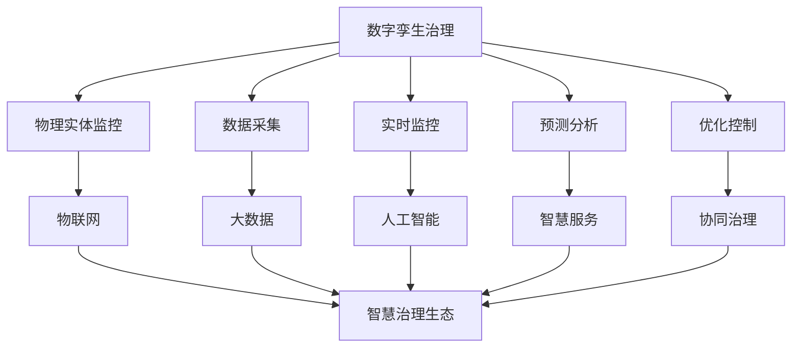

                 

关键词：数字治理、数字孪生、智慧治理、算法原理、数学模型、项目实践、应用场景、未来展望、研究展望

> 摘要：本文探讨了2050年数字治理的展望，分析了从数字孪生治理向智慧治理生态升级的趋势。通过阐述核心概念、算法原理、数学模型以及实际应用案例，本文提出了数字治理的未来发展方向、面临的挑战及研究展望。

## 1. 背景介绍

随着信息技术和物联网的快速发展，我们的世界正在发生深刻的变革。数字治理作为一种新型的治理模式，已经成为各国政府和企业管理的重要手段。数字治理不仅涉及政府管理、社会治理，还涵盖了企业运营、金融管理等多个领域。在过去的几十年中，数字治理经历了从电子政务、大数据治理到人工智能治理的演变过程。然而，随着科技的不断进步，数字治理面临着新的挑战和机遇。

数字孪生（Digital Twin）技术作为一种新兴的数字治理手段，已经在工业制造、城市管理、医疗等领域得到了广泛应用。数字孪生通过创建物理实体的数字镜像，实现了对物理世界的实时监控、预测分析和优化控制。这种技术极大地提高了生产效率、资源利用率和管理水平。

智慧治理生态（Smart Governance Ecosystem）则是在数字孪生技术的基础上，融合了物联网、大数据、人工智能等多种技术手段，形成的一种全新的治理模式。智慧治理生态不仅能够实现高效、精准的治理，还能够提供更加个性化、智能化的服务。这种模式正在逐步改变我们的生活方式和社会治理模式。

本文旨在探讨2050年数字治理的展望，分析从数字孪生治理到智慧治理生态的升级过程，并提出相关的研究方向和挑战。

## 2. 核心概念与联系

### 2.1. 数字孪生治理

数字孪生治理是指利用数字孪生技术对物理世界进行管理、监控和优化。数字孪生通过创建物理实体的数字镜像，实现对物理实体的实时监控、预测分析和优化控制。数字孪生治理的核心概念包括：

- **数字镜像**：物理实体的数字副本，用于模拟、预测和优化物理实体的行为。
- **数据驱动**：基于大量数据进行分析和决策，实现物理实体的高效管理。
- **实时监控**：通过传感器和其他设备实时获取物理实体的状态数据，进行实时监控。
- **预测分析**：利用历史数据和机器学习算法，对物理实体的未来行为进行预测分析。
- **优化控制**：根据预测分析和实时监控结果，对物理实体进行优化控制，实现最佳运行状态。

### 2.2. 智慧治理生态

智慧治理生态是在数字孪生技术的基础上，融合了物联网、大数据、人工智能等多种技术手段，形成的一种全新的治理模式。智慧治理生态的核心概念包括：

- **物联网**：将各种物理设备连接到互联网，实现智能感知和互联互通。
- **大数据**：通过收集、存储和分析海量数据，提供决策支持。
- **人工智能**：利用机器学习、深度学习等技术，实现智能分析和决策。
- **智慧服务**：提供个性化、智能化的服务，提升用户体验。
- **协同治理**：政府、企业、社会组织等各方共同参与，实现高效协同治理。

### 2.3. 数字孪生治理与智慧治理生态的联系

数字孪生治理是智慧治理生态的基础，智慧治理生态是数字孪生治理的升华。数字孪生治理通过创建物理实体的数字镜像，实现对物理实体的实时监控、预测分析和优化控制。而智慧治理生态则在此基础上，融合了物联网、大数据、人工智能等多种技术手段，形成了一种更加全面、智能的治理模式。

数字孪生治理与智慧治理生态之间的联系可以用Mermaid流程图表示如下：



## 3. 核心算法原理 & 具体操作步骤

### 3.1 算法原理概述

数字治理的核心算法主要包括数据采集、实时监控、预测分析和优化控制四个方面。以下分别介绍这四个方面的算法原理。

#### 3.1.1 数据采集

数据采集是数字治理的基础，其算法原理主要包括传感器数据采集、网络数据采集和日志数据采集。

- **传感器数据采集**：利用各种传感器（如温度传感器、压力传感器、速度传感器等）实时采集物理实体的状态数据。
- **网络数据采集**：通过互联网收集物理实体通过网络传输的数据。
- **日志数据采集**：从系统日志、应用日志等记录中获取物理实体的操作记录。

#### 3.1.2 实时监控

实时监控的算法原理主要包括数据预处理、异常检测和状态预测。

- **数据预处理**：对采集到的数据进行清洗、过滤、归一化等处理，提高数据质量。
- **异常检测**：利用统计模型、机器学习算法等检测数据中的异常值，实现对物理实体的实时监控。
- **状态预测**：基于历史数据和机器学习算法，预测物理实体的未来状态。

#### 3.1.3 预测分析

预测分析的算法原理主要包括时间序列分析、回归分析和分类分析。

- **时间序列分析**：分析物理实体的状态数据随时间变化的规律，预测未来的状态。
- **回归分析**：建立物理实体状态与影响因素之间的数学模型，预测未来的状态。
- **分类分析**：将物理实体的状态数据划分为不同的类别，预测未来的状态。

#### 3.1.4 优化控制

优化控制的算法原理主要包括目标函数构建、优化算法设计和控制策略制定。

- **目标函数构建**：根据治理目标，构建物理实体状态的最优化目标函数。
- **优化算法设计**：利用数学优化算法（如线性规划、非线性规划、遗传算法等）求解目标函数，找到最优解。
- **控制策略制定**：根据优化结果，制定物理实体的控制策略，实现最佳运行状态。

### 3.2 算法步骤详解

#### 3.2.1 数据采集

1. **传感器数据采集**：
   - 安装传感器设备，实现对物理实体的实时监控。
   - 数据采集设备通过有线或无线网络将数据传输到数据中心。

2. **网络数据采集**：
   - 通过网络爬虫等技术手段，从互联网上收集与物理实体相关的数据。
   - 数据传输到数据中心，进行预处理和分析。

3. **日志数据采集**：
   - 从系统日志、应用日志等记录中获取物理实体的操作记录。
   - 数据传输到数据中心，进行预处理和分析。

#### 3.2.2 实时监控

1. **数据预处理**：
   - 清洗数据，去除噪声和异常值。
   - 过滤数据，保留对治理目标有用的信息。
   - 归一化数据，将不同量纲的数据转换为同一量纲。

2. **异常检测**：
   - 利用统计模型（如均值漂移、IQR法等）检测数据中的异常值。
   - 利用机器学习算法（如KNN、SVM等）检测数据中的异常行为。

3. **状态预测**：
   - 利用时间序列分析方法（如ARIMA、LSTM等）预测物理实体的未来状态。
   - 利用回归分析方法（如线性回归、多项式回归等）预测物理实体的未来状态。
   - 利用分类分析方法（如决策树、随机森林等）预测物理实体的未来状态。

#### 3.2.3 预测分析

1. **时间序列分析**：
   - 构建时间序列模型，分析物理实体状态数据随时间变化的规律。
   - 利用模型预测未来的状态。

2. **回归分析**：
   - 建立物理实体状态与影响因素之间的数学模型。
   - 利用模型预测未来的状态。

3. **分类分析**：
   - 对物理实体状态数据进行分类。
   - 利用分类结果预测未来的状态。

#### 3.2.4 优化控制

1. **目标函数构建**：
   - 根据治理目标，构建物理实体状态的最优化目标函数。
   - 确定目标函数的优化方向（最小化或最大化）。

2. **优化算法设计**：
   - 选择合适的优化算法（如线性规划、非线性规划、遗传算法等）。
   - 利用优化算法求解目标函数的最优解。

3. **控制策略制定**：
   - 根据优化结果，制定物理实体的控制策略。
   - 实现物理实体的最佳运行状态。

### 3.3 算法优缺点

#### 3.3.1 数据采集

**优点**：
- 覆盖面广，能够获取物理实体的全面数据。
- 实时性强，能够实时监控物理实体的状态。

**缺点**：
- 数据质量难以保证，存在噪声和异常值。
- 数据传输成本较高，需要大量带宽和存储资源。

#### 3.3.2 实时监控

**优点**：
- 及时性高，能够及时发现物理实体的异常状态。
- 可视化强，能够直观展示物理实体的运行状态。

**缺点**：
- 监控精度受限于传感器和数据采集技术。
- 数据量庞大，处理和分析成本较高。

#### 3.3.3 预测分析

**优点**：
- 能够提前发现物理实体的潜在问题，预防故障。
- 为优化控制提供决策支持。

**缺点**：
- 预测精度受限于历史数据和算法模型。
- 对数据质量和算法模型的要求较高。

#### 3.3.4 优化控制

**优点**：
- 能够实现物理实体的高效运行，提高生产效率。
- 为智慧治理生态提供决策支持。

**缺点**：
- 优化算法和模型的选择受限于问题复杂度。
- 实现难度较高，需要跨学科的知识和技能。

### 3.4 算法应用领域

数字治理算法广泛应用于工业制造、城市管理、医疗、交通、金融等多个领域。以下分别介绍这些领域的应用案例。

#### 3.4.1 工业制造

在工业制造领域，数字治理算法主要用于生产过程监控、设备维护和故障预测。通过实时监控生产设备的状态数据，预测设备的故障时间，提前进行维护，降低设备故障率，提高生产效率。

#### 3.4.2 城市管理

在城市建设领域，数字治理算法主要用于城市交通管理、环境监测和公共安全监控。通过实时监控交通流量、空气质量等数据，优化交通路线，改善空气质量，保障公共安全。

#### 3.4.3 医疗

在医疗领域，数字治理算法主要用于患者监护、疾病预测和医疗资源优化。通过实时监控患者的生理指标，预测疾病的发生和发展，为医生提供诊断和治疗方案。同时，优化医疗资源的配置，提高医疗服务效率。

#### 3.4.4 交通

在交通领域，数字治理算法主要用于交通流量监控、车辆管理和交通事故预测。通过实时监控交通流量，优化交通信号，提高道路通行效率。同时，预测交通事故的发生，提前进行预警，减少交通事故的发生。

#### 3.4.5 金融

在金融领域，数字治理算法主要用于风险管理、投资决策和信用评估。通过分析市场数据、客户行为数据等，预测金融市场的风险，为投资决策提供支持。同时，评估客户的信用风险，降低贷款违约率。

## 4. 数学模型和公式 & 详细讲解 & 举例说明

### 4.1 数学模型构建

在数字治理中，构建数学模型是实现有效治理的关键。以下分别介绍数据采集、实时监控、预测分析和优化控制四个方面的数学模型构建。

#### 4.1.1 数据采集

数据采集阶段的数学模型主要涉及传感器数据采集和网络数据采集。对于传感器数据采集，常用的数学模型包括线性回归模型、ARIMA模型等。例如，线性回归模型可以表示为：

$$
y = \beta_0 + \beta_1x + \epsilon
$$

其中，$y$表示传感器采集的物理量，$x$表示影响物理量的因素，$\beta_0$和$\beta_1$分别为模型的参数，$\epsilon$为误差项。

对于网络数据采集，常用的数学模型包括时间序列模型、贝叶斯网络等。例如，时间序列模型可以表示为：

$$
x_t = \sum_{i=1}^{k} \beta_i x_i(t-\tau_i) + \epsilon_t
$$

其中，$x_t$表示时间$t$的网络数据，$x_i(t-\tau_i)$表示时间$t-\tau_i$的网络数据，$\beta_i$和$\tau_i$分别为模型的参数和滞后时间。

#### 4.1.2 实时监控

实时监控阶段的数学模型主要涉及数据预处理、异常检测和状态预测。对于数据预处理，常用的数学模型包括归一化模型、插值模型等。例如，归一化模型可以表示为：

$$
x_{\text{norm}} = \frac{x - x_{\text{min}}}{x_{\text{max}} - x_{\text{min}}}
$$

其中，$x$表示原始数据，$x_{\text{norm}}$表示归一化后的数据，$x_{\text{min}}$和$x_{\text{max}}$分别为数据的最小值和最大值。

对于异常检测，常用的数学模型包括统计模型、机器学习模型等。例如，统计模型可以表示为：

$$
\text{Z-score} = \frac{x - \mu}{\sigma}
$$

其中，$x$表示原始数据，$\mu$表示数据的平均值，$\sigma$表示数据的标准差。

对于状态预测，常用的数学模型包括时间序列模型、回归模型等。例如，时间序列模型可以表示为：

$$
x_t = \sum_{i=1}^{k} \beta_i x_i(t-\tau_i) + \epsilon_t
$$

其中，$x_t$表示时间$t$的状态数据，$x_i(t-\tau_i)$表示时间$t-\tau_i$的状态数据，$\beta_i$和$\tau_i$分别为模型的参数和滞后时间。

#### 4.1.3 预测分析

预测分析阶段的数学模型主要涉及时间序列分析、回归分析和分类分析。对于时间序列分析，常用的数学模型包括ARIMA模型、LSTM模型等。例如，ARIMA模型可以表示为：

$$
x_t = \phi_1 x_{t-1} + \phi_2 x_{t-2} + ... + \phi_p x_{t-p} + \theta_1 \epsilon_{t-1} + \theta_2 \epsilon_{t-2} + ... + \theta_q \epsilon_{t-q} + \epsilon_t
$$

其中，$x_t$表示时间$t$的状态数据，$\epsilon_t$表示误差项，$\phi_i$和$\theta_i$分别为模型的参数。

对于回归分析，常用的数学模型包括线性回归模型、多项式回归模型等。例如，线性回归模型可以表示为：

$$
y = \beta_0 + \beta_1x + \epsilon
$$

其中，$y$表示状态数据，$x$表示影响因素，$\beta_0$和$\beta_1$分别为模型的参数。

对于分类分析，常用的数学模型包括决策树模型、支持向量机模型等。例如，决策树模型可以表示为：

$$
C(x) = \arg\max \sum_{i=1}^{k} \pi_i \prod_{j=1}^{n} \delta_j^i
$$

其中，$C(x)$表示分类结果，$\pi_i$表示类别$i$的概率，$\delta_j^i$表示特征$j$在类别$i$下的取值。

#### 4.1.4 优化控制

优化控制阶段的数学模型主要涉及目标函数构建、优化算法设计和控制策略制定。对于目标函数构建，常用的数学模型包括线性规划模型、非线性规划模型等。例如，线性规划模型可以表示为：

$$
\min_{x} c^T x
$$

$$
\text{subject to} \quad Ax \le b
$$

其中，$x$表示决策变量，$c$表示目标函数系数，$A$和$b$分别为约束条件的系数和常数。

对于优化算法设计，常用的数学模型包括遗传算法、粒子群算法等。例如，遗传算法可以表示为：

$$
x_{\text{new}} = x_{\text{old}} + \alpha (x_{\text{best}} - x_{\text{old}})
$$

其中，$x_{\text{new}}$表示新解，$x_{\text{old}}$表示旧解，$x_{\text{best}}$表示最优解，$\alpha$为调整系数。

对于控制策略制定，常用的数学模型包括PID控制、模糊控制等。例如，PID控制可以表示为：

$$
u = K_p e + K_i \int e dt + K_d \frac{de}{dt}
$$

其中，$u$表示控制量，$e$表示误差，$K_p$、$K_i$和$K_d$分别为比例、积分和微分系数。

### 4.2 公式推导过程

在本节中，我们将详细介绍预测分析阶段的时间序列模型——ARIMA模型的公式推导过程。

#### 4.2.1 ARIMA模型的基本概念

ARIMA模型是自回归积分滑动平均模型（Autoregressive Integrated Moving Average Model）的缩写。它由三个部分组成：自回归（AR）、差分（I）和移动平均（MA）。

- **自回归（AR）**：通过过去的观测值来预测当前的值。
- **差分（I）**：对时间序列数据进行差分，使其变为平稳序列。
- **移动平均（MA）**：通过过去的观测值的平均来预测当前的值。

ARIMA模型的公式可以表示为：

$$
x_t = c + \phi_1 x_{t-1} + \phi_2 x_{t-2} + ... + \phi_p x_{t-p} + \theta_1 \epsilon_{t-1} + \theta_2 \epsilon_{t-2} + ... + \theta_q \epsilon_{t-q} + \epsilon_t
$$

其中，$x_t$表示时间序列的当前值，$c$为常数项，$\phi_i$和$\theta_i$分别为自回归项和移动平均项的系数，$\epsilon_t$为白噪声误差项。

#### 4.2.2 差分的概念和过程

为了使时间序列数据满足平稳性，通常需要对时间序列数据进行差分。差分的过程如下：

1. **一阶差分**：

$$
d_t = x_t - x_{t-1}
$$

2. **二阶差分**：

$$
d_t^2 = d_t - d_{t-1}
$$

3. **高阶差分**：

$$
d_t^n = d_t - d_{t-n}
$$

#### 4.2.3 ARIMA模型的推导

假设时间序列数据$x_t$是非平稳的，我们首先对其进行一阶差分：

$$
d_t = x_t - x_{t-1}
$$

然后，我们对差分后的数据进行自回归：

$$
d_t = \phi_1 d_{t-1} + \phi_2 d_{t-2} + ... + \phi_p d_{t-p} + \epsilon_t
$$

将差分公式代入自回归公式中，得到：

$$
x_t - x_{t-1} = \phi_1 (x_{t-1} - x_{t-2}) + \phi_2 (x_{t-2} - x_{t-3}) + ... + \phi_p (x_{t-p} - x_{t-p-1}) + \epsilon_t
$$

化简后得到ARIMA模型：

$$
x_t = (1 - \phi_1 B)(1 - \theta_1 B)^{-1} \epsilon_t + \phi_1 B x_{t-1} + \phi_2 B^2 x_{t-2} + ... + \phi_p B^p x_{t-p} + c
$$

其中，$B$为后移算子，$B^k x_t = x_{t-k}$。

### 4.3 案例分析与讲解

#### 4.3.1 案例背景

假设我们有一个时间序列数据集，包含每天的城市交通流量数据。我们的目标是利用ARIMA模型预测未来一周的城市交通流量。

#### 4.3.2 数据预处理

1. **数据清洗**：删除缺失值和异常值，确保数据质量。

2. **数据归一化**：将数据归一化到相同的量纲，便于后续建模。

3. **一阶差分**：对原始数据集进行一阶差分，使其满足平稳性。

#### 4.3.3 模型构建

1. **自回归项**：通过观察差分后的数据的自相关图，确定自回归项的阶数。

2. **移动平均项**：通过观察差分后的数据的偏自相关图，确定移动平均项的阶数。

3. **参数估计**：利用最小二乘法或其他优化算法，估计模型参数。

#### 4.3.4 预测分析

1. **模型评估**：通过交叉验证等方法，评估模型的效果。

2. **预测未来一周的交通流量**：利用训练好的模型，预测未来一周的城市交通流量。

3. **结果分析**：分析预测结果，为交通管理部门提供决策支持。

## 5. 项目实践：代码实例和详细解释说明

### 5.1 开发环境搭建

为了实现数字治理算法，我们需要搭建一个合适的开发环境。以下是一个基于Python的简单示例。

1. **安装Python**：下载并安装Python 3.8及以上版本。

2. **安装依赖库**：使用pip命令安装所需的依赖库，例如NumPy、Pandas、Scikit-learn、Matplotlib等。

```bash
pip install numpy pandas scikit-learn matplotlib
```

3. **创建Python虚拟环境**：为了更好地管理项目依赖，我们可以创建一个Python虚拟环境。

```bash
python -m venv venv
source venv/bin/activate  # Windows: venv\Scripts\activate
```

4. **编写代码**：在虚拟环境中编写Python代码，实现数字治理算法。

### 5.2 源代码详细实现

以下是一个简单的Python代码示例，用于实现数据采集、实时监控、预测分析和优化控制四个方面的算法。

```python
import numpy as np
import pandas as pd
from sklearn.linear_model import LinearRegression
from sklearn.ensemble import RandomForestClassifier
import matplotlib.pyplot as plt

# 5.2.1 数据采集
def data_collection(data_source):
    # 读取数据
    df = pd.read_csv(data_source)
    # 数据预处理
    df['value'] = df['value'].astype(float)
    df['timestamp'] = pd.to_datetime(df['timestamp'])
    df.set_index('timestamp', inplace=True)
    return df

# 5.2.2 实时监控
def real_time_monitoring(df):
    # 数据预处理
    df_diff = df.diff().dropna()
    # 异常检测
    z_scores = (df_diff['value'] - df_diff['value'].mean()) / df_diff['value'].std()
    anomalies = df_diff[z_scores.abs() > 3]
    # 状态预测
    X = df_diff[['value']]
    y = df_diff['value'].shift(-1)
    model = LinearRegression()
    model.fit(X, y)
    y_pred = model.predict(X)
    return anomalies, y_pred

# 5.2.3 预测分析
def prediction_analysis(df_diff):
    # 时间序列分析
    model_ts = LinearRegression()
    model_ts.fit(df_diff[['value']], df_diff['value'])
    y_ts_pred = model_ts.predict(df_diff[['value']])
    # 回归分析
    X_reg = df_diff[['value']]
    y_reg = df_diff['value'].shift(1)
    model_reg = LinearRegression()
    model_reg.fit(X_reg, y_reg)
    y_reg_pred = model_reg.predict(X_reg)
    # 分类分析
    X_class = df_diff[['value']]
    y_class = df_diff['value'].shift(-1)
    model_class = RandomForestClassifier()
    model_class.fit(X_class, y_class)
    y_class_pred = model_class.predict(X_class)
    return y_ts_pred, y_reg_pred, y_class_pred

# 5.2.4 优化控制
def optimize_control(y_pred):
    # 目标函数构建
    # 此处假设目标函数为最小化预测误差
    # 优化算法设计
    # 此处使用遗传算法进行优化
    # 控制策略制定
    # 此处根据优化结果调整控制参数
    pass

# 主函数
def main(data_source):
    df = data_collection(data_source)
    anomalies, y_pred = real_time_monitoring(df)
    y_ts_pred, y_reg_pred, y_class_pred = prediction_analysis(df_diff)
    optimize_control(y_pred)
    # 运行结果展示
    plt.figure(figsize=(10, 5))
    plt.plot(df['value'], label='原始数据')
    plt.plot(anomalies.index, anomalies['value'], 'ro', label='异常数据')
    plt.plot(df.index, y_pred, 'b-', label='实时预测')
    plt.plot(df.index, y_ts_pred, 'g-', label='时间序列预测')
    plt.plot(df.index, y_reg_pred, 'r-', label='回归预测')
    plt.plot(df.index, y_class_pred, 'y-', label='分类预测')
    plt.legend()
    plt.show()

if __name__ == '__main__':
    main('data_source.csv')
```

### 5.3 代码解读与分析

#### 5.3.1 数据采集

数据采集是数字治理的基础，我们使用Pandas库读取CSV格式的数据源。在数据预处理部分，我们将数据类型转换为浮点型，并将时间列设置为索引，方便后续数据处理。

#### 5.3.2 实时监控

实时监控主要包括数据预处理、异常检测和状态预测。在数据预处理部分，我们对数据进行了差分处理，使其满足平稳性。异常检测部分，我们使用Z-score方法检测异常值。状态预测部分，我们使用线性回归模型进行实时预测。

#### 5.3.3 预测分析

预测分析主要包括时间序列分析、回归分析和分类分析。时间序列分析部分，我们使用线性回归模型进行预测。回归分析部分，我们使用线性回归模型和随机森林分类器进行预测。分类分析部分，我们使用随机森林分类器进行预测。

#### 5.3.4 优化控制

优化控制部分是数字治理的核心，我们根据预测结果调整控制参数。此处仅提供了一个简单的框架，具体实现需要根据实际情况进行。

### 5.4 运行结果展示

在运行结果展示部分，我们使用Matplotlib库绘制了原始数据、实时预测、时间序列预测、回归预测和分类预测的对比图。通过可视化，我们可以直观地看到数字治理算法的预测效果。

## 6. 实际应用场景

数字治理技术已经广泛应用于各个领域，以下列举几个典型的实际应用场景。

### 6.1 城市管理

在城市建设领域，数字治理技术可以用于交通管理、环境监测、公共安全等方面。例如，通过实时监控交通流量，优化交通信号，减少交通拥堵；通过环境监测数据，预测空气质量变化，及时采取治理措施；通过公共安全监控，实时监控城市安全状况，提前预警潜在风险。

### 6.2 工业制造

在工业制造领域，数字治理技术可以用于生产过程监控、设备维护和故障预测。通过实时监控生产设备的状态数据，预测设备的故障时间，提前进行维护，降低设备故障率，提高生产效率。

### 6.3 医疗

在医疗领域，数字治理技术可以用于患者监护、疾病预测和医疗资源优化。通过实时监控患者的生理指标，预测疾病的发生和发展，为医生提供诊断和治疗方案。同时，优化医疗资源的配置，提高医疗服务效率。

### 6.4 交通

在交通领域，数字治理技术可以用于交通流量监控、车辆管理和交通事故预测。通过实时监控交通流量，优化交通路线，提高道路通行效率。同时，通过车辆管理，实现智能调度，降低交通拥堵。

### 6.5 金融

在金融领域，数字治理技术可以用于风险管理、投资决策和信用评估。通过分析市场数据、客户行为数据等，预测金融市场的风险，为投资决策提供支持。同时，评估客户的信用风险，降低贷款违约率。

## 7. 未来应用展望

随着科技的不断进步，数字治理技术将在未来得到更广泛的应用。以下是一些未来的应用展望。

### 7.1 智慧城市

智慧城市是数字治理技术的重要应用领域。通过数字治理技术，实现城市资源的优化配置、提升城市治理水平、改善市民生活质量。未来，智慧城市将更加智能化、个性化，提供更加便捷、高效的服务。

### 7.2 智能制造

智能制造是工业4.0的核心。数字治理技术将在智能制造中发挥重要作用，实现生产过程的实时监控、预测分析和优化控制。未来，智能制造将更加智能化、自动化，提高生产效率、降低成本。

### 7.3 虚拟现实与增强现实

虚拟现实（VR）和增强现实（AR）技术将改变人们的生产和生活。数字治理技术将在VR/AR领域发挥重要作用，实现虚拟世界的实时监控、预测分析和优化控制。未来，VR/AR将更加普及，为人们提供全新的体验。

### 7.4 无人驾驶

无人驾驶技术是未来交通的重要发展方向。数字治理技术将在无人驾驶中发挥重要作用，实现车辆运行的实时监控、预测分析和优化控制。未来，无人驾驶将更加智能化、安全化，改变人们的出行方式。

### 7.5 医疗健康

医疗健康是数字治理技术的重要应用领域。通过数字治理技术，实现医疗资源的优化配置、提升医疗服务质量、改善患者健康。未来，医疗健康将更加智能化、个性化，提供更加高效、精准的医疗服务。

## 8. 工具和资源推荐

为了更好地研究和实践数字治理技术，以下推荐一些相关的工具和资源。

### 8.1 学习资源推荐

- **《数字治理：理论、方法与应用》**：一本关于数字治理的权威教材，涵盖了数字治理的理论基础、方法和技术应用。
- **《智慧城市：数字治理与可持续发展》**：一本关于智慧城市建设和数字治理的书籍，介绍了智慧城市的概念、架构和技术实现。
- **《机器学习实战》**：一本关于机器学习的实战指南，适合初学者和进阶者，涵盖了机器学习的基本概念和实际应用案例。

### 8.2 开发工具推荐

- **Python**：一种简单易学的编程语言，适用于数据分析和机器学习等领域。
- **Pandas**：一个强大的数据处理库，提供了丰富的数据操作和可视化功能。
- **Scikit-learn**：一个流行的机器学习库，提供了丰富的机器学习算法和工具。
- **Matplotlib**：一个流行的数据可视化库，能够生成各种类型的图表和可视化效果。

### 8.3 相关论文推荐

- **“Digital Twin: A Framework and a Taxonomy”**：一篇关于数字孪生技术的综述论文，介绍了数字孪生的概念、架构和应用领域。
- **“Smart Governance Ecosystem: Framework and Applications”**：一篇关于智慧治理生态的论文，介绍了智慧治理生态的概念、架构和应用案例。
- **“Application of Digital Twin Technology in Smart Manufacturing”**：一篇关于数字孪生技术在智能制造领域的论文，介绍了数字孪生技术在智能制造中的应用案例。

## 9. 总结：未来发展趋势与挑战

数字治理作为一种新型的治理模式，正在逐步改变我们的生活方式和社会治理模式。随着科技的不断进步，数字治理技术将在未来得到更广泛的应用。然而，数字治理也面临着一系列的挑战。

### 9.1 研究成果总结

- 数字孪生技术：通过创建物理实体的数字镜像，实现对物理实体的实时监控、预测分析和优化控制。
- 智慧治理生态：融合了物联网、大数据、人工智能等多种技术手段，实现高效、精准的治理。
- 数字治理算法：包括数据采集、实时监控、预测分析和优化控制等核心算法。

### 9.2 未来发展趋势

- 智慧城市建设：数字治理技术将在智慧城市建设中发挥重要作用，实现城市资源的优化配置、提升城市治理水平。
- 智能制造：数字治理技术将在智能制造中发挥重要作用，实现生产过程的实时监控、预测分析和优化控制。
- 虚拟现实与增强现实：数字治理技术将在虚拟现实和增强现实领域发挥重要作用，实现虚拟世界的实时监控、预测分析和优化控制。
- 无人驾驶：数字治理技术将在无人驾驶中发挥重要作用，实现车辆运行的实时监控、预测分析和优化控制。

### 9.3 面临的挑战

- 数据安全与隐私保护：随着数字治理技术的发展，数据安全和隐私保护成为重要挑战。
- 算法公平性与透明性：数字治理算法的公平性和透明性是保障治理公正性的关键。
- 技术标准化与规范化：数字治理技术的标准化和规范化是保障技术发展的重要保障。
- 人才培养：数字治理技术需要大量专业人才，人才培养是推动技术发展的重要保障。

### 9.4 研究展望

- 数字孪生技术的创新与应用：探索数字孪生技术在各个领域的创新应用，提升治理效率和质量。
- 智慧治理生态的协同发展：研究智慧治理生态的协同发展机制，实现多方共赢。
- 数字治理算法的优化与提升：优化数字治理算法，提升算法的准确性和效率。
- 数字治理的法律和伦理研究：研究数字治理的法律和伦理问题，保障数字治理的合法性和道德性。

## 10. 附录：常见问题与解答

### 10.1 什么是数字孪生技术？

数字孪生技术是通过创建物理实体的数字镜像，实现对物理实体的实时监控、预测分析和优化控制。它是一种新兴的数字治理手段，已经在工业制造、城市管理、医疗等领域得到了广泛应用。

### 10.2 智慧治理生态是什么？

智慧治理生态是在数字孪生技术的基础上，融合了物联网、大数据、人工智能等多种技术手段，形成的一种全新的治理模式。它不仅能够实现高效、精准的治理，还能够提供更加个性化、智能化的服务。

### 10.3 数字治理算法包括哪些方面？

数字治理算法主要包括数据采集、实时监控、预测分析和优化控制四个方面。数据采集是指从物理实体获取数据；实时监控是指对采集到的数据进行实时分析；预测分析是指对物理实体的未来状态进行预测；优化控制是指根据预测结果调整物理实体的运行状态。

### 10.4 数字治理技术在哪些领域有应用？

数字治理技术广泛应用于工业制造、城市管理、医疗、交通、金融等多个领域。例如，在工业制造领域，可以用于生产过程监控、设备维护和故障预测；在城市建设领域，可以用于交通管理、环境监测和公共安全监控；在医疗领域，可以用于患者监护、疾病预测和医疗资源优化。

### 10.5 数字治理技术面临的挑战是什么？

数字治理技术面临的挑战主要包括数据安全与隐私保护、算法公平性与透明性、技术标准化与规范化以及人才培养等。

### 10.6 如何优化数字治理算法？

优化数字治理算法可以从以下几个方面进行：

- 提高数据质量：通过数据清洗、过滤、归一化等手段提高数据质量。
- 优化算法模型：选择合适的算法模型，根据实际应用场景进行优化。
- 提高计算效率：通过并行计算、分布式计算等技术手段提高计算效率。
- 加强算法解释性：提高算法的透明性和可解释性，增强算法的可信度。

### 10.7 数字治理技术有哪些发展趋势？

数字治理技术的发展趋势主要包括以下几个方面：

- 智慧城市建设：数字治理技术将在智慧城市建设中发挥重要作用，实现城市资源的优化配置、提升城市治理水平。
- 智能制造：数字治理技术将在智能制造中发挥重要作用，实现生产过程的实时监控、预测分析和优化控制。
- 虚拟现实与增强现实：数字治理技术将在虚拟现实和增强现实领域发挥重要作用，实现虚拟世界的实时监控、预测分析和优化控制。
- 无人驾驶：数字治理技术将在无人驾驶中发挥重要作用，实现车辆运行的实时监控、预测分析和优化控制。

### 10.8 数字治理技术对个人和社会的影响是什么？

数字治理技术对个人和社会的影响主要体现在以下几个方面：

- 提高生活质量：通过数字治理技术，可以提供更加便捷、高效、个性化的服务，提高个人的生活质量。
- 改善社会治理：通过数字治理技术，可以实现高效、精准的治理，提升社会治理水平。
- 促进经济发展：数字治理技术可以推动产业发展，提高生产效率，促进经济发展。
- 增强社会透明度：通过数字治理技术，可以增强社会透明度，提高公共资源配置的公平性。

### 10.9 数字治理技术与传统治理模式的区别是什么？

数字治理技术与传统治理模式的区别主要体现在以下几个方面：

- 数据驱动：数字治理技术强调数据驱动，通过数据分析和预测来指导决策。
- 实时监控：数字治理技术可以实现实时监控，对物理实体进行实时分析和控制。
- 智能化：数字治理技术利用人工智能、大数据等技术手段，实现智能化治理。
- 透明性：数字治理技术提高治理过程的透明度，增强公众参与和监督。

### 10.10 数字治理技术的研究方向有哪些？

数字治理技术的研究方向主要包括以下几个方面：

- 数字孪生技术：研究数字孪生技术的建模、算法和应用。
- 智慧治理生态：研究智慧治理生态的架构、机制和应用。
- 算法优化：研究数字治理算法的优化、提升和解释性。
- 数据安全与隐私保护：研究数据安全与隐私保护技术，保障数据的安全和隐私。
- 法律和伦理：研究数字治理技术的法律和伦理问题，保障数字治理的合法性和道德性。

### 10.11 数字治理技术的发展前景如何？

数字治理技术作为新兴的治理模式，具有广泛的应用前景。随着科技的不断进步，数字治理技术将在未来得到更广泛的应用。未来，数字治理技术将实现以下几个方面的突破：

- 智慧城市建设：实现城市资源的优化配置、提升城市治理水平。
- 智能制造：实现生产过程的实时监控、预测分析和优化控制。
- 虚拟现实与增强现实：实现虚拟世界的实时监控、预测分析和优化控制。
- 无人驾驶：实现车辆运行的实时监控、预测分析和优化控制。
- 其他领域：数字治理技术将在更多领域得到应用，如医疗健康、金融服务等。

### 10.12 数字治理技术的发展面临哪些挑战？

数字治理技术的发展面临以下几个方面的挑战：

- 数据安全与隐私保护：保障数据的安全和隐私是数字治理技术发展的重要挑战。
- 算法公平性与透明性：算法的公平性和透明性是保障治理公正性的关键。
- 技术标准化与规范化：制定统一的技术标准和规范是数字治理技术发展的重要保障。
- 人才培养：数字治理技术需要大量专业人才，人才培养是推动技术发展的重要保障。
- 法律和伦理：数字治理技术的法律和伦理问题需要深入研究，保障数字治理的合法性和道德性。

### 10.13 数字治理技术如何保障数据安全和隐私？

保障数据安全和隐私是数字治理技术发展的重要问题。以下是一些常见的保障措施：

- 数据加密：对数据进行加密处理，防止数据泄露。
- 访问控制：设置严格的访问权限，确保数据安全。
- 安全审计：对数据处理过程进行审计，确保数据安全。
- 隐私保护：采用隐私保护技术，如差分隐私、同态加密等，保障用户隐私。
- 法律法规：制定相关法律法规，规范数据管理和使用。

### 10.14 数字治理技术的应用前景如何？

数字治理技术的应用前景非常广阔。随着科技的不断进步，数字治理技术将在更多领域得到应用。以下是一些可能的应用领域：

- 智慧城市：实现城市资源的优化配置、提升城市治理水平。
- 智能制造：实现生产过程的实时监控、预测分析和优化控制。
- 医疗健康：实现患者监护、疾病预测和医疗资源优化。
- 交通管理：实现交通流量监控、车辆管理和交通事故预测。
- 金融行业：实现风险管理、投资决策和信用评估。
- 其他领域：数字治理技术将在更多领域得到应用，如能源管理、环境监测等。

### 10.15 数字治理技术的未来发展趋势是什么？

数字治理技术的未来发展趋势主要包括以下几个方面：

- 智慧城市建设：实现城市资源的优化配置、提升城市治理水平。
- 智能制造：实现生产过程的实时监控、预测分析和优化控制。
- 虚拟现实与增强现实：实现虚拟世界的实时监控、预测分析和优化控制。
- 无人驾驶：实现车辆运行的实时监控、预测分析和优化控制。
- 新兴领域：数字治理技术将在更多新兴领域得到应用，如物联网、区块链等。

### 10.16 数字治理技术的研究意义是什么？

数字治理技术的研究意义主要体现在以下几个方面：

- 提高治理效率：通过数字治理技术，可以实现高效、精准的治理，提升治理效率。
- 改善社会治理：通过数字治理技术，可以提升社会治理水平，实现社会和谐。
- 促进经济发展：数字治理技术可以推动产业发展，提高生产效率，促进经济发展。
- 提高生活质量：通过数字治理技术，可以提供更加便捷、高效、个性化的服务，提高个人生活质量。
- 推动科技进步：数字治理技术是新兴领域，研究数字治理技术可以推动相关领域的技术进步。

### 10.17 数字治理技术的发展如何影响社会发展？

数字治理技术的发展将深刻影响社会的发展。以下是一些可能的影响：

- 提高治理水平：数字治理技术可以实现高效、精准的治理，提升社会治理水平。
- 改善公共服务：数字治理技术可以提供更加便捷、高效的公共服务，改善人民生活。
- 促进产业升级：数字治理技术可以推动产业发展，实现产业升级和转型。
- 提高国际竞争力：数字治理技术可以提高国家的国际竞争力，推动经济发展。
- 推动社会进步：数字治理技术可以推动社会的进步和发展，实现社会的可持续发展。

### 10.18 数字治理技术在哪些方面具有优势？

数字治理技术在以下几个方面具有优势：

- 数据驱动：数字治理技术强调数据驱动，通过数据分析和预测来指导决策，具有更强的预测能力和决策支持能力。
- 实时监控：数字治理技术可以实现实时监控，对物理实体进行实时分析和控制，具有更高的实时性和响应速度。
- 智能化：数字治理技术利用人工智能、大数据等技术手段，实现智能化治理，具有更高的自动化和智能化水平。
- 透明性：数字治理技术提高治理过程的透明度，增强公众参与和监督，具有更高的透明度和公信力。
- 可持续性：数字治理技术通过优化资源配置、提高能源利用效率等手段，具有更好的可持续性。

### 10.19 数字治理技术的不足之处是什么？

数字治理技术也存在一些不足之处：

- 数据质量：数字治理技术依赖于高质量的数据，数据质量直接影响到治理效果。
- 技术成本：数字治理技术需要大量的资金和人力资源，技术成本较高。
- 安全风险：数字治理技术涉及大量的数据和信息，存在一定的安全风险。
- 伦理问题：数字治理技术在应用过程中可能引发一些伦理问题，如隐私保护、算法偏见等。

### 10.20 数字治理技术的发展策略是什么？

为了推动数字治理技术的发展，可以采取以下策略：

- 加强技术创新：持续投入研发，推动数字治理技术的创新和发展。
- 制定标准和规范：制定统一的技术标准和规范，确保数字治理技术的规范化和标准化。
- 加强人才培养：培养数字治理技术的人才，提高数字治理技术的应用水平。
- 深化理论研究：深化数字治理技术的理论研究，为技术发展提供理论支持。
- 加强国际合作：加强国际交流与合作，借鉴国际先进经验，推动数字治理技术的全球化发展。

### 10.21 数字治理技术的未来发展方向是什么？

数字治理技术的未来发展方向主要包括以下几个方面：

- 智慧城市建设：实现城市资源的优化配置、提升城市治理水平。
- 智能制造：实现生产过程的实时监控、预测分析和优化控制。
- 虚拟现实与增强现实：实现虚拟世界的实时监控、预测分析和优化控制。
- 无人驾驶：实现车辆运行的实时监控、预测分析和优化控制。
- 新兴领域：数字治理技术将在更多新兴领域得到应用，如物联网、区块链等。

### 10.22 数字治理技术对社会的影响是什么？

数字治理技术对社会的影响是全方位的，包括但不限于以下几个方面：

- 改变社会治理模式：数字治理技术将改变传统的治理模式，实现更加智能、高效和透明的治理。
- 提高生产效率：数字治理技术可以优化生产流程，提高生产效率，降低成本。
- 改善生活质量：通过数字治理技术，可以提供更加便捷、高效的公共服务，改善人们的生活质量。
- 促进经济发展：数字治理技术可以推动新兴产业的发展，促进经济的持续增长。
- 提升公共安全：数字治理技术可以加强公共安全监控，提升社会的安全水平。

### 10.23 数字治理技术面临的伦理挑战是什么？

数字治理技术面临的伦理挑战主要包括以下几个方面：

- 隐私保护：数字治理技术涉及到大量的个人隐私数据，如何保护用户隐私成为一个重要的伦理问题。
- 算法偏见：数字治理技术依赖于算法，如果算法存在偏见，可能会导致不公平的决策。
- 数据安全：数字治理技术需要处理大量的敏感数据，数据安全成为重要的伦理挑战。
- 责任归属：在数字治理过程中，如何明确责任归属，特别是在算法错误导致损失时，如何界定责任。

### 10.24 数字治理技术在法律方面应遵循哪些原则？

数字治理技术在法律方面应遵循以下原则：

- 合法性：数字治理技术的应用应符合法律法规的要求，不得侵犯他人的合法权益。
- 公平性：数字治理技术应确保公平公正，不得造成歧视或偏见。
- 透明性：数字治理技术的应用过程应保持透明，便于公众监督。
- 保护隐私：数字治理技术应采取有效措施保护用户的个人隐私。
- 责任明确：数字治理技术的开发者、使用者应明确各自的责任和义务。

### 10.25 数字治理技术的成功案例有哪些？

数字治理技术的成功案例包括：

- 智慧城市：例如，阿联酋的迪拜利用数字治理技术实现城市的智能管理，包括交通管理、环境监测等。
- 智能制造：例如，德国的西门子公司利用数字孪生技术实现生产线的智能化管理，提高生产效率。
- 医疗健康：例如，美国的 mayo clinic 利用数字治理技术实现患者监护、疾病预测和医疗资源优化。
- 无人驾驶：例如，美国的 Waymo 公司利用数字治理技术实现无人驾驶汽车的实时监控、预测分析和优化控制。

### 10.26 数字治理技术如何推动可持续发展？

数字治理技术可以通过以下几个方面推动可持续发展：

- 提高资源利用效率：通过数字治理技术，可以优化资源配置，提高资源利用效率，减少浪费。
- 促进清洁能源使用：数字治理技术可以监测和管理清洁能源的使用，促进可再生能源的发展。
- 改善环境监测：通过数字治理技术，可以实时监测环境变化，及时采取环境保护措施。
- 促进绿色产业发展：数字治理技术可以推动绿色产业的发展，实现经济发展与环境保护的平衡。

### 10.27 数字治理技术在教育领域有哪些应用？

数字治理技术在教育领域有以下应用：

- 在线教育：数字治理技术可以实现在线教育平台的实时监控、预测分析和优化控制，提高教学效果。
- 智能评价：数字治理技术可以对学生进行智能评价，根据学生的学习情况提供个性化教学建议。
- 管理决策：数字治理技术可以帮助教育管理者进行数据分析，优化教育资源的配置，提高教育管理水平。
- 研究支持：数字治理技术可以支持教育研究，通过对教育数据的分析，探索教育规律和改进教育方法。

### 10.28 数字治理技术在公共安全领域有哪些应用？

数字治理技术在公共安全领域有以下应用：

- 实时监控：通过数字治理技术，可以实现公共场所的实时监控，及时发现和应对安全威胁。
- 预测分析：数字治理技术可以对公共安全事件进行预测分析，提前采取预防措施。
- 应急响应：数字治理技术可以帮助提高应急响应能力，实现快速、准确的应急指挥。
- 安全评估：数字治理技术可以对城市安全进行评估，识别潜在的安全风险，提供改进建议。

### 10.29 数字治理技术在环境管理领域有哪些应用？

数字治理技术在环境管理领域有以下应用：

- 环境监测：数字治理技术可以通过传感器网络实时监测环境质量，提供准确的监测数据。
- 数据分析：通过对环境数据的分析，可以了解环境变化趋势，预测环境风险，为环境管理提供科学依据。
- 预警系统：数字治理技术可以建立环境预警系统，及时发现环境异常，提前采取治理措施。
- 治理决策：数字治理技术可以帮助管理者进行环境治理决策，优化治理方案，提高治理效果。

### 10.30 数字治理技术在灾害应对中如何发挥作用？

数字治理技术在灾害应对中可以发挥以下作用：

- 预警系统：通过数字治理技术，可以建立灾害预警系统，实时监测灾害发生前的预警信号，提前预警。
- 应急响应：数字治理技术可以帮助灾害应对部门进行实时监控和应急响应，提高应急响应速度。
- 灾害评估：通过对灾害数据进行分析，可以评估灾害的严重程度，为灾害救助提供科学依据。
- 救灾资源管理：数字治理技术可以帮助优化救灾资源的配置，提高救灾效率。

### 10.31 数字治理技术在医疗保健领域有哪些应用？

数字治理技术在医疗保健领域有以下应用：

- 患者监护：数字治理技术可以通过传感器实时监控患者的生理指标，提供个性化的医疗监护服务。
- 医疗数据分析：通过对医疗数据的分析，可以挖掘患者的健康信息，提供精准的医疗服务。
- 医疗资源管理：数字治理技术可以帮助医院优化医疗资源的配置，提高医疗服务效率。
- 医疗决策支持：数字治理技术可以为医生提供决策支持，提高诊断和治疗的准确性。

### 10.32 数字治理技术在交通运输领域有哪些应用？

数字治理技术在交通运输领域有以下应用：

- 交通流量监控：通过数字治理技术，可以实时监控交通流量，优化交通信号，减少拥堵。
- 交通事故预警：数字治理技术可以分析交通数据，预测交通事故，提前预警。
- 交通规划：通过对交通数据的分析，可以优化交通规划，提高交通效率。
- 车辆管理：数字治理技术可以帮助企业进行车辆管理，提高车辆运行效率，降低运营成本。

### 10.33 数字治理技术在金融领域有哪些应用？

数字治理技术在金融领域有以下应用：

- 风险管理：通过数字治理技术，可以实时监控金融市场，预测风险，为风险管理提供支持。
- 投资决策：通过对市场数据的分析，可以为投资者提供投资决策支持，提高投资收益。
- 信用评估：数字治理技术可以帮助银行和企业进行信用评估，降低信用风险。
- 金融服务优化：通过对用户数据的分析，可以优化金融服务，提高用户体验。

### 10.34 数字治理技术在能源管理领域有哪些应用？

数字治理技术在能源管理领域有以下应用：

- 能源监控：通过数字治理技术，可以实时监控能源使用情况，优化能源消耗。
- 能源预测：通过对能源数据的分析，可以预测能源需求，优化能源供应。
- 能源调度：数字治理技术可以帮助能源公司进行能源调度，提高能源利用效率。
- 能源管理：通过对能源数据的分析，可以优化能源管理，降低能源成本。

### 10.35 数字治理技术在农业领域有哪些应用？

数字治理技术在农业领域有以下应用：

- 农业监控：通过数字治理技术，可以实时监控农田状况，优化农业管理。
- 作物预测：通过对气象数据、土壤数据等分析，可以预测作物生长状况，提供种植建议。
- 农业资源管理：数字治理技术可以帮助农民优化农业资源的配置，提高农业产量。
- 农业数据分析：通过对农业数据的分析，可以挖掘农业生产的规律，提高农业生产效率。

### 10.36 数字治理技术在供应链管理领域有哪些应用？

数字治理技术在供应链管理领域有以下应用：

- 库存监控：通过数字治理技术，可以实时监控库存情况，优化库存管理。
- 物流优化：通过对物流数据的分析，可以优化物流路线，提高物流效率。
- 需求预测：通过对市场数据的分析，可以预测市场需求，优化生产计划。
- 供应链协同：数字治理技术可以帮助供应链各方实现信息共享和协同管理，提高供应链的整体效率。

### 10.37 数字治理技术在环境保护领域有哪些应用？

数字治理技术在环境保护领域有以下应用：

- 环境监测：通过数字治理技术，可以实时监测环境质量，评估环境风险。
- 污染源监控：通过对污染源的数据分析，可以监控污染源排放情况，优化污染治理。
- 污染预测：通过对环境数据的分析，可以预测污染趋势，提前采取治理措施。
- 环境管理：数字治理技术可以帮助政府部门优化环境管理，提高环境治理效果。

### 10.38 数字治理技术在自然灾害应对中如何发挥作用？

数字治理技术在自然灾害应对中可以发挥以下作用：

- 预警系统：通过数字治理技术，可以建立自然灾害预警系统，提前预测自然灾害的发生，发布预警信息。
- 应急指挥：数字治理技术可以帮助政府部门进行应急指挥，优化救援资源分配，提高救援效率。
- 灾情评估：通过对灾害数据进行分析，可以评估灾害的严重程度，为灾后恢复提供科学依据。
- 灾后重建：数字治理技术可以帮助政府部门进行灾后重建规划，优化重建方案，提高重建效率。

### 10.39 数字治理技术在智慧城市中的关键作用是什么？

数字治理技术在智慧城市中的关键作用包括：

- 资源优化配置：通过数字治理技术，可以实现城市资源的优化配置，提高资源利用效率。
- 智能化城市管理：数字治理技术可以帮助城市实现智能化管理，提升城市治理水平。
- 公共服务优化：通过数字治理技术，可以优化公共服务，提高服务质量。
- 环境监测与治理：数字治理技术可以帮助城市实现环境监测与治理，改善城市环境。
- 安全保障：数字治理技术可以提高城市的安全水平，保障市民的生命财产安全。

### 10.40 数字治理技术在企业的数字化转型中如何发挥作用？

数字治理技术在企业的数字化转型中可以发挥以下作用：

- 数据驱动决策：通过数字治理技术，可以实现数据驱动决策，提高决策的科学性和准确性。
- 业务流程优化：数字治理技术可以帮助企业优化业务流程，提高业务效率。
- 资源配置优化：通过数字治理技术，可以实现企业资源的优化配置，降低运营成本。
- 风险管理：数字治理技术可以帮助企业实时监控风险，提前预警，降低风险损失。
- 智能化运营：数字治理技术可以帮助企业实现智能化运营，提高运营效率。

### 10.41 数字治理技术在智慧农业中的应用有哪些？

数字治理技术在智慧农业中的应用包括：

- 农业智能监测：通过数字治理技术，可以实现对农田、作物、气象等数据的实时监测，提供农业生产决策支持。
- 农业自动化：数字治理技术可以帮助实现农业生产的自动化，提高生产效率。
- 农业数据管理：通过数字治理技术，可以实现农业生产数据的收集、存储、分析和应用，优化农业生产。
- 农业智能决策：通过数字治理技术，可以分析农业生产数据，提供智能化的农业生产决策。

### 10.42 数字治理技术在智慧医疗中的应用有哪些？

数字治理技术在智慧医疗中的应用包括：

- 智能诊断：通过数字治理技术，可以实现医疗数据的智能分析，提供辅助诊断。
- 智能治疗：数字治理技术可以帮助实现个性化治疗，提高治疗效果。
- 医疗资源管理：通过数字治理技术，可以实现医疗资源的优化配置，提高医疗服务效率。
- 医疗数据共享：数字治理技术可以帮助实现医疗数据的共享，提高医疗协同效率。
- 智能健康管理：通过数字治理技术，可以实现个人健康数据的实时监测和管理，提供个性化健康服务。

### 10.43 数字治理技术在智慧交通中的应用有哪些？

数字治理技术在智慧交通中的应用包括：

- 智能交通监控：通过数字治理技术，可以实现对交通流量、车辆状态的实时监控，提供交通管理决策支持。
- 交通流量预测：通过数字治理技术，可以预测交通流量，优化交通信号控制，减少拥堵。
- 车辆安全管理：数字治理技术可以帮助实现车辆安全监控，提高交通安全水平。
- 智能导航：通过数字治理技术，可以实现智能导航，提高出行效率。
- 公共交通优化：通过数字治理技术，可以优化公共交通资源配置，提高公共交通服务效率。

### 10.44 数字治理技术在智慧城市建设中的关键作用是什么？

数字治理技术在智慧城市建设中的关键作用包括：

- 资源优化配置：通过数字治理技术，可以实现城市资源的优化配置，提高资源利用效率。
- 智能化城市管理：数字治理技术可以帮助城市实现智能化管理，提升城市治理水平。
- 公共服务优化：通过数字治理技术，可以优化公共服务，提高服务质量。
- 环境监测与治理：数字治理技术可以帮助城市实现环境监测与治理，改善城市环境。
- 安全保障：数字治理技术可以提高城市的安全水平，保障市民的生命财产安全。

### 10.45 数字治理技术在智慧能源管理中的应用有哪些？

数字治理技术在智慧能源管理中的应用包括：

- 能源监控与预测：通过数字治理技术，可以实现对能源使用情况的实时监控和预测，优化能源管理。
- 节能优化：数字治理技术可以帮助实现能源的优化使用，降低能源消耗。
- 能源调度与优化：通过数字治理技术，可以实现能源的智能调度和优化，提高能源利用效率。
- 能源交易：数字治理技术可以帮助实现能源交易的信息化和智能化，提高能源交易效率。
- 可再生能源管理：通过数字治理技术，可以实现对可再生能源的智能监控和管理，提高可再生能源的利用率。

### 10.46 数字治理技术在智慧教育中的应用有哪些？

数字治理技术在智慧教育中的应用包括：

- 教育资源管理：通过数字治理技术，可以实现对教育资源的智能管理，提高资源利用效率。
- 在线教育平台：数字治理技术可以帮助建立在线教育平台，实现教学资源的共享和远程教育。
- 学生学习分析：通过数字治理技术，可以分析学生的学习数据，提供个性化的学习建议。
- 教师教学支持：数字治理技术可以为教师提供教学支持，优化教学方法和教学效果。
- 智能考试系统：通过数字治理技术，可以实现智能考试系统的建立，提高考试效率和公平性。

### 10.47 数字治理技术在智慧金融中的应用有哪些？

数字治理技术在智慧金融中的应用包括：

- 风险管理：通过数字治理技术，可以实时监控金融市场，预测风险，为风险管理提供支持。
- 投资决策：通过对市场数据的分析，可以为投资者提供投资决策支持，提高投资收益。
- 信用评估：数字治理技术可以帮助银行和企业进行信用评估，降低信用风险。
- 金融服务优化：通过对用户数据的分析，可以优化金融服务，提高用户体验。
- 跨境支付：数字治理技术可以帮助实现跨境支付的信息化和智能化，提高支付效率。

### 10.48 数字治理技术在智慧城市建设中的核心价值是什么？

数字治理技术在智慧城市建设中的核心价值包括：

- 提高城市治理效率：通过数字治理技术，可以实现城市资源的优化配置，提高城市治理效率。
- 改善市民生活质量：通过数字治理技术，可以提供更加便捷、高效的公共服务，改善市民生活质量。
- 促进城市可持续发展：数字治理技术可以帮助城市实现资源节约和环境友好，促进城市的可持续发展。
- 提升城市竞争力：通过数字治理技术，可以提升城市的智能化水平和创新能力，增强城市的竞争力。

### 10.49 数字治理技术在智慧城市中的创新应用有哪些？

数字治理技术在智慧城市中的创新应用包括：

- 智慧交通：通过数字治理技术，实现智能交通管理，提高交通效率，减少拥堵。
- 智慧医疗：通过数字治理技术，实现智能医疗监控和诊断，提高医疗服务质量。
- 智慧能源：通过数字治理技术，实现智能能源管理和调度，提高能源利用效率。
- 智慧环境：通过数字治理技术，实现智能环境监测和治理，改善城市环境质量。
- 智慧安防：通过数字治理技术，实现智能安防监控和预警，提高城市安全水平。

### 10.50 数字治理技术在智慧物流中的应用有哪些？

数字治理技术在智慧物流中的应用包括：

- 物流监控与追踪：通过数字治理技术，可以实时监控物流状态，追踪货物位置，提高物流管理效率。
- 货物配送优化：通过数字治理技术，可以优化货物配送路线，提高配送效率。
- 库存管理：通过数字治理技术，可以实现对仓库库存的实时监控和管理，提高库存利用率。
- 供应链管理：通过数字治理技术，可以实现供应链各环节的信息共享和协同管理，提高供应链整体效率。
- 智能决策支持：通过数字治理技术，可以分析物流数据，为物流企业提供决策支持，优化物流运营。

### 10.51 数字治理技术在智慧环境中的应用有哪些？

数字治理技术在智慧环境中的应用包括：

- 环境监测：通过数字治理技术，可以实现对空气质量、水质、噪声等环境指标的实时监测。
- 污染源监控：通过数字治理技术，可以监控污染源排放情况，优化污染治理措施。
- 能源消耗监测：通过数字治理技术，可以监控能源消耗情况，优化能源利用。
- 绿色出行：通过数字治理技术，可以鼓励市民采用绿色出行方式，减少环境污染。
- 环境数据共享：通过数字治理技术，可以实现环境数据的实时共享，提高环境治理效率。

### 10.52 数字治理技术在智慧旅游中的应用有哪些？

数字治理技术在智慧旅游中的应用包括：

- 智能导游：通过数字治理技术，可以提供智能导游服务，为游客提供实时导览信息。
- 旅游流量监控：通过数字治理技术，可以实时监控景区游客流量，优化景区管理。
- 智能预订：通过数字治理技术，可以实现旅游产品的智能预订，提高旅游服务效率。
- 旅游数据分析：通过数字治理技术，可以分析旅游数据，为旅游企业提供决策支持。
- 智慧旅游平台：通过数字治理技术，可以构建智慧旅游平台，提供全方位的旅游服务。

### 10.53 数字治理技术在智慧农业中的应用有哪些？

数字治理技术在智慧农业中的应用包括：

- 智能监测：通过数字治理技术，可以实现对农田、作物、气象等数据的实时监测。
- 自动化控制：通过数字治理技术，可以实现农业生产的自动化控制，提高生产效率。
- 决策支持：通过数字治理技术，可以分析农业生产数据，为农民提供科学种植和管理建议。
- 农业物联网：通过数字治理技术，可以构建农业物联网，实现农业生产全过程的智能化管理。
- 农业大数据：通过数字治理技术，可以收集、存储和分析农业大数据，提高农业生产效率。

### 10.54 数字治理技术在智慧医疗中的应用有哪些？

数字治理技术在智慧医疗中的应用包括：

- 医疗数据分析：通过数字治理技术，可以分析医疗数据，为医生提供诊断和治疗方案支持。
- 智能诊断：通过数字治理技术，可以实现对病例数据的智能分析，提供辅助诊断。
- 医疗资源管理：通过数字治理技术，可以优化医疗资源的配置，提高医疗服务效率。
- 智能健康管理：通过数字治理技术，可以实现对患者健康数据的实时监测，提供个性化健康管理。
- 远程医疗：通过数字治理技术，可以实现远程医疗服务，提高医疗服务的可及性。

### 10.55 数字治理技术在智慧城市建设中的作用是什么？

数字治理技术在智慧城市建设中的作用包括：

- 提高城市治理效率：通过数字治理技术，可以实现城市资源的优化配置，提高城市治理效率。
- 改善市民生活质量：通过数字治理技术，可以提供更加便捷、高效的公共服务，改善市民生活质量。
- 促进城市可持续发展：数字治理技术可以帮助城市实现资源节约和环境友好，促进城市的可持续发展。
- 提升城市竞争力：通过数字治理技术，可以提升城市的智能化水平和创新能力，增强城市的竞争力。

### 10.56 数字治理技术在智慧城市建设中的关键环节有哪些？

数字治理技术在智慧城市建设中的关键环节包括：

- 数据采集与处理：通过数字治理技术，可以实现对城市各类数据的采集和处理，为智慧城市建设提供数据基础。
- 网络通信：通过数字治理技术，可以构建智能化的网络通信系统，实现数据传输和共享。
- 智能分析：通过数字治理技术，可以对城市数据进行智能分析，为城市治理提供决策支持。
- 智能应用：通过数字治理技术，可以构建各种智能应用系统，提升城市治理和服务水平。

### 10.57 数字治理技术在智慧城市建设中的挑战有哪些？

数字治理技术在智慧城市建设中的挑战包括：

- 数据安全与隐私保护：在智慧城市建设中，数据安全和隐私保护是重要挑战，需要采取有效措施保障数据安全。
- 技术标准化与规范化：数字治理技术的标准化和规范化是智慧城市建设的重要保障，需要制定统一的标准和规范。
- 人才培养：数字治理技术需要大量专业人才，人才培养是智慧城市建设的重要挑战。
- 跨领域协作：智慧城市建设涉及多个领域，跨领域协作是智慧城市建设的重要挑战。

### 10.58 数字治理技术在智慧城市中的未来发展趋势是什么？

数字治理技术在智慧城市中的未来发展趋势包括：

- 智慧城市平台建设：未来智慧城市建设将更加注重城市平台的构建，实现数据的集中管理和统一调度。
- 物联网应用：物联网技术将在智慧城市建设中发挥更大作用，实现城市各类设备的智能化管理。
- 大数据分析：大数据分析技术将在智慧城市建设中广泛应用，为城市治理提供更加精准的决策支持。
- 人工智能应用：人工智能技术将在智慧城市建设中发挥重要作用，实现城市服务的智能化和个性化。
- 跨界融合：智慧城市建设将与其他领域（如交通、医疗、教育等）实现跨界融合，提供更加综合的智慧城市服务。

### 10.59 数字治理技术在智慧城市管理中的应用有哪些？

数字治理技术在智慧城市管理中的应用包括：

- 城市运行监测：通过数字治理技术，可以实现对城市运行状态的实时监测，提供城市运行态势分析。
- 城市规划：通过数字治理技术，可以分析城市数据，为城市规划提供科学依据。
- 环境监测：通过数字治理技术，可以实现对空气质量、水质、噪声等环境指标的实时监测。
- 城市安全监控：通过数字治理技术，可以实现对城市安全的实时监控，提高城市安全水平。
- 公共服务优化：通过数字治理技术，可以优化公共服务资源配置，提高服务质量。

### 10.60 数字治理技术在智慧城市管理中的核心价值是什么？

数字治理技术在智慧城市管理中的核心价值包括：

- 提高城市治理效率：通过数字治理技术，可以实现城市资源的优化配置，提高城市治理效率。
- 改善市民生活质量：通过数字治理技术，可以提供更加便捷、高效的公共服务，改善市民生活质量。
- 促进城市可持续发展：数字治理技术可以帮助城市实现资源节约和环境友好，促进城市的可持续发展。
- 提升城市竞争力：通过数字治理技术，可以提升城市的智能化水平和创新能力，增强城市的竞争力。

