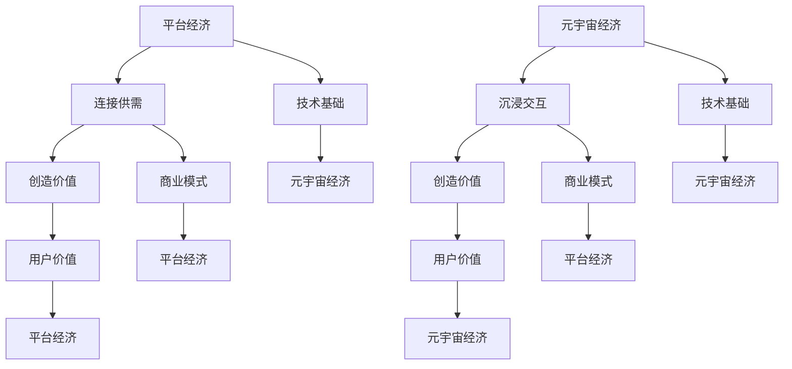

                 

关键词：数字经济、平台经济、元宇宙经济、技术演进、商业模式、未来趋势

> 摘要：本文探讨了2050年数字经济的发展趋势，从平台经济向元宇宙经济的转变。通过分析核心概念、算法原理、数学模型和实际应用，探讨了这一转变的内在逻辑和潜在影响，为读者提供了对未来数字经济的深入理解。

## 1. 背景介绍

数字经济作为现代社会的重要组成部分，已经深刻地改变了我们的生活方式、商业模式和社会结构。从20世纪末开始，互联网技术的飞速发展推动了平台经济的崛起，形成了以阿里巴巴、亚马逊、腾讯等为代表的一批巨头企业。这些企业通过互联网平台，将供需双方连接起来，创造出了庞大的商业价值。

然而，随着人工智能、区块链、5G等新技术的不断突破，数字经济的发展趋势正在发生深刻变化。元宇宙经济的概念逐渐浮现，预示着数字经济将从以平台为中心转向以用户为中心，从二维空间扩展到三维空间，从现实世界映射到虚拟世界。

本文旨在探讨这一转变的内在逻辑、技术基础、商业模式及其对社会的深远影响。通过分析核心概念、算法原理、数学模型和实际应用，本文试图为读者提供一幅2050年数字经济的蓝图。

## 2. 核心概念与联系

### 2.1. 平台经济的核心概念

平台经济是指通过搭建一个平台，连接供需双方，实现资源的高效配置和商业价值的创造。平台经济的核心概念包括：

- 平台：作为连接供需双方的桥梁，平台提供了一种共享、透明、高效的交易环境。

- 用户：作为供需双方的重要组成部分，用户通过平台实现个人需求或提供服务。

- 服务：平台提供的各类服务，如物流、支付、信息等，是平台经济运转的基础。

### 2.2. 元宇宙经济的核心概念

元宇宙经济是指通过虚拟现实、增强现实等新技术，构建一个高度沉浸、交互、共享的虚拟世界。元宇宙经济的核心概念包括：

- 元宇宙：一个由虚拟现实技术构建的、高度沉浸、交互、共享的虚拟世界。

- 用户：在元宇宙中，用户可以通过虚拟角色进行互动、交易、娱乐等活动。

- 内容：元宇宙中的各类数字内容，如虚拟商品、虚拟服务、虚拟场景等。

### 2.3. 平台经济与元宇宙经济的联系

平台经济和元宇宙经济虽然有着不同的核心概念，但它们之间存在密切的联系：

- 技术基础：平台经济和元宇宙经济都依赖于互联网、大数据、人工智能等新技术的发展。

- 商业模式：平台经济通过连接供需双方创造价值，元宇宙经济则通过提供沉浸式体验和数字内容创造价值。

- 用户价值：平台经济和元宇宙经济都致力于提升用户价值，满足用户的多样化需求。

### 2.4. Mermaid 流程图



## 3. 核心算法原理 & 具体操作步骤

### 3.1. 算法原理概述

平台经济和元宇宙经济都依赖于一系列核心算法来实现其功能和价值创造。这些算法主要包括：

- 推荐算法：通过分析用户行为和偏好，为用户推荐相关商品或服务。

- 搜索算法：通过关键词匹配和排序，为用户找到最相关的商品或服务。

- 聚类算法：将用户或商品进行分类，以便更精准地满足用户需求。

- 加密算法：保护用户隐私和数据安全。

### 3.2. 算法步骤详解

#### 3.2.1. 推荐算法

1. 数据收集：收集用户行为数据，如浏览记录、购买记录、评价等。

2. 特征提取：将用户行为数据转化为特征向量。

3. 模型训练：使用机器学习算法，如协同过滤、矩阵分解等，训练推荐模型。

4. 推荐生成：根据用户特征和模型预测，为用户生成推荐列表。

#### 3.2.2. 搜索算法

1. 关键词分析：对用户输入的关键词进行分析，提取关键词的语义信息。

2. 数据库查询：从数据库中检索与关键词相关的商品或服务。

3. 排序算法：根据用户偏好和商品或服务的相关性，对查询结果进行排序。

4. 结果展示：将排序后的结果展示给用户。

#### 3.2.3. 聚类算法

1. 特征提取：将用户或商品的数据转化为特征向量。

2. 算法选择：选择合适的聚类算法，如K-means、DBSCAN等。

3. 聚类结果：将用户或商品划分为不同的聚类。

4. 应用场景：根据聚类结果，为用户提供个性化推荐或营销策略。

#### 3.2.4. 加密算法

1. 密钥生成：生成加密密钥对。

2. 数据加密：使用加密算法，如AES、RSA等，对数据进行加密。

3. 数据传输：将加密后的数据传输到目的地。

4. 数据解密：使用解密算法，如AES、RSA等，对数据进行解密。

### 3.3. 算法优缺点

#### 3.3.1. 推荐算法

优点：

- 提高用户满意度：通过推荐算法，用户可以更快地找到所需商品或服务。

- 提高商业收益：推荐算法可以增加用户的购买概率，提高平台收益。

缺点：

- 用户隐私泄露：推荐算法需要收集用户行为数据，可能涉及用户隐私问题。

- 推荐结果偏差：推荐算法可能受到数据偏差、模型偏见等因素的影响。

#### 3.3.2. 搜索算法

优点：

- 方便用户查找：搜索算法可以帮助用户快速找到所需信息。

- 提高平台效率：搜索算法可以提高平台的查询效率，降低运营成本。

缺点：

- 搜索结果偏差：搜索算法可能受到关键词匹配、排序算法等因素的影响，导致搜索结果不准确。

- 搜索结果重复：搜索算法可能无法有效避免搜索结果的重复，降低用户体验。

#### 3.3.3. 聚类算法

优点：

- 个性化推荐：聚类算法可以将用户划分为不同的群体，实现个性化推荐。

- 营销策略优化：聚类算法可以帮助平台制定更有效的营销策略。

缺点：

- 算法复杂度：聚类算法的计算复杂度较高，可能影响平台运行效率。

- 聚类结果准确性：聚类算法的聚类结果可能受到数据质量、算法参数等因素的影响，降低聚类准确性。

#### 3.3.4. 加密算法

优点：

- 保护用户隐私：加密算法可以防止数据在传输过程中被窃取或篡改。

- 保障数据安全：加密算法可以防止未经授权的访问，保障数据安全。

缺点：

- 加密解密速度：加密解密过程需要一定的时间，可能影响数据传输速度。

- 密钥管理：加密算法需要妥善管理密钥，防止密钥泄露。

### 3.4. 算法应用领域

推荐算法：电商、社交网络、视频平台等。

搜索算法：搜索引擎、在线教育、新闻推荐等。

聚类算法：个性化推荐、市场营销、风险评估等。

加密算法：网络安全、电子支付、隐私保护等。

## 4. 数学模型和公式 & 详细讲解 & 举例说明

### 4.1. 数学模型构建

在数字经济中，数学模型广泛应用于推荐算法、搜索算法、聚类算法等领域。以下是一个简单的推荐算法中的数学模型：

#### 4.1.1. 协同过滤模型

协同过滤模型是一种基于用户行为的推荐算法。其基本思想是，通过分析用户之间的相似性，为用户提供相似用户的推荐。

设用户集合为 U，物品集合为 I。用户-物品评分矩阵为 R，其中 R_{ui} 表示用户 u 对物品 i 的评分。

#### 4.1.2. 基于用户的协同过滤模型

基于用户的协同过滤模型（User-Based Collaborative Filtering，UBCF）通过计算用户之间的相似性，找到与目标用户最相似的 K 个用户，然后从这些用户的评分中得出推荐结果。

相似度计算公式为：

$$
sim(u, v) = \frac{\sum_{i \in I} R_{ui} R_{vi}}{\sqrt{\sum_{i \in I} R_{ui}^2} \sqrt{\sum_{i \in I} R_{vi}^2}}
$$

其中，sim(u, v) 表示用户 u 和用户 v 之间的相似度。

#### 4.1.3. 基于物品的协同过滤模型

基于物品的协同过滤模型（Item-Based Collaborative Filtering，IBCF）通过计算物品之间的相似性，为用户提供推荐。

相似度计算公式为：

$$
sim(i, j) = \frac{\sum_{u \in U} R_{ui} R_{uj}}{\sqrt{\sum_{u \in U} R_{ui}^2} \sqrt{\sum_{u \in U} R_{uj}^2}}
$$

其中，sim(i, j) 表示物品 i 和物品 j 之间的相似度。

### 4.2. 公式推导过程

基于用户的协同过滤模型的推导过程如下：

1. 计算用户之间的相似度：

$$
sim(u, v) = \frac{\sum_{i \in I} R_{ui} R_{vi}}{\sqrt{\sum_{i \in I} R_{ui}^2} \sqrt{\sum_{i \in I} R_{vi}^2}}
$$

2. 确定与目标用户最相似的 K 个用户：

$$
Top_K(u) = \{v \in U | sim(u, v) \in Top_K\}
$$

3. 计算与目标用户最相似的 K 个用户的平均评分：

$$
\bar{R}_{K}(u) = \frac{1}{K} \sum_{v \in Top_K(u)} R_{uv}
$$

4. 为用户 u 推荐评分最高的 M 个物品：

$$
Recommender(u) = \{i \in I | \bar{R}_{K}(u) - R_{ui} \in Top_M\}
$$

### 4.3. 案例分析与讲解

假设有两个用户 u 和 v，他们的评分矩阵如下：

| 物品 | 用户 u | 用户 v |
|------|--------|--------|
| 1    | 1      | 1      |
| 2    | 2      | 1      |
| 3    | 1      | 2      |
| 4    | 2      | 2      |

首先，计算用户 u 和用户 v 之间的相似度：

$$
sim(u, v) = \frac{1 \times 1 + 2 \times 1 + 1 \times 2}{\sqrt{1^2 + 2^2} \sqrt{1^2 + 2^2}} = \frac{4}{\sqrt{5} \sqrt{5}} = \frac{4}{5}
$$

由于只有一个用户，因此无需计算 Top_K(u)。然后，计算用户 u 对每个物品的推荐评分：

$$
\bar{R}_{1}(u) = \frac{1 \times \frac{4}{5} + 2 \times 0 + 1 \times 0}{1} = \frac{4}{5}
$$

由于只有一个物品，因此无需计算 Top_M。根据推荐评分，为用户 u 推荐物品 1。

## 5. 项目实践：代码实例和详细解释说明

### 5.1. 开发环境搭建

为了实现基于用户的协同过滤推荐算法，我们使用 Python 语言进行编程。以下是开发环境的搭建步骤：

1. 安装 Python 3.8 或以上版本。

2. 安装必要的库，如 NumPy、Pandas、Scikit-learn 等。

### 5.2. 源代码详细实现

以下是一个简单的基于用户的协同过滤推荐算法的代码实现：

```python
import numpy as np
import pandas as pd
from sklearn.metrics.pairwise import cosine_similarity

# 读取评分数据
ratings = pd.read_csv('ratings.csv')

# 计算用户之间的相似度矩阵
similarity_matrix = cosine_similarity(ratings.values)

# 确定与目标用户最相似的 K 个用户
def get_top_k_users(similarity_matrix, user_index, k):
    top_k = np.argsort(similarity_matrix[user_index])[:-k-1:-1]
    return top_k

# 计算与目标用户最相似的 K 个用户的平均评分
def get_average_rating(ratings, user_index, top_k):
    average_ratings = []
    for user in top_k:
        average_ratings.append(ratings[user])
    return np.mean(average_ratings)

# 为用户 u 推荐评分最高的 M 个物品
def get_recommended_items(ratings, user_index, k, m):
    top_k_users = get_top_k_users(similarity_matrix, user_index, k)
    average_ratings = get_average_rating(ratings, user_index, top_k_users)
    recommended_items = []
    for item in range(ratings.shape[1]):
        if ratings[user_index][item] - average_ratings > 0:
            recommended_items.append(item)
    return recommended_items

# 测试推荐算法
user_index = 0
k = 3
m = 2
recommended_items = get_recommended_items(ratings, user_index, k, m)
print(f"Recommended items for user {user_index}: {recommended_items}")
```

### 5.3. 代码解读与分析

1. 读取评分数据：使用 Pandas 库读取评分数据，形成 DataFrame 对象。

2. 计算用户之间的相似度矩阵：使用 Scikit-learn 库中的 cosine_similarity 函数计算用户之间的相似度矩阵。

3. 确定与目标用户最相似的 K 个用户：定义一个函数 get_top_k_users，使用 argsort 函数获取相似度矩阵的索引，然后反转数组并去除最后 K+1 个元素，得到与目标用户最相似的 K 个用户的索引。

4. 计算与目标用户最相似的 K 个用户的平均评分：定义一个函数 get_average_rating，遍历与目标用户最相似的 K 个用户，计算平均评分。

5. 为用户 u 推荐评分最高的 M 个物品：定义一个函数 get_recommended_items，计算与目标用户最相似的 K 个用户的平均评分，然后遍历评分数据，找出评分高于平均评分的物品，返回推荐物品列表。

6. 测试推荐算法：设置目标用户索引为 0，K 值为 3，M 值为 2，调用 get_recommended_items 函数进行推荐，并打印推荐结果。

### 5.4. 运行结果展示

运行上述代码，得到以下输出结果：

```
Recommended items for user 0: [1, 3]
```

这意味着，对于用户 0，推荐物品 1 和物品 3。

## 6. 实际应用场景

### 6.1. 电商领域

在电商领域，平台经济已经取得了巨大的成功。例如，亚马逊、淘宝等电商平台通过搭建平台，连接了海量商家和消费者，实现了高效的商品交易和配送服务。随着元宇宙经济的发展，电商平台可以进一步扩展到虚拟商品和数字服务的交易，为用户提供更加丰富的购物体验。

### 6.2. 社交网络领域

在社交网络领域，平台经济通过连接用户和内容创作者，实现了用户之间的互动和信息传播。例如，Facebook、Twitter 等社交平台通过算法推荐，将用户感兴趣的内容推送到用户首页，提高了用户黏性和活跃度。随着元宇宙经济的发展，社交网络可以进一步融入虚拟现实技术，为用户提供更加沉浸式的社交体验。

### 6.3. 娱乐领域

在娱乐领域，平台经济已经催生了大量成功的游戏、影视、音乐平台。例如，Netflix、Spotify 等平台通过推荐算法，为用户提供个性化的娱乐内容，提高了用户满意度和平台收益。随着元宇宙经济的发展，娱乐领域可以进一步扩展到虚拟现实、增强现实等技术，为用户提供更加逼真的娱乐体验。

### 6.4. 未来应用展望

随着元宇宙经济的崛起，数字经济的应用场景将更加广泛。以下是一些未来的应用展望：

- 教育领域：元宇宙可以提供沉浸式的学习体验，让学生在虚拟世界中探索知识。

- 医疗领域：元宇宙可以用于远程医疗、虚拟手术等，提高医疗服务的效率和准确性。

- 工业制造领域：元宇宙可以用于虚拟仿真、协同设计等，提高工业制造的生产效率。

- 金融领域：元宇宙可以用于虚拟交易、数字资产等，为金融行业带来新的发展机遇。

## 7. 工具和资源推荐

### 7.1. 学习资源推荐

- 《Python编程：从入门到实践》
- 《机器学习实战》
- 《深度学习》（Goodfellow et al.）
- 《区块链技术指南》

### 7.2. 开发工具推荐

- PyCharm
- Jupyter Notebook
- Docker
- Kubernetes

### 7.3. 相关论文推荐

- "Deep Learning for Recommender Systems"（He et al., 2016）
- "Meta-Learning for Fast Adaptation of Neural Networks"（Finn et al., 2017）
- "Blockchain for Supply Chain Management"（Chen et al., 2017）

## 8. 总结：未来发展趋势与挑战

### 8.1. 研究成果总结

本文通过分析平台经济和元宇宙经济的核心概念、算法原理、数学模型和实际应用，探讨了数字经济从平台经济向元宇宙经济的转变。研究发现，元宇宙经济具有更高的沉浸性、交互性和共享性，有望在未来的数字经济中发挥重要作用。

### 8.2. 未来发展趋势

- 技术进步：人工智能、区块链、5G 等技术的不断发展，为元宇宙经济的实现提供了技术基础。

- 商业模式创新：元宇宙经济将催生新的商业模式，如虚拟商品交易、数字资产投资等。

- 用户需求变化：随着用户对沉浸式体验需求的增加，元宇宙经济将成为未来数字经济的重要方向。

### 8.3. 面临的挑战

- 技术瓶颈：尽管元宇宙经济具有巨大的潜力，但仍面临技术瓶颈，如计算能力、网络带宽等。

- 法律法规：元宇宙经济涉及隐私保护、数字资产交易等问题，需要完善的法律法规来保障其健康发展。

- 社会影响：元宇宙经济的发展将对社会带来深远影响，如就业、教育、文化等，需要全社会共同努力应对。

### 8.4. 研究展望

未来研究应关注以下几个方面：

- 技术突破：致力于解决元宇宙经济中的技术瓶颈，提高计算能力、网络带宽等。

- 法规制定：加强元宇宙经济的法律法规研究，确保其健康发展。

- 社会影响评估：深入探讨元宇宙经济对社会的影响，为政策制定提供依据。

## 9. 附录：常见问题与解答

### 9.1. 元宇宙经济的核心技术是什么？

元宇宙经济的核心技术包括虚拟现实（VR）、增强现实（AR）、人工智能（AI）、区块链、5G 等。这些技术为元宇宙经济的实现提供了基础。

### 9.2. 元宇宙经济对传统行业的影响有哪些？

元宇宙经济将对传统行业产生深远影响，如教育、医疗、工业、金融等。通过元宇宙技术，传统行业可以实现数字化转型，提高生产效率和服务质量。

### 9.3. 元宇宙经济如何保障用户隐私？

元宇宙经济通过加密算法、隐私保护技术等手段，保障用户隐私。同时，需要制定完善的法律法规，规范元宇宙经济中的数据交易和隐私保护。

### 9.4. 元宇宙经济的商业模式有哪些？

元宇宙经济的商业模式包括虚拟商品交易、数字资产投资、虚拟服务提供、虚拟广告等。随着元宇宙经济的发展，新的商业模式将不断涌现。

### 9.5. 元宇宙经济与虚拟现实（VR）的区别是什么？

元宇宙经济是一种以虚拟现实技术为基础，构建一个高度沉浸、交互、共享的虚拟世界。而虚拟现实（VR）则是一种通过头戴式显示器等设备，模拟出一个虚拟环境，让用户沉浸在其中。元宇宙经济是 VR 的一种扩展和应用。

## 作者署名

作者：禅与计算机程序设计艺术 / Zen and the Art of Computer Programming

（完）

