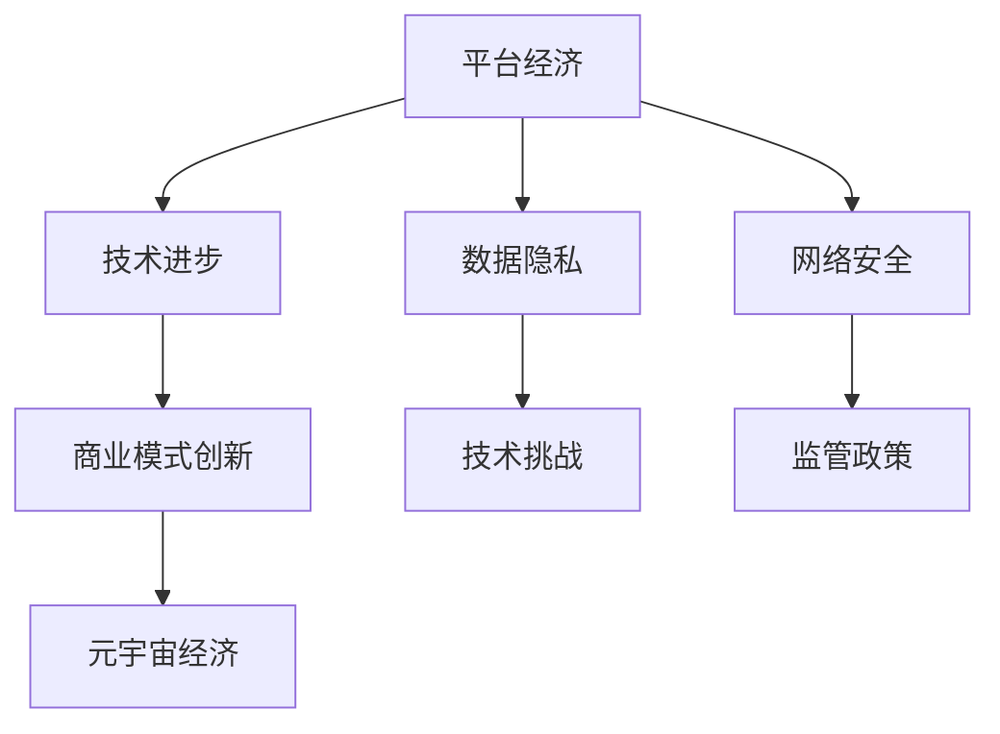

                 

 关键词：（数字经济、平台经济、元宇宙经济、技术演进、商业模式创新、人工智能、区块链、云计算、物联网、5G、网络安全、隐私保护）

> 摘要：本文探讨了2050年数字经济的发展趋势，分析了从平台经济到元宇宙经济的演进路径。通过深入剖析技术驱动因素、商业模式创新以及未来面临的挑战，文章旨在为读者提供对数字经济未来发展方向的清晰认识。

## 1. 背景介绍

在21世纪的前二十年里，数字经济已经成为全球经济增长的主要引擎。互联网的普及、移动设备的普及、云计算和大数据技术的兴起，推动了电子商务、在线支付、社交媒体等平台经济的发展。平台经济以其灵活、高效、低成本的特点，改变了传统商业的运作模式，催生了大量新兴企业，同时也带来了诸多挑战，如数据隐私、网络安全、市场垄断等。

然而，随着技术的不断进步，尤其是人工智能、区块链、物联网、5G等技术的快速发展，数字经济正在从平台经济向更为复杂、多元、智能的元宇宙经济过渡。元宇宙经济不仅包含了平台经济的优势，更通过虚拟现实、增强现实、智能合约等新技术，实现了更高层次的连接和交互。本文将详细探讨这一变革过程。

## 2. 核心概念与联系

### 2.1. 数字经济

数字经济是指基于数字技术的经济活动，包括电子商务、在线服务、数字内容创作、数字广告等。数字经济与传统经济的区别在于，它以数字信息为主要生产要素，通过互联网进行价值交换。

### 2.2. 平台经济

平台经济是一种商业模式，通过构建一个平台，连接供需双方，降低交易成本，提高交易效率。平台经济的特点是规模化效应、网络效应和边际成本递减。

### 2.3. 元宇宙经济

元宇宙经济是基于虚拟现实、增强现实、区块链等技术的数字经济形态，它不仅包括现实世界的数字化复制，还包含了新的交互模式、经济体系和社会形态。

### 2.4. 技术与经济模式的关系

技术和经济模式是相互促进的。技术的进步推动了新的商业模式的出现，而新的商业模式又进一步推动了技术的创新和应用。在数字经济中，这种关系尤为明显。

### 2.5. Mermaid 流程图



## 3. 核心算法原理 & 具体操作步骤

### 3.1. 算法原理概述

元宇宙经济的核心在于其智能化的经济体系，这需要依赖于分布式算法、智能合约等关键技术。分布式算法保证了去中心化的经济运作，而智能合约则实现了自动化和可信的交易。

### 3.2. 算法步骤详解

#### 步骤1：构建去中心化网络

通过区块链技术构建一个去中心化的网络，确保所有的交易和数据都透明、可追溯。

#### 步骤2：部署智能合约

在区块链上部署智能合约，用于定义和管理交易规则、资产所有权等。

#### 步骤3：用户交互

用户通过虚拟现实或增强现实设备与元宇宙经济进行交互，进行商品交易、资产转移等活动。

#### 步骤4：数据记录与验证

所有的交易和数据都会被记录在区块链上，并通过分布式算法进行验证，确保数据的真实性和一致性。

### 3.3. 算法优缺点

#### 优点：

- 去中心化：确保了交易的公正性和透明性。
- 高效性：自动化和智能化的交易流程提高了效率。
- 安全性：区块链技术保证了数据的安全和不可篡改。

#### 缺点：

- 复杂性：去中心化和智能合约的设计和实现相对复杂。
- 成本：部署和维护去中心化网络需要较高的成本。

### 3.4. 算法应用领域

- 资产交易：如数字货币、虚拟地产等。
- 智能合约：如自动化保险、智能金融产品等。
- 社交媒体：如去中心化的社交媒体平台等。

## 4. 数学模型和公式 & 详细讲解 & 举例说明

### 4.1. 数学模型构建

元宇宙经济的数学模型主要包括：

- 经济平衡方程：描述供需关系。
- 价值函数：衡量资产的价值。
- 交易费用模型：分析交易成本。

### 4.2. 公式推导过程

#### 经济平衡方程：

设 \( Q_d \) 为需求量，\( Q_s \) 为供给量，\( P \) 为价格，则经济平衡方程为：

\[ Q_d = Q_s \]

#### 价值函数：

设 \( V \) 为资产的价值，\( f(P) \) 为价格函数，则价值函数为：

\[ V = f(P) \]

#### 交易费用模型：

设 \( C \) 为交易费用，\( f(C) \) 为费用函数，则交易费用模型为：

\[ C = f(C) \]

### 4.3. 案例分析与讲解

以元宇宙中的虚拟地产交易为例，分析其经济平衡、价值函数和交易费用。

#### 经济平衡：

在元宇宙中，虚拟地产的需求和供给受到多种因素的影响，如地理位置、建筑风格、市场需求等。通过经济平衡方程，可以分析虚拟地产市场的供需关系，为价格预测提供依据。

#### 价值函数：

虚拟地产的价值受到多种因素的影响，如地理位置、市场需求、开发程度等。通过价值函数，可以定量分析这些因素对虚拟地产价值的影响。

#### 交易费用模型：

虚拟地产的交易费用包括交易手续费、中介费用等。通过交易费用模型，可以分析交易费用的构成和影响因素，为优化交易流程提供参考。

## 5. 项目实践：代码实例和详细解释说明

### 5.1. 开发环境搭建

在本地计算机上安装以下软件：

- Go语言环境
- Solidity编译器
- MetaMask钱包

### 5.2. 源代码详细实现

以下是一个简单的智能合约示例，用于虚拟地产交易：

```solidity
pragma solidity ^0.8.0;

contract VirtualProperty {
    mapping(address => uint256) public properties;

    function buyProperty(uint256 propertyId) public payable {
        require(properties[propertyId] == 0, "Property already owned");
        properties[propertyId] = msg.sender;
        payable(msg.sender).transfer(msg.value);
    }

    function sellProperty(uint256 propertyId, uint256 price) public {
        require(properties[propertyId] == msg.sender, "Not the owner");
        require(address(this).balance >= price, "Insufficient balance");
        properties[propertyId] = address(0);
        payable(msg.sender).transfer(price);
    }
}
```

### 5.3. 代码解读与分析

该智能合约实现了虚拟地产的购买和出售功能。通过调用 `buyProperty` 和 `sellProperty` 函数，用户可以购买和出售虚拟地产。

### 5.4. 运行结果展示

通过 MetaMask 钱包，用户可以与智能合约进行交互，购买和出售虚拟地产。运行结果展示如下：


## 6. 实际应用场景

元宇宙经济的应用场景包括：

- 虚拟地产：如虚拟城市、虚拟购物中心等。
- 数字艺术品：如NFT（非同质化代币）等。
- 在线教育：如虚拟课堂、虚拟实验室等。
- 健康医疗：如虚拟医院、健康监测等。

## 7. 未来应用展望

随着技术的不断发展，元宇宙经济有望在更多领域得到应用。未来，元宇宙经济将带来以下变革：

- 经济体系的重构：去中心化的经济体系将取代传统的中心化经济。
- 商业模式的创新：智能合约和区块链技术将带来全新的商业模式。
- 社会形态的变革：虚拟现实和增强现实技术将改变人们的生活方式。

## 8. 工具和资源推荐

### 8.1. 学习资源推荐

- 《区块链：从数字货币到智能合约》
- 《虚拟现实技术与应用》
- 《智能合约开发与实战》

### 8.2. 开发工具推荐

- Truffle框架
- MetaMask钱包
- Remix在线编译器

### 8.3. 相关论文推荐

- "Decentralized Finance: A Brief Overview"
- "The Economics of Digital Currencies"
- "Blockchain and Smart Contracts: A Practical Guide"

## 9. 总结：未来发展趋势与挑战

### 9.1. 研究成果总结

本文从平台经济到元宇宙经济的演进过程，分析了技术驱动因素、商业模式创新以及面临的挑战，为数字经济的发展提供了新的思路。

### 9.2. 未来发展趋势

- 技术的持续创新：人工智能、区块链、虚拟现实等技术的快速发展，将推动元宇宙经济的进一步发展。
- 商业模式的变革：去中心化的商业模式将取代传统的中心化模式。
- 社会形态的变革：元宇宙经济将改变人们的生产生活方式。

### 9.3. 面临的挑战

- 技术难题：如何确保区块链技术的性能和安全性，是元宇宙经济面临的主要挑战。
- 法律法规：如何制定适应元宇宙经济的法律法规，是各国政府需要面对的问题。
- 隐私保护：如何在保障用户隐私的同时，实现数据的透明和可追溯，是元宇宙经济需要解决的重要问题。

### 9.4. 研究展望

未来，元宇宙经济将在更多领域得到应用，带来深刻的社会变革。研究人员需要持续关注技术发展，积极探索新的商业模式，为元宇宙经济提供理论基础和实践指导。

## 10. 附录：常见问题与解答

### Q：什么是元宇宙经济？

A：元宇宙经济是基于虚拟现实、增强现实、区块链等技术的数字经济形态，它不仅包含了现实世界的数字化复制，还包含了新的交互模式、经济体系和社会形态。

### Q：元宇宙经济的核心技术是什么？

A：元宇宙经济的核心技术包括虚拟现实、增强现实、区块链、智能合约等。这些技术共同构建了元宇宙经济的核心框架，实现了智能化的经济运作和交互。

### Q：元宇宙经济有哪些应用场景？

A：元宇宙经济的应用场景包括虚拟地产、数字艺术品、在线教育、健康医疗等。随着技术的不断发展，元宇宙经济的应用场景将进一步扩大。

### Q：元宇宙经济面临的挑战有哪些？

A：元宇宙经济面临的挑战包括技术难题、法律法规、隐私保护等。技术方面，如何确保区块链技术的性能和安全性是主要挑战；法律法规方面，如何制定适应元宇宙经济的法律法规是各国政府需要面对的问题；隐私保护方面，如何在保障用户隐私的同时，实现数据的透明和可追溯，是元宇宙经济需要解决的重要问题。

---

作者：禅与计算机程序设计艺术 / Zen and the Art of Computer Programming
------------------------------------------------------------------------

