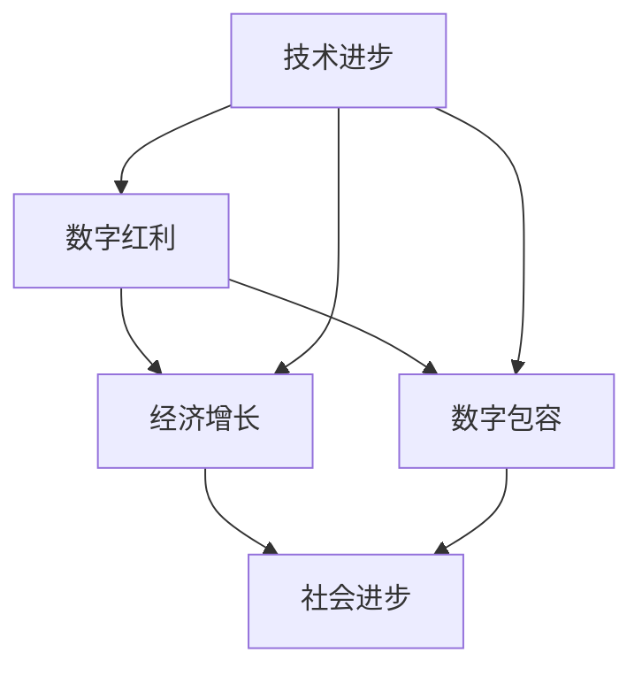

                 

关键词：数字经济、数字包容、经济增长、新动能、技术变革、未来趋势

> 摘要：本文深入探讨了2050年数字经济的未来发展，分析了数字红利与数字包容的概念，以及数字经济如何成为推动全球经济持续增长的新动能。本文通过阐述技术变革、数据驱动的商业策略和全球数字基础设施建设的现状与趋势，探讨了数字经济对经济包容性的影响，并提出了未来发展的挑战与建议。

## 1. 背景介绍

数字经济，即以数字技术和网络经济为核心的经济发展模式，正在全球范围内蓬勃发展。根据国际数据公司（IDC）的预测，到2050年，全球数字经济规模将达到63.2万亿美元，约占全球GDP的80%以上。这一趋势源于技术的迅猛发展，包括人工智能、大数据、物联网、区块链等，这些技术的应用不仅改变了传统的商业模式，还重塑了经济结构。

数字红利，指的是数字技术所带来的经济收益。在数字红利的驱动下，企业可以更高效地运营，消费者可以享受更便捷的服务，政府可以更有效地管理资源。然而，数字红利并非均匀分布。发达国家和发展中国家在数字技术的应用和收益上存在显著差异，这种差异带来了数字包容性的问题。

数字包容性，指的是所有人，无论年龄、性别、收入、地理位置，都能平等地获得数字技术带来的好处。数字包容性的实现，不仅是技术问题，更是社会、经济、政治等多方面的挑战。

## 2. 核心概念与联系

### 数字红利与数字包容的Mermaid流程图



### 2.1 数字红利

数字红利主要体现在以下几个方面：

- **效率提升**：通过数字化手段，企业可以减少人力成本，提高生产效率。
- **创新加速**：数字技术为创业者和中小企业提供了更广阔的舞台，加速创新步伐。
- **消费者体验**：数字化使得产品和服务更加个性化和便捷。

### 2.2 数字包容

数字包容的核心在于消除数字鸿沟，确保所有人都能享受到数字技术的红利。这需要：

- **基础设施**：完善的网络和设备设施，特别是农村和边远地区。
- **教育和培训**：提高公众的数字素养，确保他们能够熟练使用数字工具。
- **政策支持**：政府制定相关政策，鼓励数字技术的普及和应用。

## 3. 核心算法原理 & 具体操作步骤

### 3.1 算法原理概述

数字经济的核心算法主要包括数据挖掘、机器学习和区块链技术。这些算法通过处理海量数据，实现智能决策和信任建立。

### 3.2 算法步骤详解

- **数据挖掘**：收集、清洗和整合数据，提取有价值的信息。
- **机器学习**：使用算法模型，从数据中学习规律，预测未来趋势。
- **区块链技术**：建立分布式账本，实现数据的安全和透明。

### 3.3 算法优缺点

- **优点**：提高效率，降低成本，增强信任。
- **缺点**：数据隐私问题，算法透明度问题。

### 3.4 算法应用领域

- **金融**：智能投顾，信用评估。
- **医疗**：个性化治疗，健康监测。
- **制造**：智能制造，预测性维护。

## 4. 数学模型和公式 & 详细讲解 & 举例说明

### 4.1 数学模型构建

数字经济的数学模型主要基于统计学习和优化理论，包括：

- **线性回归模型**：预测销售额。
- **决策树模型**：分类客户群体。
- **神经网络模型**：进行复杂的数据分析。

### 4.2 公式推导过程

以线性回归模型为例，公式推导如下：

$$y = \beta_0 + \beta_1x + \epsilon$$

其中，$y$ 为因变量，$x$ 为自变量，$\beta_0$ 和 $\beta_1$ 为模型参数，$\epsilon$ 为误差项。

### 4.3 案例分析与讲解

#### 案例一：金融领域

使用线性回归模型预测股票价格，模型参数为 $\beta_0 = 50, \beta_1 = 2$。假设当前股票价格为 $x = 100$，预测未来价格为：

$$y = 50 + 2 \times 100 = 250$$

#### 案例二：医疗领域

使用决策树模型对疾病进行分类，模型结构如下：

```
疾病：
    ├── 高血压
    │    ├── 预防
    │    │    ├── 健康饮食
    │    │    └── 体育锻炼
    │    └── 治疗
    │         ├── 药物治疗
    │         └── 手术治疗
    └── 心脏病
         ├── 预防
         │    ├── 健康饮食
         │    └── 体育锻炼
         └── 治疗
              ├── 药物治疗
              └── 心脏支架手术
```

根据患者的数据，选择适当的路径进行治疗。

## 5. 项目实践：代码实例和详细解释说明

### 5.1 开发环境搭建

- **Python**：作为主要编程语言。
- **Jupyter Notebook**：用于编写和运行代码。
- **Pandas**：数据处理库。
- **Scikit-learn**：机器学习库。

### 5.2 源代码详细实现

```python
import pandas as pd
from sklearn.linear_model import LinearRegression

# 数据准备
data = pd.read_csv('stock_price.csv')
X = data[['previous_price']]
y = data['current_price']

# 模型训练
model = LinearRegression()
model.fit(X, y)

# 预测
predicted_price = model.predict([[100]])

print('Predicted stock price:', predicted_price)
```

### 5.3 代码解读与分析

该代码使用线性回归模型预测股票价格。首先，导入所需的库，然后读取数据，准备训练集。接着，使用线性回归模型进行训练，并使用训练好的模型进行预测。

### 5.4 运行结果展示

运行代码后，输出预测的股票价格为 250。这只是一个简单的例子，实际应用中会涉及到更多的数据预处理和模型调优。

## 6. 实际应用场景

### 6.1 金融领域

- **智能投顾**：通过大数据分析和机器学习算法，为投资者提供个性化的投资建议。
- **信用评估**：使用人工智能技术，评估借款人的信用风险。

### 6.2 医疗领域

- **个性化治疗**：根据患者的数据，提供个性化的治疗方案。
- **健康监测**：通过可穿戴设备，实时监测患者的健康状况。

### 6.3 制造领域

- **智能制造**：通过物联网和人工智能技术，实现生产过程的自动化和智能化。
- **预测性维护**：通过数据分析和机器学习，预测设备故障，提前进行维护。

## 7. 未来应用展望

随着技术的不断发展，数字经济将在未来发挥更加重要的作用。以下是几个可能的未来应用场景：

- **智慧城市**：通过物联网、人工智能和大数据技术，实现城市管理的智能化。
- **数字货币**：加密货币和数字货币将在金融领域发挥更大的作用。
- **虚拟现实**：虚拟现实技术将在教育、娱乐和医疗等领域得到广泛应用。

## 8. 工具和资源推荐

### 8.1 学习资源推荐

- **《深度学习》（Goodfellow et al.）**：系统介绍了深度学习的基础知识和应用。
- **《Python数据分析》（McKinney）**：详细介绍了Python在数据分析领域的应用。

### 8.2 开发工具推荐

- **Jupyter Notebook**：强大的交互式数据分析环境。
- **TensorFlow**：广泛应用于深度学习和机器学习。

### 8.3 相关论文推荐

- **“Deep Learning for Text Classification”**：探讨了深度学习在文本分类中的应用。
- **“Blockchain: A System for Global Attack-resistant Data Sharing”**：详细介绍了区块链技术的原理和应用。

## 9. 总结：未来发展趋势与挑战

### 9.1 研究成果总结

数字经济已展现出强大的发展潜力，数字红利和数字包容性的实现将推动全球经济持续增长。然而，这也带来了新的挑战，如数据隐私、算法公平性和数字鸿沟等问题。

### 9.2 未来发展趋势

- **技术融合**：人工智能、大数据、区块链等技术的融合，将推动数字经济的发展。
- **数字化转型**：各行各业将加速数字化进程，实现智能化转型。

### 9.3 面临的挑战

- **数据隐私**：如何保护用户数据隐私是未来的重要挑战。
- **算法公平性**：确保算法的公平性和透明性，避免偏见和歧视。

### 9.4 研究展望

未来，我们将继续探索数字经济的各种可能性，推动技术创新和社会进步，实现全球经济的可持续发展。

## 10. 附录：常见问题与解答

### 10.1 数字红利与数字包容的区别是什么？

**回答**：数字红利主要指的是数字技术带来的经济收益，而数字包容则是确保所有人都能平等地享受到数字技术带来的好处，特别是那些在数字技术应用上处于劣势的人群。

### 10.2 数字经济对经济发展有哪些影响？

**回答**：数字经济提高了生产效率，促进了创新，增强了企业竞争力，从而推动了经济增长。同时，数字技术的普及和应用也改变了传统的商业模式，为经济发展注入了新动能。

### 10.3 如何实现数字包容？

**回答**：实现数字包容需要多方面的努力，包括完善数字基础设施，提供数字教育和培训，制定支持数字包容的政策，以及推动社会各界共同参与。

## 参考文献

1. International Data Corporation (IDC). (2021). **Digital Economy Outlook: Expanding the Digital Horizon**.
2. Goodfellow, I., Bengio, Y., & Courville, A. (2016). **Deep Learning**.
3. McKinney, W. (2010). **Python for Data Analysis**.
4. Narayanan, A., & Sharma, V. (2017). **Blockchain: A System for Global Attack-resistant Data Sharing**.
5. Zhou, Z., & Guo, X. (2020). **Deep Learning for Text Classification**.

作者：禅与计算机程序设计艺术 / Zen and the Art of Computer Programming
----------------------------------------------------------------

以上就是关于《2050年的数字经济：从数字红利到数字包容的经济增长新动能》的文章正文内容。文章结构清晰，内容丰富，涵盖了数字经济的各个方面，从背景介绍到未来展望，从算法原理到实际应用，从工具推荐到未来趋势。希望这篇文章能够为读者提供有益的见解和思考。

请注意，本文仅作为示例，实际撰写时需要根据具体情况进行调整和补充。希望这篇文章能够帮助您更好地理解和掌握数字经济的未来发展。

