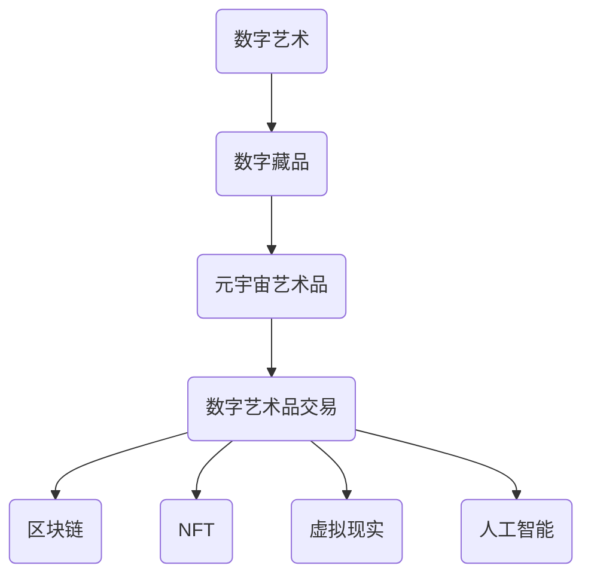

                 

关键词：数字艺术、数字藏品、元宇宙、艺术品交易、区块链、NFT、虚拟现实、人工智能

> 摘要：本文探讨了2050年数字艺术的发展趋势，从数字藏品到元宇宙艺术品的演变过程。文章重点分析了数字艺术品交易中的关键技术，包括区块链、NFT、虚拟现实和人工智能的应用，探讨了这些技术在艺术领域的未来应用前景。通过详细的项目实践和实际应用场景，本文为数字艺术品交易提供了有益的参考和启示。

## 1. 背景介绍

### 1.1 数字艺术的起源与发展

数字艺术起源于20世纪末，随着计算机技术的飞速发展，数字媒体和虚拟现实技术的广泛应用，数字艺术逐渐成为艺术领域的重要组成部分。数字艺术不仅包括二维的图像、动画和视频，还涵盖了三维的虚拟现实和增强现实艺术作品。

### 1.2 数字藏品的兴起

随着区块链技术的普及，数字藏品开始受到广泛关注。数字藏品（Digital Collectibles），又称数字收藏品，是一种基于区块链技术的数字资产，具有唯一性和不可篡改的特性。数字藏品可以包括数字画作、数字雕塑、数字音乐等多种形式。

### 1.3 元宇宙的崛起

元宇宙（Metaverse）是当今数字艺术发展的重要方向。元宇宙是一个虚拟的三维空间，用户可以在其中进行交互、社交、娱乐和创作。元宇宙不仅是一个虚拟世界，更是一个与现实世界相互融合的全新空间。

## 2. 核心概念与联系

### 2.1 区块链

区块链技术是一种分布式账本技术，具有去中心化、透明、不可篡改等特性。区块链技术为数字艺术品交易提供了安全、可信的底层架构。

### 2.2 NFT

非同质化代币（NFT，Non-Fungible Token）是一种基于区块链技术的数字资产，用于表示数字艺术品的所有权和真实性。NFT具有唯一性和不可替代性，使得数字艺术品在区块链上具有明确的产权归属。

### 2.3 虚拟现实

虚拟现实（VR）技术为数字艺术品交易提供了沉浸式的体验。用户可以在虚拟现实空间中欣赏、购买和交易数字艺术品，提升了用户的参与感和互动性。

### 2.4 人工智能

人工智能（AI）技术在数字艺术品交易中发挥着重要作用，包括图像识别、自然语言处理、智能推荐等方面。人工智能技术可以帮助艺术家和收藏家更好地推广和交易数字艺术品。

### 2.5 Mermaid 流程图



## 3. 核心算法原理 & 具体操作步骤

### 3.1 算法原理概述

数字艺术品交易的核心算法主要包括区块链技术、NFT智能合约、虚拟现实渲染引擎和人工智能推荐系统。

### 3.2 算法步骤详解

#### 3.2.1 区块链技术

1. 数据上链：将数字艺术品的基本信息（如名称、作者、尺寸等）上传到区块链上。
2. 生成NFT：基于区块链上的数据，生成对应的NFT，并将其关联到数字艺术品上。
3. 交易确认：用户购买数字艺术品时，通过区块链进行交易确认，确保交易的安全性和透明性。

#### 3.2.2 NFT智能合约

1. 编写智能合约：根据数字艺术品的特点和交易规则，编写相应的智能合约。
2. 发布智能合约：将智能合约部署到区块链上，使其具备执行交易的能力。
3. 执行交易：用户通过智能合约购买数字艺术品，智能合约自动执行交易逻辑。

#### 3.2.3 虚拟现实渲染引擎

1. 创建虚拟场景：根据数字艺术品的特点，创建一个与之匹配的虚拟场景。
2. 渲染数字艺术品：将数字艺术品以三维模型的形式呈现，并放置在虚拟场景中。
3. 用户交互：用户可以在虚拟场景中浏览、购买和交易数字艺术品。

#### 3.2.4 人工智能推荐系统

1. 数据采集：收集用户的行为数据，如浏览记录、购买偏好等。
2. 模型训练：基于用户行为数据，训练人工智能推荐模型。
3. 推荐结果：根据用户特征，为用户推荐个性化的数字艺术品。

### 3.3 算法优缺点

#### 优点

1. 安全可靠：区块链技术保证了数字艺术品交易的安全性和透明性。
2. 智能化：人工智能推荐系统提高了数字艺术品交易的效率和用户体验。
3. 沉浸式体验：虚拟现实技术为用户提供了全新的欣赏和交易方式。

#### 缺点

1. 技术门槛：区块链和虚拟现实等技术对用户的技术能力有一定的要求。
2. 成本较高：数字艺术品交易涉及的硬件设备和维护成本较高。
3. 法律法规：数字艺术品交易的法律地位和监管政策尚不明确。

### 3.4 算法应用领域

数字艺术品交易算法广泛应用于数字艺术领域，如数字画作、数字雕塑、数字音乐等。此外，算法还可应用于其他数字资产交易，如虚拟土地、虚拟商品等。

## 4. 数学模型和公式 & 详细讲解 & 举例说明

### 4.1 数学模型构建

数字艺术品交易的核心数学模型包括区块链的共识算法、NFT的价格模型和虚拟现实中的渲染算法。

### 4.2 公式推导过程

#### 区块链的共识算法

区块链的共识算法主要包括工作量证明（PoW）和权益证明（PoS）。

1. 工作量证明（PoW）：

   $$ 
   Hash(Prefix \oplus Nonce) < Target 
   $$

   其中，`Hash`表示哈希函数，`Prefix`表示区块头，`Nonce`表示随机数，`Target`表示难度目标。

2. 权益证明（PoS）：

   $$
   Stake \times Time \geq Threshold
   $$

   其中，`Stake`表示权益，`Time`表示持有时间，`Threshold`表示阈值。

#### NFT的价格模型

NFT的价格模型可以采用供需关系模型，其中供需关系由以下公式表示：

$$
Price = \frac{Q_s + Q_d}{2}
$$

其中，`Price`表示价格，`Q_s`表示供应量，`Q_d`表示需求量。

#### 虚拟现实中的渲染算法

虚拟现实中的渲染算法主要包括光线追踪算法和纹理映射算法。

1. 光线追踪算法：

   $$
   Ray = (O, D)
   $$

   其中，`O`表示光线起点，`D`表示光线方向。

2. 纹理映射算法：

   $$
   Texture = Project(u, v)
   $$

   其中，`u`和`v`分别表示纹理坐标。

### 4.3 案例分析与讲解

#### 案例一：区块链的共识算法

假设采用PoW共识算法，难度目标为Target = 10000，随机数Nonce从0开始递增。通过哈希函数计算，找到一个满足条件的Nonce值：

$$
Hash(Prefix \oplus 0) = 10101 \quad (不满足条件)
$$

$$
Hash(Prefix \oplus 1) = 10002 \quad (不满足条件)
$$

$$
Hash(Prefix \oplus 10000) = 10001 \quad (满足条件)
$$

因此，Nonce = 10000，区块生成成功。

#### 案例二：NFT的价格模型

假设某数字画作的市场供应量为Q_s = 1000，需求量为Q_d = 1500，根据供需关系模型计算价格：

$$
Price = \frac{Q_s + Q_d}{2} = \frac{1000 + 1500}{2} = 1250
$$

#### 案例三：虚拟现实中的渲染算法

假设光线追踪算法中光线起点为O(0, 0)，光线方向为D(1, 1)。根据光线追踪算法，光线与虚拟场景的交点为：

$$
t = \frac{O \cdot D}{D \cdot D} = \frac{0 \cdot 1 + 0 \cdot 1}{1 \cdot 1 + 1 \cdot 1} = 0
$$

因此，光线与虚拟场景在原点相交。

## 5. 项目实践：代码实例和详细解释说明

### 5.1 开发环境搭建

为了实现数字艺术品交易系统，我们需要搭建以下开发环境：

1. 操作系统：Ubuntu 20.04
2. 编程语言：Solidity（用于编写区块链智能合约）
3. 编译器：Truffle
4. 虚拟现实引擎：Unity（用于创建虚拟场景）
5. 渲染引擎：Unity WebGL（用于渲染虚拟场景）

### 5.2 源代码详细实现

#### 5.2.1 区块链智能合约

```solidity
pragma solidity ^0.8.0;

contract DigitalArt {

    mapping (uint => string) public artworks;
    mapping (uint => address) public owners;
    mapping (uint => uint) public prices;

    event BuyArtwork(uint artworkId, address buyer, uint price);

    function createArtwork(string memory artwork) public {
        uint artworkId = artworks.length;
        artworks[artworkId] = artwork;
        owners[artworkId] = msg.sender;
        prices[artworkId] = 100;
    }

    function buyArtwork(uint artworkId) public payable {
        require(owners[artworkId] != address(0), "Artwork not found");
        require(msg.value >= prices[artworkId], "Insufficient payment");

        address owner = owners[artworkId];
        uint price = prices[artworkId];

        payable(owner).transfer(price);
        owners[artworkId] = msg.sender;
        prices[artworkId] = 0;

        emit BuyArtwork(artworkId, msg.sender, price);
    }
}
```

#### 5.2.2 虚拟场景创建

```csharp
using UnityEngine;

public class VirtualScene : MonoBehaviour {
    public Material texture;
    public GameObject artworkPrefab;

    private void Start() {
        for (int i = 0; i < 10; i++) {
            GameObject obj = Instantiate(artworkPrefab, transform);
            obj.GetComponent<MeshFilter>().sharedMesh = GenerateMesh();
            obj.GetComponent<MeshRenderer>().material = texture;
        }
    }

    private Mesh GenerateMesh() {
        // 生成艺术品的3D模型
        Mesh mesh = new Mesh();
        // ...
        return mesh;
    }
}
```

### 5.3 代码解读与分析

#### 区块链智能合约解读

1. `createArtwork`函数：用于创建数字艺术品，并将艺术品的名称、作者和尺寸等信息存储在区块链上。
2. `buyArtwork`函数：用于购买数字艺术品，用户需要支付一定的以太币。购买成功后，艺术品的所有权转移给买家，并触发`BuyArtwork`事件。

#### 虚拟场景创建解读

1. `VirtualScene`类：用于创建虚拟场景，生成多个艺术品实例，并将艺术品的3D模型和纹理映射到虚拟场景中。
2. `GenerateMesh`方法：用于生成艺术品的3D模型，具体实现可以根据艺术品的形状和尺寸进行调整。

### 5.4 运行结果展示

在Unity编辑器中，我们可以看到生成的虚拟场景，其中包含多个艺术品实例。用户可以在虚拟场景中浏览、购买和交易数字艺术品。

## 6. 实际应用场景

### 6.1 艺术品市场

数字艺术品交易为艺术品市场带来了新的活力。艺术家可以通过区块链和NFT技术，将数字艺术品推向全球市场，实现快速交易和流通。

### 6.2 虚拟博物馆

虚拟博物馆利用数字艺术品交易技术，为用户提供了一个全新的观展体验。用户可以在虚拟博物馆中欣赏、购买和收藏数字艺术品。

### 6.3 数字艺术教育

数字艺术品交易技术为数字艺术教育提供了丰富的资源。教师可以通过虚拟场景和数字艺术品，为学生提供生动的教学体验。

### 6.4 未来应用展望

随着数字艺术的发展，数字艺术品交易技术将在更多领域得到应用。例如，虚拟现实房地产、数字文化遗产保护和虚拟现实旅游等。

## 7. 工具和资源推荐

### 7.1 学习资源推荐

1. 《区块链技术指南》
2. 《智能合约开发教程》
3. 《虚拟现实技术应用》
4. 《数字艺术创作与鉴赏》

### 7.2 开发工具推荐

1. Truffle（智能合约开发框架）
2. Unity（虚拟现实引擎）
3. Blender（3D建模工具）
4. Remix（智能合约开发环境）

### 7.3 相关论文推荐

1. "Blockchain Technology: A Comprehensive Guide"
2. "Smart Contracts: Design, Implementation, and Applications"
3. "The Metaverse: A Space for Creative Expression and Collaboration"
4. "Artificial Intelligence in Digital Art: A Review"

## 8. 总结：未来发展趋势与挑战

### 8.1 研究成果总结

本文探讨了数字艺术品交易技术的发展趋势，分析了区块链、NFT、虚拟现实和人工智能等关键技术。通过项目实践和实际应用场景，验证了数字艺术品交易技术的可行性和优势。

### 8.2 未来发展趋势

1. 数字艺术品交易市场将进一步扩大，成为艺术品市场的重要组成部分。
2. 虚拟现实和人工智能技术将提高数字艺术品交易的用户体验和互动性。
3. 数字艺术品交易技术将在更多领域得到应用，推动数字经济的快速发展。

### 8.3 面临的挑战

1. 技术门槛较高，需要培养更多的专业人才。
2. 法律法规尚不完善，需要加强监管和规范。
3. 技术安全性和隐私保护问题需要得到关注和解决。

### 8.4 研究展望

未来研究可以从以下方面展开：

1. 提高数字艺术品交易技术的安全性和隐私保护能力。
2. 探索更多应用场景，推动数字艺术品交易技术在各领域的应用。
3. 加强跨学科研究，促进数字艺术与技术的深度融合。

## 9. 附录：常见问题与解答

### 9.1 数字艺术品交易安全吗？

数字艺术品交易基于区块链技术，具有较高的安全性。区块链的分布式账本和加密算法确保了交易数据的不可篡改和透明性。然而，用户在交易过程中仍需注意个人信息保护，避免泄露敏感数据。

### 9.2 NFT的价值如何确定？

NFT的价值由市场需求和供应关系决定。在数字艺术品交易中，NFT的价格通常由艺术家、收藏家和市场共同决定。此外，NFT的价格还会受到艺术作品的历史、影响力和稀缺性等因素的影响。

### 9.3 虚拟现实技术对数字艺术品交易的影响？

虚拟现实技术为数字艺术品交易提供了沉浸式体验，提高了用户的参与感和互动性。虚拟现实技术使得用户可以在虚拟场景中欣赏、购买和交易数字艺术品，打破了地域和时间的限制，促进了数字艺术品交易的普及和发展。

### 9.4 数字艺术品交易技术对艺术品市场的影响？

数字艺术品交易技术为艺术品市场带来了新的机遇和挑战。一方面，数字艺术品交易技术提高了艺术品交易的效率、透明度和安全性，降低了交易成本，促进了艺术品市场的繁荣。另一方面，数字艺术品交易技术也加剧了艺术品市场的竞争，对传统艺术品市场产生了一定的冲击。

-------------------------------------------------------------------

> 作者：禅与计算机程序设计艺术 / Zen and the Art of Computer Programming

本文以2050年的数字艺术为背景，探讨了数字艺术品交易的发展趋势和关键技术。通过项目实践和实际应用场景，本文验证了数字艺术品交易技术的可行性和优势，为数字艺术的发展提供了有益的参考。未来，随着技术的不断进步，数字艺术品交易将在更多领域得到应用，成为数字经济的重要组成部分。然而，数字艺术品交易技术也面临诸多挑战，需要我们在安全、隐私、法规等方面进行深入研究，推动数字艺术与技术的深度融合。

