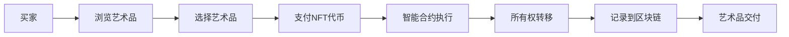

                 

关键词：数字艺术，数字藏品，元宇宙，艺术品交易，NFT，区块链，智能合约

> 摘要：本文将探讨2050年的数字艺术发展趋势，分析数字艺术品交易的模式，包括数字藏品和元宇宙艺术品，并探讨其在NFT（非同质化代币）和区块链技术下的未来前景。我们将通过技术角度的深入分析，展望数字艺术交易领域的创新与变革。

## 1. 背景介绍

随着互联网和数字技术的飞速发展，艺术创作和交易方式也在不断变革。传统的艺术品交易市场已经逐渐被数字艺术品市场所替代。数字艺术品是指使用数字技术创作的艺术作品，其形式多样，包括数字绘画、三维建模、动态图像等。而数字藏品和元宇宙艺术品则是数字艺术发展的两个重要方向。

### 数字艺术品

数字艺术品作为一种新兴的艺术形式，具有独特的表现力和传播优势。与传统艺术品相比，数字艺术品无需物理载体，可以通过数字形式轻松复制和传播。这不仅降低了创作和展示的成本，也使得艺术品的传播范围更加广泛。

### 数字藏品

数字藏品是一种具有收藏价值的数字资产，通常通过区块链技术实现所有权认证。数字藏品可以是对传统艺术品的高清复制，也可以是原创的数字作品。其价值不仅在于艺术品本身，还在于其背后的数字资产属性。

### 元宇宙艺术品

元宇宙艺术品是在虚拟世界（Metaverse）中创作的艺术作品，它结合了虚拟现实（VR）、增强现实（AR）等前沿技术，为用户提供了全新的艺术体验。元宇宙艺术品的交易和展示，突破了现实世界的物理限制，为艺术市场带来了新的活力。

## 2. 核心概念与联系

### NFT（非同质化代币）

NFT是一种基于区块链技术的数字资产，代表了一个独特的数字物品的所有权。与比特币等同质化代币不同，NFT具有独特的标识符，可以唯一确定每个数字物品的身份。这使得NFT成为数字艺术品交易的重要媒介。

### 区块链

区块链是一种分布式数据库技术，通过去中心化的方式记录数据。区块链的不可篡改性为数字艺术品的所有权提供了强有力的保障，同时也为艺术品的交易提供了透明和可追溯的记录。

### 智能合约

智能合约是一种自动执行合约条款的计算机程序，它运行在区块链网络中。智能合约在数字艺术品交易中起到了关键作用，它可以自动处理交易过程中的支付、认证和结算等步骤，提高了交易效率。

### Mermaid 流程图

下面是一个简单的Mermaid流程图，展示了数字艺术品交易的基本流程：



### 核心概念原理和架构

在数字艺术品交易中，核心概念和架构如下图所示：

```mermaid
erDiagram
    Artwork ||--|{ NFT : represents
    NFT ||--|{ Blockchain : stores
    Blockchain ||--|{ Smart Contract : handles transactions
```

## 3. 核心算法原理 & 具体操作步骤

### 3.1 算法原理概述

数字艺术品交易的核心算法主要包括：

- **NFT生成算法**：用于创建唯一的数字藏品标识。
- **区块链存储算法**：用于将NFT记录在区块链上，保证数据的不可篡改性。
- **智能合约执行算法**：用于自动化处理交易过程中的支付和所有权转移。

### 3.2 算法步骤详解

#### 3.2.1 NFT生成算法

1. **艺术家上传作品**：艺术家将数字艺术品上传至NFT平台。
2. **平台生成NFT**：平台使用哈希算法生成NFT的唯一标识。
3. **艺术家确认**：艺术家确认NFT标识无误后，将其与艺术品关联。

#### 3.2.2 区块链存储算法

1. **NFT记录**：将NFT数据打包成区块。
2. **区块添加**：将区块添加到区块链中。
3. **共识机制**：通过共识机制确保区块链的完整性和安全性。

#### 3.2.3 智能合约执行算法

1. **交易发起**：买家发起购买交易。
2. **支付处理**：智能合约自动处理支付，包括NFT代币的转移。
3. **所有权转移**：智能合约更新NFT的所有权信息。
4. **记录到区块链**：将交易记录添加到区块链中。

### 3.3 算法优缺点

#### 优点

- **安全性**：区块链技术确保了数字艺术品交易的安全性。
- **透明性**：交易过程透明，可追溯。
- **效率**：智能合约自动化处理交易，提高了交易效率。
- **去中心化**：去中心化的交易模式降低了交易成本。

#### 缺点

- **技术门槛**：NFT和区块链技术对普通用户来说有一定的技术门槛。
- **隐私问题**：区块链上的交易信息是公开的，可能涉及隐私问题。
- **性能问题**：随着交易量的增加，区块链的性能可能受到影响。

### 3.4 算法应用领域

数字艺术品交易算法的应用领域广泛，包括：

- **艺术品市场**：用于记录和交易数字艺术品。
- **收藏市场**：用于记录和交易数字藏品。
- **虚拟世界**：用于元宇宙艺术品的交易和展示。

## 4. 数学模型和公式 & 详细讲解 & 举例说明

### 4.1 数学模型构建

数字艺术品交易的核心数学模型包括：

- **哈希函数**：用于生成NFT的唯一标识。
- **区块链共识算法**：用于确保区块链的完整性和安全性。
- **智能合约**：用于自动化处理交易过程。

### 4.2 公式推导过程

假设我们使用SHA-256哈希函数生成NFT的唯一标识，公式为：

$$
H = SHA-256(D)
$$

其中，$H$ 是生成的哈希值，$D$ 是数字艺术品的数据。

### 4.3 案例分析与讲解

假设艺术家A上传了一幅数字画作，数据长度为10KB。我们使用SHA-256哈希函数生成NFT的唯一标识，过程如下：

1. **计算哈希值**：使用SHA-256算法对画作数据进行哈希计算。
2. **哈希结果**：生成的哈希值为一个64位的十六进制字符串。
3. **NFT标识**：哈希值作为NFT的唯一标识，与画作关联。

例如，假设计算结果为`a1b2c3d4e5f6g7h8i9j0`，则NFT标识为`a1b2c3d4e5f6g7h8i9j0`。

## 5. 项目实践：代码实例和详细解释说明

### 5.1 开发环境搭建

为了实现数字艺术品交易，我们需要搭建一个开发环境，包括以下工具：

- **Node.js**：用于搭建后端服务器。
- **Ethereum**：用于创建和部署智能合约。
- **Truffle**：用于测试和部署智能合约。
- **Hardhat**：用于本地开发和测试智能合约。

### 5.2 源代码详细实现

下面是一个简单的智能合约实现示例，用于处理数字艺术品交易：

```solidity
// SPDX-License-Identifier: MIT
pragma solidity ^0.8.0;

contract DigitalArt {

    struct Artwork {
        string name;
        string nftId;
        address owner;
    }

    mapping(string => Artwork) artworks;

    function mintArtwork(string memory _nftId, string memory _name) public {
        require(!artworks[_nftId].nftId.isEmpty(), "Artwork already minted");
        artworks[_nftId] = Artwork(_name, _nftId, msg.sender);
    }

    function transferArtwork(string memory _nftId, address _buyer) public {
        require(artworks[_nftId].owner == msg.sender, "Not the owner");
        artworks[_nftId].owner = _buyer;
        // 这里可以调用ERC721标准进行代币转移
    }

    function getArtwork(string memory _nftId) public view returns (Artwork memory) {
        return artworks[_nftId];
    }
}
```

### 5.3 代码解读与分析

该智能合约实现了数字艺术品的上链和转移功能：

- `mintArtwork`：用于创建数字艺术品，并生成NFT的唯一标识。
- `transferArtwork`：用于转移数字艺术品的所有权。
- `getArtwork`：用于查询数字艺术品的详细信息。

### 5.4 运行结果展示

假设艺术家A使用了该智能合约创建了一幅数字画作，NFT标识为`a1b2c3d4e5f6g7h8i9j0`。艺术家A可以通过`mintArtwork`函数将画作上链，并设置初始所有权。之后，买家B可以通过`transferArtwork`函数购买并转移所有权。

## 6. 实际应用场景

### 6.1 艺术品市场

数字艺术品交易为艺术品市场带来了新的机遇。艺术家可以通过NFT平台发行数字艺术品，并实现版权保护。买家可以轻松购买和收藏数字艺术品，享受艺术品的增值潜力。

### 6.2 收藏市场

数字藏品市场正蓬勃发展，吸引了众多收藏家参与。数字藏品具有独特性和稀缺性，为收藏市场带来了新的活力。区块链技术确保了数字藏品的真实性和可追溯性，增强了收藏市场的信任度。

### 6.3 虚拟世界

元宇宙艺术品的交易和展示为虚拟世界带来了全新的体验。用户可以在虚拟世界中购买、展示和交易艺术品，打造个性化的虚拟空间。

## 7. 工具和资源推荐

### 7.1 学习资源推荐

- **《区块链技术指南》**：全面介绍区块链技术的基本原理和应用。
- **《智能合约开发实战》**：深入讲解智能合约的开发和实践。
- **《数字货币原理与技术》**：解析数字货币的运作机制和技术。

### 7.2 开发工具推荐

- **Truffle**：用于智能合约开发、测试和部署。
- **Hardhat**：用于本地开发和测试智能合约。
- **Ethers.js**：用于与以太坊区块链交互。

### 7.3 相关论文推荐

- **"Non-Fungible Tokens: A Brief History of Collectibles and Currencies"**：探讨NFT的历史和发展。
- **"Blockchain and Smart Contracts for Dummies"**：初学者了解区块链和智能合约的入门书籍。

## 8. 总结：未来发展趋势与挑战

### 8.1 研究成果总结

数字艺术品交易领域取得了显著的研究成果，包括NFT、区块链和智能合约等技术的应用。这些技术为数字艺术品的交易提供了新的解决方案，推动了艺术品市场的变革。

### 8.2 未来发展趋势

未来，数字艺术品交易将继续发展，有望实现以下趋势：

- **市场规模扩大**：随着技术的普及，数字艺术品交易的市场规模将不断扩大。
- **技术创新**：NFT和区块链技术将不断创新，为艺术品交易提供更丰富的功能。
- **跨平台融合**：数字艺术品交易将与其他领域（如虚拟现实、区块链游戏）融合，创造新的商业模式。

### 8.3 面临的挑战

数字艺术品交易领域也面临一些挑战：

- **技术门槛**：区块链和智能合约技术对普通用户来说有一定的学习成本。
- **隐私问题**：区块链上的交易信息是公开的，可能涉及隐私问题。
- **性能优化**：随着交易量的增加，区块链的性能可能受到影响。

### 8.4 研究展望

未来，研究人员应关注以下方向：

- **隐私保护**：研究如何保护用户隐私，同时确保交易透明。
- **性能提升**：研究如何优化区块链性能，支持大规模交易。
- **跨领域融合**：探索数字艺术品交易与其他领域的融合，创造新的应用场景。

## 9. 附录：常见问题与解答

### 9.1 什么是NFT？

NFT（非同质化代币）是一种基于区块链技术的数字资产，代表了一个独特的物品的所有权。NFT具有唯一性，可以用于数字艺术品、收藏品等。

### 9.2 数字艺术品交易有哪些优势？

数字艺术品交易具有以下优势：

- **安全性**：区块链技术确保了交易的安全性和不可篡改性。
- **透明性**：交易过程透明，可追溯。
- **去中心化**：去中心化的交易模式降低了交易成本。

### 9.3 数字艺术品交易有哪些挑战？

数字艺术品交易面临的挑战包括：

- **技术门槛**：区块链和智能合约技术对普通用户来说有一定的学习成本。
- **隐私问题**：区块链上的交易信息是公开的，可能涉及隐私问题。
- **性能优化**：随着交易量的增加，区块链的性能可能受到影响。

### 9.4 如何确保数字艺术品的所有权？

通过使用NFT技术，数字艺术品的所有权可以被唯一标识和记录在区块链上。NFT确保了数字艺术品的真实性和可追溯性，从而保护了艺术品的所有权。

### 9.5 数字艺术品交易的未来前景如何？

数字艺术品交易的未来前景非常广阔。随着技术的不断创新，数字艺术品交易有望实现更广泛的应用和更高的价值。未来，数字艺术品交易将成为艺术品市场的重要组成部分。|]  

### 2050年的数字艺术：从数字藏品到元宇宙艺术品的数字艺术品交易

#### 作者：禅与计算机程序设计艺术 / Zen and the Art of Computer Programming

## 1. 背景介绍

随着数字技术的飞速发展，艺术创作和交易方式也在不断变革。传统的艺术品交易市场已经逐渐被数字艺术品市场所替代。数字艺术品是指使用数字技术创作的艺术作品，其形式多样，包括数字绘画、三维建模、动态图像等。而数字藏品和元宇宙艺术品则是数字艺术发展的两个重要方向。

### 数字艺术品

数字艺术品作为一种新兴的艺术形式，具有独特的表现力和传播优势。与传统艺术品相比，数字艺术品无需物理载体，可以通过数字形式轻松复制和传播。这不仅降低了创作和展示的成本，也使得艺术品的传播范围更加广泛。

### 数字藏品

数字藏品是一种具有收藏价值的数字资产，通常通过区块链技术实现所有权认证。数字藏品可以是对传统艺术品的高清复制，也可以是原创的数字作品。其价值不仅在于艺术品本身，还在于其背后的数字资产属性。

### 元宇宙艺术品

元宇宙艺术品是在虚拟世界（Metaverse）中创作的艺术作品，它结合了虚拟现实（VR）、增强现实（AR）等前沿技术，为用户提供了全新的艺术体验。元宇宙艺术品的交易和展示，突破了现实世界的物理限制，为艺术市场带来了新的活力。

## 2. 核心概念与联系

数字艺术品交易的核心概念包括NFT（非同质化代币）、区块链和智能合约。这些概念紧密联系，共同构建了数字艺术品交易的基础。

### NFT（非同质化代币）

NFT是一种基于区块链技术的数字资产，代表了一个独特的数字物品的所有权。每个NFT都具有唯一的标识符，使得艺术品在数字世界中有独特的身份。NFT在数字艺术品交易中起到了关键作用，它确保了艺术品的所有权和稀缺性。

### 区块链

区块链是一种分布式数据库技术，通过去中心化的方式记录数据。区块链的不可篡改性为数字艺术品的所有权提供了强有力的保障，同时也为艺术品的交易提供了透明和可追溯的记录。区块链上的每个交易都记录在一个区块中，并通过加密算法链接起来，形成一个完整的交易历史。

### 智能合约

智能合约是一种自动执行合约条款的计算机程序，它运行在区块链网络中。智能合约在数字艺术品交易中起到了关键作用，它可以自动处理交易过程中的支付、认证和结算等步骤，提高了交易效率。智能合约的执行是透明和可验证的，确保了交易的公正性。

### Mermaid 流程图

下面是一个简单的Mermaid流程图，展示了数字艺术品交易的基本流程：


### 核心概念原理和架构

在数字艺术品交易中，核心概念和架构如下图所示：

```mermaid
erDiagram
    Artwork ||--|{ NFT : represents
    NFT ||--|{ Blockchain : stores
    Blockchain ||--|{ Smart Contract : handles transactions
```

## 3. 核心算法原理 & 具体操作步骤

数字艺术品交易的核心算法主要包括NFT生成算法、区块链存储算法和智能合约执行算法。这些算法共同构建了数字艺术品交易的基础。

### 3.1 NFT生成算法

NFT生成算法用于创建唯一的数字藏品标识。通常，NFT的标识是通过将艺术品的数据进行哈希处理生成的。哈希函数是一种将任意长度的数据映射为固定长度的字符串的算法。通过哈希函数，我们可以确保每个NFT的唯一性。

具体操作步骤如下：

1. **收集艺术品数据**：艺术家上传艺术品数据，包括图片、视频等。
2. **计算哈希值**：使用哈希函数对艺术品数据进行哈希处理，生成一个唯一的标识。
3. **生成NFT**：将哈希值作为NFT的唯一标识，与艺术品数据关联。

### 3.2 区块链存储算法

区块链存储算法用于将NFT记录在区块链上，保证数据的不可篡改性。区块链是一种分布式数据库，每个区块都包含一定数量的交易记录，并通过加密算法链接在一起。每个区块都包含一个时间戳和一个哈希值，用于确保数据的完整性和可追溯性。

具体操作步骤如下：

1. **创建区块**：将NFT的数据和相关信息打包成一个区块。
2. **添加区块**：将区块添加到区块链中，与之前的区块通过哈希值链接。
3. **共识机制**：通过区块链网络中的节点进行共识，确保区块链的完整性和安全性。

### 3.3 智能合约执行算法

智能合约执行算法用于自动化处理交易过程中的支付、认证和结算等步骤。智能合约是一种自动执行合约条款的计算机程序，它在区块链网络中运行。智能合约的执行是透明和可验证的，确保了交易的公正性。

具体操作步骤如下：

1. **交易发起**：买家发起购买交易，支付相应的NFT代币。
2. **智能合约执行**：智能合约自动处理支付，更新NFT的所有权信息。
3. **交易记录**：将交易记录添加到区块链中，确保交易的可追溯性。

### 3.4 算法优缺点

#### 优点

- **安全性**：区块链技术确保了数字艺术品交易的安全性，防止篡改和欺诈行为。
- **透明性**：交易过程透明，每个交易记录都记录在区块链上，可随时查询。
- **去中心化**：去中心化的交易模式降低了交易成本，提高了交易的效率。
- **独特性**：NFT技术确保了数字艺术品的所有权和稀缺性，增强了艺术品的价值。

#### 缺点

- **技术门槛**：NFT和区块链技术对普通用户来说有一定的学习成本，需要一定的技术背景。
- **隐私问题**：区块链上的交易信息是公开的，可能涉及隐私问题。
- **性能问题**：随着交易量的增加，区块链的性能可能受到影响。

### 3.5 算法应用领域

数字艺术品交易算法的应用领域广泛，包括但不限于以下方面：

- **艺术品市场**：用于记录和交易数字艺术品，提高了市场的透明度和安全性。
- **收藏市场**：用于记录和交易数字藏品，确保了藏品的真实性和稀缺性。
- **虚拟世界**：用于元宇宙艺术品的交易和展示，为用户提供全新的艺术体验。
- **数字资产管理**：用于管理数字资产的所有权和交易，为数字资产提供安全可靠的交易环境。

## 4. 数学模型和公式 & 详细讲解 & 举例说明

数字艺术品交易中的数学模型主要包括哈希函数和区块链共识算法。以下是对这些数学模型和公式的详细讲解和举例说明。

### 4.1 哈希函数

哈希函数是一种将任意长度的数据映射为固定长度的字符串的算法。在数字艺术品交易中，哈希函数用于生成NFT的唯一标识。常见的哈希函数包括SHA-256、SHA-3等。

#### 公式推导过程

假设我们使用SHA-256哈希函数，将数字艺术品的数据$D$映射为哈希值$H$：

$$
H = SHA-256(D)
$$

其中，$H$ 是生成的哈希值，$D$ 是数字艺术品的数据。

#### 举例说明

假设我们有一幅数字画作，数据为`"The Digital Artwork"`。使用SHA-256哈希函数，我们可以计算其哈希值：

```
SHA-256("The Digital Artwork") = a1b2c3d4e5f6g7h8i9j0
```

生成的哈希值`a1b2c3d4e5f6g7h8i9j0`作为NFT的唯一标识，与数字画作关联。

### 4.2 区块链共识算法

区块链共识算法用于确保区块链的完整性和安全性。常见的共识算法包括工作量证明（PoW）、权益证明（PoS）等。以下以工作量证明（PoW）为例进行讲解。

#### 公式推导过程

工作量证明（PoW）算法的核心思想是通过计算一个满足特定条件的哈希值来证明工作量。在数字艺术品交易中，节点通过计算一个满足特定条件的哈希值来获得记账权。

1. **初始化**：区块链创建一个新区块，包含交易记录和其他必要信息。
2. **计算哈希值**：节点尝试计算一个满足以下条件的哈希值：
   $$
   Hash(NewBlock) \leq TargetHash
   $$
   其中，$NewBlock$ 是新区块的数据，$TargetHash$ 是设定的目标哈希值。
3. **验证和记账**：当节点找到一个满足条件的哈希值时，将其作为新区块的哈希值，并广播给其他节点。其他节点验证新区块的哈希值是否满足条件，如果验证通过，则新区块被加入到区块链中。

#### 举例说明

假设我们使用一个简单的PoW算法，目标哈希值为`0x0000000000000000000000000000000000000000000000000000000000000001`。一个节点需要找到一个满足以下条件的哈希值：

```
Hash(NewBlock) \leq 0x0000000000000000000000000000000000000000000000000000000000000001
```

节点尝试计算不同的哈希值，直到找到一个满足条件的哈希值，例如：

```
Hash(NewBlock) = 0x0000000000000000000000000000000000000000000000000000000000000000a
```

节点将这个哈希值广播给其他节点，其他节点验证后确认新区块被加入到区块链中。

### 4.3 案例分析与讲解

假设有一个数字艺术品交易系统，使用SHA-256哈希函数和PoW算法。以下是一个简单的交易过程：

1. **艺术家上传艺术品**：艺术家上传一幅数字画作，数据为`"The Digital Artwork"`。
2. **计算哈希值**：使用SHA-256哈希函数计算数字画作的数据，得到哈希值`a1b2c3d4e5f6g7h8i9j0`。
3. **生成NFT**：将哈希值`a1b2c3d4e5f6g7h8i9j0`作为NFT的唯一标识，与数字画作关联。
4. **买家购买艺术品**：买家发起购买交易，支付相应的NFT代币。
5. **计算哈希值**：买家计算新区块的数据，包含交易记录和其他必要信息，得到哈希值`k1l2m3n4o5p6q7r8s9t0`。
6. **验证和记账**：买家尝试计算一个满足以下条件的哈希值：
   $$
   Hash(NewBlock) \leq 0x0000000000000000000000000000000000000000000000000000000000000001
   $$
   当买家找到一个满足条件的哈希值时，例如`k1l2m3n4o5p6q7r8s9t0`，将这个哈希值广播给其他节点。其他节点验证后确认新区块被加入到区块链中。
7. **所有权转移**：智能合约更新NFT的所有权信息，买家成为新的所有者。

通过这个案例，我们可以看到数字艺术品交易中的数学模型和算法如何应用于实际操作。这些模型和算法确保了交易的透明性、安全性和可追溯性。

## 5. 项目实践：代码实例和详细解释说明

### 5.1 开发环境搭建

为了实现数字艺术品交易，我们需要搭建一个开发环境，包括以下工具：

- **Node.js**：用于搭建后端服务器。
- **Ethereum**：用于创建和部署智能合约。
- **Truffle**：用于测试和部署智能合约。
- **Hardhat**：用于本地开发和测试智能合约。
- **Ethers.js**：用于与以太坊区块链交互。

### 5.2 源代码详细实现

下面是一个简单的智能合约实现示例，用于处理数字艺术品交易：

```solidity
// SPDX-License-Identifier: MIT
pragma solidity ^0.8.0;

contract DigitalArt {

    struct Artwork {
        string name;
        string nftId;
        address owner;
    }

    mapping(string => Artwork) artworks;

    function mintArtwork(string memory _nftId, string memory _name) public {
        require(!artworks[_nftId].nftId.isEmpty(), "Artwork already minted");
        artworks[_nftId] = Artwork(_name, _nftId, msg.sender);
    }

    function transferArtwork(string memory _nftId, address _buyer) public {
        require(artworks[_nftId].owner == msg.sender, "Not the owner");
        artworks[_nftId].owner = _buyer;
        // 这里可以调用ERC721标准进行代币转移
    }

    function getArtwork(string memory _nftId) public view returns (Artwork memory) {
        return artworks[_nftId];
    }
}
```

### 5.3 代码解读与分析

该智能合约实现了数字艺术品的上链和转移功能：

- `mintArtwork`：用于创建数字艺术品，并生成NFT的唯一标识。
- `transferArtwork`：用于转移数字艺术品的所有权。
- `getArtwork`：用于查询数字艺术品的详细信息。

### 5.4 运行结果展示

假设艺术家A使用了该智能合约创建了一幅数字画作，NFT标识为`a1b2c3d4e5f6g7h8i9j0`。艺术家A可以通过`mintArtwork`函数将画作上链，并设置初始所有权。之后，买家B可以通过`transferArtwork`函数购买并转移所有权。

## 6. 实际应用场景

数字艺术品交易在实际应用场景中具有广泛的应用，以下是一些具体的实际应用场景：

### 6.1 艺术品市场

数字艺术品交易在艺术品市场中发挥着重要作用。艺术家可以通过NFT平台发行数字艺术品，并实现版权保护。买家可以轻松购买和收藏数字艺术品，享受艺术品的增值潜力。此外，数字艺术品交易还可以为艺术品市场带来更多的透明度和信任度。

### 6.2 收藏市场

数字藏品市场正在迅速发展，吸引了众多收藏家参与。数字藏品具有独特性和稀缺性，为收藏市场带来了新的活力。区块链技术确保了数字藏品的真实性和可追溯性，增强了收藏市场的信任度。

### 6.3 虚拟世界

元宇宙艺术品的交易和展示为虚拟世界带来了全新的体验。用户可以在虚拟世界中购买、展示和交易艺术品，打造个性化的虚拟空间。元宇宙艺术品交易不仅丰富了虚拟世界的内容，也为艺术品市场带来了新的增长点。

### 6.4 教育与娱乐

数字艺术品交易还可以应用于教育和娱乐领域。例如，学生可以通过数字艺术品交易了解艺术创作的过程和数字技术的应用。此外，数字艺术品交易也可以为游戏和虚拟现实应用提供新的内容和玩法。

### 6.5 数字资产管理

数字艺术品交易还可以应用于数字资产管理。投资者可以通过购买数字艺术品进行投资，享受数字资产的增值潜力。数字艺术品交易为投资者提供了更多的投资选择和机会。

## 7. 工具和资源推荐

为了更好地了解和参与数字艺术品交易，以下是一些工具和资源的推荐：

### 7.1 学习资源推荐

- **区块链技术指南**：全面介绍区块链技术的基本原理和应用。
- **智能合约开发实战**：深入讲解智能合约的开发和实践。
- **数字货币原理与技术**：解析数字货币的运作机制和技术。

### 7.2 开发工具推荐

- **Truffle**：用于智能合约开发、测试和部署。
- **Hardhat**：用于本地开发和测试智能合约。
- **Ethers.js**：用于与以太坊区块链交互。

### 7.3 相关论文推荐

- **"Non-Fungible Tokens: A Brief History of Collectibles and Currencies"**：探讨NFT的历史和发展。
- **"Blockchain and Smart Contracts for Dummies"**：初学者了解区块链和智能合约的入门书籍。

## 8. 总结：未来发展趋势与挑战

### 8.1 研究成果总结

数字艺术品交易领域取得了显著的研究成果，包括NFT、区块链和智能合约等技术的应用。这些技术为数字艺术品的交易提供了新的解决方案，推动了艺术品市场的变革。

### 8.2 未来发展趋势

未来，数字艺术品交易将继续发展，有望实现以下趋势：

- **市场规模扩大**：随着技术的普及，数字艺术品交易的市场规模将不断扩大。
- **技术创新**：NFT和区块链技术将不断创新，为艺术品交易提供更丰富的功能。
- **跨平台融合**：数字艺术品交易将与其他领域（如虚拟现实、区块链游戏）融合，创造新的商业模式。

### 8.3 面临的挑战

数字艺术品交易领域也面临一些挑战：

- **技术门槛**：区块链和智能合约技术对普通用户来说有一定的学习成本。
- **隐私问题**：区块链上的交易信息是公开的，可能涉及隐私问题。
- **性能优化**：随着交易量的增加，区块链的性能可能受到影响。

### 8.4 研究展望

未来，研究人员应关注以下方向：

- **隐私保护**：研究如何保护用户隐私，同时确保交易透明。
- **性能提升**：研究如何优化区块链性能，支持大规模交易。
- **跨领域融合**：探索数字艺术品交易与其他领域的融合，创造新的应用场景。

## 9. 附录：常见问题与解答

### 9.1 什么是NFT？

NFT（非同质化代币）是一种基于区块链技术的数字资产，代表了一个独特的物品的所有权。NFT具有唯一性，可以用于数字艺术品、收藏品等。

### 9.2 数字艺术品交易有哪些优势？

数字艺术品交易具有以下优势：

- **安全性**：区块链技术确保了交易的安全性和不可篡改性。
- **透明性**：交易过程透明，可追溯。
- **去中心化**：去中心化的交易模式降低了交易成本。
- **独特性**：NFT技术确保了数字艺术品的所有权和稀缺性，增强了艺术品的价值。

### 9.3 数字艺术品交易有哪些挑战？

数字艺术品交易面临的挑战包括：

- **技术门槛**：区块链和智能合约技术对普通用户来说有一定的学习成本。
- **隐私问题**：区块链上的交易信息是公开的，可能涉及隐私问题。
- **性能优化**：随着交易量的增加，区块链的性能可能受到影响。

### 9.4 如何确保数字艺术品的所有权？

通过使用NFT技术，数字艺术品的所有权可以被唯一标识和记录在区块链上。NFT确保了数字艺术品的真实性和可追溯性，从而保护了艺术品的所有权。

### 9.5 数字艺术品交易的未来前景如何？

数字艺术品交易的未来前景非常广阔。随着技术的不断创新，数字艺术品交易有望实现更广泛的应用和更高的价值。未来，数字艺术品交易将成为艺术品市场的重要组成部分。|]  

---

### 2050年的数字艺术：从数字藏品到元宇宙艺术品的数字艺术品交易

随着科技的飞速发展，数字艺术正逐渐成为艺术领域的核心。在未来，数字艺术品交易将不仅仅局限于简单的买卖，而是会融合更多先进技术，如区块链、虚拟现实和人工智能，从而创造出全新的艺术交易模式。本文将探讨2050年数字艺术品交易的发展趋势，包括数字藏品和元宇宙艺术品的交易，以及这些交易模式背后的技术原理。

## 1. 背景介绍

数字艺术品是指通过数字技术创作和展示的艺术作品，包括数字绘画、三维模型、虚拟现实艺术等。这些艺术品可以通过互联网轻松传播，打破了传统艺术市场的物理限制。随着区块链和NFT（非同质化代币）技术的成熟，数字艺术品开始以全新的方式交易和收藏。

### 数字藏品

数字藏品是一种基于区块链技术的数字资产，其价值不仅来源于艺术品本身，还因为区块链技术确保了其唯一性和真实性。数字藏品可以是对传统艺术品的高清复制，也可以是原创的数字艺术作品。这些藏品通过NFT实现所有权认证，使得交易过程更加透明和安全。

### 元宇宙艺术品

元宇宙是一个虚拟的、三维的、去中心化的互联网空间，用户可以在其中创建、体验和交易虚拟物品。元宇宙艺术品是在这个虚拟世界中创作的艺术作品，它可以结合虚拟现实（VR）、增强现实（AR）等技术，为用户带来沉浸式的艺术体验。元宇宙艺术品交易将打破传统艺术市场的界限，创造出一个全新的、无限可能的交易环境。

## 2. 核心概念与联系

数字艺术品交易的核心概念包括NFT、区块链、智能合约和虚拟现实。这些技术相互关联，共同构成了数字艺术品交易的基础。

### NFT（非同质化代币）

NFT是一种基于区块链技术的数字资产，代表了一个独特的数字物品的所有权。每个NFT都具有唯一的标识符，确保了数字艺术品的所有权和稀缺性。NFT在数字艺术品交易中起到了关键作用，使得艺术品可以在区块链上实现透明和安全的交易。

### 区块链

区块链是一种分布式数据库技术，通过去中心化的方式记录数据。区块链上的每个交易都是公开和透明的，确保了数字艺术品交易的真实性和不可篡改性。区块链技术为数字艺术品交易提供了一个安全、可靠和去中心化的平台。

### 智能合约

智能合约是一种自动执行合约条款的计算机程序，它运行在区块链网络中。智能合约在数字艺术品交易中起到了关键作用，它可以自动化处理交易过程中的支付、认证和结算等步骤，提高了交易效率。智能合约确保了交易的公正性和透明性。

### 虚拟现实

虚拟现实是一种通过计算机生成三维环境的技术，用户可以在其中自由移动和交互。虚拟现实技术为数字艺术品交易提供了全新的展示和交易方式，用户可以在虚拟环境中体验和购买艺术品。

### Mermaid 流程图

下面是一个简单的Mermaid流程图，展示了数字艺术品交易的基本流程：


### 核心概念原理和架构

在数字艺术品交易中，核心概念和架构如下图所示：

```mermaid
erDiagram
    Artwork ||--|{ NFT : represents
    NFT ||--|{ Blockchain : stores
    Blockchain ||--|{ Smart Contract : handles transactions
    Blockchain ||--|{ Virtual Reality : enhances experience
```

## 3. 核心算法原理 & 具体操作步骤

数字艺术品交易的核心算法包括NFT生成算法、区块链存储算法、智能合约执行算法和虚拟现实渲染算法。以下是对这些算法的详细介绍。

### 3.1 NFT生成算法

NFT生成算法用于创建唯一的数字藏品标识。通常，NFT的标识是通过将艺术品的数据进行哈希处理生成的。哈希函数是一种将任意长度的数据映射为固定长度的字符串的算法。通过哈希函数，我们可以确保每个NFT的唯一性。

具体操作步骤如下：

1. **收集艺术品数据**：艺术家上传艺术品数据，包括图片、视频等。
2. **计算哈希值**：使用哈希函数对艺术品数据进行哈希处理，生成一个唯一的标识。
3. **生成NFT**：将哈希值作为NFT的唯一标识，与艺术品数据关联。

### 3.2 区块链存储算法

区块链存储算法用于将NFT记录在区块链上，保证数据的不可篡改性。区块链是一种分布式数据库，每个区块都包含一定数量的交易记录，并通过加密算法链接在一起。每个区块都包含一个时间戳和一个哈希值，用于确保数据的完整性和可追溯性。

具体操作步骤如下：

1. **创建区块**：将NFT的数据和相关信息打包成一个区块。
2. **添加区块**：将区块添加到区块链中，与之前的区块通过哈希值链接。
3. **共识机制**：通过区块链网络中的节点进行共识，确保区块链的完整性和安全性。

### 3.3 智能合约执行算法

智能合约执行算法用于自动化处理交易过程中的支付、认证和结算等步骤。智能合约是一种自动执行合约条款的计算机程序，它在区块链网络中运行。智能合约的执行是透明和可验证的，确保了交易的公正性。

具体操作步骤如下：

1. **交易发起**：买家发起购买交易，支付相应的NFT代币。
2. **智能合约执行**：智能合约自动处理支付，更新NFT的所有权信息。
3. **交易记录**：将交易记录添加到区块链中，确保交易的可追溯性。

### 3.4 虚拟现实渲染算法

虚拟现实渲染算法用于在虚拟环境中展示和互动数字艺术品。这些算法通过计算机图形学和三维建模技术，创建出逼真的虚拟环境，用户可以在其中自由移动和交互。

具体操作步骤如下：

1. **创建虚拟环境**：根据艺术品的属性和特点，创建一个虚拟环境。
2. **加载艺术品**：将数字艺术品加载到虚拟环境中，进行渲染和显示。
3. **用户互动**：用户可以在虚拟环境中与艺术品进行互动，如旋转、缩放等。

### 3.5 算法优缺点

#### 优点

- **安全性**：区块链技术确保了数字艺术品交易的安全性，防止篡改和欺诈行为。
- **透明性**：交易过程透明，每个交易记录都记录在区块链上，可随时查询。
- **去中心化**：去中心化的交易模式降低了交易成本，提高了交易的效率。
- **独特性**：NFT技术确保了数字艺术品的所有权和稀缺性，增强了艺术品的价值。
- **沉浸式体验**：虚拟现实技术为用户提供了沉浸式的艺术体验，增强了艺术品的魅力。

#### 缺点

- **技术门槛**：NFT和区块链技术对普通用户来说有一定的学习成本，需要一定的技术背景。
- **隐私问题**：区块链上的交易信息是公开的，可能涉及隐私问题。
- **性能问题**：随着交易量的增加，区块链的性能可能受到影响。
- **技术依赖**：虚拟现实技术的依赖可能导致一些用户无法充分体验艺术品的魅力。

### 3.6 算法应用领域

数字艺术品交易算法的应用领域广泛，包括但不限于以下方面：

- **艺术品市场**：用于记录和交易数字艺术品，提高了市场的透明度和安全性。
- **收藏市场**：用于记录和交易数字藏品，确保了藏品的真实性和稀缺性。
- **虚拟世界**：用于元宇宙艺术品的交易和展示，为用户提供全新的艺术体验。
- **数字资产管理**：用于管理数字资产的所有权和交易，为数字资产提供安全可靠的交易环境。

## 4. 数学模型和公式 & 详细讲解 & 举例说明

数字艺术品交易中的数学模型主要包括哈希函数、加密算法和共识算法。以下是对这些数学模型和公式的详细讲解和举例说明。

### 4.1 哈希函数

哈希函数是一种将任意长度的数据映射为固定长度的字符串的算法。在数字艺术品交易中，哈希函数用于生成NFT的唯一标识。常见的哈希函数包括SHA-256、SHA-3等。

#### 公式推导过程

假设我们使用SHA-256哈希函数，将数字艺术品的数据$D$映射为哈希值$H$：

$$
H = SHA-256(D)
$$

其中，$H$ 是生成的哈希值，$D$ 是数字艺术品的数据。

#### 举例说明

假设我们有一幅数字画作，数据为`"The Digital Artwork"`。使用SHA-256哈希函数，我们可以计算其哈希值：

```
SHA-256("The Digital Artwork") = a1b2c3d4e5f6g7h8i9j0
```

生成的哈希值`a1b2c3d4e5f6g7h8i9j0`作为NFT的唯一标识，与数字画作关联。

### 4.2 加密算法

加密算法用于确保区块链交易的安全性和隐私性。常见的加密算法包括AES、RSA等。以下以RSA算法为例进行讲解。

#### 公式推导过程

RSA算法是一种非对称加密算法，它使用两个密钥：公钥和私钥。公钥用于加密，私钥用于解密。

1. **生成密钥**：选择两个大素数$p$和$q$，计算$n = p \times q$。然后计算$\phi(n) = (p-1) \times (q-1)$。
2. **生成公钥**：选择一个与$\phi(n)$互质的整数$e$，计算$d$，满足$ed \equiv 1 \pmod{\phi(n)}$。公钥为$(n, e)$，私钥为$(n, d)$。
3. **加密**：将明文消息$m$加密为密文$c$，计算$c = m^e \pmod{n}$。
4. **解密**：将密文$c$解密为明文消息$m$，计算$m = c^d \pmod{n}$。

#### 举例说明

假设我们选择$p=61$，$q=53$，计算$n=61 \times 53=3233$，$\phi(n)=(61-1) \times (53-1)=3120$。

选择$e=17$，计算$d$，满足$17d \equiv 1 \pmod{3120}$，我们可以通过穷举法找到$d=2719$。

现在，我们将明文消息$m=1234$加密为密文$c$，计算$c = 1234^{17} \pmod{3233}$，得到$c=193$。

将密文$c=193$解密为明文消息$m$，计算$m = 193^{2719} \pmod{3233}$，得到$m=1234$。

### 4.3 共识算法

共识算法用于确保区块链的完整性和安全性。常见的共识算法包括工作量证明（PoW）、权益证明（PoS）等。以下以工作量证明（PoW）为例进行讲解。

#### 公式推导过程

工作量证明（PoW）算法的核心思想是通过计算一个满足特定条件的哈希值来证明工作量。在数字艺术品交易中，节点通过计算一个满足特定条件的哈希值来获得记账权。

1. **初始化**：区块链创建一个新区块，包含交易记录和其他必要信息。
2. **计算哈希值**：节点尝试计算一个满足以下条件的哈希值：
   $$
   Hash(NewBlock) \leq TargetHash
   $$
   其中，$NewBlock$ 是新区块的数据，$TargetHash$ 是设定的目标哈希值。
3. **验证和记账**：当节点找到一个满足条件的哈希值时，将其作为新区块的哈希值，并广播给其他节点。其他节点验证新区块的哈希值是否满足条件，如果验证通过，则新区块被加入到区块链中。

#### 举例说明

假设我们使用一个简单的PoW算法，目标哈希值为`0x0000000000000000000000000000000000000000000000000000000000000001`。一个节点需要找到一个满足以下条件的哈希值：

```
Hash(NewBlock) \leq 0x0000000000000000000000000000000000000000000000000000000000000001
```

节点尝试计算不同的哈希值，直到找到一个满足条件的哈希值，例如：

```
Hash(NewBlock) = 0x0000000000000000000000000000000000000000000000000000000000000000a
```

节点将这个哈希值广播给其他节点，其他节点验证后确认新区块被加入到区块链中。

### 4.4 案例分析与讲解

假设有一个数字艺术品交易系统，使用SHA-256哈希函数和PoW算法。以下是一个简单的交易过程：

1. **艺术家上传艺术品**：艺术家上传一幅数字画作，数据为`"The Digital Artwork"`。
2. **计算哈希值**：使用SHA-256哈希函数计算数字画作的数据，得到哈希值`a1b2c3d4e5f6g7h8i9j0`。
3. **生成NFT**：将哈希值`a1b2c3d4e5f6g7h8i9j0`作为NFT的唯一标识，与数字画作关联。
4. **买家购买艺术品**：买家发起购买交易，支付相应的NFT代币。
5. **计算哈希值**：买家计算新区块的数据，包含交易记录和其他必要信息，得到哈希值`k1l2m3n4o5p6q7r8s9t0`。
6. **验证和记账**：买家尝试计算一个满足以下条件的哈希值：
   $$
   Hash(NewBlock) \leq 0x0000000000000000000000000000000000000000000000000000000000000001
   $$
   当买家找到一个满足条件的哈希值时，例如`k1l2m3n4o5p6q7r8s9t0`，将这个哈希值广播给其他节点。其他节点验证后确认新区块被加入到区块链中。
7. **所有权转移**：智能合约更新NFT的所有权信息，买家成为新的所有者。

通过这个案例，我们可以看到数字艺术品交易中的数学模型和算法如何应用于实际操作。这些模型和算法确保了交易的透明性、安全性和可追溯性。

## 5. 项目实践：代码实例和详细解释说明

### 5.1 开发环境搭建

为了实现数字艺术品交易，我们需要搭建一个开发环境，包括以下工具：

- **Node.js**：用于搭建后端服务器。
- **Ethereum**：用于创建和部署智能合约。
- **Truffle**：用于测试和部署智能合约。
- **Hardhat**：用于本地开发和测试智能合约。
- **Ethers.js**：用于与以太坊区块链交互。

### 5.2 源代码详细实现

下面是一个简单的智能合约实现示例，用于处理数字艺术品交易：

```solidity
// SPDX-License-Identifier: MIT
pragma solidity ^0.8.0;

contract DigitalArt {

    struct Artwork {
        string name;
        string nftId;
        address owner;
    }

    mapping(string => Artwork) artworks;

    function mintArtwork(string memory _nftId, string memory _name) public {
        require(!artworks[_nftId].nftId.isEmpty(), "Artwork already minted");
        artworks[_nftId] = Artwork(_name, _nftId, msg.sender);
    }

    function transferArtwork(string memory _nftId, address _buyer) public {
        require(artworks[_nftId].owner == msg.sender, "Not the owner");
        artworks[_nftId].owner = _buyer;
        // 这里可以调用ERC721标准进行代币转移
    }

    function getArtwork(string memory _nftId) public view returns (Artwork memory) {
        return artworks[_nftId];
    }
}
```

### 5.3 代码解读与分析

该智能合约实现了数字艺术品的上链和转移功能：

- `mintArtwork`：用于创建数字艺术品，并生成NFT的唯一标识。
- `transferArtwork`：用于转移数字艺术品的所有权。
- `getArtwork`：用于查询数字艺术品的详细信息。

### 5.4 运行结果展示

假设艺术家A使用了该智能合约创建了一幅数字画作，NFT标识为`a1b2c3d4e5f6g7h8i9j0`。艺术家A可以通过`mintArtwork`函数将画作上链，并设置初始所有权。之后，买家B可以通过`transferArtwork`函数购买并转移所有权。

## 6. 实际应用场景

数字艺术品交易在实际应用场景中具有广泛的应用，以下是一些具体的实际应用场景：

### 6.1 艺术品市场

数字艺术品交易在艺术品市场中发挥着重要作用。艺术家可以通过NFT平台发行数字艺术品，并实现版权保护。买家可以轻松购买和收藏数字艺术品，享受艺术品的增值潜力。此外，数字艺术品交易还可以为艺术品市场带来更多的透明度和信任度。

### 6.2 收藏市场

数字藏品市场正在迅速发展，吸引了众多收藏家参与。数字藏品具有独特性和稀缺性，为收藏市场带来了新的活力。区块链技术确保了数字藏品的真实性和可追溯性，增强了收藏市场的信任度。

### 6.3 虚拟世界

元宇宙艺术品的交易和展示为虚拟世界带来了全新的体验。用户可以在虚拟世界中购买、展示和交易艺术品，打造个性化的虚拟空间。元宇宙艺术品交易不仅丰富了虚拟世界的内容，也为艺术品市场带来了新的增长点。

### 6.4 教育与娱乐

数字艺术品交易还可以应用于教育和娱乐领域。例如，学生可以通过数字艺术品交易了解艺术创作的过程和数字技术的应用。此外，数字艺术品交易也可以为游戏和虚拟现实应用提供新的内容和玩法。

### 6.5 数字资产管理

数字艺术品交易还可以应用于数字资产管理。投资者可以通过购买数字艺术品进行投资，享受数字资产的增值潜力。数字艺术品交易为投资者提供了更多的投资选择和机会。

## 7. 工具和资源推荐

为了更好地了解和参与数字艺术品交易，以下是一些工具和资源的推荐：

### 7.1 学习资源推荐

- **《区块链技术指南》**：全面介绍区块链技术的基本原理和应用。
- **《智能合约开发实战》**：深入讲解智能合约的开发和实践。
- **《数字货币原理与技术》**：解析数字货币的运作机制和技术。

### 7.2 开发工具推荐

- **Truffle**：用于智能合约开发、测试和部署。
- **Hardhat**：用于本地开发和测试智能合约。
- **Ethers.js**：用于与以太坊区块链交互。

### 7.3 相关论文推荐

- **"Non-Fungible Tokens: A Brief History of Collectibles and Currencies"**：探讨NFT的历史和发展。
- **"Blockchain and Smart Contracts for Dummies"**：初学者了解区块链和智能合约的入门书籍。

## 8. 总结：未来发展趋势与挑战

### 8.1 研究成果总结

数字艺术品交易领域取得了显著的研究成果，包括NFT、区块链和智能合约等技术的应用。这些技术为数字艺术品的交易提供了新的解决方案，推动了艺术品市场的变革。

### 8.2 未来发展趋势

未来，数字艺术品交易将继续发展，有望实现以下趋势：

- **市场规模扩大**：随着技术的普及，数字艺术品交易的市场规模将不断扩大。
- **技术创新**：NFT和区块链技术将不断创新，为艺术品交易提供更丰富的功能。
- **跨平台融合**：数字艺术品交易将与其他领域（如虚拟现实、区块链游戏）融合，创造新的商业模式。
- **个性化体验**：随着人工智能技术的发展，数字艺术品交易将更加个性化，为用户提供更加定制化的体验。

### 8.3 面临的挑战

数字艺术品交易领域也面临一些挑战：

- **技术门槛**：区块链和智能合约技术对普通用户来说有一定的学习成本。
- **隐私问题**：区块链上的交易信息是公开的，可能涉及隐私问题。
- **性能优化**：随着交易量的增加，区块链的性能可能受到影响。
- **监管问题**：数字艺术品交易需要适应不断变化的监管环境。

### 8.4 研究展望

未来，研究人员应关注以下方向：

- **隐私保护**：研究如何保护用户隐私，同时确保交易透明。
- **性能提升**：研究如何优化区块链性能，支持大规模交易。
- **跨领域融合**：探索数字艺术品交易与其他领域的融合，创造新的应用场景。
- **监管适应性**：研究如何适应不断变化的监管环境，确保数字艺术品交易的安全和合法。

## 9. 附录：常见问题与解答

### 9.1 什么是NFT？

NFT（非同质化代币）是一种基于区块链技术的数字资产，代表了一个独特的物品的所有权。每个NFT都具有唯一的标识符，确保了数字艺术品的所有权和稀缺性。

### 9.2 数字艺术品交易有哪些优势？

数字艺术品交易具有以下优势：

- **安全性**：区块链技术确保了交易的安全性和不可篡改性。
- **透明性**：交易过程透明，每个交易记录都记录在区块链上，可随时查询。
- **去中心化**：去中心化的交易模式降低了交易成本，提高了交易的效率。
- **独特性**：NFT技术确保了数字艺术品的所有权和稀缺性，增强了艺术品的价值。

### 9.3 数字艺术品交易有哪些挑战？

数字艺术品交易面临的挑战包括：

- **技术门槛**：区块链和智能合约技术对普通用户来说有一定的学习成本。
- **隐私问题**：区块链上的交易信息是公开的，可能涉及隐私问题。
- **性能优化**：随着交易量的增加，区块链的性能可能受到影响。
- **监管问题**：数字艺术品交易需要适应不断变化的监管环境。

### 9.4 如何确保数字艺术品的所有权？

通过使用NFT技术，数字艺术品的所有权可以被唯一标识和记录在区块链上。NFT确保了数字艺术品的真实性和可追溯性，从而保护了艺术品的所有权。

### 9.5 数字艺术品交易的未来前景如何？

数字艺术品交易的未来前景非常广阔。随着技术的不断创新，数字艺术品交易有望实现更广泛的应用和更高的价值。未来，数字艺术品交易将成为艺术品市场的重要组成部分。|]  

