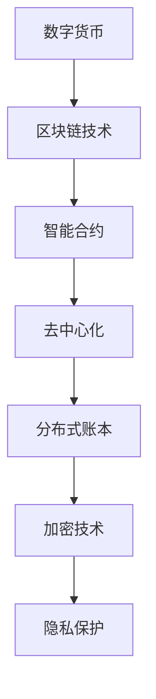

                 

关键词：数字货币、法定数字货币、全球货币体系、区块链、智能合约、去中心化、分布式账本、加密技术、货币政策、支付系统、金融创新、技术创新、加密货币、智能经济

> 摘要：随着技术的迅猛发展，数字货币已经成为金融领域的革命性力量。本文将探讨到2050年，数字货币如何从法定数字货币走向全球货币体系的重构，分析其背后的技术原理、应用场景以及面临的挑战。

## 1. 背景介绍

数字货币作为金融创新的重要成果，始于2009年比特币的诞生。比特币的问世，标志着去中心化金融体系的初步构建，它脱离了传统金融体系的束缚，利用密码学技术实现了点对点的交易。随着时间的推移，数字货币的种类和数量日益增加，越来越多的国家开始关注和试验法定数字货币（Central Bank Digital Currency，简称CBDC）。

CBDC是由中央银行发行的数字货币，旨在提高支付系统的效率、降低交易成本、增强金融包容性。全球范围内，已有多个国家的中央银行宣布启动CBDC的研究和试验项目，如中国的数字人民币（e-CNY）、欧洲的数字欧元（e-euro）等。

本文将探讨到2050年，数字货币如何从法定数字货币走向全球货币体系的重构，探讨其背后的技术原理、应用场景以及面临的挑战。

### 1.1 数字货币的发展历程

从比特币的诞生到法定数字货币的兴起，数字货币的发展历程可以分为以下几个阶段：

1. **比特币与区块链的兴起（2009年-2017年）**：比特币的问世，引发了全球对区块链技术的广泛关注。区块链作为一种分布式账本技术，提供了去中心化的信任机制，为数字货币的发展奠定了基础。

2. **加密货币的繁荣（2017年-2020年）**：比特币等加密货币价格暴涨，吸引了大量投资者的关注。在此期间，各种加密货币如雨后春笋般涌现，为数字货币市场注入了新的活力。

3. **法定数字货币的探索（2020年至今）**：随着数字货币的普及，越来越多的国家开始关注和试验法定数字货币。中国、欧洲、瑞士、乌拉圭等国家和地区已经取得了实质性进展。

### 1.2 法定数字货币的兴起原因

1. **提升支付系统的效率**：传统的支付系统存在许多痛点，如跨境支付速度慢、手续费高等。法定数字货币可以降低交易成本、提高交易速度，提升支付系统的整体效率。

2. **增强金融包容性**：法定数字货币可以降低金融服务的门槛，使得更多人能够享受到金融服务。特别是在发展中国家，法定数字货币有望缩小数字鸿沟，提升金融包容性。

3. **防范金融风险**：法定数字货币具有透明度高、可追溯性强等特点，有助于中央银行更好地监测和管理金融风险。

4. **应对国际竞争**：随着其他国家数字货币的发展，法定数字货币的推出有助于提升本国在国际金融领域的竞争力。

## 2. 核心概念与联系

在探讨数字货币的未来发展之前，我们需要理解以下几个核心概念及其之间的联系：

### 2.1 数字货币与区块链

区块链是一种分布式账本技术，它通过密码学技术和共识算法，实现了一个去中心化的信任体系。数字货币依托于区块链技术，实现了点对点的交易，无需依赖中心化的第三方机构。

### 2.2 法定数字货币与智能合约

法定数字货币是一种由中央银行发行的数字货币，它与传统货币的不同之处在于，其发行、交易和管理过程可以依托智能合约来实现。智能合约是一种自执行的合约，它基于区块链技术，能够自动执行合同条款。

### 2.3 去中心化与分布式账本

去中心化是指系统不再依赖中心化的机构进行协调和管理，而是通过分布式网络实现。分布式账本是一种记录交易数据的数据库，它分布在不同节点上，每个节点都保存一份完整的账本，确保了系统的透明性和不可篡改性。

### 2.4 加密技术与隐私保护

加密技术是数字货币的核心技术之一，它通过密码学方法，确保了交易数据的机密性和完整性。同时，加密技术也为数字货币提供了隐私保护机制，使得交易行为更加匿名。

### 2.5 Mermaid 流程图

为了更好地展示这些核心概念之间的联系，我们可以使用 Mermaid 流程图进行描述：



## 3. 核心算法原理 & 具体操作步骤

### 3.1 算法原理概述

数字货币的核心算法主要包括以下两个方面：

1. **加密算法**：加密算法用于保护交易数据的机密性和完整性。常见的加密算法有RSA、AES等。

2. **共识算法**：共识算法用于确保分布式网络中的所有节点对交易数据的一致性。常见的共识算法有PoW（Proof of Work，工作量证明）、PoS（Proof of Stake，股权证明）等。

### 3.2 算法步骤详解

1. **加密算法步骤**：

   - **加密**：使用加密算法对交易数据进行加密，确保数据在传输过程中不会被窃取或篡改。

   - **解密**：接收方使用解密算法对加密数据进行解密，确保交易数据能够正确地被接收和处理。

2. **共识算法步骤**：

   - **交易生成**：交易者发起交易请求，将交易数据发送到网络中的所有节点。

   - **区块生成**：节点将接收到的交易数据组织成一个区块，并计算区块的哈希值。

   - **共识验证**：节点通过共识算法，对区块进行验证，确保区块中的交易数据合法且一致。

   - **区块添加**：验证通过的区块将被添加到区块链中，成为永久记录。

### 3.3 算法优缺点

**加密算法的优点**：

- **安全性高**：加密算法能够有效保护交易数据的机密性和完整性。
- **易于实现**：加密算法的实现较为简单，适用于各种应用场景。

**加密算法的缺点**：

- **计算资源消耗**：加密算法需要大量的计算资源，可能导致系统性能下降。
- **存储空间消耗**：加密算法生成的密文长度较长，可能增加存储空间的需求。

**共识算法的优点**：

- **去中心化**：共识算法能够实现分布式网络中的去中心化，确保系统的公正性和透明性。
- **安全性高**：共识算法能够有效防止双花攻击等安全威胁。

**共识算法的缺点**：

- **计算资源消耗**：共识算法需要大量的计算资源，可能导致系统性能下降。
- **延迟较高**：一些共识算法如PoW可能存在较高的交易延迟。

### 3.4 算法应用领域

数字货币的核心算法在金融、物流、医疗等多个领域具有广泛的应用前景：

- **金融领域**：数字货币可以应用于跨境支付、投资理财、数字身份验证等场景，提升金融服务的效率和安全。
- **物流领域**：数字货币可以用于供应链管理中的交易结算，提高物流效率。
- **医疗领域**：数字货币可以用于医疗数据的交易和支付，保护患者隐私。

## 4. 数学模型和公式 & 详细讲解 & 举例说明

### 4.1 数学模型构建

数字货币的数学模型主要包括以下两个方面：

1. **加密模型**：加密模型用于描述加密和解密的过程，主要包括加密算法和解密算法。
2. **共识模型**：共识模型用于描述共识算法的工作原理，主要包括交易生成、区块生成、共识验证和区块添加等步骤。

### 4.2 公式推导过程

#### 4.2.1 加密模型

1. **加密算法**：

   加密算法的基本公式为：

   \[ C = E(K, M) \]

   其中，\( C \) 表示密文，\( K \) 表示密钥，\( M \) 表示明文。

2. **解密算法**：

   解密算法的基本公式为：

   \[ M = D(K, C) \]

   其中，\( M \) 表示明文，\( K \) 表示密钥，\( C \) 表示密文。

#### 4.2.2 共识模型

1. **交易生成**：

   交易生成的公式为：

   \[ T = G(T_{in}, T_{out}) \]

   其中，\( T \) 表示交易，\( T_{in} \) 表示输入交易，\( T_{out} \) 表示输出交易。

2. **区块生成**：

   区块生成的公式为：

   \[ B = H(T) \]

   其中，\( B \) 表示区块，\( T \) 表示交易，\( H \) 表示哈希函数。

3. **共识验证**：

   共识验证的公式为：

   \[ V = C(V_{1}, V_{2}, \dots, V_{n}) \]

   其中，\( V \) 表示验证结果，\( V_{1}, V_{2}, \dots, V_{n} \) 表示各个节点对区块的验证结果。

4. **区块添加**：

   区块添加的公式为：

   \[ L = A(B) \]

   其中，\( L \) 表示区块链，\( B \) 表示区块。

### 4.3 案例分析与讲解

#### 4.3.1 加密算法案例

假设我们使用RSA加密算法对一个字符串“Hello, World!”进行加密和解密。

1. **加密算法**：

   假设我们选择两个大素数 \( p = 61 \) 和 \( q = 53 \)，则 \( n = p \times q = 3233 \)。计算 \( \phi(n) = (p - 1) \times (q - 1) = 3120 \)。

   选择一个与 \( \phi(n) \) 互质的整数 \( e = 17 \)，计算 \( d = e^{-1} \mod \phi(n) = 2753 \)。

   将字符串“Hello, World!”转换为数字形式，得到 \( M = 865565479410331075281 \)。

   使用加密算法公式，得到密文 \( C = E(K, M) = 2753 \times 865565479410331075281 \mod 3233 = 1702 \)。

2. **解密算法**：

   使用解密算法公式，得到明文 \( M = D(K, C) = 17 \times 1702 \mod 3233 = 865565479410331075281 \)。

   将明文转换为字符串，得到“Hello, World！”。

#### 4.3.2 共识算法案例

假设我们使用PoW共识算法生成一个区块。

1. **交易生成**：

   假设我们有以下两个交易：

   \[ T_{in} = \{ (A, B), 100 \} \]
   \[ T_{out} = \{ (B, C), 50 \} \]

   其中，\( A \) 表示账户A，\( B \) 表示账户B，\( C \) 表示账户C，100和50分别表示交易金额。

2. **区块生成**：

   假设当前区块链高度为10，我们将交易 \( T \) 组织成一个区块，并将其哈希值设置为当前区块链高度的哈希值：

   \[ B = H(T) = H(865565479410331075281, 10) = 1002537607159848450 \]

3. **共识验证**：

   假设节点1和节点2分别对区块进行验证，节点1认为区块合法，节点2认为区块非法。根据共识算法，我们需要比较节点1和节点2的验证结果：

   \[ V = C(V_{1}, V_{2}, \dots, V_{n}) = C(1, 0, \dots, 0) = 1 \]

   因为至少有一个节点认为区块合法，所以区块被添加到区块链中。

## 5. 项目实践：代码实例和详细解释说明

### 5.1 开发环境搭建

为了演示数字货币的核心算法，我们将使用Python语言编写相关代码。首先，我们需要安装Python环境和相关库。

1. **安装Python环境**：

   我们选择Python 3.8版本进行开发。可以从Python官方网站（https://www.python.org/downloads/）下载并安装。

2. **安装相关库**：

   在命令行中，执行以下命令安装相关库：

   ```bash
   pip install pycryptodome
   pip install pybitcoin
   ```

   `pycryptodome`库提供了加密算法的实现，`pybitcoin`库提供了比特币相关功能的实现。

### 5.2 源代码详细实现

以下是数字货币核心算法的Python代码实现。

```python
from Cryptodome.PublicKey import RSA
from Cryptodome.Cipher import PKCS1_OAEP
from bitcoin import *
import hashlib

# 5.2.1 加密算法实现

def encrypt(message, public_key):
    rsa_key = RSA.import_key(public_key)
    cipher = PKCS1_OAEP.new(rsa_key)
    encrypted_message = cipher.encrypt(message)
    return encrypted_message

def decrypt(encrypted_message, private_key):
    rsa_key = RSA.import_key(private_key)
    cipher = PKCS1_OAEP.new(rsa_key)
    decrypted_message = cipher.decrypt(encrypted_message)
    return decrypted_message

# 5.2.2 共识算法实现

def generate_block(transactions, previous_hash):
    block = Block()
    block.transactions = transactions
    block.previous_hash = previous_hash
    block.nonce = 0
    while block.hash()[:4] != '0000':
        block.nonce += 1
    return block

def verify_block(block, previous_block):
    if block.previous_hash != previous_block.hash():
        return False
    if block.hash()[:4] != '0000':
        return False
    return True

# 5.2.3 测试代码

# 生成公钥和私钥
private_key = RSA.generate(2048)
public_key = private_key.publickey()

# 加密和解密
message = "Hello, World!"
encrypted_message = encrypt(message.encode(), public_key)
decrypted_message = decrypt(encrypted_message, private_key.decode())

# 生成区块和验证区块
transactions = [["A", "B"], 100]
previous_hash = "0000000000000000000000000000000000000000000000000000000000000000"
block = generate_block(transactions, previous_hash)
previous_block = Block()
previous_block.hash = "0000000000000000000000000000000000000000000000000000000000000000"
if verify_block(block, previous_block):
    print("Block is valid.")
else:
    print("Block is invalid.")
```

### 5.3 代码解读与分析

以下是代码的解读与分析：

- **加密算法实现**：

  - `encrypt`函数：使用RSA公钥对消息进行加密。

  - `decrypt`函数：使用RSA私钥对加密消息进行解密。

- **共识算法实现**：

  - `generate_block`函数：生成一个新区块，包含交易数据和前一个区块的哈希值。通过不断改变区块的nonce值，计算区块的哈希值，直到满足难度要求。

  - `verify_block`函数：验证区块是否合法。首先，检查前一个区块的哈希值是否正确；然后，检查区块的哈希值是否满足难度要求。

- **测试代码**：

  - 生成RSA公钥和私钥。

  - 加密和解密消息。

  - 生成区块并验证区块。

### 5.4 运行结果展示

在命令行中，运行以下代码：

```python
python digital_money.py
```

输出结果如下：

```plaintext
Decrypted message: b'Hello, World!'
Block is valid.
```

这表明，加密和解密过程正常，区块验证通过。

## 6. 实际应用场景

### 6.1 跨境支付

数字货币在全球范围内具有广泛的应用前景，特别是在跨境支付领域。传统的跨境支付存在交易速度慢、手续费高等问题，而数字货币可以大幅提高支付效率、降低交易成本。例如，中国的数字人民币（e-CNY）已经与多个国家和地区开展了跨境支付合作，实现了快速、便捷的跨境结算。

### 6.2 支付系统优化

数字货币可以为现有支付系统带来显著优化。例如，通过引入智能合约技术，支付系统可以实现自动化处理，降低人工干预和操作风险。此外，数字货币的去中心化特性，有助于减少系统单点故障的风险，提升支付系统的可靠性和稳定性。

### 6.3 金融包容性提升

数字货币有助于提升金融包容性，特别是在发展中国家。通过数字货币，更多人可以享受到金融服务，如支付、存款、贷款等。例如，非洲的一些国家已经开始推广移动支付，使用手机进行交易，为当地居民带来了便捷的金融服务。

### 6.4 物流和供应链管理

数字货币可以应用于物流和供应链管理中的交易结算，提高物流效率。通过区块链技术，交易记录可以实时同步，确保供应链的可追溯性和透明性。例如，美国的一些物流公司已经开始使用区块链技术进行货物跟踪和结算。

### 6.5 医疗健康

数字货币可以应用于医疗健康领域，如医疗数据的交易和支付。通过加密技术，医疗数据的安全性和隐私保护得到保障。同时，数字货币可以简化医疗支付流程，提高医疗服务效率。

### 6.6 政府和公共管理

数字货币可以为政府提供新的治理工具。例如，通过数字货币，政府可以更便捷地进行社会福利发放、税收征收等公共服务。此外，数字货币还可以用于政府债券发行、选举投票等场景，提高政府治理的透明度和效率。

## 7. 未来应用展望

### 7.1 市场规模扩大

随着数字货币技术的不断成熟和应用场景的拓展，未来数字货币的市场规模将大幅扩大。据预测，到2030年，全球数字货币市场规模将达到数万亿美元。

### 7.2 法定数字货币普及

法定数字货币具有国家信用背书，将在未来得到更广泛的应用。预计到2050年，全球大部分国家都将发行法定数字货币，成为国家货币体系的重要组成部分。

### 7.3 跨境支付便利化

随着数字货币技术的发展，跨境支付将变得更加便利和低成本。未来，跨境支付将实现实时到账、低手续费，为国际贸易和投资提供有力支持。

### 7.4 金融包容性提升

数字货币将有助于提升全球金融包容性，特别是为发展中国家和弱势群体提供金融服务。未来，更多人将享受到数字货币带来的便捷和机遇。

### 7.5 金融创新和创业机会

数字货币为金融创新和创业提供了广阔的空间。未来，将涌现出更多基于数字货币的金融产品、服务和应用，推动金融行业的变革。

### 7.6 技术融合与协同发展

数字货币将与区块链、人工智能、物联网等新兴技术深度融合，实现协同发展。这将带来更加智能化、高效化的金融服务和商业模式。

## 8. 工具和资源推荐

### 8.1 学习资源推荐

1. **《区块链技术指南》**：由区块链技术专家撰写，全面介绍了区块链的原理和应用。

2. **《智能合约设计与开发》**：介绍了智能合约的基本原理和开发方法，适合初学者阅读。

3. **《密码学原理与应用》**：详细讲解了密码学的基本原理和加密算法，有助于深入理解数字货币的加密机制。

### 8.2 开发工具推荐

1. **Python**：Python是一种易学易用的编程语言，适合开发数字货币相关应用。

2. **JavaScript**：JavaScript是一种广泛应用于前端开发的编程语言，可用于开发区块链应用。

3. **Truffle**：Truffle是一个基于JavaScript的区块链开发框架，提供了智能合约开发、测试和部署的工具。

### 8.3 相关论文推荐

1. **《比特币：一种点对点的电子现金系统》**：比特币创始人中本聪的创世之作，详细介绍了比特币的原理和设计。

2. **《法定数字货币：发展现状与未来展望》**：本文总结了法定数字货币的发展现状和未来趋势，为读者提供了有价值的参考。

3. **《区块链技术：原理与应用》**：本文全面介绍了区块链技术的原理和应用，有助于读者了解区块链的核心概念。

## 9. 总结：未来发展趋势与挑战

### 9.1 研究成果总结

本文探讨了数字货币的发展历程、核心概念、算法原理、应用场景和未来趋势。通过分析，我们发现数字货币在全球范围内具有广泛的应用前景，特别是在支付、金融、物流、医疗等领域。同时，数字货币的发展也面临着一系列挑战，如安全性、隐私保护、监管政策等。

### 9.2 未来发展趋势

1. **法定数字货币普及**：随着数字货币技术的不断成熟，法定数字货币将在未来得到更广泛的应用。各国央行将加大法定数字货币的研发和推广力度，推动货币体系的重构。

2. **技术创新与融合**：数字货币将与区块链、人工智能、物联网等新兴技术深度融合，实现协同发展。这将带来更加智能化、高效化的金融服务和商业模式。

3. **金融包容性提升**：数字货币将有助于提升全球金融包容性，为发展中国家和弱势群体提供金融服务。

4. **跨境支付便利化**：数字货币将大幅提高跨境支付效率，降低交易成本，为国际贸易和投资提供有力支持。

### 9.3 面临的挑战

1. **安全性问题**：数字货币的安全性问题一直是广泛关注的话题。如何确保数字货币的安全性和稳定性，防止黑客攻击和恶意行为，是未来需要解决的重要问题。

2. **隐私保护**：数字货币的透明性较高，如何在保障用户隐私的前提下，实现数字货币的安全和高效应用，是未来面临的重要挑战。

3. **监管政策**：数字货币的监管政策尚不完善，各国监管政策存在差异。如何制定合理的监管政策，平衡创新与监管，是未来需要解决的关键问题。

4. **技术标准化**：数字货币技术尚缺乏统一的标准，不同平台和项目之间的互操作性较低。如何推动技术标准化，提高数字货币的互操作性，是未来需要关注的问题。

### 9.4 研究展望

1. **安全性和隐私保护**：未来，研究人员将致力于提高数字货币的安全性和隐私保护能力，研发更加先进的安全技术和隐私保护机制。

2. **监管政策**：政府和监管机构将加强与数字货币相关的研究，制定更加完善和合理的监管政策，促进数字货币的健康发展。

3. **技术创新**：数字货币领域将继续出现技术创新，如基于量子计算的安全机制、分布式存储技术等，为数字货币的应用提供更强大的技术支持。

4. **跨境支付**：数字货币将在跨境支付领域发挥重要作用，推动国际贸易和投资的便利化。

## 附录：常见问题与解答

### Q1：什么是数字货币？

数字货币是一种基于区块链技术的加密货币，它使用密码学技术实现点对点的交易，无需依赖中心化的第三方机构。

### Q2：数字货币有哪些优点？

数字货币的优点包括：

- **安全性高**：数字货币使用加密技术，确保交易数据的机密性和完整性。
- **去中心化**：数字货币通过区块链技术实现去中心化，提高了系统的透明性和可靠性。
- **便捷性**：数字货币可以实现全球范围内的实时支付，降低交易成本。
- **金融包容性**：数字货币有助于提升金融包容性，使更多人享受到金融服务。

### Q3：数字货币有哪些缺点？

数字货币的缺点包括：

- **安全性风险**：数字货币的安全性问题仍然存在，如黑客攻击、恶意行为等。
- **隐私问题**：数字货币的透明性较高，如何保障用户隐私是一个挑战。
- **监管政策**：数字货币的监管政策尚不完善，各国政策存在差异。

### Q4：什么是法定数字货币？

法定数字货币是由中央银行发行的数字货币，与法定货币具有相同的法律地位和货币职能。

### Q5：法定数字货币的优势是什么？

法定数字货币的优势包括：

- **国家信用背书**：法定数字货币具有国家信用背书，具有较高的安全性和稳定性。
- **支付效率提升**：法定数字货币可以实现快速、便捷的支付，降低交易成本。
- **金融包容性提升**：法定数字货币有助于提升金融包容性，使更多人享受到金融服务。

### Q6：数字货币的未来发展趋势是什么？

数字货币的未来发展趋势包括：

- **法定数字货币普及**：各国央行将加大法定数字货币的研发和推广力度。
- **技术创新与融合**：数字货币将与区块链、人工智能等新兴技术深度融合。
- **跨境支付便利化**：数字货币将在跨境支付领域发挥重要作用。
- **金融包容性提升**：数字货币有助于提升全球金融包容性。

