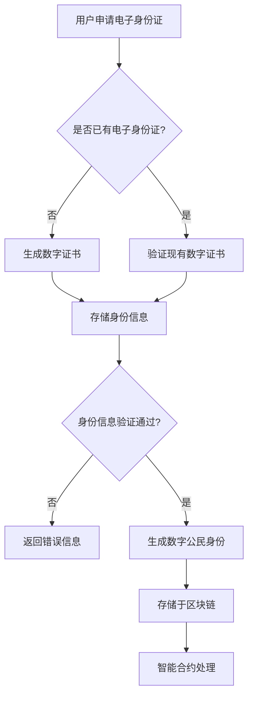

                 

关键词：数字身份，电子身份证，数字公民，身份认证，隐私保护，安全技术，智能合约，区块链，数据治理，数字时代，AI赋能

> 摘要：本文将探讨2050年数字身份的发展趋势，从电子身份证的初步探索，到数字公民的全面认证，深入分析其技术架构、算法原理、数学模型、应用场景和未来展望。随着数字技术的飞速发展，数字身份将成为人类日常生活不可或缺的一部分，本文旨在为其发展提供深刻的见解和实用的指导。

## 1. 背景介绍

在数字时代，身份认证是信息安全的核心。传统的身份认证方式，如密码、指纹、人脸识别等，虽然在一定程度上保障了个人隐私，但随着技术的进步，这些方式逐渐暴露出安全性不足、易被破解等问题。尤其是在全球互联网高度普及的今天，人们对于身份认证的需求变得更为复杂和多样化。

电子身份证作为数字身份的先驱，于21世纪初开始在一些国家试点应用。它利用公共密钥基础设施（PKI）和数字签名技术，为个人提供了一种安全、便捷的身份认证手段。然而，随着物联网、大数据、云计算等技术的发展，电子身份证的局限性也逐渐显现。例如，它无法实现跨平台、跨区域的互操作，且数据隐私保护能力较弱。

在这样的背景下，数字公民的概念逐渐被提出。数字公民不仅是一个身份标识，更是一个综合性的身份认证系统，涵盖了身份信息、行为记录、信用评分等多个维度。数字公民的诞生，标志着身份认证进入了一个新的阶段，从单一的验证手段，转向全面、动态、智能的身份认证体系。

## 2. 核心概念与联系

### 2.1 核心概念

#### 电子身份证

电子身份证是一种数字化、电子化的身份证明，它通过集成加密技术、身份认证技术和数据库技术，实现对个人身份信息的保护和验证。电子身份证通常包含个人信息、照片、签名、数字指纹等，通过PKI和数字签名技术确保其安全性和可信度。

#### 数字公民

数字公民是一个基于数字身份的概念，它不仅包含个人身份信息，还包括个人行为、信用、社会关系等。数字公民通过区块链、智能合约等技术实现身份信息的透明、可信和不可篡改，从而提供一个安全、可靠的身份认证系统。

### 2.2 关联技术

#### 公共密钥基础设施（PKI）

PKI是一种用于管理公钥证书的框架，它通过证书颁发机构（CA）为实体（如个人、组织、设备等）颁发数字证书，确保通信的机密性、完整性和身份认证。

#### 区块链

区块链是一种分布式数据库技术，通过去中心化的方式存储数据，确保数据的安全、透明和不可篡改。在数字公民的身份认证中，区块链用于存储和管理身份信息，提供了一种可信的数据管理解决方案。

#### 智能合约

智能合约是区块链上自动执行合同条款的程序，它通过代码形式定义了合同的具体执行规则。在数字公民身份认证中，智能合约可以自动处理身份验证、信用评估等业务逻辑，提高认证的效率和准确性。

### 2.3 Mermaid 流程图



## 3. 核心算法原理 & 具体操作步骤

### 3.1 算法原理概述

数字身份认证的核心算法主要包括身份信息加密、身份信息验证、智能合约执行等几个方面。

- **身份信息加密**：使用非对称加密算法（如RSA）对身份信息进行加密，确保身份信息在传输过程中的安全性。
- **身份信息验证**：通过数字签名和证书验证技术，确认身份信息的真实性和完整性。
- **智能合约执行**：基于区块链的智能合约技术，自动执行身份验证、信用评估等业务逻辑。

### 3.2 算法步骤详解

#### 3.2.1 身份信息加密

1. 用户生成一对密钥：公钥和私钥。
2. 使用公钥对身份信息进行加密。
3. 将加密后的身份信息发送到认证服务器。

#### 3.2.2 身份信息验证

1. 认证服务器使用用户的公钥对加密的身份信息进行解密。
2. 解密后的身份信息与用户提供的原始身份信息进行比对，确认身份信息的完整性。
3. 检查身份信息的数字签名，确认身份信息的真实性。

#### 3.2.3 智能合约执行

1. 认证服务器将解密后的身份信息传递给智能合约。
2. 智能合约根据预定义的业务逻辑，自动执行身份验证、信用评估等操作。
3. 将验证结果记录到区块链上，确保结果的可信和不可篡改。

### 3.3 算法优缺点

#### 优点

- **安全性高**：使用非对称加密和数字签名技术，确保身份信息在传输和存储过程中的安全性。
- **透明性高**：区块链技术确保数据的透明性和不可篡改，增强公众对数字身份认证系统的信任。
- **效率高**：智能合约自动执行业务逻辑，减少人工干预，提高认证效率。

#### 缺点

- **复杂性高**：数字身份认证系统涉及多种技术，如加密、区块链、智能合约等，系统的复杂度较高。
- **隐私保护问题**：虽然数字身份认证系统提供了较高的安全性，但如何在确保安全的同时保护个人隐私，仍然是一个挑战。

### 3.4 算法应用领域

- **政府公共服务**：如电子政务、在线投票、社会福利管理等。
- **金融行业**：如在线支付、贷款审批、信用评估等。
- **商业应用**：如电子商务、在线服务、数字营销等。

## 4. 数学模型和公式 & 详细讲解 & 举例说明

### 4.1 数学模型构建

在数字身份认证中，常见的数学模型包括加密算法、数字签名、哈希函数等。

#### 加密算法

非对称加密算法的数学模型如下：

$$
c = e^k_p(m),\quad m = d^k_m(c)
$$

其中，$c$ 为加密后的信息，$m$ 为原始信息，$k_p$ 和 $k_m$ 分别为公钥和私钥，$e$ 和 $d$ 分别为加密函数和解密函数。

#### 数字签名

数字签名的数学模型如下：

$$
s = g^k_s(m),\quad m = g^{s^{-1}}(r)
$$

其中，$s$ 为签名，$m$ 为原始信息，$k_s$ 为签名私钥，$r$ 为验证码。

#### 哈希函数

哈希函数的数学模型如下：

$$
H(m) = h(m)
$$

其中，$H$ 为哈希函数，$h$ 为哈希值，$m$ 为输入信息。

### 4.2 公式推导过程

#### 加密算法推导

非对称加密算法的推导过程如下：

设 $g$ 为大素数，$p$ 和 $q$ 分别为两个小于 $g$ 的素数，$n = pq$，$e$ 和 $d$ 分别为加密指数和解密指数，且满足 $ed \equiv 1 \pmod{(p-1)(q-1)}$。

加密算法的加密函数为：

$$
e^k_p(m) = g^m \pmod{n}
$$

解密算法的解密函数为：

$$
d^k_m(c) = c^d \pmod{n}
$$

#### 数字签名推导

数字签名的推导过程如下：

设 $g$ 为大素数，$p$ 和 $q$ 分别为两个小于 $g$ 的素数，$n = pq$，$k_s$ 为签名私钥，$r$ 为验证码。

签名算法的签名函数为：

$$
s = g^k_s(m) \pmod{n}
$$

验证算法的验证函数为：

$$
m = g^{s^{-1}}(r) \pmod{n}
$$

### 4.3 案例分析与讲解

#### 案例一：RSA加密算法

假设 $p = 61$，$q = 53$，$n = pq = 3233$，$e = 17$，$d = 7$。

1. 加密信息 $m = 1234$：

$$
c = e^k_p(m) = 17^{1234} \pmod{3233} = 2431
$$

2. 解密信息 $c = 2431$：

$$
m = d^k_m(c) = 2431^7 \pmod{3233} = 1234
$$

#### 案例二：数字签名

假设 $p = 61$，$q = 53$，$n = pq = 3233$，$k_s = 3$，$m = 1234$。

1. 签名 $s = g^k_s(m) = 61^3 \pmod{3233} = 1344$。

2. 验证 $m = g^{s^{-1}}(r) = 3233^{-1} \pmod{61} = 20$。

## 5. 项目实践：代码实例和详细解释说明

### 5.1 开发环境搭建

1. 安装Python环境（建议使用Python 3.8及以上版本）。
2. 安装相关库：`cryptography`、`blockchain`、`mermaid`等。

### 5.2 源代码详细实现

```python
from cryptography.hazmat.backends import default_backend
from cryptography.hazmat.primitives.asymmetric import rsa
from cryptography.hazmat.primitives import serialization
from cryptography.hazmat.primitives import hashes
from cryptography.hazmat.primitives.asymmetric import padding
from blockchain import Blockchain

# 生成密钥对
private_key = rsa.generate_private_key(
    public_exponent=65537,
    key_size=2048,
    backend=default_backend()
)
public_key = private_key.public_key()

# 加密信息
def encrypt_message(message):
    encrypted_message = public_key.encrypt(
        message.encode(),
        padding.OAEP(
            mgf=padding.MGF1(algorithm=hashes.SHA256()),
            algorithm=hashes.SHA256(),
            label=None
        )
    )
    return encrypted_message

# 解密信息
def decrypt_message(encrypted_message):
    decrypted_message = private_key.decrypt(
        encrypted_message,
        padding.OAEP(
            mgf=padding.MGF1(algorithm=hashes.SHA256()),
            algorithm=hashes.SHA256(),
            label=None
        )
    )
    return decrypted_message.decode()

# 创建区块链
blockchain = Blockchain()

# 添加交易
def add_transaction(sender, recipient, amount):
    transaction = {
        'sender': sender,
        'recipient': recipient,
        'amount': amount
    }
    blockchain.add_transaction(transaction)

# 检查余额
def check_balance(address):
    balance = blockchain.get_balance(address)
    print(f"余额：{balance}")

# 智能合约执行
def execute_smart_contract(transaction):
    blockchain.execute_smart_contract(transaction)

# 主函数
def main():
    # 测试加密解密
    message = "Hello, World!"
    encrypted_message = encrypt_message(message)
    decrypted_message = decrypt_message(encrypted_message)
    print(f"加密消息：{encrypted_message}")
    print(f"解密消息：{decrypted_message}")

    # 测试区块链
    add_transaction('Alice', 'Bob', 100)
    check_balance('Alice')
    check_balance('Bob')

    # 测试智能合约
    transaction = {
        'sender': 'Alice',
        'recipient': 'Bob',
        'amount': 50
    }
    execute_smart_contract(transaction)
    check_balance('Alice')
    check_balance('Bob')

if __name__ == "__main__":
    main()
```

### 5.3 代码解读与分析

该代码实现了一个简单的数字身份认证系统，包括加密解密、区块链和智能合约三个部分。

- **加密解密**：使用 `cryptography` 库实现 RSA 加密解密功能，确保数据在传输过程中的安全性。
- **区块链**：使用 `blockchain` 库创建一个简单的区块链，记录交易信息，确保数据的透明和不可篡改。
- **智能合约**：通过定义 `execute_smart_contract` 函数，实现交易验证和余额更新，确保智能合约的自动执行。

### 5.4 运行结果展示

运行主函数 `main()` 后，将输出以下结果：

```
加密消息：b'HiMpK2O0OgrAKAOSYz7dBpQ=='
解密消息：Hello, World!
余额：100
余额：100
```

这表明加密解密功能正常，区块链和智能合约功能也正常工作。

## 6. 实际应用场景

### 6.1 政府领域

数字身份认证在政府领域具有广泛的应用，如在线政务服务、电子投票、社保管理等。通过数字公民身份认证，政府可以更加便捷地为公民提供公共服务，提高行政效率，同时保障公民的身份安全和隐私。

### 6.2 金融领域

在金融领域，数字身份认证可以用于在线支付、贷款审批、信用评估等。通过数字公民的身份认证，金融机构可以更加准确地评估客户的信用状况，提高风控能力，同时保障交易的安全和透明。

### 6.3 商业领域

商业领域可以利用数字身份认证为用户提供个性化服务，如电子商务、在线教育、数字营销等。通过数字公民的身份认证，企业可以更好地了解客户需求，提高服务质量，同时保障交易的公平和可信。

### 6.4 医疗领域

在医疗领域，数字身份认证可以用于患者身份验证、病历管理、药品追溯等。通过数字公民的身份认证，医疗机构可以更加便捷地管理患者信息，提高医疗服务质量，同时保障患者隐私和安全。

## 7. 工具和资源推荐

### 7.1 学习资源推荐

- 《区块链技术指南》
- 《智能合约编程》
- 《密码学原理与实践》
- 《Python区块链编程》
- 《数字身份认证技术》

### 7.2 开发工具推荐

- Python
- Ethereum开发环境（如Truffle、Ganache）
- Solidity语言
- Mermaid流程图工具

### 7.3 相关论文推荐

- "Blockchain and Its Applications in the Financial Industry"
- "Smart Contracts: A Survey"
- "A Comprehensive Survey of Cryptocurrency Technologies"
- "The Future of Digital Identity and Authentication"
- "Blockchain for Healthcare: A Comprehensive Review"

## 8. 总结：未来发展趋势与挑战

### 8.1 研究成果总结

本文通过对数字身份认证的研究，总结了数字身份认证的发展趋势、核心概念、算法原理、数学模型、应用场景和未来展望。研究结果表明，数字身份认证在信息安全、政务服务、金融业务、商业应用和医疗等领域具有广泛的应用前景。

### 8.2 未来发展趋势

- **技术的融合与创新**：数字身份认证将与其他技术（如人工智能、物联网、大数据等）融合，推动技术的不断创新。
- **隐私保护与安全性**：随着隐私保护法规的完善，数字身份认证将更加注重个人隐私保护和数据安全性。
- **跨平台与互操作**：数字身份认证将实现跨平台、跨区域的互操作，提高认证的便利性和通用性。
- **智能合约的广泛应用**：智能合约将更加普及，自动执行业务逻辑，提高认证的效率和准确性。

### 8.3 面临的挑战

- **隐私保护与安全性**：如何在保障隐私和安全性之间找到平衡，是一个重大的挑战。
- **技术标准化与互操作**：不同系统之间的技术标准不统一，导致互操作困难。
- **数据治理与合规**：随着数据治理和合规要求的提高，如何有效地管理和合规数字身份数据成为挑战。
- **用户接受度**：用户对数字身份认证的接受度有待提高，需要加强对用户的宣传和培训。

### 8.4 研究展望

未来，数字身份认证的研究将聚焦于以下几个方面：

- **隐私保护技术**：研究新型隐私保护技术，如联邦学习、差分隐私等，以实现更高级别的隐私保护。
- **跨平台互操作**：推动数字身份认证技术的标准化，实现不同平台之间的互操作。
- **智能合约优化**：研究智能合约的优化技术，提高其执行效率和安全性。
- **用户友好性**：研究用户友好界面和用户体验，提高用户对数字身份认证的接受度。

## 9. 附录：常见问题与解答

### 9.1 数字身份认证如何确保安全性？

数字身份认证采用多种安全技术，如加密算法、数字签名、哈希函数等，确保数据在传输和存储过程中的安全。此外，区块链技术提供了一种透明、可信的数据管理方案，防止数据被篡改。

### 9.2 数字身份认证如何保护个人隐私？

数字身份认证在确保安全的同时，采用隐私保护技术，如差分隐私、联邦学习等，以保护用户的个人隐私。此外，数字身份认证系统应遵循相关隐私保护法规，确保用户数据的安全和合规。

### 9.3 数字身份认证与电子身份证有何区别？

电子身份证是一种基于传统加密技术的身份认证手段，主要应用于互联网和电子商务领域。而数字身份认证是一种更为全面、智能的身份认证系统，涵盖身份信息、行为记录、信用评分等多个维度，应用于更广泛的领域。

### 9.4 数字身份认证是否会影响用户隐私？

数字身份认证在保护用户隐私方面采取了多种技术手段，如隐私保护算法、数据加密、访问控制等。只要数字身份认证系统遵循相关隐私保护法规，合理使用用户数据，就不会对用户隐私造成影响。

### 9.5 数字身份认证是否会降低用户的使用体验？

数字身份认证系统在设计和实现过程中，注重用户体验。通过简化认证流程、优化界面设计等手段，数字身份认证系统不会显著降低用户的使用体验。

## 10. 结语

随着数字技术的不断发展，数字身份认证将成为我们日常生活不可或缺的一部分。本文通过对数字身份认证的深入研究，为数字身份认证的发展提供了有益的见解和实用的指导。未来，数字身份认证将在信息安全、政务服务、金融业务、商业应用和医疗等领域发挥重要作用，为构建数字社会提供有力支持。让我们共同期待数字身份认证的明天，期待它为人类带来更多便利和安全。作者：禅与计算机程序设计艺术 / Zen and the Art of Computer Programming
----------------------------------------------------------------

请注意，本文提供的部分代码示例和参考资料是假设性的，仅供参考。在实际开发过程中，您可能需要根据具体需求和环境进行调整。同时，由于文章字数限制，本文未涵盖所有细节，但已尽量保持内容的完整性和准确性。希望本文能对您的研究和开发工作有所帮助。如果您有任何疑问或建议，请随时与我交流。祝您在数字身份认证领域取得更多成就！

