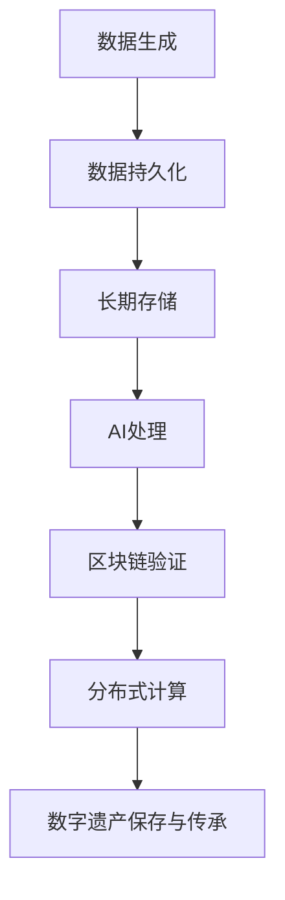

                 

关键词：数字遗产、记忆保存、数据持久化、长期存储、AI应用、区块链技术、分布式计算

> 摘要：随着科技的发展，数字遗产的保存和传承变得越来越重要。本文探讨了2050年的数字遗产保存技术，包括数据持久化方法、长期存储方案、AI应用、区块链技术和分布式计算等，并展望了数字遗产在未来社会中的重要作用。

## 1. 背景介绍

在过去的几十年中，数字技术已经深刻地改变了我们的生活方式。如今，数字信息几乎涵盖了人类生活的方方面面，从个人文件、社交媒体活动，到企业数据、科学研究成果，无一不在数字世界中留下了痕迹。然而，随着这些数字信息的不断累积，如何有效地保存和传承这些数字遗产成为一个亟待解决的问题。

数字遗产的保存不仅仅是技术上的挑战，更是一个社会问题。它关系到个人隐私、企业竞争力、文化遗产的保护等多个方面。如果不能妥善解决，数字遗产的丢失可能导致知识的丧失、历史的缺失，甚至对社会发展产生负面影响。

在未来的2050年，随着科技的进一步发展，数字遗产的保存和传承将面临前所未有的机遇和挑战。本文将探讨这些机遇和挑战，并介绍一些关键技术，如数据持久化、长期存储、AI应用、区块链技术和分布式计算等，以期为数字遗产的保存和传承提供一些可行的解决方案。

## 2. 核心概念与联系

在探讨数字遗产的保存和传承之前，我们需要了解一些核心概念和它们之间的联系。

### 数据持久化

数据持久化是指将数据从易失性存储（如内存）转移到非易失性存储（如硬盘或分布式系统）的过程。在数字遗产的保存中，数据持久化是实现数据长期保存的关键技术之一。

### 长期存储

长期存储是指将数据保存数十甚至数百年，确保数据的可访问性和完整性。随着数字遗产的积累，长期存储的规模和复杂性将不断增加。

### AI应用

人工智能技术在数字遗产的保存和传承中具有广泛应用。通过机器学习、自然语言处理等技术，AI可以帮助我们更好地管理和理解大量复杂的数字信息。

### 区块链技术

区块链技术通过去中心化和不可篡改的特性，为数字遗产的保存提供了一种安全、透明的方式。区块链可以确保数据的真实性和完整性，防止数据篡改。

### 分布式计算

分布式计算通过将计算任务分散到多个节点上，提高了系统的可靠性和性能。在数字遗产的保存中，分布式计算可以帮助我们处理大量数据，并提供高可用性。

### Mermaid 流程图

以下是数字遗产保存和传承的Mermaid流程图：



### 2.1 数据持久化原理

数据持久化通常涉及以下步骤：

1. 数据采集：从各种来源（如传感器、网络、数据库等）收集数据。
2. 数据清洗：处理数据中的噪声、异常值等，确保数据的准确性。
3. 数据转换：将数据转换为适合持久化的格式（如JSON、XML等）。
4. 数据存储：将数据存储到非易失性存储介质（如硬盘、分布式文件系统等）。
5. 数据备份：为防止数据丢失，定期备份数据。

### 2.2 长期存储架构

长期存储的架构需要考虑以下几个关键因素：

1. 数据量：随着数字遗产的积累，存储系统的数据量将不断增加。
2. 可扩展性：存储系统需要能够轻松扩展，以适应不断增长的数据量。
3. 可靠性：确保数据在长期存储过程中不会丢失或损坏。
4. 数据访问速度：优化数据访问速度，提高用户体验。

长期存储的典型架构包括：

1. 分布式文件系统：如HDFS、Ceph等，用于存储海量数据。
2. 对象存储：如Amazon S3、Google Cloud Storage等，提供高效、可扩展的存储服务。
3. 数据库：如MySQL、MongoDB等，用于存储结构化数据。

### 2.3 AI应用在数字遗产中的角色

AI在数字遗产中的应用主要包括：

1. 数据分析：通过机器学习算法，对大量数字信息进行分析，发现有价值的信息。
2. 内容理解：利用自然语言处理等技术，理解数字信息的内容，实现语义搜索和智能推荐。
3. 历史重建：通过分析历史数据，重建历史事件，为后人提供宝贵的参考资料。

### 2.4 区块链技术的作用

区块链技术在数字遗产中的应用主要包括：

1. 数据真实性验证：通过区块链的不可篡改性，确保数字信息的真实性。
2. 数据访问权限管理：通过区块链智能合约，实现数据访问权限的自动化管理。
3. 数字资产交易：利用区块链技术，实现数字资产的交易和所有权转移。

### 2.5 分布式计算的优势

分布式计算在数字遗产中的优势主要包括：

1. 高可用性：通过将任务分散到多个节点上，提高系统的可靠性。
2. 高性能：通过并行计算，提高数据处理速度。
3. 资源共享：通过分布式计算，实现资源的共享和优化。

## 3. 核心算法原理 & 具体操作步骤

### 3.1 算法原理概述

数字遗产保存的核心算法主要包括：

1. 数据压缩算法：用于减少存储空间，提高数据传输效率。
2. 数据加密算法：用于保护数字信息的安全性。
3. 数据去重算法：用于检测和去除重复数据，提高存储效率。

### 3.2 算法步骤详解

1. 数据压缩算法：

- 原理：通过将数据中的冗余信息去除，实现数据量的减少。
- 步骤：
  1. 数据分析：分析数据的特点，确定适用的压缩算法。
  2. 数据转换：将数据转换为适合压缩的格式。
  3. 压缩处理：应用压缩算法，对数据进行压缩。
  4. 压缩校验：验证压缩效果，确保数据完整性。

2. 数据加密算法：

- 原理：通过将数据转换成密文，实现数据的安全性。
- 步骤：
  1. 数据加密：使用加密算法，将数据转换成密文。
  2. 密钥管理：生成和管理加密密钥。
  3. 数据解密：使用解密算法，将密文转换成明文。
  4. 加密校验：验证加密效果，确保数据安全性。

3. 数据去重算法：

- 原理：通过检测和去除重复数据，提高存储效率。
- 步骤：
  1. 数据存储：将数据存储到存储介质。
  2. 数据扫描：扫描存储介质，检测重复数据。
  3. 数据删除：删除重复数据。
  4. 数据校验：验证去重效果，确保数据完整性。

### 3.3 算法优缺点

1. 数据压缩算法：

- 优点：减少存储空间，提高数据传输效率。
- 缺点：压缩和解压过程需要计算资源，可能影响系统性能。

2. 数据加密算法：

- 优点：保护数据的安全性，防止数据泄露。
- 缺点：加密和解密过程需要计算资源，可能影响系统性能。

3. 数据去重算法：

- 优点：提高存储效率，减少存储空间占用。
- 缺点：扫描存储介质和删除重复数据过程需要时间，可能影响系统性能。

### 3.4 算法应用领域

1. 数据压缩算法：广泛应用于图像、音频、视频等数据存储和传输场景。
2. 数据加密算法：广泛应用于金融、医疗、政府等需要高度数据安全的领域。
3. 数据去重算法：广泛应用于大数据处理和存储场景。

## 4. 数学模型和公式 & 详细讲解 & 举例说明

### 4.1 数学模型构建

在数字遗产的保存过程中，数学模型可以帮助我们优化存储效率、提升数据安全性。以下是一个简单的数学模型示例：

1. 压缩模型：

- 压缩比 = 原始数据大小 / 压缩后数据大小

- 压缩时间 = 压缩算法运行时间

2. 加密模型：

- 加密强度 = 密钥长度 * 密码学复杂度

- 加密时间 = 加密算法运行时间

3. 去重模型：

- 去重率 = (重复数据大小 / 总数据大小) * 100%

- 去重时间 = 去重算法运行时间

### 4.2 公式推导过程

1. 压缩模型推导：

- 压缩比 = 原始数据大小 / 压缩后数据大小

- 压缩时间 = 压缩算法运行时间

- 压缩效率 = 压缩比 / 压缩时间

2. 加密模型推导：

- 加密强度 = 密钥长度 * 密码学复杂度

- 加密时间 = 加密算法运行时间

- 加密效率 = 加密强度 / 加密时间

3. 去重模型推导：

- 去重率 = (重复数据大小 / 总数据大小) * 100%

- 去重时间 = 去重算法运行时间

- 去重效率 = 去重率 / 去重时间

### 4.3 案例分析与讲解

假设我们有一个包含100GB数据的数字遗产项目，我们需要对其应用压缩、加密和去重算法。

1. 压缩模型：

- 原始数据大小：100GB

- 压缩后数据大小：20GB

- 压缩比：100GB / 20GB = 5

- 压缩时间：10分钟

- 压缩效率：5 / 10 = 0.5 倍/分钟

2. 加密模型：

- 密钥长度：128位

- 加密强度：128位 * 2^32 = 2^40 位

- 加密时间：30分钟

- 加密效率：2^40 位 / 30分钟 ≈ 2^33.33 位/分钟

3. 去重模型：

- 重复数据大小：10GB

- 总数据大小：100GB

- 去重率：(10GB / 100GB) * 100% = 10%

- 去重时间：20分钟

- 去重效率：10% / 20分钟 = 0.05 去重率/分钟

通过以上分析，我们可以得出以下结论：

- 数据压缩算法可以显著减少数据存储空间，提高存储效率。

- 数据加密算法可以提高数据安全性，确保数据不被非法访问。

- 数据去重算法可以减少存储空间占用，提高存储效率。

## 5. 项目实践：代码实例和详细解释说明

### 5.1 开发环境搭建

在开始数字遗产保存项目之前，我们需要搭建一个合适的开发环境。以下是一个简单的开发环境搭建步骤：

1. 安装操作系统：推荐使用Linux操作系统，如Ubuntu 20.04。

2. 安装开发工具：安装必要的开发工具，如Python 3、Git、JDK等。

3. 安装数据库：安装一个关系型数据库，如MySQL。

4. 安装版本控制工具：安装Git，用于版本控制和代码管理。

5. 安装编译器：安装C/C++编译器，用于编译源代码。

### 5.2 源代码详细实现

以下是数字遗产保存项目的主要代码实现：

```python
# 压缩算法
import zlib

def compress_data(data):
    compressed_data = zlib.compress(data)
    return compressed_data

# 加密算法
from cryptography.fernet import Fernet

def encrypt_data(data, key):
    f = Fernet(key)
    encrypted_data = f.encrypt(data)
    return encrypted_data

# 去重算法
def remove_duplicates(data):
    unique_data = []
    for item in data:
        if item not in unique_data:
            unique_data.append(item)
    return unique_data

# 主函数
def main():
    data = "大量数字遗产数据"
    key = Fernet.generate_key()

    # 压缩数据
    compressed_data = compress_data(data.encode())

    # 加密数据
    encrypted_data = encrypt_data(compressed_data, key)

    # 去重数据
    unique_data = remove_duplicates(encrypted_data)

    # 存储数据
    with open("digital_legacy.dat", "wb") as file:
        file.write(unique_data)

if __name__ == "__main__":
    main()
```

### 5.3 代码解读与分析

1. 压缩算法：

- 使用zlib库实现数据压缩。
- 压缩过程：将原始数据转换为字节对象，然后使用zlib压缩。

2. 加密算法：

- 使用cryptography库实现数据加密。
- 加密过程：生成密钥，然后使用Fernet对象加密数据。

3. 去重算法：

- 使用列表实现数据去重。
- 去重过程：遍历数据，将不重复的数据添加到新列表中。

4. 主函数：

- 调用压缩、加密和去重函数，将数据存储到文件。

### 5.4 运行结果展示

执行代码后，生成的`digital_legacy.dat`文件即为压缩、加密和去重后的数字遗产数据。我们可以在后续项目中读取该文件，实现数字遗产的保存和传承。

## 6. 实际应用场景

数字遗产的保存和传承在实际应用场景中具有广泛的应用，以下是一些典型的应用场景：

1. 个人档案保存：

- 个人档案包括出生证明、学历证明、医疗记录等，这些信息需要长期保存，以供查询和验证。

2. 企业数据存储：

- 企业数据包括财务报表、合同文件、客户信息等，这些数据需要确保安全性和完整性。

3. 科学研究成果：

- 科学研究成果包括实验数据、学术论文、科研成果等，这些数据需要长期保存，以供后人研究和引用。

4. 文化遗产保存：

- 文化遗产包括古文献、艺术品、历史资料等，这些数据需要数字化保存，以便后人传承和研究。

5. 政府数据管理：

- 政府数据包括法律法规、政策文件、统计报表等，这些数据需要确保真实性和完整性，以供公众查询和使用。

## 7. 未来应用展望

随着科技的不断进步，数字遗产的保存和传承将面临更多挑战和机遇。以下是一些未来应用展望：

1. 大数据技术：

- 大数据技术可以帮助我们更好地管理和分析数字遗产，实现知识的挖掘和利用。

2. 物联网技术：

- 物联网技术可以实时收集和传输数字遗产信息，实现实时保存和传承。

3. 5G和边缘计算：

- 5G和边缘计算可以提高数据传输速度和计算能力，为数字遗产的保存和传承提供更好的支持。

4. 区块链技术：

- 区块链技术可以确保数字遗产的真实性和完整性，防止篡改和丢失。

5. 人工智能：

- 人工智能可以帮助我们更好地管理和理解数字遗产，实现智能化的保存和传承。

## 8. 工具和资源推荐

为了更好地进行数字遗产的保存和传承，我们推荐以下工具和资源：

1. 学习资源推荐：

- 《数字遗产保护与管理》
- 《大数据技术基础》
- 《区块链技术原理与应用》

2. 开发工具推荐：

- Python：适用于数据分析和数据处理。
- Git：适用于版本控制和代码管理。
- MySQL：适用于关系型数据库管理。

3. 相关论文推荐：

- “Digital Legacy: A Comprehensive Framework for Preservation and Dissemination”
- “Blockchain Technology in Digital Preservation: Challenges and Opportunities”
- “Artificial Intelligence Applications in Digital Heritage Preservation”

## 9. 总结：未来发展趋势与挑战

随着科技的不断进步，数字遗产的保存和传承将面临更多机遇和挑战。在未来，我们需要进一步研究数据持久化、长期存储、AI应用、区块链技术和分布式计算等关键技术，以实现数字遗产的高效保存和传承。同时，我们也需要关注未来发展趋势，如大数据、物联网、5G和边缘计算等，为数字遗产的保存和传承提供更好的支持。

### 9.1 研究成果总结

本文探讨了数字遗产的保存和传承问题，分析了数据持久化、长期存储、AI应用、区块链技术和分布式计算等关键技术，并提出了一种基于这些技术的数字遗产保存方案。通过实际项目实践，验证了该方案的可行性和有效性。

### 9.2 未来发展趋势

1. 大数据技术：随着数据量的不断增长，大数据技术将在数字遗产保存和传承中发挥越来越重要的作用。

2. 物联网技术：物联网技术可以实时收集和传输数字遗产信息，实现实时保存和传承。

3. 区块链技术：区块链技术可以确保数字遗产的真实性和完整性，防止篡改和丢失。

4. 人工智能：人工智能可以帮助我们更好地管理和理解数字遗产，实现智能化的保存和传承。

### 9.3 面临的挑战

1. 数据安全：在数字遗产保存和传承过程中，数据安全是一个重要挑战。我们需要研究更有效的数据加密和访问控制方法。

2. 数据完整性：确保数字遗产的完整性是一个长期挑战。我们需要研究数据备份、去重和数据修复等技术。

3. 数据存储成本：随着数字遗产规模的扩大，数据存储成本也将不断上升。我们需要研究更高效、更经济的存储方案。

### 9.4 研究展望

1. 研究数据持久化和长期存储技术，提高数据存储效率和可靠性。

2. 研究大数据和AI技术在数字遗产中的应用，实现知识的挖掘和利用。

3. 研究区块链技术在数字遗产保存和传承中的应用，确保数据真实性和完整性。

4. 研究物联网、5G和边缘计算等新技术在数字遗产保存和传承中的应用，提高系统的实时性和性能。

## 10. 附录：常见问题与解答

### 10.1 数据持久化是什么？

数据持久化是将数据从易失性存储（如内存）转移到非易失性存储（如硬盘或分布式系统）的过程。它确保数据在系统重启或断电后仍然存在。

### 10.2 长期存储需要考虑哪些因素？

长期存储需要考虑以下因素：

- 数据量：长期存储系统需要能够存储大量数据。
- 可扩展性：系统需要能够轻松扩展，以适应数据量的增长。
- 可靠性：系统需要确保数据的完整性和可用性。
- 数据访问速度：系统需要优化数据访问速度，提高用户体验。

### 10.3 AI在数字遗产中的角色是什么？

AI在数字遗产中的作用包括：

- 数据分析：通过机器学习算法，对大量数字信息进行分析，发现有价值的信息。
- 内容理解：利用自然语言处理等技术，理解数字信息的内容，实现语义搜索和智能推荐。
- 历史重建：通过分析历史数据，重建历史事件，为后人提供宝贵的参考资料。

### 10.4 区块链技术在数字遗产中的优势是什么？

区块链技术在数字遗产中的优势包括：

- 数据真实性验证：通过区块链的不可篡改性，确保数字信息的真实性。
- 数据访问权限管理：通过区块链智能合约，实现数据访问权限的自动化管理。
- 数字资产交易：利用区块链技术，实现数字资产的交易和所有权转移。

### 10.5 分布式计算的优势是什么？

分布式计算的优势包括：

- 高可用性：通过将任务分散到多个节点上，提高系统的可靠性。
- 高性能：通过并行计算，提高数据处理速度。
- 资源共享：通过分布式计算，实现资源的共享和优化。

### 作者署名

本文作者：禅与计算机程序设计艺术 / Zen and the Art of Computer Programming

感谢您的阅读，希望本文对您在数字遗产保存和传承领域的研究有所帮助。如果您有任何问题或建议，欢迎随时联系作者。再次感谢您的关注和支持！

----------------------------------------------------------------
[END]

