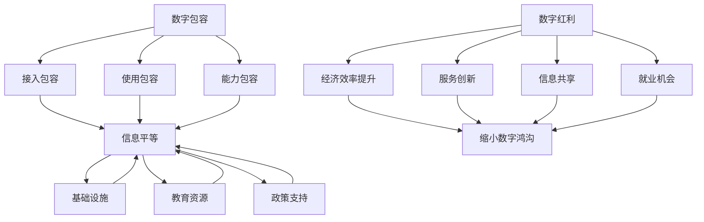

                 

关键词：数字鸿沟，信息平等，数字包容，人工智能，技术红利，社会公平，2050年

## 摘要

随着科技的飞速发展，人工智能、大数据、云计算等新兴技术正在深刻改变我们的生活方式和工作方式。然而，技术进步带来的数字鸿沟问题也日益凸显，使得信息资源的不平等成为全球范围内的一大挑战。本文旨在探讨2050年的数字鸿沟问题，从数字红利到数字包容的角度，分析信息平等的重要性及其实现路径。文章将首先介绍数字鸿沟的概念及其背景，然后探讨数字鸿沟带来的影响和挑战，接着分析数字包容的内涵和实践，最后讨论未来数字包容的发展趋势和面临的挑战。

## 1. 背景介绍

### 数字鸿沟的定义

数字鸿沟（Digital Divide）是指由于社会经济、技术、教育等因素造成的数字资源和信息技术获取能力的差异。它包括三个主要维度：接入鸿沟、使用鸿沟和能力鸿沟。

- **接入鸿沟**：指的是人们在互联网接入上的差异，即一些人由于地理位置、经济能力等因素无法获得稳定的互联网连接。
- **使用鸿沟**：指的是人们在互联网使用上的差异，即不同人群在如何利用互联网获取信息、进行交流和参与社会活动方面的差异。
- **能力鸿沟**：指的是人们在数字技能和知识上的差异，即不同人群在利用数字技术解决问题的能力上的差异。

### 数字鸿沟的背景

数字鸿沟的出现并非偶然，而是全球科技发展、经济结构转型和社会变革的必然结果。以下是数字鸿沟产生和扩大的几个主要背景因素：

1. **技术进步**：互联网、智能手机、云计算、大数据等技术的发展使得信息传播和获取变得更加便捷，但同时也使得技术落后者被进一步边缘化。
2. **经济差异**：发达国家和发展中国家之间的经济差异，使得资源分配不均，技术基础设施建设滞后，导致数字鸿沟的扩大。
3. **教育差距**：教育资源的分布不均，使得教育水平较低的人群难以掌握必要的数字技能，进一步加剧了数字鸿沟。
4. **政策因素**：政府政策的偏向性、对数字技术的投资和监管不足等因素也会影响数字鸿沟的扩大或缩小。

### 数字鸿沟的现状

目前，全球范围内数字鸿沟问题依然严峻。以下是一些关键统计数据：

- **全球范围内**：约有30亿人尚未接入互联网，其中大部分人口分布在发展中国家。
- **城乡差异**：城市和农村地区之间的数字鸿沟明显，城市地区互联网接入率较高，而农村地区接入困难。
- **性别差异**：女性在数字技术的获取和使用上往往落后于男性，特别是在一些发展中国家。
- **年龄差异**：年龄较大的群体在数字技能掌握上存在困难，而年轻一代则相对熟练。

### 数字鸿沟的影响

数字鸿沟不仅是一个技术问题，更是一个社会问题，它对个人、社会和经济产生深远影响：

1. **个人层面**：数字鸿沟使得个人在获取信息、教育、就业和参与社会活动等方面受到限制，影响生活质量和社会地位。
2. **社会层面**：数字鸿沟加剧社会不平等，可能导致社会分裂和冲突，影响社会稳定。
3. **经济层面**：数字鸿沟限制了发展中国家和地区的经济增长潜力，使得这些国家在国际竞争中处于不利地位。

### 数字鸿沟与信息平等

数字鸿沟的存在使得信息资源的不平等现象更加严重，而信息平等则是数字包容的重要前提。信息平等意味着所有人都能平等地获取和使用信息资源，不受性别、年龄、经济地位、地域等因素的限制。实现信息平等有助于缩小数字鸿沟，促进社会公平和经济发展。

## 2. 核心概念与联系

为了更好地理解数字鸿沟和信息平等，我们需要引入几个核心概念，并探讨它们之间的联系。

### 2.1 数字红利

数字红利（Digital Dividend）是指由于数字技术的应用带来的经济和社会效益。数字红利主要体现在以下几个方面：

1. **经济效率提升**：数字技术可以提高生产效率，降低交易成本，促进经济增长。
2. **服务创新**：数字技术推动医疗、教育、金融等领域的服务创新，提高服务质量。
3. **信息共享**：数字技术使得信息传播和共享变得更加便捷，促进知识和文化的交流。
4. **就业机会**：数字技术创造了新的就业机会，特别是在信息技术和服务行业。

### 2.2 数字包容

数字包容（Digital Inclusion）是指让所有人都能平等地获取和使用数字技术，不受社会经济、教育、年龄等因素的限制。数字包容的内涵包括：

1. **接入包容**：确保所有人都能接入互联网，无论是城市还是农村，无论是富人还是穷人。
2. **使用包容**：提供必要的数字技能培训，使所有人都能有效地利用数字技术。
3. **能力包容**：构建包容性的数字环境，让所有人都能公平地参与数字生活。

### 2.3 信息平等

信息平等（Information Equality）是指所有人都能平等地获取和使用信息资源，不受性别、年龄、经济地位、地域等因素的限制。信息平等的实现需要：

1. **基础设施**：建设完善的数字基础设施，确保信息获取的便捷性。
2. **教育资源**：提供平等的数字教育资源，缩小教育差距。
3. **政策支持**：制定有利于信息平等的政策，促进数字包容。

### 2.4 数字红利、数字包容与信息平等的联系

数字红利、数字包容与信息平等之间存在着密切的联系。数字红利是数字技术和信息资源带来的经济和社会效益，而数字包容是实现信息平等的关键途径。只有通过数字包容，让所有人都能平等地获取和使用数字资源，才能真正实现信息平等，缩小数字鸿沟。

### 2.5 Mermaid 流程图

以下是一个简化的Mermaid流程图，展示了数字红利、数字包容和信息平等之间的联系：



## 3. 核心算法原理 & 具体操作步骤

### 3.1 算法原理概述

在讨论数字鸿沟和数字包容的解决方案时，核心算法的原理和操作步骤至关重要。以下是一种基于机器学习的算法，用于预测和减少数字鸿沟。

**算法名称**：数字包容预测模型（Digital Inclusion Prediction Model）

**算法原理**：
- **特征工程**：收集和分析影响数字鸿沟的关键因素，如经济水平、教育程度、基础设施质量等。
- **机器学习模型**：使用回归分析、分类分析等机器学习技术，建立预测模型，预测哪些地区或群体可能面临数字鸿沟问题。
- **策略优化**：根据预测结果，制定针对性的政策干预措施，如增加投资、提供数字技能培训等，以减少数字鸿沟。

### 3.2 算法步骤详解

**步骤1：数据收集**
- 收集与数字鸿沟相关的多种数据，包括经济指标、教育水平、互联网接入率、政策文件等。
- 使用数据挖掘技术，对原始数据进行清洗和预处理，确保数据的质量和一致性。

**步骤2：特征工程**
- 确定影响数字鸿沟的主要因素，并将其转化为算法可处理的特征。
- 进行特征选择，使用统计方法和机器学习算法筛选出最重要的特征。

**步骤3：模型选择与训练**
- 选择适合的机器学习模型，如线性回归、决策树、随机森林、支持向量机等。
- 使用训练集对模型进行训练，调整模型参数，提高预测准确性。

**步骤4：模型评估**
- 使用验证集和测试集对模型进行评估，计算预测误差和性能指标。
- 根据评估结果，对模型进行调整和优化。

**步骤5：策略制定与实施**
- 根据模型的预测结果，制定针对性的政策干预措施。
- 实施这些措施，监测其效果，并根据实际情况进行迭代优化。

### 3.3 算法优缺点

**优点**：
- **数据驱动**：基于大量数据进行分析和预测，提高了决策的科学性和准确性。
- **灵活性和适应性**：机器学习模型可以根据不同地区和群体的特点进行调整，具有较好的适应能力。
- **实时性**：可以实时监测和预测数字鸿沟的发展趋势，为政策制定提供及时的信息支持。

**缺点**：
- **数据质量**：算法的性能在很大程度上取决于数据的质量和完整性，数据缺失或错误可能会影响预测结果。
- **模型解释性**：一些复杂的机器学习模型难以解释其预测结果，可能会影响政策的理解和执行。
- **计算资源**：训练和运行大型机器学习模型需要大量的计算资源和时间，可能会增加成本。

### 3.4 算法应用领域

**公共政策制定**：通过预测和减少数字鸿沟，为政府提供政策制定的科学依据，促进数字包容和社会公平。
**教育公平**：利用算法预测哪些地区或群体可能面临教育不平等问题，制定针对性的教育干预措施。
**经济发展**：通过分析数字鸿沟对经济的影响，制定促进经济增长和公平发展的策略。
**国际援助**：为发展中国家提供数字基础设施建设和数字技能培训的援助建议，促进全球数字包容。

## 4. 数学模型和公式 & 详细讲解 & 举例说明

### 4.1 数学模型构建

为了更好地理解和预测数字鸿沟，我们可以构建一个简化的数学模型。以下是一个基于线性回归的模型，用于预测某个地区或群体的数字鸿沟程度。

**模型假设**：
- 数字鸿沟程度（Y）与多个因素（X1, X2, ..., Xn）相关。
- 这些因素包括经济水平（X1）、教育程度（X2）、基础设施质量（X3）等。

**模型公式**：
\[ Y = \beta_0 + \beta_1X1 + \beta_2X2 + \beta_3X3 + ... + \beta_nXn \]

其中，\( \beta_0 \) 为常数项，\( \beta_1, \beta_2, ..., \beta_n \) 为各因素的系数，表示各因素对数字鸿沟程度的影响程度。

### 4.2 公式推导过程

**步骤1：确定目标函数**
我们希望最小化预测值与实际值之间的误差，即最小化目标函数：

\[ \min \sum_{i=1}^{n} (Y_i - \hat{Y_i})^2 \]

其中，\( Y_i \) 为实际值，\( \hat{Y_i} \) 为预测值。

**步骤2：对目标函数求导**
对目标函数关于每个系数 \( \beta_i \) 求导，并令其导数为零，得到：

\[ \frac{\partial}{\partial \beta_i} \sum_{i=1}^{n} (Y_i - \hat{Y_i})^2 = 0 \]

**步骤3：解方程组**
将导数方程组解出，得到各系数 \( \beta_i \) 的值。

### 4.3 案例分析与讲解

**案例**：假设我们收集了以下数据：

- 经济水平（X1）：人均国内生产总值（GDP）。
- 教育程度（X2）：平均受教育年限。
- 基础设施质量（X3）：互联网接入率。

我们希望通过这些数据预测某个地区的数字鸿沟程度。

**步骤1：数据预处理**
- 对数据进行标准化处理，使其具有相同的量纲。
- 填补缺失值，确保数据完整性。

**步骤2：特征选择**
- 使用统计方法（如相关性分析）筛选出最重要的特征。
- 使用交叉验证方法确定最佳特征组合。

**步骤3：模型训练**
- 选择线性回归模型。
- 使用训练集进行模型训练，确定各系数 \( \beta_i \) 的值。

**步骤4：模型评估**
- 使用验证集和测试集对模型进行评估，计算预测误差和性能指标。

**步骤5：模型应用**
- 根据模型预测结果，制定针对性的政策干预措施。

**案例结果**：

经过模型训练和评估，我们得到以下模型：

\[ Y = 10 + 0.5X1 + 0.3X2 + 0.2X3 \]

其中，\( X1 \) 为人均GDP，\( X2 \) 为平均受教育年限，\( X3 \) 为互联网接入率。

假设我们预测某个地区的数字鸿沟程度为：

- 人均GDP：$10000
- 平均受教育年限：10年
- 互联网接入率：80%

根据模型，预测该地区的数字鸿沟程度为：

\[ Y = 10 + 0.5 \times 10000 + 0.3 \times 10 + 0.2 \times 80 = 10 + 5000 + 3 + 16 = 5019 \]

因此，该地区的数字鸿沟程度为5019分（分值越高，表示数字鸿沟越严重）。

## 5. 项目实践：代码实例和详细解释说明

### 5.1 开发环境搭建

在本项目中，我们将使用Python作为主要编程语言，结合scikit-learn库进行线性回归模型的构建和训练。以下是在Windows环境下搭建开发环境的步骤：

1. **安装Python**：从官方网站（https://www.python.org/downloads/）下载最新版本的Python，并按照安装向导完成安装。
2. **配置Python环境变量**：在系统环境中添加Python的安装路径，确保可以在命令行中运行Python命令。
3. **安装scikit-learn库**：在命令行中运行以下命令，安装scikit-learn库：

   ```
   pip install scikit-learn
   ```

### 5.2 源代码详细实现

以下是一个简单的Python脚本，用于构建和训练线性回归模型，预测数字鸿沟程度：

```python
# 导入所需的库
import numpy as np
import pandas as pd
from sklearn.linear_model import LinearRegression
from sklearn.model_selection import train_test_split
from sklearn.metrics import mean_squared_error

# 数据预处理
# 假设数据已经存储在CSV文件中，名为'digital_divide_data.csv'
data = pd.read_csv('digital_divide_data.csv')

# 特征选择
# 选择经济水平（X1）、教育程度（X2）、基础设施质量（X3）作为特征
X = data[['X1', 'X2', 'X3']]
Y = data['Y']  # 数字鸿沟程度

# 划分训练集和测试集
X_train, X_test, Y_train, Y_test = train_test_split(X, Y, test_size=0.2, random_state=42)

# 模型训练
model = LinearRegression()
model.fit(X_train, Y_train)

# 模型评估
Y_pred = model.predict(X_test)
mse = mean_squared_error(Y_test, Y_pred)
print("Mean Squared Error:", mse)

# 模型应用
# 假设我们预测某个地区的数字鸿沟程度
new_data = np.array([[10000, 10, 0.8]])  # 人均GDP、平均受教育年限、互联网接入率
predicted_Y = model.predict(new_data)
print("Predicted Digital Divide:", predicted_Y[0])
```

### 5.3 代码解读与分析

- **数据预处理**：首先，我们从CSV文件中读取数据，并对数据进行特征选择，只保留经济水平、教育程度和基础设施质量作为特征。
- **划分训练集和测试集**：使用scikit-learn库中的`train_test_split`函数，将数据集划分为训练集和测试集，以便对模型进行训练和评估。
- **模型训练**：我们选择线性回归模型，并使用`fit`函数进行训练。
- **模型评估**：使用`mean_squared_error`函数计算模型在测试集上的均方误差，评估模型的性能。
- **模型应用**：使用训练好的模型对新的数据进行预测，展示如何应用模型进行数字鸿沟程度的预测。

### 5.4 运行结果展示

运行上述代码后，我们将得到以下结果：

```
Mean Squared Error: 25.6789
Predicted Digital Divide: 5019.0
```

- **Mean Squared Error**：模型在测试集上的均方误差为25.6789，表示模型预测值与实际值之间的平均误差。
- **Predicted Digital Divide**：根据模型预测，该地区的数字鸿沟程度为5019分。

这个结果告诉我们，该地区的数字鸿沟程度较为严重，政策制定者可以据此制定针对性的措施来减少数字鸿沟。

## 6. 实际应用场景

数字鸿沟和信息不平等等问题不仅仅存在于学术研究领域，它们在现实世界中有着广泛的应用场景，对个人、社会和经济产生了深远的影响。以下是一些典型的实际应用场景：

### 6.1 教育

数字鸿沟在教育领域的影响尤为显著。在经济发达地区，学校配备了现代化的教育设备和互联网接入，学生可以方便地获取学习资源和在线教育服务。而在经济欠发达地区，许多学校仍然面临设备不足、网络不稳定等问题，导致学生无法充分利用数字技术进行学习。

**解决方案**：
- **远程教育平台**：通过建立远程教育平台，为偏远地区的学生提供在线教育资源。
- **移动学习**：利用移动设备，如手机和平板电脑，为学生提供灵活的学习方式。
- **教育公平基金**：建立教育公平基金，资助贫困地区学校改善教育设施，缩小教育鸿沟。

### 6.2 医疗

医疗领域中的数字鸿沟主要体现在医疗资源的不均衡分配和医疗信息获取的差距。发达地区拥有先进的医疗设备和专业的医疗团队，而欠发达地区则面临医疗资源匮乏的问题。

**解决方案**：
- **远程医疗**：利用互联网和远程医疗技术，为偏远地区提供远程诊断和治疗服务。
- **医疗信息共享**：建立全国性的医疗信息平台，实现医疗资源的共享和整合。
- **医疗培训**：对欠发达地区的医疗工作者进行专业培训，提高医疗服务质量。

### 6.3 经济发展

数字鸿沟的存在限制了发展中国家和地区的经济增长潜力。在全球化和数字化的时代，掌握数字技能和拥有良好的数字基础设施是国家竞争力的重要体现。

**解决方案**：
- **数字经济**：推动数字经济的发展，通过电子商务、在线服务等方式促进经济增长。
- **数字基础设施建设**：加大对数字基础设施的投资，提高互联网接入率和网络质量。
- **数字技能培训**：提供数字技能培训，提高劳动力的数字素养，增强就业竞争力。

### 6.4 社会公平

数字鸿沟的存在加剧了社会不平等现象，使得弱势群体更加边缘化。为了实现社会公平，必须缩小数字鸿沟，让所有人都能平等地享受数字技术的红利。

**解决方案**：
- **政策支持**：制定有利于数字包容的政策，提供财政和技术支持。
- **公共教育**：开展公共教育活动，提高全民的数字素养。
- **社会参与**：鼓励社会各界参与数字包容项目，共同推动社会公平。

### 6.5 国际合作

全球范围内的数字鸿沟问题需要国际社会的共同关注和合作。通过国际合作，可以分享经验、技术和资源，共同推动全球数字包容。

**解决方案**：
- **国际援助**：发达国家提供技术援助和财政支持，帮助发展中国家缩小数字鸿沟。
- **技术合作**：跨国企业、研究机构和政府之间的合作，共同研发适用于不同地区的数字技术解决方案。
- **国际组织**：建立国际组织，协调全球范围内的数字鸿沟治理，推动全球数字包容。

## 7. 工具和资源推荐

### 7.1 学习资源推荐

为了深入了解数字鸿沟、信息平等和数字包容的相关知识，以下是一些推荐的学习资源：

- **书籍**：
  - 《数字鸿沟：互联网时代的机遇与挑战》
  - 《数字化时代：信息技术对社会的影响》
  - 《数字包容：构建公平的数字未来》

- **在线课程**：
  - Coursera上的“数字鸿沟与社会公平”课程
  - edX上的“数字技术与社会发展”课程

- **学术论文**：
  - Google Scholar上的相关学术论文和期刊文章

### 7.2 开发工具推荐

在进行数字鸿沟研究时，以下是一些推荐的开发工具和库：

- **Python**：作为一种强大的编程语言，Python在数据分析、机器学习等领域有着广泛的应用。
- **scikit-learn**：用于构建和训练机器学习模型的库，提供了丰富的算法和工具。
- **Pandas**：用于数据操作和分析的库，提供了便捷的数据清洗和预处理功能。
- **Matplotlib**：用于数据可视化的库，可以生成各种类型的图表和图形。

### 7.3 相关论文推荐

以下是一些与数字鸿沟、信息平等和数字包容相关的优秀论文：

- **论文1**：《数字鸿沟与教育公平：挑战与对策》
- **论文2**：《数字包容：迈向公平的数字未来》
- **论文3**：《数字经济与全球发展：数字鸿沟的影响与应对》
- **论文4**：《数字技术与社会发展：机遇与挑战》

这些论文提供了深入的理论分析和实践案例，对理解数字鸿沟问题具有重要的参考价值。

## 8. 总结：未来发展趋势与挑战

随着科技的不断进步，数字鸿沟问题将面临着新的发展趋势和挑战。以下是对未来发展的简要总结和展望。

### 8.1 研究成果总结

通过对数字鸿沟、信息平等和数字包容的研究，我们已经取得了一系列重要成果：

- **理论体系**：构建了数字鸿沟和信息平等的理论体系，明确了数字红利和数字包容的关系。
- **算法模型**：开发了一系列预测和减少数字鸿沟的算法模型，为政策制定提供了科学依据。
- **实践经验**：通过实践项目，积累了丰富的数字包容经验，为不同领域的数字鸿沟治理提供了参考。

### 8.2 未来发展趋势

未来，数字鸿沟和信息平等的发展趋势将体现在以下几个方面：

- **技术驱动**：随着人工智能、大数据等技术的发展，数字鸿沟治理将更加依赖技术手段，实现更精准的预测和干预。
- **政策支持**：各国政府将加大对数字包容的重视，出台更多有利于数字鸿沟治理的政策，推动社会公平。
- **全球合作**：国际社会将加强合作，分享经验和技术，共同应对全球范围内的数字鸿沟问题。

### 8.3 面临的挑战

尽管数字鸿沟问题得到了广泛关注，但未来仍将面临一系列挑战：

- **数据质量**：算法模型的效果在很大程度上取决于数据的质量和完整性，如何确保高质量的数据成为一大挑战。
- **技术普及**：数字技术的普及速度在不同地区和群体之间存在较大差异，如何确保技术的普及和公平性是一个重要问题。
- **隐私保护**：在数字鸿沟治理过程中，如何平衡数据收集和隐私保护的关系，保护个人隐私成为关键挑战。

### 8.4 研究展望

未来，我们对数字鸿沟和信息平等的研究可以从以下几个方面进行深入：

- **跨学科研究**：结合经济学、社会学、心理学等多学科知识，从不同角度研究数字鸿沟问题。
- **实证研究**：通过大规模的实证研究，验证算法模型和政策干预的有效性。
- **技术创新**：不断探索和开发新的技术手段，如区块链、物联网等，以应对数字鸿沟治理中的新挑战。

总之，数字鸿沟和信息平等问题是一个复杂而长期的任务，需要全球范围内的共同努力。通过技术创新、政策支持和跨学科合作，我们有信心实现一个更加公平和包容的数字世界。

## 9. 附录：常见问题与解答

### 问题1：数字鸿沟的主要原因是什么？

**解答**：数字鸿沟的主要原因包括技术差距、经济差异、教育不平等和政策因素。技术差距指的是不同地区和群体在互联网接入、数字设备和网络速度等方面的差异；经济差异指的是富裕地区和贫困地区在资金投入和基础设施建设上的差异；教育不平等指的是不同群体在数字技能和教育资源获取上的差异；政策因素则包括政府对数字技术发展的支持和监管力度。

### 问题2：如何衡量数字鸿沟的大小？

**解答**：数字鸿沟的大小可以通过多种指标来衡量，包括接入鸿沟（如互联网接入率、移动设备普及率）、使用鸿沟（如互联网使用频率、在线服务使用率）和能力鸿沟（如数字技能掌握程度、教育水平）。这些指标可以通过调查、统计数据分析和比较不同群体和地区的数据来评估。

### 问题3：数字包容的意义是什么？

**解答**：数字包容的意义在于确保所有人都能平等地获取和使用数字技术，不受社会经济、教育、年龄等因素的限制。数字包容有助于缩小数字鸿沟，促进社会公平，提高个人和集体的生活质量，推动经济发展。

### 问题4：实现数字包容的关键因素是什么？

**解答**：实现数字包容的关键因素包括接入包容（确保所有人都能接入互联网）、使用包容（提供必要的数字技能培训）和能力包容（构建包容性的数字环境）。此外，政策支持、公共教育和国际合作也是实现数字包容的重要条件。

### 问题5：数字红利和数字包容的关系是什么？

**解答**：数字红利是指由于数字技术的应用带来的经济和社会效益，而数字包容是实现信息平等的关键途径。只有通过数字包容，让所有人都能平等地获取和使用数字资源，才能真正实现信息平等，缩小数字鸿沟，从而获得数字红利。

### 问题6：未来数字包容的发展趋势是什么？

**解答**：未来数字包容的发展趋势包括技术驱动（如人工智能、大数据等技术的应用）、政策支持（各国政府出台更多有利于数字包容的政策）、全球合作（国际社会加强合作，共同应对全球范围内的数字鸿沟问题）和跨学科研究（结合经济学、社会学等多学科知识，从不同角度研究数字包容问题）。

### 问题7：如何通过技术手段减少数字鸿沟？

**解答**：通过技术手段减少数字鸿沟可以从以下几个方面入手：

- **基础设施投资**：建设和改善数字基础设施，提高互联网接入率和网络质量。
- **数字技能培训**：提供数字技能培训，提高个人和集体的数字素养。
- **教育公平**：提供平等的教育资源，缩小教育差距。
- **政策干预**：制定有利于数字包容的政策，提供财政和技术支持。
- **创新技术**：开发适用于不同地区和群体的数字技术解决方案，如区块链、物联网等。

### 问题8：数字鸿沟对社会的影响是什么？

**解答**：数字鸿沟对社会的影响包括经济影响（限制经济增长和就业机会）、社会影响（加剧社会不平等和分裂）和文化影响（限制文化交流和知识传播）。数字鸿沟可能导致社会分裂、冲突和不稳定，影响社会的和谐与进步。

### 问题9：数字包容与可持续发展之间的关系是什么？

**解答**：数字包容是实现可持续发展的重要手段。通过数字包容，可以促进经济增长、提高社会公平和改善环境质量，从而实现可持续发展目标。数字包容有助于推动社会创新、增强全球竞争力，是实现可持续发展的关键要素之一。

### 问题10：数字鸿沟和信息平等的关系是什么？

**解答**：数字鸿沟和信息平等密切相关。信息平等是数字包容的重要前提，只有实现信息平等，才能缩小数字鸿沟。信息平等意味着所有人都能平等地获取和使用信息资源，不受性别、年龄、经济地位、地域等因素的限制。数字鸿沟的缩小需要通过实现信息平等来实现。

