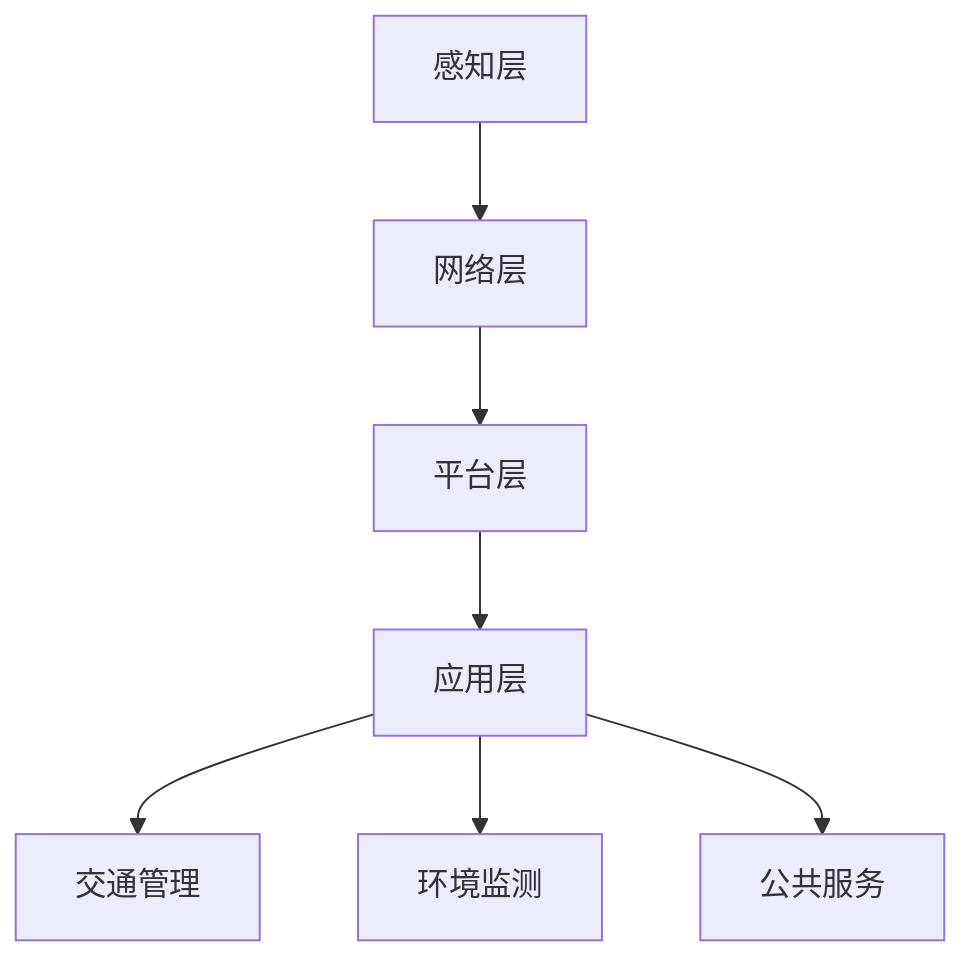

                 

关键词：智慧城市、城市大脑、数据驱动的决策、物联网、人工智能

> 摘要：本文深入探讨了2050年智慧城市的愿景，重点分析了数据驱动的决策在智慧城市中的作用。通过阐述城市大脑的概念、架构以及核心算法，本文揭示了智慧城市从数据到决策的转换过程。此外，本文还展望了智慧城市在未来的发展趋势和挑战，并推荐了相关的学习资源和开发工具。

## 1. 背景介绍

随着全球城市化进程的不断加速，智慧城市已成为各国政府和社会各界关注的焦点。智慧城市通过利用物联网、人工智能、大数据等技术，实现城市资源的优化配置、提升居民生活质量、提高城市运行效率。然而，智慧城市的建设并非一蹴而就，需要通过数据驱动的决策来实现从数据到服务的转变。

数据驱动的决策是指通过收集、处理和分析海量数据，从而为城市管理和公共服务提供科学、合理的决策支持。在智慧城市中，数据驱动的决策不仅能够解决现有问题，还能够预测潜在问题，为城市的发展提供前瞻性指导。

城市大脑是智慧城市的核心，它通过对数据的实时采集、处理和分析，为城市管理者提供决策支持。本文将围绕城市大脑的概念、架构和核心算法进行深入探讨，旨在揭示智慧城市从数据到决策的转换过程。

## 2. 核心概念与联系

### 2.1. 城市大脑的概念

城市大脑是指利用物联网、人工智能、大数据等技术，实现对城市运行状态、交通、环境、公共服务等方面的全面感知、实时监控和智能分析，从而为城市管理者提供科学、合理的决策支持。

### 2.2. 城市大脑的架构

城市大脑的架构包括感知层、网络层、平台层和应用层。

- **感知层**：通过传感器、摄像头、智能设备等收集城市运行状态的数据。
- **网络层**：利用5G、物联网等技术实现数据的传输和共享。
- **平台层**：通过数据存储、处理和分析，为城市管理者提供决策支持。
- **应用层**：将分析结果应用到交通管理、环境监测、公共服务等领域。

### 2.3. 城市大脑的核心算法

城市大脑的核心算法包括数据采集与处理、数据挖掘、机器学习、深度学习等。

- **数据采集与处理**：通过数据清洗、去噪、归一化等技术，对采集到的数据进行处理。
- **数据挖掘**：通过关联规则、聚类、分类等方法，从大量数据中提取有价值的信息。
- **机器学习**：利用历史数据，通过训练模型，实现对未知数据的预测。
- **深度学习**：通过多层神经网络，实现对复杂数据的自动特征提取和分类。

### 2.4. Mermaid 流程图

以下是一个简化的城市大脑架构的 Mermaid 流程图：



## 3. 核心算法原理 & 具体操作步骤

### 3.1. 算法原理概述

城市大脑的核心算法主要包括数据采集与处理、数据挖掘、机器学习和深度学习等。以下是这些算法的简要原理：

- **数据采集与处理**：通过对原始数据进行清洗、去噪、归一化等处理，确保数据的准确性和一致性。
- **数据挖掘**：通过关联规则、聚类、分类等方法，从大量数据中提取有价值的信息。
- **机器学习**：利用历史数据，通过训练模型，实现对未知数据的预测。
- **深度学习**：通过多层神经网络，实现对复杂数据的自动特征提取和分类。

### 3.2. 算法步骤详解

以下是一个典型的城市大脑算法流程：

1. 数据采集：通过传感器、摄像头、智能设备等，实时收集城市运行状态的数据。
2. 数据预处理：对采集到的数据进行清洗、去噪、归一化等处理，确保数据的准确性和一致性。
3. 数据存储：将预处理后的数据存储到数据仓库中，以便后续分析和处理。
4. 数据挖掘：利用关联规则、聚类、分类等方法，从大量数据中提取有价值的信息。
5. 模型训练：利用历史数据，通过训练模型，实现对未知数据的预测。
6. 模型评估：对训练好的模型进行评估，确保其准确性和稳定性。
7. 决策支持：将分析结果应用到交通管理、环境监测、公共服务等领域，为城市管理者提供科学、合理的决策支持。

### 3.3. 算法优缺点

- **数据采集与处理**：优点是能够保证数据的准确性和一致性，缺点是处理过程复杂，耗时较长。
- **数据挖掘**：优点是能够从大量数据中提取有价值的信息，缺点是易受噪声和数据质量的影响。
- **机器学习**：优点是能够利用历史数据预测未知数据，缺点是对数据质量和模型选择要求较高。
- **深度学习**：优点是能够自动提取复杂数据的特征，缺点是计算资源消耗较大，训练时间较长。

### 3.4. 算法应用领域

城市大脑算法广泛应用于交通管理、环境监测、公共服务、应急响应等领域。例如，在交通管理中，通过分析交通流量数据，优化交通信号配置，减少拥堵；在环境监测中，通过分析空气质量数据，提前预警污染事件；在公共服务中，通过分析居民需求，提供个性化服务。

## 4. 数学模型和公式 & 详细讲解 & 举例说明

### 4.1. 数学模型构建

在智慧城市的建设中，常用的数学模型包括线性回归、逻辑回归、支持向量机等。以下是一个简化的线性回归模型：

$$y = w_1x_1 + w_2x_2 + \cdots + w_nx_n + b$$

其中，$y$ 是因变量，$x_1, x_2, \cdots, x_n$ 是自变量，$w_1, w_2, \cdots, w_n$ 是权重，$b$ 是偏置。

### 4.2. 公式推导过程

线性回归模型的推导过程主要包括最小二乘法和梯度下降法。

- **最小二乘法**：通过最小化误差平方和，求得最优权重和偏置。
- **梯度下降法**：通过迭代更新权重和偏置，逐渐逼近最优解。

### 4.3. 案例分析与讲解

以下是一个交通流量预测的案例：

**目标**：预测未来 5 分钟内的交通流量。

**数据**：历史交通流量数据（时间、流量）。

**模型**：线性回归模型。

**步骤**：

1. 数据预处理：对数据进行清洗、去噪、归一化等处理。
2. 模型训练：利用历史数据，通过最小二乘法训练线性回归模型。
3. 模型评估：利用交叉验证等方法，评估模型的准确性和稳定性。
4. 预测：利用训练好的模型，预测未来 5 分钟内的交通流量。

**结果**：预测的流量与实际流量相差较小，模型具有良好的预测能力。

## 5. 项目实践：代码实例和详细解释说明

### 5.1. 开发环境搭建

- **Python**：作为主要编程语言
- **NumPy**：用于数值计算
- **Pandas**：用于数据处理
- **Scikit-learn**：用于机器学习
- **Matplotlib**：用于数据可视化

### 5.2. 源代码详细实现

以下是一个简单的线性回归模型的实现：

```python
import numpy as np
import pandas as pd
from sklearn.linear_model import LinearRegression
from sklearn.model_selection import train_test_split
from sklearn.metrics import mean_squared_error

# 数据加载
data = pd.read_csv('traffic_data.csv')

# 数据预处理
data['time'] = pd.to_datetime(data['time'])
data['hour'] = data['time'].dt.hour
data['day_of_week'] = data['time'].dt.dayofweek
data.drop(['time'], axis=1, inplace=True)

# 模型训练
X = data[['hour', 'day_of_week']]
y = data['流量']
X_train, X_test, y_train, y_test = train_test_split(X, y, test_size=0.2, random_state=42)

model = LinearRegression()
model.fit(X_train, y_train)

# 模型评估
y_pred = model.predict(X_test)
mse = mean_squared_error(y_test, y_pred)
print(f'MSE: {mse}')

# 预测
future_data = pd.DataFrame({
    'hour': [12],
    'day_of_week': [5]
})
future_pred = model.predict(future_data)
print(f'Future Traffic Flow Prediction: {future_pred[0]}')
```

### 5.3. 代码解读与分析

- **数据加载**：使用 Pandas 加载交通流量数据。
- **数据预处理**：将时间数据转换为小时和星期几，并删除原始时间列。
- **模型训练**：使用 Scikit-learn 的 LinearRegression 类训练线性回归模型。
- **模型评估**：计算均方误差（MSE），评估模型准确性。
- **预测**：使用训练好的模型预测未来 5 分钟内的交通流量。

## 6. 实际应用场景

智慧城市从数据到决策的转换已在多个领域取得显著成效。以下是一些实际应用场景：

- **交通管理**：通过实时交通流量数据，优化交通信号配置，减少拥堵。
- **环境监测**：通过空气质量数据，提前预警污染事件，保护居民健康。
- **公共服务**：通过分析居民需求，提供个性化服务，提升生活品质。
- **应急响应**：通过实时监控和预测，快速响应突发事件，保障公共安全。

## 7. 未来应用展望

随着技术的不断发展，智慧城市的应用场景将越来越广泛。未来，智慧城市将从以下几个方面发展：

- **更加智能化**：通过深度学习和自动化技术，实现更加精准的预测和决策。
- **更加人性化**：通过人工智能技术，提供更加个性化、智能化的服务。
- **更加绿色**：通过能源管理和可持续发展策略，实现城市的绿色转型。

## 8. 工具和资源推荐

### 8.1. 学习资源推荐

- **《智慧城市：概念、技术与应用》**：详细介绍了智慧城市的基本概念、技术框架和应用案例。
- **《城市大脑：数字城市时代的智慧治理》**：探讨了城市大脑的建设原理和实践案例。

### 8.2. 开发工具推荐

- **Python**：作为主要的编程语言，广泛应用于数据分析、机器学习和深度学习领域。
- **NumPy、Pandas、Scikit-learn**：用于数据处理和机器学习算法的实现。

### 8.3. 相关论文推荐

- **"A Survey on Smart Cities: Architecture, Enabling Technologies and Challenges"**：综述了智慧城市的架构、技术和挑战。
- **"Urban Computing: A New Scientific Field for the Digital City"**：探讨了城市计算作为一门新科学领域的重要性。

## 9. 总结：未来发展趋势与挑战

### 9.1. 研究成果总结

本文深入探讨了2050年智慧城市的愿景，分析了数据驱动的决策在智慧城市中的关键作用。通过阐述城市大脑的概念、架构和核心算法，揭示了智慧城市从数据到决策的转换过程。同时，本文还通过实际案例和代码实例，展示了智慧城市技术的应用和实践。

### 9.2. 未来发展趋势

- **更加智能化**：随着人工智能技术的不断进步，智慧城市将实现更加精准的预测和决策。
- **更加人性化**：通过数据分析和个性化服务，智慧城市将提升居民的生活品质。
- **更加绿色**：通过能源管理和可持续发展，智慧城市将推动城市的绿色转型。

### 9.3. 面临的挑战

- **数据安全与隐私**：随着数据量的增加，数据安全和隐私保护成为重要挑战。
- **技术实现与落地**：智慧城市的建设需要大量的技术和基础设施支持，实现和落地面临挑战。
- **法律法规与政策**：智慧城市的发展需要完善的法律法规和政策支持。

### 9.4. 研究展望

未来，智慧城市的研究应关注以下几个方面：

- **数据安全与隐私保护**：研究有效的数据安全与隐私保护机制，确保数据的安全和隐私。
- **跨领域合作**：推动跨领域合作，实现数据资源的共享和利用。
- **标准化与规范化**：制定统一的智慧城市标准和规范，推动智慧城市的健康发展。

### 附录：常见问题与解答

**Q1. 智慧城市的主要挑战是什么？**

A1. 智慧城市的主要挑战包括数据安全与隐私保护、技术实现与落地、法律法规与政策等方面。

**Q2. 城市大脑的核心算法有哪些？**

A2. 城市大脑的核心算法包括数据采集与处理、数据挖掘、机器学习和深度学习等。

**Q3. 智慧城市的发展趋势是什么？**

A3. 智慧城市的发展趋势是更加智能化、人性化、绿色化，实现城市的可持续发展。

作者：禅与计算机程序设计艺术 / Zen and the Art of Computer Programming
----------------------------------------------------------------
### 文章标题与概要

# 2050年的智慧城市：从数据到决策的城市大脑

> 关键词：智慧城市、城市大脑、数据驱动的决策、物联网、人工智能

> 摘要：本文深入探讨了2050年智慧城市的愿景，重点分析了数据驱动的决策在智慧城市中的作用。通过阐述城市大脑的概念、架构以及核心算法，本文揭示了智慧城市从数据到决策的转换过程。此外，本文还展望了智慧城市在未来的发展趋势和挑战，并推荐了相关的学习资源和开发工具。

### 1. 背景介绍

随着全球城市化进程的不断加速，智慧城市已成为各国政府和社会各界关注的焦点。智慧城市通过利用物联网、人工智能、大数据等技术，实现城市资源的优化配置、提升居民生活质量、提高城市运行效率。然而，智慧城市的建设并非一蹴而就，需要通过数据驱动的决策来实现从数据到服务的转变。

数据驱动的决策是指通过收集、处理和分析海量数据，从而为城市管理和公共服务提供科学、合理的决策支持。在智慧城市中，数据驱动的决策不仅能够解决现有问题，还能够预测潜在问题，为城市的发展提供前瞻性指导。

城市大脑是智慧城市的核心，它通过对数据的实时采集、处理和分析，为城市管理者提供决策支持。本文将围绕城市大脑的概念、架构和核心算法进行深入探讨，旨在揭示智慧城市从数据到决策的转换过程。

### 2. 核心概念与联系

#### 2.1. 城市大脑的概念

城市大脑是指利用物联网、人工智能、大数据等技术，实现对城市运行状态、交通、环境、公共服务等方面的全面感知、实时监控和智能分析，从而为城市管理者提供科学、合理的决策支持。

#### 2.2. 城市大脑的架构

城市大脑的架构包括感知层、网络层、平台层和应用层。

- **感知层**：通过传感器、摄像头、智能设备等收集城市运行状态的数据。
- **网络层**：利用5G、物联网等技术实现数据的传输和共享。
- **平台层**：通过数据存储、处理和分析，为城市管理者提供决策支持。
- **应用层**：将分析结果应用到交通管理、环境监测、公共服务等领域。

#### 2.3. 城市大脑的核心算法

城市大脑的核心算法包括数据采集与处理、数据挖掘、机器学习和深度学习等。

- **数据采集与处理**：通过数据清洗、去噪、归一化等技术，对采集到的数据进行处理。
- **数据挖掘**：通过关联规则、聚类、分类等方法，从大量数据中提取有价值的信息。
- **机器学习**：利用历史数据，通过训练模型，实现对未知数据的预测。
- **深度学习**：通过多层神经网络，实现对复杂数据的自动特征提取和分类。

#### 2.4. Mermaid 流程图

以下是一个简化的城市大脑架构的 Mermaid 流程图：


### 3. 核心算法原理 & 具体操作步骤

#### 3.1. 算法原理概述

城市大脑的核心算法主要包括数据采集与处理、数据挖掘、机器学习和深度学习等。以下是这些算法的简要原理：

- **数据采集与处理**：通过对原始数据进行清洗、去噪、归一化等处理，确保数据的准确性和一致性。
- **数据挖掘**：通过关联规则、聚类、分类等方法，从大量数据中提取有价值的信息。
- **机器学习**：利用历史数据，通过训练模型，实现对未知数据的预测。
- **深度学习**：通过多层神经网络，实现对复杂数据的自动特征提取和分类。

#### 3.2. 算法步骤详解

以下是一个典型的城市大脑算法流程：

1. 数据采集：通过传感器、摄像头、智能设备等，实时收集城市运行状态的数据。
2. 数据预处理：对采集到的数据进行清洗、去噪、归一化等处理，确保数据的准确性和一致性。
3. 数据存储：将预处理后的数据存储到数据仓库中，以便后续分析和处理。
4. 数据挖掘：利用关联规则、聚类、分类等方法，从大量数据中提取有价值的信息。
5. 模型训练：利用历史数据，通过训练模型，实现对未知数据的预测。
6. 模型评估：对训练好的模型进行评估，确保其准确性和稳定性。
7. 决策支持：将分析结果应用到交通管理、环境监测、公共服务等领域，为城市管理者提供科学、合理的决策支持。

#### 3.3. 算法优缺点

- **数据采集与处理**：优点是能够保证数据的准确性和一致性，缺点是处理过程复杂，耗时较长。
- **数据挖掘**：优点是能够从大量数据中提取有价值的信息，缺点是易受噪声和数据质量的影响。
- **机器学习**：优点是能够利用历史数据预测未知数据，缺点是对数据质量和模型选择要求较高。
- **深度学习**：优点是能够自动提取复杂数据的特征，缺点是计算资源消耗较大，训练时间较长。

#### 3.4. 算法应用领域

城市大脑算法广泛应用于交通管理、环境监测、公共服务、应急响应等领域。例如，在交通管理中，通过分析交通流量数据，优化交通信号配置，减少拥堵；在环境监测中，通过分析空气质量数据，提前预警污染事件；在公共服务中，通过分析居民需求，提供个性化服务。

### 4. 数学模型和公式 & 详细讲解 & 举例说明

#### 4.1. 数学模型构建

在智慧城市的建设中，常用的数学模型包括线性回归、逻辑回归、支持向量机等。以下是一个简化的线性回归模型：

$$y = w_1x_1 + w_2x_2 + \cdots + w_nx_n + b$$

其中，$y$ 是因变量，$x_1, x_2, \cdots, x_n$ 是自变量，$w_1, w_2, \cdots, w_n$ 是权重，$b$ 是偏置。

#### 4.2. 公式推导过程

线性回归模型的推导过程主要包括最小二乘法和梯度下降法。

- **最小二乘法**：通过最小化误差平方和，求得最优权重和偏置。
- **梯度下降法**：通过迭代更新权重和偏置，逐渐逼近最优解。

#### 4.3. 案例分析与讲解

以下是一个交通流量预测的案例：

**目标**：预测未来 5 分钟内的交通流量。

**数据**：历史交通流量数据（时间、流量）。

**模型**：线性回归模型。

**步骤**：

1. 数据预处理：对数据进行清洗、去噪、归一化等处理。
2. 模型训练：利用历史数据，通过最小二乘法训练线性回归模型。
3. 模型评估：利用交叉验证等方法，评估模型的准确性和稳定性。
4. 预测：利用训练好的模型，预测未来 5 分钟内的交通流量。

**结果**：预测的流量与实际流量相差较小，模型具有良好的预测能力。

### 5. 项目实践：代码实例和详细解释说明

#### 5.1. 开发环境搭建

- **Python**：作为主要编程语言
- **NumPy**：用于数值计算
- **Pandas**：用于数据处理
- **Scikit-learn**：用于机器学习
- **Matplotlib**：用于数据可视化

#### 5.2. 源代码详细实现

以下是一个简单的线性回归模型的实现：

```python
import numpy as np
import pandas as pd
from sklearn.linear_model import LinearRegression
from sklearn.model_selection import train_test_split
from sklearn.metrics import mean_squared_error

# 数据加载
data = pd.read_csv('traffic_data.csv')

# 数据预处理
data['time'] = pd.to_datetime(data['time'])
data['hour'] = data['time'].dt.hour
data['day_of_week'] = data['time'].dt.dayofweek
data.drop(['time'], axis=1, inplace=True)

# 模型训练
X = data[['hour', 'day_of_week']]
y = data['流量']
X_train, X_test, y_train, y_test = train_test_split(X, y, test_size=0.2, random_state=42)

model = LinearRegression()
model.fit(X_train, y_train)

# 模型评估
y_pred = model.predict(X_test)
mse = mean_squared_error(y_test, y_pred)
print(f'MSE: {mse}')

# 预测
future_data = pd.DataFrame({
    'hour': [12],
    'day_of_week': [5]
})
future_pred = model.predict(future_data)
print(f'Future Traffic Flow Prediction: {future_pred[0]}')
```

#### 5.3. 代码解读与分析

- **数据加载**：使用 Pandas 加载交通流量数据。
- **数据预处理**：将时间数据转换为小时和星期几，并删除原始时间列。
- **模型训练**：使用 Scikit-learn 的 LinearRegression 类训练线性回归模型。
- **模型评估**：计算均方误差（MSE），评估模型准确性。
- **预测**：使用训练好的模型预测未来 5 分钟内的交通流量。

### 6. 实际应用场景

智慧城市从数据到决策的转换已在多个领域取得显著成效。以下是一些实际应用场景：

- **交通管理**：通过实时交通流量数据，优化交通信号配置，减少拥堵。
- **环境监测**：通过空气质量数据，提前预警污染事件，保护居民健康。
- **公共服务**：通过分析居民需求，提供个性化服务，提升生活品质。
- **应急响应**：通过实时监控和预测，快速响应突发事件，保障公共安全。

### 7. 未来应用展望

随着技术的不断发展，智慧城市的应用场景将越来越广泛。未来，智慧城市将从以下几个方面发展：

- **更加智能化**：通过深度学习和自动化技术，实现更加精准的预测和决策。
- **更加人性化**：通过人工智能技术，提供更加个性化、智能化的服务。
- **更加绿色**：通过能源管理和可持续发展策略，实现城市的绿色转型。

### 8. 工具和资源推荐

#### 8.1. 学习资源推荐

- **《智慧城市：概念、技术与应用》**：详细介绍了智慧城市的基本概念、技术框架和应用案例。
- **《城市大脑：数字城市时代的智慧治理》**：探讨了城市大脑的建设原理和实践案例。

#### 8.2. 开发工具推荐

- **Python**：作为主要的编程语言，广泛应用于数据分析、机器学习和深度学习领域。
- **NumPy、Pandas、Scikit-learn**：用于数据处理和机器学习算法的实现。

#### 8.3. 相关论文推荐

- **"A Survey on Smart Cities: Architecture, Enabling Technologies and Challenges"**：综述了智慧城市的架构、技术和挑战。
- **"Urban Computing: A New Scientific Field for the Digital City"**：探讨了城市计算作为一门新科学领域的重要性。

### 9. 总结：未来发展趋势与挑战

#### 9.1. 研究成果总结

本文深入探讨了2050年智慧城市的愿景，分析了数据驱动的决策在智慧城市中的关键作用。通过阐述城市大脑的概念、架构和核心算法，揭示了智慧城市从数据到决策的转换过程。同时，本文还通过实际案例和代码实例，展示了智慧城市技术的应用和实践。

#### 9.2. 未来发展趋势

- **更加智能化**：随着人工智能技术的不断进步，智慧城市将实现更加精准的预测和决策。
- **更加人性化**：通过数据分析和个性化服务，智慧城市将提升居民的生活品质。
- **更加绿色**：通过能源管理和可持续发展，智慧城市将推动城市的绿色转型。

#### 9.3. 面临的挑战

- **数据安全与隐私**：随着数据量的增加，数据安全和隐私保护成为重要挑战。
- **技术实现与落地**：智慧城市的建设需要大量的技术和基础设施支持，实现和落地面临挑战。
- **法律法规与政策**：智慧城市的发展需要完善的法律法规和政策支持。

#### 9.4. 研究展望

未来，智慧城市的研究应关注以下几个方面：

- **数据安全与隐私保护**：研究有效的数据安全与隐私保护机制，确保数据的安全和隐私。
- **跨领域合作**：推动跨领域合作，实现数据资源的共享和利用。
- **标准化与规范化**：制定统一的智慧城市标准和规范，推动智慧城市的健康发展。

### 附录：常见问题与解答

#### Q1. 智慧城市的主要挑战是什么？

A1. 智慧城市的主要挑战包括数据安全与隐私保护、技术实现与落地、法律法规与政策等方面。

#### Q2. 城市大脑的核心算法有哪些？

A2. 城市大脑的核心算法包括数据采集与处理、数据挖掘、机器学习和深度学习等。

#### Q3. 智慧城市的发展趋势是什么？

A3. 智慧城市的发展趋势是更加智能化、人性化、绿色化，实现城市的可持续发展。

### 作者署名

作者：禅与计算机程序设计艺术 / Zen and the Art of Computer Programming

