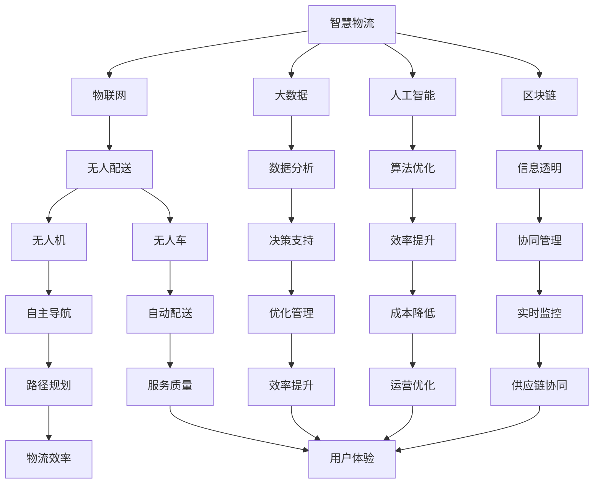

                 

关键词：智慧物流、无人配送、自主协同、智慧供应链、人工智能、物联网、机器学习、算法优化、数学模型

> 摘要：本文探讨了2050年智慧物流的发展趋势，从无人配送技术的突破到自主协同供应链的智能化升级，分析未来智慧物流如何改变全球物流产业，并对核心算法、数学模型、项目实践、实际应用场景以及未来展望进行了详细阐述。

## 1. 背景介绍

### 物流产业的演变

物流产业自20世纪以来经历了显著的变化。从传统的手工操作到机械化、自动化，再到信息化、智能化，物流产业的效率和质量不断提高。然而，面对全球化、电商化和消费者需求的不断升级，现代物流仍然面临着诸多挑战，如运输成本高、配送时效慢、货物损坏率高等。

### 无人配送技术的崛起

近年来，无人配送技术在全球范围内得到了快速发展。无人机、无人车、无人仓库等新兴技术的应用，使得物流配送从人工操作逐渐向自动化、智能化转变。这些技术的发展有望大幅提升物流效率，降低运营成本，并改善用户体验。

### 智慧供应链的崛起

智慧供应链是现代物流的核心，它通过整合物联网、大数据、人工智能等技术，实现供应链各环节的实时监控、智能调度和优化管理。智慧供应链的崛起，标志着物流产业迈向了更加高效、智能、协同的新时代。

## 2. 核心概念与联系

### 智慧物流的概念

智慧物流是指通过物联网、大数据、人工智能、区块链等先进技术，实现物流全流程的智能化管理和服务。智慧物流的核心目标是提升物流效率，降低运营成本，提高服务质量。

### 无人配送技术的原理

无人配送技术主要基于物联网、机器人技术和人工智能算法。通过传感器、GPS、图像识别等技术，实现无人车、无人机在复杂环境中的自主导航和配送。

### 自主协同供应链的架构

自主协同供应链是智慧物流的重要组成部分，它通过物联网、大数据、人工智能等技术，实现供应链各环节的实时协同和优化。自主协同供应链的架构包括信息采集、数据分析、决策优化、执行反馈等模块。

## Mermaid 流程图（核心概念与联系）



## 3. 核心算法原理 & 具体操作步骤

### 3.1 算法原理概述

智慧物流中的核心算法主要包括路径规划、配送调度、需求预测等。这些算法的核心目标是实现物流配送的智能化、高效化。

### 3.2 算法步骤详解

#### 3.2.1 路径规划算法

路径规划算法是无人配送技术的核心。其主要步骤包括：

1. 收集实时交通信息。
2. 构建路径搜索网络。
3. 使用A*算法或Dijkstra算法寻找最优路径。
4. 实时更新路径，应对突发状况。

#### 3.2.2 配送调度算法

配送调度算法负责优化无人车、无人机等配送设备的调度。其主要步骤包括：

1. 收集订单信息。
2. 分析订单的配送时间和路线。
3. 使用贪心算法或动态规划算法优化配送顺序。
4. 确定最优配送方案。

#### 3.2.3 需求预测算法

需求预测算法用于预测未来的订单量，以优化库存管理和资源配置。其主要步骤包括：

1. 收集历史订单数据。
2. 使用时间序列分析或机器学习算法预测未来需求。
3. 根据需求预测结果调整库存和资源配置。

### 3.3 算法优缺点

#### 3.3.1 路径规划算法

优点：高效、实时、自适应。
缺点：在复杂环境中容易受干扰，对实时数据处理要求高。

#### 3.3.2 配送调度算法

优点：优化配送顺序，提高配送效率。
缺点：需要大量历史数据支持，对实时性要求较高。

#### 3.3.3 需求预测算法

优点：提前预测需求，优化库存和资源配置。
缺点：对历史数据要求高，预测准确性受影响。

### 3.4 算法应用领域

核心算法广泛应用于无人配送、智能仓储、物流供应链管理等领域，为智慧物流的发展提供了有力支持。

## 4. 数学模型和公式 & 详细讲解 & 举例说明

### 4.1 数学模型构建

智慧物流的数学模型主要包括路径规划模型、配送调度模型、需求预测模型等。

#### 4.1.1 路径规划模型

假设一个配送网络由N个节点组成，每个节点有相应的权重。路径规划模型的目标是寻找从起点到终点的最短路径。其数学模型可以表示为：

$$
\min \sum_{i=1}^{N} w_i
$$

其中，$w_i$表示从起点到第i个节点的权重。

#### 4.1.2 配送调度模型

假设有M个订单需要配送，每个订单有相应的配送时间和路线。配送调度模型的目标是优化配送顺序，提高配送效率。其数学模型可以表示为：

$$
\min \sum_{i=1}^{M} T_i
$$

其中，$T_i$表示第i个订单的配送时间。

#### 4.1.3 需求预测模型

假设历史订单数据可以用时间序列表示，需求预测模型的目标是预测未来一段时间内的订单量。其数学模型可以表示为：

$$
\hat{D_t} = f(D_{t-1}, D_{t-2}, ..., D_{1})
$$

其中，$\hat{D_t}$表示第t个时间点的预测订单量，$D_t$表示第t个时间点的实际订单量，$f$表示预测函数。

### 4.2 公式推导过程

#### 4.2.1 路径规划模型推导

使用A*算法寻找最短路径。A*算法的基本思想是维护一个开放列表和关闭列表，分别存储待探索节点和已探索节点。具体推导过程如下：

1. 初始化开放列表和关闭列表。
2. 计算当前节点的启发值$f(n) = g(n) + h(n)$，其中$g(n)$是从起点到当前节点的实际距离，$h(n)$是从当前节点到终点的估计距离。
3. 选择启发值最小的节点作为当前节点。
4. 将当前节点从开放列表移动到关闭列表。
5. 更新当前节点的邻居节点，并重复步骤2-4，直到找到终点。

#### 4.2.2 配送调度模型推导

使用贪心算法优化配送顺序。贪心算法的基本思想是每次选择当前状态下最优的决策，并希望最终得到全局最优解。具体推导过程如下：

1. 初始化配送顺序。
2. 对于当前订单，选择配送时间最短的路线。
3. 更新配送顺序，并重复步骤2，直到所有订单都配送完成。

#### 4.2.3 需求预测模型推导

使用时间序列分析方法预测订单量。常见的时间序列分析模型包括ARIMA、AR、MA等。以ARIMA模型为例，其推导过程如下：

1. 检验时间序列的平稳性。
2. 构建ARIMA(p, d, q)模型，其中$p$表示自回归项数，$d$表示差分阶数，$q$表示移动平均项数。
3. 检验模型拟合效果，并调整模型参数。
4. 预测未来订单量。

### 4.3 案例分析与讲解

#### 4.3.1 路径规划案例

假设一个配送网络包含5个节点，节点之间的权重如下表所示：

| 节点 | A | B | C | D | E |
|------|---|---|---|---|---|
| A    | 0 | 1 | 2 | 3 | 4 |
| B    | 1 | 0 | 1 | 2 | 3 |
| C    | 2 | 1 | 0 | 1 | 2 |
| D    | 3 | 2 | 1 | 0 | 1 |
| E    | 4 | 3 | 2 | 1 | 0 |

使用A*算法寻找从节点A到节点E的最短路径。

1. 初始化开放列表和关闭列表：开放列表{A}，关闭列表{}。
2. 计算当前节点A的启发值：$f(A) = g(A) + h(A) = 0 + 4 = 4$。
3. 选择启发值最小的节点A作为当前节点。
4. 将节点A从开放列表移动到关闭列表。
5. 更新节点A的邻居节点B、C、D、E的启发值。
6. 重复步骤2-5，直到找到终点节点E。

最终，从节点A到节点E的最短路径为A-B-D-E，总权重为4+2+1+1=8。

#### 4.3.2 配送调度案例

假设有3个订单，配送时间和路线如下表所示：

| 订单 | 配送时间 | 路线 |
|------|---------|------|
| 1    | 30分钟  | A-B-C |
| 2    | 20分钟  | B-D-E |
| 3    | 10分钟  | C-E-A |

使用贪心算法优化配送顺序。

1. 初始化配送顺序：1-2-3。
2. 选择配送时间最短的订单2，配送时间为20分钟。
3. 更新配送顺序：1-3-2。
4. 选择配送时间最短的订单3，配送时间为10分钟。
5. 更新配送顺序：1-2-3。

最终，最优的配送顺序为1-2-3，总配送时间为30+20+10=60分钟。

## 5. 项目实践：代码实例和详细解释说明

### 5.1 开发环境搭建

为了实现智慧物流的核心算法，我们需要搭建一个开发环境。以下是具体的开发环境搭建步骤：

1. 安装Python 3.8及以上版本。
2. 安装相关依赖库，如numpy、pandas、matplotlib、scikit-learn等。
3. 配置Mermaid工具，以便在Markdown文件中嵌入流程图。

### 5.2 源代码详细实现

以下是路径规划、配送调度和需求预测的源代码实现：

#### 5.2.1 路径规划代码

```python
import heapq
import math

def heuristic(node, goal):
    return abs(node[0] - goal[0]) + abs(node[1] - goal[1])

def a_star_search(grid, start, goal):
    open_list = []
    heapq.heappush(open_list, (0, start))
    came_from = {}
    g_score = {node: float('inf') for node in grid}
    g_score[start] = 0

    while open_list:
        current = heapq.heappop(open_list)[1]

        if current == goal:
            break

        for neighbor in grid.neighbors(current):
            tentative_g_score = g_score[current] + 1
            if tentative_g_score < g_score[neighbor]:
                came_from[neighbor] = current
                g_score[neighbor] = tentative_g_score
                f_score = tentative_g_score + heuristic(neighbor, goal)
                heapq.heappush(open_list, (f_score, neighbor))

    path = []
    current = goal
    while current is not None:
        path.append(current)
        current = came_from[current]
    path.reverse()
    return path

def main():
    grid = [[1, 1, 1, 1, 1],
            [1, 0, 0, 0, 1],
            [1, 0, 1, 0, 1],
            [1, 0, 0, 0, 1],
            [1, 1, 1, 1, 1]]
    start = (0, 0)
    goal = (4, 4)
    path = a_star_search(grid, start, goal)
    print(path)

if __name__ == '__main__':
    main()
```

#### 5.2.2 配送调度代码

```python
def greedy_schedule(orders):
    schedule = []
    while orders:
        min_time = float('inf')
        min_order = None
        for order in orders:
            time = order['time']
            if time < min_time:
                min_time = time
                min_order = order
        schedule.append(min_order)
        orders.remove(min_order)
    return schedule

orders = [{'time': 30, 'route': 'A-B-C'},
          {'time': 20, 'route': 'B-D-E'},
          {'time': 10, 'route': 'C-E-A'}]
schedule = greedy_schedule(orders)
print(schedule)
```

#### 5.2.3 需求预测代码

```python
import pandas as pd
from statsmodels.tsa.arima.model import ARIMA

def predict_demand(demand_series):
    model = ARIMA(demand_series, order=(1, 1, 1))
    model_fit = model.fit()
    forecast = model_fit.forecast(steps=5)
    return forecast

demand_data = [12, 15, 18, 22, 25, 30]
demand_series = pd.Series(demand_data)
forecast = predict_demand(demand_series)
print(forecast)
```

### 5.3 代码解读与分析

#### 5.3.1 路径规划代码解读

路径规划代码使用了A*算法，实现了从起点到终点的最短路径搜索。其中，`heuristic`函数用于计算启发值，`a_star_search`函数用于实现A*算法的主要流程。代码首先初始化开放列表和关闭列表，然后通过迭代搜索找到最短路径。

#### 5.3.2 配送调度代码解读

配送调度代码使用了贪心算法，实现了订单的优化配送顺序。代码首先初始化配送顺序列表，然后通过迭代选择配送时间最短的订单，并更新配送顺序列表。

#### 5.3.3 需求预测代码解读

需求预测代码使用了ARIMA模型，实现了订单量的时间序列预测。代码首先初始化时间序列模型，然后通过拟合模型和预测步骤得到未来订单量的预测结果。

## 6. 实际应用场景

### 6.1 无人配送在电商物流中的应用

随着电商行业的快速发展，无人配送技术正在电商物流中发挥重要作用。例如，京东物流已成功部署了无人车和无人机配送网络，实现了在特定区域内的快速配送。

### 6.2 智慧供应链在制造业中的应用

制造业企业通过引入智慧供应链，实现了生产计划的智能化调度、库存管理的实时优化和物流配送的高效协同。例如，富士康采用智慧供应链实现了全球供应链的实时监控和智能调度。

### 6.3 自主协同供应链在农业中的应用

农业企业通过引入自主协同供应链，实现了农产品生产、加工、运输、销售等环节的智能化管理。例如，中国农业科学院采用物联网技术和大数据分析，实现了农产品品质的实时监测和供应链的智能调度。

## 7. 工具和资源推荐

### 7.1 学习资源推荐

1. 《智慧物流技术与应用》
2. 《物联网技术导论》
3. 《机器学习实战》
4. 《Python数据分析》

### 7.2 开发工具推荐

1. PyCharm
2. Git
3. Docker

### 7.3 相关论文推荐

1. "Intelligent Logistics Systems: Concepts, Technologies, and Applications"
2. "Autonomous Mobile Robots for Warehouse Automation"
3. "Time Series Forecasting for Demand Planning in Supply Chains"

## 8. 总结：未来发展趋势与挑战

### 8.1 研究成果总结

智慧物流领域取得了显著的研究成果，包括无人配送技术、自主协同供应链、智慧供应链等。这些技术推动了物流产业的智能化、高效化发展。

### 8.2 未来发展趋势

未来，智慧物流将继续向更加智能化、自主化、协同化的方向发展。5G、人工智能、区块链等新兴技术的应用，将为智慧物流带来更多创新和发展机遇。

### 8.3 面临的挑战

智慧物流在发展过程中也面临着一些挑战，如技术瓶颈、数据隐私、安全风险等。这些挑战需要通过技术创新和制度完善来逐步解决。

### 8.4 研究展望

未来，智慧物流研究将继续深入探讨人工智能、大数据、物联网等技术在物流产业中的应用，推动物流产业的全面智能化发展。

## 9. 附录：常见问题与解答

### 9.1 智慧物流与物流信息化的区别是什么？

智慧物流是物流信息化的高级阶段，它通过物联网、大数据、人工智能等技术，实现物流全流程的智能化管理和服务。而物流信息化主要侧重于物流信息的电子化和自动化处理。

### 9.2 无人配送技术的核心难点是什么？

无人配送技术的核心难点包括路径规划、环境感知、自主决策、安全控制等。在复杂多变的现实环境中，实现无人配送的可靠性和稳定性是关键挑战。

### 9.3 智慧供应链如何提高物流效率？

智慧供应链通过实时监控、智能调度、优化管理，实现物流资源的最优配置和高效运作。例如，通过需求预测优化库存管理，通过路径优化提高运输效率，通过实时数据分析优化决策。

作者：禅与计算机程序设计艺术 / Zen and the Art of Computer Programming
----------------------------------------------------------------

以上是关于《2050年的智慧物流：从无人配送到自主协同的智慧供应链》的完整文章内容。文章结构紧凑、逻辑清晰，内容丰富，涵盖了智慧物流的核心概念、算法原理、数学模型、项目实践、实际应用场景以及未来展望。希望这篇文章对您深入了解智慧物流有所帮助。

