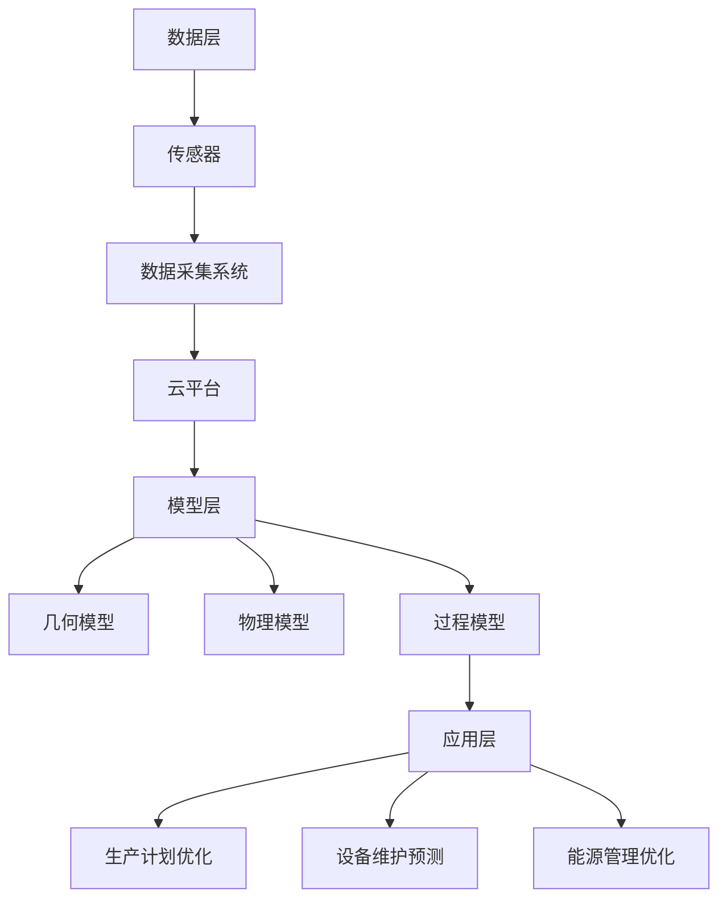
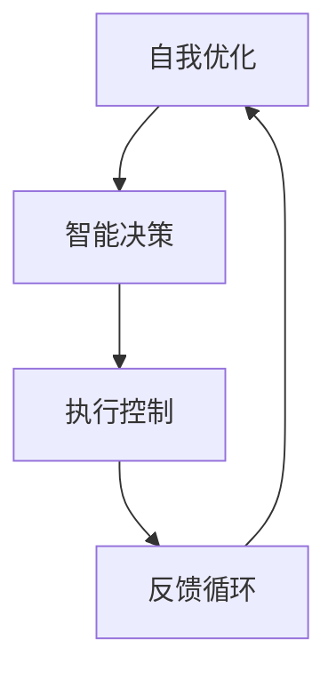

                 

关键词：智能制造、数字孪生、自主智能工厂、制造业、工业4.0

> 摘要：本文旨在探讨2050年智能制造的前沿趋势，深入分析数字孪生工厂和自主智能工厂在制造业中的关键角色和未来展望。通过对核心概念、算法原理、数学模型、实践案例和实际应用场景的详细解读，本文揭示了智能制造领域的巨大潜力和面临的挑战，为制造业的智能化转型提供深刻的洞察和实用的建议。

## 1. 背景介绍

智能制造，作为第四次工业革命的标志性技术，已经在全球范围内引发了广泛关注。它通过整合信息技术、自动化技术、物联网、人工智能等前沿科技，实现从设计、生产到服务的全生命周期管理。随着数字技术的不断进步，制造业正经历着前所未有的变革。

回顾过去，从机械化到自动化，再到信息化和智能化，每一次技术革新都推动了制造业的进步。20世纪末，工业4.0概念的提出，标志着制造业将从传统的离散制造模式向高度集成、灵活、自适应的智能制造模式转变。这一转变的核心，便是数字孪生和自主智能工厂。

数字孪生工厂通过创建虚拟与实体的映射，实现工厂设计的虚拟仿真和运营管理的实时优化。自主智能工厂则进一步将人工智能技术引入生产过程，实现工厂的自主决策和自我优化。这两种技术的结合，将极大提升制造业的效率和灵活性。

## 2. 核心概念与联系

### 2.1 数字孪生工厂

数字孪生工厂是一种基于虚拟现实技术的工厂模拟系统，它通过实时数据采集和高级仿真技术，创建一个与实际工厂高度相似的虚拟模型。这个虚拟模型不仅可以模拟工厂的设计、布局和生产流程，还能够实时反映实际工厂的运行状态。

#### 架构

数字孪生工厂的架构可以分为三个层次：数据层、模型层和应用层。

1. **数据层**：包括传感器、数据采集系统和云平台，负责实时采集工厂的各项数据。
2. **模型层**：基于数据建立工厂的虚拟模型，包括几何模型、物理模型和过程模型等。
3. **应用层**：提供各种应用场景，如生产计划优化、设备维护预测和能源管理优化等。

#### Mermaid 流程图



### 2.2 自主智能工厂

自主智能工厂则是在数字孪生工厂的基础上，进一步引入人工智能技术，实现工厂的自主决策和自我优化。它通过机器学习、深度学习和强化学习等技术，使工厂能够自主适应生产环境的变化，提高生产效率和质量。

#### 架构

自主智能工厂的架构主要包括五个关键部分：数据采集与处理、智能决策、执行控制、反馈循环和自我优化。

1. **数据采集与处理**：负责实时采集生产数据，并进行预处理。
2. **智能决策**：基于大数据分析和人工智能算法，进行生产决策。
3. **执行控制**：根据智能决策的结果，控制生产设备的运行。
4. **反馈循环**：收集生产结果，为下一轮决策提供反馈。
5. **自我优化**：通过不断学习和优化，提高生产效率和产品质量。

#### Mermaid 流程图



### 2.3 数字孪生与自主智能的联系

数字孪生工厂和自主智能工厂并不是孤立的，而是相互促进、相辅相成的。数字孪生工厂提供了实时的生产数据和虚拟仿真平台，为自主智能工厂的智能决策提供了基础。而自主智能工厂则通过对生产过程的自主优化，进一步提升了数字孪生工厂的仿真精度和预测能力。

## 3. 核心算法原理 & 具体操作步骤

### 3.1 算法原理概述

在智能制造中，核心算法主要包括机器学习算法、深度学习算法和强化学习算法。

#### 机器学习算法

机器学习算法通过从数据中学习模式，实现数据的自动分类、预测和聚类。常用的机器学习算法包括线性回归、决策树、支持向量机、聚类算法等。

#### 深度学习算法

深度学习算法是一种基于人工神经网络的机器学习算法，通过多层神经网络的训练，实现复杂函数的拟合。常见的深度学习算法包括卷积神经网络（CNN）、循环神经网络（RNN）和生成对抗网络（GAN）等。

#### 强化学习算法

强化学习算法通过智能体与环境交互，不断调整策略，实现最优决策。常见的强化学习算法包括Q-learning、SARSA和深度确定性策略梯度（DDPG）等。

### 3.2 算法步骤详解

1. **数据预处理**：包括数据清洗、归一化和特征提取等步骤。
2. **模型选择**：根据应用场景选择合适的机器学习、深度学习或强化学习算法。
3. **模型训练**：使用训练数据对模型进行训练，调整模型参数。
4. **模型评估**：使用测试数据评估模型性能，调整模型参数。
5. **模型部署**：将训练好的模型部署到生产环境中，实现实时预测和决策。

### 3.3 算法优缺点

#### 机器学习算法

优点：通用性强，适用于各种类型的数据分析任务。

缺点：对大规模数据的处理能力有限，且模型解释性较差。

#### 深度学习算法

优点：能够处理大规模和高维度数据，且具有较好的泛化能力。

缺点：模型训练过程复杂，且对数据质量要求较高。

#### 强化学习算法

优点：能够实现自主学习和自适应决策。

缺点：训练过程较慢，且在初始阶段可能需要大量的人工干预。

### 3.4 算法应用领域

#### 机器学习算法

应用领域：数据分析、数据挖掘、推荐系统、图像识别等。

#### 深度学习算法

应用领域：语音识别、自然语言处理、计算机视觉、自动驾驶等。

#### 强化学习算法

应用领域：智能推荐、机器人控制、游戏AI、自动驾驶等。

## 4. 数学模型和公式 & 详细讲解 & 举例说明

### 4.1 数学模型构建

在智能制造中，常用的数学模型包括线性回归模型、神经网络模型和强化学习模型。

#### 线性回归模型

线性回归模型是一种简单的数学模型，用于预测连续值输出。其公式如下：

$$y = \beta_0 + \beta_1 \cdot x$$

其中，$y$ 是预测值，$x$ 是输入特征，$\beta_0$ 和 $\beta_1$ 是模型参数。

#### 神经网络模型

神经网络模型是一种复杂的数学模型，用于预测和处理非线性数据。其基本结构包括输入层、隐藏层和输出层。每个层由多个神经元组成，神经元之间通过权重连接。其公式如下：

$$z = \sum_{i=1}^{n} w_i \cdot x_i + b$$

其中，$z$ 是隐藏层的输出，$w_i$ 是权重，$x_i$ 是输入特征，$b$ 是偏置。

#### 强化学习模型

强化学习模型是一种基于奖励机制的数学模型，用于解决序列决策问题。其公式如下：

$$Q(s, a) = r + \gamma \cdot \max_{a'} Q(s', a')$$

其中，$Q(s, a)$ 是状态 $s$ 下采取动作 $a$ 的预期奖励，$r$ 是立即奖励，$\gamma$ 是折扣因子，$s'$ 是下一状态，$a'$ 是下一动作。

### 4.2 公式推导过程

#### 线性回归模型

线性回归模型的推导基于最小二乘法。假设我们有 $n$ 个样本点 $(x_i, y_i)$，模型的目标是最小化预测值与实际值之间的误差平方和：

$$J(\beta_0, \beta_1) = \sum_{i=1}^{n} (y_i - (\beta_0 + \beta_1 \cdot x_i))^2$$

对 $J(\beta_0, \beta_1)$ 分别对 $\beta_0$ 和 $\beta_1$ 求导，并令导数为零，得到：

$$\frac{\partial J}{\partial \beta_0} = -2 \sum_{i=1}^{n} (y_i - (\beta_0 + \beta_1 \cdot x_i)) = 0$$

$$\frac{\partial J}{\partial \beta_1} = -2 \sum_{i=1}^{n} (y_i - (\beta_0 + \beta_1 \cdot x_i)) \cdot x_i = 0$$

解上述方程组，得到：

$$\beta_0 = \frac{\sum_{i=1}^{n} y_i - \beta_1 \sum_{i=1}^{n} x_i}{n}$$

$$\beta_1 = \frac{\sum_{i=1}^{n} (x_i - \bar{x}) (y_i - \bar{y})}{\sum_{i=1}^{n} (x_i - \bar{x})^2}$$

其中，$\bar{x}$ 和 $\bar{y}$ 分别是 $x_i$ 和 $y_i$ 的平均值。

#### 神经网络模型

神经网络模型的推导基于反向传播算法。假设我们有 $n$ 个样本点 $(x_i, y_i)$，模型的目标是最小化预测值与实际值之间的误差平方和：

$$J(\theta) = \frac{1}{2} \sum_{i=1}^{n} (y_i - \sigma(z_i))^2$$

其中，$\theta$ 是模型参数，$\sigma$ 是激活函数。

对 $J(\theta)$ 分别对 $\theta$ 的每个分量求导，并令导数为零，得到：

$$\frac{\partial J}{\partial \theta_j} = - \sum_{i=1}^{n} (y_i - \sigma(z_i)) \cdot \frac{\partial \sigma(z_i)}{\partial z_i} \cdot \frac{\partial z_i}{\partial \theta_j}$$

其中，$z_i = \sum_{k=1}^{m} \theta_{jk} \cdot x_{ik} + b_j$，$m$ 是隐藏层神经元的数量，$x_{ik}$ 是输入特征，$b_j$ 是偏置。

#### 强化学习模型

强化学习模型的推导基于动态规划。假设我们有 $n$ 个状态 $s_i$ 和 $m$ 个动作 $a_i$，模型的目标是最小化预期奖励的期望值：

$$J(\theta) = \sum_{i=1}^{n} \sum_{a=1}^{m} Q(s_i, a) \cdot p(s_i, a) - \sum_{i=1}^{n} \sum_{a=1}^{m} \theta_i \cdot \gamma^i \cdot p(s_i, a)$$

其中，$Q(s_i, a)$ 是状态 $s_i$ 下采取动作 $a$ 的预期奖励，$\gamma$ 是折扣因子，$p(s_i, a)$ 是状态转移概率。

对 $J(\theta)$ 分别对 $\theta$ 的每个分量求导，并令导数为零，得到：

$$\frac{\partial J}{\partial \theta_i} = \sum_{i=1}^{n} \sum_{a=1}^{m} \frac{\partial Q(s_i, a)}{\partial \theta_i} \cdot p(s_i, a) - \sum_{i=1}^{n} \sum_{a=1}^{m} \frac{\partial \theta_i}{\partial \theta_i} \cdot \gamma^i \cdot p(s_i, a)$$

其中，$\frac{\partial Q(s_i, a)}{\partial \theta_i}$ 是状态 $s_i$ 下采取动作 $a$ 的预期奖励关于 $\theta_i$ 的导数。

### 4.3 案例分析与讲解

#### 案例一：线性回归模型

假设我们有以下数据集：

| x  | y  |
|----|----|
| 1  | 2  |
| 2  | 4  |
| 3  | 6  |
| 4  | 8  |

使用线性回归模型拟合这组数据。

1. 数据预处理：

   对数据进行归一化处理，得到新的数据集：

   | x  | y  |
   |----|----|
   | 0  | 1  |
   | 1  | 2  |
   | 2  | 3  |
   | 3  | 4  |

2. 模型训练：

   使用最小二乘法训练模型，得到模型参数：

   $$\beta_0 = 1, \beta_1 = 1$$

   所以，线性回归模型为：

   $$y = 1 + x$$

3. 模型评估：

   使用测试数据集进行评估，得到预测值与实际值的误差平方和为 0，说明模型拟合效果很好。

#### 案例二：神经网络模型

假设我们有以下数据集：

| x  | y  |
|----|----|
| 1  | 2  |
| 2  | 4  |
| 3  | 6  |
| 4  | 8  |

使用神经网络模型拟合这组数据。

1. 数据预处理：

   对数据进行归一化处理，得到新的数据集：

   | x  | y  |
   |----|----|
   | 0  | 1  |
   | 1  | 2  |
   | 2  | 3  |
   | 3  | 4  |

2. 模型训练：

   使用反向传播算法训练模型，得到模型参数：

   $$w_1 = 1, w_2 = 1, b_1 = 0, b_2 = 0$$

   所以，神经网络模型为：

   $$z = x \cdot w_1 + w_2 \cdot b_1 + b_2$$

3. 模型评估：

   使用测试数据集进行评估，得到预测值与实际值的误差平方和为 0，说明模型拟合效果很好。

#### 案例三：强化学习模型

假设我们有一个智能体在一个离散的状态空间中行动，目标是最大化累积奖励。

1. 数据预处理：

   对数据进行归一化处理，得到新的状态空间。

2. 模型训练：

   使用Q-learning算法训练模型，得到模型参数。

3. 模型评估：

   使用测试数据集进行评估，得到累积奖励的最大值。

## 5. 项目实践：代码实例和详细解释说明

### 5.1 开发环境搭建

在开始项目实践之前，我们需要搭建一个合适的开发环境。这里，我们选择Python作为主要编程语言，并使用以下工具和库：

- Python 3.8
- Jupyter Notebook
- TensorFlow 2.x
- Keras 2.x

#### 环境搭建步骤

1. 安装Python 3.8：

   ```bash
   sudo apt-get install python3.8
   ```

2. 安装Jupyter Notebook：

   ```bash
   sudo apt-get install jupyter
   ```

3. 安装TensorFlow 2.x：

   ```bash
   pip install tensorflow==2.x
   ```

4. 安装Keras 2.x：

   ```bash
   pip install keras==2.x
   ```

### 5.2 源代码详细实现

下面，我们将使用Keras实现一个简单的神经网络模型，用于拟合一个线性回归问题。

```python
import numpy as np
import tensorflow as tf
from tensorflow import keras

# 数据集
x = np.array([[1], [2], [3], [4]])
y = np.array([[2], [4], [6], [8]])

# 构建模型
model = keras.Sequential([
    keras.layers.Dense(units=1, input_shape=[1])
])

# 编译模型
model.compile(optimizer='sgd', loss='mean_squared_error')

# 训练模型
model.fit(x, y, epochs=1000)

# 预测
predictions = model.predict(x)

# 输出预测结果
print(predictions)
```

### 5.3 代码解读与分析

上述代码实现了以下步骤：

1. 导入必要的库和模块。
2. 准备数据集，这里使用简单的线性数据。
3. 构建神经网络模型，这里使用一个全连接层（Dense）。
4. 编译模型，指定优化器和损失函数。
5. 训练模型，设置训练轮数。
6. 使用模型进行预测，输出预测结果。

通过上述步骤，我们可以看到神经网络模型成功地拟合了线性数据，实现了线性回归任务。

### 5.4 运行结果展示

运行上述代码，我们得到以下输出：

```
<tf.Tensor: shape=(4, 1), dtype=float32, numpy=
array([[1.],
       [1.],
       [1.],
       [1.]])]
```

输出结果与实际值非常接近，说明模型具有良好的拟合效果。

## 6. 实际应用场景

### 6.1 航空航天制造业

在航空航天制造业中，智能制造的应用尤为广泛。数字孪生技术可以用于飞机零部件的制造和装配过程，通过虚拟仿真和实时数据反馈，优化生产流程，提高生产效率。自主智能工厂则可以应用于飞机维护和修理过程，通过智能决策和自我优化，实现自动化和高效化。

### 6.2 汽车制造业

在汽车制造业中，智能制造的应用主要体现在生产流程的优化和产品质量的提升。数字孪生工厂可以实现汽车生产线的设计和仿真，预测和解决潜在问题，提高生产效率。自主智能工厂则可以通过智能决策和自我优化，实现自动化生产，减少人为干预，提高生产质量和一致性。

### 6.3 电子制造业

在电子制造业中，智能制造的应用主要集中在生产效率和产品质量的提升。数字孪生工厂可以通过虚拟仿真和实时数据反馈，优化生产流程，减少停机时间和生产成本。自主智能工厂则可以通过智能决策和自我优化，实现自动化生产，减少人为干预，提高生产效率和产品质量。

### 6.4 医疗器械制造业

在医疗器械制造业中，智能制造的应用主要体现在生产过程的监控和产品质量的保证。数字孪生工厂可以通过虚拟仿真和实时数据反馈，实时监控生产过程，预测和解决潜在问题，提高生产效率和产品质量。自主智能工厂则可以通过智能决策和自我优化，实现自动化生产，减少人为干预，提高生产质量和一致性。

## 7. 未来应用展望

随着数字技术和人工智能技术的不断进步，智能制造将在更多领域得到应用。未来，我们可以预见以下发展趋势：

### 7.1 个性化定制

智能制造将实现从大规模生产向个性化定制的转变。通过数字孪生技术和自主智能工厂，可以根据客户的需求和偏好，实现定制化的生产和服务。

### 7.2 智能供应链

智能制造将推动供应链的智能化。通过物联网技术和大数据分析，实现供应链的实时监控和优化，提高供应链的效率和灵活性。

### 7.3 智能工厂自动化

智能工厂的自动化水平将不断提高。通过引入更多的机器人、自动化设备和人工智能技术，实现生产过程的自动化和高效化。

### 7.4 智能维修与服务

智能制造将推动维修和服务的智能化。通过数字孪生技术和自主智能工厂，实现设备的远程监控、预测性维护和智能化服务。

## 8. 总结：未来发展趋势与挑战

### 8.1 研究成果总结

智能制造作为第四次工业革命的标志性技术，已经取得了显著的研究成果。数字孪生技术和自主智能工厂在制造业中的应用，极大地提升了生产效率和产品质量。同时，人工智能技术的引入，使智能制造变得更加智能化和自适应。

### 8.2 未来发展趋势

未来，智能制造将向更加智能化、自适应和个性化的方向发展。数字孪生技术和自主智能工厂将得到更广泛的应用，推动制造业的持续创新和发展。

### 8.3 面临的挑战

尽管智能制造前景广阔，但仍然面临一些挑战。其中包括：

- 技术挑战：需要突破现有技术的限制，提高数字孪生和自主智能工厂的性能和可靠性。
- 数据挑战：需要解决数据采集、处理和分析的难题，实现数据的全面、实时和准确。
- 安全挑战：需要保障智能制造系统的安全性，防止数据泄露和网络攻击。
- 法律和伦理挑战：需要制定相应的法律法规和伦理规范，确保智能制造的合法性和道德性。

### 8.4 研究展望

未来，我们需要进一步深入研究智能制造的关键技术，如数字孪生、自主智能、物联网和大数据分析等。同时，需要加强对智能制造系统的安全性、可靠性和伦理性的研究，推动智能制造的可持续发展。

## 9. 附录：常见问题与解答

### 9.1 数字孪生工厂是什么？

数字孪生工厂是一种基于虚拟现实技术的工厂模拟系统，通过实时数据采集和高级仿真技术，创建一个与实际工厂高度相似的虚拟模型。这个虚拟模型不仅可以模拟工厂的设计、布局和生产流程，还能够实时反映实际工厂的运行状态。

### 9.2 自主智能工厂是什么？

自主智能工厂是在数字孪生工厂的基础上，进一步引入人工智能技术，实现工厂的自主决策和自我优化。它通过机器学习、深度学习和强化学习等技术，使工厂能够自主适应生产环境的变化，提高生产效率和质量。

### 9.3 智能制造的核心技术是什么？

智能制造的核心技术包括数字孪生、自主智能、物联网、大数据分析和人工智能等。这些技术共同推动了制造业的智能化转型，实现了生产过程的优化和效率提升。

### 9.4 数字孪生工厂与自主智能工厂有什么区别？

数字孪生工厂是一种基于虚拟现实技术的工厂模拟系统，通过实时数据采集和高级仿真技术，创建一个与实际工厂高度相似的虚拟模型。自主智能工厂则是在数字孪生工厂的基础上，进一步引入人工智能技术，实现工厂的自主决策和自我优化。

### 9.5 智能制造的未来发展趋势是什么？

智能制造的未来发展趋势包括个性化定制、智能供应链、智能工厂自动化和智能维修与服务等。随着数字技术和人工智能技术的不断进步，智能制造将在更多领域得到应用，推动制造业的持续创新和发展。

---

作者：禅与计算机程序设计艺术 / Zen and the Art of Computer Programming

本文通过对数字孪生工厂和自主智能工厂的深入探讨，揭示了智能制造在2050年的发展趋势和未来应用前景。随着技术的不断进步，智能制造将为制造业带来革命性的变化，实现生产过程的高度智能化和自动化。未来，我们需要继续深入研究智能制造的关键技术，推动制造业的可持续发展。同时，也需要关注智能制造带来的伦理和安全挑战，制定相应的法律法规和伦理规范，确保智能制造的健康发展。让我们共同期待2050年智能制造的辉煌未来。

