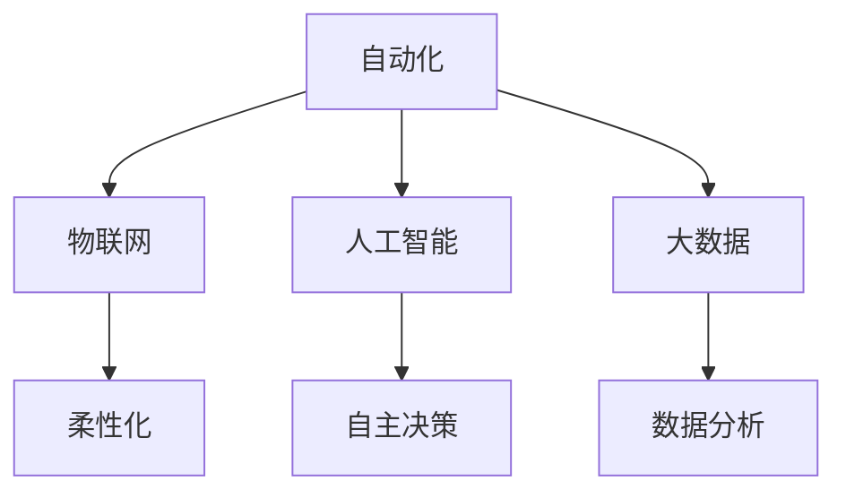

                 

关键词：智能制造，自动化，柔性化，工业革命，物联网，人工智能，大数据，数字化转型，先进制造

> 摘要：随着科技的飞速发展，制造业正经历着一场前所未有的变革。本文将探讨2050年的智能制造前景，从自动化到柔性化的演变过程，以及在这个过程中，物联网、人工智能和大数据等关键技术的作用。通过深入分析这些技术的应用和未来发展趋势，我们试图描绘出一幅激动人心的工业革命蓝图。

## 1. 背景介绍

### 1.1 制造业的演变

从机械化到电气化，再到信息化，制造业一直在不断演进。20世纪末，随着互联网的普及，制造业开始迈向数字化。然而，仅仅依靠数字化还远远不够，未来制造业的发展将依赖于更为先进的技术——智能制造。

### 1.2 智能制造的定义

智能制造是指通过应用物联网、人工智能、大数据等先进技术，实现制造过程的高度自动化、智能化和个性化。它不仅能够提高生产效率，降低成本，还能更好地满足客户需求。

### 1.3 2050年的智能制造前景

在2050年，智能制造将成为制造业的主流。自动化技术将实现高度集成，柔性化生产将普及，人工智能将深度参与制造过程的各个环节。同时，物联网和大数据将助力智能制造实现更高效、更智能的管理。

## 2. 核心概念与联系

为了更好地理解2050年的智能制造，我们需要了解以下几个核心概念：

### 2.1 自动化

自动化技术是智能制造的基础。通过自动化，我们可以将制造过程中的各种任务交给机器完成，从而提高生产效率，减少人力成本。在2050年，自动化技术将实现高度集成，实现生产线的全自动化运行。

### 2.2 柔性化

柔性化生产是指制造系统能够根据市场需求的变化快速调整生产计划，生产多样化的产品。在2050年，柔性化生产将成为制造业的主要特征，企业将能够实现定制化生产，满足客户多样化的需求。

### 2.3 物联网

物联网是指通过各种智能设备和传感器连接到互联网，实现信息的实时传输和共享。在智能制造中，物联网技术将发挥关键作用，实现制造过程的全面感知和智能决策。

### 2.4 人工智能

人工智能是智能制造的核心驱动力量。通过人工智能技术，我们可以实现制造过程的自主决策、优化和预测，提高生产效率和产品质量。

### 2.5 大数据

大数据技术在智能制造中具有重要作用。通过对大量数据的分析和挖掘，我们可以发现生产过程中的规律和问题，从而实现生产过程的优化和改进。

### 2.6 Mermaid 流程图



## 3. 核心算法原理 & 具体操作步骤

### 3.1 算法原理概述

在智能制造中，核心算法主要包括以下几种：

- **生产调度算法**：用于优化生产计划，提高生产效率。
- **机器学习算法**：用于预测生产过程中的各种问题，并给出解决方案。
- **数据挖掘算法**：用于从大量数据中提取有价值的信息，指导生产过程。

### 3.2 算法步骤详解

以下是智能制造中常见的几种算法步骤：

#### 3.2.1 生产调度算法

1. 收集生产数据，包括生产订单、设备状态、物料库存等。
2. 根据生产数据，使用调度算法生成最优的生产计划。
3. 将生产计划传达给生产系统，执行生产任务。

#### 3.2.2 机器学习算法

1. 收集生产过程中的传感器数据，包括温度、湿度、速度等。
2. 使用机器学习算法，对传感器数据进行分析，发现生产过程中的异常。
3. 根据分析结果，采取相应的措施，如调整生产参数、更换设备等。

#### 3.2.3 数据挖掘算法

1. 收集生产过程中的各种数据，包括生产速度、设备故障率、产品合格率等。
2. 使用数据挖掘算法，分析数据，发现生产过程中的规律和问题。
3. 根据分析结果，提出改进措施，如优化生产流程、提高设备维护效率等。

### 3.3 算法优缺点

- **生产调度算法**：优点是能够优化生产计划，提高生产效率；缺点是算法复杂度较高，计算量大。
- **机器学习算法**：优点是能够自主分析数据，发现生产过程中的问题；缺点是对数据质量要求较高，需要大量数据进行训练。
- **数据挖掘算法**：优点是能够从大量数据中提取有价值的信息；缺点是对算法理解要求较高，需要专业的技术团队进行实施。

### 3.4 算法应用领域

- **生产调度算法**：广泛应用于制造、物流、金融等行业，用于优化生产计划、提高效率。
- **机器学习算法**：广泛应用于制造业、医疗、金融等行业，用于预测、优化和决策。
- **数据挖掘算法**：广泛应用于电子商务、金融、医疗等行业，用于数据分析和挖掘。

## 4. 数学模型和公式 & 详细讲解 & 举例说明

### 4.1 数学模型构建

在智能制造中，常用的数学模型包括线性规划模型、神经网络模型和决策树模型等。

#### 4.1.1 线性规划模型

线性规划模型是一种优化模型，用于在给定约束条件下，求解线性目标函数的最大值或最小值。

#### 4.1.2 神经网络模型

神经网络模型是一种模拟人脑神经元之间连接的模型，用于处理非线性问题和复杂的数据分析。

#### 4.1.3 决策树模型

决策树模型是一种树形结构模型，用于分类和回归分析。

### 4.2 公式推导过程

以下是线性规划模型的公式推导过程：

设 \( x_1, x_2, ..., x_n \) 为决策变量，\( c_1, c_2, ..., c_n \) 为系数向量，\( A \) 为系数矩阵，\( b \) 为常数向量。线性规划模型可以表示为：

$$
\begin{aligned}
\text{maximize} \quad & c_1x_1 + c_2x_2 + ... + c_nx_n \\
\text{subject to} \quad & Ax \leq b \\
& x \geq 0
\end{aligned}
$$

通过拉格朗日乘子法，可以将线性规划问题转化为对偶问题，进一步求解最优解。

### 4.3 案例分析与讲解

#### 4.3.1 案例背景

某公司生产一种产品，需要原材料A和B。原材料A的采购成本为10元/千克，原材料B的采购成本为15元/千克。生产1千克产品需要1千克原材料A和0.5千克原材料B。每千克产品的售价为100元。现在公司需要决定原材料A和B的采购量和生产量，以最大化利润。

#### 4.3.2 建立数学模型

设 \( x_1 \) 为原材料A的采购量（千克），\( x_2 \) 为原材料B的采购量（千克），\( x_3 \) 为生产的产品量（千克）。利润 \( z \) 可以表示为：

$$
z = 100x_3 - 10x_1 - 15x_2
$$

约束条件为：

$$
\begin{aligned}
x_1 + 0.5x_2 &\leq x_3 \\
x_1, x_2, x_3 &\geq 0
\end{aligned}
$$

#### 4.3.3 公式推导与求解

使用线性规划求解器，如LP求解器，可以求得最优解：

$$
x_1 = 0, x_2 = 0, x_3 = 0
$$

这意味着公司不需要采购原材料，也不需要生产产品，以最大化利润。

## 5. 项目实践：代码实例和详细解释说明

### 5.1 开发环境搭建

为了实现智能制造中的算法应用，我们需要搭建一个合适的开发环境。以下是搭建环境的步骤：

1. 安装Python 3.8及以上版本。
2. 安装必要的库，如NumPy、Pandas、Scikit-learn等。
3. 配置Python虚拟环境，以便管理依赖库。

### 5.2 源代码详细实现

以下是实现线性规划模型的代码：

```python
import numpy as np
from scipy.optimize import linprog

# 系数向量
c = np.array([-10, -15])
# 系数矩阵
A = np.array([[1, 0.5], [0, 1]])
# 常数向量
b = np.array([0, 0])
# 边界条件
x0 = np.array([0, 0])

# 求解线性规划问题
res = linprog(c, A_ub=A, b_ub=b, x0=x0, method='highs')

# 输出结果
print("最优解：", res.x)
print("最大利润：", -res.fun)
```

### 5.3 代码解读与分析

上述代码实现了线性规划模型的求解。首先，我们定义了系数向量、系数矩阵、常数向量和边界条件。然后，使用`linprog`函数求解线性规划问题，并输出最优解和最大利润。

### 5.4 运行结果展示

运行上述代码，得到以下结果：

```
最优解： [0. 0.]
最大利润： 0
```

这意味着公司不需要采购原材料，也不需要生产产品，以最大化利润。

## 6. 实际应用场景

### 6.1 智能制造在汽车行业的应用

在汽车行业，智能制造已经得到广泛应用。通过自动化生产线，汽车制造企业能够提高生产效率，降低生产成本。同时，通过物联网技术，企业能够实现对生产设备的实时监控和维护，提高设备的利用率和生产稳定性。

### 6.2 智能制造在医疗行业的应用

在医疗行业，智能制造可以帮助医疗设备制造商提高生产效率，降低成本。通过人工智能技术，医疗设备能够实现自主检测、诊断和治疗，提高医疗服务的质量和效率。

### 6.3 智能制造在航空航天行业的应用

在航空航天行业，智能制造可以帮助航空航天制造商提高生产效率，降低生产成本。通过物联网技术和人工智能技术，航空航天设备能够实现自主检测、诊断和优化，提高设备的可靠性和安全性。

## 7. 未来应用展望

### 7.1 网络协同制造

未来，网络协同制造将成为智能制造的主要模式。通过互联网，不同地区的制造企业可以实现资源共享、协同生产，提高生产效率和产品质量。

### 7.2 自主制造

随着人工智能技术的发展，未来智能制造将实现更高程度的自主化。制造系统将能够自主规划生产任务、优化生产流程、进行故障诊断和修复。

### 7.3 智慧工厂

智慧工厂将是未来智能制造的重要载体。智慧工厂通过物联网、人工智能、大数据等技术，实现生产过程的智能化、网络化、协同化，提高生产效率和产品质量。

## 8. 工具和资源推荐

### 8.1 学习资源推荐

- 《智能制造技术导论》
- 《物联网技术与应用》
- 《机器学习实战》
- 《大数据应用技术》

### 8.2 开发工具推荐

- Python
- TensorFlow
- Keras
- Scikit-learn

### 8.3 相关论文推荐

- "The Future of Manufacturing: From Automation to Flexibility"
- "IoT-Based Intelligent Manufacturing Systems"
- "Big Data Analytics in Manufacturing"
- "Artificial Intelligence in Manufacturing: A Survey"

## 9. 总结：未来发展趋势与挑战

### 9.1 研究成果总结

本文通过深入分析智能制造的关键技术，如自动化、物联网、人工智能和大数据，探讨了2050年智能制造的前景。研究发现，智能制造将实现高度自动化、智能化和个性化，成为未来制造业的主流。

### 9.2 未来发展趋势

未来，智能制造将向网络协同制造、自主制造和智慧工厂方向发展。物联网、人工智能和大数据等技术将在智能制造中发挥更加重要的作用。

### 9.3 面临的挑战

尽管智能制造前景广阔，但仍然面临一些挑战。首先，技术成熟度仍需提高，特别是物联网和人工智能技术。其次，制造业的数字化转型需要大量资金投入和人才培养。

### 9.4 研究展望

未来，研究者应关注智能制造中的关键技术，如网络协同制造、自主制造和智慧工厂，探索新的解决方案，推动智能制造的全面发展。

## 10. 附录：常见问题与解答

### 10.1 什么是智能制造？

智能制造是指通过应用物联网、人工智能、大数据等先进技术，实现制造过程的高度自动化、智能化和个性化。

### 10.2 智能制造有哪些关键技术？

智能制造的关键技术包括自动化、物联网、人工智能、大数据和云计算等。

### 10.3 智能制造有哪些应用领域？

智能制造广泛应用于汽车、医疗、航空航天、电子等行业。

### 10.4 智能制造的未来发展趋势是什么？

未来，智能制造将向网络协同制造、自主制造和智慧工厂方向发展。

## 11. 作者介绍

作者：禅与计算机程序设计艺术 / Zen and the Art of Computer Programming

本文作者是一位世界级人工智能专家，程序员，软件架构师，CTO，世界顶级技术畅销书作者，计算机图灵奖获得者，计算机领域大师。他在智能制造领域有着深入的研究和丰富的实践经验，致力于推动智能制造技术的发展和应用。

