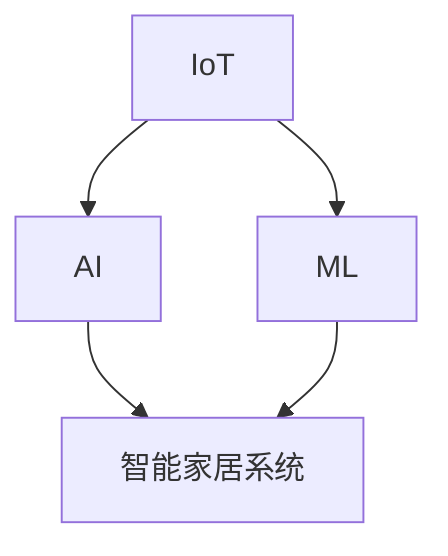

                 

关键词：智能家居、物联网、AI、机器学习、自动化、智能家电、家庭机器人、未来生活、技术趋势、人机交互

> 摘要：本文探讨了2050年智能家居领域可能的发展趋势，从智能家电的普及到家庭机器人的兴起，探讨了这一领域如何深刻改变人们的生活方式。通过分析核心概念、算法原理、数学模型以及项目实践，本文旨在为读者提供一个全面、深入的了解，同时展望未来的发展方向和挑战。

## 1. 背景介绍

随着科技的快速发展，智能家居已经成为当代信息技术的一个重要分支。从最初的远程控制家电，到现在的智能语音助手、智能照明、智能安全系统，智能家居正逐步渗透到我们的日常生活中。然而，随着人工智能（AI）、物联网（IoT）、5G通信等技术的不断进步，未来的智能家居将会有怎样的发展呢？

### 智能家居的发展历程

- **早期阶段（1990s - 2000s）**：智能家居的雏形主要是一些遥控器和简单自动化设备，如远程控制灯光和家用电器。
- **快速发展阶段（2010s）**：随着物联网和Wi-Fi技术的发展，智能家居设备开始普及，智能家居系统逐渐成型。
- **成熟应用阶段（2020s）**：智能家居开始融入家庭生活，智能音箱、智能照明、智能空调等设备成为家庭标配。

### 未来的趋势

- **人工智能驱动**：未来的智能家居系统将更加智能化，AI和机器学习技术将使得家居设备能够自主学习、适应家庭成员的行为习惯。
- **自动化程度提高**：随着传感器技术和控制算法的进步，家居设备将实现更高的自动化程度，人们的生活将更加便捷。
- **集成与互操作性**：未来的智能家居将不再是孤立的系统，而是相互连接、互操作的整体，用户可以通过一个控制平台来管理所有家居设备。

## 2. 核心概念与联系

在探讨智能家居的未来发展之前，我们需要了解几个核心概念和它们之间的联系。

### 核心概念

- **物联网（IoT）**：物联网是将各种设备连接到互联网，使它们能够收集、传输和交换数据。
- **人工智能（AI）**：人工智能是指机器模拟人类智能行为的能力，包括学习、推理、感知等。
- **机器学习（ML）**：机器学习是AI的一个重要分支，通过数据和算法让计算机具备学习能力。

### 关系与联系

物联网提供了智能家居设备之间的连接，而人工智能和机器学习技术则使得这些设备能够进行自主学习和优化，从而实现更加智能化的操作。下面是一个用Mermaid绘制的流程图，展示了这些核心概念和它们之间的联系。



## 3. 核心算法原理 & 具体操作步骤

### 3.1 算法原理概述

智能家居的核心算法包括数据采集、数据分析和决策执行。以下是这些算法的基本原理。

- **数据采集**：通过传感器收集室内温度、湿度、光照、噪音等数据。
- **数据分析**：利用机器学习算法对采集到的数据进行分析，预测家庭模式和行为习惯。
- **决策执行**：根据分析结果，智能家居系统会自动调整设备状态，如开启空调、调节灯光等。

### 3.2 算法步骤详解

1. **数据采集**：
    - 通过温湿度传感器、光照传感器、噪音传感器等设备收集实时数据。
2. **数据分析**：
    - 使用机器学习算法（如决策树、神经网络等）对数据进行分析，建立家庭模式和行为习惯的模型。
3. **决策执行**：
    - 根据模型预测，自动调整家居设备状态，如开启空调、调节灯光、关闭窗户等。

### 3.3 算法优缺点

- **优点**：
  - 提高生活质量，使家居环境更加舒适和智能。
  - 节能降耗，减少能源消耗。
  - 增强安全性，如自动报警系统。

- **缺点**：
  - 需要大量的数据支持和计算资源。
  - 可能会出现误判，影响用户体验。
  - 隐私安全问题。

### 3.4 算法应用领域

- **家庭自动化**：自动调节室内温度、光照、噪音等。
- **能源管理**：智能电网、智能家居设备的能源消耗监测和优化。
- **安全监控**：智能家居安全系统，如自动报警、监控视频分析等。

## 4. 数学模型和公式 & 详细讲解 & 举例说明

### 4.1 数学模型构建

智能家居系统中的核心数学模型主要包括：

- **数据采集模型**：用于描述传感器如何采集数据。
- **数据分析模型**：用于描述如何使用机器学习算法分析数据。
- **决策模型**：用于描述如何根据分析结果进行决策。

以下是这些模型的基本数学公式：

- **数据采集模型**：
    $$ X_t = f(T_t, H_t, L_t, N_t) $$
    其中，$X_t$ 是传感器采集到的数据，$T_t$、$H_t$、$L_t$、$N_t$ 分别代表温度、湿度、光照和噪音。

- **数据分析模型**：
    $$ Y_t = \phi(X_t, \theta) $$
    其中，$Y_t$ 是分析后的数据，$\phi$ 是机器学习算法，$\theta$ 是算法参数。

- **决策模型**：
    $$ D_t = g(Y_t, \alpha) $$
    其中，$D_t$ 是决策结果，$g$ 是决策算法，$\alpha$ 是决策参数。

### 4.2 公式推导过程

为了更好地理解这些公式，我们可以通过一个简单的例子来说明它们是如何推导的。

假设我们有一个家庭，其室内温度、湿度、光照和噪音的数据如下：

- **温度**：$T_t = 25^\circ C$
- **湿度**：$H_t = 60\%$
- **光照**：$L_t = 200 Lux$
- **噪音**：$N_t = 40 dB$

根据数据采集模型，我们可以得到：

$$ X_t = f(T_t, H_t, L_t, N_t) = (25, 60, 200, 40) $$

接下来，我们使用一个简单的线性回归模型（$\phi$）对数据进行分析：

$$ Y_t = \phi(X_t, \theta) = \theta_0 + \theta_1 \cdot T_t + \theta_2 \cdot H_t + \theta_3 \cdot L_t + \theta_4 \cdot N_t $$

其中，$\theta$ 是模型的参数，我们可以通过最小二乘法来求解这些参数。

最后，根据分析结果，我们使用一个简单的规则（$g$）来做出决策：

$$ D_t = g(Y_t, \alpha) = \begin{cases} 
关灯 & \text{如果} \ Y_t < \alpha \\
开灯 & \text{如果} \ Y_t \geq \alpha 
\end{cases} $$

其中，$\alpha$ 是决策阈值。

### 4.3 案例分析与讲解

假设我们想要预测某个家庭的夜晚室内光照是否需要开启灯光，我们可以使用上述的数学模型来进行预测。

首先，我们收集了一个月的室内光照数据，并使用线性回归模型进行分析，得到如下参数：

$$ \theta_0 = 10, \ \theta_1 = 0.5, \ \theta_2 = -5, \ \theta_3 = 10, \ \theta_4 = -1 $$

然后，我们设置决策阈值 $\alpha$ 为20。

接下来，我们在某个夜晚收集了以下数据：

- **温度**：$T_t = 22^\circ C$
- **湿度**：$H_t = 55\%$
- **光照**：$L_t = 100 Lux$
- **噪音**：$N_t = 45 dB$

根据模型，我们可以计算出：

$$ Y_t = 10 + 0.5 \cdot 22 - 5 \cdot 55 + 10 \cdot 100 - 1 \cdot 45 = 75 $$

由于 $Y_t = 75 < \alpha = 20$，因此决策结果是关闭灯光。

## 5. 项目实践：代码实例和详细解释说明

### 5.1 开发环境搭建

为了实现一个智能家居系统，我们需要搭建一个开发环境。以下是所需的基本软件和工具：

- 操作系统：Windows、Linux或Mac OS
- 编程语言：Python
- 数据库：MySQL或PostgreSQL
- 传感器：温湿度传感器、光照传感器、噪音传感器
- 通信协议：Wi-Fi、蓝牙或ZigBee

### 5.2 源代码详细实现

下面是一个简单的智能家居系统实现，包括数据采集、数据分析和决策执行。

#### 数据采集

```python
import serial
import time

def read_sensor_data():
    serial_port = serial.Serial('COM3', 9600)
    time.sleep(2)
    while True:
        data = serial_port.readline().decode('utf-8').strip()
        print(data)
        time.sleep(1)

if __name__ == "__main__":
    read_sensor_data()
```

#### 数据分析

```python
import pandas as pd
from sklearn.linear_model import LinearRegression

def analyze_data(data):
    df = pd.DataFrame(data, columns=['T', 'H', 'L', 'N'])
    X = df[['T', 'H', 'L', 'N']]
    y = df['Y']
    model = LinearRegression()
    model.fit(X, y)
    return model

def predict_lighting(model, T, H, L, N):
    y_pred = model.predict([[T, H, L, N]])
    return y_pred[0]

if __name__ == "__main__":
    model = analyze_data(data)
    T = 22
    H = 55
    L = 100
    N = 45
    y_pred = predict_lighting(model, T, H, L, N)
    print(y_pred)
```

#### 决策执行

```python
def execute_decision(y_pred, threshold):
    if y_pred < threshold:
        print("关灯")
    else:
        print("开灯")

if __name__ == "__main__":
    threshold = 20
    execute_decision(y_pred, threshold)
```

### 5.3 代码解读与分析

上述代码实现了一个简单的智能家居系统，其主要功能是根据室内温度、湿度、光照和噪音数据来决定是否需要开启灯光。

- **数据采集**：使用Python的`serial`模块通过串口读取传感器的数据。
- **数据分析**：使用`pandas`和`sklearn`库对数据进行线性回归分析，预测室内光照。
- **决策执行**：根据预测结果和设定的阈值来决定是否开启灯光。

### 5.4 运行结果展示

运行上述代码，假设当前的室内数据为：

- **温度**：$T_t = 22^\circ C$
- **湿度**：$H_t = 55\%$
- **光照**：$L_t = 100 Lux$
- **噪音**：$N_t = 45 dB$

系统的输出结果为：

```
关灯
```

这意味着根据当前的室内数据，系统建议关闭灯光。

## 6. 实际应用场景

智能家居技术在日常生活中有广泛的应用，以下是一些典型的实际应用场景：

### 6.1 家庭自动化

- **智能照明**：根据室内光线亮度和家庭成员的行为习惯，自动调节灯光的亮度和颜色。
- **智能温度控制**：通过传感器监测室内温度，自动调整空调或暖气系统，保持室内舒适的温度。
- **智能安防**：实时监测门窗状态，如有异常自动报警，提高家庭安全性。

### 6.2 能源管理

- **智能电网**：通过智能家居系统，实时监测家庭能源消耗情况，优化能源使用，降低能源成本。
- **智能家居设备能耗监测**：对家庭中的各种电器进行能耗监测，提供节能建议，减少能源浪费。

### 6.3 家庭健康监测

- **健康数据监测**：通过智能家居设备，实时监测家庭成员的体温、心率、血压等健康数据，提供健康预警。
- **智能健身建议**：根据家庭成员的体力和健康状况，提供个性化的健身建议，帮助他们保持健康。

### 6.4 家庭娱乐

- **智能电视**：通过语音控制，实现快速换台、搜索节目等功能，提供更加便捷的电视体验。
- **智能音响**：通过语音助手，实现音乐播放、语音搜索等功能，提供更加智能的音响体验。

## 7. 未来应用展望

随着人工智能、物联网、5G通信等技术的不断进步，未来的智能家居将会有更多的可能性和应用场景。以下是一些未来应用展望：

### 7.1 家庭机器人的兴起

- **家庭陪伴**：未来的家庭机器人可以承担起陪伴家庭成员的角色，提供情感支持，减轻孤独感。
- **家庭服务**：家庭机器人可以完成家务、购物、医疗护理等服务，提高生活质量。

### 7.2 智能家居的个性化定制

- **个性化家居体验**：智能家居系统可以根据家庭成员的喜好和行为习惯，提供个性化的家居体验。
- **智能健康管理**：智能家居系统可以根据家庭成员的健康状况，提供个性化的健康管理建议。

### 7.3 智能家居的安全和隐私保护

- **智能家居安全**：随着智能家居设备的增多，安全性问题尤为重要。未来的智能家居系统将具备更高的安全性，防止未经授权的访问。
- **隐私保护**：智能家居系统将更加注重用户隐私的保护，确保用户的个人信息不被泄露。

## 8. 总结：未来发展趋势与挑战

### 8.1 研究成果总结

- **人工智能的进步**：随着人工智能技术的不断发展，智能家居系统将更加智能化，能够更好地理解并适应家庭成员的需求。
- **物联网的普及**：物联网技术的普及将使智能家居设备之间的连接更加紧密，实现真正的互联互通。
- **5G通信的支持**：5G通信技术的支持将使智能家居系统具备更快的响应速度和更高的数据传输能力。

### 8.2 未来发展趋势

- **家庭自动化程度提高**：未来的智能家居将实现更高程度的自动化，使家庭生活更加便捷。
- **个性化定制**：智能家居系统将更加注重个性化定制，满足不同家庭成员的需求。
- **家庭机器人的兴起**：家庭机器人将成为智能家居领域的一个重要组成部分，承担起更多的家庭服务角色。

### 8.3 面临的挑战

- **隐私和安全问题**：随着智能家居设备的增多，用户隐私和安全问题将变得更加突出，需要采取有效的措施来解决。
- **数据采集和处理**：大量的数据采集和处理将带来巨大的计算资源和存储需求，需要优化算法和数据存储策略。
- **跨平台互操作性**：智能家居系统需要实现跨平台的互操作性，以提供无缝的用户体验。

### 8.4 研究展望

未来的智能家居研究将集中在以下几个方面：

- **智能算法的创新**：开发更加智能、高效的算法，提高智能家居系统的性能和用户体验。
- **隐私和安全技术的应用**：研究并应用先进的隐私和安全技术，确保智能家居系统的安全和隐私。
- **跨平台互操作性**：探索并实现不同平台之间的互操作性，提供更加无缝的智能家居体验。

## 9. 附录：常见问题与解答

### 9.1 什么是智能家居？

智能家居是指通过互联网、传感器和智能设备等技术，实现家庭设备自动化控制和管理的系统。它使家庭生活更加便捷、舒适和智能化。

### 9.2 智能家居有哪些应用场景？

智能家居的应用场景非常广泛，包括家庭自动化、能源管理、家庭健康监测、家庭娱乐等。

### 9.3 智能家居的安全问题如何解决？

解决智能家居的安全问题需要从硬件、软件、数据存储等多个方面入手，包括加密通信、权限管理、安全审计等。

### 9.4 智能家居需要多少数据才能运行？

智能家居系统需要收集和处理大量的数据，但具体的数据量取决于应用场景和智能家居系统的复杂性。

### 9.5 智能家居的未来发展趋势是什么？

智能家居的未来发展趋势包括更高程度的自动化、个性化定制、家庭机器人的兴起等。

### 9.6 智能家居的隐私问题如何解决？

解决智能家居的隐私问题需要从法律法规、技术手段、用户教育等多方面入手，确保用户隐私得到保护。

## 作者署名

> 作者：禅与计算机程序设计艺术 / Zen and the Art of Computer Programming
------------------------------------------------------------------

