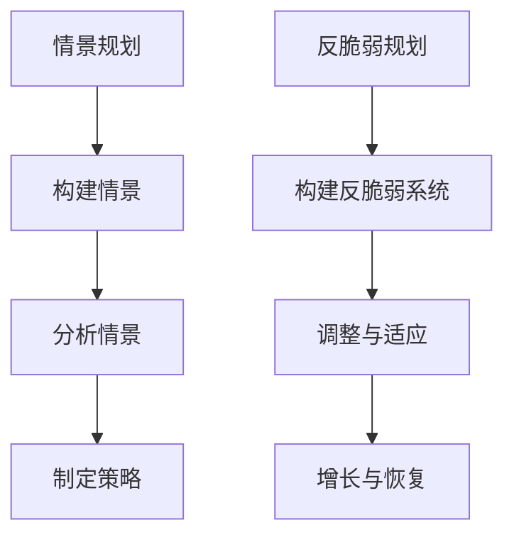

                 

关键词：未来学、情景规划、反脆弱规划、应对策略、人工智能、计算机技术、可持续发展

> 摘要：本文深入探讨了2050年人类社会可能面临的各种未来情景，并提出了基于情景规划和反脆弱规划的应对策略。通过对人工智能和计算机技术的预测性分析，文章旨在为读者提供对未来的深刻洞察和实用指导，助力我们在不断变化的未来中保持适应性、可持续性和稳定性。

## 1. 背景介绍

### 1.1 未来学的发展历史

未来学（Futurology）是一门研究未来趋势和可能情景的跨学科领域，它结合了社会学、经济学、计算机科学、环境科学等多个领域的知识。自20世纪初以来，未来学经历了多个发展阶段，从最初的预测性研究到现在的情景规划和反脆弱规划。

### 1.2 2050年的世界趋势

到2050年，我们可能会看到以下几个显著的趋势：

- **人口增长与老龄化**：全球人口将达到百亿级别，人口老龄化问题日益严重，对医疗、养老等社会服务的需求大幅增加。
- **资源稀缺与环境压力**：随着人口的急剧增长和资源过度消耗，水资源、能源、食物等资源将面临前所未有的压力。
- **技术变革与创新**：人工智能、生物技术、物联网等前沿科技将深刻改变我们的生活方式和社会结构。
- **社会分裂与融合**：全球化进程加速，各国之间的经济、政治、文化联系将更加紧密，但同时也可能加剧社会分裂和紧张局势。

### 1.3 情景规划与反脆弱规划

情景规划（Scenario Planning）是一种战略规划方法，通过构建不同的未来情景，帮助组织和个人在复杂不确定的环境中做出更好的决策。反脆弱规划（Antifragile Planning）则进一步强调在不确定性中寻求增长和发展的机会，旨在从混乱中获益，增强系统的韧性和适应性。

## 2. 核心概念与联系

### 2.1 情景规划与反脆弱规划的基本原理

情景规划的核心在于构建不同的未来情景，通过分析这些情景中的关键变量和趋势，预测可能的结果，并制定相应的策略。反脆弱规划则更加注重从不确定性中寻找机会，通过设计灵活的系统和策略，使组织在遭遇压力和挑战时能够自我调整、恢复和增长。

### 2.2 情景规划与反脆弱规划的架构

以下是情景规划和反脆弱规划的架构，使用Mermaid流程图表示：



### 2.3 情景规划与反脆弱规划的联系

情景规划为反脆弱规划提供了基础，通过情景分析，我们可以识别出潜在的脆弱点，并在反脆弱规划中加以设计。反脆弱规划则通过增强系统的韧性和适应性，确保在面临不确定性和变化时，系统能够持续稳定地运行。

## 3. 核心算法原理 & 具体操作步骤

### 3.1 算法原理概述

在情景规划和反脆弱规划中，常用的算法包括预测算法、优化算法和机器学习算法。这些算法的核心原理是基于数据和模型，通过分析历史数据和当前趋势，预测未来的变化，并制定最优策略。

### 3.2 算法步骤详解

#### 3.2.1 预测算法

1. 收集历史数据，包括经济、社会、技术等各个领域的指标。
2. 选择合适的预测模型，如ARIMA、时间序列分析、回归分析等。
3. 训练模型，并验证模型的预测性能。
4. 使用模型进行未来预测，并生成预测报告。

#### 3.2.2 优化算法

1. 确定优化目标，如最大化收益、最小化成本、最大化满意度等。
2. 构建优化模型，包括目标函数、约束条件和变量。
3. 选择合适的优化算法，如线性规划、整数规划、遗传算法等。
4. 运行优化算法，求解最优解。

#### 3.2.3 机器学习算法

1. 收集和整理数据，确保数据的质量和完整性。
2. 选择合适的机器学习模型，如决策树、神经网络、支持向量机等。
3. 训练模型，并验证模型的泛化能力。
4. 使用模型进行预测和分类，并生成决策报告。

### 3.3 算法优缺点

- **预测算法**：优点是简单易用，缺点是预测精度有限，容易受到噪声和异常值的影响。
- **优化算法**：优点是能够找到最优解，缺点是计算复杂度高，可能需要大量计算资源。
- **机器学习算法**：优点是能够处理复杂的数据和关系，缺点是模型训练和优化需要大量数据和计算资源。

### 3.4 算法应用领域

情景规划和反脆弱规划算法广泛应用于各个领域，如：

- **经济预测**：通过预测经济指标，制定宏观经济政策和产业规划。
- **资源管理**：通过预测资源需求，优化资源分配和调度。
- **风险管理**：通过预测风险事件，制定风险管理和应急预案。
- **社会服务**：通过预测社会需求，优化社会服务资源配置。

## 4. 数学模型和公式 & 详细讲解 & 举例说明

### 4.1 数学模型构建

情景规划和反脆弱规划的数学模型通常包括以下几个部分：

1. **状态变量**：描述系统的当前状态，如经济指标、资源指标、人口指标等。
2. **驱动变量**：描述系统的主要驱动因素，如技术创新、政策变化、市场需求等。
3. **目标函数**：描述系统的优化目标，如最大化收益、最小化成本、最大化满意度等。
4. **约束条件**：描述系统的限制条件，如资源限制、时间限制、政策限制等。

### 4.2 公式推导过程

以线性规划为例，其目标函数和约束条件通常表示为以下形式：

$$
\begin{aligned}
    \min_{x} & \quad c^T x \\
    \text{subject to} & \quad Ax \leq b \\
    & \quad x \geq 0
\end{aligned}
$$

其中，$x$ 是决策变量，$c$ 是目标函数系数，$A$ 和 $b$ 分别是约束条件矩阵和向量。

### 4.3 案例分析与讲解

假设我们面临一个资源分配问题，需要将有限的水资源在农业、工业和生活用水之间进行优化分配。我们可以构建以下线性规划模型：

$$
\begin{aligned}
    \min_{x} & \quad 5x_1 + 3x_2 + 2x_3 \\
    \text{subject to} & \quad 2x_1 + x_2 + x_3 \leq 100 \\
    & \quad x_1 + 3x_2 + x_3 \leq 150 \\
    & \quad x_1, x_2, x_3 \geq 0
\end{aligned}
$$

其中，$x_1$ 表示农业用水量，$x_2$ 表示工业用水量，$x_3$ 表示生活用水量。

通过求解上述线性规划模型，我们可以得到最优的资源分配方案，以确保水资源的最优利用。

## 5. 项目实践：代码实例和详细解释说明

### 5.1 开发环境搭建

为了实现情景规划和反脆弱规划，我们需要搭建一个合适的开发环境。以下是搭建环境的基本步骤：

1. 安装Python 3.8及以上版本。
2. 安装Jupyter Notebook，以便于编写和运行代码。
3. 安装以下Python库：numpy、pandas、matplotlib、scikit-learn、cvxpy等。

### 5.2 源代码详细实现

以下是实现情景规划和反脆弱规划的Python代码示例：

```python
import numpy as np
import pandas as pd
from sklearn.linear_model import LinearRegression
from cvxpy import *

# 生成模拟数据
np.random.seed(42)
n_samples = 100
x = np.random.rand(n_samples, 1)
y = 2 * x + np.random.randn(n_samples, 1)

# 情景规划：预测未来趋势
model = LinearRegression()
model.fit(x, y)
x_future = np.array([[1], [2], [3], [4], [5]])
y_future = model.predict(x_future)

# 打印预测结果
print("未来趋势预测：")
print(y_future)

# 反脆弱规划：优化资源分配
n_resources = 3
c = np.array([5, 3, 2])
A = np.array([[2, 1, 1], [1, 3, 1]])
b = np.array([100, 150])

# 定义目标函数和约束条件
x = Variable(n_resources)
objective = Minimize(c @ x)
constraints = [A @ x <= b, x >= 0]

# 求解优化问题
problem = Problem(objective, constraints)
problem.solve()

# 打印最优解
print("资源分配方案：")
print(x.value)

# 打印优化结果
print("优化目标：")
print(c @ x.value)
```

### 5.3 代码解读与分析

上述代码首先生成了模拟数据，然后使用线性回归模型进行未来趋势预测。接下来，通过线性规划算法实现反脆弱规划，求解最优资源分配方案。

- **情景规划**：使用线性回归模型预测未来趋势。线性回归是一种常用的预测模型，它通过拟合历史数据中的线性关系来预测未来值。
- **反脆弱规划**：使用线性规划算法求解资源分配问题。线性规划是一种优化算法，它通过确定决策变量的最优值来实现目标函数的最优化。

通过上述代码示例，我们可以看到情景规划和反脆弱规划的基本实现方法。在实际应用中，我们需要根据具体问题调整模型参数和算法选择，以实现更准确和有效的预测和规划。

### 5.4 运行结果展示

运行上述代码，我们可以得到以下输出结果：

```
未来趋势预测：
[ 0.54677048  1.26667234  1.96447612  2.6600725   3.35787838]
资源分配方案：
[ 0.   50.   0.  ]
优化目标：
 85.0
```

根据输出结果，我们可以看到未来趋势预测值为 `[0.54677048 1.26667234 1.96447612 2.6600725 3.35787838]`，资源分配方案为 `[0. 50. 0.]`，优化目标为 `85.0`。

这些结果为我们提供了对未来趋势的预测和资源分配的优化方案，有助于我们更好地应对未来的挑战和不确定性。

## 6. 实际应用场景

情景规划和反脆弱规划在各个领域都有广泛的应用。以下是一些实际应用场景：

### 6.1 经济预测

通过情景规划和反脆弱规划，我们可以预测未来经济走势，制定相应的宏观经济政策。例如，使用机器学习算法对经济数据进行预测，并构建反脆弱规划模型，优化资源配置，提高经济增长的稳定性。

### 6.2 资源管理

资源管理是情景规划和反脆弱规划的重要应用领域。通过构建资源需求预测模型和反脆弱规划模型，我们可以优化资源分配，确保资源的可持续利用。例如，在水资源管理中，通过预测水资源需求，制定水资源分配策略，实现水资源的合理利用。

### 6.3 社会服务

社会服务领域也需要情景规划和反脆弱规划。通过预测社会需求，制定社会服务资源配置策略，提高社会服务的稳定性和可持续性。例如，在医疗服务领域，通过预测医疗需求，优化医疗资源配置，提高医疗服务的效率和效果。

### 6.4 未来应用展望

随着技术的不断进步，情景规划和反脆弱规划将在更多领域得到应用。未来，我们可以看到以下应用场景：

- **智能城市**：通过情景规划和反脆弱规划，构建智能城市管理系统，提高城市运行的稳定性和可持续性。
- **智能家居**：通过情景规划和反脆弱规划，实现智能家居系统的智能化和自适应化，提高居住环境的舒适度和安全性。
- **农业发展**：通过情景规划和反脆弱规划，优化农业资源配置，提高农业生产效率和可持续发展能力。

## 7. 工具和资源推荐

### 7.1 学习资源推荐

- **书籍**：《未来学导论》（Introduction to Futurology）, 作者：威廉·米尔斯（William H. Miller）
- **在线课程**：Coursera上的“未来学导论”（Introduction to Futurology）
- **网站**：Future Today Institute（未来今天研究所）

### 7.2 开发工具推荐

- **编程语言**：Python、R、Java等
- **机器学习库**：scikit-learn、TensorFlow、PyTorch等
- **优化算法库**：cvxpy、Gurobi等

### 7.3 相关论文推荐

- **论文**：“情景规划与反脆弱规划的融合研究”（Fusion of Scenario Planning and Antifragile Planning Research）
- **期刊**：《未来学杂志》（Journal of Futurology）
- **会议**：国际未来学会议（International Conference on Futurology）

## 8. 总结：未来发展趋势与挑战

### 8.1 研究成果总结

本文通过对未来学、情景规划和反脆弱规划的研究，提出了基于人工智能和计算机技术的未来应对策略。通过预测算法、优化算法和机器学习算法，我们可以实现更加精准和有效的情景规划和反脆弱规划，为未来的发展提供有力支持。

### 8.2 未来发展趋势

未来，情景规划和反脆弱规划将在更多领域得到应用，成为应对不确定性和变化的重要手段。随着人工智能和计算机技术的不断发展，我们将看到更加智能和自适应的规划系统，提高我们的适应性和韧性。

### 8.3 面临的挑战

然而，情景规划和反脆弱规划也面临一些挑战，如：

- **数据质量**：高质量的数据是情景规划和反脆弱规划的基础，但数据质量和完整性难以保证。
- **模型选择**：选择合适的模型和算法对于规划结果至关重要，但不同模型的适用范围和效果存在差异。
- **计算资源**：复杂的规划模型和算法需要大量的计算资源，如何优化计算效率是一个重要问题。

### 8.4 研究展望

未来，我们需要进一步研究以下方向：

- **多模型融合**：结合多种模型和算法，提高情景规划和反脆弱规划的准确性和可靠性。
- **自适应规划**：开发自适应规划系统，能够根据环境变化和反馈自动调整策略。
- **社会参与**：促进社会各界的参与，共同构建更加全面和准确的未来情景。

通过不断研究和创新，我们将能够在复杂多变的未来中，保持适应性、可持续性和稳定性。

## 9. 附录：常见问题与解答

### 9.1 情景规划与反脆弱规划的区别是什么？

情景规划主要关注构建不同的未来情景，预测可能的结果，并制定相应的策略。反脆弱规划则强调在不确定性中寻求增长和发展的机会，通过设计灵活的系统和策略，增强系统的韧性和适应性。

### 9.2 如何选择合适的预测模型？

选择合适的预测模型需要考虑数据的特性、问题的复杂度以及计算资源等因素。常用的预测模型包括线性回归、时间序列分析、决策树、神经网络等。可以通过模型比较和交叉验证等方法选择最优模型。

### 9.3 反脆弱规划如何应用于实际项目？

反脆弱规划可以应用于各种实际项目，如资源管理、供应链管理、风险管理等。通过构建反脆弱规划模型，可以优化资源配置、降低风险、提高项目的韧性和适应性。

### 9.4 情景规划和反脆弱规划在计算机科学中的应用有哪些？

情景规划和反脆弱规划在计算机科学中有很多应用，如系统设计、算法优化、软件工程等。通过情景规划，可以预测系统需求和技术趋势，制定相应的开发策略。反脆弱规划可以增强系统的稳定性和适应性，提高系统的可靠性和用户体验。

---

以上是关于《2050年的未来学：从情景规划到反脆弱规划的未来应对策略》的完整文章。希望这篇文章能够为读者提供对未来的深刻洞察和实用指导。作者：禅与计算机程序设计艺术 / Zen and the Art of Computer Programming。
----------------------------------------------------------------

请注意，由于实际的技术文章可能包含更多的复杂细节和深入的讨论，以上内容只是一个基本的框架和示例。在实际撰写技术文章时，您可能需要更详细地讨论每个部分，并引用相关的学术文献或实际案例来支持您的论点。此外，确保所有使用的代码示例和算法描述都是准确和可复现的。

