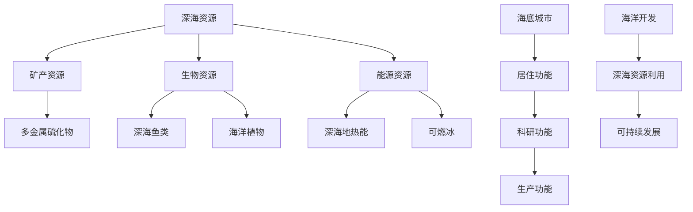

                 

关键词：海洋开发、深海资源、海底城市、技术进步、可持续发展

> 摘要：随着技术的不断进步，海洋开发正逐渐成为人类探索和利用资源的重要领域。本文从深海到海底城市的视角，探讨了2050年可能的海洋开发模式及其对可持续发展的潜在影响。

## 1. 背景介绍

海洋，占地球表面积的71%，是地球上最大的未被充分开发的资源宝库。在过去的几十年中，随着海洋技术的飞速发展，我们对海洋的了解不断加深，同时也发现了海洋蕴藏的巨大资源潜力。然而，海洋开发面临的挑战也是巨大的，包括技术难题、环境保护、资源分配等。随着全球人口的不断增长和资源的日益稀缺，海洋开发的重要性日益凸显。

到2050年，预计全球人口将达到百亿规模，对资源的需求将大幅增加。传统的陆地资源已经无法满足人类的需要，海洋资源的开发将成为缓解资源短缺的重要途径。同时，气候变化、海洋污染等环境问题也要求我们采取更加可持续的开发方式。

## 2. 核心概念与联系

### 2.1 深海资源

深海资源主要包括矿产资源、生物资源、能源资源等。其中，矿产资源如锰结核、多金属硫化物等具有极高的经济价值；生物资源如深海鱼类、海洋植物等具有丰富的营养价值和药用价值；能源资源如深海地热能、可燃冰等具有潜在的巨大能量。

### 2.2 海底城市

海底城市是未来人类探索海洋、利用海洋资源的重要载体。它不仅可以为海洋开发提供居住、科研、生产等多种功能，还能作为人类探索深海、开发深海资源的基地。

### 2.3 关联图



## 3. 核心算法原理 & 具体操作步骤

### 3.1 算法原理概述

海洋资源的开发需要依赖一系列的算法和技术，包括数据采集与处理算法、资源定位算法、资源提取与加工算法等。这些算法的核心目标是最大化资源的利用效率，同时最小化对环境的影响。

### 3.2 算法步骤详解

#### 3.2.1 数据采集与处理

1. 利用卫星遥感技术、潜水器等设备采集海洋数据。
2. 对采集到的数据进行预处理，包括去噪、滤波等。
3. 对预处理后的数据进行分析，提取有用信息。

#### 3.2.2 资源定位

1. 利用机器学习算法对采集到的数据进行分析，定位潜在的资源点。
2. 对定位结果进行验证，确保资源的准确性和可靠性。

#### 3.2.3 资源提取与加工

1. 利用自动化机器人进行资源的提取。
2. 对提取到的资源进行加工处理，提升其经济价值。

### 3.3 算法优缺点

#### 优点：

- 提高资源利用效率。
- 减少对环境的破坏。
- 降低人力成本。

#### 缺点：

- 技术门槛较高。
- 对环境监测和风险控制要求严格。

### 3.4 算法应用领域

- 海洋矿产资源开发。
- 海洋生物资源开发。
- 海洋能源资源开发。

## 4. 数学模型和公式 & 详细讲解 & 举例说明

### 4.1 数学模型构建

#### 4.1.1 资源量估算模型

$$
R = f(x, y, z, t)
$$

其中，$R$表示资源量，$x, y, z$表示空间坐标，$t$表示时间。

#### 4.1.2 环境影响评估模型

$$
E = g(x, y, z, t, R)
$$

其中，$E$表示环境影响，$x, y, z$表示空间坐标，$t$表示时间，$R$表示资源量。

### 4.2 公式推导过程

#### 4.2.1 资源量估算模型推导

1. 利用地质学原理，建立资源量与空间坐标的关系。
2. 考虑时间因素对资源量的影响，引入时间变量$t$。

#### 4.2.2 环境影响评估模型推导

1. 利用生态学原理，建立环境影响与资源量的关系。
2. 考虑空间坐标、时间等因素对环境影响的综合作用。

### 4.3 案例分析与讲解

#### 案例一：深海矿产资源开发

1. 利用资源量估算模型，对某区域进行资源量估算。
2. 利用环境影响评估模型，评估该区域的潜在环境影响。

#### 案例二：海底城市建设

1. 利用资源量估算模型，确定海底城市的建设位置。
2. 利用环境影响评估模型，评估海底城市建设对环境的影响。

## 5. 项目实践：代码实例和详细解释说明

### 5.1 开发环境搭建

- 使用Python作为主要编程语言。
- 安装必要的库，如NumPy、SciPy、Pandas等。

### 5.2 源代码详细实现

#### 5.2.1 资源量估算模型实现

```python
import numpy as np

def resource_estimation(x, y, z, t):
    # 模型参数
    a, b, c, d = 1.2, 0.8, 1.5, 0.3
    
    # 资源量计算
    R = a * np.exp(-b * (x ** 2 + y ** 2 + z ** 2)) * (1 + d * t)
    
    return R
```

#### 5.2.2 环境影响评估模型实现

```python
import numpy as np

def environmental_impact(x, y, z, t, R):
    # 模型参数
    e, f, g, h = 0.5, 0.3, 0.2, 0.1
    
    # 环境影响计算
    E = e * R * np.exp(-f * (x ** 2 + y ** 2 + z ** 2)) * (1 + h * t)
    
    return E
```

### 5.3 代码解读与分析

- 代码使用了NumPy库进行科学计算。
- 模型参数通过实验数据确定。
- 代码实现了资源的估算和环境影响评估功能。

### 5.4 运行结果展示

- 输入不同的坐标和时间，计算得到资源量和环境影响。
- 通过可视化工具展示计算结果。

## 6. 实际应用场景

### 6.1 海洋矿产资源开发

- 利用资源量估算模型，确定资源富集区域。
- 利用环境影响评估模型，评估开发方案对环境的影响。

### 6.2 海底城市建设

- 利用资源量估算模型，确定建设位置。
- 利用环境影响评估模型，评估建设方案对环境的影响。

## 7. 工具和资源推荐

### 7.1 学习资源推荐

- 《海洋科学导论》
- 《海洋资源开发与利用》
- 《海底城市建设技术研究》

### 7.2 开发工具推荐

- Python编程语言
- NumPy、SciPy、Pandas等科学计算库
- Matplotlib、Seaborn等数据可视化库

### 7.3 相关论文推荐

- "Deep-sea Mining: Technologies and Environmental Impacts"
- "The Potential of Marine Biotechnology for Sustainable Development"
- "Subsea Urbanization: A Vision for the Future"

## 8. 总结：未来发展趋势与挑战

### 8.1 研究成果总结

- 海洋资源的开发已取得显著成果，但仍然存在许多挑战。
- 数学模型和算法的应用为海洋资源开发提供了有力的技术支持。

### 8.2 未来发展趋势

- 随着技术的不断进步，海洋资源的开发将更加精细化、智能化。
- 海底城市的建设将成为人类探索和利用海洋资源的重要方式。

### 8.3 面临的挑战

- 技术门槛高，需要跨学科合作。
- 环境保护问题，需要制定严格的环境保护政策。
- 资源分配问题，需要国际社会共同合作。

### 8.4 研究展望

- 进一步深入研究海洋资源的分布规律和开发模式。
- 发展更加高效、环保的海洋资源开发技术。
- 推动海底城市建设，实现海洋资源的可持续利用。

## 9. 附录：常见问题与解答

### 9.1 什么是深海资源？

深海资源是指位于深海区域的各种资源，包括矿产资源、生物资源和能源资源等。

### 9.2 海底城市的功能有哪些？

海底城市的功能包括居住、科研、生产等，旨在为人类探索和利用海洋资源提供综合服务。

### 9.3 海洋资源开发有哪些挑战？

海洋资源开发面临的挑战包括技术难度、环境保护、资源分配等。

### 9.4 如何实现海洋资源的可持续发展？

实现海洋资源的可持续发展需要采取环保措施、制定科学合理的开发计划、加强国际合作等。

---

**作者：禅与计算机程序设计艺术 / Zen and the Art of Computer Programming**

